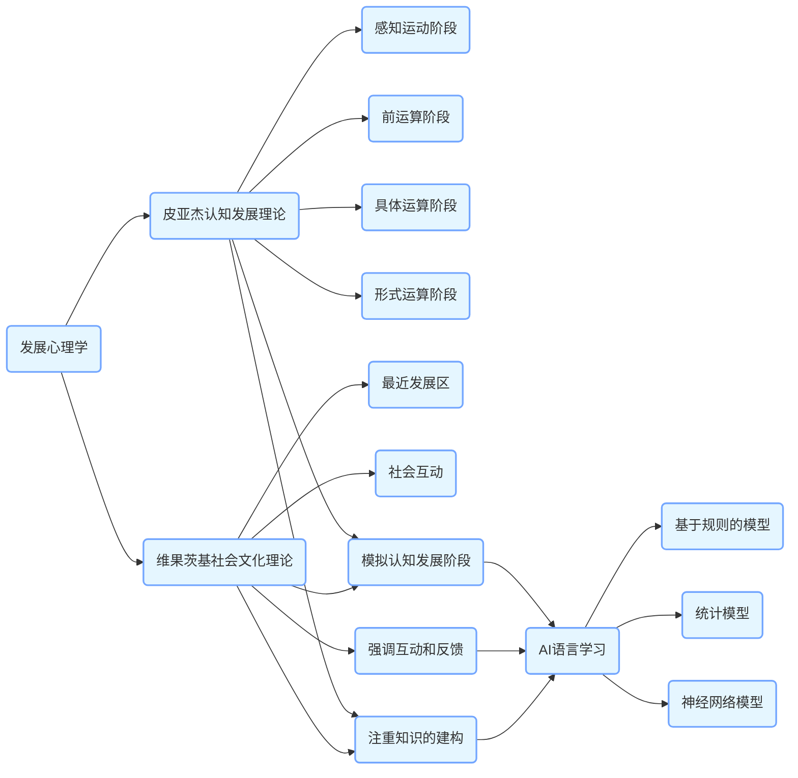

# 发展心理学启发的AI语言学习模型设计

> 关键词：发展心理学、AI语言学习模型、认知发展、语言习得、模型设计

> 摘要：本文旨在探讨如何借鉴发展心理学的理论和研究成果来设计AI语言学习模型。通过深入分析发展心理学中关于人类语言习得和认知发展的关键概念，阐述其与AI语言学习的联系。详细介绍基于发展心理学启发的AI语言学习模型的核心原理、算法实现、数学模型，并结合实际项目案例展示模型的应用。同时，探讨该模型在不同场景下的应用，推荐相关的学习资源、开发工具和研究论文。最后，对模型的未来发展趋势和面临的挑战进行总结，为AI语言学习领域的研究和实践提供有价值的参考。

## 1. 背景介绍 
### 1.1 目的和范围
随着人工智能技术的快速发展，AI语言学习成为研究的热点领域。传统的AI语言学习模型往往侧重于数据驱动和统计方法，缺乏对人类语言学习本质的深入理解。发展心理学作为研究人类心理发展规律的学科，为AI语言学习模型的设计提供了新的视角和思路。本文的目的是探索如何将发展心理学的理论和方法应用于AI语言学习模型的设计中，以提高模型的学习能力、泛化能力和适应性。本文的范围涵盖了发展心理学的主要理论、AI语言学习模型的设计原理、算法实现、数学模型、实际应用案例以及相关的工具和资源推荐。

### 1.2 预期读者
本文的预期读者包括人工智能领域的研究人员、开发者、学者，以及对发展心理学和AI语言学习感兴趣的爱好者。对于从事AI语言学习模型研究和开发的专业人士，本文提供了一种新的设计思路和方法；对于心理学专业的学生和研究人员，本文展示了发展心理学在人工智能领域的应用；对于普通爱好者，本文可以帮助他们了解AI语言学习模型的设计原理和发展趋势。

### 1.3 文档结构概述
本文的结构如下：首先介绍发展心理学和AI语言学习的背景知识，包括目的、预期读者和文档结构概述；然后阐述发展心理学与AI语言学习的核心概念及其联系，并给出相应的文本示意图和Mermaid流程图；接着详细讲解基于发展心理学启发的AI语言学习模型的核心算法原理和具体操作步骤，并用Python源代码进行阐述；之后介绍该模型的数学模型和公式，并举例说明；再通过实际项目案例展示模型的开发环境搭建、源代码实现和代码解读；探讨模型的实际应用场景；推荐相关的学习资源、开发工具和研究论文；最后总结模型的未来发展趋势和面临的挑战，并提供常见问题解答和扩展阅读参考资料。

### 1.4 术语表
#### 1.4.1 核心术语定义
- **发展心理学**：研究个体从出生到成熟直至衰老的生命全程中心理发生、发展的特点和规律的学科。
- **AI语言学习模型**：用于使人工智能系统具备语言理解、生成和学习能力的模型。
- **认知发展**：个体在成长过程中认知能力的发展和变化，包括感知、注意、记忆、思维等方面。
- **语言习得**：个体通过自然的方式获得语言能力的过程。
- **泛化能力**：模型在未见过的数据上的表现能力。

#### 1.4.2 相关概念解释
- **图式**：发展心理学中，图式是指个体对世界的认知结构和组织方式。在AI语言学习中，可以类比为模型对语言知识的组织和表示。
- **同化**：个体将新的信息纳入已有的图式中，以丰富和扩展自己的认知结构。在AI语言学习中，同化可以理解为模型将新的语言数据融入已有的知识体系。
- **顺应**：当个体遇到新的信息无法纳入已有的图式时，需要改变或调整已有的图式以适应新的信息。在AI语言学习中，顺应可以对应模型对新数据的适应性调整。

#### 1.4.3 缩略词列表
- **AI**：Artificial Intelligence，人工智能
- **RNN**：Recurrent Neural Network，循环神经网络
- **LSTM**：Long Short-Term Memory，长短期记忆网络
- **GRU**：Gated Recurrent Unit，门控循环单元

## 2. 核心概念与联系 

### 发展心理学核心概念
发展心理学中有许多重要的理论和概念与语言学习密切相关，其中皮亚杰的认知发展理论和维果茨基的社会文化理论是两个具有代表性的理论。

#### 皮亚杰的认知发展理论
皮亚杰认为，儿童的认知发展是一个建构的过程，通过同化和顺应两种机制来适应环境。儿童在不同的发展阶段具有不同的认知结构和思维方式。在语言学习方面，儿童通过与环境的互动，逐渐建立起对语言的理解和运用能力。例如，在感知运动阶段（0 - 2岁），儿童主要通过感知和动作来认识世界，此时他们开始对声音和语言产生兴趣；在前运算阶段（2 - 7岁），儿童开始使用符号和语言来表征事物，但思维具有自我中心性；在具体运算阶段（7 - 11岁），儿童能够进行逻辑运算，但需要具体事物的支持；在形式运算阶段（11岁以上），儿童能够进行抽象思维和假设推理。

#### 维果茨基的社会文化理论
维果茨基强调社会文化因素在儿童认知发展中的重要作用。他认为，语言是一种社会文化工具，儿童通过与他人的互动和交流来学习语言。儿童的语言发展存在一个“最近发展区”，即儿童实际发展水平与潜在发展水平之间的差距。在最近发展区内，儿童在成人或更有能力的同伴的帮助下能够完成一些原本无法独立完成的任务，从而促进语言和认知的发展。

### AI语言学习核心概念
在AI语言学习中，常见的模型包括基于规则的模型、统计模型和神经网络模型。基于规则的模型通过手工编写的语法规则来处理语言；统计模型通过对大量语言数据的统计分析来学习语言的模式和规律；神经网络模型则通过模拟人脑神经元的结构和功能来实现语言的学习和处理。

### 核心概念联系
发展心理学的理论和概念为AI语言学习模型的设计提供了以下启示：
- **模拟认知发展阶段**：可以设计AI语言学习模型，使其能够模拟人类在不同认知发展阶段的语言学习过程。例如，在模型的初期，注重对简单语言模式的学习，随着学习的深入，逐渐提高对复杂语言结构的处理能力。
- **强调互动和反馈**：借鉴维果茨基的社会文化理论，在AI语言学习中引入互动和反馈机制。例如，让模型与用户进行对话，根据用户的反馈来调整自己的学习策略和参数。
- **注重知识的建构**：皮亚杰的同化和顺应机制可以启发AI语言学习模型如何处理新的语言数据。当遇到新的数据时，模型可以尝试将其同化到已有的知识体系中，如果无法同化，则进行顺应，调整知识体系以适应新的数据。

### 文本示意图
```plaintext
发展心理学
|-- 皮亚杰认知发展理论
|   |-- 感知运动阶段
|   |-- 前运算阶段
|   |-- 具体运算阶段
|   |-- 形式运算阶段
|-- 维果茨基社会文化理论
|   |-- 最近发展区
|   |-- 社会互动

AI语言学习
|-- 基于规则的模型
|-- 统计模型
|-- 神经网络模型

联系
|-- 模拟认知发展阶段
|-- 强调互动和反馈
|-- 注重知识的建构
```

### Mermaid流程图


## 3. 核心算法原理 & 具体操作步骤 

### 算法原理
基于发展心理学启发的AI语言学习模型可以采用分层学习的策略，模拟人类认知发展的不同阶段。在模型的底层，使用简单的神经网络结构对语言的基本特征进行学习，如语音、词汇等；在中层，逐渐引入更复杂的结构来处理句子和段落的语义；在高层，实现对篇章和语境的理解。

以下是一个简化的基于循环神经网络（RNN）的AI语言学习模型的算法原理：

#### 输入层
输入层接收语言数据，如文本序列。将文本序列中的每个单词转换为对应的词向量表示，可以使用预训练的词向量模型，如Word2Vec或GloVe。

#### 隐藏层
隐藏层使用RNN单元，如LSTM或GRU，来处理输入的词向量序列。RNN单元可以捕捉序列中的时间依赖关系，从而学习到语言的上下文信息。在每个时间步，RNN单元根据当前输入和上一个时间步的隐藏状态更新当前的隐藏状态。

#### 输出层
输出层根据隐藏层的输出进行预测，如预测下一个单词的概率分布。可以使用softmax函数将输出转换为概率分布。

### 具体操作步骤

#### 步骤1：数据预处理
- 收集语言数据，如文本语料库。
- 对文本进行清洗和分词处理，去除停用词、标点符号等。
- 将分词后的文本转换为词向量表示。

#### 步骤2：模型构建
- 定义输入层、隐藏层和输出层的结构。
- 初始化模型的参数。

#### 步骤3：模型训练
- 选择合适的损失函数，如交叉熵损失函数。
- 使用优化算法，如随机梯度下降（SGD）或Adam，对模型进行训练。
- 在训练过程中，不断调整模型的参数，以最小化损失函数。

#### 步骤4：模型评估
- 使用测试数据集对训练好的模型进行评估。
- 计算评估指标，如准确率、召回率、F1值等。

#### 步骤5：模型应用
- 将训练好的模型应用于实际的语言处理任务，如文本生成、机器翻译等。

### Python源代码实现
```python
import torch
import torch.nn as nn
import torch.optim as optim
from torch.utils.data import DataLoader, Dataset

# 定义数据集类
class LanguageDataset(Dataset):
    def __init__(self, data):
        self.data = data

    def __len__(self):
        return len(self.data)

    def __getitem__(self, idx):
        return self.data[idx]

# 定义RNN语言学习模型
class RNNLanguageModel(nn.Module):
    def __init__(self, vocab_size, embedding_dim, hidden_dim):
        super(RNNLanguageModel, self).__init__()
        self.embedding = nn.Embedding(vocab_size, embedding_dim)
        self.rnn = nn.LSTM(embedding_dim, hidden_dim, batch_first=True)
        self.fc = nn.Linear(hidden_dim, vocab_size)

    def forward(self, x):
        embedded = self.embedding(x)
        output, _ = self.rnn(embedded)
        logits = self.fc(output)
        return logits

# 数据预处理
data = ["this is a sample sentence", "another sample sentence"]
vocab = set([word for sentence in data for word in sentence.split()])
vocab_size = len(vocab)
word_to_idx = {word: idx for idx, word in enumerate(vocab)}
idx_to_word = {idx: word for idx, word in enumerate(vocab)}
data_idx = [[word_to_idx[word] for word in sentence.split()] for sentence in data]

# 数据集和数据加载器
dataset = LanguageDataset(data_idx)
dataloader = DataLoader(dataset, batch_size=1, shuffle=True)

# 模型初始化
embedding_dim = 100
hidden_dim = 128
model = RNNLanguageModel(vocab_size, embedding_dim, hidden_dim)

# 损失函数和优化器
criterion = nn.CrossEntropyLoss()
optimizer = optim.Adam(model.parameters(), lr=0.001)

# 模型训练
num_epochs = 10
for epoch in range(num_epochs):
    for batch in dataloader:
        optimizer.zero_grad()
        input_seq = batch[:, :-1]
        target_seq = batch[:, 1:]
        output = model(input_seq)
        output = output.view(-1, vocab_size)
        target_seq = target_seq.view(-1)
        loss = criterion(output, target_seq)
        loss.backward()
        optimizer.step()
    print(f'Epoch {epoch+1}/{num_epochs}, Loss: {loss.item()}')

# 模型应用（简单示例）
input_sentence = "this is"
input_idx = [word_to_idx[word] for word in input_sentence.split()]
input_tensor = torch.tensor(input_idx).unsqueeze(0)
output = model(input_tensor)
output_probs = torch.softmax(output, dim=-1)
predicted_idx = torch.argmax(output_probs, dim=-1)
predicted_word = idx_to_word[predicted_idx.item()]
print(f'Predicted next word: {predicted_word}')
```

## 4. 数学模型和公式 & 详细讲解 & 举例说明 

### 词向量表示
在AI语言学习中，词向量是将单词转换为实数向量的表示方法。常见的词向量模型有Word2Vec和GloVe。以Word2Vec为例，它通过训练一个神经网络来学习词向量。假设我们有一个包含 $V$ 个单词的词汇表，每个单词可以用一个 $d$ 维的向量 $\mathbf{w} \in \mathbb{R}^d$ 表示。

Word2Vec有两种训练模式：跳字模型（Skip-gram）和连续词袋模型（CBOW）。

#### 跳字模型
跳字模型的目标是根据中心词预测其上下文词。假设中心词为 $w_c$，上下文词为 $w_{o_1}, w_{o_2}, \cdots, w_{o_m}$，其中 $m$ 是上下文窗口的大小。跳字模型的目标函数可以表示为：

$$
\mathcal{L}(\theta) = -\sum_{t=1}^{T} \sum_{-m \leq j \leq m, j \neq 0} \log p(w_{t+j} | w_t; \theta)
$$

其中，$T$ 是语料库中单词的总数，$\theta$ 是模型的参数，$p(w_{o} | w_c; \theta)$ 是给定中心词 $w_c$ 时上下文词 $w_{o}$ 的条件概率，可以通过softmax函数计算：

$$
p(w_{o} | w_c; \theta) = \frac{\exp(\mathbf{u}_{o}^T \mathbf{v}_{c})}{\sum_{w \in V} \exp(\mathbf{u}_{w}^T \mathbf{v}_{c})}
$$

其中，$\mathbf{v}_{c}$ 是中心词 $w_c$ 的词向量，$\mathbf{u}_{o}$ 是上下文词 $w_{o}$ 的词向量。

#### 连续词袋模型
连续词袋模型的目标是根据上下文词预测中心词。假设上下文词为 $w_{c_1}, w_{c_2}, \cdots, w_{c_m}$，中心词为 $w_o$。连续词袋模型的目标函数可以表示为：

$$
\mathcal{L}(\theta) = -\sum_{t=1}^{T} \log p(w_t | w_{t-m}, \cdots, w_{t-1}, w_{t+1}, \cdots, w_{t+m}; \theta)
$$

其中，$p(w_o | w_{c_1}, \cdots, w_{c_m}; \theta)$ 是给定上下文词时中心词的条件概率，同样可以通过softmax函数计算：

$$
p(w_o | w_{c_1}, \cdots, w_{c_m}; \theta) = \frac{\exp(\mathbf{u}_{o}^T \frac{1}{m} \sum_{i=1}^{m} \mathbf{v}_{c_i})}{\sum_{w \in V} \exp(\mathbf{u}_{w}^T \frac{1}{m} \sum_{i=1}^{m} \mathbf{v}_{c_i})}
$$

### 循环神经网络（RNN）
RNN是一种用于处理序列数据的神经网络。在每个时间步 $t$，RNN单元接收输入 $\mathbf{x}_t$ 和上一个时间步的隐藏状态 $\mathbf{h}_{t-1}$，并更新当前的隐藏状态 $\mathbf{h}_t$：

$$
\mathbf{h}_t = \tanh(\mathbf{W}_{hh} \mathbf{h}_{t-1} + \mathbf{W}_{xh} \mathbf{x}_t + \mathbf{b}_h)
$$

其中，$\mathbf{W}_{hh}$ 是隐藏状态到隐藏状态的权重矩阵，$\mathbf{W}_{xh}$ 是输入到隐藏状态的权重矩阵，$\mathbf{b}_h$ 是隐藏状态的偏置向量，$\tanh$ 是激活函数。

在时间步 $t$，RNN单元的输出 $\mathbf{y}_t$ 可以通过以下公式计算：

$$
\mathbf{y}_t = \mathbf{W}_{hy} \mathbf{h}_t + \mathbf{b}_y
$$

其中，$\mathbf{W}_{hy}$ 是隐藏状态到输出的权重矩阵，$\mathbf{b}_y$ 是输出的偏置向量。

### 长短期记忆网络（LSTM）
LSTM是一种改进的RNN，它通过引入门控机制来解决RNN的梯度消失问题。LSTM单元包含输入门 $\mathbf{i}_t$、遗忘门 $\mathbf{f}_t$、输出门 $\mathbf{o}_t$ 和细胞状态 $\mathbf{C}_t$。

#### 遗忘门
遗忘门决定了上一个时间步的细胞状态 $\mathbf{C}_{t-1}$ 中有多少信息需要被遗忘：

$$
\mathbf{f}_t = \sigma(\mathbf{W}_{f} [\mathbf{h}_{t-1}, \mathbf{x}_t] + \mathbf{b}_{f})
$$

其中，$\sigma$ 是sigmoid函数，$\mathbf{W}_{f}$ 是遗忘门的权重矩阵，$\mathbf{b}_{f}$ 是遗忘门的偏置向量。

#### 输入门
输入门决定了当前输入 $\mathbf{x}_t$ 中有多少信息需要被添加到细胞状态中：

$$
\mathbf{i}_t = \sigma(\mathbf{W}_{i} [\mathbf{h}_{t-1}, \mathbf{x}_t] + \mathbf{b}_{i})
$$

同时，计算一个候选细胞状态 $\tilde{\mathbf{C}}_t$：

$$
\tilde{\mathbf{C}}_t = \tanh(\mathbf{W}_{C} [\mathbf{h}_{t-1}, \mathbf{x}_t] + \mathbf{b}_{C})
$$

#### 细胞状态更新
细胞状态 $\mathbf{C}_t$ 根据遗忘门和输入门的输出进行更新：

$$
\mathbf{C}_t = \mathbf{f}_t \odot \mathbf{C}_{t-1} + \mathbf{i}_t \odot \tilde{\mathbf{C}}_t
$$

其中，$\odot$ 表示逐元素相乘。

#### 输出门
输出门决定了当前细胞状态 $\mathbf{C}_t$ 中有多少信息需要被输出到隐藏状态 $\mathbf{h}_t$：

$$
\mathbf{o}_t = \sigma(\mathbf{W}_{o} [\mathbf{h}_{t-1}, \mathbf{x}_t] + \mathbf{b}_{o})
$$

隐藏状态 $\mathbf{h}_t$ 可以通过以下公式计算：

$$
\mathbf{h}_t = \mathbf{o}_t \odot \tanh(\mathbf{C}_t)
$$

### 举例说明
假设我们有一个简单的文本序列 "the dog runs"，词汇表为 $\{the, dog, runs\}$，词向量维度为 2。我们使用Word2Vec的跳字模型来学习词向量。

#### 初始化词向量
假设初始的词向量为：
$$
\mathbf{v}_{the} = \begin{bmatrix} 0.1 \\ 0.2 \end{bmatrix}, \mathbf{v}_{dog} = \begin{bmatrix} 0.3 \\ 0.4 \end{bmatrix}, \mathbf{v}_{runs} = \begin{bmatrix} 0.5 \\ 0.6 \end{bmatrix}
$$

#### 计算条件概率
假设中心词为 "dog"，上下文词为 "the" 和 "runs"。根据跳字模型的公式，计算给定 "dog" 时 "the" 的条件概率：

$$
p(\text{the} | \text{dog}) = \frac{\exp(\mathbf{u}_{the}^T \mathbf{v}_{dog})}{\exp(\mathbf{u}_{the}^T \mathbf{v}_{dog}) + \exp(\mathbf{u}_{dog}^T \mathbf{v}_{dog}) + \exp(\mathbf{u}_{runs}^T \mathbf{v}_{dog})}
$$

#### 使用LSTM处理序列
假设我们使用LSTM来处理这个文本序列。在时间步 $t = 1$，输入 $\mathbf{x}_1$ 是 "the" 的词向量，根据LSTM的公式计算遗忘门、输入门、细胞状态和隐藏状态。

## 5. 项目实战：代码实际案例和详细解释说明 

### 5.1  开发环境搭建
#### 安装Python
首先，确保你已经安装了Python 3.x版本。可以从Python官方网站（https://www.python.org/downloads/）下载并安装适合你操作系统的Python版本。

#### 安装深度学习框架
我们使用PyTorch作为深度学习框架。可以使用以下命令安装PyTorch：
```sh
pip install torch torchvision
```

#### 安装其他依赖库
还需要安装一些其他的依赖库，如numpy、nltk等。可以使用以下命令安装：
```sh
pip install numpy nltk
```

### 5.2  源代码详细实现和代码解读
```python
import torch
import torch.nn as nn
import torch.optim as optim
from torch.utils.data import DataLoader, Dataset
import nltk
from nltk.tokenize import word_tokenize
nltk.download('punkt')

# 定义数据集类
class LanguageDataset(Dataset):
    def __init__(self, texts, vocab):
        self.texts = texts
        self.vocab = vocab
        self.word_to_idx = {word: idx for idx, word in enumerate(vocab)}
        self.idx_to_word = {idx: word for idx, word in enumerate(vocab)}
        self.data = []
        for text in texts:
            tokens = word_tokenize(text.lower())
            token_ids = [self.word_to_idx[word] for word in tokens if word in self.word_to_idx]
            if len(token_ids) > 1:
                self.data.append(token_ids)

    def __len__(self):
        return len(self.data)

    def __getitem__(self, idx):
        return torch.tensor(self.data[idx], dtype=torch.long)

# 定义LSTM语言学习模型
class LSTMLanguageModel(nn.Module):
    def __init__(self, vocab_size, embedding_dim, hidden_dim, num_layers):
        super(LSTMLanguageModel, self).__init__()
        self.embedding = nn.Embedding(vocab_size, embedding_dim)
        self.lstm = nn.LSTM(embedding_dim, hidden_dim, num_layers, batch_first=True)
        self.fc = nn.Linear(hidden_dim, vocab_size)

    def forward(self, x):
        embedded = self.embedding(x)
        output, _ = self.lstm(embedded)
        logits = self.fc(output)
        return logits

# 数据准备
texts = [
    "The quick brown fox jumps over the lazy dog.",
    "Never jump over the lazy dog quickly.",
    "A quick brown dog outpaces a quick fox."
]
vocab = set([word.lower() for text in texts for word in word_tokenize(text)])
vocab_size = len(vocab)

# 数据集和数据加载器
dataset = LanguageDataset(texts, vocab)
dataloader = DataLoader(dataset, batch_size=1, shuffle=True)

# 模型初始化
embedding_dim = 128
hidden_dim = 256
num_layers = 2
model = LSTMLanguageModel(vocab_size, embedding_dim, hidden_dim, num_layers)

# 损失函数和优化器
criterion = nn.CrossEntropyLoss()
optimizer = optim.Adam(model.parameters(), lr=0.001)

# 模型训练
num_epochs = 20
for epoch in range(num_epochs):
    for batch in dataloader:
        optimizer.zero_grad()
        input_seq = batch[:, :-1]
        target_seq = batch[:, 1:]
        output = model(input_seq)
        output = output.view(-1, vocab_size)
        target_seq = target_seq.view(-1)
        loss = criterion(output, target_seq)
        loss.backward()
        optimizer.step()
    print(f'Epoch {epoch+1}/{num_epochs}, Loss: {loss.item()}')

# 模型应用（文本生成）
def generate_text(model, vocab, word_to_idx, idx_to_word, input_text, max_length=20):
    model.eval()
    input_tokens = word_tokenize(input_text.lower())
    input_ids = [word_to_idx[word] for word in input_tokens if word in word_to_idx]
    input_tensor = torch.tensor(input_ids).unsqueeze(0)
    generated_text = input_tokens.copy()
    with torch.no_grad():
        for _ in range(max_length):
            output = model(input_tensor)
            output_probs = torch.softmax(output[:, -1, :], dim=-1)
            predicted_idx = torch.multinomial(output_probs, num_samples=1).item()
            predicted_word = idx_to_word[predicted_idx]
            generated_text.append(predicted_word)
            input_ids.append(predicted_idx)
            input_tensor = torch.tensor(input_ids).unsqueeze(0)
    return ' '.join(generated_text)

input_text = "The quick"
generated_text = generate_text(model, vocab, dataset.word_to_idx, dataset.idx_to_word, input_text)
print(f'Generated text: {generated_text}')
```

### 5.3  代码解读与分析
#### 数据集类 `LanguageDataset`
- `__init__` 方法：初始化数据集，将文本进行分词处理，并将单词转换为对应的索引。
- `__len__` 方法：返回数据集的长度。
- `__getitem__` 方法：根据索引返回对应的文本序列的张量表示。

#### 模型类 `LSTMLanguageModel`
- `__init__` 方法：初始化模型的各个层，包括嵌入层、LSTM层和全连接层。
- `forward` 方法：定义模型的前向传播过程，将输入序列通过嵌入层、LSTM层和全连接层，得到输出的logits。

#### 训练过程
- 定义损失函数 `nn.CrossEntropyLoss()` 和优化器 `optim.Adam()`。
- 在每个epoch中，遍历数据加载器中的每个批次，计算损失并进行反向传播和参数更新。

#### 文本生成函数 `generate_text`
- 将输入文本转换为索引序列，并输入到模型中。
- 在每个时间步，根据模型的输出概率分布随机选择一个单词作为预测结果。
- 将预测的单词添加到生成的文本中，并更新输入序列，继续进行预测，直到达到最大长度。

## 6. 实际应用场景 
### 智能客服
基于发展心理学启发的AI语言学习模型可以用于智能客服系统。模型可以模拟人类客服的语言理解和回答能力，通过与用户的互动不断学习和提高。例如，在处理用户咨询时，模型可以根据用户的问题和历史对话记录，提供准确、个性化的回答。同时，模型可以根据用户的反馈调整自己的回答策略，提高用户满意度。

### 机器翻译
在机器翻译领域，该模型可以更好地理解源语言和目标语言的语义和语境。通过模拟人类语言学习的过程，模型可以逐渐学习到不同语言之间的语法规则和语义差异，从而提高翻译的质量。例如，在处理长难句时，模型可以利用上下文信息进行更准确的翻译。

### 文本生成
在文本生成任务中，如新闻写作、故事创作等，模型可以根据给定的主题和上下文生成连贯、有逻辑的文本。模型可以借鉴人类的语言表达习惯和思维方式，生成更自然、生动的文本内容。例如，在新闻写作中，模型可以根据事件的关键信息生成一篇完整的新闻报道。

### 教育领域
在教育领域，该模型可以用于智能辅导系统。模型可以根据学生的学习情况和问题，提供个性化的学习建议和辅导。例如，在语言学习中，模型可以根据学生的语法错误和词汇掌握情况，提供针对性的练习和讲解。

## 7. 工具和资源推荐
### 7.1 学习资源推荐
#### 7.1.1 书籍推荐
- 《发展心理学：儿童与青少年（第10版）》：这本书全面介绍了发展心理学的理论和研究成果，对于理解人类语言学习和认知发展具有重要的参考价值。
- 《深度学习》：由Ian Goodfellow、Yoshua Bengio和Aaron Courville撰写，是深度学习领域的经典教材，涵盖了神经网络、优化算法等方面的内容。
- 《Python自然语言处理》：介绍了使用Python进行自然语言处理的方法和技术，包括分词、词性标注、命名实体识别等。

#### 7.1.2 在线课程
- Coursera上的“深度学习专项课程”：由Andrew Ng教授授课，系统地介绍了深度学习的基本概念、算法和应用。
- edX上的“自然语言处理基础”：该课程涵盖了自然语言处理的基本技术和方法，适合初学者学习。
- Udemy上的“AI语言学习模型实战”：提供了基于Python和深度学习框架的AI语言学习模型的实战项目和案例。

#### 7.1.3 技术博客和网站
- Towards Data Science：一个专注于数据科学和机器学习的博客平台，上面有很多关于AI语言学习模型的文章和教程。
- Medium：一个综合性的写作平台，有许多技术专家分享关于人工智能和自然语言处理的最新研究成果和实践经验。
- arXiv：一个预印本论文库，提供了大量关于人工智能和发展心理学的研究论文。

### 7.2 开发工具框架推荐
#### 7.2.1 IDE和编辑器
- PyCharm：一款专业的Python集成开发环境，提供了代码编辑、调试、版本控制等功能，适合开发大型的Python项目。
- Jupyter Notebook：一个交互式的开发环境，支持Python代码的实时运行和可视化展示，非常适合进行数据探索和模型实验。
- Visual Studio Code：一款轻量级的代码编辑器，支持多种编程语言和插件扩展，可用于开发AI语言学习模型。

#### 7.2.2 调试和性能分析工具
- TensorBoard：TensorFlow提供的可视化工具，可以用于监控模型的训练过程、查看模型的结构和参数等。
- PyTorch Profiler：PyTorch提供的性能分析工具，可以帮助开发者找出模型中的性能瓶颈，优化代码的运行效率。
- cProfile：Python标准库中的性能分析模块，可以用于分析Python代码的运行时间和函数调用情况。

#### 7.2.3 相关框架和库
- PyTorch：一个开源的深度学习框架，提供了丰富的神经网络层和优化算法，支持GPU加速，适合开发AI语言学习模型。
- TensorFlow：另一个广泛使用的深度学习框架，具有强大的分布式训练和部署能力，提供了多种高级API，方便开发者快速搭建模型。
- NLTK：Python的自然语言处理工具包，提供了丰富的语料库和工具，如分词、词性标注、命名实体识别等。

### 7.3 相关论文著作推荐
#### 7.3.1 经典论文
- "Learning Phrase Representations using RNN Encoder–Decoder for Statistical Machine Translation"：介绍了使用循环神经网络编码器 - 解码器进行统计机器翻译的方法。
- "Attention Is All You Need"：提出了Transformer架构，在自然语言处理领域取得了巨大的成功。
- "Long Short-Term Memory"：介绍了长短期记忆网络（LSTM）的原理和应用。

#### 7.3.2 最新研究成果
- 关注arXiv上关于发展心理学和AI语言学习的最新论文，了解该领域的前沿研究动态。
- 参加相关的学术会议，如ACL（Association for Computational Linguistics）、EMNLP（Conference on Empirical Methods in Natural Language Processing）等，获取最新的研究成果和趋势。

#### 7.3.3 应用案例分析
- 分析一些实际的AI语言学习模型应用案例，如谷歌的BERT模型、OpenAI的GPT系列模型等，了解它们的设计思路、训练方法和应用场景。

## 8. 总结：未来发展趋势与挑战
### 未来发展趋势
#### 融合多模态信息
未来的AI语言学习模型将不仅仅局限于文本信息，还会融合图像、音频、视频等多模态信息。例如，在处理图像描述任务时，模型可以结合图像的视觉特征和文本的语义信息，生成更准确、生动的描述。

#### 强化学习与语言学习的结合
强化学习可以为AI语言学习模型提供更有效的学习机制。通过与环境进行交互，模型可以根据奖励信号不断调整自己的学习策略，提高语言学习的效率和效果。例如，在对话系统中，模型可以根据用户的反馈获得奖励，从而优化自己的回答策略。

#### 个性化语言学习
随着大数据和人工智能技术的发展，未来的AI语言学习模型将能够根据用户的个性化需求和学习习惯，提供定制化的学习方案。例如，针对不同年龄段、学习目标和语言水平的用户，模型可以生成不同难度和内容的学习材料。

### 面临的挑战
#### 数据质量和多样性
高质量、多样化的数据是训练AI语言学习模型的关键。然而，目前的数据往往存在噪声、偏差等问题，并且数据的覆盖范围有限。如何获取和处理高质量、多样化的数据是一个亟待解决的问题。

#### 计算资源和效率
训练复杂的AI语言学习模型需要大量的计算资源和时间。如何提高模型的训练效率，降低计算成本，是一个挑战。同时，如何在资源受限的设备上部署和运行模型，也是需要考虑的问题。

#### 可解释性和可靠性
AI语言学习模型通常是黑盒模型，难以解释其决策过程和结果。在一些关键应用场景中，如医疗、法律等，模型的可解释性和可靠性至关重要。如何提高模型的可解释性和可靠性，是当前研究的热点问题。

## 9. 附录：常见问题与解答
### 问题1：发展心理学的理论如何具体应用到AI语言学习模型的设计中？
答：可以从多个方面应用发展心理学的理论。例如，模拟人类认知发展的阶段，让模型在不同阶段学习不同难度的语言知识；引入互动和反馈机制，使模型能够根据用户的反馈进行学习和调整；借鉴同化和顺应的概念，让模型在处理新数据时能够合理地更新自己的知识体系。

### 问题2：基于发展心理学启发的AI语言学习模型与传统模型相比有哪些优势？
答：与传统模型相比，基于发展心理学启发的模型更注重模拟人类的语言学习过程，具有更好的学习能力、泛化能力和适应性。它可以更好地理解语言的语义和语境，处理复杂的语言任务，并且能够根据不同的应用场景进行灵活调整。

### 问题3：在实际项目中，如何评估基于发展心理学启发的AI语言学习模型的性能？
答：可以使用多种评估指标来评估模型的性能，如准确率、召回率、F1值、困惑度等。同时，还可以进行人工评估，如让人类评估者对模型的输出进行打分和评价。此外，还可以通过与其他模型进行对比实验，来评估模型的优势和不足。

### 问题4：训练AI语言学习模型需要多少数据？
答：训练模型所需的数据量取决于模型的复杂度、任务的难度和数据的质量。一般来说，数据量越大，模型的性能越好。但是，过多的数据也可能导致过拟合问题。在实际应用中，需要根据具体情况进行调整和优化。

## 10. 扩展阅读 & 参考资料
### 扩展阅读
- 《人工智能：一种现代的方法（第4版）》：全面介绍了人工智能的各个领域和方法，对于深入理解AI语言学习模型具有重要的参考价值。
- 《认知心理学》：介绍了人类认知的基本原理和过程，有助于理解发展心理学与AI语言学习的联系。
- 《自然语言处理入门》：一本适合初学者的自然语言处理教材，介绍了自然语言处理的基本概念、算法和应用。

### 参考资料
- Piaget, J. (1952). The Origins of Intelligence in Children. International Universities Press.
- Vygotsky, L. S. (1978). Mind in Society: The Development of Higher Psychological Processes. Harvard University Press.
- Mikolov, T., et al. (2013). Efficient Estimation of Word Representations in Vector Space. arXiv preprint arXiv:1301.3781.
- Vaswani, A., et al. (2017). Attention Is All You Need. Advances in Neural Information Processing Systems.

作者：AI天才研究院/AI Genius Institute & 禅与计算机程序设计艺术 /Zen And The Art of Computer Programming