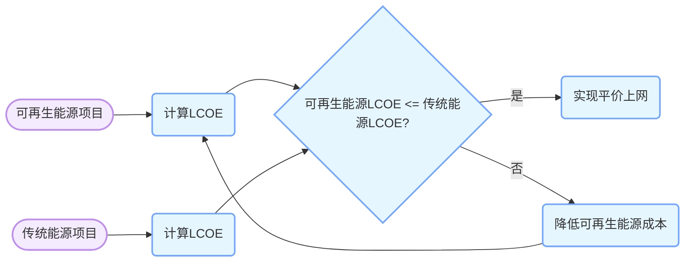

# 可再生能源与传统能源的平价上网时间表

> 关键词：可再生能源、传统能源、平价上网、时间表、能源转型

> 摘要：本文深入探讨了可再生能源与传统能源平价上网时间表这一重要议题。首先介绍了相关背景，包括研究目的、预期读者、文档结构和术语表。接着阐述了可再生能源与传统能源的核心概念及联系，通过文本示意图和Mermaid流程图进行清晰展示。详细讲解了核心算法原理和具体操作步骤，并用Python代码进行说明。引入数学模型和公式来分析平价上网的关键因素，并举例说明。通过项目实战案例，对代码实现和解读进行了详细说明。分析了可再生能源与传统能源平价上网在不同领域的实际应用场景。推荐了相关的学习资源、开发工具框架和论文著作。最后总结了未来发展趋势与挑战，提供了常见问题解答和扩展阅读参考资料，旨在为能源领域的从业者和研究者提供全面而深入的知识。

## 1. 背景介绍 
### 1.1 目的和范围
随着全球对环境保护和可持续发展的关注度不断提高，可再生能源的发展成为了能源领域的重要趋势。可再生能源与传统能源的平价上网是实现能源转型的关键一步，它意味着可再生能源在成本上能够与传统能源相竞争，从而大规模地替代传统能源，减少对环境的影响。本文的目的是深入研究可再生能源与传统能源平价上网的时间表，分析影响平价上网的各种因素，为能源政策制定者、投资者和从业者提供决策依据。

本文的研究范围涵盖了常见的可再生能源，如太阳能、风能、水能等，以及传统能源，如煤炭、天然气、石油等。通过对不同能源的成本结构、技术发展趋势和市场环境的分析，探讨可再生能源与传统能源平价上网的时间节点和可能性。

### 1.2 预期读者
本文的预期读者包括能源领域的政策制定者、投资者、研究人员、工程师以及对能源问题感兴趣的普通读者。政策制定者可以从本文中了解可再生能源与传统能源平价上网的趋势，为制定合理的能源政策提供参考；投资者可以根据平价上网时间表评估可再生能源项目的投资价值和风险；研究人员可以深入了解相关领域的研究进展和方法；工程师可以从技术层面获取关于可再生能源成本降低的思路和方向；普通读者可以通过本文了解能源领域的重要变革和发展趋势。

### 1.3 文档结构概述
本文将按照以下结构进行组织：
- 核心概念与联系：介绍可再生能源和传统能源的基本概念，以及它们之间的联系和区别。通过文本示意图和Mermaid流程图展示平价上网的原理和过程。
- 核心算法原理 & 具体操作步骤：讲解用于分析可再生能源与传统能源平价上网的核心算法原理，并给出具体的操作步骤。使用Python代码详细阐述算法的实现过程。
- 数学模型和公式 & 详细讲解 & 举例说明：引入数学模型和公式来描述可再生能源和传统能源的成本结构和变化趋势，对公式进行详细讲解，并通过实际例子说明如何应用这些公式进行分析。
- 项目实战：代码实际案例和详细解释说明：通过一个实际的项目案例，展示如何使用前面介绍的算法和模型来分析可再生能源与传统能源的平价上网时间表。包括开发环境搭建、源代码详细实现和代码解读。
- 实际应用场景：分析可再生能源与传统能源平价上网在不同领域的实际应用场景，如电力市场、工业生产、交通运输等。
- 工具和资源推荐：推荐相关的学习资源、开发工具框架和论文著作，帮助读者进一步深入学习和研究。
- 总结：未来发展趋势与挑战：总结可再生能源与传统能源平价上网的发展趋势，分析面临的挑战和机遇。
- 附录：常见问题与解答：提供常见问题的解答，帮助读者更好地理解本文的内容。
- 扩展阅读 & 参考资料：列出相关的扩展阅读材料和参考资料，方便读者进一步探索。

### 1.4 术语表
#### 1.4.1 核心术语定义
- 可再生能源：指在自然界中可以不断再生、永续利用的能源，具有取之不尽、用之不竭的特点，主要包括太阳能、风能、水能、生物能、地热能等。
- 传统能源：也称为常规能源，是指已经大规模生产和广泛利用的能源，如煤炭、石油、天然气等化石能源，以及核能等。
- 平价上网：指可再生能源发电的成本与传统能源发电的成本相当，在不需要政府补贴的情况下，能够在市场上与传统能源竞争，实现商业可持续发展。
- 度电成本（LCOE）：是指发电项目在整个生命周期内，每发一度电所需要的平均成本，包括建设成本、运营成本、燃料成本等。它是衡量发电成本的重要指标。

#### 1.4.2 相关概念解释
- 能源转型：指从传统的以化石能源为主的能源体系向以可再生能源为主的能源体系转变的过程。能源转型是应对气候变化、保障能源安全和实现可持续发展的必然选择。
- 补贴政策：为了促进可再生能源的发展，政府通常会出台一系列补贴政策，如电价补贴、投资补贴等，以降低可再生能源的成本，提高其市场竞争力。随着可再生能源技术的不断进步和成本的降低，补贴政策将逐渐退出。
- 能源市场：是指能源的生产、交易和消费的场所和机制。能源市场的价格机制和竞争环境对可再生能源与传统能源的平价上网具有重要影响。

#### 1.4.3 缩略词列表
- LCOE：Levelized Cost of Energy，度电成本
- PV：Photovoltaic，光伏发电
- WT：Wind Turbine，风力发电
- CCGT：Combined Cycle Gas Turbine，联合循环燃气轮机发电

## 2. 核心概念与联系 

### 2.1 可再生能源与传统能源的概念
可再生能源是指在自然界中可以不断再生、永续利用的能源，它对环境友好，几乎不产生温室气体排放。太阳能是通过太阳辐射获取能量，可通过光伏发电或太阳能热利用转化为电能或热能；风能是利用风力带动风力发电机叶片旋转产生电能；水能是通过建设水电站，利用水流的势能转化为电能；生物能是利用生物质（如植物、动物粪便等）发酵产生沼气，或直接燃烧生物质发电；地热能是利用地球内部的热能进行发电或供暖。

传统能源主要包括煤炭、石油、天然气等化石能源和核能。化石能源是古代生物经过漫长的地质年代形成的，它们的储量有限，开采和使用过程中会产生大量的污染物和温室气体，对环境造成严重影响。核能是通过核反应堆中核燃料的裂变反应释放能量，虽然核能发电不产生温室气体排放，但核废料的处理和核安全问题是其面临的主要挑战。

### 2.2 平价上网的原理
平价上网的核心是使可再生能源的度电成本（LCOE）与传统能源的度电成本相当。度电成本是一个综合指标，它考虑了发电项目在整个生命周期内的所有成本，包括初始投资成本、运营维护成本、燃料成本（对于需要燃料的能源）、融资成本等，并将这些成本分摊到每一度电上。

当可再生能源的LCOE低于或等于传统能源的LCOE时，就实现了平价上网。这意味着可再生能源在经济上具有竞争力，不需要政府的补贴就可以在市场上与传统能源竞争。实现平价上网的关键在于降低可再生能源的成本，主要途径包括技术进步、规模效应、优化项目管理等。

### 2.3 核心概念的文本示意图
```plaintext
           可再生能源（太阳能、风能、水能等）
                 |
                 | 成本降低（技术进步、规模效应等）
                 |
        平价上网（LCOE相当）
                 |
                 |
           传统能源（煤炭、天然气等）
```

### 2.4 Mermaid流程图


## 3. 核心算法原理 & 具体操作步骤 

### 3.1 度电成本（LCOE）的计算原理
度电成本（LCOE）的计算公式为：

$$LCOE = \frac{\sum_{t=0}^{n} \frac{I_t + M_t + F_t}{(1 + r)^t}}{\sum_{t=0}^{n} \frac{E_t}{(1 + r)^t}}$$

其中：
- $I_t$ 是第 $t$ 年的投资成本，包括设备购置、安装、建设等费用。
- $M_t$ 是第 $t$ 年的运营维护成本，包括人工、维修、保养等费用。
- $F_t$ 是第 $t$ 年的燃料成本（对于需要燃料的能源）。
- $E_t$ 是第 $t$ 年的发电量。
- $r$ 是折现率，反映了资金的时间价值。
- $n$ 是项目的生命周期（年）。

### 3.2 具体操作步骤
1. **数据收集**：收集可再生能源项目和传统能源项目的相关数据，包括初始投资成本、每年的运营维护成本、燃料成本（如果适用）、预计发电量等。同时确定项目的生命周期和折现率。
2. **计算每年的成本和发电量**：根据收集到的数据，计算每个项目每年的投资成本、运营维护成本、燃料成本和发电量。
3. **折现处理**：使用折现率对每年的成本和发电量进行折现，将未来的现金流转换为现值。
4. **计算LCOE**：根据上述公式，分别计算可再生能源项目和传统能源项目的度电成本。
5. **比较LCOE**：比较可再生能源项目和传统能源项目的度电成本，如果可再生能源的LCOE低于或等于传统能源的LCOE，则认为实现了平价上网。

### 3.3 Python代码实现
```python
import numpy as np

def calculate_lcoe(investment_costs, operation_costs, fuel_costs, electricity_generations, discount_rate, project_lifetime):
    """
    计算度电成本（LCOE）

    参数:
    investment_costs (list): 每年的投资成本列表
    operation_costs (list): 每年的运营维护成本列表
    fuel_costs (list): 每年的燃料成本列表
    electricity_generations (list): 每年的发电量列表
    discount_rate (float): 折现率
    project_lifetime (int): 项目生命周期（年）

    返回:
    float: 度电成本（LCOE）
    """
    years = np.arange(project_lifetime)
    discounted_costs = []
    discounted_generations = []

    for t in years:
        total_cost = investment_costs[t] + operation_costs[t] + fuel_costs[t]
        discounted_cost = total_cost / ((1 + discount_rate) ** t)
        discounted_costs.append(discounted_cost)

        discounted_generation = electricity_generations[t] / ((1 + discount_rate) ** t)
        discounted_generations.append(discounted_generation)

    numerator = sum(discounted_costs)
    denominator = sum(discounted_generations)

    lcoe = numerator / denominator
    return lcoe

# 示例数据
# 假设项目生命周期为20年
project_lifetime = 20
# 折现率为0.05
discount_rate = 0.05

# 可再生能源项目数据
renewable_investment_costs = [1000000] + [0] * (project_lifetime - 1)  # 初始投资成本
renewable_operation_costs = [10000] * project_lifetime  # 每年运营维护成本
renewable_fuel_costs = [0] * project_lifetime  # 可再生能源无燃料成本
renewable_electricity_generations = [100000] * project_lifetime  # 每年发电量

# 传统能源项目数据
traditional_investment_costs = [800000] + [0] * (project_lifetime - 1)  # 初始投资成本
traditional_operation_costs = [15000] * project_lifetime  # 每年运营维护成本
traditional_fuel_costs = [20000] * project_lifetime  # 每年燃料成本
traditional_electricity_generations = [120000] * project_lifetime  # 每年发电量

# 计算可再生能源和传统能源的LCOE
renewable_lcoe = calculate_lcoe(renewable_investment_costs, renewable_operation_costs, renewable_fuel_costs,
                                renewable_electricity_generations, discount_rate, project_lifetime)
traditional_lcoe = calculate_lcoe(traditional_investment_costs, traditional_operation_costs, traditional_fuel_costs,
                                  traditional_electricity_generations, discount_rate, project_lifetime)

print(f"可再生能源的度电成本（LCOE）: {renewable_lcoe:.2f} 元/度")
print(f"传统能源的度电成本（LCOE）: {traditional_lcoe:.2f} 元/度")

if renewable_lcoe <= traditional_lcoe:
    print("可再生能源实现了平价上网")
else:
    print("可再生能源尚未实现平价上网")
```

### 3.4 代码解释
- `calculate_lcoe` 函数接受每年的投资成本、运营维护成本、燃料成本、发电量、折现率和项目生命周期作为输入，根据度电成本的计算公式计算LCOE。
- 在主程序中，我们定义了示例数据，包括可再生能源项目和传统能源项目的各项成本和发电量。
- 调用 `calculate_lcoe` 函数分别计算可再生能源和传统能源的LCOE，并进行比较，输出结果。

## 4. 数学模型和公式 & 详细讲解 & 举例说明 

### 4.1 度电成本（LCOE）公式的详细讲解
$$LCOE = \frac{\sum_{t=0}^{n} \frac{I_t + M_t + F_t}{(1 + r)^t}}{\sum_{t=0}^{n} \frac{E_t}{(1 + r)^t}}$$

- **分子部分**：$\sum_{t=0}^{n} \frac{I_t + M_t + F_t}{(1 + r)^t}$ 表示项目在整个生命周期内所有成本的现值之和。其中，$I_t$ 是第 $t$ 年的投资成本，$M_t$ 是第 $t$ 年的运营维护成本，$F_t$ 是第 $t$ 年的燃料成本（对于需要燃料的能源）。$\frac{1}{(1 + r)^t}$ 是折现因子，用于将未来的成本转换为现值，$r$ 是折现率，反映了资金的时间价值。
- **分母部分**：$\sum_{t=0}^{n} \frac{E_t}{(1 + r)^t}$ 表示项目在整个生命周期内所有发电量的现值之和。$E_t$ 是第 $t$ 年的发电量。
- **LCOE的意义**：LCOE表示项目在整个生命周期内每发一度电所需要的平均成本，它综合考虑了项目的投资成本、运营维护成本、燃料成本和发电量等因素。

### 4.2 举例说明
假设我们有一个太阳能光伏发电项目和一个天然气发电项目，以下是相关数据：

| 项目 | 太阳能光伏发电 | 天然气发电 |
| --- | --- | --- |
| 初始投资成本（元） | 5000000 | 3000000 |
| 运营维护成本（元/年） | 50000 | 80000 |
| 燃料成本（元/年） | 0 | 200000 |
| 年发电量（度） | 1000000 | 1500000 |
| 项目生命周期（年） | 25 | 25 |
| 折现率 | 0.06 | 0.06 |

#### 太阳能光伏发电项目LCOE计算
- **投资成本现值**：初始投资成本为 5000000 元，只在第 0 年发生，其现值就是 5000000 元。
- **运营维护成本现值**：每年运营维护成本为 50000 元，使用等比数列求和公式计算现值：
  $$PV_{M} = \sum_{t=1}^{25} \frac{50000}{(1 + 0.06)^t} = 50000 \times \frac{1 - (1 + 0.06)^{-25}}{0.06} \approx 639132.74 \text{ 元}$$
- **燃料成本现值**：太阳能光伏发电无燃料成本，所以燃料成本现值为 0 元。
- **总成本现值**：$PV_{total} = 5000000 + 639132.74 + 0 = 5639132.74 \text{ 元}$
- **发电量现值**：每年发电量为 1000000 度，使用等比数列求和公式计算现值：
  $$PV_{E} = \sum_{t=1}^{25} \frac{1000000}{(1 + 0.06)^t} = 1000000 \times \frac{1 - (1 + 0.06)^{-25}}{0.06} \approx 12782654.77 \text{ 度}$$
- **LCOE**：$LCOE_{solar} = \frac{5639132.74}{12782654.77} \approx 0.44 \text{ 元/度}$

#### 天然气发电项目LCOE计算
- **投资成本现值**：初始投资成本为 3000000 元，只在第 0 年发生，其现值就是 3000000 元。
- **运营维护成本现值**：每年运营维护成本为 80000 元，使用等比数列求和公式计算现值：
  $$PV_{M} = \sum_{t=1}^{25} \frac{80000}{(1 + 0.06)^t} = 80000 \times \frac{1 - (1 + 0.06)^{-25}}{0.06} \approx 1022612.38 \text{ 元}$$
- **燃料成本现值**：每年燃料成本为 200000 元，使用等比数列求和公式计算现值：
  $$PV_{F} = \sum_{t=1}^{25} \frac{200000}{(1 + 0.06)^t} = 200000 \times \frac{1 - (1 + 0.06)^{-25}}{0.06} \approx 2556530.95 \text{ 元}$$
- **总成本现值**：$PV_{total} = 3000000 + 1022612.38 + 2556530.95 = 6579143.33 \text{ 元}$
- **发电量现值**：每年发电量为 1500000 度，使用等比数列求和公式计算现值：
  $$PV_{E} = \sum_{t=1}^{25} \frac{1500000}{(1 + 0.06)^t} = 1500000 \times \frac{1 - (1 + 0.06)^{-25}}{0.06} \approx 19173982.16 \text{ 度}$$
- **LCOE**：$LCOE_{gas} = \frac{6579143.33}{19173982.16} \approx 0.34 \text{ 元/度}$

在这个例子中，太阳能光伏发电项目的LCOE为 0.44 元/度，天然气发电项目的LCOE为 0.34 元/度，太阳能光伏发电尚未实现与天然气发电的平价上网。

## 5. 项目实战：代码实际案例和详细解释说明 

### 5.1  开发环境搭建
#### 5.1.1 安装Python
首先需要安装Python环境，建议使用Python 3.7及以上版本。可以从Python官方网站（https://www.python.org/downloads/）下载适合自己操作系统的安装包，按照安装向导进行安装。

#### 5.1.2 安装必要的库
本项目主要使用了 `numpy` 库进行数值计算，可使用以下命令进行安装：
```sh
pip install numpy
```

### 5.2  源代码详细实现和代码解读
```python
import numpy as np

def calculate_lcoe(investment_costs, operation_costs, fuel_costs, electricity_generations, discount_rate, project_lifetime):
    """
    计算度电成本（LCOE）

    参数:
    investment_costs (list): 每年的投资成本列表
    operation_costs (list): 每年的运营维护成本列表
    fuel_costs (list): 每年的燃料成本列表
    electricity_generations (list): 每年的发电量列表
    discount_rate (float): 折现率
    project_lifetime (int): 项目生命周期（年）

    返回:
    float: 度电成本（LCOE）
    """
    years = np.arange(project_lifetime)
    discounted_costs = []
    discounted_generations = []

    for t in years:
        total_cost = investment_costs[t] + operation_costs[t] + fuel_costs[t]
        discounted_cost = total_cost / ((1 + discount_rate) ** t)
        discounted_costs.append(discounted_cost)

        discounted_generation = electricity_generations[t] / ((1 + discount_rate) ** t)
        discounted_generations.append(discounted_generation)

    numerator = sum(discounted_costs)
    denominator = sum(discounted_generations)

    lcoe = numerator / denominator
    return lcoe

# 示例数据
# 假设项目生命周期为30年
project_lifetime = 30
# 折现率为0.08
discount_rate = 0.08

# 太阳能光伏发电项目数据
solar_investment_costs = [8000000] + [0] * (project_lifetime - 1)  # 初始投资成本
solar_operation_costs = [60000] * project_lifetime  # 每年运营维护成本
solar_fuel_costs = [0] * project_lifetime  # 太阳能无燃料成本
solar_electricity_generations = [1200000] * project_lifetime  # 每年发电量

# 煤炭发电项目数据
coal_investment_costs = [5000000] + [0] * (project_lifetime - 1)  # 初始投资成本
coal_operation_costs = [100000] * project_lifetime  # 每年运营维护成本
coal_fuel_costs = [300000] * project_lifetime  # 每年燃料成本
coal_electricity_generations = [1800000] * project_lifetime  # 每年发电量

# 计算太阳能光伏发电和煤炭发电的LCOE
solar_lcoe = calculate_lcoe(solar_investment_costs, solar_operation_costs, solar_fuel_costs,
                            solar_electricity_generations, discount_rate, project_lifetime)
coal_lcoe = calculate_lcoe(coal_investment_costs, coal_operation_costs, coal_fuel_costs,
                           coal_electricity_generations, discount_rate, project_lifetime)

print(f"太阳能光伏发电的度电成本（LCOE）: {solar_lcoe:.2f} 元/度")
print(f"煤炭发电的度电成本（LCOE）: {coal_lcoe:.2f} 元/度")

if solar_lcoe <= coal_lcoe:
    print("太阳能光伏发电实现了与煤炭发电的平价上网")
else:
    print("太阳能光伏发电尚未实现与煤炭发电的平价上网")
```

### 5.3  代码解读与分析
#### 5.3.1 `calculate_lcoe` 函数
- 该函数接受每年的投资成本、运营维护成本、燃料成本、发电量、折现率和项目生命周期作为输入。
- 使用 `np.arange(project_lifetime)` 生成一个包含项目生命周期内所有年份的数组。
- 通过循环遍历每个年份，计算每年的总成本（投资成本 + 运营维护成本 + 燃料成本）和发电量，并使用折现因子 $\frac{1}{(1 + r)^t}$ 进行折现。
- 将折现后的成本和发电量分别存储在 `discounted_costs` 和 `discounted_generations` 列表中。
- 最后，将折现后的总成本和总发电量分别求和，相除得到度电成本（LCOE）。

#### 5.3.2 主程序部分
- 定义项目生命周期和折现率。
- 分别定义太阳能光伏发电项目和煤炭发电项目的各项成本和发电量数据。
- 调用 `calculate_lcoe` 函数计算两个项目的LCOE。
- 比较两个项目的LCOE，并输出结果，判断太阳能光伏发电是否实现了与煤炭发电的平价上网。

## 6. 实际应用场景 
### 6.1 电力市场
在电力市场中，可再生能源与传统能源的平价上网具有重要意义。当可再生能源实现平价上网后，发电企业可以在市场上以更具竞争力的价格出售电力，从而增加市场份额。同时，平价上网也有助于推动电力市场的结构调整，促进可再生能源的大规模接入，提高电力系统的清洁化水平。

例如，在一些光照资源丰富的地区，太阳能光伏发电实现平价上网后，大量的太阳能电站开始建设和运营。这些电站将电力输送到电网中，与传统的煤炭发电、天然气发电等竞争。由于太阳能发电的成本逐渐降低，其在电力市场中的竞争力不断增强，促使更多的用户选择使用太阳能电力。

### 6.2 工业生产
工业生产是能源消耗的大户，可再生能源与传统能源的平价上网可以为工业企业提供更多的能源选择。对于一些能源密集型企业，如钢铁、化工等行业，使用可再生能源可以降低生产成本，减少对环境的影响。

例如，一家钢铁企业可以建设自己的风力发电场或太阳能电站，为企业的生产提供电力。当可再生能源实现平价上网后，企业使用可再生能源的成本与使用传统能源的成本相当甚至更低，从而降低了企业的能源成本。同时，使用可再生能源还可以提高企业的社会形象，符合可持续发展的要求。

### 6.3 交通运输
交通运输领域的能源转型也是当前的热点问题。可再生能源与传统能源的平价上网为交通运输领域的电气化提供了有利条件。电动汽车、电动公交车等交通工具的推广需要大量的电力支持，而平价上网的可再生能源可以为这些交通工具提供清洁、廉价的电力。

例如，在一些城市，政府鼓励推广电动公交车，建设了大量的充电桩。为了降低充电成本，这些充电桩可以使用太阳能光伏发电或风力发电提供的电力。当可再生能源实现平价上网后，电动公交车的运营成本将进一步降低，从而促进电动公交车的大规模推广，减少交通运输领域的碳排放。

### 6.4 分布式能源系统
分布式能源系统是指在用户端附近建设的小型能源系统，如分布式太阳能电站、分布式风力电站、分布式生物质能电站等。可再生能源与传统能源的平价上网可以促进分布式能源系统的发展，提高能源利用效率，减少能源传输损耗。

例如，在一些农村地区或偏远地区，建设分布式太阳能电站可以为当地居民提供电力。当太阳能发电实现平价上网后，居民使用太阳能电力的成本与使用传统电网电力的成本相当，甚至更低。同时，分布式能源系统还可以实现能源的就地消纳，减少能源传输过程中的损耗，提高能源利用效率。

## 7. 工具和资源推荐
### 7.1 学习资源推荐
#### 7.1.1 书籍推荐
- 《可再生能源经济学》：本书全面介绍了可再生能源的经济原理、成本分析、市场机制等内容，对于理解可再生能源与传统能源的平价上网问题具有重要的参考价值。
- 《能源转型：从化石能源到可再生能源》：详细阐述了能源转型的背景、趋势和技术，探讨了可再生能源在能源转型中的作用和挑战。
- 《电力市场经济学》：介绍了电力市场的基本原理、运行机制和市场规则，对于理解可再生能源在电力市场中的竞争和发展具有重要意义。

#### 7.1.2 在线课程
- Coursera上的“可再生能源技术与政策”课程：由知名高校的教授授课，涵盖了可再生能源的技术原理、政策法规、市场分析等方面的内容。
- edX上的“能源系统与可持续发展”课程：系统介绍了能源系统的结构、运行和可持续发展的相关知识，包括可再生能源与传统能源的对比和融合。
- 中国大学MOOC上的“新能源发电技术”课程：详细讲解了太阳能、风能、水能等新能源的发电原理、技术和应用，对于了解可再生能源的技术发展具有重要帮助。

#### 7.1.3 技术博客和网站
- 国际可再生能源署（IRENA）官网（https://www.irena.org/）：提供了全球可再生能源的发展动态、政策信息、技术报告等内容，是了解可再生能源领域最新资讯的重要平台。
- 国家能源局官网（https://www.nea.gov.cn/）：发布了我国能源领域的政策法规、行业数据、发展规划等信息，对于了解我国能源市场和政策环境具有重要参考价值。
- 能源研究机构的博客，如彭博新能源财经（BNEF）的博客：提供了专业的能源市场分析、技术趋势预测等内容，对于深入研究可再生能源与传统能源的平价上网问题具有重要参考意义。

### 7.2 开发工具框架推荐
#### 7.2.1 IDE和编辑器
- PyCharm：是一款专业的Python集成开发环境，具有强大的代码编辑、调试、代码分析等功能，适合用于开发和调试与可再生能源成本分析相关的Python代码。
- Visual Studio Code：是一款轻量级的代码编辑器，支持多种编程语言，具有丰富的插件生态系统，可以方便地进行Python代码的编写和调试。

#### 7.2.2 调试和性能分析工具
- Python自带的调试器 `pdb`：可以用于调试Python代码，帮助开发者定位和解决代码中的问题。
- `cProfile` 模块：可以用于分析Python代码的性能，找出代码中的瓶颈，进行优化。

#### 7.2.3 相关框架和库
- `numpy`：是Python中用于科学计算的基础库，提供了高效的数组操作和数学函数，在计算度电成本等数值计算中非常有用。
- `pandas`：是Python中用于数据处理和分析的库，可以方便地处理和分析可再生能源和传统能源项目的相关数据。

### 7.3 相关论文著作推荐
#### 7.3.1 经典论文
- "Levelized Cost of Energy (LCOE) for Renewable Energy Technologies"：该论文详细介绍了度电成本（LCOE）的计算方法和应用，对于分析可再生能源与传统能源的成本竞争力具有重要参考价值。
- "The Economics of Renewable Energy: A Review"：对可再生能源的经济学原理、成本结构、市场机制等方面进行了全面的综述，为研究可再生能源与传统能源的平价上网问题提供了理论基础。

#### 7.3.2 最新研究成果
- 关注国际知名学术期刊，如《Energy Policy》、《Renewable Energy》等，这些期刊经常发表关于可再生能源技术、成本、政策等方面的最新研究成果。
- 参加能源领域的国际学术会议，如国际能源署（IEA）组织的会议、国际可再生能源大会等，了解最新的研究动态和前沿技术。

#### 7.3.3 应用案例分析
- 分析国内外可再生能源与传统能源平价上网的实际案例，如德国的太阳能光伏发电平价上网案例、中国的风电平价上网案例等。通过研究这些案例，可以了解平价上网的实现路径、面临的挑战和解决方案。

## 8. 总结：未来发展趋势与挑战
### 8.1 未来发展趋势
#### 8.1.1 可再生能源成本持续降低
随着技术的不断进步和规模效应的显现，可再生能源的成本将继续下降。例如，太阳能光伏发电的成本在过去几十年中已经大幅降低，未来随着光伏技术的进一步创新，如高效电池技术、智能光伏系统等的应用，太阳能发电的成本有望进一步降低。同样，风力发电的成本也将随着风机技术的改进、海上风电的发展等因素而降低。

#### 8.1.2 平价上网时间提前
由于可再生能源成本的持续降低，可再生能源与传统能源的平价上网时间有望提前。在一些光照资源丰富、风力资源良好的地区，太阳能光伏发电和风力发电已经实现了与传统能源的平价上网，未来这种情况将越来越普遍。随着储能技术的发展，可再生能源的稳定性和可靠性将得到提高，进一步促进平价上网的实现。

#### 8.1.3 能源结构加速转型
可再生能源与传统能源的平价上网将推动能源结构的加速转型。越来越多的国家和地区将加大对可再生能源的投资和开发力度，减少对传统化石能源的依赖。可再生能源在能源消费中的占比将不断提高，能源系统将更加清洁、可持续。

#### 8.1.4 储能技术重要性凸显
可再生能源具有间歇性和波动性的特点，储能技术的发展对于可再生能源的大规模应用至关重要。随着可再生能源与传统能源平价上网的推进，储能技术的重要性将更加凸显。未来，电池储能、抽水蓄能、压缩空气储能等储能技术将得到进一步发展和应用，提高可再生能源的稳定性和可靠性。

### 8.2 挑战
#### 8.2.1 技术瓶颈
虽然可再生能源技术取得了很大的进步，但仍然存在一些技术瓶颈。例如，太阳能光伏发电的转换效率还有提升空间，风力发电在低风速地区的发电效率有待提高，储能技术的成本还比较高、能量密度还不够大等。解决这些技术瓶颈需要加大研发投入，加强国际合作，推动技术创新。

#### 8.2.2 电网适应性
可再生能源的大规模接入对电网的适应性提出了挑战。可再生能源的间歇性和波动性可能导致电网的电压、频率不稳定，影响电网的安全运行。需要加强电网的智能化建设，提高电网的调节能力和消纳能力，实现可再生能源与电网的友好互动。

#### 8.2.3 市场机制不完善
目前，能源市场的机制还不够完善，不利于可再生能源与传统能源的公平竞争。例如，传统能源可能存在补贴和价格扭曲的情况，影响了可再生能源的市场竞争力。需要建立健全能源市场机制，完善价格形成机制，促进可再生能源与传统能源的公平竞争。

#### 8.2.4 政策不确定性
可再生能源的发展在很大程度上依赖于政策的支持，但政策的不确定性可能给可再生能源项目带来风险。例如，补贴政策的调整、可再生能源配额制度的变化等都可能影响可再生能源项目的投资和运营。需要保持政策的稳定性和连续性，为可再生能源的发展提供良好的政策环境。

## 9. 附录：常见问题与解答
### 9.1 什么是可再生能源与传统能源的平价上网？
可再生能源与传统能源的平价上网是指可再生能源发电的成本与传统能源发电的成本相当，在不需要政府补贴的情况下，能够在市场上与传统能源竞争，实现商业可持续发展。

### 9.2 影响可再生能源与传统能源平价上网的因素有哪些？
影响可再生能源与传统能源平价上网的因素主要包括技术进步、规模效应、资源条件、政策支持、市场机制等。技术进步可以降低可再生能源的成本，规模效应可以进一步降低单位成本；资源条件好的地区，可再生能源的发电效率高，成本相对较低；政策支持可以通过补贴、税收优惠等方式降低可再生能源的成本；完善的市场机制可以促进可再生能源与传统能源的公平竞争。

### 9.3 如何计算可再生能源和传统能源的度电成本（LCOE）？
度电成本（LCOE）的计算公式为：

$$LCOE = \frac{\sum_{t=0}^{n} \frac{I_t + M_t + F_t}{(1 + r)^t}}{\sum_{t=0}^{n} \frac{E_t}{(1 + r)^t}}$$

其中，$I_t$ 是第 $t$ 年的投资成本，$M_t$ 是第 $t$ 年的运营维护成本，$F_t$ 是第 $t$ 年的燃料成本（对于需要燃料的能源），$E_t$ 是第 $t$ 年的发电量，$r$ 是折现率，$n$ 是项目的生命周期（年）。

### 9.4 可再生能源实现平价上网后，是否意味着不再需要政府补贴？
可再生能源实现平价上网后，理论上在市场上具有竞争力，不需要政府补贴。但在实际情况中，政府可能仍然会提供一定的支持，以促进可再生能源的进一步发展和应用。例如，政府可能会出台政策鼓励可再生能源的消纳，提高可再生能源在能源消费中的占比；或者提供研发资金支持可再生能源技术的创新等。

### 9.5 储能技术对可再生能源与传统能源平价上网有什么影响？
储能技术对于可再生能源与传统能源平价上网具有重要影响。可再生能源具有间歇性和波动性的特点，储能技术可以将可再生能源在发电高峰期储存起来，在发电低谷期释放出来，提高可再生能源的稳定性和可靠性。同时，储能技术还可以参与电力市场的调节，提高可再生能源的经济效益。因此，储能技术的发展可以促进可再生能源与传统能源的平价上网。

## 10. 扩展阅读 & 参考资料
### 10.1 扩展阅读
- 《全球能源互联网》：探讨了全球能源互联网的概念、架构和发展前景，对于理解能源的全球配置和可再生能源的大规模应用具有重要意义。
- 《第三次工业革命》：提出了第三次工业革命的概念，强调了可再生能源、信息技术和储能技术的融合将推动人类社会进入一个新的发展阶段。
- 《零碳社会》：分析了实现零碳社会的路径和挑战，介绍了可再生能源在零碳社会中的重要作用。

### 10.2 参考资料
- 国际可再生能源署（IRENA）发布的各种报告和研究成果，如《Renewable Energy Capacity Statistics》、《Renewable Power Generation Costs in 2019》等。
- 国家能源局发布的能源统计数据和政策文件，如《中国能源统计年鉴》、《关于促进可再生能源高质量发展的若干意见》等。
- 相关学术期刊上发表的研究论文，如《Energy》、《Applied Energy》等。

作者：AI天才研究院/AI Genius Institute & 禅与计算机程序设计艺术 /Zen And The Art of Computer Programming