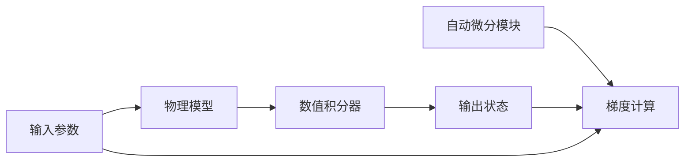

# 可微分物理引擎在机器人运动规划中的应用

> 关键词：可微分物理引擎、机器人运动规划、物理模拟、优化算法、机器学习

> 摘要：本文深入探讨了可微分物理引擎在机器人运动规划中的应用。首先介绍了相关背景，包括目的、预期读者、文档结构和术语表。接着阐述了可微分物理引擎和机器人运动规划的核心概念及联系，并给出了相应的原理和架构示意图。详细讲解了核心算法原理和具体操作步骤，通过Python代码进行了说明。同时，给出了相关的数学模型和公式，并举例说明。通过项目实战，展示了代码的实际案例和详细解释。分析了可微分物理引擎在机器人运动规划中的实际应用场景。推荐了学习资源、开发工具框架和相关论文著作。最后总结了未来发展趋势与挑战，还提供了常见问题与解答以及扩展阅读和参考资料。

## 1. 背景介绍 
### 1.1 目的和范围
机器人运动规划是机器人领域的核心问题之一，其目标是在给定的环境中为机器人找到一条从起始点到目标点的安全、高效的路径。传统的运动规划方法通常基于几何模型和运动学模型，忽略了物理动力学的影响。然而，在实际应用中，机器人的运动受到物理定律的约束，如重力、摩擦力等。可微分物理引擎能够模拟物理系统的动态行为，并且可以计算物理状态相对于输入参数的梯度。将可微分物理引擎应用于机器人运动规划中，可以考虑物理动力学的影响，从而生成更加真实、可行的运动规划方案。本文的范围涵盖了可微分物理引擎的基本原理、在机器人运动规划中的应用方法、相关算法和实际案例。

### 1.2 预期读者
本文的预期读者包括机器人领域的研究人员、工程师、学生，以及对可微分物理引擎和机器人运动规划感兴趣的技术爱好者。读者需要具备一定的机器人学、物理学和编程基础，熟悉Python编程语言和基本的机器学习概念。

### 1.3 文档结构概述
本文共分为十个部分。第一部分为背景介绍，包括目的和范围、预期读者、文档结构概述和术语表。第二部分阐述了可微分物理引擎和机器人运动规划的核心概念及联系，并给出了相应的原理和架构示意图。第三部分详细讲解了核心算法原理和具体操作步骤，通过Python代码进行了说明。第四部分给出了相关的数学模型和公式，并举例说明。第五部分通过项目实战，展示了代码的实际案例和详细解释。第六部分分析了可微分物理引擎在机器人运动规划中的实际应用场景。第七部分推荐了学习资源、开发工具框架和相关论文著作。第八部分总结了未来发展趋势与挑战。第九部分提供了常见问题与解答。第十部分为扩展阅读和参考资料。

### 1.4 术语表
#### 1.4.1 核心术语定义
- **可微分物理引擎**：一种能够模拟物理系统动态行为，并且可以计算物理状态相对于输入参数梯度的物理引擎。
- **机器人运动规划**：在给定的环境中为机器人找到一条从起始点到目标点的安全、高效的路径的过程。
- **物理模拟**：对物理系统的动态行为进行计算机模拟的过程。
- **优化算法**：用于寻找最优解的算法，如梯度下降法、牛顿法等。
- **机器学习**：让计算机通过数据学习模式和规律的方法。

#### 1.4.2 相关概念解释
- **物理动力学**：研究物体在力的作用下的运动规律的学科。
- **梯度**：函数在某一点的变化率，用于优化算法中确定搜索方向。
- **状态空间**：机器人所有可能的状态组成的空间。
- **轨迹规划**：为机器人规划一条连续的运动轨迹。

#### 1.4.3 缩略词列表
- **ODE**：Open Dynamics Engine，一种开源的物理引擎。
- **PyTorch**：一个开源的深度学习框架。
- **ROS**：Robot Operating System，机器人操作系统。

## 2. 核心概念与联系 
### 2.1 可微分物理引擎原理
可微分物理引擎的核心思想是将物理模拟过程表示为一个可微分的计算图。在这个计算图中，输入是物理系统的初始状态和控制参数，输出是物理系统在未来某个时刻的状态。通过自动微分技术，可以计算输出状态相对于输入参数的梯度。

可微分物理引擎的架构通常包括以下几个部分：
- **物理模型**：描述物理系统的动力学方程，如牛顿第二定律、欧拉方程等。
- **数值积分器**：用于求解物理模型的微分方程，得到物理系统在离散时间步的状态。
- **自动微分模块**：计算物理状态相对于输入参数的梯度。

下面是可微分物理引擎的原理示意图：



### 2.2 机器人运动规划原理
机器人运动规划的目标是在给定的环境中为机器人找到一条从起始点到目标点的安全、高效的路径。传统的运动规划方法通常基于几何模型和运动学模型，忽略了物理动力学的影响。而考虑物理动力学的运动规划方法需要使用物理引擎来模拟机器人的运动。

机器人运动规划的一般步骤包括：
- **环境建模**：将机器人所处的环境表示为一个数学模型，如地图、障碍物模型等。
- **状态表示**：定义机器人的状态，如位置、速度、姿态等。
- **目标定义**：明确机器人的目标，如到达某个位置、完成某个任务等。
- **规划算法**：使用规划算法在状态空间中搜索一条从起始状态到目标状态的路径。

### 2.3 可微分物理引擎与机器人运动规划的联系
可微分物理引擎为机器人运动规划提供了一种考虑物理动力学的方法。通过可微分物理引擎，可以模拟机器人在物理环境中的运动，并计算运动轨迹相对于控制参数的梯度。利用这些梯度信息，可以使用优化算法来优化机器人的运动规划，从而生成更加真实、可行的运动方案。

具体来说，可微分物理引擎在机器人运动规划中的应用主要体现在以下几个方面：
- **轨迹优化**：通过可微分物理引擎计算运动轨迹的梯度，使用优化算法对轨迹进行优化，以满足各种约束条件，如避障、能量最小化等。
- **控制参数优化**：优化机器人的控制参数，如关节力矩、电机输入等，以实现更好的运动性能。
- **环境交互模拟**：模拟机器人与环境的交互，如碰撞、摩擦等，从而生成更加真实的运动规划。

## 3. 核心算法原理 & 具体操作步骤 
### 3.1 核心算法原理
可微分物理引擎在机器人运动规划中的核心算法是基于梯度的优化算法。其基本思想是定义一个目标函数，该函数衡量机器人运动规划的优劣，如路径长度、能量消耗、碰撞风险等。然后，使用可微分物理引擎计算目标函数相对于控制参数的梯度，通过梯度下降等优化算法不断更新控制参数，直到目标函数达到最优值。

下面是基于梯度的优化算法的Python代码示例：

```python
import torch

# 定义目标函数
def objective_function(control_params):
    # 使用可微分物理引擎模拟机器人运动
    # 这里假设物理引擎的模拟函数为 simulate_robot_motion
    final_state = simulate_robot_motion(control_params)
    # 计算目标函数值，例如路径长度
    path_length = calculate_path_length(final_state)
    return path_length

# 初始化控制参数
control_params = torch.randn(10, requires_grad=True)

# 定义优化器
optimizer = torch.optim.Adam([control_params], lr=0.01)

# 迭代优化
num_iterations = 100
for i in range(num_iterations):
    # 计算目标函数值
    loss = objective_function(control_params)
    
    # 反向传播计算梯度
    optimizer.zero_grad()
    loss.backward()
    
    # 更新控制参数
    optimizer.step()
    
    # 打印损失值
    print(f'Iteration {i+1}, Loss: {loss.item()}')
```

### 3.2 具体操作步骤
1. **定义物理模型**：根据机器人的动力学特性，定义物理模型，如刚体动力学模型、关节动力学模型等。
2. **实现可微分物理引擎**：使用自动微分技术实现可微分物理引擎，能够计算物理状态相对于输入参数的梯度。
3. **定义目标函数**：根据机器人运动规划的目标，定义目标函数，如路径长度、能量消耗、碰撞风险等。
4. **初始化控制参数**：随机初始化机器人的控制参数，如关节角度、力矩等。
5. **迭代优化**：使用基于梯度的优化算法，如梯度下降法、Adam优化器等，不断更新控制参数，直到目标函数达到最优值。
6. **验证结果**：使用优化后的控制参数，在物理引擎中模拟机器人的运动，验证运动规划的效果。

## 4. 数学模型和公式 & 详细讲解 & 举例说明 
### 4.1 物理动力学模型
机器人的物理动力学模型通常可以用牛顿第二定律和欧拉方程来描述。对于一个刚体，其动力学方程可以表示为：

$$
\begin{cases}
m\ddot{\mathbf{x}} = \mathbf{F} \\
\mathbf{I}\dot{\boldsymbol{\omega}} + \boldsymbol{\omega} \times (\mathbf{I}\boldsymbol{\omega}) = \mathbf{\tau}
\end{cases}
$$

其中，$m$ 是刚体的质量，$\mathbf{x}$ 是刚体的位置，$\mathbf{F}$ 是作用在刚体上的合力，$\mathbf{I}$ 是刚体的惯性矩阵，$\boldsymbol{\omega}$ 是刚体的角速度，$\mathbf{\tau}$ 是作用在刚体上的合力矩。

### 4.2 目标函数
目标函数用于衡量机器人运动规划的优劣。常见的目标函数包括：
- **路径长度**：机器人运动轨迹的长度，定义为：

$$
L = \int_{t_0}^{t_1} \|\dot{\mathbf{x}}(t)\| dt
$$

其中，$\mathbf{x}(t)$ 是机器人在时刻 $t$ 的位置，$\dot{\mathbf{x}}(t)$ 是机器人的速度。

- **能量消耗**：机器人运动过程中消耗的能量，定义为：

$$
E = \int_{t_0}^{t_1} \mathbf{\tau}(t)^T \dot{\boldsymbol{\theta}}(t) dt
$$

其中，$\mathbf{\tau}(t)$ 是机器人关节的力矩，$\dot{\boldsymbol{\theta}}(t)$ 是机器人关节的角速度。

### 4.3 梯度计算
为了使用基于梯度的优化算法，需要计算目标函数相对于控制参数的梯度。假设控制参数为 $\mathbf{u}$，目标函数为 $J(\mathbf{u})$，则梯度可以表示为：

$$
\nabla_{\mathbf{u}} J(\mathbf{u}) = \frac{\partial J(\mathbf{u})}{\partial \mathbf{u}}
$$

在可微分物理引擎中，可以使用自动微分技术来计算梯度。例如，在PyTorch中，可以通过调用 `backward()` 方法自动计算梯度。

### 4.4 举例说明
假设我们要为一个简单的机器人手臂规划一条运动轨迹，使其从初始位置移动到目标位置，同时最小化路径长度。我们可以定义目标函数为路径长度，控制参数为机器人关节的角度。

```python
import torch

# 定义物理引擎模拟函数
def simulate_robot_motion(control_params):
    # 这里简单模拟机器人运动，实际应用中需要使用物理引擎
    final_position = control_params.sum()
    return final_position

# 定义路径长度计算函数
def calculate_path_length(final_position):
    target_position = 10.0
    path_length = torch.abs(final_position - target_position)
    return path_length

# 初始化控制参数
control_params = torch.randn(5, requires_grad=True)

# 定义优化器
optimizer = torch.optim.Adam([control_params], lr=0.01)

# 迭代优化
num_iterations = 100
for i in range(num_iterations):
    # 计算目标函数值
    final_position = simulate_robot_motion(control_params)
    loss = calculate_path_length(final_position)
    
    # 反向传播计算梯度
    optimizer.zero_grad()
    loss.backward()
    
    # 更新控制参数
    optimizer.step()
    
    # 打印损失值
    print(f'Iteration {i+1}, Loss: {loss.item()}')
```

## 5. 项目实战：代码实际案例和详细解释说明 
### 5.1  开发环境搭建
为了实现可微分物理引擎在机器人运动规划中的应用，我们需要搭建以下开发环境：
- **Python**：建议使用Python 3.7及以上版本。
- **PyTorch**：一个开源的深度学习框架，用于自动微分和优化算法。
- **MuJoCo**：一个高效的物理引擎，支持可微分模拟。
- **ROS**：机器人操作系统，用于机器人的控制和通信。

可以使用以下命令安装所需的库：

```bash
pip install torch mujoco_py rospy
```

### 5.2  源代码详细实现和代码解读
下面是一个使用MuJoCo和PyTorch实现的简单机器人运动规划示例：

```python
import torch
import mujoco_py
import numpy as np

# 加载MuJoCo模型
model = mujoco_py.load_model_from_path('path/to/your/model.xml')
sim = mujoco_py.MjSim(model)

# 定义目标函数
def objective_function(control_params):
    # 重置模拟器
    sim.reset()
    
    # 设置控制参数
    sim.data.ctrl[:] = control_params.detach().numpy()
    
    # 模拟机器人运动
    num_steps = 100
    for _ in range(num_steps):
        sim.step()
    
    # 获取最终状态
    final_position = sim.data.qpos[:]
    
    # 计算目标函数值，例如与目标位置的距离
    target_position = np.array([1.0, 2.0, 3.0])
    loss = torch.tensor(np.linalg.norm(final_position - target_position))
    
    return loss

# 初始化控制参数
control_params = torch.randn(model.nu, requires_grad=True)

# 定义优化器
optimizer = torch.optim.Adam([control_params], lr=0.01)

# 迭代优化
num_iterations = 100
for i in range(num_iterations):
    # 计算目标函数值
    loss = objective_function(control_params)
    
    # 反向传播计算梯度
    optimizer.zero_grad()
    loss.backward()
    
    # 更新控制参数
    optimizer.step()
    
    # 打印损失值
    print(f'Iteration {i+1}, Loss: {loss.item()}')
```

### 5.3  代码解读与分析
- **加载MuJoCo模型**：使用 `mujoco_py.load_model_from_path` 函数加载MuJoCo模型，并创建模拟器对象。
- **定义目标函数**：在目标函数中，首先重置模拟器，然后设置控制参数，模拟机器人运动，获取最终状态，计算目标函数值。
- **初始化控制参数**：随机初始化控制参数，并设置 `requires_grad=True` 以便进行自动微分。
- **定义优化器**：使用Adam优化器进行参数更新。
- **迭代优化**：在每次迭代中，计算目标函数值，反向传播计算梯度，更新控制参数，并打印损失值。

通过不断迭代优化，控制参数会逐渐收敛到最优值，从而得到一个较好的机器人运动规划方案。

## 6. 实际应用场景 
### 6.1 工业机器人操作
在工业生产中，机器人需要完成各种复杂的操作任务，如搬运、装配等。可微分物理引擎可以帮助工业机器人考虑物理动力学的影响，生成更加真实、可行的运动规划方案。例如，在搬运重物时，考虑物体的重量和惯性，避免机器人在运动过程中出现抖动或失控的情况。

### 6.2 服务机器人导航
服务机器人需要在复杂的环境中进行导航，如家庭、商场等。可微分物理引擎可以模拟机器人与环境的交互，如碰撞、摩擦等，从而生成更加安全、高效的导航路径。例如，在遇到障碍物时，考虑机器人的动力学特性，选择合适的避障策略。

### 6.3 机器人运动学习
可微分物理引擎可以与机器学习算法相结合，用于机器人的运动学习。通过模拟不同的物理场景，机器人可以学习到更加复杂的运动技能。例如，使用强化学习算法，让机器人在可微分物理引擎中学习如何行走、跳跃等。

### 6.4 虚拟现实和游戏
在虚拟现实和游戏中，可微分物理引擎可以提供更加真实的物理模拟效果。例如，在虚拟现实游戏中，玩家可以与虚拟物体进行交互，可微分物理引擎可以模拟物体的运动和碰撞，增强游戏的沉浸感。

## 7. 工具和资源推荐
### 7.1 学习资源推荐
#### 7.1.1 书籍推荐
- 《机器人学导论》：介绍了机器人的基本概念、运动学、动力学等知识。
- 《机器学习》：讲解了机器学习的基本算法和原理。
- 《物理引擎开发》：深入介绍了物理引擎的开发原理和技术。

#### 7.1.2 在线课程
- Coursera上的“机器人学基础”课程：系统地介绍了机器人学的基础知识。
- edX上的“深度学习”课程：学习深度学习的基本算法和应用。
- Udemy上的“物理模拟与游戏开发”课程：讲解了物理模拟在游戏开发中的应用。

#### 7.1.3 技术博客和网站
- arXiv：一个预印本平台，提供了大量的学术论文和研究成果。
- Medium：有许多关于机器人和人工智能的技术博客文章。
- GitHub：可以找到许多开源的机器人和物理引擎项目。

### 7.2 开发工具框架推荐
#### 7.2.1 IDE和编辑器
- PyCharm：一个专业的Python集成开发环境，提供了丰富的代码编辑和调试功能。
- Visual Studio Code：一个轻量级的代码编辑器，支持多种编程语言和插件。

#### 7.2.2 调试和性能分析工具
- PyTorch Profiler：用于分析PyTorch代码的性能瓶颈。
- MuJoCo Viewer：MuJoCo的可视化工具，用于调试和查看物理模拟结果。

#### 7.2.3 相关框架和库
- PyTorch：一个开源的深度学习框架，支持自动微分和优化算法。
- MuJoCo：一个高效的物理引擎，支持可微分模拟。
- ROS：机器人操作系统，用于机器人的控制和通信。

### 7.3 相关论文著作推荐
#### 7.3.1 经典论文
- “Learning to Control a Low-Cost Manipulator using Differentiable Physics”：介绍了使用可微分物理引擎控制低成本机械臂的方法。
- “Differentiable Physics for Deep Learning: a Survey”：对可微分物理在深度学习中的应用进行了综述。

#### 7.3.2 最新研究成果
- 关注顶级学术会议，如ICRA（IEEE International Conference on Robotics and Automation）、IROS（IEEE/RSJ International Conference on Intelligent Robots and Systems）等，了解可微分物理引擎在机器人运动规划中的最新研究成果。

#### 7.3.3 应用案例分析
- 一些工业机器人和服务机器人的应用案例可以在相关公司的官方网站和技术博客上找到，通过分析这些案例可以了解可微分物理引擎在实际应用中的效果和挑战。

## 8. 总结：未来发展趋势与挑战
### 8.1 未来发展趋势
- **与深度学习的深度融合**：可微分物理引擎将与深度学习技术更加紧密地结合，通过深度学习模型学习物理系统的动态特性，从而提高物理模拟的准确性和效率。
- **多机器人协作规划**：随着机器人应用场景的不断扩展，多机器人协作规划将成为一个重要的研究方向。可微分物理引擎可以帮助多机器人系统考虑物理交互和动力学约束，实现更加高效的协作规划。
- **实时物理模拟**：在一些实时性要求较高的应用场景中，如机器人实时控制、虚拟现实等，需要实现实时的物理模拟。未来的可微分物理引擎将朝着更加高效、实时的方向发展。
- **跨领域应用**：可微分物理引擎的应用将不再局限于机器人领域，还将拓展到其他领域，如航空航天、生物医学等。

### 8.2 挑战
- **计算效率**：可微分物理引擎的计算复杂度较高，特别是在处理复杂的物理系统和大规模的模拟时，计算效率成为一个关键问题。需要研究更加高效的算法和优化技术，提高计算效率。
- **物理模型的准确性**：物理模型的准确性直接影响到运动规划的效果。然而，在实际应用中，物理系统往往具有不确定性和复杂性，很难建立精确的物理模型。需要研究更加准确的物理建模方法，提高物理模型的鲁棒性。
- **数据获取和标注**：在使用机器学习方法结合可微分物理引擎时，需要大量的训练数据。然而，获取和标注这些数据往往是一项困难且昂贵的任务。需要研究更加高效的数据获取和标注方法，降低数据成本。
- **系统的可扩展性**：随着机器人系统的规模和复杂度不断增加，可微分物理引擎需要具备良好的可扩展性。需要研究分布式计算和并行计算技术，提高系统的可扩展性。

## 9. 附录：常见问题与解答
### 9.1 可微分物理引擎与传统物理引擎有什么区别？
传统物理引擎主要用于模拟物理系统的动态行为，而可微分物理引擎不仅可以模拟物理系统的动态行为，还可以计算物理状态相对于输入参数的梯度。这些梯度信息可以用于优化算法，从而实现更加高效的运动规划和控制。

### 9.2 可微分物理引擎在机器人运动规划中的优势是什么？
可微分物理引擎在机器人运动规划中的优势主要体现在以下几个方面：
- 考虑物理动力学的影响，生成更加真实、可行的运动规划方案。
- 可以使用基于梯度的优化算法，提高运动规划的效率和质量。
- 支持与机器学习算法相结合，实现更加复杂的运动学习和控制。

### 9.3 如何选择合适的可微分物理引擎？
选择合适的可微分物理引擎需要考虑以下几个因素：
- 物理模拟的准确性和效率。
- 是否支持自动微分和梯度计算。
- 是否有丰富的文档和社区支持。
- 是否适用于具体的应用场景。

### 9.4 可微分物理引擎在实际应用中存在哪些挑战？
可微分物理引擎在实际应用中存在的挑战主要包括计算效率、物理模型的准确性、数据获取和标注、系统的可扩展性等方面。需要研究更加高效的算法和优化技术，提高物理模型的鲁棒性，降低数据成本，提高系统的可扩展性。

## 10. 扩展阅读 & 参考资料
### 10.1 扩展阅读
- 《机器人动力学与控制》：深入介绍了机器人的动力学建模和控制方法。
- 《深度学习中的自动微分》：详细讲解了自动微分的原理和应用。
- 《物理模拟与计算机图形学》：探讨了物理模拟在计算机图形学中的应用。

### 10.2 参考资料
- [MuJoCo官方文档](https://mujoco.readthedocs.io/en/stable/)
- [PyTorch官方文档](https://pytorch.org/docs/stable/index.html)
- [ROS官方文档](http://wiki.ros.org/)

作者：AI天才研究院/AI Genius Institute & 禅与计算机程序设计艺术 /Zen And The Art of Computer Programming