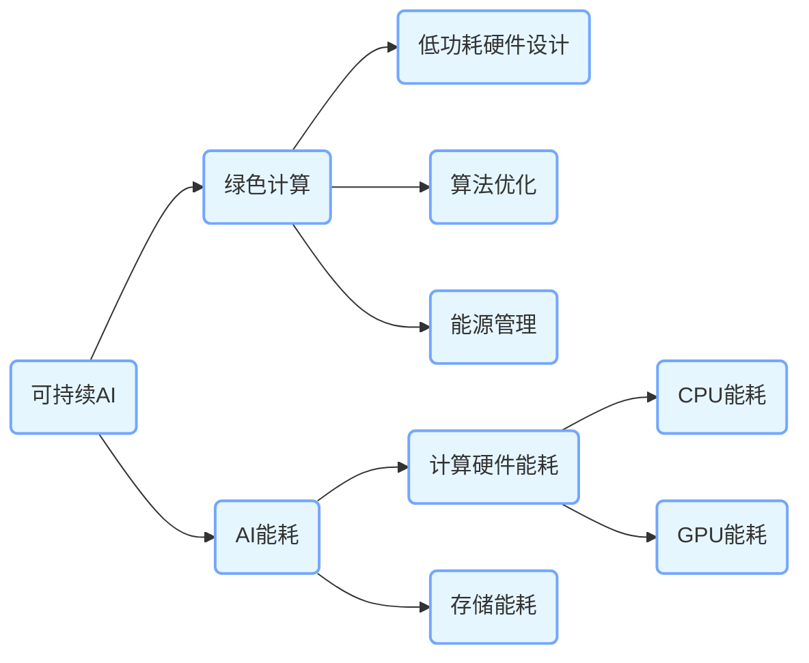

# 可持续AI:平衡性能与环境影响

> 关键词：可持续AI、性能、环境影响、绿色计算、AI能耗

> 摘要：本文聚焦于可持续AI，深入探讨如何在提升AI性能的同时降低其对环境的影响。通过介绍相关核心概念，剖析核心算法原理，阐述数学模型，结合项目实战案例，分析实际应用场景等方面，详细阐述了平衡性能与环境影响的方法和策略。同时，推荐了学习资源、开发工具框架以及相关论文著作，最后总结了可持续AI的未来发展趋势与挑战，并对常见问题进行了解答。

## 1. 背景介绍 
### 1.1 目的和范围
随着人工智能技术的飞速发展，AI在各个领域的应用越来越广泛，其性能的提升为人们带来了诸多便利和创新。然而，AI系统的运行需要消耗大量的能源，这对环境造成了不可忽视的影响。本文章的目的在于探讨如何在保证AI性能的前提下，尽可能地减少其对环境的负面影响，实现可持续AI的发展。范围涵盖了可持续AI的核心概念、算法原理、数学模型、实际应用案例等多个方面，旨在为相关研究人员、开发者和从业者提供全面的指导和参考。

### 1.2 预期读者
本文预期读者包括人工智能领域的研究人员、开发者、软件架构师、数据科学家、CTO等技术专业人士，以及对可持续发展和绿色计算感兴趣的环保人士和政策制定者。通过阅读本文，读者可以深入了解可持续AI的相关知识和技术，掌握平衡性能与环境影响的方法和策略，为推动可持续AI的发展贡献自己的力量。

### 1.3 文档结构概述
本文共分为十个部分，具体结构如下：
1. 背景介绍：阐述文章的目的和范围、预期读者、文档结构概述以及相关术语表。
2. 核心概念与联系：介绍可持续AI的核心概念，包括绿色计算、AI能耗等，并分析它们之间的联系。
3. 核心算法原理 & 具体操作步骤：详细讲解平衡性能与环境影响的核心算法原理，并给出具体的操作步骤。
4. 数学模型和公式 & 详细讲解 & 举例说明：建立数学模型和公式，对算法原理进行详细讲解，并通过具体例子进行说明。
5. 项目实战：代码实际案例和详细解释说明：通过一个实际的项目案例，展示如何在代码层面实现可持续AI。
6. 实际应用场景：介绍可持续AI在各个领域的实际应用场景。
7. 工具和资源推荐：推荐学习资源、开发工具框架以及相关论文著作。
8. 总结：未来发展趋势与挑战：总结可持续AI的未来发展趋势和面临的挑战。
9. 附录：常见问题与解答：对常见问题进行解答。
10. 扩展阅读 & 参考资料：提供扩展阅读和参考资料，方便读者进一步深入研究。

### 1.4 术语表
#### 1.4.1 核心术语定义
- **可持续AI**：指在保证AI系统性能的前提下，尽可能地减少其对环境的负面影响，实现AI技术的可持续发展。
- **绿色计算**：是一种致力于降低计算机系统能源消耗和环境影响的计算方法和技术。
- **AI能耗**：指AI系统在运行过程中所消耗的能源，包括电力、水资源等。
- **能效比**：指AI系统在单位能耗下所能达到的性能指标，是衡量AI系统能源利用效率的重要指标。

#### 1.4.2 相关概念解释
- **模型压缩**：通过对AI模型进行压缩，减少模型的参数数量和计算量，从而降低模型的能耗。
- **分布式计算**：将AI计算任务分配到多个计算节点上进行并行处理，提高计算效率，降低能耗。
- **可再生能源**：指太阳能、风能、水能等可以不断再生的能源，使用可再生能源可以减少AI系统对传统能源的依赖，降低环境影响。

#### 1.4.3 缩略词列表
- **AI**：Artificial Intelligence，人工智能
- **ML**：Machine Learning，机器学习
- **DL**：Deep Learning，深度学习
- **GPU**：Graphics Processing Unit，图形处理单元
- **CPU**：Central Processing Unit，中央处理单元

## 2. 核心概念与联系 
### 核心概念原理
可持续AI的核心在于平衡AI系统的性能和环境影响。为了实现这一目标，需要从多个方面入手，包括硬件设计、算法优化、能源管理等。

#### 绿色计算
绿色计算是可持续AI的重要组成部分，其核心原理是通过优化计算机系统的硬件和软件设计，降低能源消耗和环境影响。具体措施包括采用低功耗的硬件设备、优化算法以减少计算量、合理管理能源等。

#### AI能耗
AI能耗主要来自于计算过程中硬件设备的运行，如CPU、GPU等。随着AI模型的不断增大和复杂度的提高，能耗问题日益突出。降低AI能耗的关键在于优化算法和硬件设计，提高能源利用效率。

### 架构的文本示意图
```plaintext
可持续AI
|-- 绿色计算
|   |-- 低功耗硬件设计
|   |-- 算法优化
|   |-- 能源管理
|-- AI能耗
|   |-- 计算硬件能耗
|   |   |-- CPU能耗
|   |   |-- GPU能耗
|   |-- 存储能耗
```

### Mermaid流程图


## 3. 核心算法原理 & 具体操作步骤 
### 核心算法原理
为了平衡AI性能和环境影响，一种常用的算法是模型压缩算法。模型压缩算法通过减少AI模型的参数数量和计算量，降低模型的能耗，同时尽可能保持模型的性能。

以下是一个简单的模型压缩算法的Python实现示例，以神经网络模型为例：

```python
import torch
import torch.nn as nn
import torch.nn.utils.prune as prune

# 定义一个简单的神经网络模型
class SimpleNet(nn.Module):
    def __init__(self):
        super(SimpleNet, self).__init__()
        self.fc1 = nn.Linear(10, 20)
        self.fc2 = nn.Linear(20, 1)

    def forward(self, x):
        x = torch.relu(self.fc1(x))
        x = self.fc2(x)
        return x

# 创建模型实例
model = SimpleNet()

# 对模型进行剪枝
parameters_to_prune = (
    (model.fc1, 'weight'),
    (model.fc2, 'weight'),
)

prune.global_unstructured(
    parameters_to_prune,
    pruning_method=prune.L1Unstructured,
    amount=0.2,
)

# 移除剪枝标记
for module, name in parameters_to_prune:
    prune.remove(module, name)

# 打印剪枝后的模型参数数量
total_params = sum(p.numel() for p in model.parameters())
print(f"Pruned model has {total_params} parameters.")
```

### 具体操作步骤
1. **选择合适的模型压缩方法**：根据模型的类型和特点，选择合适的模型压缩方法，如剪枝、量化、知识蒸馏等。
2. **定义模型和数据**：定义要压缩的AI模型，并准备好训练数据。
3. **进行模型压缩**：使用选择的模型压缩方法对模型进行压缩。
4. **评估压缩后模型的性能**：使用测试数据评估压缩后模型的性能，确保性能损失在可接受的范围内。
5. **部署压缩后模型**：将压缩后模型部署到实际应用中，以降低能耗。

## 4. 数学模型和公式 & 详细讲解 & 举例说明 
### 能效比公式
能效比（Energy Efficiency Ratio，EER）是衡量AI系统能源利用效率的重要指标，其计算公式为：

$$EER = \frac{Performance}{Energy Consumption}$$

其中，$Performance$ 表示AI系统的性能指标，如准确率、召回率等；$Energy Consumption$ 表示AI系统的能耗。

### 详细讲解
能效比越高，说明AI系统在单位能耗下所能达到的性能越好，能源利用效率越高。通过优化算法和硬件设计，可以提高能效比，从而实现可持续AI。

### 举例说明
假设一个AI图像分类模型在运行过程中消耗了1000焦耳的能量，分类准确率为90%。则该模型的能效比为：

$$EER = \frac{0.9}{1000} = 0.0009$$

如果通过模型压缩等方法，将模型的能耗降低到500焦耳，同时保持分类准确率为90%，则能效比变为：

$$EER = \frac{0.9}{500} = 0.0018$$

可以看到，通过降低能耗，能效比得到了显著提高。

## 5. 项目实战：代码实际案例和详细解释说明 
### 5.1  开发环境搭建
- **操作系统**：Ubuntu 20.04
- **Python版本**：Python 3.8
- **深度学习框架**：PyTorch 1.9
- **开发工具**：Jupyter Notebook

### 5.2  源代码详细实现和代码解读
以下是一个基于PyTorch的图像分类项目的代码示例，同时包含模型压缩的实现：

```python
import torch
import torch.nn as nn
import torch.optim as optim
from torchvision import datasets, transforms
import torch.nn.utils.prune as prune

# 数据预处理
transform = transforms.Compose([
    transforms.ToTensor(),
    transforms.Normalize((0.5,), (0.5,))
])

# 加载数据集
train_dataset = datasets.MNIST(root='./data', train=True,
                               download=True, transform=transform)
test_dataset = datasets.MNIST(root='./data', train=False,
                              download=True, transform=transform)

train_loader = torch.utils.data.DataLoader(train_dataset, batch_size=64, shuffle=True)
test_loader = torch.utils.data.DataLoader(test_dataset, batch_size=64, shuffle=False)

# 定义简单的神经网络模型
class SimpleNet(nn.Module):
    def __init__(self):
        super(SimpleNet, self).__init__()
        self.fc1 = nn.Linear(784, 128)
        self.fc2 = nn.Linear(128, 10)

    def forward(self, x):
        x = x.view(-1, 784)
        x = torch.relu(self.fc1(x))
        x = self.fc2(x)
        return x

# 创建模型实例
model = SimpleNet()

# 定义损失函数和优化器
criterion = nn.CrossEntropyLoss()
optimizer = optim.SGD(model.parameters(), lr=0.01, momentum=0.5)

# 训练模型
def train(model, train_loader, criterion, optimizer, epochs):
    model.train()
    for epoch in range(epochs):
        running_loss = 0.0
        for i, (images, labels) in enumerate(train_loader):
            optimizer.zero_grad()
            outputs = model(images)
            loss = criterion(outputs, labels)
            loss.backward()
            optimizer.step()
            running_loss += loss.item()
        print(f'Epoch {epoch + 1}, Loss: {running_loss / len(train_loader)}')

# 测试模型
def test(model, test_loader):
    model.eval()
    correct = 0
    total = 0
    with torch.no_grad():
        for images, labels in test_loader:
            outputs = model(images)
            _, predicted = torch.max(outputs.data, 1)
            total += labels.size(0)
            correct += (predicted == labels).sum().item()
    print(f'Accuracy: {100 * correct / total}%')

# 训练模型
train(model, train_loader, criterion, optimizer, epochs=5)

# 测试模型
test(model, test_loader)

# 对模型进行剪枝
parameters_to_prune = (
    (model.fc1, 'weight'),
    (model.fc2, 'weight'),
)

prune.global_unstructured(
    parameters_to_prune,
    pruning_method=prune.L1Unstructured,
    amount=0.2,
)

# 移除剪枝标记
for module, name in parameters_to_prune:
    prune.remove(module, name)

# 再次测试剪枝后的模型
test(model, test_loader)
```

### 5.3  代码解读与分析
1. **数据预处理**：使用 `transforms.Compose` 对图像数据进行预处理，包括转换为张量和归一化。
2. **数据集加载**：使用 `torchvision.datasets.MNIST` 加载MNIST手写数字数据集，并使用 `DataLoader` 进行批量加载。
3. **模型定义**：定义一个简单的全连接神经网络模型 `SimpleNet`。
4. **训练和测试函数**：定义 `train` 和 `test` 函数，分别用于训练和测试模型。
5. **模型训练**：调用 `train` 函数对模型进行训练。
6. **模型测试**：调用 `test` 函数对模型进行测试，输出准确率。
7. **模型剪枝**：使用 `torch.nn.utils.prune` 对模型进行剪枝，减少模型的参数数量。
8. **再次测试**：对剪枝后的模型进行再次测试，观察剪枝对模型性能的影响。

## 6. 实际应用场景 
### 智能交通
在智能交通领域，可持续AI可以用于优化交通流量，减少交通拥堵，从而降低车辆的能耗和尾气排放。例如，通过使用AI算法对交通数据进行实时分析和预测，智能交通系统可以动态调整交通信号灯的时间，引导车辆选择最优路线，提高交通效率。

### 能源管理
在能源管理领域，可持续AI可以用于优化能源分配和使用，提高能源利用效率。例如，通过使用AI算法对能源消耗数据进行分析和预测，能源管理系统可以实时调整能源供应，避免能源浪费。

### 医疗保健
在医疗保健领域，可持续AI可以用于疾病诊断和治疗，提高医疗效率，减少医疗资源的浪费。例如，通过使用AI算法对医学影像数据进行分析和诊断，医生可以更准确地判断病情，制定更合理的治疗方案。

### 农业
在农业领域，可持续AI可以用于农作物种植和病虫害防治，提高农业生产效率，减少农药和化肥的使用。例如，通过使用AI算法对农田图像数据进行分析和识别，农民可以及时发现农作物的病虫害问题，并采取相应的防治措施。

## 7. 工具和资源推荐
### 7.1 学习资源推荐
#### 7.1.1 书籍推荐
- 《深度学习》（Deep Learning）：由Ian Goodfellow、Yoshua Bengio和Aaron Courville撰写，是深度学习领域的经典教材。
- 《人工智能：一种现代的方法》（Artificial Intelligence: A Modern Approach）：由Stuart Russell和Peter Norvig撰写，全面介绍了人工智能的各个方面。
- 《绿色计算：从理论到实践》（Green Computing: From Theory to Practice）：详细介绍了绿色计算的原理和方法。

#### 7.2.2 在线课程
- Coursera上的“深度学习专项课程”（Deep Learning Specialization）：由Andrew Ng教授授课，是深度学习领域的经典在线课程。
- edX上的“人工智能基础”（Fundamentals of Artificial Intelligence）：全面介绍了人工智能的基础知识和技术。
- Udemy上的“绿色计算与可持续发展”（Green Computing and Sustainable Development）：专门讲解绿色计算和可持续发展的相关知识。

#### 7.2.3 技术博客和网站
- Towards Data Science：是一个专注于数据科学和人工智能的技术博客，提供了大量的优质文章和教程。
- Medium：是一个综合性的技术博客平台，上面有很多关于可持续AI的文章和讨论。
- arXiv：是一个预印本数据库，提供了最新的人工智能研究论文。

### 7.2 开发工具框架推荐
#### 7.2.1 IDE和编辑器
- PyCharm：是一款专业的Python集成开发环境，提供了丰富的功能和插件，方便开发者进行Python开发。
- Jupyter Notebook：是一个交互式的开发环境，适合进行数据分析和模型训练。
- Visual Studio Code：是一款轻量级的代码编辑器，支持多种编程语言和插件，非常适合快速开发。

#### 7.2.2 调试和性能分析工具
- TensorBoard：是TensorFlow提供的一个可视化工具，用于监控和分析模型的训练过程和性能。
- Py-Spy：是一个Python性能分析工具，可以帮助开发者找出Python代码中的性能瓶颈。
- NVIDIA Nsight Systems：是NVIDIA提供的一款性能分析工具，专门用于分析GPU应用程序的性能。

#### 7.2.3 相关框架和库
- PyTorch：是一个开源的深度学习框架，具有简单易用、灵活性高的特点，广泛应用于人工智能领域。
- TensorFlow：是另一个开源的深度学习框架，具有强大的分布式计算能力和丰富的工具库。
- Scikit-learn：是一个开源的机器学习库，提供了各种机器学习算法和工具，适合初学者和快速开发。

### 7.3 相关论文著作推荐
#### 7.3.1 经典论文
- “Attention Is All You Need”：提出了Transformer模型，是自然语言处理领域的重要突破。
- “ImageNet Classification with Deep Convolutional Neural Networks”：提出了AlexNet模型，开启了深度学习在计算机视觉领域的应用。
- “Greening Machine Learning: An Overview of Issues, Techniques, and Directions”：全面介绍了绿色机器学习的相关问题和技术。

#### 7.3.2 最新研究成果
- 在arXiv等预印本数据库上可以找到最新的可持续AI研究成果，关注这些研究可以了解该领域的最新发展动态。

#### 7.3.3 应用案例分析
- 一些知名企业和研究机构会发布可持续AI的应用案例分析报告，这些报告可以帮助我们了解可持续AI在实际应用中的效果和挑战。

## 8. 总结：未来发展趋势与挑战
### 未来发展趋势
- **绿色硬件设计**：未来，硬件制造商将更加注重绿色设计，开发低功耗、高性能的硬件设备，以降低AI系统的能耗。
- **算法创新**：研究人员将不断探索新的算法和技术，提高AI系统的能效比，实现更高效的计算。
- **可再生能源的应用**：随着可再生能源技术的不断发展，AI系统将更多地使用太阳能、风能等可再生能源，减少对传统能源的依赖。
- **跨领域合作**：可持续AI将与能源、交通、医疗等多个领域进行更深入的合作，共同推动可持续发展。

### 挑战
- **技术难题**：目前，平衡AI性能和环境影响仍然面临一些技术难题，如如何在保证模型性能的前提下实现更高效的模型压缩。
- **成本问题**：采用绿色计算技术和可再生能源可能会增加AI系统的建设和运营成本，需要寻找更经济可行的解决方案。
- **政策和标准**：缺乏统一的政策和标准来规范可持续AI的发展，需要政府和行业组织加强合作，制定相关政策和标准。

## 9. 附录：常见问题与解答
### 问题1：可持续AI真的能显著降低环境影响吗？
解答：是的，通过采用绿色计算技术、模型压缩、分布式计算等方法，可持续AI可以显著降低AI系统的能耗，从而减少对环境的影响。同时，使用可再生能源也可以进一步降低碳足迹。

### 问题2：模型压缩会对AI模型的性能产生多大影响？
解答：模型压缩对AI模型性能的影响取决于压缩方法和压缩程度。一般来说，合理的模型压缩可以在降低能耗的同时，保持模型性能的微小损失。通过实验和调优，可以找到性能和能耗之间的最佳平衡点。

### 问题3：如何衡量AI系统的能效比？
解答：能效比可以通过将AI系统的性能指标（如准确率、召回率等）除以其能耗来计算。具体的计算方法可以根据实际情况进行调整。

### 问题4：可持续AI在实际应用中有哪些成功案例？
解答：在智能交通、能源管理、医疗保健、农业等领域都有可持续AI的成功应用案例。例如，智能交通系统通过优化交通流量降低了车辆的能耗和尾气排放；能源管理系统通过优化能源分配提高了能源利用效率。

## 10. 扩展阅读 & 参考资料
### 扩展阅读
- 《可持续发展与人工智能》（Sustainable Development and Artificial Intelligence）
- 《绿色人工智能技术》（Green Artificial Intelligence Technologies）

### 参考资料
- Goodfellow, I., Bengio, Y., & Courville, A. (2016). Deep Learning. MIT Press.
- Russell, S. J., & Norvig, P. (2016). Artificial Intelligence: A Modern Approach. Pearson.
- “Attention Is All You Need” (https://arxiv.org/abs/1706.03762)
- “ImageNet Classification with Deep Convolutional Neural Networks” (https://papers.nips.cc/paper/4824-imagenet-classification-with-deep-convolutional-neural-networks)

作者：AI天才研究院/AI Genius Institute & 禅与计算机程序设计艺术 /Zen And The Art of Computer Programming