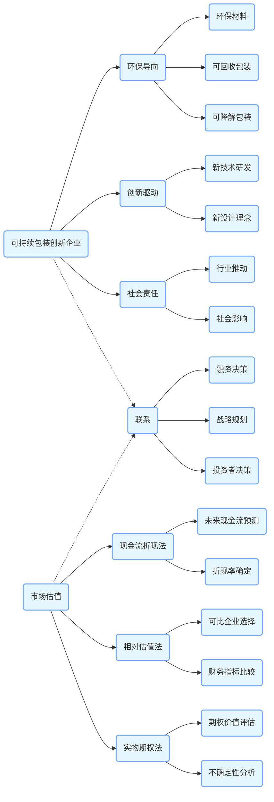

# 可持续包装创新企业的市场估值方法

> 关键词：可持续包装创新企业、市场估值方法、现金流折现法、相对估值法、实物期权法

> 摘要：本文聚焦于可持续包装创新企业的市场估值方法。首先介绍了研究的背景、目的、预期读者和文档结构等内容。接着阐述了可持续包装创新企业相关的核心概念与联系，分析了核心算法原理并给出操作步骤，结合数学模型和公式进行详细讲解与举例。通过项目实战展示代码实现和解读，探讨了该类企业的实际应用场景。推荐了相关的学习资源、开发工具框架以及论文著作。最后总结了未来发展趋势与挑战，解答常见问题并提供扩展阅读与参考资料，旨在为准确评估可持续包装创新企业的市场价值提供全面的理论与实践指导。

## 1. 背景介绍 
### 1.1 目的和范围
在当今环保意识日益增强的大背景下，可持续包装创新企业如雨后春笋般涌现。这些企业致力于研发和推广环保、可回收、可降解的包装解决方案，不仅符合社会可持续发展的需求，也具有巨大的商业潜力。然而，如何准确评估这类企业的市场价值，对于投资者、企业管理者以及相关利益者来说都是一个亟待解决的问题。本文的目的就是深入探讨适用于可持续包装创新企业的市场估值方法，为相关决策提供科学依据。

本文的范围涵盖了常见的市场估值方法，包括现金流折现法、相对估值法、实物期权法等，并结合可持续包装创新企业的特点进行分析和应用。同时，通过项目实战案例展示这些方法在实际中的操作流程和效果。

### 1.2 预期读者
本文的预期读者主要包括：
1. **投资者**：希望通过准确的估值方法找到有潜力的可持续包装创新企业进行投资，以获取合理的回报。
2. **企业管理者**：需要了解自身企业的市场价值，为战略规划、融资、并购等决策提供参考。
3. **行业分析师**：对可持续包装创新行业进行研究和分析，评估行业内企业的竞争力和发展前景。
4. **学术研究人员**：关注可持续发展和企业估值领域的研究，通过本文了解相关领域的最新动态和实践经验。

### 1.3 文档结构概述
本文将按照以下结构展开：
1. **核心概念与联系**：介绍可持续包装创新企业的定义、特点以及与市场估值相关的概念和联系。
2. **核心算法原理 & 具体操作步骤**：详细阐述常见的市场估值方法的原理，并给出具体的操作步骤，同时使用 Python 源代码进行示例。
3. **数学模型和公式 & 详细讲解 & 举例说明**：对各种估值方法的数学模型和公式进行详细讲解，并通过实际例子说明其应用。
4. **项目实战：代码实际案例和详细解释说明**：通过一个具体的项目实战案例，展示如何使用代码实现市场估值，并对代码进行详细解读。
5. **实际应用场景**：分析可持续包装创新企业市场估值在不同场景下的应用。
6. **工具和资源推荐**：推荐相关的学习资源、开发工具框架以及论文著作。
7. **总结：未来发展趋势与挑战**：总结可持续包装创新企业市场估值的未来发展趋势，并分析可能面临的挑战。
8. **附录：常见问题与解答**：解答读者在阅读过程中可能遇到的常见问题。
9. **扩展阅读 & 参考资料**：提供相关的扩展阅读材料和参考资料，方便读者进一步深入学习。

### 1.4 术语表
#### 1.4.1 核心术语定义
- **可持续包装创新企业**：指致力于研发、生产和推广具有环保、可回收、可降解等可持续特性包装产品或服务的企业，通过创新技术和商业模式满足市场对可持续包装的需求。
- **市场估值**：对企业在市场中的价值进行评估和估算，反映企业在当前市场环境下的经济价值。
- **现金流折现法**：通过预测企业未来的现金流，并将其折现到当前时刻，以确定企业的内在价值。
- **相对估值法**：通过比较同行业或类似企业的某些财务指标，如市盈率、市净率等，来评估目标企业的价值。
- **实物期权法**：将企业的投资决策视为一种期权，考虑到未来不确定性和灵活性对企业价值的影响。

#### 1.4.2 相关概念解释
- **可持续发展**：指既满足当代人的需求，又不损害后代人满足其需求的能力的发展模式。在包装领域，可持续发展体现在包装材料的环保性、生产过程的节能减排以及包装产品的可循环利用等方面。
- **创新**：指引入新的产品、技术、方法或商业模式，以提高企业的竞争力和市场价值。在可持续包装创新企业中，创新可能体现在新型包装材料的研发、包装设计的改进或包装服务模式的创新等方面。
- **内在价值**：指企业基于其未来盈利能力和资产状况所具有的真实价值，是市场估值的重要依据。

#### 1.4.3 缩略词列表
- **DCF**：Discounted Cash Flow，现金流折现法
- **P/E**：Price-to-Earnings Ratio，市盈率
- **P/B**：Price-to-Book Ratio，市净率
- **NPV**：Net Present Value，净现值

## 2. 核心概念与联系 

### 可持续包装创新企业的定义和特点
可持续包装创新企业是在可持续发展理念的驱动下产生的新型企业。这些企业的核心特点包括：
1. **环保导向**：以减少对环境的负面影响为首要目标，采用环保材料和生产工艺，致力于开发可回收、可降解的包装产品。
2. **创新驱动**：不断投入研发资源，探索新的包装技术和设计理念，以满足市场对可持续包装的多样化需求。
3. **社会责任**：不仅关注经济效益，还积极履行社会责任，推动整个包装行业向可持续方向发展。

### 市场估值与可持续包装创新企业的联系
准确的市场估值对于可持续包装创新企业具有重要意义：
1. **融资决策**：企业在进行融资时，需要向投资者展示其市场价值，以吸引投资。合理的估值可以帮助企业获得更多的资金支持，推动企业的发展。
2. **战略规划**：企业管理者可以根据市场估值了解企业在行业中的地位和竞争力，制定合理的战略规划，如扩张、并购等。
3. **投资者决策**：投资者通过对企业的估值，评估投资的风险和回报，决定是否投资以及投资的金额和方式。

### 核心概念原理和架构的文本示意图
```plaintext
可持续包装创新企业
|-- 环保导向
|   |-- 环保材料
|   |-- 可回收包装
|   |-- 可降解包装
|-- 创新驱动
|   |-- 新技术研发
|   |-- 新设计理念
|-- 社会责任
|   |-- 行业推动
|   |-- 社会影响

市场估值
|-- 现金流折现法
|   |-- 未来现金流预测
|   |-- 折现率确定
|-- 相对估值法
|   |-- 可比企业选择
|   |-- 财务指标比较
|-- 实物期权法
|   |-- 期权价值评估
|   |-- 不确定性分析

联系
|-- 融资决策
|-- 战略规划
|-- 投资者决策
```

### Mermaid 流程图


## 3. 核心算法原理 & 具体操作步骤 

### 现金流折现法（DCF）
#### 原理
现金流折现法的基本原理是，企业的价值等于其未来预期现金流的现值之和。未来现金流是指企业在未来一段时间内通过经营活动所产生的现金流入减去现金流出后的净额。折现率则反映了投资者对未来现金流的风险预期和资金的时间价值。

#### 具体操作步骤
1. **预测未来现金流**：根据企业的历史财务数据、市场趋势和行业前景，预测企业未来若干年的自由现金流。自由现金流的计算公式为：
$$FCF = EBIT(1 - T) + Depreciation - Capital Expenditure - \Delta Working Capital$$
其中，$FCF$ 表示自由现金流，$EBIT$ 表示息税前利润，$T$ 表示所得税税率，$Depreciation$ 表示折旧，$Capital Expenditure$ 表示资本支出，$\Delta Working Capital$ 表示营运资金的变化。
2. **确定折现率**：折现率通常采用加权平均资本成本（WACC），其计算公式为：
$$WACC = w_dr_d(1 - T) + w_er_e$$
其中，$w_d$ 和 $w_e$ 分别表示债务和股权的权重，$r_d$ 表示债务成本，$r_e$ 表示股权成本，$T$ 表示所得税税率。
3. **计算现值**：将预测的未来现金流按照折现率折现到当前时刻，计算公式为：
$$PV = \sum_{t = 1}^{n} \frac{FCF_t}{(1 + r)^t}$$
其中，$PV$ 表示现值，$FCF_t$ 表示第 $t$ 年的自由现金流，$r$ 表示折现率，$n$ 表示预测期数。
4. **计算终值**：在预测期结束后，假设企业进入稳定增长阶段，采用永续增长模型计算终值，计算公式为：
$$TV = \frac{FCF_{n + 1}}{r - g}$$
其中，$TV$ 表示终值，$FCF_{n + 1}$ 表示预测期最后一年的下一年的自由现金流，$r$ 表示折现率，$g$ 表示稳定增长率。
5. **计算企业价值**：将预测期内的现金流现值和终值相加，得到企业的价值，计算公式为：
$$V = PV + \frac{TV}{(1 + r)^n}$$
其中，$V$ 表示企业价值，$PV$ 表示预测期内的现金流现值，$TV$ 表示终值，$r$ 表示折现率，$n$ 表示预测期数。

#### Python 源代码示例
```python
import numpy as np

def dcf_valuation(fcf, growth_rate, discount_rate, n_years):
    """
    现金流折现法估值
    :param fcf: 初始自由现金流
    :param growth_rate: 预测期内的增长率
    :param discount_rate: 折现率
    :param n_years: 预测期数
    :return: 企业价值
    """
    # 预测未来现金流
    future_fcf = [fcf * (1 + growth_rate) ** i for i in range(n_years)]
    # 计算现值
    pv = sum([fcf / (1 + discount_rate) ** (i + 1) for i, fcf in enumerate(future_fcf)])
    # 计算终值
    terminal_fcf = future_fcf[-1] * (1 + growth_rate)
    terminal_value = terminal_fcf / (discount_rate - growth_rate)
    # 计算终值的现值
    terminal_pv = terminal_value / (1 + discount_rate) ** n_years
    # 计算企业价值
    enterprise_value = pv + terminal_pv
    return enterprise_value

# 示例参数
fcf = 100  # 初始自由现金流
growth_rate = 0.05  # 预测期内的增长率
discount_rate = 0.1  # 折现率
n_years = 5  # 预测期数

# 计算企业价值
value = dcf_valuation(fcf, growth_rate, discount_rate, n_years)
print(f"企业价值: {value}")
```

### 相对估值法
#### 原理
相对估值法是通过比较同行业或类似企业的某些财务指标，来评估目标企业的价值。常用的财务指标包括市盈率（P/E）、市净率（P/B）、市销率（P/S）等。其基本假设是，同行业或类似企业具有相似的风险和盈利能力，因此可以通过比较这些指标来确定目标企业的合理价值。

#### 具体操作步骤
1. **选择可比企业**：选择与目标企业在业务模式、市场地位、财务状况等方面相似的同行业企业作为可比企业。
2. **计算可比企业的财务指标**：收集可比企业的财务数据，计算其市盈率、市净率、市销率等财务指标。
3. **确定目标企业的财务指标**：根据目标企业的财务数据，计算其相应的财务指标。
4. **比较并估值**：将目标企业的财务指标与可比企业的财务指标进行比较，根据可比企业的平均或中位数指标来估算目标企业的价值。例如，使用市盈率估值的计算公式为：
$$V = EPS \times P/E_{average}$$
其中，$V$ 表示目标企业的价值，$EPS$ 表示目标企业的每股收益，$P/E_{average}$ 表示可比企业的平均市盈率。

#### Python 源代码示例
```python
def relative_valuation(target_eps, comparable_pe):
    """
    相对估值法（市盈率法）估值
    :param target_eps: 目标企业的每股收益
    :param comparable_pe: 可比企业的平均市盈率
    :return: 目标企业的价值
    """
    enterprise_value = target_eps * comparable_pe
    return enterprise_value

# 示例参数
target_eps = 5  # 目标企业的每股收益
comparable_pe = 20  # 可比企业的平均市盈率

# 计算企业价值
value = relative_valuation(target_eps, comparable_pe)
print(f"企业价值: {value}")
```

### 实物期权法
#### 原理
实物期权法将企业的投资决策视为一种期权，考虑到未来不确定性和灵活性对企业价值的影响。在可持续包装创新企业中，由于技术创新和市场需求的不确定性较大，实物期权法可以更好地评估企业的潜在价值。常见的实物期权类型包括扩张期权、放弃期权、延迟期权等。

#### 具体操作步骤
1. **识别实物期权**：分析企业的投资项目或业务中存在的实物期权类型，如扩张期权、放弃期权等。
2. **确定期权参数**：确定期权的标的资产价值、执行价格、到期时间、波动率等参数。
3. **选择期权定价模型**：常用的期权定价模型包括布莱克 - 斯科尔斯模型（Black - Scholes Model）、二叉树模型（Binomial Tree Model）等。
4. **计算期权价值**：根据选择的期权定价模型和确定的期权参数，计算实物期权的价值。
5. **计算企业价值**：将企业的基本价值（如通过现金流折现法计算的价值）与实物期权的价值相加，得到企业的总价值。

#### Python 源代码示例（使用布莱克 - 斯科尔斯模型计算扩张期权价值）
```python
import numpy as np
from scipy.stats import norm

def black_scholes_call(S, K, r, T, sigma):
    """
    布莱克 - 斯科尔斯模型计算看涨期权价值
    :param S: 标的资产价值
    :param K: 执行价格
    :param r: 无风险利率
    :param T: 到期时间
    :param sigma: 标的资产的波动率
    :return: 看涨期权价值
    """
    d1 = (np.log(S / K) + (r + 0.5 * sigma ** 2) * T) / (sigma * np.sqrt(T))
    d2 = d1 - sigma * np.sqrt(T)
    call_value = S * norm.cdf(d1) - K * np.exp(-r * T) * norm.cdf(d2)
    return call_value

# 示例参数
S = 100  # 标的资产价值
K = 110  # 执行价格
r = 0.05  # 无风险利率
T = 1  # 到期时间
sigma = 0.2  # 标的资产的波动率

# 计算扩张期权价值
option_value = black_scholes_call(S, K, r, T, sigma)
print(f"扩张期权价值: {option_value}")
```

## 4. 数学模型和公式 & 详细讲解 & 举例说明 

### 现金流折现法（DCF）
#### 数学模型和公式
如前所述，现金流折现法的核心公式包括：
1. **自由现金流计算公式**：
$$FCF = EBIT(1 - T) + Depreciation - Capital Expenditure - \Delta Working Capital$$
2. **加权平均资本成本（WACC）计算公式**：
$$WACC = w_dr_d(1 - T) + w_er_e$$
3. **现值计算公式**：
$$PV = \sum_{t = 1}^{n} \frac{FCF_t}{(1 + r)^t}$$
4. **终值计算公式**：
$$TV = \frac{FCF_{n + 1}}{r - g}$$
5. **企业价值计算公式**：
$$V = PV + \frac{TV}{(1 + r)^n}$$

#### 详细讲解
- **自由现金流（FCF）**：是企业在满足了经营活动和投资活动的现金需求后，可供分配给投资者的现金流量。它反映了企业的实际盈利能力和现金创造能力。
- **加权平均资本成本（WACC）**：是企业使用各种资本来源（债务和股权）的成本的加权平均值，反映了投资者对企业投资的预期回报率。
- **现值（PV）**：是将未来的现金流按照折现率折现到当前时刻的价值，考虑了资金的时间价值和风险因素。
- **终值（TV）**：是在预测期结束后，假设企业进入稳定增长阶段的价值。永续增长模型假设企业的现金流将以固定的增长率 $g$ 持续增长。
- **企业价值（V）**：是预测期内的现金流现值和终值的总和，反映了企业的内在价值。

#### 举例说明
假设一家可持续包装创新企业的初始自由现金流为 $100$ 万元，预计未来 5 年的增长率为 $5\%$，折现率为 $10\%$，稳定增长率为 $3\%$。

1. **预测未来现金流**：
第 1 年：$FCF_1 = 100 \times (1 + 0.05) = 105$（万元）
第 2 年：$FCF_2 = 105 \times (1 + 0.05) = 110.25$（万元）
第 3 年：$FCF_3 = 110.25 \times (1 + 0.05) = 115.7625$（万元）
第 4 年：$FCF_4 = 115.7625 \times (1 + 0.05) = 121.550625$（万元）
第 5 年：$FCF_5 = 121.550625 \times (1 + 0.05) = 127.62815625$（万元）

2. **计算现值**：
$$PV = \frac{105}{(1 + 0.1)^1} + \frac{110.25}{(1 + 0.1)^2} + \frac{115.7625}{(1 + 0.1)^3} + \frac{121.550625}{(1 + 0.1)^4} + \frac{127.62815625}{(1 + 0.1)^5} \approx 437.78$$（万元）

3. **计算终值**：
第 6 年的自由现金流：$FCF_6 = 127.62815625 \times (1 + 0.03) = 131.457$（万元）
$$TV = \frac{131.457}{0.1 - 0.03} \approx 1877.96$$（万元）

4. **计算终值的现值**：
$$\frac{TV}{(1 + 0.1)^5} = \frac{1877.96}{(1 + 0.1)^5} \approx 1167.47$$（万元）

5. **计算企业价值**：
$$V = 437.78 + 1167.47 = 1605.25$$（万元）

### 相对估值法
#### 数学模型和公式
以市盈率法为例，相对估值法的核心公式为：
$$V = EPS \times P/E_{average}$$

#### 详细讲解
- **每股收益（EPS）**：是指企业净利润与发行在外普通股股数的比值，反映了企业每股普通股的盈利能力。
- **平均市盈率（$P/E_{average}$）**：是可比企业市盈率的平均值，反映了市场对同行业或类似企业的估值水平。
- **企业价值（V）**：是通过将目标企业的每股收益乘以可比企业的平均市盈率得到的，反映了目标企业在市场上的相对价值。

#### 举例说明
假设一家可持续包装创新企业的每股收益为 $5$ 元，可比企业的平均市盈率为 $20$ 倍。

则该企业的价值为：$V = 5 \times 20 = 100$（元/股）

如果该企业发行在外的普通股股数为 $1000$ 万股，则企业的总价值为：$100 \times 1000 = 100000$（万元）

### 实物期权法
#### 数学模型和公式
以布莱克 - 斯科尔斯模型为例，看涨期权价值的计算公式为：
$$C = S \times N(d_1) - K \times e^{-rT} \times N(d_2)$$
其中，
$$d_1 = \frac{\ln(\frac{S}{K}) + (r + \frac{\sigma^2}{2})T}{\sigma \sqrt{T}}$$
$$d_2 = d_1 - \sigma \sqrt{T}$$

#### 详细讲解
- **$C$**：看涨期权价值，即企业拥有的实物期权的价值。
- **$S$**：标的资产价值，如企业的项目价值或业务价值。
- **$K$**：执行价格，如企业进行扩张投资所需的成本。
- **$r$**：无风险利率，反映了资金的时间价值。
- **$T$**：到期时间，即期权的有效期。
- **$\sigma$**：标的资产的波动率，反映了标的资产价值的不确定性。
- **$N(d_1)$ 和 $N(d_2)$**：标准正态分布的累积分布函数值。

#### 举例说明
假设一家可持续包装创新企业考虑进行一项扩张投资，标的资产价值 $S = 100$ 万元，执行价格 $K = 110$ 万元，无风险利率 $r = 0.05$，到期时间 $T = 1$ 年，标的资产的波动率 $\sigma = 0.2$。

1. **计算 $d_1$ 和 $d_2$**：
$$d_1 = \frac{\ln(\frac{100}{110}) + (0.05 + \frac{0.2^2}{2}) \times 1}{0.2 \times \sqrt{1}} \approx -0.14$$
$$d_2 = -0.14 - 0.2 \times \sqrt{1} \approx -0.34$$

2. **计算 $N(d_1)$ 和 $N(d_2)$**：
通过查标准正态分布表或使用 Python 的 `scipy.stats.norm.cdf` 函数，可得 $N(d_1) \approx 0.4443$，$N(d_2) \approx 0.3669$。

3. **计算看涨期权价值**：
$$C = 100 \times 0.4443 - 110 \times e^{-0.05 \times 1} \times 0.3669 \approx 7.48$$（万元）

这意味着该企业的扩张期权价值约为 $7.48$ 万元。

## 5. 项目实战：代码实际案例和详细解释说明 

### 5.1  开发环境搭建
#### 操作系统
本项目可以在 Windows、Linux 或 macOS 操作系统上进行开发，推荐使用 Python 3.7 及以上版本。

#### Python 环境
安装 Python 可以从官方网站（https://www.python.org/downloads/）下载适合你操作系统的安装包，并按照安装向导进行安装。安装完成后，建议使用虚拟环境来管理项目的依赖，以避免不同项目之间的依赖冲突。可以使用 `venv` 模块创建虚拟环境，命令如下：
```sh
python -m venv myenv
```
激活虚拟环境：
- Windows：
```sh
myenv\Scripts\activate
```
- Linux 或 macOS：
```sh
source myenv/bin/activate
```

#### 安装依赖库
本项目需要使用 `numpy` 和 `scipy` 库，安装命令如下：
```sh
pip install numpy scipy
```

### 5.2  源代码详细实现和代码解读
#### 项目概述
本项目将实现一个综合的可持续包装创新企业市场估值程序，结合现金流折现法、相对估值法和实物期权法进行估值。

#### 源代码实现
```python
import numpy as np
from scipy.stats import norm

# 现金流折现法估值
def dcf_valuation(fcf, growth_rate, discount_rate, n_years, stable_growth_rate):
    """
    现金流折现法估值
    :param fcf: 初始自由现金流
    :param growth_rate: 预测期内的增长率
    :param discount_rate: 折现率
    :param n_years: 预测期数
    :param stable_growth_rate: 稳定增长率
    :return: 企业价值
    """
    # 预测未来现金流
    future_fcf = [fcf * (1 + growth_rate) ** i for i in range(n_years)]
    # 计算现值
    pv = sum([fcf / (1 + discount_rate) ** (i + 1) for i, fcf in enumerate(future_fcf)])
    # 计算终值
    terminal_fcf = future_fcf[-1] * (1 + stable_growth_rate)
    terminal_value = terminal_fcf / (discount_rate - stable_growth_rate)
    # 计算终值的现值
    terminal_pv = terminal_value / (1 + discount_rate) ** n_years
    # 计算企业价值
    enterprise_value = pv + terminal_pv
    return enterprise_value

# 相对估值法（市盈率法）估值
def relative_valuation(target_eps, comparable_pe):
    """
    相对估值法（市盈率法）估值
    :param target_eps: 目标企业的每股收益
    :param comparable_pe: 可比企业的平均市盈率
    :return: 目标企业的价值
    """
    enterprise_value = target_eps * comparable_pe
    return enterprise_value

# 布莱克 - 斯科尔斯模型计算看涨期权价值
def black_scholes_call(S, K, r, T, sigma):
    """
    布莱克 - 斯科尔斯模型计算看涨期权价值
    :param S: 标的资产价值
    :param K: 执行价格
    :param r: 无风险利率
    :param T: 到期时间
    :param sigma: 标的资产的波动率
    :return: 看涨期权价值
    """
    d1 = (np.log(S / K) + (r + 0.5 * sigma ** 2) * T) / (sigma * np.sqrt(T))
    d2 = d1 - sigma * np.sqrt(T)
    call_value = S * norm.cdf(d1) - K * np.exp(-r * T) * norm.cdf(d2)
    return call_value

# 主函数
def main():
    # 现金流折现法参数
    fcf = 100  # 初始自由现金流
    growth_rate = 0.05  # 预测期内的增长率
    discount_rate = 0.1  # 折现率
    n_years = 5  # 预测期数
    stable_growth_rate = 0.03  # 稳定增长率

    # 相对估值法参数
    target_eps = 5  # 目标企业的每股收益
    comparable_pe = 20  # 可比企业的平均市盈率

    # 实物期权法参数
    S = 100  # 标的资产价值
    K = 110  # 执行价格
    r = 0.05  # 无风险利率
    T = 1  # 到期时间
    sigma = 0.2  # 标的资产的波动率

    # 现金流折现法估值
    dcf_value = dcf_valuation(fcf, growth_rate, discount_rate, n_years, stable_growth_rate)
    print(f"现金流折现法估值: {dcf_value}")

    # 相对估值法估值
    relative_value = relative_valuation(target_eps, comparable_pe)
    print(f"相对估值法估值: {relative_value}")

    # 实物期权法估值
    option_value = black_scholes_call(S, K, r, T, sigma)
    print(f"实物期权法估值（扩张期权价值）: {option_value}")

if __name__ == "__main__":
    main()
```

#### 代码解读
1. **现金流折现法（`dcf_valuation` 函数）**：
    - 该函数接受初始自由现金流、预测期内的增长率、折现率、预测期数和稳定增长率作为参数。
    - 首先预测未来现金流，然后计算预测期内现金流的现值。
    - 接着计算终值，并将终值折现到当前时刻。
    - 最后将预测期内的现金流现值和终值的现值相加，得到企业的价值。

2. **相对估值法（`relative_valuation` 函数）**：
    - 该函数接受目标企业的每股收益和可比企业的平均市盈率作为参数。
    - 通过将每股收益乘以平均市盈率，得到目标企业的价值。

3. **实物期权法（`black_scholes_call` 函数）**：
    - 该函数接受标的资产价值、执行价格、无风险利率、到期时间和标的资产的波动率作为参数。
    - 根据布莱克 - 斯科尔斯模型的公式计算看涨期权的价值。

4. **主函数（`main` 函数）**：
    - 定义了各种估值方法所需的参数。
    - 分别调用现金流折现法、相对估值法和实物期权法的函数进行估值，并打印估值结果。

### 5.3  代码解读与分析
#### 估值结果分析
通过运行上述代码，我们可以得到不同估值方法下的企业价值。需要注意的是，不同估值方法的结果可能会有所差异，这是因为它们基于不同的假设和原理。

- **现金流折现法**：考虑了企业未来的现金流和资金的时间价值，更侧重于企业的内在价值。但该方法对未来现金流的预测和折现率的确定较为敏感，预测的准确性会影响估值结果。
- **相对估值法**：通过与可比企业进行比较，反映了市场对同行业或类似企业的估值水平。但该方法依赖于可比企业的选择和财务指标的准确性，如果可比企业选择不当或财务指标存在偏差，会导致估值结果不准确。
- **实物期权法**：考虑了未来不确定性和灵活性对企业价值的影响，适用于具有高不确定性和战略价值的项目。但该方法的参数确定较为复杂，需要对市场和企业有深入的了解。

#### 代码优化建议
- **参数输入优化**：可以将参数输入改为从文件或用户交互的方式，提高代码的灵活性和可配置性。
- **错误处理**：增加对输入参数的合法性检查和错误处理，避免因输入错误导致程序崩溃。
- **可视化输出**：可以使用绘图库（如 `matplotlib`）将估值结果进行可视化展示，更直观地呈现不同估值方法的差异。

## 6. 实际应用场景 
### 投资决策
投资者在选择可持续包装创新企业进行投资时，需要准确评估企业的市场价值。通过使用现金流折现法、相对估值法和实物期权法等估值方法，可以帮助投资者了解企业的潜在价值和风险，从而做出合理的投资决策。例如，如果一家可持续包装创新企业具有较高的技术创新能力和市场潜力，但目前的财务指标表现一般，投资者可以使用实物期权法评估其扩张期权价值，以确定是否值得投资。

### 企业并购
在企业并购活动中，准确评估目标企业的市场价值是至关重要的。对于可持续包装创新企业的并购，并购方可以使用多种估值方法对目标企业进行综合评估，以确定合理的并购价格。同时，估值结果也可以为并购后的整合和协同效应分析提供参考。例如，如果并购方认为目标企业的技术和市场渠道具有较高的协同价值，可以通过实物期权法评估这种协同效应带来的额外价值。

### 企业融资
可持续包装创新企业在进行融资时，需要向投资者展示其市场价值，以吸引投资。企业可以使用现金流折现法和相对估值法等方法，结合自身的财务状况和发展前景，制定合理的融资方案和估值策略。例如，企业可以根据现金流折现法计算的内在价值，确定融资的金额和股权出让比例，同时参考相对估值法的结果，与市场上同行业企业的估值水平进行比较，以提高融资的成功率。

### 企业战略规划
企业管理者可以通过对自身企业的市场估值，了解企业在行业中的地位和竞争力，制定合理的战略规划。例如，如果企业的估值较低，管理者可以分析原因，寻找提升企业价值的途径，如加大研发投入、拓展市场渠道等。如果企业的估值较高，管理者可以考虑进行扩张或并购，以进一步提升企业的市场份额和竞争力。

## 7. 工具和资源推荐
### 7.1 学习资源推荐
#### 7.1.1 书籍推荐
- 《估值：难点、解决方案及相关案例》：本书全面介绍了企业估值的各种方法和技巧，包括现金流折现法、相对估值法、实物期权法等，并通过大量的案例进行详细讲解，适合初学者和有一定经验的投资者阅读。
- 《投资估价：评估任何资产价值的工具和技术》：该书系统地阐述了投资估价的理论和方法，对可持续包装创新企业的估值具有重要的参考价值。书中不仅介绍了传统的估值方法，还探讨了如何处理复杂的估值问题和不确定性因素。
- 《企业价值评估与价值创造》：本书结合企业战略和财务管理的视角，深入分析了企业价值的来源和评估方法。对于可持续包装创新企业来说，了解企业价值创造的过程和机制，有助于更好地进行估值和战略规划。

#### 7.1.2 在线课程
- Coursera 上的“企业估值与财务建模”课程：该课程由知名高校的教授授课，内容涵盖了企业估值的基本原理、方法和实践应用。通过在线视频、案例分析和作业练习，学员可以系统地学习企业估值的知识和技能。
- edX 上的“投资与估值”课程：课程聚焦于投资决策和企业估值的核心问题，介绍了各种估值模型和工具的使用方法。学员可以通过实际案例分析和模拟操作，提高自己的估值能力和投资决策水平。
- 网易云课堂上的“财务估值分析实战课程”：该课程结合实际项目，详细讲解了财务估值的流程和方法，包括现金流折现法、相对估值法等。课程还提供了大量的实战案例和数据，帮助学员更好地掌握估值技巧。

#### 7.1.3 技术博客和网站
- Seeking Alpha：这是一个知名的投资研究网站，提供了大量关于企业估值、行业分析和投资策略的文章和研究报告。投资者和分析师可以在该网站上获取最新的市场信息和专业的分析观点。
- ValueInvestorsClub：该网站是一个价值投资者的社区，会员可以分享自己的投资研究和估值分析。网站上的文章和讨论具有较高的质量和深度，对于学习企业估值和价值投资理念有很大的帮助。
- 雪球财经：国内知名的财经社区，提供了丰富的股票分析、企业估值和投资策略等内容。用户可以在该网站上关注可持续包装创新企业的动态，与其他投资者交流估值经验和投资心得。

### 7.2 开发工具框架推荐
#### 7.2.1 IDE和编辑器
- PyCharm：是一款专业的 Python 集成开发环境（IDE），具有强大的代码编辑、调试和项目管理功能。对于使用 Python 进行企业估值模型开发的开发者来说，PyCharm 是一个不错的选择。
- Jupyter Notebook：是一个基于网页的交互式开发环境，支持 Python、R 等多种编程语言。Jupyter Notebook 适合进行数据分析、模型开发和可视化展示，非常适合用于企业估值的实验和演示。
- Visual Studio Code：是一款轻量级的代码编辑器，具有丰富的插件和扩展功能。通过安装 Python 相关的插件，Visual Studio Code 可以成为一个强大的 Python 开发工具，适合初学者和有一定经验的开发者使用。

#### 7.2.2 调试和性能分析工具
- PDB：是 Python 自带的调试器，可以帮助开发者在代码运行过程中进行单步调试、查看变量值和执行状态。PDB 简单易用，适合初学者学习调试技巧。
- cProfile：是 Python 标准库中的性能分析工具，可以统计代码的执行时间和函数调用次数，帮助开发者找出代码中的性能瓶颈。
- Py-Spy：是一个跨平台的 Python 性能分析工具，可以实时监控 Python 程序的运行状态，生成火焰图等可视化分析结果，帮助开发者更直观地了解代码的性能情况。

#### 7.2.3 相关框架和库
- NumPy：是 Python 中用于科学计算的基础库，提供了高效的多维数组对象和各种数学函数。在企业估值模型开发中，NumPy 可以用于数据处理、矩阵运算和数值计算等。
- Pandas：是一个强大的数据处理和分析库，提供了 DataFrame 和 Series 等数据结构，方便进行数据清洗、转换和分析。在企业估值中，Pandas 可以用于处理财务数据和市场数据。
- SciPy：是 Python 中的科学计算库，提供了丰富的数学、科学和工程计算功能。在实物期权法中，SciPy 可以用于计算正态分布的累积分布函数值等。

### 7.3 相关论文著作推荐
#### 7.3.1 经典论文
- 《企业价值评估理论与方法研究》：该论文系统地阐述了企业价值评估的理论基础和方法体系，对各种估值方法的优缺点和适用范围进行了深入分析，为可持续包装创新企业的估值提供了理论指导。
- 《实物期权在企业投资决策中的应用研究》：论文探讨了实物期权理论在企业投资决策中的应用，分析了实物期权的价值评估方法和决策规则。对于可持续包装创新企业具有高不确定性和战略价值的项目，该论文的研究成果具有重要的参考价值。
- 《相对估值法在企业并购中的应用研究》：文章研究了相对估值法在企业并购中的应用，分析了可比企业选择和财务指标调整等关键问题。在可持续包装创新企业的并购活动中，该论文的研究方法和结论可以为估值实践提供借鉴。

#### 7.3.2 最新研究成果
- 《基于可持续发展视角的企业估值模型研究》：该研究成果从可持续发展的角度出发，提出了一种综合考虑环境、社会和治理（ESG）因素的企业估值模型。对于可持续包装创新企业来说，该模型可以更全面地评估企业的价值和可持续发展能力。
- 《大数据在企业估值中的应用研究》：论文探讨了大数据技术在企业估值中的应用，分析了如何利用大数据挖掘和分析技术获取更多的市场信息和企业数据，提高估值的准确性和可靠性。在可持续包装创新企业的估值中，大数据技术可以帮助获取行业动态、市场需求和竞争对手等信息。
- 《人工智能在企业估值中的应用探索》：研究了人工智能算法在企业估值中的应用，如机器学习、深度学习等。人工智能技术可以处理复杂的非线性关系和大量的数据，为可持续包装创新企业的估值提供更精准的模型和方法。

#### 7.3.3 应用案例分析
- 《可持续包装创新企业的估值案例研究》：该案例分析了一家具体的可持续包装创新企业的估值过程和结果，详细介绍了所使用的估值方法和参数确定方法。通过该案例，读者可以了解如何将理论知识应用到实际的估值工作中。
- 《企业并购中可持续包装创新企业的估值实践》：文章结合实际的企业并购案例，分析了可持续包装创新企业在并购过程中的估值策略和方法。案例中涉及的估值调整和协同效应分析等内容，对于从事企业并购和估值工作的人员具有重要的参考价值。
- 《融资阶段可持续包装创新企业的估值分析》：该案例研究了可持续包装创新企业在不同融资阶段的估值特点和方法选择。通过对实际案例的分析，读者可以了解如何根据企业的发展阶段和融资需求，制定合理的估值方案。

## 8. 总结：未来发展趋势与挑战
### 未来发展趋势
#### 综合估值方法的应用
随着可持续包装创新企业的不断发展和市场环境的日益复杂，单一的估值方法可能无法准确评估企业的价值。未来，综合使用现金流折现法、相对估值法、实物期权法等多种估值方法，并结合定性分析和定量分析，将成为可持续包装创新企业市场估值的发展趋势。例如，在评估具有高不确定性和战略价值的项目时，可以先使用实物期权法评估其期权价值，再结合现金流折现法评估企业的基本价值，从而得到更全面、准确的估值结果。

#### 考虑 ESG 因素
在可持续发展理念深入人心的背景下，环境、社会和治理（ESG）因素对企业的价值影响越来越大。未来，在可持续包装创新企业的市场估值中，将更加注重对 ESG 因素的考虑。例如，企业在环保方面的表现、社会责任的履行情况以及公司治理的有效性等，都将成为影响企业估值的重要因素。投资者和分析师将开发出更完善的 ESG 评估指标和模型，将 ESG 因素纳入企业估值体系中。

#### 大数据和人工智能的应用
大数据和人工智能技术的快速发展，为可持续包装创新企业的市场估值提供了新的机遇。通过大数据技术，可以获取更丰富、准确的市场信息和企业数据，如行业动态、市场需求、竞争对手情况等，从而提高估值的准确性和可靠性。人工智能算法，如机器学习、深度学习等，可以处理复杂的非线性关系和大量的数据，挖掘数据背后的潜在规律，为估值模型的优化和预测提供支持。例如，利用机器学习算法对历史财务数据和市场数据进行分析，建立更精准的估值模型。

### 挑战
#### 数据质量和获取难度
准确的估值依赖于高质量的数据支持。然而，对于可持续包装