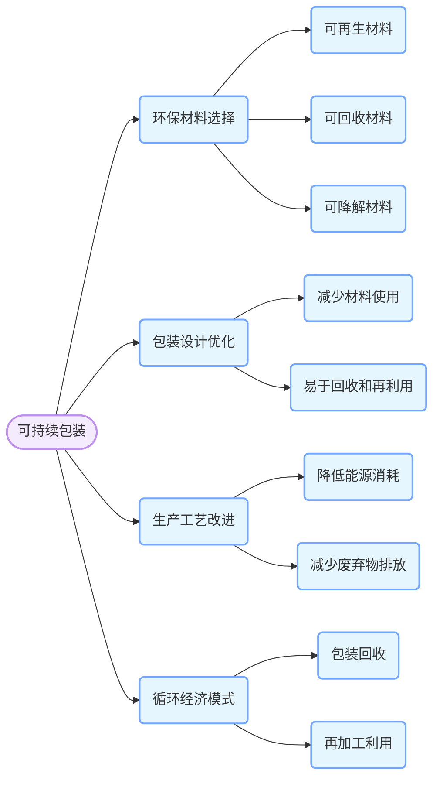

# 可持续包装解决方案提供商的投资价值

> 关键词：可持续包装、解决方案提供商、投资价值、环保材料、市场趋势

> 摘要：本文旨在深入探讨可持续包装解决方案提供商的投资价值。随着全球环保意识的不断提高，可持续包装市场呈现出快速增长的趋势。文章首先介绍了可持续包装的背景信息，包括目的和范围、预期读者、文档结构概述以及相关术语。接着阐述了可持续包装的核心概念与联系，分析了核心算法原理和具体操作步骤，并通过数学模型和公式进行详细讲解与举例说明。然后通过项目实战案例展示了可持续包装解决方案的实际应用，包括开发环境搭建、源代码实现和代码解读。此外，还探讨了可持续包装的实际应用场景，推荐了相关的学习资源、开发工具框架以及论文著作。最后总结了可持续包装的未来发展趋势与挑战，并提供了常见问题的解答和扩展阅读参考资料。通过对这些内容的分析，帮助投资者全面了解可持续包装解决方案提供商的投资潜力和价值。

## 1. 背景介绍 
### 1.1 目的和范围
在当今社会，环保问题日益受到全球关注，消费者对可持续产品的需求不断增加。可持续包装作为环保领域的重要组成部分，旨在减少包装对环境的影响，包括降低资源消耗、减少废弃物产生等。本文的目的是深入分析可持续包装解决方案提供商的投资价值，为投资者提供全面的信息和决策依据。

研究范围涵盖了可持续包装的各个方面，包括环保材料的研发、包装设计、生产工艺、市场需求以及行业竞争等。通过对这些因素的综合分析，评估可持续包装解决方案提供商的市场竞争力和发展潜力。

### 1.2 预期读者
本文的预期读者主要包括投资者、金融分析师、行业研究人员以及对可持续包装领域感兴趣的人士。投资者可以通过本文了解可持续包装解决方案提供商的投资价值，为投资决策提供参考；金融分析师可以获取相关的行业数据和分析方法，进行更准确的估值和风险评估；行业研究人员可以深入了解可持续包装的发展趋势和技术创新；而对可持续包装领域感兴趣的人士则可以通过本文了解该领域的基本概念和发展动态。

### 1.3 文档结构概述
本文共分为十个部分。第一部分为背景介绍，包括目的和范围、预期读者、文档结构概述以及术语表；第二部分阐述核心概念与联系，通过文本示意图和 Mermaid 流程图展示可持续包装的原理和架构；第三部分分析核心算法原理和具体操作步骤，并使用 Python 源代码进行详细阐述；第四部分介绍数学模型和公式，进行详细讲解并举例说明；第五部分通过项目实战案例展示可持续包装解决方案的实际应用，包括开发环境搭建、源代码实现和代码解读；第六部分探讨可持续包装的实际应用场景；第七部分推荐相关的学习资源、开发工具框架以及论文著作；第八部分总结可持续包装的未来发展趋势与挑战；第九部分为附录，提供常见问题的解答；第十部分列出扩展阅读参考资料。

### 1.4 术语表
#### 1.4.1 核心术语定义
- **可持续包装**：指在整个生命周期内，对环境影响最小、资源利用效率最高的包装解决方案。它包括使用可再生、可回收、可降解的材料，优化包装设计以减少材料使用，以及采用环保的生产工艺等。
- **解决方案提供商**：指专门为企业提供可持续包装解决方案的公司或机构。这些提供商通常具备研发、设计、生产和销售等一系列能力，能够根据客户的需求提供定制化的包装解决方案。
- **投资价值**：指投资对象所具有的潜在收益和风险特征。对于可持续包装解决方案提供商，投资价值取决于其市场竞争力、技术创新能力、财务状况以及行业发展趋势等因素。

#### 1.4.2 相关概念解释
- **环保材料**：指对环境友好的材料，包括可再生材料（如纸张、木材、竹子等）、可回收材料（如塑料、金属、玻璃等）和可降解材料（如生物降解塑料、淀粉基材料等）。
- **生命周期评估（LCA）**：是一种对产品或服务在整个生命周期内的环境影响进行评估的方法。通过 LCA 可以分析包装材料的开采、生产、使用和废弃等阶段对环境的影响，从而为可持续包装的设计和选择提供依据。
- **循环经济**：是一种以资源的高效利用和循环利用为核心，以“减量化、再利用、资源化”为原则，以低消耗、低排放、高效率为基本特征的经济发展模式。可持续包装是循环经济的重要组成部分，通过采用循环利用的材料和设计理念，可以实现包装资源的最大化利用。

#### 1.4.3 缩略词列表
- **LCA**：生命周期评估（Life Cycle Assessment）
- **PET**：聚对苯二甲酸乙二醇酯（Polyethylene Terephthalate）
- **PLA**：聚乳酸（Polylactic Acid）

## 2. 核心概念与联系 
可持续包装的核心概念围绕着环保、资源利用效率和循环经济展开。其基本原理是在满足包装功能的前提下，尽可能减少包装对环境的影响。

### 文本示意图
```plaintext
可持续包装
|-- 环保材料选择
|   |-- 可再生材料
|   |-- 可回收材料
|   |-- 可降解材料
|-- 包装设计优化
|   |-- 减少材料使用
|   |-- 易于回收和再利用
|-- 生产工艺改进
|   |-- 降低能源消耗
|   |-- 减少废弃物排放
|-- 循环经济模式
|   |-- 包装回收
|   |-- 再加工利用
```

### Mermaid 流程图


从流程图可以看出，可持续包装的各个环节相互关联、相互影响。环保材料的选择为包装设计和生产工艺提供了基础；包装设计的优化可以进一步提高材料的利用效率和环保性能；生产工艺的改进可以降低能源消耗和废弃物排放；而循环经济模式则贯穿整个过程，通过包装回收和再加工利用，实现资源的循环利用。

## 3. 核心算法原理 & 具体操作步骤 
### 核心算法原理
在可持续包装领域，核心算法主要涉及到材料选择和包装设计的优化。以下是一个简单的材料选择算法示例，用于根据不同的需求和环境因素选择最合适的包装材料。

```python
def material_selection(durability, environmental_impact, cost):
    # 定义不同材料的属性
    materials = {
        "paper": {
            "durability": 3,
            "environmental_impact": 8,
            "cost": 2
        },
        "plastic": {
            "durability": 7,
            "environmental_impact": 2,
            "cost": 3
        },
        "glass": {
            "durability": 8,
            "environmental_impact": 5,
            "cost": 5
        },
        "biodegradable_plastic": {
            "durability": 5,
            "environmental_impact": 9,
            "cost": 4
        }
    }

    best_score = -1
    best_material = None

    # 遍历所有材料，计算得分
    for material, properties in materials.items():
        score = (properties["durability"] * durability +
                 properties["environmental_impact"] * environmental_impact +
                 properties["cost"] * cost)
        if score > best_score:
            best_score = score
            best_material = material

    return best_material

# 示例使用
durability_weight = 0.4
environmental_impact_weight = 0.4
cost_weight = 0.2

selected_material = material_selection(durability_weight, environmental_impact_weight, cost_weight)
print(f"选择的最佳包装材料是: {selected_material}")
```

### 具体操作步骤
1. **需求分析**：明确包装的功能需求，如保护产品、方便运输、展示信息等，同时考虑环境因素和成本限制。
2. **数据收集**：收集不同包装材料的属性数据，包括耐久性、环境影响、成本等。
3. **权重确定**：根据需求分析的结果，确定各个属性的权重。例如，如果对环境影响较为关注，则可以提高环境影响属性的权重。
4. **算法计算**：使用上述材料选择算法，根据权重计算不同材料的得分，选择得分最高的材料作为最佳包装材料。
5. **设计优化**：根据所选材料的特性，对包装设计进行优化，以进一步提高包装的可持续性。例如，减少材料使用、采用易于回收和再利用的设计等。

## 4. 数学模型和公式 & 详细讲解 & 举例说明 
### 数学模型和公式
在可持续包装的材料选择中，可以使用加权得分模型来评估不同材料的优劣。设材料 $i$ 的属性 $j$ 的值为 $x_{ij}$，属性 $j$ 的权重为 $w_j$，则材料 $i$ 的得分 $S_i$ 可以表示为：

$$S_i = \sum_{j=1}^{n} w_j x_{ij}$$

其中，$n$ 为属性的数量。

### 详细讲解
这个数学模型的核心思想是将不同材料的各个属性值进行加权求和，得到一个综合得分。权重 $w_j$ 反映了各个属性在决策中的重要程度。通过比较不同材料的得分，可以选择得分最高的材料作为最佳包装材料。

### 举例说明
假设我们有三种包装材料：纸张、塑料和玻璃，需要考虑的属性包括耐久性、环境影响和成本。各个材料的属性值和权重如下表所示：

| 材料 | 耐久性 | 环境影响 | 成本 |
| ---- | ---- | ---- | ---- |
| 纸张 | 3 | 8 | 2 |
| 塑料 | 7 | 2 | 3 |
| 玻璃 | 8 | 5 | 5 |

假设耐久性、环境影响和成本的权重分别为 0.4、0.4 和 0.2。则根据上述公式，三种材料的得分分别为：

- 纸张：$S_{paper} = 0.4 \times 3 + 0.4 \times 8 + 0.2 \times 2 = 1.2 + 3.2 + 0.4 = 4.8$
- 塑料：$S_{plastic} = 0.4 \times 7 + 0.4 \times 2 + 0.2 \times 3 = 2.8 + 0.8 + 0.6 = 4.2$
- 玻璃：$S_{glass} = 0.4 \times 8 + 0.4 \times 5 + 0.2 \times 5 = 3.2 + 2 + 1 = 6.2$

由于玻璃的得分最高，因此在这种情况下，玻璃是最佳的包装材料。

## 5. 项目实战：代码实际案例和详细解释说明 
### 5.1  开发环境搭建
为了实现上述材料选择算法，我们可以使用 Python 语言进行开发。以下是开发环境搭建的步骤：

1. **安装 Python**：从 Python 官方网站（https://www.python.org/downloads/）下载并安装 Python 3.x 版本。
2. **安装开发工具**：可以选择使用 PyCharm、Visual Studio Code 等集成开发环境（IDE），也可以使用文本编辑器（如 Sublime Text、Notepad++ 等）结合命令行工具进行开发。
3. **创建项目目录**：在本地计算机上创建一个新的项目目录，用于存放代码文件。

### 5.2  源代码详细实现和代码解读
以下是上述材料选择算法的完整源代码：

```python
def material_selection(durability, environmental_impact, cost):
    # 定义不同材料的属性
    materials = {
        "paper": {
            "durability": 3,
            "environmental_impact": 8,
            "cost": 2
        },
        "plastic": {
            "durability": 7,
            "environmental_impact": 2,
            "cost": 3
        },
        "glass": {
            "durability": 8,
            "environmental_impact": 5,
            "cost": 5
        },
        "biodegradable_plastic": {
            "durability": 5,
            "environmental_impact": 9,
            "cost": 4
        }
    }

    best_score = -1
    best_material = None

    # 遍历所有材料，计算得分
    for material, properties in materials.items():
        score = (properties["durability"] * durability +
                 properties["environmental_impact"] * environmental_impact +
                 properties["cost"] * cost)
        if score > best_score:
            best_score = score
            best_material = material

    return best_material

# 示例使用
durability_weight = 0.4
environmental_impact_weight = 0.4
cost_weight = 0.2

selected_material = material_selection(durability_weight, environmental_impact_weight, cost_weight)
print(f"选择的最佳包装材料是: {selected_material}")
```

### 代码解读与分析
1. **函数定义**：`material_selection` 函数接受三个参数：`durability`、`environmental_impact` 和 `cost`，分别表示耐久性、环境影响和成本的权重。
2. **材料属性定义**：使用字典 `materials` 存储不同材料的属性，每个材料对应一个子字典，包含耐久性、环境影响和成本三个属性。
3. **得分计算**：通过遍历所有材料，根据加权得分模型计算每个材料的得分，并记录得分最高的材料。
4. **示例使用**：在代码的最后，定义了耐久性、环境影响和成本的权重，并调用 `material_selection` 函数选择最佳包装材料，最后打印选择结果。

## 6. 实际应用场景 
可持续包装解决方案提供商的服务可以应用于多个行业，以下是一些常见的实际应用场景：

### 食品饮料行业
食品饮料行业对包装的需求量大，同时对包装的安全性和环保性要求也较高。可持续包装解决方案提供商可以为食品饮料企业提供可降解的包装材料，如生物降解塑料、纸质包装等，以减少包装废弃物对环境的影响。此外，还可以通过优化包装设计，减少材料使用，提高包装的密封性和保鲜性能，延长食品的保质期。

### 化妆品行业
化妆品行业注重产品的外观和品牌形象，同时也越来越关注环保问题。可持续包装解决方案提供商可以为化妆品企业提供个性化的包装设计，采用环保材料和创新的工艺，打造具有吸引力的包装。例如，使用可再生材料制作包装容器，采用可回收的标签和说明书，减少包装的重量和体积等。

### 电子电器行业
电子电器产品的包装通常需要具备良好的缓冲性能和保护性能，以防止产品在运输过程中受到损坏。可持续包装解决方案提供商可以为电子电器企业提供可回收的包装材料，如纸质缓冲材料、泡沫塑料替代品等，同时优化包装结构，提高包装的空间利用率，减少包装废弃物的产生。

### 物流快递行业
物流快递行业每天产生大量的包装废弃物，对环境造成了较大的压力。可持续包装解决方案提供商可以为物流快递企业提供可循环使用的包装容器，如塑料周转箱、纸质托盘等，减少一次性包装的使用。此外，还可以通过智能化的包装管理系统，实现包装的回收和再利用，提高包装资源的利用效率。

## 7. 工具和资源推荐
### 7.1 学习资源推荐
#### 7.1.1 书籍推荐
- 《可持续包装设计》：本书介绍了可持续包装的基本概念、设计原则和方法，通过大量的案例分析，展示了可持续包装的实践应用。
- 《循环经济与可持续发展》：探讨了循环经济的理论和实践，以及如何将循环经济理念应用于包装行业，实现包装资源的循环利用。
- 《环保材料手册》：提供了各种环保材料的详细信息，包括材料的性能、特点、应用领域等，为可持续包装材料的选择提供了参考。

#### 7.1.2 在线课程
- Coursera 上的“可持续发展与环境管理”课程：介绍了可持续发展的基本概念和方法，以及如何在企业中实施可持续发展战略，包括可持续包装的应用。
- edX 上的“循环经济与绿色创新”课程：讲解了循环经济的原理和实践，以及如何通过绿色创新推动包装行业的可持续发展。
- Udemy 上的“可持续包装设计实战”课程：通过实际案例，教授可持续包装设计的技巧和方法，帮助学员掌握可持续包装设计的实践能力。

#### 7.1.3 技术博客和网站
- GreenBiz：提供了关于可持续发展、环保技术和企业社会责任等方面的最新资讯和深度分析，包括可持续包装的发展动态。
- Packaging Digest：专注于包装行业的新闻、技术和市场趋势，提供了大量关于可持续包装的报道和案例分析。
- Sustainable Packaging Coalition：一个致力于推动可持续包装发展的非营利组织，其网站提供了可持续包装的研究报告、标准和最佳实践等资源。

### 7.2 开发工具框架推荐
#### 7.2.1 IDE和编辑器
- PyCharm：一款专门为 Python 开发设计的集成开发环境，提供了丰富的代码编辑、调试和项目管理功能，适合开发可持续包装相关的算法和应用程序。
- Visual Studio Code：一款轻量级的代码编辑器，支持多种编程语言，具有丰富的插件生态系统，可以根据需要安装各种开发工具和扩展，方便进行可持续包装项目的开发。
- Sublime Text：一款简洁高效的文本编辑器，具有快速启动、语法高亮等特点，适合快速编写和调试代码。

#### 7.2.2 调试和性能分析工具
- PyCharm 的调试功能：可以方便地设置断点、单步执行代码，查看变量的值和程序的执行流程，帮助开发者快速定位和解决代码中的问题。
- cProfile：Python 内置的性能分析工具，可以分析代码的运行时间和函数调用情况，帮助开发者找出代码中的性能瓶颈，进行优化。
- Memory Profiler：一个用于分析 Python 代码内存使用情况的工具，可以帮助开发者找出内存泄漏和高内存消耗的问题。

#### 7.2.3 相关框架和库
- NumPy：一个用于科学计算的 Python 库，提供了高效的数组操作和数学函数，适合处理可持续包装相关的数据分析和计算任务。
- Pandas：一个用于数据处理和分析的 Python 库，提供了丰富的数据结构和数据操作方法，方便对可持续包装的相关数据进行清洗、整理和分析。
- Matplotlib：一个用于数据可视化的 Python 库，可以绘制各种类型的图表和图形，帮助开发者直观地展示可持续包装的数据分析结果。

### 7.3 相关论文著作推荐
#### 7.3.1 经典论文
- “Life Cycle Assessment of Packaging Systems: A Review”：对包装系统的生命周期评估方法进行了综述，分析了不同包装材料和设计对环境的影响。
- “Sustainable Packaging Design: A Review of Current Research and Practice”：回顾了可持续包装设计的研究现状和实践经验，提出了可持续包装设计的原则和方法。
- “The Role of Packaging in the Circular Economy”：探讨了包装在循环经济中的作用和地位，分析了实现包装循环利用的挑战和机遇。

#### 7.3.2 最新研究成果
- 近年来，一些研究机构和学者在可持续包装领域取得了一系列的最新研究成果，如新型环保材料的研发、包装设计的创新方法、包装回收和再利用技术等。可以通过学术数据库（如 IEEE Xplore、ACM Digital Library、ScienceDirect 等）搜索相关的研究论文，了解最新的研究动态。

#### 7.3.3 应用案例分析
- 许多企业在可持续包装方面进行了实践探索，取得了良好的效果。可以通过企业的官方网站、行业报告和新闻媒体等渠道，了解这些企业的可持续包装应用案例，学习他们的成功经验和做法。

## 8. 总结：未来发展趋势与挑战
### 未来发展趋势
- **环保材料的广泛应用**：随着环保意识的不断提高和技术的不断进步，未来可持续包装将更多地采用可再生、可回收和可降解的环保材料，如生物降解塑料、纸质材料、竹子等。
- **智能化包装的发展**：智能化包装将成为未来可持续包装的一个重要发展方向。通过在包装中集成传感器、芯片等技术，可以实现对产品的实时监测和跟踪，提高包装的安全性和便利性。
- **循环经济模式的深化**：循环经济模式将在可持续包装领域得到更广泛的应用和深化。企业将更加注重包装的回收和再利用，建立完善的包装回收体系，实现包装资源的最大化利用。
- **个性化定制包装的需求增加**：消费者对产品的个性化需求不断增加，未来可持续包装也将朝着个性化定制的方向发展。企业可以根据消费者的需求和喜好，提供定制化的包装设计和解决方案。

### 挑战
- **技术创新的挑战**：虽然目前已经有一些可持续包装材料和技术，但仍需要不断进行技术创新，提高环保材料的性能和降低成本，开发更加高效的包装回收和再利用技术。
- **市场推广的挑战**：可持续包装的市场推广面临一定的挑战，消费者对可持续包装的认知度和接受度还需要进一步提高。此外，可持续包装的成本相对较高，企业在推广过程中需要平衡成本和效益。
- **政策法规的不确定性**：政策法规对可持续包装的发展具有重要的影响。不同国家和地区的政策法规存在差异，且政策法规的变化也可能对企业的可持续包装战略产生影响。企业需要密切关注政策法规的变化，及时调整发展策略。

## 9. 附录：常见问题与解答
### 1. 可持续包装的成本是否会比传统包装高？
一般来说，可持续包装的成本可能会比传统包装略高。这是因为可持续包装通常采用环保材料和先进的生产工艺，这些材料和工艺的成本相对较高。然而，随着技术的不断进步和规模效应的显现，可持续包装的成本正在逐渐降低。此外，从长远来看，可持续包装可以为企业带来品牌形象提升、市场竞争力增强等诸多好处，这些收益可能会超过包装成本的增加。

### 2. 可持续包装是否能够满足产品的保护需求？
可持续包装在设计和材料选择上充分考虑了产品的保护需求。通过合理的包装设计和选用合适的材料，可持续包装可以提供与传统包装相当甚至更好的保护性能。例如，一些新型的环保缓冲材料具有良好的减震性能，可以有效地保护产品在运输过程中不受损坏。

### 3. 如何判断一种包装是否是可持续包装？
判断一种包装是否是可持续包装可以从以下几个方面考虑：
- **材料的环保性**：包装材料是否可再生、可回收或可降解。
- **包装设计的合理性**：包装设计是否优化，是否减少了材料的使用量。
- **生产工艺的环保性**：生产过程中是否降低了能源消耗和废弃物排放。
- **生命周期评估**：通过对包装在整个生命周期内的环境影响进行评估，判断其是否符合可持续发展的要求。

### 4. 可持续包装解决方案提供商可以提供哪些服务？
可持续包装解决方案提供商可以提供以下服务：
- **环保材料研发和供应**：研发和供应各种可再生、可回收和可降解的环保包装材料。
- **包装设计服务**：根据客户的需求和产品特点，提供个性化的可持续包装设计方案。
- **生产工艺优化**：帮助企业优化包装生产工艺，降低能源消耗和废弃物排放。
- **包装回收和再利用服务**：建立包装回收体系，对回收的包装进行再加工和再利用。
- **咨询和培训服务**：为企业提供可持续包装方面的咨询和培训服务，帮助企业了解可持续包装的政策法规、技术趋势和最佳实践。

## 10. 扩展阅读 & 参考资料
### 扩展阅读
- 《绿色供应链管理》：探讨了如何在供应链中实施绿色战略，包括可持续包装的应用，对于企业全面推进可持续发展具有重要的参考价值。
- 《可持续发展的商业案例》：通过大量的实际案例，展示了企业在可持续发展方面的成功经验和做法，为可持续包装解决方案提供商的发展提供了借鉴。
- 《包装创新与可持续发展》：关注包装行业的创新趋势和可持续发展，介绍了一些新型的包装技术和设计理念，有助于拓宽读者的视野。

### 参考资料
- 相关行业报告和统计数据，如市场研究机构发布的可持续包装市场报告、行业协会发布的包装行业统计数据等。
- 政府部门发布的政策法规和标准，如环保部门发布的包装废弃物管理政策、质量监督部门发布的包装材料标准等。
- 学术期刊和会议论文，如《Journal of Cleaner Production》、《Packaging Technology and Science》等期刊上发表的关于可持续包装的研究论文，以及相关学术会议上的报告和交流内容。

作者：AI天才研究院/AI Genius Institute & 禅与计算机程序设计艺术 /Zen And The Art of Computer Programming