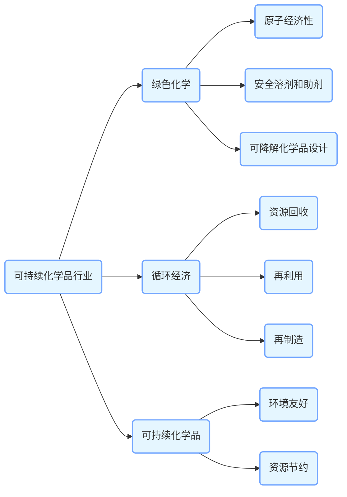

# 可持续化学品行业的创新与投资策略

> 关键词：可持续化学品行业、创新、投资策略、绿色化学、循环经济

> 摘要：本文聚焦于可持续化学品行业，深入探讨了该行业的创新方向以及与之匹配的投资策略。首先介绍了可持续化学品行业的背景，包括目的、预期读者、文档结构和相关术语。接着阐述了核心概念，如绿色化学、循环经济等及其联系，并给出了相应的文本示意图和Mermaid流程图。详细讲解了核心算法原理及操作步骤，结合数学模型和公式进行举例说明。通过项目实战案例，展示了代码实现及解读。分析了实际应用场景，推荐了学习资源、开发工具框架和相关论文著作。最后总结了行业的未来发展趋势与挑战，提供了常见问题解答和扩展阅读参考资料，旨在为关注可持续化学品行业的投资者和从业者提供全面的技术和策略指导。

## 1. 背景介绍 
### 1.1 目的和范围
可持续化学品行业近年来受到越来越多的关注，其目的在于减少化学工业对环境的负面影响，同时满足社会对化学品不断增长的需求。本文章的范围涵盖了可持续化学品行业的创新方向，包括绿色化学技术、循环经济模式等，以及针对这些创新的投资策略。通过对行业的全面分析，帮助投资者和从业者了解行业的发展趋势，制定合理的投资和发展计划。

### 1.2 预期读者
本文的预期读者主要包括对可持续化学品行业感兴趣的投资者，如风险投资家、私募股权投资者等；化学品行业的从业者，包括研发人员、企业管理人员等；以及相关领域的研究人员和学生，希望通过本文了解行业的最新动态和技术发展。

### 1.3 文档结构概述
本文将按照以下结构进行阐述：首先介绍核心概念及其联系，让读者对可持续化学品行业有一个基本的认识；接着讲解核心算法原理和具体操作步骤，结合Python代码进行详细说明；然后给出数学模型和公式，并通过举例进行详细讲解；通过项目实战案例，展示代码的实际应用和解读；分析可持续化学品行业的实际应用场景；推荐相关的学习资源、开发工具框架和论文著作；最后总结行业的未来发展趋势与挑战，提供常见问题解答和扩展阅读参考资料。

### 1.4 术语表
#### 1.4.1 核心术语定义
- **可持续化学品**：指在其整个生命周期内，包括生产、使用和处置过程中，对环境和人类健康的影响最小化的化学品。
- **绿色化学**：又称环境友好化学，是指用化学的技术和方法去减少或消除有害物质的生产和使用。
- **循环经济**：是一种以资源的高效利用和循环利用为核心，以“减量化、再利用、资源化”为原则，以低消耗、低排放、高效率为基本特征的经济发展模式。

#### 1.4.2 相关概念解释
- **生命周期评估（LCA）**：是一种对产品、过程或活动从原材料的获取到最终处置的整个生命周期内的环境影响进行评估的方法。
- **生物基化学品**：指以生物质为原料生产的化学品，具有可再生、环境友好等特点。

#### 1.4.3 缩略词列表
- **LCA**：生命周期评估（Life Cycle Assessment）
- **GC**：绿色化学（Green Chemistry）
- **CE**：循环经济（Circular Economy）

## 2. 核心概念与联系 

### 核心概念原理
#### 绿色化学
绿色化学的核心原理包括原子经济性、使用安全的溶剂和助剂、设计可降解的化学品等。原子经济性是指在化学反应中，尽可能地将反应物的原子转化为目标产物，减少副产物的生成。例如，在有机合成中，采用催化反应可以提高原子利用率。

#### 循环经济
循环经济强调资源的循环利用，通过建立闭环系统，使化学品在其生命周期结束后能够被回收、再利用或再制造。例如，废旧塑料可以通过回收和再生技术，重新制成新的塑料制品。

#### 可持续化学品
可持续化学品是绿色化学和循环经济理念的具体体现，它要求化学品在生产、使用和处置过程中，遵循环境友好和资源节约的原则。

### 架构的文本示意图
```plaintext
可持续化学品行业
|-- 绿色化学
|   |-- 原子经济性
|   |-- 安全溶剂和助剂
|   |-- 可降解化学品设计
|-- 循环经济
|   |-- 资源回收
|   |-- 再利用
|   |-- 再制造
|-- 可持续化学品
|   |-- 环境友好
|   |-- 资源节约
```

### Mermaid流程图


## 3. 核心算法原理 & 具体操作步骤 

### 生命周期评估（LCA）算法原理
生命周期评估是一种重要的工具，用于评估化学品的环境影响。其基本原理是将化学品的整个生命周期划分为多个阶段，包括原材料获取、生产、运输、使用和处置，然后对每个阶段的环境影响进行量化评估。

### Python代码实现
```python
import pandas as pd

# 定义生命周期阶段
life_cycle_stages = ['原材料获取', '生产', '运输', '使用', '处置']

# 定义每个阶段的环境影响指标
impact_indicators = ['温室气体排放', '水资源消耗', '能源消耗']

# 示例数据：每个阶段的环境影响值
data = {
    '原材料获取': [100, 50, 200],
    '生产': [200, 100, 300],
    '运输': [50, 20, 100],
    '使用': [150, 80, 250],
    '处置': [80, 30, 150]
}

# 创建DataFrame
df = pd.DataFrame(data, index=impact_indicators)

# 计算每个影响指标的总环境影响
total_impacts = df.sum(axis=1)

print("每个影响指标的总环境影响：")
print(total_impacts)
```

### 具体操作步骤
1. **数据收集**：收集化学品在每个生命周期阶段的环境影响数据，包括温室气体排放、水资源消耗、能源消耗等。
2. **数据整理**：将收集到的数据整理成表格形式，以便进行分析。
3. **数据计算**：使用Python等工具对数据进行计算，例如计算每个影响指标的总环境影响。
4. **结果分析**：根据计算结果，分析化学品的环境影响主要集中在哪些阶段，为改进提供依据。

## 4. 数学模型和公式 & 详细讲解 & 举例说明 

### 生命周期评估的数学模型
生命周期评估的数学模型可以表示为：

$$
E_{total} = \sum_{i=1}^{n} \sum_{j=1}^{m} E_{ij}
$$

其中，$E_{total}$ 表示化学品的总环境影响，$n$ 表示生命周期阶段的数量，$m$ 表示环境影响指标的数量，$E_{ij}$ 表示第 $i$ 个生命周期阶段的第 $j$ 个环境影响指标的值。

### 详细讲解
这个公式的含义是将化学品在每个生命周期阶段的每个环境影响指标的值相加，得到化学品的总环境影响。通过对每个阶段和指标的分析，可以找出环境影响较大的环节，从而采取相应的措施进行改进。

### 举例说明
假设我们有一个化学品，其生命周期包括原材料获取、生产、运输和使用四个阶段，环境影响指标包括温室气体排放、水资源消耗和能源消耗。每个阶段和指标的具体数据如下表所示：

| 生命周期阶段 | 温室气体排放（kg CO₂-eq） | 水资源消耗（m³） | 能源消耗（kWh） |
| --- | --- | --- | --- |
| 原材料获取 | 100 | 50 | 200 |
| 生产 | 200 | 100 | 300 |
| 运输 | 50 | 20 | 100 |
| 使用 | 150 | 80 | 250 |

根据上述公式，我们可以计算出该化学品的总环境影响：

- 温室气体排放总量：$100 + 200 + 50 + 150 = 500$ kg CO₂-eq
- 水资源消耗总量：$50 + 100 + 20 + 80 = 250$ m³
- 能源消耗总量：$200 + 300 + 100 + 250 = 850$ kWh

通过这些计算结果，我们可以看出该化学品在生产阶段的温室气体排放和能源消耗较高，在原材料获取阶段的水资源消耗较高，因此可以针对这些阶段采取相应的节能减排措施。

## 5. 项目实战：代码实际案例和详细解释说明 

### 5.1  开发环境搭建
- **操作系统**：推荐使用Windows、Linux或macOS。
- **Python环境**：安装Python 3.x版本，可以从Python官方网站（https://www.python.org/downloads/）下载并安装。
- **开发工具**：推荐使用Jupyter Notebook或PyCharm等集成开发环境。

### 5.2  源代码详细实现和代码解读
以下是一个更完整的生命周期评估代码示例，包括数据输入、计算和结果可视化：

```python
import pandas as pd
import matplotlib.pyplot as plt

# 定义生命周期阶段
life_cycle_stages = ['原材料获取', '生产', '运输', '使用', '处置']

# 定义每个阶段的环境影响指标
impact_indicators = ['温室气体排放', '水资源消耗', '能源消耗']

# 示例数据：每个阶段的环境影响值
data = {
    '原材料获取': [100, 50, 200],
    '生产': [200, 100, 300],
    '运输': [50, 20, 100],
    '使用': [150, 80, 250],
    '处置': [80, 30, 150]
}

# 创建DataFrame
df = pd.DataFrame(data, index=impact_indicators)

# 计算每个影响指标的总环境影响
total_impacts = df.sum(axis=1)

# 绘制柱状图展示总环境影响
plt.figure(figsize=(10, 6))
bars = plt.bar(total_impacts.index, total_impacts.values)
plt.xlabel('环境影响指标')
plt.ylabel('总环境影响')
plt.title('化学品的总环境影响')

# 添加数据标签
for bar in bars:
    height = bar.get_height()
    plt.annotate(f'{height}',
                 xy=(bar.get_x() + bar.get_width() / 2, height),
                 xytext=(0, 3),  # 3 points vertical offset
                 textcoords="offset points",
                 ha='center', va='bottom')

plt.show()

print("每个影响指标的总环境影响：")
print(total_impacts)
```

### 代码解读与分析
1. **数据输入**：使用字典 `data` 存储每个生命周期阶段的环境影响数据，然后使用 `pandas` 库的 `DataFrame` 函数将数据转换为表格形式。
2. **数据计算**：使用 `sum` 函数计算每个影响指标的总环境影响。
3. **结果可视化**：使用 `matplotlib` 库绘制柱状图，直观展示每个影响指标的总环境影响，并添加数据标签。
4. **结果输出**：打印每个影响指标的总环境影响值。

通过这个代码示例，我们可以更直观地了解化学品的环境影响，为可持续化学品的研发和投资提供参考。

## 6. 实际应用场景 
### 化学品生产企业
化学品生产企业可以利用生命周期评估工具，评估其产品的环境影响，找出环境影响较大的环节，采取相应的改进措施，如优化生产工艺、使用可再生原材料等，以降低产品的环境足迹，提高企业的可持续发展能力。

### 投资者
投资者可以通过分析可持续化学品项目的生命周期评估结果，评估项目的环境风险和投资价值。对于环境影响较小、具有良好可持续发展前景的项目，投资者可以考虑加大投资力度。

### 政府监管部门
政府监管部门可以制定相关政策，鼓励企业采用可持续化学品技术，推动化学品行业的绿色发展。例如，对采用绿色化学技术的企业给予税收优惠，对环境影响较大的化学品征收环境税等。

## 7. 工具和资源推荐
### 7.1 学习资源推荐
#### 7.1.1 书籍推荐
- 《绿色化学：理论与实践》：全面介绍了绿色化学的基本原理、方法和应用。
- 《循环经济：从理念到实践》：深入探讨了循环经济的概念、模式和实践案例。
- 《可持续化学品管理》：介绍了可持续化学品的管理方法和策略。

#### 7.1.2 在线课程
- Coursera上的“绿色化学与可持续发展”课程：由知名高校的教授授课，系统讲解绿色化学的相关知识。
- edX上的“循环经济基础”课程：介绍循环经济的基本概念和实践方法。

#### 7.1.3 技术博客和网站
- Green Chemistry & Technology：提供绿色化学领域的最新研究成果和技术动态。
- Circular Economy Club：专注于循环经济的交流和分享，提供行业案例和专家观点。

### 7.2 开发工具框架推荐
#### 7.2.1 IDE和编辑器
- Jupyter Notebook：适合数据探索和分析，支持Python、R等多种编程语言。
- PyCharm：功能强大的Python集成开发环境，提供代码编辑、调试、版本控制等功能。

#### 7.2.2 调试和性能分析工具
- `pdb`：Python自带的调试工具，用于调试Python代码。
- `cProfile`：Python的性能分析工具，用于分析代码的性能瓶颈。

#### 7.2.3 相关框架和库
- `pandas`：用于数据处理和分析，提供了丰富的数据结构和函数。
- `matplotlib`：用于数据可视化，支持多种图表类型。

### 7.3 相关论文著作推荐
#### 7.3.1 经典论文
- Anastas, P. T., & Warner, J. C. (1998). Green chemistry: theory and practice. Oxford University Press.
- Geissdoerfer, M., Savaget, P., Bocken, N. M. P., & Hultink, E. J. (2017). The circular economy–a new sustainability paradigm?. Journal of Cleaner Production, 143, 757-768.

#### 7.3.2 最新研究成果
- 关注《Journal of Cleaner Production》、《Green Chemistry》等期刊，获取可持续化学品行业的最新研究成果。

#### 7.3.3 应用案例分析
- 可以参考世界经济论坛、麦肯锡等机构发布的可持续化学品行业应用案例分析报告，了解行业的最佳实践和发展趋势。

## 8. 总结：未来发展趋势与挑战
### 未来发展趋势
- **技术创新加速**：随着科技的不断进步，绿色化学技术和循环经济模式将不断创新，推动可持续化学品行业的快速发展。例如，新型催化剂的研发将提高化学反应的原子利用率，生物基化学品的生产技术将不断完善。
- **政策支持加强**：政府将出台更多的政策支持可持续化学品行业的发展，如补贴、税收优惠等，鼓励企业采用绿色化学技术和循环经济模式。
- **市场需求增长**：消费者对环境友好型产品的需求不断增加，将推动可持续化学品市场的扩大。例如，生物基塑料、可再生能源等产品的市场需求将持续增长。

### 挑战
- **技术成本较高**：目前，一些绿色化学技术和循环经济模式的成本较高，限制了其大规模应用。例如，生物基化学品的生产成本相对较高，需要进一步降低成本。
- **标准和认证体系不完善**：可持续化学品行业的标准和认证体系还不完善，导致市场上的产品质量参差不齐。需要建立统一的标准和认证体系，提高市场的透明度和可信度。
- **公众认知度不足**：公众对可持续化学品的认知度还不够，需要加强宣传和教育，提高公众的环保意识和消费意愿。

## 9. 附录：常见问题与解答
### 问题1：可持续化学品与传统化学品有什么区别？
答：可持续化学品在整个生命周期内对环境和人类健康的影响最小化，遵循绿色化学和循环经济的原则。而传统化学品可能在生产、使用和处置过程中产生较大的环境影响，如温室气体排放、水污染等。

### 问题2：如何评估一个化学品是否可持续？
答：可以使用生命周期评估（LCA）工具，对化学品的整个生命周期进行评估，包括原材料获取、生产、运输、使用和处置等阶段的环境影响。同时，还可以考虑化学品的可再生性、可降解性等因素。

### 问题3：投资可持续化学品行业有哪些风险？
答：投资可持续化学品行业可能面临技术风险、市场风险和政策风险等。例如，新技术的研发可能失败，市场需求可能不如预期，政策支持可能发生变化等。投资者需要进行充分的市场调研和风险评估，制定合理的投资策略。

## 10. 扩展阅读 & 参考资料
- 联合国环境规划署发布的《可持续化学品管理全球行动计划》
- 国际标准化组织（ISO）发布的相关标准，如ISO 14040《环境管理 生命周期评估 原则与框架》
- 相关行业协会和研究机构发布的报告和研究成果

作者：AI天才研究院/AI Genius Institute & 禅与计算机程序设计艺术 /Zen And The Art of Computer Programming