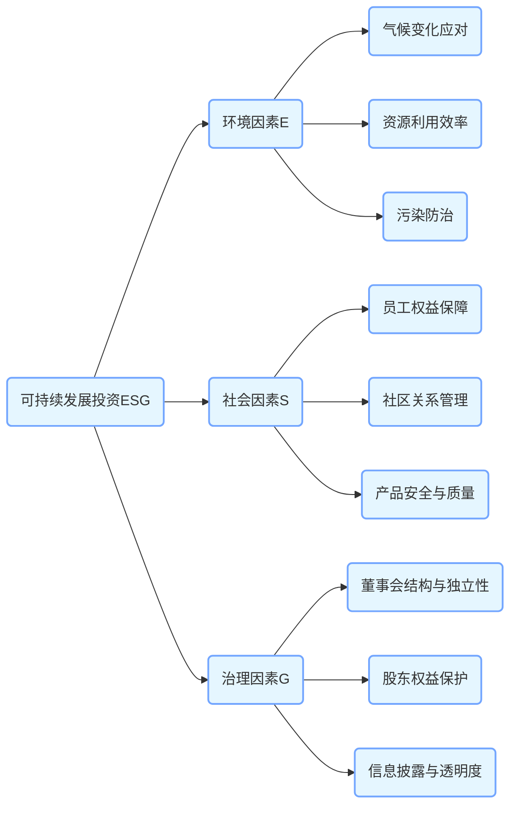

# 可持续发展投资（ESG）：长期价值创造的新范式

> 关键词：可持续发展投资、ESG、长期价值创造、投资范式、环境社会治理

> 摘要：本文深入探讨了可持续发展投资（ESG）这一长期价值创造的新范式。首先介绍了ESG投资的背景，包括其目的、预期读者、文档结构和相关术语。接着阐述了ESG的核心概念、联系以及原理架构，并给出了相应的示意图和流程图。详细讲解了与ESG投资相关的核心算法原理和具体操作步骤，同时运用数学模型和公式进行了分析说明。通过项目实战案例，展示了ESG投资在实际中的应用，包括开发环境搭建、源代码实现和代码解读。探讨了ESG投资的实际应用场景，推荐了相关的学习资源、开发工具框架和论文著作。最后总结了ESG投资的未来发展趋势与挑战，还提供了常见问题解答和扩展阅读参考资料，旨在为投资者和相关从业者全面了解ESG投资提供有价值的参考。

## 1. 背景介绍 
### 1.1 目的和范围
随着全球对环境、社会和治理（ESG）问题的关注度不断提高，可持续发展投资（ESG投资）已成为金融领域的重要趋势。本文的目的在于深入剖析ESG投资作为长期价值创造新范式的内涵、原理和应用。具体范围涵盖ESG投资的核心概念、算法原理、数学模型、项目实战、实际应用场景等多个方面，旨在为投资者、金融从业者以及对可持续发展感兴趣的人士提供全面且深入的理解。

### 1.2 预期读者
本文的预期读者包括但不限于以下几类人群：
- 金融投资者：希望通过ESG投资实现资产的长期增值和可持续发展。
- 金融机构从业者：如银行、证券、基金等机构的分析师、投资经理等，需要了解ESG投资的理论和实践，以更好地服务客户。
- 企业管理者：关注企业的可持续发展战略，希望通过改善ESG表现来提升企业的长期价值。
- 研究人员：对可持续发展、金融投资等领域的学术研究感兴趣，希望获取最新的研究成果和实践经验。

### 1.3 文档结构概述
本文将按照以下结构进行组织：
- 核心概念与联系：介绍ESG的核心概念、相互关系以及原理架构。
- 核心算法原理 & 具体操作步骤：讲解与ESG投资相关的核心算法原理，并给出具体的操作步骤。
- 数学模型和公式 & 详细讲解 & 举例说明：运用数学模型和公式对ESG投资进行分析，并通过具体例子进行说明。
- 项目实战：代码实际案例和详细解释说明：通过实际项目案例，展示ESG投资在代码实现层面的具体应用。
- 实际应用场景：探讨ESG投资在不同领域的实际应用场景。
- 工具和资源推荐：推荐相关的学习资源、开发工具框架和论文著作。
- 总结：未来发展趋势与挑战：总结ESG投资的未来发展趋势，并分析可能面临的挑战。
- 附录：常见问题与解答：解答读者在ESG投资过程中可能遇到的常见问题。
- 扩展阅读 & 参考资料：提供相关的扩展阅读材料和参考资料。

### 1.4 术语表
#### 1.4.1 核心术语定义
- **可持续发展投资（ESG投资）**：是一种将环境（Environmental）、社会（Social）和治理（Governance）因素纳入投资决策过程的投资方法，旨在实现长期的财务回报和积极的社会环境影响。
- **环境因素（E）**：包括气候变化、资源利用、污染防治等方面，衡量企业在环境保护方面的表现。
- **社会因素（S）**：涉及员工权益、社区关系、产品安全等内容，反映企业对社会的贡献和影响。
- **治理因素（G）**：关注企业的治理结构、董事会独立性、股东权益保护等，评估企业的管理水平和决策机制。

#### 1.4.2 相关概念解释
- **ESG评级**：是对企业在环境、社会和治理方面表现的综合评估，通常由专业的评级机构进行。评级结果可以帮助投资者了解企业的ESG风险和机会。
- **ESG指数**：是根据一定的ESG标准筛选成分股构建的指数，反映了符合ESG要求的股票表现。投资者可以通过投资ESG指数基金来参与ESG投资。
- **影响力投资**：是一种更加注重社会和环境影响力的投资方式，旨在通过投资解决特定的社会和环境问题，同时实现一定的财务回报。

#### 1.4.3 缩略词列表
- **ESG**：Environmental, Social and Governance（环境、社会和治理）
- **ROI**：Return on Investment（投资回报率）
- **IRR**：Internal Rate of Return（内部收益率）

## 2. 核心概念与联系 
### 核心概念原理
ESG投资的核心在于将环境、社会和治理因素纳入投资决策过程，以实现长期的财务回报和积极的社会环境影响。从原理上讲，良好的ESG表现可以为企业带来多方面的优势：
- **降低风险**：注重环境保护的企业可以减少因环境法规变化、污染事故等带来的风险；重视员工权益和社区关系的企业可以降低劳动纠纷、社会舆论压力等风险；完善的治理结构可以防止内部腐败、决策失误等问题。
- **提升竞争力**：具有良好ESG表现的企业更容易获得消费者的认可和信任，从而提高市场份额；同时，也更容易吸引优秀的人才和投资者，为企业的发展提供支持。
- **创造长期价值**：通过关注可持续发展，企业可以更好地适应社会和环境的变化，实现长期的稳定发展，从而为投资者带来持续的回报。

### 架构的文本示意图
```plaintext
可持续发展投资（ESG）
|
|-- 环境因素（E）
|   |-- 气候变化应对
|   |-- 资源利用效率
|   |-- 污染防治
|
|-- 社会因素（S）
|   |-- 员工权益保障
|   |-- 社区关系管理
|   |-- 产品安全与质量
|
|-- 治理因素（G）
|   |-- 董事会结构与独立性
|   |-- 股东权益保护
|   |-- 信息披露与透明度
```

### Mermaid流程图


## 3. 核心算法原理 & 具体操作步骤 
### 核心算法原理
在ESG投资中，一个重要的算法原理是基于多因素模型对企业的ESG表现进行量化评估。多因素模型可以表示为：

$$ESG_{score} = \sum_{i=1}^{n} w_i \times f_i(x_i)$$

其中，$ESG_{score}$ 是企业的ESG综合得分，$w_i$ 是第 $i$ 个因素的权重，$f_i(x_i)$ 是第 $i$ 个因素的得分函数，$x_i$ 是第 $i$ 个因素的具体指标值。

### Python源代码阐述
```python
import pandas as pd

# 定义各因素的权重
weights = {
    '环境因素': 0.3,
    '社会因素': 0.3,
    '治理因素': 0.4
}

# 示例数据：企业的ESG指标得分
data = {
    '企业名称': ['企业A', '企业B'],
    '环境因素得分': [80, 70],
    '社会因素得分': [75, 85],
    '治理因素得分': [90, 80]
}

df = pd.DataFrame(data)

# 计算ESG综合得分
def calculate_esg_score(row):
    esg_score = 0
    for factor, weight in weights.items():
        score_column = f'{factor}得分'
        esg_score += weight * row[score_column]
    return esg_score

df['ESG综合得分'] = df.apply(calculate_esg_score, axis=1)

print(df)
```

### 具体操作步骤
1. **数据收集**：收集企业在环境、社会和治理方面的具体指标数据，如碳排放数据、员工满意度调查结果、董事会成员构成等。
2. **指标标准化**：对收集到的指标数据进行标准化处理，以消除不同指标之间的量纲差异。可以使用常见的标准化方法，如Z-score标准化。
3. **确定权重**：根据投资者的偏好和投资目标，确定环境、社会和治理因素以及各具体指标的权重。
4. **计算得分**：根据多因素模型，计算企业的ESG综合得分。
5. **投资决策**：根据企业的ESG综合得分，结合其他财务指标和投资标准，做出投资决策。

## 4. 数学模型和公式 & 详细讲解 & 举例说明 
### 数学模型和公式
#### 多因素模型
如前文所述，多因素模型用于计算企业的ESG综合得分：

$$ESG_{score} = \sum_{i=1}^{n} w_i \times f_i(x_i)$$

其中，$n$ 是因素的数量，$w_i$ 是第 $i$ 个因素的权重，且 $\sum_{i=1}^{n} w_i = 1$，$f_i(x_i)$ 是第 $i$ 个因素的得分函数，$x_i$ 是第 $i$ 个因素的具体指标值。

#### 风险调整后的投资回报率（Risk - Adjusted ROI）
在ESG投资中，考虑到ESG因素对企业风险的影响，需要计算风险调整后的投资回报率。一种常见的计算方法是使用夏普比率（Sharpe Ratio）：

$$Sharpe\ Ratio = \frac{R_p - R_f}{\sigma_p}$$

其中，$R_p$ 是投资组合的预期回报率，$R_f$ 是无风险利率，$\sigma_p$ 是投资组合的标准差，反映了投资组合的风险。

### 详细讲解
#### 多因素模型
多因素模型的核心思想是综合考虑多个ESG因素对企业的影响。不同的因素可能具有不同的重要性，因此通过赋予不同的权重来体现这种差异。得分函数 $f_i(x_i)$ 可以根据具体的指标性质进行定义，例如对于一些正向指标（如资源利用效率），得分函数可以是线性的；对于一些负向指标（如污染排放量），得分函数可以是反比例函数。

#### 风险调整后的投资回报率
夏普比率衡量了投资组合每承担一单位风险所获得的超过无风险利率的额外回报。在ESG投资中，通过计算夏普比率，可以评估投资组合在考虑ESG风险后的表现。较高的夏普比率表示投资组合在承担相同风险的情况下能够获得更高的回报，具有更好的风险 - 收益特征。

### 举例说明
#### 多因素模型举例
假设我们有一家企业，其环境因素得分 $f_1(x_1) = 80$，权重 $w_1 = 0.3$；社会因素得分 $f_2(x_2) = 75$，权重 $w_2 = 0.3$；治理因素得分 $f_3(x_3) = 90$，权重 $w_3 = 0.4$。则该企业的ESG综合得分计算如下：

$$ESG_{score} = 0.3 \times 80 + 0.3 \times 75 + 0.4 \times 90$$
$$ESG_{score} = 24 + 22.5 + 36$$
$$ESG_{score} = 82.5$$

#### 风险调整后的投资回报率举例
假设一个ESG投资组合的预期回报率 $R_p = 15\%$，无风险利率 $R_f = 3\%$，投资组合的标准差 $\sigma_p = 20\%$。则该投资组合的夏普比率为：

$$Sharpe\ Ratio = \frac{0.15 - 0.03}{0.2} = 0.6$$

这意味着该投资组合每承担一单位风险可以获得 0.6 单位的超过无风险利率的额外回报。

## 5. 项目实战：代码实际案例和详细解释说明 
### 5.1  开发环境搭建
#### 操作系统
可以选择常见的操作系统，如Windows、Linux或macOS。

#### 编程语言和环境
本文使用Python进行代码实现，建议安装Python 3.7及以上版本。可以使用Anaconda来管理Python环境，它包含了许多常用的科学计算库。

#### 安装必要的库
在命令行中使用以下命令安装必要的库：
```sh
pip install pandas numpy matplotlib
```

### 5.2  源代码详细实现和代码解读
```python
import pandas as pd
import numpy as np
import matplotlib.pyplot as plt

# 定义各因素的权重
weights = {
    '环境因素': 0.3,
    '社会因素': 0.3,
    '治理因素': 0.4
}

# 生成示例数据：10家企业的ESG指标得分
np.random.seed(42)
num_companies = 10
data = {
    '企业名称': [f'企业{i}' for i in range(1, num_companies + 1)],
    '环境因素得分': np.random.randint(0, 100, num_companies),
    '社会因素得分': np.random.randint(0, 100, num_companies),
    '治理因素得分': np.random.randint(0, 100, num_companies)
}

df = pd.DataFrame(data)

# 计算ESG综合得分
def calculate_esg_score(row):
    esg_score = 0
    for factor, weight in weights.items():
        score_column = f'{factor}得分'
        esg_score += weight * row[score_column]
    return esg_score

df['ESG综合得分'] = df.apply(calculate_esg_score, axis=1)

# 按照ESG综合得分排序
df = df.sort_values(by='ESG综合得分', ascending=False)

# 可视化ESG综合得分
plt.bar(df['企业名称'], df['ESG综合得分'])
plt.xlabel('企业名称')
plt.ylabel('ESG综合得分')
plt.title('企业ESG综合得分排名')
plt.xticks(rotation=45)
plt.show()

# 筛选出ESG综合得分前5的企业
top_5_companies = df.head(5)
print("ESG综合得分前5的企业：")
print(top_5_companies)
```

### 代码解读与分析
1. **导入必要的库**：导入 `pandas` 用于数据处理，`numpy` 用于生成随机数据，`matplotlib.pyplot` 用于数据可视化。
2. **定义权重**：定义环境、社会和治理因素的权重。
3. **生成示例数据**：使用 `numpy` 生成 10 家企业的ESG指标得分，并将其存储在 `pandas` 的 `DataFrame` 中。
4. **计算ESG综合得分**：定义一个函数 `calculate_esg_score`，通过遍历各因素的权重和得分，计算企业的ESG综合得分，并将结果添加到 `DataFrame` 中。
5. **排序**：按照ESG综合得分对企业进行排序。
6. **可视化**：使用 `matplotlib` 绘制柱状图，展示企业的ESG综合得分排名。
7. **筛选**：筛选出ESG综合得分前 5 的企业，并打印结果。

通过这个项目实战，我们可以直观地看到如何使用Python进行ESG投资分析，包括数据处理、得分计算、可视化和筛选等操作。

## 6. 实际应用场景 
### 金融投资领域
- **基金投资**：许多基金公司推出了ESG主题基金，将ESG因素纳入投资策略。投资者可以通过投资这些基金，实现资产的多元化配置，同时支持具有良好ESG表现的企业。
- **股票投资**：投资者在选择股票时，可以参考企业的ESG评级和得分，优先选择ESG表现优秀的企业。这样不仅可以降低投资风险，还可以分享企业可持续发展带来的长期价值。
- **债券投资**：一些机构在发行债券时，会披露企业的ESG信息。投资者可以根据这些信息，评估债券的风险和收益，选择符合ESG标准的债券进行投资。

### 企业战略规划
- **提升企业形象**：企业通过改善ESG表现，可以提升自身的社会形象和声誉，增强消费者的认可度和忠诚度。
- **降低运营成本**：注重环境保护和资源利用效率可以降低企业的能源消耗和原材料成本；良好的员工关系可以提高员工的工作效率和减少员工流失率。
- **满足监管要求**：随着各国对ESG问题的监管日益加强，企业需要满足相关的法规和标准。通过积极实施ESG战略，企业可以避免因违规而面临的罚款和声誉损失。

### 政府政策制定
- **引导资源配置**：政府可以通过制定相关政策，鼓励金融机构加大对ESG投资的支持力度，引导社会资源向可持续发展领域配置。
- **推动产业升级**：政府可以通过税收优惠、补贴等政策，支持企业开展ESG相关的技术研发和创新，推动产业的绿色转型和升级。
- **促进社会公平**：政府可以关注企业的社会表现，推动企业在员工权益、社区发展等方面做出更大的贡献，促进社会的公平和和谐发展。

## 7. 工具和资源推荐
### 7.1 学习资源推荐
#### 7.1.1 书籍推荐
- 《可持续投资：环境、社会和治理（ESG）整合的专业实践》：本书详细介绍了ESG投资的理论和实践，包括ESG数据的收集、分析和应用，以及ESG投资策略的制定和实施。
- 《ESG投资：理念、方法与实践》：全面阐述了ESG投资的概念、方法和案例，适合投资者和金融从业者深入学习。
- 《绿色金融与可持续发展》：探讨了绿色金融的发展趋势和实践经验，对理解ESG投资在金融领域的应用具有重要参考价值。

#### 7.1.2 在线课程
- Coursera上的“ESG Investing: Principles and Practice”：由专业教授授课，涵盖了ESG投资的基本原理、方法和实践案例。
- edX上的“Sustainable Finance and Investing”：介绍了可持续金融的概念、工具和政策，以及ESG投资在不同领域的应用。

#### 7.1.3 技术博客和网站
- 联合国责任投资原则组织（PRI）官网：提供了大量关于ESG投资的研究报告、案例分析和行业动态。
- MSCI ESG Research：提供全球企业的ESG评级和分析报告，是投资者了解企业ESG表现的重要参考。
- 商道纵横官网：专注于可持续发展和ESG领域的研究和咨询，发布了许多有价值的行业报告和观点文章。

### 7.2 开发工具框架推荐
#### 7.2.1 IDE和编辑器
- PyCharm：一款专业的Python集成开发环境，具有强大的代码编辑、调试和项目管理功能。
- Jupyter Notebook：交互式的编程环境，适合进行数据分析和可视化，方便用户边写代码边展示结果。

#### 7.2.2 调试和性能分析工具
- pdb：Python自带的调试工具，可以帮助用户定位代码中的错误和问题。
- cProfile：Python的性能分析工具，可以分析代码的运行时间和函数调用情况，帮助用户优化代码性能。

#### 7.2.3 相关框架和库
- Pandas：强大的数据处理和分析库，提供了丰富的数据结构和函数，方便用户进行数据清洗、转换和分析。
- NumPy：Python的科学计算库，提供了高效的数组操作和数学函数，是进行数值计算的基础。
- Matplotlib：常用的数据可视化库，可以绘制各种类型的图表，如折线图、柱状图、散点图等。

### 7.3 相关论文著作推荐
#### 7.3.1 经典论文
- “Does the Stock Market Fully Value Intangibles? Employee Satisfaction and Equity Prices”：研究了员工满意度与股票价格之间的关系，为社会因素在投资决策中的应用提供了理论支持。
- “Corporate Social Responsibility and Financial Performance: A Meta - analysis”：通过元分析的方法，综合了多项研究结果，探讨了企业社会责任与财务绩效之间的关系。

#### 7.3.2 最新研究成果
- 关注《Journal of Sustainable Finance & Investment》、《Sustainable Development》等学术期刊，这些期刊经常发表关于ESG投资和可持续发展的最新研究成果。

#### 7.3.3 应用案例分析
- 可以参考国际金融公司（IFC）、世界银行等机构发布的ESG投资案例分析报告，了解ESG投资在不同行业和地区的实际应用情况。

## 8. 总结：未来发展趋势与挑战
### 未来发展趋势
- **市场规模持续扩大**：随着全球对可持续发展的关注度不断提高，ESG投资的市场规模有望继续扩大。越来越多的投资者将ESG因素纳入投资决策，推动ESG投资成为主流投资策略。
- **数据和技术创新**：随着大数据、人工智能等技术的发展，ESG数据的收集、分析和应用将更加精准和高效。同时，新的投资工具和策略也将不断涌现，为投资者提供更多的选择。
- **行业标准和规范不断完善**：为了提高ESG投资的透明度和可比性，各国和国际组织将加强对ESG信息披露和评级标准的制定和规范。这将有助于投资者更好地评估企业的ESG表现，促进ESG投资市场的健康发展。

### 挑战
- **数据质量和可比性问题**：目前，ESG数据的质量参差不齐，不同机构的评级标准和方法也存在差异，导致数据的可比性较差。这给投资者的决策带来了一定的困难。
- **投资回报的不确定性**：虽然一些研究表明，ESG投资在长期可能带来较好的回报，但短期内ESG表现与财务绩效之间的关系并不总是明确的。投资者需要在追求可持续发展目标的同时，平衡投资回报的不确定性。
- **监管和政策的不确定性**：不同国家和地区的ESG监管政策存在差异，且政策的变化可能对ESG投资产生影响。投资者需要密切关注监管政策的动态，及时调整投资策略。

## 9. 附录：常见问题与解答
### 问题1：ESG投资一定能获得更高的回报吗？
答：虽然有研究表明，长期来看，ESG表现良好的企业可能具有更好的财务绩效，但并不能保证ESG投资一定能获得更高的回报。ESG投资的回报受到多种因素的影响，如市场环境、行业竞争、企业自身的经营管理等。投资者在进行ESG投资时，仍需要进行充分的研究和分析，合理评估投资风险和回报。

### 问题2：如何获取企业的ESG数据？
答：可以通过以下途径获取企业的ESG数据：
- 企业官方披露：许多企业会在其年报、可持续发展报告中披露ESG相关信息。
- 专业评级机构：如MSCI、S&P Global等评级机构会提供企业的ESG评级和分析报告。
- 数据提供商：一些数据提供商专门收集和整理企业的ESG数据，投资者可以通过购买数据服务获取相关信息。

### 问题3：ESG投资与传统投资有什么区别？
答：ESG投资与传统投资的主要区别在于投资决策过程中是否考虑环境、社会和治理因素。传统投资主要关注企业的财务指标，如盈利能力、资产负债状况等；而ESG投资在考虑财务指标的基础上，还将ESG因素纳入投资分析，旨在实现长期的财务回报和积极的社会环境影响。

## 10. 扩展阅读 & 参考资料
### 扩展阅读
- 《ESG时代的企业风险管理》：深入探讨了企业在ESG时代面临的风险和挑战，以及如何进行有效的风险管理。
- 《绿色金融体系构建与发展》：介绍了绿色金融体系的构建和发展，包括绿色金融政策、市场和产品等方面的内容。

### 参考资料
- 联合国责任投资原则组织（PRI）相关报告
- MSCI ESG Research报告
- 各金融机构发布的ESG投资研究报告

作者：AI天才研究院/AI Genius Institute & 禅与计算机程序设计艺术 /Zen And The Art of Computer Programming