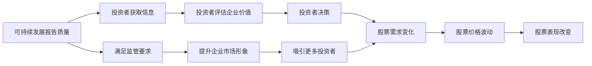

# 可持续发展报告质量对股票表现的影响

> 关键词：可持续发展报告质量、股票表现、企业社会责任、信息披露、资本市场

> 摘要：本文深入探讨了可持续发展报告质量对股票表现的影响。首先介绍了研究的背景、目的、预期读者等内容。接着阐述了可持续发展报告和股票表现的核心概念及两者之间的联系。通过详细的算法原理和数学模型分析，揭示了两者关系背后的逻辑。结合项目实战案例，展示了如何在实际中分析这种影响。同时列举了相关的实际应用场景、推荐了学习资源、开发工具和论文著作。最后总结了未来发展趋势与挑战，并对常见问题进行了解答。旨在为投资者、企业管理者和相关研究人员提供全面而深入的参考。

## 1. 背景介绍 
### 1.1 目的和范围
在当今全球经济环境中，可持续发展已经成为企业发展的重要议题。企业发布可持续发展报告，不仅是对自身社会责任的一种宣示，也是向投资者和社会公众传递企业长期发展潜力的重要方式。本研究的目的在于深入探究可持续发展报告质量对股票表现的具体影响，明确两者之间的关联机制。研究范围涵盖了不同行业、不同规模的企业，通过对大量数据的分析和实证研究，揭示可持续发展报告质量与股票表现之间的普遍规律。

### 1.2 预期读者
本文的预期读者主要包括以下几类：
- **投资者**：帮助他们在进行投资决策时，除了关注传统的财务指标外，能够将可持续发展报告质量纳入考量因素，从而更全面地评估企业的投资价值。
- **企业管理者**：使他们认识到提高可持续发展报告质量的重要性，以及这对企业股票表现和市场形象的积极影响，进而推动企业在可持续发展方面做出更多努力。
- **研究人员**：为他们提供关于可持续发展报告质量与股票表现关系的研究思路和方法，促进相关领域的学术研究和理论发展。
- **监管机构**：为监管政策的制定提供参考，有助于引导企业提高可持续发展报告的质量，规范资本市场的信息披露。

### 1.3 文档结构概述
本文将按照以下结构进行阐述：
- **核心概念与联系**：介绍可持续发展报告质量和股票表现的核心概念，并分析两者之间的内在联系。
- **核心算法原理 & 具体操作步骤**：详细讲解用于分析可持续发展报告质量对股票表现影响的算法原理，并给出具体的操作步骤。
- **数学模型和公式 & 详细讲解 & 举例说明**：建立数学模型，用公式表达两者之间的关系，并通过具体例子进行详细说明。
- **项目实战：代码实际案例和详细解释说明**：通过实际的代码案例，展示如何在实际项目中应用上述算法和模型进行分析。
- **实际应用场景**：列举可持续发展报告质量对股票表现影响的实际应用场景。
- **工具和资源推荐**：推荐相关的学习资源、开发工具和论文著作。
- **总结：未来发展趋势与挑战**：总结研究成果，分析未来的发展趋势和面临的挑战。
- **附录：常见问题与解答**：对读者可能关心的常见问题进行解答。
- **扩展阅读 & 参考资料**：提供进一步阅读的相关资料和参考文献。

### 1.4 术语表
#### 1.4.1 核心术语定义
- **可持续发展报告质量**：指企业发布的可持续发展报告在内容完整性、数据准确性、信息披露透明度、与企业战略的关联性等方面的综合表现。高质量的可持续发展报告能够全面、准确地反映企业在经济、环境和社会等方面的可持续发展实践和绩效。
- **股票表现**：主要通过股票价格的波动、收益率、市场估值等指标来衡量，反映了股票在资本市场上的表现和投资者对企业的预期。
- **企业社会责任（CSR）**：企业在创造利润、对股东和员工承担法律责任的同时，还要承担对消费者、社区和环境的责任。可持续发展报告是企业披露社会责任履行情况的重要载体。
- **信息披露**：企业通过各种渠道向投资者和社会公众公开其财务状况、经营成果、重大事项等信息的行为。可持续发展报告是企业信息披露的重要组成部分。

#### 1.4.2 相关概念解释
- **ESG因素**：环境（Environmental）、社会（Social）和治理（Governance）因素是衡量企业可持续发展的重要维度。可持续发展报告通常会涵盖企业在ESG方面的表现和措施。
- **资本市场有效性**：指资本市场能够迅速、准确地反映所有相关信息的程度。如果资本市场是有效的，那么可持续发展报告质量的变化应该能够及时反映在股票价格上。
- **投资者偏好**：投资者在进行投资决策时，会根据自己的风险偏好、投资目标和价值观等因素，对不同企业的股票进行选择。越来越多的投资者开始关注企业的可持续发展表现，将其作为投资决策的重要参考。

#### 1.4.3 缩略词列表
- **CSR**：Corporate Social Responsibility（企业社会责任）
- **ESG**：Environmental, Social and Governance（环境、社会和治理）
- **ROE**：Return on Equity（净资产收益率）
- **PE**：Price-to-Earnings Ratio（市盈率）

## 2. 核心概念与联系 

### 2.1 可持续发展报告质量的核心概念
可持续发展报告质量是一个综合性的概念，它涉及到报告的多个方面。从内容上看，一份高质量的可持续发展报告应涵盖企业在经济、环境和社会三个维度的活动和绩效。经济维度包括企业的盈利能力、对经济增长的贡献等；环境维度涉及企业的资源利用、污染物排放、环境管理措施等；社会维度则关注企业的员工权益、社区关系、供应链管理等。

从报告的编制和披露角度来看，高质量的可持续发展报告应遵循相关的国际标准和准则，如全球报告倡议组织（GRI）发布的可持续发展报告标准。报告应具有清晰的结构、准确的数据和详细的说明，以便读者能够全面了解企业的可持续发展实践。此外，报告还应具有可比性和连续性，能够反映企业在不同时期的可持续发展进展。

### 2.2 股票表现的核心概念
股票表现是投资者关注的核心指标之一，它反映了股票在资本市场上的价值和吸引力。股票表现通常通过以下几个方面来衡量：
- **股票价格**：是股票在市场上的交易价格，它受到供求关系、企业基本面、宏观经济环境等多种因素的影响。
- **收益率**：包括股息收益率和资本利得收益率。股息收益率是指企业向股东支付的股息与股票价格的比率；资本利得收益率是指股票价格上涨所带来的收益。
- **市场估值**：常用的估值指标包括市盈率（PE）、市净率（PB）等。市盈率是指股票价格与每股收益的比率，反映了投资者对企业未来盈利的预期。

### 2.3 可持续发展报告质量与股票表现的联系
可持续发展报告质量与股票表现之间存在着密切的联系。从投资者的角度来看，高质量的可持续发展报告能够提供更多关于企业的非财务信息，帮助投资者更全面地了解企业的长期发展潜力和风险。例如，企业在环境方面的良好表现可以降低其面临的环境风险，提高其长期竞争力；企业在社会方面的积极作为可以增强其品牌形象和客户忠诚度，促进业务增长。这些因素都可能对企业的股票表现产生积极影响。

从资本市场的角度来看，随着投资者对可持续发展的关注度不断提高，高质量的可持续发展报告可以吸引更多的投资者，增加股票的需求，从而推动股票价格上涨。此外，监管机构也越来越重视企业的可持续发展信息披露，高质量的可持续发展报告可以帮助企业满足监管要求，避免潜在的法律风险，进一步提升企业的市场形象和股票表现。

### 2.4 文本示意图
以下是可持续发展报告质量与股票表现的关系示意图：

可持续发展报告质量
|-- 内容完整性
|   |-- 经济维度
|   |-- 环境维度
|   |-- 社会维度
|-- 数据准确性
|-- 信息披露透明度
|-- 与企业战略的关联性

股票表现
|-- 股票价格
|-- 收益率
|-- 市场估值

联系：
可持续发展报告质量提高 -> 投资者对企业长期发展潜力更有信心 -> 增加股票需求 -> 股票价格上涨、收益率提高、市场估值提升

### 2.5 Mermaid 流程图


## 3. 核心算法原理 & 具体操作步骤 

### 3.1 算法原理
为了分析可持续发展报告质量对股票表现的影响，我们可以采用多元线性回归模型。该模型的基本思想是，将股票表现作为因变量，将可持续发展报告质量以及其他可能影响股票表现的因素作为自变量，通过建立线性方程来描述它们之间的关系。

假设我们用 $Y$ 表示股票表现，用 $X_1$ 表示可持续发展报告质量，用 $X_2, X_3, \cdots, X_n$ 表示其他控制变量（如企业规模、盈利能力、行业特征等），则多元线性回归模型可以表示为：

$$Y = \beta_0 + \beta_1X_1 + \beta_2X_2 + \cdots + \beta_nX_n + \epsilon$$

其中，$\beta_0$ 是截距项，$\beta_1, \beta_2, \cdots, \beta_n$ 是回归系数，$\epsilon$ 是误差项。回归系数 $\beta_1$ 表示在其他控制变量不变的情况下，可持续发展报告质量每增加一个单位，股票表现的平均变化量。

### 3.2 具体操作步骤

#### 3.2.1 数据收集
- **可持续发展报告质量数据**：可以通过专业的评级机构获取企业可持续发展报告的评级数据，也可以自行构建指标体系对可持续发展报告进行评分。指标体系可以包括内容完整性、数据准确性、信息披露透明度等方面的指标。
- **股票表现数据**：可以从金融数据提供商（如 Wind、Bloomberg 等）获取股票价格、收益率、市盈率等数据。
- **控制变量数据**：企业规模可以用总资产、营业收入等指标来衡量；盈利能力可以用净资产收益率（ROE）、净利润率等指标来衡量；行业特征可以用行业分类代码来表示。

#### 3.2.2 数据预处理
- **缺失值处理**：对于数据中的缺失值，可以采用删除缺失值、插补缺失值等方法进行处理。
- **异常值处理**：对于数据中的异常值，可以采用统计方法（如 Z-score 方法）进行识别和处理。
- **数据标准化**：为了消除不同变量之间的量纲差异，可以对数据进行标准化处理，常用的方法有 Z-score 标准化、Min-Max 标准化等。

#### 3.2.3 模型估计
使用统计软件（如 Python 中的 `statsmodels` 库、R 语言等）对多元线性回归模型进行估计，得到回归系数和其他统计量。

#### 3.2.4 模型检验
- **拟合优度检验**：通过计算决定系数 $R^2$ 来检验模型的拟合优度，$R^2$ 越接近 1，说明模型对数据的拟合效果越好。
- **显著性检验**：对回归系数进行显著性检验，判断自变量对因变量是否有显著影响。常用的检验方法有 t 检验、F 检验等。
- **多重共线性检验**：检查自变量之间是否存在多重共线性问题，可以通过计算方差膨胀因子（VIF）来进行检验。

#### 3.2.5 结果分析
根据模型估计和检验的结果，分析可持续发展报告质量对股票表现的影响。如果回归系数 $\beta_1$ 显著为正，说明可持续发展报告质量的提高对股票表现有积极影响；如果回归系数 $\beta_1$ 显著为负，说明可持续发展报告质量的提高对股票表现有消极影响；如果回归系数 $\beta_1$ 不显著，说明可持续发展报告质量对股票表现没有显著影响。

### 3.3 Python 源代码实现
```python
import pandas as pd
import numpy as np
import statsmodels.api as sm

# 假设我们已经收集到了以下数据
# 可持续发展报告质量
sdr_quality = np.array([1, 2, 3, 4, 5])
# 股票收益率
stock_return = np.array([0.05, 0.06, 0.07, 0.08, 0.09])
# 企业规模（用总资产表示）
firm_size = np.array([100, 200, 300, 400, 500])
# 盈利能力（用净资产收益率表示）
roe = np.array([0.1, 0.12, 0.14, 0.16, 0.18])

# 构建数据集
data = pd.DataFrame({
    'sdr_quality': sdr_quality,
    'stock_return': stock_return,
    'firm_size': firm_size,
    'roe': roe
})

# 定义自变量和因变量
X = data[['sdr_quality', 'firm_size', 'roe']]
y = data['stock_return']

# 添加截距项
X = sm.add_constant(X)

# 拟合多元线性回归模型
model = sm.OLS(y, X).fit()

# 打印模型摘要
print(model.summary())
```

## 4. 数学模型和公式 & 详细讲解 & 举例说明 

### 4.1 数学模型
如前面所述，我们采用多元线性回归模型来分析可持续发展报告质量对股票表现的影响。模型的一般形式为：

$$Y = \beta_0 + \beta_1X_1 + \beta_2X_2 + \cdots + \beta_nX_n + \epsilon$$

其中，$Y$ 是因变量，表示股票表现；$X_1$ 是我们关注的自变量，表示可持续发展报告质量；$X_2, X_3, \cdots, X_n$ 是控制变量；$\beta_0$ 是截距项，$\beta_1, \beta_2, \cdots, \beta_n$ 是回归系数，$\epsilon$ 是误差项。

### 4.2 公式详细讲解

#### 4.2.1 回归系数的含义
回归系数 $\beta_i$ 表示在其他自变量保持不变的情况下，自变量 $X_i$ 每增加一个单位，因变量 $Y$ 的平均变化量。例如，$\beta_1$ 表示在控制了企业规模、盈利能力等因素后，可持续发展报告质量每增加一个单位，股票表现的平均变化量。

#### 4.2.2 误差项的含义
误差项 $\epsilon$ 表示模型中无法用自变量解释的部分，它包含了随机因素、测量误差、未考虑到的变量等。误差项通常假设服从均值为 0、方差为 $\sigma^2$ 的正态分布。

#### 4.2.3 决定系数 $R^2$
决定系数 $R^2$ 是衡量回归模型拟合优度的指标，它表示因变量的总变异中可以由自变量解释的比例。$R^2$ 的计算公式为：

$$R^2 = 1 - \frac{\sum_{i=1}^{n}(y_i - \hat{y}_i)^2}{\sum_{i=1}^{n}(y_i - \bar{y})^2}$$

其中，$y_i$ 是实际观测值，$\hat{y}_i$ 是模型预测值，$\bar{y}$ 是因变量的均值。$R^2$ 的取值范围是 $[0, 1]$，$R^2$ 越接近 1，说明模型对数据的拟合效果越好。

#### 4.2.4 t 检验
t 检验用于检验回归系数的显著性。对于回归系数 $\beta_i$，t 统计量的计算公式为：

$$t = \frac{\hat{\beta}_i}{SE(\hat{\beta}_i)}$$

其中，$\hat{\beta}_i$ 是回归系数的估计值，$SE(\hat{\beta}_i)$ 是回归系数的标准误差。t 统计量服从自由度为 $n - k - 1$ 的 t 分布，其中 $n$ 是样本数量，$k$ 是自变量的数量。在给定的显著性水平下，如果 t 统计量的绝对值大于临界值，则拒绝原假设，认为回归系数显著不为 0。

### 4.3 举例说明
假设我们通过数据分析得到了以下多元线性回归模型：

$$\text{Stock Return} = 0.02 + 0.01\times\text{SDR Quality} + 0.0001\times\text{Firm Size} + 0.2\times\text{ROE}$$

其中，$\text{Stock Return}$ 是股票收益率，$\text{SDR Quality}$ 是可持续发展报告质量，$\text{Firm Size}$ 是企业规模，$\text{ROE}$ 是净资产收益率。

- **回归系数的解释**：
  - 截距项 0.02 表示当可持续发展报告质量、企业规模和净资产收益率都为 0 时，股票收益率的平均值。
  - 可持续发展报告质量的回归系数 0.01 表示在控制了企业规模和净资产收益率后，可持续发展报告质量每增加一个单位，股票收益率平均增加 0.01。
  - 企业规模的回归系数 0.0001 表示在控制了可持续发展报告质量和净资产收益率后，企业规模每增加一个单位，股票收益率平均增加 0.0001。
  - 净资产收益率的回归系数 0.2 表示在控制了可持续发展报告质量和企业规模后，净资产收益率每增加一个单位，股票收益率平均增加 0.2。

- **决定系数和 t 检验**：
  假设该模型的决定系数 $R^2 = 0.6$，说明自变量可以解释因变量总变异的 60%。如果可持续发展报告质量的 t 统计量为 2.5，在显著性水平为 0.05 的情况下，临界值为 2.02（自由度为 $n - k - 1$），由于 $|2.5| > 2.02$，所以我们可以认为可持续发展报告质量对股票收益率有显著影响。

## 5. 项目实战：代码实际案例和详细解释说明 

### 5.1  开发环境搭建
为了实现对可持续发展报告质量对股票表现影响的分析，我们可以使用 Python 作为开发语言，并使用以下库：
- **pandas**：用于数据处理和分析。
- **numpy**：用于数值计算。
- **statsmodels**：用于统计建模和分析。
- **matplotlib**：用于数据可视化。

可以使用以下命令安装这些库：
```sh
pip install pandas numpy statsmodels matplotlib
```

### 5.2  源代码详细实现和代码解读
```python
import pandas as pd
import numpy as np
import statsmodels.api as sm
import matplotlib.pyplot as plt

# 1. 数据收集和读取
# 假设我们已经将数据保存为 CSV 文件
data = pd.read_csv('sdr_stock_data.csv')

# 2. 数据预处理
# 处理缺失值
data = data.dropna()

# 提取自变量和因变量
X = data[['sdr_quality', 'firm_size', 'roe']]
y = data['stock_return']

# 添加截距项
X = sm.add_constant(X)

# 3. 模型估计
model = sm.OLS(y, X).fit()

# 4. 模型检验
# 打印模型摘要
print(model.summary())

# 5. 结果可视化
# 绘制可持续发展报告质量与股票收益率的散点图
plt.scatter(data['sdr_quality'], data['stock_return'])
plt.xlabel('Sustainable Development Report Quality')
plt.ylabel('Stock Return')
plt.title('Relationship between SDR Quality and Stock Return')
plt.show()
```

### 5.3  代码解读与分析
- **数据收集和读取**：使用 `pandas` 的 `read_csv` 函数读取保存有可持续发展报告质量、股票收益率、企业规模和净资产收益率等数据的 CSV 文件。
- **数据预处理**：使用 `dropna` 函数删除数据中的缺失值，确保数据的完整性。然后提取自变量和因变量，并使用 `sm.add_constant` 函数添加截距项。
- **模型估计**：使用 `statsmodels` 的 `OLS` 函数拟合多元线性回归模型，并使用 `fit` 方法进行估计。
- **模型检验**：使用 `summary` 方法打印模型的摘要信息，包括回归系数、标准误差、t 统计量、p 值、决定系数等，方便我们对模型进行检验和分析。
- **结果可视化**：使用 `matplotlib` 的 `scatter` 函数绘制可持续发展报告质量与股票收益率的散点图，直观地展示两者之间的关系。

## 6. 实际应用场景 
### 6.1 投资决策
投资者在进行股票投资时，可以将可持续发展报告质量作为一个重要的参考因素。通过分析企业的可持续发展报告质量，投资者可以更全面地了解企业的长期发展潜力和风险，从而做出更明智的投资决策。例如，如果一家企业的可持续发展报告质量较高，说明该企业在环境、社会和治理方面表现较好，具有较强的可持续发展能力，投资者可以考虑增加对该企业股票的投资。

### 6.2 企业战略规划
企业管理者可以通过提高可持续发展报告质量，向投资者和社会公众展示企业的可持续发展战略和实践，增强企业的市场形象和竞争力。同时，企业可以根据可持续发展报告中反映的问题和挑战，调整企业的战略规划，加强在环境、社会和治理方面的管理和投入，实现企业的可持续发展目标。

### 6.3 监管政策制定
监管机构可以通过制定相关政策，要求企业提高可持续发展报告质量，规范企业的信息披露行为。这样可以提高资本市场的透明度，保护投资者的利益，促进资本市场的健康发展。例如，监管机构可以制定可持续发展报告的披露标准和规范，对企业的可持续发展报告进行审核和监督。

### 6.4 学术研究
学术研究人员可以通过研究可持续发展报告质量对股票表现的影响，深入探讨企业可持续发展与资本市场的关系，为相关理论的发展提供实证支持。同时，研究结果也可以为企业、投资者和监管机构提供决策参考。

## 7. 工具和资源推荐
### 7.1 学习资源推荐
#### 7.1.1 书籍推荐
- 《可持续发展报告指南》：由全球报告倡议组织（GRI）编写，是可持续发展报告领域的权威指南，详细介绍了可持续发展报告的编制原则、方法和内容要求。
- 《投资与可持续发展》：探讨了可持续发展因素在投资决策中的应用，以及如何通过投资促进可持续发展。
- 《企业社会责任与可持续发展》：全面介绍了企业社会责任和可持续发展的理论和实践，包括企业社会责任的概念、企业可持续发展战略的制定和实施等内容。

#### 7.1.2 在线课程
- Coursera 上的 “Sustainable Business Strategy” 课程：由知名大学的教授授课，介绍了企业可持续发展战略的制定和实施方法。
- edX 上的 “Investing in a Sustainable Future” 课程：讲解了可持续投资的理论和实践，包括可持续投资的策略、工具和评估方法等。
- 中国大学 MOOC 上的 “企业社会责任与可持续发展” 课程：结合中国企业的实际案例，介绍了企业社会责任和可持续发展的相关知识和实践经验。

#### 7.1.3 技术博客和网站
- 全球报告倡议组织（GRI）官网：提供了可持续发展报告的最新标准、指南和案例，是了解可持续发展报告领域的重要资源。
- 社会责任投资论坛（US SIF）官网：关注社会责任投资领域的最新动态和研究成果，提供了大量关于可持续投资的信息和资源。
- 财新网的可持续发展频道：报道了国内外企业的可持续发展实践和相关政策动态，提供了丰富的案例和分析文章。

### 7.2 开发工具框架推荐
#### 7.2.1 IDE和编辑器
- PyCharm：是一款专业的 Python 集成开发环境，提供了丰富的代码编辑、调试和分析功能，适合进行数据分析和建模项目的开发。
- Jupyter Notebook：是一个基于网页的交互式计算环境，支持多种编程语言，方便进行数据探索、可视化和模型验证等工作。
- Visual Studio Code：是一款轻量级的代码编辑器，支持多种编程语言和插件扩展，具有强大的代码编辑和调试功能。

#### 7.2.2 调试和性能分析工具
- PDB：是 Python 内置的调试工具，可以帮助开发者在代码中设置断点、单步执行代码、查看变量值等，方便进行代码调试。
- cProfile：是 Python 标准库中的性能分析工具，可以帮助开发者分析代码的运行时间和性能瓶颈，优化代码性能。
- Spyder：是一个专门为科学计算和数据分析设计的 Python IDE，提供了集成的调试和性能分析功能，方便开发者进行代码调试和优化。

#### 7.2.3 相关框架和库
- pandas：是一个强大的数据处理和分析库，提供了丰富的数据结构和函数，方便进行数据清洗、转换、分析和可视化等工作。
- numpy：是 Python 中用于科学计算的基础库，提供了高效的多维数组对象和各种数学函数，是数据分析和建模的重要工具。
- statsmodels：是一个用于统计建模和分析的 Python 库，提供了多种统计模型和方法，如线性回归、逻辑回归、时间序列分析等。
- scikit-learn：是一个用于机器学习的 Python 库，提供了丰富的机器学习算法和工具，如分类、回归、聚类、降维等，可用于构建和评估股票表现预测模型。

### 7.3 相关论文著作推荐
#### 7.3.1 经典论文
- “Corporate Social Responsibility and Financial Performance: A Meta - analysis”：对企业社会责任与财务绩效之间的关系进行了元分析，总结了大量实证研究的结果。
- “The Impact of Environmental, Social, and Governance (ESG) Factors on Stock Returns: Evidence from the European Market”：研究了 ESG 因素对欧洲市场股票收益率的影响，为可持续投资提供了实证支持。
- “Voluntary Nonfinancial Disclosure and the Cost of Equity Capital: The Initiation of Corporate Social Responsibility Reporting”：探讨了企业自愿披露社会责任信息对股权资本成本的影响。

#### 7.3.2 最新研究成果
- 关注《Journal of Sustainable Finance & Investment》《Academy of Management Journal》《Journal of Financial Economics》等学术期刊，这些期刊经常发表关于可持续发展和资本市场的最新研究成果。
- 参加相关的学术会议，如国际可持续发展研究协会（IASS）年会、社会责任投资论坛（US SIF）年会等，了解该领域的最新研究动态和前沿观点。

#### 7.3.3 应用案例分析
- 《哈佛商业评论》经常刊登企业可持续发展的成功案例和实践经验，通过分析这些案例可以了解企业在可持续发展报告质量提升、可持续发展战略实施等方面的具体做法和成效。
- 世界经济论坛（WEF）发布的《全球竞争力报告》中也包含了一些企业可持续发展的案例和分析，为企业和投资者提供了有益的参考。

## 8. 总结：未来发展趋势与挑战
### 8.1 未来发展趋势
- **信息披露要求提高**：随着社会对可持续发展的关注度不断提高，监管机构将对企业的可持续发展信息披露提出更高的要求。企业需要更加全面、准确地披露其在环境、社会和治理方面的表现，可持续发展报告的质量将成为企业合规的重要指标。
- **投资者关注度增加**：越来越多的投资者开始将可持续发展因素纳入投资决策过程中，他们更愿意投资于那些具有良好可持续发展表现的企业。这将促使企业更加重视可持续发展报告质量，以吸引更多的投资者。
- **技术应用加强**：大数据、人工智能等技术将在可持续发展报告质量评估和股票表现分析中得到更广泛的应用。通过对大量的可持续发展数据和股票市场数据进行分析，可以更准确地评估可持续发展报告质量对股票表现的影响。
- **国际标准趋同**：全球报告倡议组织（GRI）、国际综合报告委员会（IIRC）等国际组织将不断完善可持续发展报告标准，推动各国企业的可持续发展报告标准趋同，提高报告的可比性和透明度。

### 8.2 挑战
- **数据质量和可比性问题**：目前，企业可持续发展报告的数据质量参差不齐，不同企业之间的数据可比性较差。这给投资者和研究人员分析可持续发展报告质量对股票表现的影响带来了困难。未来需要建立统一的数据标准和规范，提高数据的质量和可比性。
- **模型复杂性和不确定性**：可持续发展报告质量对股票表现的影响受到多种因素的综合作用，建立准确的模型来描述这种关系具有一定的复杂性和不确定性。需要不断改进模型和方法，提高分析结果的准确性和可靠性。
- **企业认识不足**：部分企业对可持续发展报告质量的重要性认识不足，仍然将主要精力放在传统的财务指标上。需要加强对企业的宣传和培训，提高企业对可持续发展的认识和重视程度。
- **监管协调难度大**：不同国家和地区的监管政策存在差异，监管协调难度较大。需要加强国际间的合作与协调，制定统一的监管标准和政策，促进全球可持续发展报告质量的提升。

## 9. 附录：常见问题与解答
### 9.1 可持续发展报告质量的评估标准是什么？
可持续发展报告质量的评估标准通常包括内容完整性、数据准确性、信息披露透明度、与企业战略的关联性等方面。目前，全球报告倡议组织（GRI）发布的可持续发展报告标准是国际上广泛认可的评估标准，该标准详细规定了可持续发展报告应涵盖的内容和披露要求。

### 9.2 如何衡量股票表现？
股票表现可以通过股票价格、收益率、市场估值等指标来衡量。股票价格是股票在市场上的交易价格，收益率包括股息收益率和资本利得收益率，市场估值常用的指标有市盈率（PE）、市净率（PB）等。

### 9.3 可持续发展报告质量对股票表现的影响一定是积极的吗？
不一定。虽然理论上高质量的可持续发展报告可以向投资者传递企业的良好形象和长期发展潜力，从而对股票表现产生积极影响，但在实际情况中，这种影响还受到多种因素的制约。例如，如果企业在可持续发展报告中披露了一些负面信息，可能会对股票表现产生消极影响。此外，市场环境、行业竞争等因素也会影响可持续发展报告质量对股票表现的作用。

### 9.4 如何提高企业的可持续发展报告质量？
企业可以从以下几个方面提高可持续发展报告质量：
- **建立完善的可持续发展管理体系**：明确可持续发展目标和战略，加强在环境、社会和治理方面的管理和投入。
- **加强数据收集和管理**：建立准确、可靠的数据收集和管理系统，确保报告中的数据真实、准确。
- **遵循国际标准和准则**：参照全球报告倡议组织（GRI）等国际组织发布的标准和准则编制可持续发展报告，提高报告的规范性和可比性。
- **加强与利益相关者的沟通**：了解利益相关者的需求和期望，在报告中充分反映他们的关注点。

### 9.5 可持续发展报告质量与企业财务绩效有什么关系？
可持续发展报告质量与企业财务绩效之间存在着一定的关系。一方面，高质量的可持续发展报告可以反映企业在环境、社会和治理方面的良好表现，有助于提升企业的品牌形象和声誉，增强客户忠诚度和市场竞争力，从而对企业的财务绩效产生积极影响。另一方面，企业的财务绩效也会影响其在可持续发展方面的投入和表现，进而影响可持续发展报告质量。两者之间是相互影响、相互促进的关系。

## 10. 扩展阅读 & 参考资料
### 10.1 扩展阅读
- 《可持续发展的商业模式创新》：探讨了企业如何通过商业模式创新实现可持续发展，以及可持续发展对企业商业模式的影响。
- 《绿色金融与可持续投资》：介绍了绿色金融的概念、发展现状和趋势，以及可持续投资的策略和方法。
- 《企业可持续发展战略与实践》：结合实际案例，深入分析了企业可持续发展战略的制定和实施过程，为企业提供了有益的借鉴。

### 10.2 参考资料
- 全球报告倡议组织（GRI）官网：https://www.globalreporting.org/
- 社会责任投资论坛（US SIF）官网：https://ussif.org/
- 财新网可持续发展频道：https://economy.caixin.com/sustainability/

作者：AI天才研究院/AI Genius Institute & 禅与计算机程序设计艺术 /Zen And The Art of Computer Programming