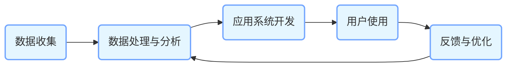

# 可持续城市交通解决方案的市场前景

> 关键词：可持续城市交通、市场前景、交通解决方案、绿色出行、智能交通

> 摘要：本文深入探讨了可持续城市交通解决方案的市场前景。首先介绍了可持续城市交通的背景，包括目的、预期读者、文档结构和相关术语。接着阐述了核心概念与联系，详细讲解了核心算法原理及操作步骤，给出了数学模型和公式并举例说明。通过项目实战案例展示了代码实现和解读。分析了实际应用场景，推荐了相关的工具和资源，包括学习资源、开发工具框架和论文著作。最后总结了未来发展趋势与挑战，解答了常见问题并提供了扩展阅读和参考资料，旨在为读者全面呈现可持续城市交通解决方案市场的现状与未来。

## 1. 背景介绍 
### 1.1 目的和范围
随着城市化进程的加速，城市交通面临着诸多挑战，如交通拥堵、环境污染、能源消耗等。可持续城市交通解决方案旨在通过创新的技术和策略，实现城市交通的高效、环保和可持续发展。本文的目的是深入分析可持续城市交通解决方案的市场前景，探讨其发展趋势、机遇和挑战，为相关企业、投资者和政策制定者提供决策参考。

本文的范围涵盖了各种可持续城市交通解决方案，包括公共交通系统优化、智能交通管理、绿色出行方式推广、共享交通服务等。同时，还将分析市场的规模、增长趋势、竞争格局以及影响市场发展的因素。

### 1.2 预期读者
本文的预期读者包括：
- 交通行业的企业管理者和决策者，如公交公司、出租车公司、共享单车企业等，他们可以从本文中了解市场趋势，制定发展战略。
- 投资者，包括风险投资机构、私募股权投资基金等，他们可以通过本文评估可持续城市交通解决方案领域的投资机会。
- 政府部门和政策制定者，他们可以根据本文的分析制定相关政策，推动城市交通的可持续发展。
- 研究机构和学者，他们可以从本文中获取相关数据和研究成果，开展进一步的研究。

### 1.3 文档结构概述
本文的结构如下：
- 核心概念与联系：介绍可持续城市交通解决方案的核心概念，包括相关的原理和架构，并通过文本示意图和 Mermaid 流程图进行展示。
- 核心算法原理 & 具体操作步骤：详细讲解实现可持续城市交通解决方案所涉及的核心算法原理，并给出具体的操作步骤，同时使用 Python 源代码进行阐述。
- 数学模型和公式 & 详细讲解 & 举例说明：建立相关的数学模型，给出公式并进行详细讲解，通过具体例子说明其应用。
- 项目实战：代码实际案例和详细解释说明：通过一个实际项目案例，展示可持续城市交通解决方案的代码实现和详细解读。
- 实际应用场景：分析可持续城市交通解决方案在不同场景下的应用。
- 工具和资源推荐：推荐相关的学习资源、开发工具框架和论文著作。
- 总结：未来发展趋势与挑战：总结可持续城市交通解决方案的未来发展趋势和面临的挑战。
- 附录：常见问题与解答：解答读者可能关心的常见问题。
- 扩展阅读 & 参考资料：提供相关的扩展阅读和参考资料。

### 1.4 术语表
#### 1.4.1 核心术语定义
- 可持续城市交通：指在满足城市居民出行需求的同时，能够减少对环境的负面影响，提高能源利用效率，促进社会公平和经济发展的城市交通系统。
- 智能交通系统（ITS）：利用先进的信息技术、通信技术、传感器技术等，对城市交通进行实时监测、控制和管理的系统。
- 绿色出行方式：包括步行、自行车、公共交通等对环境友好的出行方式。
- 共享交通服务：指通过共享的方式提供交通出行服务，如共享单车、共享汽车、拼车等。

#### 1.4.2 相关概念解释
- 交通拥堵：指在城市交通中，由于车辆数量过多、道路容量不足等原因，导致车辆行驶速度缓慢，交通流量不畅的现象。
- 环境污染：城市交通排放的尾气、噪声等对环境造成的污染。
- 能源消耗：城市交通所消耗的石油、天然气等能源。

#### 1.4.3 缩略词列表
- ITS：Intelligent Transportation System（智能交通系统）
- EV：Electric Vehicle（电动汽车）
- P&R：Park and Ride（停车换乘）

## 2. 核心概念与联系 
### 核心概念原理
可持续城市交通解决方案的核心原理是通过整合多种交通方式，优化交通资源配置，提高交通运行效率，减少交通对环境的影响。具体包括以下几个方面：
- 公共交通优先：优先发展公共交通系统，如地铁、轻轨、公交等，提高公共交通的服务质量和吸引力，鼓励居民选择公共交通出行。
- 智能交通管理：利用智能交通系统对交通流量进行实时监测和控制，优化信号灯配时，提供实时交通信息，引导车辆合理行驶，减少交通拥堵。
- 绿色出行推广：鼓励居民采用步行、自行车等绿色出行方式，建设完善的步行和自行车道网络，提供自行车租赁服务等。
- 共享交通服务：发展共享单车、共享汽车、拼车等共享交通服务，提高车辆的利用率，减少私人汽车的使用。

### 架构的文本示意图
可持续城市交通解决方案的架构可以分为以下几个层次：
- 数据层：收集和存储交通相关的数据，如交通流量、车辆位置、气象信息等。
- 处理层：对收集到的数据进行处理和分析，提取有价值的信息，如交通拥堵预测、最优路径规划等。
- 应用层：基于处理层的结果，开发各种应用系统，如智能交通管理系统、公共交通信息服务系统、共享交通平台等。
- 用户层：包括城市居民、交通管理者、企业等，通过各种终端设备（如手机、电脑、车载设备等）使用应用层提供的服务。

### Mermaid 流程图


该流程图展示了可持续城市交通解决方案的工作流程，从数据收集开始，经过处理和分析，开发应用系统供用户使用，用户的反馈又用于优化整个系统。

## 3. 核心算法原理 & 具体操作步骤 
### 交通拥堵预测算法原理
交通拥堵预测是可持续城市交通解决方案中的重要环节，它可以帮助交通管理者提前采取措施，缓解交通拥堵。常用的交通拥堵预测算法有基于时间序列分析的算法和基于机器学习的算法。这里我们介绍基于机器学习的支持向量回归（SVR）算法。

支持向量回归的基本思想是在高维特征空间中寻找一个最优的超平面，使得所有样本点到该超平面的距离最小，同时满足一定的误差约束。具体来说，对于给定的训练数据集 $\{(x_1,y_1),(x_2,y_2),\cdots,(x_n,y_n)\}$，其中 $x_i\in R^d$ 是输入特征向量，$y_i\in R$ 是对应的输出值，SVR 的目标是找到一个函数 $f(x)=w^T\phi(x)+b$，使得预测值 $f(x)$ 与真实值 $y$ 之间的误差最小。

### Python 代码实现
```python
import numpy as np
from sklearn.svm import SVR
from sklearn.model_selection import train_test_split
from sklearn.metrics import mean_squared_error

# 生成示例数据
np.random.seed(0)
X = np.sort(5 * np.random.rand(80, 1), axis=0)
y = np.sin(X).ravel() + np.random.randn(80) * 0.1

# 划分训练集和测试集
X_train, X_test, y_train, y_test = train_test_split(X, y, test_size=0.2, random_state=42)

# 创建 SVR 模型
svr = SVR(kernel='rbf', C=100, gamma=0.1)

# 训练模型
svr.fit(X_train, y_train)

# 预测
y_pred = svr.predict(X_test)

# 计算均方误差
mse = mean_squared_error(y_test, y_pred)
print(f"均方误差: {mse}")
```

### 具体操作步骤
1. **数据收集**：收集交通流量、车速、时间等相关数据。
2. **数据预处理**：对收集到的数据进行清洗、归一化等处理，以便模型能够更好地学习。
3. **特征选择**：选择与交通拥堵相关的特征，如时间、路段、天气等。
4. **模型训练**：使用训练数据集对 SVR 模型进行训练。
5. **模型评估**：使用测试数据集对训练好的模型进行评估，计算均方误差等指标。
6. **模型应用**：将训练好的模型应用到实际的交通拥堵预测中，为交通管理者提供决策支持。

## 4. 数学模型和公式 & 详细讲解 & 举例说明 
### 交通流量分配模型
交通流量分配模型用于确定在城市交通网络中，车辆如何在不同的路段和路径上进行分配。常用的交通流量分配模型有用户均衡模型（UE）和系统最优模型（SO）。这里我们介绍用户均衡模型。

用户均衡模型的基本假设是，每个出行者都试图选择自己的最优路径，使得自己的出行成本最小。在达到用户均衡状态时，所有被使用的路径的出行成本相等，且小于未被使用的路径的出行成本。

设 $N$ 为交通网络中的节点集合，$A$ 为路段集合，$W$ 为出行起讫点（OD）对集合。对于每个 OD 对 $w\in W$，设 $P_w$ 为从起点到终点的所有可能路径集合。设 $f_{p}^w$ 为 OD 对 $w$ 上路径 $p$ 的流量，$x_a$ 为路段 $a$ 的流量。路段 $a$ 的行驶时间 $t_a(x_a)$ 是路段流量 $x_a$ 的函数。

用户均衡模型可以用以下数学公式表示：

$$
\begin{align*}
&\min \sum_{a\in A}\int_{0}^{x_a}t_a(u)du\\
&\text{s.t.} \sum_{p\in P_w}f_{p}^w = q_w, \forall w\in W\\
&x_a = \sum_{w\in W}\sum_{p\in P_w}f_{p}^w\delta_{ap}^w, \forall a\in A\\
&f_{p}^w\geq 0, \forall w\in W, p\in P_w
\end{align*}
$$

其中，$q_w$ 为 OD 对 $w$ 的出行需求，$\delta_{ap}^w$ 为路径 - 路段关联变量，如果路径 $p$ 经过路段 $a$，则 $\delta_{ap}^w = 1$，否则 $\delta_{ap}^w = 0$。

### 详细讲解
- 目标函数 $\sum_{a\in A}\int_{0}^{x_a}t_a(u)du$ 表示整个交通网络的总出行成本最小。
- 约束条件 $\sum_{p\in P_w}f_{p}^w = q_w$ 表示每个 OD 对的出行需求必须得到满足。
- 约束条件 $x_a = \sum_{w\in W}\sum_{p\in P_w}f_{p}^w\delta_{ap}^w$ 表示路段流量等于所有经过该路段的路径流量之和。
- 约束条件 $f_{p}^w\geq 0$ 表示路径流量非负。

### 举例说明
假设一个简单的交通网络，有两个节点 $A$ 和 $B$，三个路段 $a_1$、$a_2$、$a_3$，两个 OD 对 $w_1=(A,B)$ 和 $w_2=(B,A)$。OD 对 $w_1$ 的出行需求 $q_{w_1}=100$，OD 对 $w_2$ 的出行需求 $q_{w_2}=80$。路段的行驶时间函数分别为 $t_{a_1}(x_{a_1}) = 2 + 0.01x_{a_1}$，$t_{a_2}(x_{a_2}) = 3 + 0.02x_{a_2}$，$t_{a_3}(x_{a_3}) = 4 + 0.03x_{a_3}$。

我们可以使用优化算法（如 Frank - Wolfe 算法）来求解上述用户均衡模型，得到每个路段的流量和路径流量。

## 5. 项目实战：代码实际案例和详细解释说明 
### 5.1  开发环境搭建
本项目使用 Python 语言进行开发，需要安装以下库：
- NumPy：用于数值计算。
- Pandas：用于数据处理和分析。
- Scikit - learn：用于机器学习算法实现。
- Matplotlib：用于数据可视化。

可以使用以下命令安装这些库：
```sh
pip install numpy pandas scikit-learn matplotlib
```

### 5.2  源代码详细实现和代码解读
以下是一个基于 Python 的可持续城市交通解决方案的项目示例，用于预测公交站点的客流量。

```python
import pandas as pd
import numpy as np
from sklearn.model_selection import train_test_split
from sklearn.linear_model import LinearRegression
from sklearn.metrics import mean_squared_error
import matplotlib.pyplot as plt

# 加载数据
data = pd.read_csv('bus_passenger_data.csv')

# 数据预处理
X = data.drop('passenger_count', axis=1)
y = data['passenger_count']

# 划分训练集和测试集
X_train, X_test, y_train, y_test = train_test_split(X, y, test_size=0.2, random_state=42)

# 创建线性回归模型
model = LinearRegression()

# 训练模型
model.fit(X_train, y_train)

# 预测
y_pred = model.predict(X_test)

# 计算均方误差
mse = mean_squared_error(y_test, y_pred)
print(f"均方误差: {mse}")

# 可视化预测结果
plt.scatter(y_test, y_pred)
plt.xlabel('真实客流量')
plt.ylabel('预测客流量')
plt.title('公交站点客流量预测结果')
plt.show()
```

### 代码解读与分析
1. **数据加载**：使用 Pandas 库的 `read_csv` 函数加载公交站点客流量数据。
2. **数据预处理**：将特征变量和目标变量分开，目标变量为 `passenger_count`，其余为特征变量。
3. **划分训练集和测试集**：使用 `train_test_split` 函数将数据集划分为训练集和测试集，测试集占比为 20%。
4. **模型创建与训练**：创建线性回归模型，并使用训练集对模型进行训练。
5. **预测与评估**：使用训练好的模型对测试集进行预测，并计算均方误差来评估模型的性能。
6. **可视化**：使用 Matplotlib 库绘制真实客流量和预测客流量的散点图，直观展示预测结果。

## 6. 实际应用场景 
### 公共交通系统优化
可持续城市交通解决方案可以用于优化公共交通系统，提高公共交通的服务质量和效率。例如，通过智能调度系统，根据实时交通流量和乘客需求，动态调整公交线路和车辆发车间隔，减少乘客等待时间。同时，利用实时公交信息系统，为乘客提供公交车辆的实时位置、到达时间等信息，方便乘客规划出行。

### 智能交通管理
在智能交通管理方面，可持续城市交通解决方案可以实现交通信号的智能控制。通过交通流量监测设备，实时获取路口的交通流量信息，根据流量情况动态调整信号灯的配时，提高路口的通行能力，减少交通拥堵。此外，还可以利用智能交通系统对交通事故进行实时监测和预警，及时采取措施进行处理，保障交通的安全和畅通。

### 绿色出行推广
为了推广绿色出行方式，可持续城市交通解决方案可以建设完善的步行和自行车道网络，提高步行和自行车出行的安全性和便利性。同时，提供自行车租赁服务，鼓励居民使用自行车出行。例如，一些城市推出了共享单车服务，方便居民短距离出行，减少了私人汽车的使用，降低了碳排放。

### 共享交通服务
共享交通服务是可持续城市交通的重要组成部分。通过发展共享单车、共享汽车、拼车等共享交通模式，可以提高车辆的利用率，减少道路上的车辆数量，缓解交通拥堵。例如，拼车服务可以让多个乘客共享一辆车，降低了出行成本，同时也减少了车辆的排放。

## 7. 工具和资源推荐
### 7.1 学习资源推荐
#### 7.1.1 书籍推荐
- 《智能交通系统概论》：系统介绍了智能交通系统的基本概念、技术和应用，是学习智能交通领域的经典教材。
- 《交通工程学》：涵盖了交通规划、交通设计、交通管理等方面的知识，对于理解城市交通系统有很大帮助。
- 《机器学习》：由周志华教授编写，详细介绍了机器学习的基本算法和理论，对于学习交通数据挖掘和预测算法有重要参考价值。

#### 7.1.2 在线课程
- Coursera 上的 “Intelligent Transportation Systems” 课程：由知名高校教授授课，系统讲解智能交通系统的相关知识。
- edX 上的 “Data Science for Transportation” 课程：介绍了如何使用数据科学方法解决交通领域的问题。
- 中国大学 MOOC 上的 “交通规划” 课程：提供了交通规划的基本理论和方法。

#### 7.1.3 技术博客和网站
- 智能交通网（https://www.its114.com/）：提供智能交通领域的最新资讯、技术文章和案例分析。
- 交通研究论坛（https://www.tongjir.net/）：汇集了交通领域的学者和从业者，分享交通研究的最新成果和经验。
- Medium 上的一些技术博客，如 “Towards Data Science”，有很多关于交通数据挖掘和机器学习应用的文章。

### 7.2 开发工具框架推荐
#### 7.2.1 IDE和编辑器
- PyCharm：一款专业的 Python 集成开发环境，提供了丰富的代码编辑、调试和版本控制功能，适合开发交通相关的 Python 项目。
- Jupyter Notebook：一种交互式的开发环境，支持 Python 代码的编写、运行和可视化，方便进行数据探索和模型实验。
- Visual Studio Code：一款轻量级的代码编辑器，支持多种编程语言，安装相关插件后可以进行交通数据处理和分析。

#### 7.2.2 调试和性能分析工具
- Py-Spy：用于分析 Python 程序的性能瓶颈，找出耗时较长的代码段。
- cProfile：Python 自带的性能分析工具，可以统计函数的调用次数和执行时间。
- TensorBoard：用于可视化深度学习模型的训练过程和性能指标，对于交通预测模型的训练和优化有很大帮助。

#### 7.2.3 相关框架和库
- Scikit-learn：提供了丰富的机器学习算法和工具，如分类、回归、聚类等，可用于交通数据的建模和预测。
- TensorFlow：一个开源的深度学习框架，可用于构建复杂的交通预测模型，如神经网络模型。
- GeoPandas：用于处理地理空间数据，在交通地理信息系统（GIS）分析中非常有用。

### 7.3 相关论文著作推荐
#### 7.3.1 经典论文
- Wardrop, J. G. (1952). Some theoretical aspects of road traffic research. Proceedings of the Institute of Civil Engineers, 1(3), 325 - 378. 该论文提出了用户均衡和系统最优的交通流量分配理论，是交通规划领域的经典之作。
- Papageorgiou, M., Diakaki, C., & Blosseville, J. M. (2003). Review of road traffic control strategies. Proceedings of the IEEE, 91(12), 2043 - 2067. 对道路交通控制策略进行了全面的综述。

#### 7.3.2 最新研究成果
- 在 IEEE Transactions on Intelligent Transportation Systems、Transportation Research Part B: Methodological 等期刊上可以找到关于可持续城市交通解决方案的最新研究成果。

#### 7.3.3 应用案例分析
- 一些国际知名城市如新加坡、哥本哈根等的可持续城市交通发展案例分析，可在相关的交通规划报告和研究论文中找到。

## 8. 总结：未来发展趋势与挑战
### 未来发展趋势
- **智能化和自动化**：随着人工智能、物联网、大数据等技术的不断发展，可持续城市交通解决方案将更加智能化和自动化。例如，自动驾驶汽车将逐渐普及，智能交通系统将实现更加精准的交通流量预测和控制。
- **绿色化和低碳化**：为了应对气候变化和环境污染问题，未来的城市交通将更加注重绿色化和低碳化。电动汽车、氢燃料电池汽车等新能源汽车的市场份额将不断增加，同时，绿色出行方式将得到更广泛的推广。
- **共享化和协同化**：共享交通服务将继续发展壮大，不同交通方式之间的协同将更加紧密。例如，共享单车与公共交通的无缝衔接，拼车服务与出租车的整合等，将为居民提供更加便捷、高效的出行选择。
- **一体化和综合化**：可持续城市交通解决方案将朝着一体化和综合化的方向发展。未来的交通系统将不仅仅关注交通本身，还将与城市规划、土地利用、能源供应等方面进行深度融合，实现城市的可持续发展。

### 挑战
- **技术挑战**：虽然人工智能、物联网等技术为可持续城市交通带来了机遇，但也面临着一些技术挑战。例如，自动驾驶汽车的安全性和可靠性问题，智能交通系统的数据隐私和安全问题等。
- **政策和法规挑战**：可持续城市交通的发展需要相应的政策和法规支持。然而，目前相关的政策和法规还不够完善，需要进一步制定和完善，以促进可持续城市交通的健康发展。
- **社会接受度挑战**：一些新的交通模式和技术，如自动驾驶汽车、共享交通服务等，可能需要一定的时间才能被社会广泛接受。因此，需要加强宣传和教育，提高社会对可持续城市交通的认知和接受度。
- **资金投入挑战**：建设和运营可持续城市交通系统需要大量的资金投入。如何筹集足够的资金，确保项目的顺利实施，是一个亟待解决的问题。

## 9. 附录：常见问题与解答
### 问题 1：可持续城市交通解决方案是否适用于所有城市？
解答：可持续城市交通解决方案具有一定的通用性，但不同城市的交通状况、地理环境、人口规模等因素存在差异，因此需要根据具体情况进行定制化的设计和实施。例如，对于人口密集的大城市，可能更适合发展公共交通和共享交通；而对于小城市或城镇，自行车和步行等绿色出行方式可能更为可行。

### 问题 2：如何评估可持续城市交通解决方案的效果？
解答：可以从多个方面评估可持续城市交通解决方案的效果，如交通拥堵缓解程度、环境污染减少情况、能源消耗降低比例、居民出行满意度等。可以通过收集相关数据，建立评估指标体系，对解决方案的实施效果进行定量和定性的评估。

### 问题 3：可持续城市交通解决方案的实施需要哪些方面的合作？
解答：可持续城市交通解决方案的实施需要政府、企业、社会组织和居民等多方面的合作。政府负责制定政策和规划，提供资金支持和监管；企业负责技术研发和服务提供；社会组织可以参与宣传和教育活动；居民则需要积极配合和参与，改变出行习惯。

### 问题 4：共享交通服务会对传统交通行业造成冲击吗？
解答：共享交通服务的发展会对传统交通行业产生一定的影响，但也带来了新的机遇。一方面，共享交通服务可能会分流一部分传统交通的客源，如出租车和私家车的使用量可能会减少。另一方面，传统交通企业可以通过与共享交通企业合作，实现优势互补，共同推动城市交通的发展。

## 10. 扩展阅读 & 参考资料
### 扩展阅读
- 《城市交通与土地利用》：深入探讨了城市交通与土地利用之间的相互关系，对于理解可持续城市交通的规划和设计有重要意义。
- 《低碳城市交通发展战略》：介绍了国内外低碳城市交通的发展战略和实践经验。
- 《未来交通：智能交通系统的发展趋势》：展望了智能交通系统的未来发展趋势和应用前景。

### 参考资料
- 各城市的交通规划报告和统计年鉴，可获取城市交通的基础数据和发展情况。
- 国际能源署（IEA）、世界银行等国际组织发布的关于可持续城市交通的研究报告和政策建议。
- 相关学术期刊和会议论文，如 Transportation Research Part A: Policy and Practice、IEEE International Conference on Intelligent Transportation Systems 等。

作者：AI天才研究院/AI Genius Institute & 禅与计算机程序设计艺术 /Zen And The Art of Computer Programming