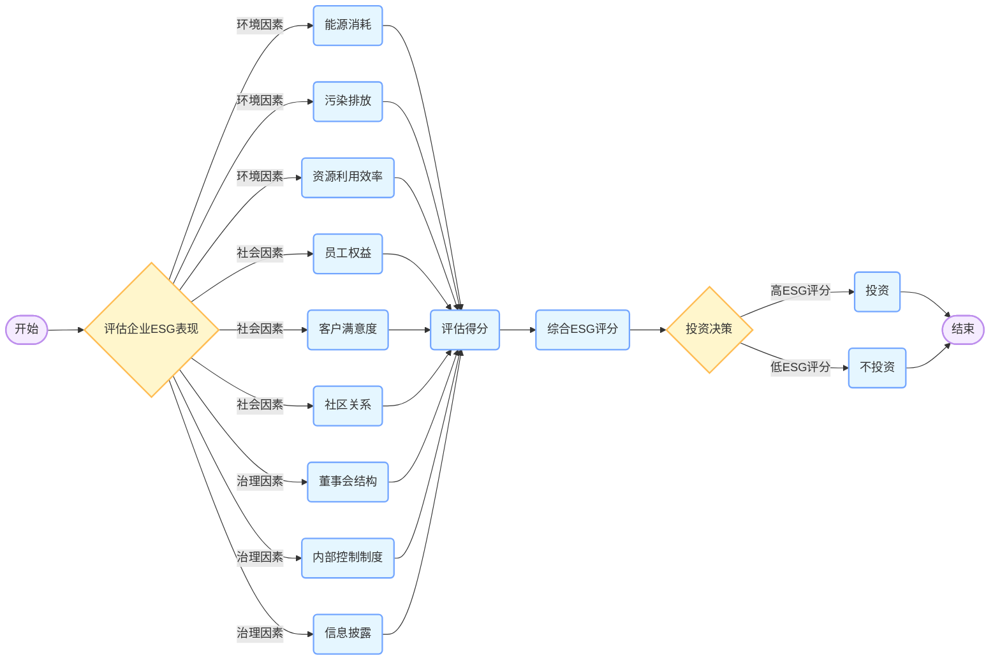

# 可持续投资：ESG因素在当前市场中的重要性

> 关键词：可持续投资、ESG因素、市场重要性、企业责任、投资决策

> 摘要：本文深入探讨了可持续投资中ESG（环境、社会和治理）因素在当前市场中的重要性。首先介绍了相关背景，包括目的范围、预期读者等内容。接着阐述了ESG的核心概念与联系，通过原理和架构的文本示意图以及Mermaid流程图进行清晰展示。详细讲解了与ESG相关的核心算法原理及具体操作步骤，结合数学模型和公式进行深入分析并举例说明。通过项目实战案例，从开发环境搭建到源代码实现与解读，全面呈现ESG因素在实际中的应用。探讨了ESG因素的实际应用场景，推荐了相关的学习资源、开发工具框架以及论文著作。最后总结了ESG未来发展趋势与挑战，并给出常见问题解答和扩展阅读参考资料，旨在帮助读者全面了解ESG因素在可持续投资及当前市场中的关键作用。

## 1. 背景介绍 
### 1.1 目的和范围
在当今全球经济格局不断演变的背景下，可持续发展已成为各界关注的焦点。可持续投资作为一种将经济利益与社会、环境责任相结合的投资理念，正逐渐成为市场的主流趋势。ESG因素作为可持续投资的核心考量，涵盖了环境（Environmental）、社会（Social）和治理（Governance）三个维度，对于评估企业的长期价值和风险具有至关重要的意义。本文的目的在于全面深入地探讨ESG因素在当前市场中的重要性，分析其对投资决策、企业发展以及市场整体运行的影响。范围包括对ESG概念的详细解读、相关理论和实践的研究、实际应用案例的分析以及未来发展趋势的展望。

### 1.2 预期读者
本文预期读者包括各类投资者，如个人投资者、机构投资者等，他们希望通过了解ESG因素来优化投资组合，降低投资风险，获取长期稳定的回报；企业管理者和决策者，他们需要认识到ESG因素对企业战略规划、品牌形象和竞争力的影响，以便更好地制定企业发展策略；学术界研究人员，他们关注可持续发展领域的理论和实践进展，希望从本文中获取相关研究的新思路和新方法；以及对可持续投资和ESG因素感兴趣的普通读者，他们希望通过阅读本文增加对这一新兴领域的了解。

### 1.3 文档结构概述
本文共分为十个部分。第一部分为背景介绍，阐述了文章的目的、范围、预期读者以及文档结构概述和术语表。第二部分介绍核心概念与联系，通过文本示意图和Mermaid流程图展示ESG的原理和架构。第三部分讲解核心算法原理和具体操作步骤，结合Python源代码进行详细阐述。第四部分分析数学模型和公式，通过举例说明加深理解。第五部分进行项目实战，包括开发环境搭建、源代码实现和代码解读。第六部分探讨实际应用场景。第七部分推荐相关的工具和资源，包括学习资源、开发工具框架和论文著作。第八部分总结未来发展趋势与挑战。第九部分为附录，解答常见问题。第十部分提供扩展阅读和参考资料。

### 1.4 术语表
#### 1.4.1 核心术语定义
- **可持续投资（Sustainable Investment）**：是一种在投资决策过程中综合考虑经济、社会和环境因素，旨在实现长期财务回报与可持续发展目标相统一的投资方式。
- **ESG因素**：ESG是环境（Environmental）、社会（Social）和治理（Governance）的缩写。环境因素涉及企业对自然环境的影响，如碳排放、资源利用效率等；社会因素关注企业与员工、客户、社区等利益相关者的关系，包括劳动权益、产品安全等；治理因素侧重于企业的内部管理和决策机制，如董事会结构、信息披露等。
- **企业社会责任（Corporate Social Responsibility，CSR）**：指企业在创造利润、对股东和员工承担法律责任的同时，还要承担对消费者、社区和环境的责任，其范围与ESG因素有一定的重叠。

#### 1.4.2 相关概念解释
- **环境、社会和治理评级（ESG Ratings）**：是由专业机构根据一定的标准和方法，对企业在环境、社会和治理方面的表现进行评估和打分，为投资者提供参考。
- **绿色金融（Green Finance）**：是指为支持环境改善、应对气候变化和资源节约高效利用的经济活动，即对环保、节能、清洁能源、绿色交通、绿色建筑等领域的项目投融资、项目运营、风险管理等所提供的金融服务。绿色金融与可持续投资和ESG因素密切相关，是实现可持续发展的重要金融手段。

#### 1.4.3 缩略词列表
- **ESG**：环境（Environmental）、社会（Social）和治理（Governance）
- **CSR**：企业社会责任（Corporate Social Responsibility）
- **UNPRI**：联合国责任投资原则组织（United Nations Principles for Responsible Investment）

## 2. 核心概念与联系 
### ESG核心概念原理
ESG因素的核心原理在于全面评估企业的可持续发展能力。从环境维度来看，企业的生产经营活动不可避免地会对自然环境产生影响，如能源消耗、废弃物排放等。关注环境因素有助于企业降低环境风险，提高资源利用效率，实现可持续的生产和发展。例如，一家制造企业通过采用清洁能源、优化生产工艺减少污染排放，不仅可以降低对环境的负面影响，还可能因节省能源成本而提高经济效益。

社会维度主要关注企业与利益相关者的关系。企业的成功离不开员工的努力、客户的支持以及社区的认可。良好的社会表现包括提供安全的工作环境、保障员工权益、生产安全可靠的产品、积极参与社区建设等。例如，一家科技公司注重员工的职业发展和福利，能够吸引和留住优秀人才，提高员工的工作积极性和创造力，从而提升企业的竞争力。

治理维度涉及企业的内部管理和决策机制。有效的治理结构可以确保企业的决策透明、公正，防范内部风险。例如，合理的董事会结构、健全的内部控制制度和信息披露机制可以增强投资者对企业的信任，提高企业的市场价值。

### ESG架构的文本示意图
ESG架构可以用一个三维模型来表示。三个坐标轴分别代表环境（E）、社会（S）和治理（G）。在这个三维空间中，每个企业都可以被定位为一个点，其坐标值取决于企业在三个维度上的表现。例如，一个在环境方面表现优秀（如低碳排放、高资源利用效率）、社会方面表现良好（如员工满意度高、社区关系融洽）、治理方面规范（如董事会独立性强、信息披露及时准确）的企业，将位于三维空间的正半轴方向，代表其具有较高的ESG水平。

### Mermaid流程图

该流程图展示了一个基于ESG因素的投资决策过程。首先对企业的ESG表现进行评估，分别从环境、社会和治理三个维度的多个方面进行考量。然后将各个方面的评估得分汇总得到综合ESG评分。最后根据综合ESG评分进行投资决策，如果评分高则选择投资，评分低则不投资。

## 3. 核心算法原理 & 具体操作步骤 
### 核心算法原理
在评估企业的ESG表现时，可以采用加权平均法。首先为每个ESG指标设定一个权重，权重的大小反映了该指标在整体ESG评估中的重要性。然后对每个指标进行评分，评分范围可以根据具体情况设定，例如0 - 100分。最后将每个指标的得分乘以其对应的权重，再将所有指标的加权得分相加，得到企业的综合ESG评分。

### Python源代码实现
```python
# 定义ESG指标及其权重
esg_metrics = {
    "能源消耗": 0.2,
    "污染排放": 0.2,
    "资源利用效率": 0.2,
    "员工权益": 0.1,
    "客户满意度": 0.1,
    "社区关系": 0.1,
    "董事会结构": 0.05,
    "内部控制制度": 0.05,
    "信息披露": 0.05
}

# 定义企业的ESG指标得分
company_scores = {
    "能源消耗": 80,
    "污染排放": 70,
    "资源利用效率": 85,
    "员工权益": 75,
    "客户满意度": 80,
    "社区关系": 78,
    "董事会结构": 82,
    "内部控制制度": 75,
    "信息披露": 85
}

# 计算综合ESG评分
def calculate_esg_score(metrics, scores):
    total_score = 0
    for metric, weight in metrics.items():
        score = scores.get(metric, 0)
        total_score += score * weight
    return total_score

# 调用函数计算综合ESG评分
esg_score = calculate_esg_score(esg_metrics, company_scores)
print(f"企业的综合ESG评分为: {esg_score}")
```
### 具体操作步骤
1. **确定ESG指标及其权重**：根据行业特点、投资目标等因素，确定适合的ESG指标，并为每个指标分配合理的权重。例如，对于能源行业，能源消耗和污染排放等环境指标的权重可能相对较高；对于服务行业，客户满意度和员工权益等社会指标的权重可能更为重要。
2. **收集企业的ESG数据**：通过企业的年报、可持续发展报告、公开信息等渠道，收集企业在各个ESG指标上的数据。对于一些难以直接获取的数据，可以采用问卷调查、实地调研等方式进行补充。
3. **对企业的ESG指标进行评分**：根据收集到的数据，按照预先设定的评分标准对每个ESG指标进行评分。评分标准可以是定性与定量相结合的，例如对于能源消耗指标，可以根据企业的能源消耗强度与行业平均水平进行比较，给予相应的分数。
4. **计算综合ESG评分**：使用加权平均法，将每个指标的得分乘以其对应的权重，再将所有指标的加权得分相加，得到企业的综合ESG评分。
5. **根据综合ESG评分进行决策**：根据投资策略和风险偏好，设定一个ESG评分阈值。如果企业的综合ESG评分高于阈值，则可以考虑投资；如果低于阈值，则可能需要谨慎考虑或放弃投资。

## 4. 数学模型和公式 & 详细讲解 & 举例说明 
### 数学模型和公式
设企业的ESG指标有 $n$ 个，分别为 $x_1, x_2, \cdots, x_n$，对应的权重为 $w_1, w_2, \cdots, w_n$，且 $\sum_{i = 1}^{n} w_i = 1$。每个指标的得分分别为 $s_1, s_2, \cdots, s_n$。则企业的综合ESG评分 $S$ 可以用以下公式计算：

$$S = \sum_{i = 1}^{n} w_i s_i$$

### 详细讲解
这个公式的原理是加权平均法。权重 $w_i$ 表示每个指标在整体ESG评估中的重要性，得分 $s_i$ 反映了企业在该指标上的表现。通过将每个指标的得分乘以其对应的权重，再将所有指标的加权得分相加，就可以得到一个综合的评分，该评分综合考虑了企业在各个ESG指标上的表现。

### 举例说明
假设我们有三个ESG指标：环境（$x_1$）、社会（$x_2$）和治理（$x_3$），对应的权重分别为 $w_1 = 0.4$，$w_2 = 0.3$，$w_3 = 0.3$。企业在这三个指标上的得分分别为 $s_1 = 80$，$s_2 = 75$，$s_3 = 85$。则企业的综合ESG评分 $S$ 为：

$$S = w_1 s_1 + w_2 s_2 + w_3 s_3 = 0.4\times80 + 0.3\times75 + 0.3\times85$$
$$= 32 + 22.5 + 25.5 = 80$$

这意味着该企业的综合ESG评分为80分，根据设定的评分标准，可以对该企业的ESG表现进行评估和决策。

## 5. 项目实战：代码实际案例和详细解释说明 
### 5.1  开发环境搭建
1. **安装Python**：首先需要安装Python解释器。可以从Python官方网站（https://www.python.org/downloads/）下载适合自己操作系统的Python版本，并按照安装向导进行安装。
2. **安装开发工具**：推荐使用PyCharm作为开发工具。PyCharm是一款功能强大的Python集成开发环境（IDE），可以从JetBrains官方网站（https://www.jetbrains.com/pycharm/download/）下载并安装。
3. **创建虚拟环境（可选）**：为了避免不同项目之间的依赖冲突，建议创建虚拟环境。可以使用Python自带的`venv`模块来创建虚拟环境。在命令行中执行以下命令：
```bash
python -m venv myenv
```
其中`myenv`是虚拟环境的名称。激活虚拟环境：
- 在Windows上：
```bash
myenv\Scripts\activate
```
- 在Linux或Mac上：
```bash
source myenv/bin/activate
```

### 5.2  源代码详细实现和代码解读
```python
# 定义ESG指标及其权重
esg_metrics = {
    "能源消耗": 0.2,
    "污染排放": 0.2,
    "资源利用效率": 0.2,
    "员工权益": 0.1,
    "客户满意度": 0.1,
    "社区关系": 0.1,
    "董事会结构": 0.05,
    "内部控制制度": 0.05,
    "信息披露": 0.05
}

# 定义企业的ESG指标得分
company_scores = {
    "能源消耗": 80,
    "污染排放": 70,
    "资源利用效率": 85,
    "员工权益": 75,
    "客户满意度": 80,
    "社区关系": 78,
    "董事会结构": 82,
    "内部控制制度": 75,
    "信息披露": 85
}

# 计算综合ESG评分
def calculate_esg_score(metrics, scores):
    total_score = 0
    for metric, weight in metrics.items():
        score = scores.get(metric, 0)
        total_score += score * weight
    return total_score

# 调用函数计算综合ESG评分
esg_score = calculate_esg_score(esg_metrics, company_scores)
print(f"企业的综合ESG评分为: {esg_score}")
```
### 代码解读与分析
1. **ESG指标及其权重的定义**：`esg_metrics` 字典定义了ESG指标及其对应的权重。权重的分配反映了每个指标在整体ESG评估中的重要性。
2. **企业的ESG指标得分的定义**：`company_scores` 字典定义了企业在各个ESG指标上的得分。这些得分可以通过实际的数据收集和评估得到。
3. **计算综合ESG评分的函数**：`calculate_esg_score` 函数接受两个参数：`metrics` 表示ESG指标及其权重的字典，`scores` 表示企业的ESG指标得分的字典。函数通过遍历 `metrics` 字典，获取每个指标的权重和得分，将得分乘以权重并累加到 `total_score` 中，最后返回综合ESG评分。
4. **调用函数计算综合ESG评分并输出结果**：调用 `calculate_esg_score` 函数计算企业的综合ESG评分，并使用 `print` 函数输出结果。

通过这个代码案例，我们可以看到如何使用Python实现一个简单的ESG评分计算系统。在实际应用中，可以根据需要扩展该系统，例如从数据库中读取企业的ESG数据、将评分结果保存到文件或数据库中等。

## 6