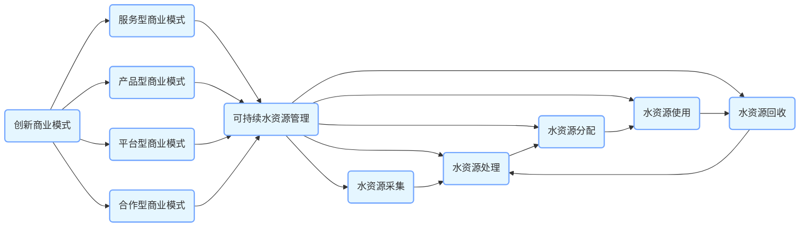

# 可持续水资源管理的创新商业模式研究

> 关键词：可持续水资源管理、创新商业模式、水资源经济、循环利用、数字化技术

> 摘要：本文聚焦于可持续水资源管理的创新商业模式研究。在全球水资源日益紧张的背景下，传统水资源管理模式面临诸多挑战，创新商业模式的探索具有重要的现实意义。文章首先介绍了研究的背景、目的、预期读者等基本信息，接着阐述了可持续水资源管理及相关创新商业模式的核心概念与联系，深入剖析了核心算法原理和操作步骤，通过数学模型和公式进行量化分析。以实际项目为例，详细讲解了开发环境搭建、源代码实现及解读。探讨了创新商业模式在不同场景的实际应用，推荐了相关学习资源、开发工具和论文著作。最后总结了未来发展趋势与挑战，并对常见问题进行了解答，为可持续水资源管理领域的发展提供了全面且深入的参考。

## 1. 背景介绍 
### 1.1 目的和范围
随着全球人口的增长、经济的发展以及气候变化的影响，水资源短缺和水污染问题日益严峻。传统的水资源管理模式主要侧重于供水和污水处理等基本功能，难以满足可持续发展的需求。本研究的目的在于探索可持续水资源管理的创新商业模式，旨在提高水资源利用效率、降低环境污染、促进水资源的循环利用，同时实现经济价值和社会价值的双赢。

研究范围涵盖了水资源管理的各个环节，包括水资源的采集、处理、分配、使用和回收等。不仅关注城市和工业用水，也涉及农业用水和生态用水。通过对不同地区、不同行业的案例分析，总结出具有普适性和可操作性的创新商业模式。

### 1.2 预期读者
本文的预期读者包括水资源管理领域的专业人士，如水利工程师、环境科学家、水资源规划者等，他们可以从文章中获取创新商业模式的思路和方法，应用于实际项目中。同时，也适合对可持续发展和商业创新感兴趣的企业家、投资者和政策制定者，为他们在水资源领域的投资和决策提供参考。此外，高校相关专业的师生也可以将本文作为学习和研究的资料。

### 1.3 文档结构概述
本文共分为十个部分。第一部分为背景介绍，阐述了研究的目的、范围、预期读者和文档结构概述，并给出了相关术语的定义和解释。第二部分介绍了可持续水资源管理和创新商业模式的核心概念与联系，通过文本示意图和 Mermaid 流程图进行直观展示。第三部分详细讲解了核心算法原理和具体操作步骤，结合 Python 源代码进行说明。第四部分运用数学模型和公式对创新商业模式进行量化分析，并举例说明。第五部分通过实际项目案例，介绍了开发环境搭建、源代码实现和代码解读。第六部分探讨了创新商业模式在不同场景的实际应用。第七部分推荐了学习资源、开发工具和相关论文著作。第八部分总结了未来发展趋势与挑战。第九部分为附录，解答了常见问题。第十部分提供了扩展阅读和参考资料。

### 1.4 术语表
#### 1.4.1 核心术语定义
- **可持续水资源管理**：是指在满足当代人用水需求的同时，不损害后代人满足其用水需求的能力，通过合理规划、高效利用和有效保护水资源，实现水资源的长期稳定供应和生态环境的可持续发展。
- **创新商业模式**：是指在水资源管理领域，通过引入新的技术、理念和运营方式，创造出具有独特价值主张、盈利模式和客户群体的商业运作模式，以提高水资源管理的效率和效益。
- **水资源循环利用**：是指将使用后的水资源经过处理，重新回用到生产、生活或生态系统中，减少对新鲜水资源的开采和使用，实现水资源的高效利用和可持续发展。
- **数字化水资源管理**：是指利用信息技术，如物联网、大数据、人工智能等，对水资源的采集、处理、分配和使用等过程进行实时监测、分析和优化，提高水资源管理的智能化水平。

#### 1.4.2 相关概念解释
- **水资源经济**：是研究水资源的经济价值、水资源的配置和利用效率、水资源管理的成本和效益等问题的学科，为创新商业模式的设计提供经济理论支持。
- **生态补偿机制**：是指通过经济手段，对因保护水资源生态环境而付出代价的地区或群体给予补偿，以促进水资源的可持续利用和生态环境的保护。
- **合同节水管理**：是指节水服务企业与用水户以合同形式，为用水户提供节水改造和管理等服务，并以节水效益分享等方式收回投资、获取收益的一种市场化节水服务模式。

#### 1.4.3 缩略词列表
- **IoT**：Internet of Things，物联网
- **AI**：Artificial Intelligence，人工智能
- **GIS**：Geographic Information System，地理信息系统
- **BOT**：Build - Operate - Transfer，建设 - 运营 - 移交
- **PPP**：Public - Private Partnership，公私合营

## 2. 核心概念与联系 
### 核心概念原理
可持续水资源管理的核心原理是实现水资源的供需平衡和生态环境的协调发展。创新商业模式则是在这个基础上，通过引入市场机制和创新思维，提高水资源管理的效率和效益。

可持续水资源管理强调水资源的合理规划和高效利用。这包括优化水资源的配置，提高水资源的利用效率，减少水资源的浪费和损失。例如，通过推广节水技术和设备，实现水资源的循环利用，降低对新鲜水资源的依赖。

创新商业模式的原理是创造新的价值主张和盈利模式。在水资源管理领域，创新商业模式可以通过提供多样化的服务，如水资源监测、节水咨询、污水处理等，满足不同客户的需求。同时，通过引入新技术和新理念，降低运营成本，提高服务质量，实现商业价值的最大化。

### 架构的文本示意图
```plaintext
可持续水资源管理
├── 水资源采集
│   ├── 地表水采集
│   ├── 地下水采集
│   └── 雨水收集
├── 水资源处理
│   ├── 饮用水处理
│   ├── 污水处理
│   └── 中水回用处理
├── 水资源分配
│   ├── 城市供水
│   ├── 工业供水
│   └── 农业供水
├── 水资源使用
│   ├── 生活用水
│   ├── 工业生产用水
│   └── 农业灌溉用水
└── 水资源回收
    ├── 污水处理后回用
    └── 雨水收集利用

创新商业模式
├── 服务型商业模式
│   ├── 水资源监测服务
│   ├── 节水咨询服务
│   └── 污水处理运营服务
├── 产品型商业模式
│   ├── 节水设备销售
│   ├── 水处理药剂销售
│   └── 智能水表销售
├── 平台型商业模式
│   ├── 水资源交易平台
│   ├── 节水服务平台
│   └── 污水处理信息平台
└── 合作型商业模式
    ├── 公私合营（PPP）
    ├── 合同节水管理
    └── 生态补偿机制
```

### Mermaid 流程图


从流程图可以看出，可持续水资源管理的各个环节相互关联，形成一个闭环系统。创新商业模式则为可持续水资源管理提供了不同的实现途径，通过服务、产品、平台和合作等方式，促进可持续水资源管理的发展。

## 3. 核心算法原理 & 具体操作步骤 
### 核心算法原理
在可持续水资源管理的创新商业模式中，涉及到多个核心算法，如水资源需求预测算法、水资源优化配置算法和污水处理成本核算算法等。下面以水资源需求预测算法为例进行详细讲解。

水资源需求预测是水资源管理的重要环节，准确的需求预测可以为水资源的合理配置和规划提供依据。常见的水资源需求预测方法有时间序列分析、回归分析和人工神经网络等。这里我们采用人工神经网络中的多层感知器（Multilayer Perceptron，MLP）进行水资源需求预测。

多层感知器是一种前馈人工神经网络，由输入层、隐藏层和输出层组成。输入层接收原始数据，隐藏层对输入数据进行非线性变换，输出层输出预测结果。MLP 通过反向传播算法进行训练，调整神经元之间的权重和偏置，使得预测结果与实际值之间的误差最小。

### Python 源代码实现
```python
import numpy as np
import pandas as pd
from sklearn.neural_network import MLPRegressor
from sklearn.preprocessing import StandardScaler
from sklearn.model_selection import train_test_split
from sklearn.metrics import mean_squared_error

# 读取数据
data = pd.read_csv('water_demand_data.csv')

# 提取特征和目标变量
X = data.drop('water_demand', axis=1).values
y = data['water_demand'].values

# 数据标准化
scaler = StandardScaler()
X_scaled = scaler.fit_transform(X)

# 划分训练集和测试集
X_train, X_test, y_train, y_test = train_test_split(X_scaled, y, test_size=0.2, random_state=42)

# 创建多层感知器模型
mlp = MLPRegressor(hidden_layer_sizes=(10, 10), activation='relu', solver='adam', max_iter=1000, random_state=42)

# 训练模型
mlp.fit(X_train, y_train)

# 预测
y_pred = mlp.predict(X_test)

# 计算均方误差
mse = mean_squared_error(y_test, y_pred)
print(f"均方误差: {mse}")
```

### 具体操作步骤
1. **数据准备**：收集与水资源需求相关的数据，如人口数量、经济发展水平、气候条件等，并将其整理成 CSV 文件。
2. **数据预处理**：使用 `pandas` 库读取数据，提取特征和目标变量。对特征数据进行标准化处理，以提高模型的训练效果。
3. **模型创建**：使用 `sklearn` 库中的 `MLPRegressor` 类创建多层感知器模型，并设置模型的参数，如隐藏层大小、激活函数、求解器等。
4. **模型训练**：将训练集数据输入模型进行训练，使用反向传播算法调整模型的权重和偏置。
5. **模型预测**：使用训练好的模型对测试集数据进行预测，得到水资源需求的预测结果。
6. **模型评估**：计算预测结果与实际值之间的均方误差，评估模型的性能。

## 4. 数学模型和公式 & 详细讲解 & 举例说明 
### 水资源需求预测的数学模型
在使用多层感知器进行水资源需求预测时，数学模型可以表示为：

$$
\hat{y} = f(W^{(L)} \cdot f(W^{(L - 1)} \cdot \cdots f(W^{(1)} \cdot x + b^{(1)}) \cdots + b^{(L - 1)}) + b^{(L)})
$$

其中：
- $\hat{y}$ 是预测的水资源需求量。
- $x$ 是输入的特征向量，包含人口数量、经济发展水平、气候条件等信息。
- $W^{(l)}$ 是第 $l$ 层的权重矩阵。
- $b^{(l)}$ 是第 $l$ 层的偏置向量。
- $f$ 是激活函数，常用的激活函数有 Sigmoid 函数、ReLU 函数等。
- $L$ 是神经网络的层数。

### 反向传播算法的公式
反向传播算法是多层感知器训练的核心算法，其目的是最小化预测结果与实际值之间的误差。误差函数通常采用均方误差：

$$
E = \frac{1}{2N} \sum_{i = 1}^{N} (\hat{y}_i - y_i)^2
$$

其中：
- $N$ 是样本数量。
- $\hat{y}_i$ 是第 $i$ 个样本的预测值。
- $y_i$ 是第 $i$ 个样本的实际值。

为了最小化误差函数 $E$，需要对权重矩阵 $W^{(l)}$ 和偏置向量 $b^{(l)}$ 进行更新。更新公式如下：

$$
W^{(l)} = W^{(l)} - \eta \frac{\partial E}{\partial W^{(l)}}
$$

$$
b^{(l)} = b^{(l)} - \eta \frac{\partial E}{\partial b^{(l)}}
$$

其中：
- $\eta$ 是学习率，控制每次更新的步长。

### 举例说明
假设我们有一个包含 100 个样本的数据集，每个样本有 3 个特征（人口数量、GDP、降水量）和 1 个目标变量（水资源需求量）。我们使用上述的多层感知器模型进行训练和预测。

在训练过程中，模型会不断调整权重矩阵和偏置向量，使得均方误差逐渐减小。训练完成后，我们可以使用训练好的模型对新的样本进行预测。例如，给定一个新的样本，其人口数量为 100 万，GDP 为 500 亿元，降水量为 500 毫米，模型可以预测出该地区的水资源需求量。

## 5. 项目实战：代码实际案例和详细解释说明 
### 5.1  开发环境搭建
#### 操作系统
本项目可以在 Windows、Linux 或 macOS 操作系统上进行开发。建议使用 Linux 系统，如 Ubuntu，因为它具有良好的开源软件支持和稳定性。

#### 编程语言和开发工具
- **Python**：作为主要的编程语言，建议使用 Python 3.7 及以上版本。
- **Anaconda**：是一个开源的 Python 发行版本，包含了许多科学计算和数据分析所需的库和工具。可以从 Anaconda 官方网站下载并安装。
- **Jupyter Notebook**：是一个基于 Web 的交互式计算环境，方便进行代码编写、调试和文档编写。安装 Anaconda 后，Jupyter Notebook 会自动安装。

#### 所需库的安装
在命令行中使用以下命令安装所需的库：
```sh
pip install pandas numpy scikit-learn
```

### 5.2  源代码详细实现和代码解读
```python
import numpy as np
import pandas as pd
from sklearn.neural_network import MLPRegressor
from sklearn.preprocessing import StandardScaler
from sklearn.model_selection import train_test_split
from sklearn.metrics import mean_squared_error

# 读取数据
data = pd.read_csv('water_demand_data.csv')

# 代码解读：使用 pandas 库的 read_csv 函数读取存储在 CSV 文件中的水资源需求数据。

# 提取特征和目标变量
X = data.drop('water_demand', axis=1).values
y = data['water_demand'].values

# 代码解读：使用 drop 方法从数据集中删除目标变量 'water_demand'，得到特征矩阵 X。同时，提取目标变量 y。

# 数据标准化
scaler = StandardScaler()
X_scaled = scaler.fit_transform(X)

# 代码解读：使用 StandardScaler 类对特征矩阵 X 进行标准化处理，使得每个特征的均值为 0，标准差为 1。这有助于提高模型的训练效果。

# 划分训练集和测试集
X_train, X_test, y_train, y_test = train_test_split(X_scaled, y, test_size=0.2, random_state=42)

# 代码解读：使用 train_test_split 函数将数据集划分为训练集和测试集，其中测试集占总数据集的 20%。random_state 参数用于保证每次划分的结果一致。

# 创建多层感知器模型
mlp = MLPRegressor(hidden_layer_sizes=(10, 10), activation='relu', solver='adam', max_iter=1000, random_state=42)

# 代码解读：使用 MLPRegressor 类创建多层感知器模型，设置隐藏层大小为 (10, 10)，表示有两个隐藏层，每个隐藏层有 10 个神经元。激活函数使用 ReLU 函数，求解器使用 Adam 优化器，最大迭代次数为 1000。

# 训练模型
mlp.fit(X_train, y_train)

# 代码解读：使用 fit 方法对模型进行训练，将训练集数据输入模型，调整模型的权重和偏置。

# 预测
y_pred = mlp.predict(X_test)

# 代码解读：使用 predict 方法对测试集数据进行预测，得到预测结果 y_pred。

# 计算均方误差
mse = mean_squared_error(y_test, y_pred)
print(f"均方误差: {mse}")

# 代码解读：使用 mean_squared_error 函数计算预测结果与实际值之间的均方误差，并将结果打印输出。
```

### 5.3  代码解读与分析
通过上述代码，我们实现了一个基于多层感知器的水资源需求预测模型。代码的主要步骤包括数据读取、数据预处理、模型创建、模型训练、模型预测和模型评估。

在数据预处理阶段，我们对特征数据进行了标准化处理，这有助于提高模型的训练效果。在模型创建阶段，我们设置了隐藏层大小、激活函数和求解器等参数，这些参数的选择会影响模型的性能。在模型训练阶段，模型通过反向传播算法不断调整权重和偏置，使得预测结果与实际值之间的误差最小。在模型评估阶段，我们使用均方误差作为评估指标，评估模型的性能。

通过对代码的解读和分析，我们可以了解到如何使用 Python 和 `sklearn` 库实现一个简单的机器学习模型，并对模型进行训练和评估。

## 6. 实际应用场景 
### 城市供水管理
在城市供水管理中，创新商业模式可以发挥重要作用。例如，通过建立水资源交易平台，实现城市之间、企业之间的水资源优化配置。供水企业可以根据水资源需求预测结果，合理安排供水计划，提高供水效率。同时，通过推广合同节水管理模式，鼓励用水户采取节水措施，降低用水量，减少供水成本。

### 工业用水管理
工业是用水大户，工业用水管理的创新商业模式具有巨大的潜力。工业企业可以采用水资源循环利用技术，将生产过程中的废水处理后回用，减少对新鲜水资源的依赖。同时，节水服务企业可以为工业企业提供节水咨询、设备改造等服务，通过节水效益分享的方式获取收益。此外，数字化水资源管理技术可以实时监测工业企业的用水情况，为企业提供用水优化建议，提高水资源利用效率。

### 农业灌溉管理
农业灌溉用水占总用水量的很大比例，创新商业模式在农业灌溉管理中的应用可以有效提高水资源利用效率。例如，通过建立农业用水合作社，实现水资源的统一管理和分配。合作社可以采用精准灌溉技术，根据土壤湿度、作物需水量等因素，精确控制灌溉水量，减少水资源浪费。同时，政府可以通过生态补偿机制，对采用节水灌溉技术的农民给予补贴，鼓励农民节约用水。

### 污水处理与回用
污水处理与回用是可持续水资源管理的重要环节。创新商业模式可以促进污水处理行业的发展。例如，采用 BOT 模式建设污水处理厂，由企业负责污水处理厂的建设、运营和维护，在一定期限后将污水处理厂移交给政府。污水处理企业可以通过销售再生水、处理污泥等方式获取收益。此外，数字化污水处理技术可以实时监测污水处理过程，提高污水处理效率和水质。

## 7. 工具和资源推荐
### 7.1 学习资源推荐
#### 7.1.1 书籍推荐
- 《水资源经济学》：系统介绍了水资源的经济价值、水资源的配置和利用效率等方面的知识，为可持续水资源管理的创新商业模式提供了经济理论基础。
- 《人工智能与机器学习》：介绍了人工智能和机器学习的基本概念、算法和应用，对于理解水资源需求预测等核心算法有很大帮助。
- 《可持续发展概论》：阐述了可持续发展的理念、原则和实践，有助于从宏观层面理解可持续水资源管理的重要性。

#### 7.1.2 在线课程
- Coursera 上的“水资源管理与政策”课程：由知名高校的教授授课，内容涵盖水资源管理的各个方面，包括水资源规划、水资源保护、水资源经济等。
- edX 上的“机器学习基础”课程：提供了机器学习的基础知识和实践经验，适合初学者学习。
- 中国大学 MOOC 上的“环境科学与工程前沿”课程：介绍了环境科学与工程领域的最新研究成果和发展趋势，对于了解可持续水资源管理的前沿技术有很大帮助。

#### 7.1.3 技术博客和网站
- WaterWorld：是一个专注于水资源行业的网站，提供了水资源管理、污水处理、节水技术等方面的新闻、技术文章和案例分析。
- 中国水网：是国内权威的水资源行业媒体，发布了大量关于水资源政策、市场动态、技术创新等方面的信息。
- Towards Data Science：是一个数据科学领域的博客平台，有许多关于机器学习、数据分析的优秀文章，对于学习水资源需求预测等算法有很大帮助。

### 7.2 开发工具框架推荐
#### 7.2.1 IDE和编辑器
- PyCharm：是一款专业的 Python 集成开发环境，提供了代码编辑、调试、版本控制等功能，适合大型 Python 项目的开发。
- Jupyter Notebook：是一个基于 Web 的交互式计算环境，方便进行代码编写、调试和文档编写，适合数据科学和机器学习项目的开发。
- Visual Studio Code：是一款轻量级的代码编辑器，支持多种编程语言，通过安装插件可以扩展其功能，适合快速开发和学习。

#### 7.2.2 调试和性能分析工具
- Py-Spy：是一个 Python 性能分析工具，可以实时监测 Python 程序的性能，找出性能瓶颈。
- pdb：是 Python 内置的调试器，可以在代码中设置断点，逐步执行代码，帮助调试程序。
- TensorBoard：是 TensorFlow 提供的可视化工具，可以用于可视化模型的训练过程、评估指标等，帮助优化模型。

#### 7.2.3 相关框架和库
- scikit-learn：是一个开源的机器学习库，提供了各种机器学习算法和工具，如分类、回归、聚类等，方便进行水资源需求预测等模型的开发。
- TensorFlow：是一个开源的深度学习框架，广泛应用于图像识别、自然语言处理等领域，也可以用于水资源管理中的复杂模型开发。
- Pandas：是一个开源的数据分析库，提供了数据结构和数据分析工具，方便进行数据处理和分析。

### 7.3 相关论文著作推荐
#### 7.3.1 经典论文
- “The Economics of Water Resources Management”：探讨了水资源管理的经济原理和方法，为水资源管理的创新商业模式提供了理论支持。
- “Artificial Neural Networks for Water Demand Forecasting”：介绍了人工神经网络在水资源需求预测中的应用，是该领域的经典论文。
- “Sustainable Water Management: A Review of Concepts and Practices”：对可持续水资源管理的概念和实践进行了全面的综述，为研究可持续水资源管理提供了重要的参考。

#### 7.3.2 最新研究成果
- 近年来，随着物联网、大数据、人工智能等技术的发展，相关领域的研究成果不断涌现。可以通过学术数据库，如 IEEE Xplore、ACM Digital Library、ScienceDirect 等，搜索最新的研究论文，了解可持续水资源管理的最新技术和方法。

#### 7.3.3 应用案例分析
- 许多国际组织和研究机构发布了可持续水资源管理的应用案例分析报告，如世界银行的《Water Resources Management in Developing Countries》、联合国环境规划署的《Sustainable Water Management in Urban Areas》等。这些报告通过实际案例，介绍了创新商业模式在不同地区和行业的应用经验和效果。

## 8. 总结：未来发展趋势与挑战
### 未来发展趋势
- **数字化和智能化**：随着物联网、大数据、人工智能等技术的不断发展，可持续水资源管理将朝着数字化和智能化的方向发展。通过实时监测、数据分析和智能决策，提高水资源管理的效率和精度。
- **循环经济模式**：水资源循环利用将成为未来的发展趋势。通过建立水资源循环利用体系，实现水资源的高效利用和可持续发展。例如，将污水处理后回用、雨水收集利用等。
- **跨界融合**：可持续水资源管理将与能源、农业、城市规划等领域进行跨界融合。例如，发展水能源一体化项目，实现水资源和能源的协同管理；将水资源管理纳入城市总体规划，实现城市的可持续发展。
- **国际合作**：水资源是全球性的问题，需要国际社会的共同合作。未来，各国将加强在水资源管理领域的合作，分享技术和经验，共同应对水资源短缺和水污染等挑战。

### 挑战
- **技术创新挑战**：虽然数字化和智能化技术为可持续水资源管理带来了机遇，但也面临着技术创新的挑战。例如，如何提高水资源监测设备的精度和可靠性，如何开发更高效的水资源处理技术等。
- **资金投入挑战**：可持续水资源管理需要大量的资金投入，包括基础设施建设、技术研发、人才培养等方面。如何吸引社会资本参与水资源管理，解决资金短缺问题，是一个亟待解决的挑战。
- **政策法规挑战**：目前，我国的水资源管理政策法规还不够完善，存在一些政策空白和制度缺陷。如何制定更加科学合理的政策法规，引导和规范水资源管理市场，是推动可持续水资源管理发展的关键。
- **公众意识挑战**：公众的水资源保护意识和节水意识还不够强，对可持续水资源管理的认识和支持不足。如何加强公众教育，提高公众的水资源保护意识和节水意识，是可持续水资源管理面临的重要挑战。

## 9. 附录：常见问题与解答
### 问题 1：创新商业模式在可持续水资源管理中的作用是什么？
解答：创新商业模式可以为可持续水资源管理提供经济动力和技术支持。通过引入市场机制和创新思维，创造新的价值主张和盈利模式，吸引社会资本参与水资源管理，提高水资源管理的效率和效益。同时，创新商业模式可以推动水资源管理技术的创新和应用，促进水资源的循环利用和可持续发展。

### 问题 2：如何选择适合的水资源需求预测算法？
解答：选择适合的水资源需求预测算法需要考虑多个因素，如数据特点、预测精度要求、计算复杂度等。常见的水资源需求预测算法有时间序列分析、回归分析、人工神经网络等。如果数据具有明显的时间序列特征，可以选择时间序列分析算法；如果数据之间存在线性关系，可以选择回归分析算法；如果数据复杂且非线性程度较高，可以选择人工神经网络算法。

### 问题 3：可持续水资源管理的创新商业模式在实际应用中面临哪些困难？
解答：可持续水资源管理的创新商业模式在实际应用中面临着多种困难。一是技术难题，部分创新技术在实际应用中可能存在稳定性和可靠性问题，需要进一步研发和改进。二是资金短缺，创新商业模式的实施需要大量的资金投入，而社会资本对水资源管理领域的投资意愿可能不足。三是政策法规不完善，现有政策法规可能无法适应创新商业模式的发展，需要进一步完善和调整。四是公众接受度低，公众对创新商业模式的认识和理解不足，可能对其实施造成阻碍。

### 问题 4：如何评估创新商业模式在可持续水资源管理中的效果？
解答：评估创新商业模式在可持续水资源管理中的效果可以从多个方面进行。一是经济效益，评估商业模式的盈利能力、成本控制能力和投资回报率等。二是环境效益，评估水资源的节约量、水污染的减少量和生态环境的改善程度等。三是社会效益，评估对社会就业、居民生活质量和社会稳定的影响等。可以综合使用定量和定性的方法，建立科学合理的评估指标体系，对创新商业模式的效果进行全面、客观的评估。

## 10. 扩展阅读 & 参考资料
### 扩展阅读
- 《水资源保护与可持续利用》：深入探讨了水资源保护的技术和方法，以及如何实现水资源的可持续利用。
- 《智能城市中的水资源管理》：介绍了智能城市理念下水资源管理的创新模式和技术应用。
- 《循环经济与水资源管理》：阐述了循环经济理论在水资源管理中的应用，以及如何构建水资源循环利用体系。

### 参考资料
- 世界银行. 《Water Resources Management in Developing Countries》
- 联合国环境规划署. 《Sustainable Water Management in Urban Areas》
- 相关学术期刊，如《Water Resources Research》、《Journal of Hydrology》、《Environmental Science & Technology》等

作者：AI天才研究院/AI Genius Institute & 禅与计算机程序设计艺术 /Zen And The Art of Computer Programming