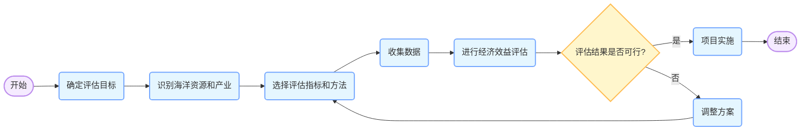

# 可持续海洋资源开发的经济效益评估

> 关键词：可持续海洋资源开发、经济效益评估、海洋经济、资源评估模型、海洋产业

> 摘要：本文聚焦于可持续海洋资源开发的经济效益评估，旨在深入剖析这一复杂领域的核心原理、评估方法及实际应用。通过对相关概念的详细阐述、核心算法原理的讲解、数学模型的构建以及项目实战案例的分析，全面展示了如何科学、准确地评估可持续海洋资源开发所带来的经济效益。同时，探讨了其在不同实际应用场景中的作用，推荐了相关的学习资源、开发工具和研究论文，最后对未来发展趋势与挑战进行了总结，并解答了常见问题，为从事海洋资源开发和经济评估的专业人士提供了全面且深入的参考。

## 1. 背景介绍 
### 1.1 目的和范围
随着全球对海洋资源的关注度不断提高，可持续海洋资源开发成为了当今海洋领域的重要议题。本研究的目的在于建立一套科学、合理、全面的经济效益评估体系，用于评估可持续海洋资源开发项目的经济可行性和效益水平。研究范围涵盖了各类海洋资源，包括渔业资源、海洋矿产资源、海洋能源资源等，以及与之相关的海洋产业，如海洋渔业、海洋矿业、海洋能源产业等。

### 1.2 预期读者
本文预期读者包括海洋资源开发领域的投资者、开发者、政策制定者、科研人员以及对海洋经济和可持续发展感兴趣的人士。对于投资者和开发者，本文可以帮助他们评估项目的经济效益，做出明智的投资决策；对于政策制定者，本文可以为制定相关政策提供科学依据；对于科研人员，本文可以为他们的研究提供参考和思路；对于普通读者，本文可以帮助他们了解可持续海洋资源开发的经济效益评估的基本原理和方法。

### 1.3 文档结构概述
本文共分为十个部分。第一部分为背景介绍，阐述了研究的目的、范围、预期读者和文档结构概述。第二部分介绍了可持续海洋资源开发和经济效益评估的核心概念及其联系，并给出了相应的文本示意图和 Mermaid 流程图。第三部分详细讲解了核心算法原理和具体操作步骤，并用 Python 源代码进行了阐述。第四部分介绍了相关的数学模型和公式，并进行了详细讲解和举例说明。第五部分通过项目实战，展示了代码的实际案例和详细解释说明。第六部分探讨了可持续海洋资源开发的经济效益评估在实际应用场景中的作用。第七部分推荐了相关的学习资源、开发工具框架和研究论文。第八部分总结了未来发展趋势与挑战。第九部分为附录，解答了常见问题。第十部分提供了扩展阅读和参考资料。

### 1.4 术语表
#### 1.4.1 核心术语定义
- **可持续海洋资源开发**：指在满足当代人对海洋资源需求的同时，不损害后代人满足其自身需求的能力的海洋资源开发方式。它强调资源的合理利用、环境保护和经济社会的协调发展。
- **经济效益评估**：指对项目或活动所产生的经济收益和成本进行分析和评价的过程。通过经济效益评估，可以判断项目或活动是否具有经济可行性和效益水平。
- **海洋资源**：指存在于海洋中的各种自然资源，包括渔业资源、海洋矿产资源、海洋能源资源、海洋生物资源等。
- **海洋产业**：指以海洋资源为开发对象，从事海洋生产、经营和服务活动的产业。包括海洋渔业、海洋矿业、海洋能源产业、海洋交通运输业、海洋旅游业等。

#### 1.4.2 相关概念解释
- **外部性**：指一个经济主体的行为对其他经济主体的福利产生的影响，但这种影响并没有通过市场价格机制反映出来。在海洋资源开发中，外部性可能表现为环境污染、生态破坏等负面外部性，也可能表现为技术溢出、产业带动等正面外部性。
- **贴现率**：指将未来的现金流量折算为现值的比率。在经济效益评估中，贴现率用于考虑资金的时间价值，将未来的收益和成本折算为当前的价值。
- **净现值**：指项目在整个寿命期内的现金流入现值减去现金流出现值后的余额。净现值大于零表示项目具有经济可行性，净现值越大表示项目的经济效益越好。

#### 1.4.3 缩略词列表
- **NPV**：净现值（Net Present Value）
- **IRR**：内部收益率（Internal Rate of Return）
- **BCR**：效益成本比（Benefit - Cost Ratio）

## 2. 核心概念与联系 
### 核心概念原理
可持续海洋资源开发的经济效益评估涉及到多个核心概念，这些概念相互关联，共同构成了评估体系的基础。

可持续海洋资源开发强调资源的可持续利用，即在开发海洋资源的过程中，要充分考虑资源的再生能力和生态环境的承载能力，确保资源的长期稳定供应。经济效益评估则是通过对项目的收益和成本进行量化分析，来判断项目是否具有经济可行性和效益水平。

在评估过程中，需要考虑海洋资源的特性，如资源的稀缺性、不确定性和外部性等。海洋资源的稀缺性意味着资源的开发和利用需要进行合理的规划和分配；不确定性则增加了评估的难度，需要采用适当的方法来处理；外部性则需要在评估中考虑项目对社会和环境的影响。

### 架构的文本示意图
```plaintext
可持续海洋资源开发的经济效益评估
|-- 海洋资源
|   |-- 渔业资源
|   |-- 海洋矿产资源
|   |-- 海洋能源资源
|   |-- 其他资源
|-- 海洋产业
|   |-- 海洋渔业
|   |-- 海洋矿业
|   |-- 海洋能源产业
|   |-- 海洋交通运输业
|   |-- 海洋旅游业
|-- 评估指标
|   |-- 净现值（NPV）
|   |-- 内部收益率（IRR）
|   |-- 效益成本比（BCR）
|   |-- 其他指标
|-- 评估方法
|   |-- 市场价值法
|   |-- 替代成本法
|   |-- 意愿调查法
|   |-- 其他方法
```

### Mermaid 流程图


## 3. 核心算法原理 & 具体操作步骤 
### 核心算法原理
在可持续海洋资源开发的经济效益评估中，常用的算法包括净现值（NPV）、内部收益率（IRR）和效益成本比（BCR）等。

#### 净现值（NPV）
净现值是指项目在整个寿命期内的现金流入现值减去现金流出现值后的余额。其计算公式为：

$$NPV=\sum_{t = 0}^{n}\frac{CF_t}{(1 + r)^t}$$

其中，$CF_t$ 表示第 $t$ 期的净现金流量，$r$ 表示贴现率，$n$ 表示项目的寿命期。

#### 内部收益率（IRR）
内部收益率是指使项目净现值为零的贴现率。其计算公式为：

$$\sum_{t = 0}^{n}\frac{CF_t}{(1 + IRR)^t}=0$$

#### 效益成本比（BCR）
效益成本比是指项目的效益现值与成本现值之比。其计算公式为：

$$BCR=\frac{\sum_{t = 0}^{n}\frac{B_t}{(1 + r)^t}}{\sum_{t = 0}^{n}\frac{C_t}{(1 + r)^t}}$$

其中，$B_t$ 表示第 $t$ 期的效益，$C_t$ 表示第 $t$ 期的成本。

### 具体操作步骤
#### 步骤 1：确定评估目标
明确要评估的可持续海洋资源开发项目的具体目标，例如评估项目的经济可行性、比较不同项目的效益等。

#### 步骤 2：识别海洋资源和产业
确定项目所涉及的海洋资源类型和相关的海洋产业，以便准确计算项目的收益和成本。

#### 步骤 3：选择评估指标和方法
根据评估目标和项目特点，选择合适的评估指标和方法，如净现值、内部收益率、效益成本比等，并确定贴现率。

#### 步骤 4：收集数据
收集与项目相关的数据，包括资源的产量、价格、成本、市场需求等。

#### 步骤 5：进行经济效益评估
根据选择的评估指标和方法，利用收集到的数据进行计算和分析，得出评估结果。

### Python 源代码实现
```python
import numpy as np
from scipy.optimize import fsolve

def npv(cash_flows, discount_rate):
    """
    计算净现值
    :param cash_flows: 净现金流量列表
    :param discount_rate: 贴现率
    :return: 净现值
    """
    periods = len(cash_flows)
    npv_value = 0
    for t in range(periods):
        npv_value += cash_flows[t] / ((1 + discount_rate) ** t)
    return npv_value

def irr(cash_flows):
    """
    计算内部收益率
    :param cash_flows: 净现金流量列表
    :return: 内部收益率
    """
    def npv_irr(r):
        return npv(cash_flows, r)
    # 初始猜测值
    initial_guess = 0.1
    irr_value = fsolve(npv_irr, initial_guess)[0]
    return irr_value

def bcr(benefits, costs, discount_rate):
    """
    计算效益成本比
    :param benefits: 效益列表
    :param costs: 成本列表
    :param discount_rate: 贴现率
    :return: 效益成本比
    """
    pv_benefits = npv(benefits, discount_rate)
    pv_costs = npv(costs, discount_rate)
    return pv_benefits / pv_costs

# 示例数据
cash_flows = [-1000, 300, 400, 500, 600]
benefits = [300, 400, 500, 600]
costs = [1000, 100, 100, 100]
discount_rate = 0.1

# 计算净现值
npv_value = npv(cash_flows, discount_rate)
print(f"净现值: {npv_value}")

# 计算内部收益率
irr_value = irr(cash_flows)
print(f"内部收益率: {irr_value}")

# 计算效益成本比
bcr_value = bcr(benefits, costs, discount_rate)
print(f"效益成本比: {bcr_value}")
```

## 4. 数学模型和公式 & 详细讲解 & 举例说明 
### 净现值（NPV）
#### 公式
$$NPV=\sum_{t = 0}^{n}\frac{CF_t}{(1 + r)^t}$$

#### 详细讲解
净现值的计算原理是将项目在不同时期的净现金流量按照一定的贴现率折算为当前的价值，然后求和。贴现率 $r$ 反映了资金的时间价值和投资的风险程度。如果 $NPV>0$，表示项目的收益现值大于成本现值，项目具有经济可行性；如果 $NPV = 0$，表示项目的收益现值等于成本现值，项目的经济效益刚好达到保本水平；如果 $NPV<0$，表示项目的收益现值小于成本现值，项目不具有经济可行性。

#### 举例说明
假设有一个可持续海洋资源开发项目，初始投资为 1000 万元，预计在未来 4 年内每年的净现金流量分别为 300 万元、400 万元、500 万元和 600 万元，贴现率为 10%。则该项目的净现值为：

$$NPV=-1000+\frac{300}{(1 + 0.1)^1}+\frac{400}{(1 + 0.1)^2}+\frac{500}{(1 + 0.1)^3}+\frac{600}{(1 + 0.1)^4}$$

```python
import numpy as np

cash_flows = [-1000, 300, 400, 500, 600]
discount_rate = 0.1
npv_value = npv(cash_flows, discount_rate)
print(f"净现值: {npv_value}")
```

### 内部收益率（IRR）
#### 公式
$$\sum_{t = 0}^{n}\frac{CF_t}{(1 + IRR)^t}=0$$

#### 详细讲解
内部收益率是指使项目净现值为零的贴现率。它反映了项目的实际盈利能力。如果 $IRR$ 大于项目的基准收益率，说明项目的盈利能力超过了基准水平，项目具有经济可行性；如果 $IRR$ 小于项目的基准收益率，说明项目的盈利能力低于基准水平，项目不具有经济可行性。

#### 举例说明
对于上述可持续海洋资源开发项目，使用 Python 代码计算内部收益率：

```python
irr_value = irr(cash_flows)
print(f"内部收益率: {irr_value}")
```

### 效益成本比（BCR）
#### 公式
$$BCR=\frac{\sum_{t = 0}^{n}\frac{B_t}{(1 + r)^t}}{\sum_{t = 0}^{n}\frac{C_t}{(1 + r)^t}}$$

#### 详细讲解
效益成本比是指项目的效益现值与成本现值之比。如果 $BCR>1$，表示项目的效益现值大于成本现值，项目具有经济可行性；如果 $BCR = 1$，表示项目的效益现值等于成本现值，项目的经济效益刚好达到保本水平；如果 $BCR<1$，表示项目的效益现值小于成本现值，项目不具有经济可行性。

#### 举例说明
假设上述项目的效益分别为 300 万元、400 万元、500 万元和 600 万元，成本分别为 1000 万元、100 万元、100 万元和 100 万元，贴现率为 10%。则该项目的效益成本比为：

```python
benefits = [300, 400, 500, 600]
costs = [1000, 100, 100, 100]
discount_rate = 0.1
bcr_value = bcr(benefits, costs, discount_rate)
print(f"效益成本比: {bcr_value}")
```

## 5. 项目实战：代码实际案例和详细解释说明 
### 5.1  开发环境搭建
#### 操作系统
可以选择 Windows、Linux 或 macOS 等常见的操作系统。

#### Python 安装
从 Python 官方网站（https://www.python.org/downloads/）下载并安装 Python 3.x 版本。

#### 依赖库安装
使用以下命令安装所需的依赖库：
```sh
pip install numpy scipy
```

### 5.2  源代码详细实现和代码解读
```python
import numpy as np
from scipy.optimize import fsolve

def npv(cash_flows, discount_rate):
    """
    计算净现值
    :param cash_flows: 净现金流量列表
    :param discount_rate: 贴现率
    :return: 净现值
    """
    periods = len(cash_flows)
    npv_value = 0
    for t in range(periods):
        npv_value += cash_flows[t] / ((1 + discount_rate) ** t)
    return npv_value

def irr(cash_flows):
    """
    计算内部收益率
    :param cash_flows: 净现金流量列表
    :return: 内部收益率
    """
    def npv_irr(r):
        return npv(cash_flows, r)
    # 初始猜测值
    initial_guess = 0.1
    irr_value = fsolve(npv_irr, initial_guess)[0]
    return irr_value

def bcr(benefits, costs, discount_rate):
    """
    计算效益成本比
    :param benefits: 效益列表
    :param costs: 成本列表
    :param discount_rate: 贴现率
    :return: 效益成本比
    """
    pv_benefits = npv(benefits, discount_rate)
    pv_costs = npv(costs, discount_rate)
    return pv_benefits / pv_costs

# 示例数据
cash_flows = [-1000, 300, 400, 500, 600]
benefits = [300, 400, 500, 600]
costs = [1000, 100, 100, 100]
discount_rate = 0.1

# 计算净现值
npv_value = npv(cash_flows, discount_rate)
print(f"净现值: {npv_value}")

# 计算内部收益率
irr_value = irr(cash_flows)
print(f"内部收益率: {irr_value}")

# 计算效益成本比
bcr_value = bcr(benefits, costs, discount_rate)
print(f"效益成本比: {bcr_value}")
```

#### 代码解读
1. **导入必要的库**：`numpy` 用于数值计算，`scipy.optimize.fsolve` 用于求解方程。
2. **定义净现值函数 `npv`**：该函数接受净现金流量列表和贴现率作为参数，通过循环计算每一期的净现金流量的现值并求和，得到净现值。
3. **定义内部收益率函数 `irr`**：该函数接受净现金流量列表作为参数，定义一个内部函数 `npv_irr` 用于计算净现值，然后使用 `fsolve` 函数求解使净现值为零的贴现率，即内部收益率。
4. **定义效益成本比函数 `bcr`**：该函数接受效益列表、成本列表和贴现率作为参数，分别计算效益现值和成本现值，然后计算效益成本比。
5. **设置示例数据**：定义净现金流量列表、效益列表、成本列表和贴现率。
6. **计算并输出结果**：分别调用 `npv`、`irr` 和 `bcr` 函数计算净现值、内部收益率和效益成本比，并输出结果。

### 5.3  代码解读与分析
通过上述代码，我们可以方便地计算可持续海洋资源开发项目的净现值、内部收益率和效益成本比。在实际应用中，我们可以根据具体项目的数据修改示例数据，得到相应的评估结果。

需要注意的是，内部收益率的计算使用了数值求解方法，可能会受到初始猜测值的影响。在实际应用中，可以根据项目的特点选择合适的初始猜测值，以提高求解的准确性。

## 6. 实际应用场景 
### 海洋渔业资源开发
在海洋渔业资源开发中，经济效益评估可以帮助渔民和渔业企业合理规划捕捞量和养殖规模。通过评估不同捕捞和养殖方案的净现值、内部收益率和效益成本比，可以选择经济效益最优的方案。同时，评估还可以考虑渔业资源的可持续性，避免过度捕捞导致资源枯竭。

### 海洋矿产资源开发
对于海洋矿产资源开发项目，经济效益评估可以帮助投资者判断项目的经济可行性。在项目前期，通过对矿产储量、开采成本、市场价格等因素的分析，计算项目的净现值、内部收益率和效益成本比，决定是否投资该项目。在项目实施过程中，也可以通过动态评估，及时调整开发策略，提高项目的经济效益。

### 海洋能源资源开发
海洋能源资源如潮汐能、波浪能等的开发具有前期投资大、回报周期长的特点。经济效益评估可以帮助政府和企业评估海洋能源项目的经济性。通过考虑能源产量、发电成本、补贴政策等因素，计算项目的经济效益指标，为项目的决策和政策制定提供依据。

### 海洋旅游资源开发
海洋旅游资源开发涉及到旅游设施建设、旅游服务提供等多个方面。经济效益评估可以帮助旅游开发商评估项目的盈利能力。通过分析旅游收入、运营成本、市场需求等因素，计算项目的净现值、内部收益率和效益成本比，确定项目的可行性和开发规模。

## 7. 工具和资源推荐
### 7.1 学习资源推荐
#### 7.1.1 书籍推荐
- 《海洋经济学》：全面介绍了海洋经济的基本理论、方法和应用，包括海洋资源开发、海洋产业发展、海洋经济政策等方面的内容。
- 《项目评估与可行性研究》：详细讲解了项目评估的基本原理、方法和步骤，对于理解可持续海洋资源开发的经济效益评估具有重要的参考价值。
- 《计量经济学》：提供了经济数据的分析和建模方法，有助于进行海洋资源开发项目的经济分析和预测。

#### 7.1.2 在线课程
- Coursera 上的“海洋经济与可持续发展”课程：由知名高校的教授授课，介绍了海洋经济的前沿理论和实践案例。
- edX 上的“项目评估与投资决策”课程：系统讲解了项目评估的方法和工具，包括净现值、内部收益率等指标的计算和应用。

#### 7.1.3 技术博客和网站
- 海洋经济研究网：提供了海洋经济领域的最新研究成果、政策动态和行业资讯。
- 国家海洋信息中心网站：发布了大量的海洋资源和经济数据，为经济效益评估提供了数据支持。

### 7.2 开发工具框架推荐
#### 7.2.1 IDE和编辑器
- PyCharm：一款专业的 Python 集成开发环境，提供了代码编辑、调试、版本控制等功能，方便进行 Python 代码的开发和管理。
- Jupyter Notebook：一个交互式的开发环境，适合进行数据分析和可视化，对于可持续海洋资源开发的经济效益评估中的数据处理和结果展示非常有用。

#### 7.2.2 调试和性能分析工具
- Py-Spy：一个轻量级的 Python 性能分析工具，可以帮助开发者找出代码中的性能瓶颈。
- PDB：Python 内置的调试器，用于调试 Python 代码，帮助开发者定位和解决代码中的问题。

#### 7.2.3 相关框架和库
- Pandas：一个强大的数据处理和分析库，用于处理和分析海洋资源开发项目中的经济数据。
- Matplotlib：一个常用的 Python 绘图库，用于可视化经济效益评估的结果，如绘制净现值曲线、内部收益率分布图等。

### 7.3 相关论文著作推荐
#### 7.3.1 经典论文
- “The Economics of Marine Resource Management”：该论文探讨了海洋资源管理的经济原理和方法，对于理解可持续海洋资源开发的经济效益评估具有重要的启示作用。
- “A Framework for the Economic Evaluation of Marine Renewable Energy Projects”：提出了海洋可再生能源项目经济效益评估的框架和方法，为海洋能源资源开发的评估提供了参考。

#### 7.3.2 最新研究成果
- 近年来，关于可持续海洋资源开发的经济效益评估的研究不断涌现。可以通过学术数据库如 IEEE Xplore、ACM Digital Library 等搜索最新的研究论文，了解该领域的前沿动态。

#### 7.3.3 应用案例分析
- 一些国际组织和研究机构发布了关于海洋资源开发项目的应用案例分析报告，如世界银行、联合国粮农组织等。这些报告提供了实际项目的经济效益评估过程和结果，对于学习和实践具有重要的参考价值。

## 8. 总结：未来发展趋势与挑战
### 未来发展趋势
#### 多学科融合
可持续海洋资源开发的经济效益评估将越来越多地涉及到海洋学、经济学、生态学、工程学等多个学科的知识和方法。通过多学科融合，可以更全面、准确地评估项目的经济效益和环境影响。

#### 大数据和人工智能的应用
随着大数据和人工智能技术的发展，将有更多的数据可用于经济效益评估，同时可以利用人工智能算法提高评估的准确性和效率。例如，通过机器学习算法预测海洋资源的产量和市场价格，通过深度学习算法分析项目的风险和不确定性。

#### 可持续发展导向
未来的经济效益评估将更加注重可持续发展的理念，不仅考虑项目的经济收益，还将充分考虑项目对环境和社会的影响。评估指标将更加多元化，包括生态效益、社会效益等方面的指标。

### 挑战
#### 数据质量和可用性
海洋资源开发项目的数据往往具有复杂性、不确定性和分散性，数据质量和可用性是经济效益评估面临的一大挑战。需要建立完善的数据收集、整理和共享机制，提高数据的质量和可用性。

#### 不确定性处理
海洋资源开发项目面临着诸多不确定性，如资源储量的不确定性、市场价格的波动、环境变化等。如何有效地处理这些不确定性，是经济效益评估需要解决的关键问题。

#### 外部性评估
海洋资源开发项目的外部性如环境污染、生态破坏等难以量化和评估。需要进一步研究和发展外部性评估的方法和技术，将外部性纳入经济效益评估的体系中。

## 9. 附录：常见问题与解答
### 问题 1：贴现率如何确定？
贴现率的确定需要考虑多个因素，包括资金的时间价值、投资的风险程度、市场利率等。一般来说，可以参考行业的基准收益率、市场利率水平，并结合项目的风险特点进行调整。例如，对于风险较高的海洋资源开发项目，可以适当提高贴现率。

### 问题 2：内部收益率是否总是可靠的评估指标？
内部收益率在大多数情况下是一个有效的评估指标，但也存在一些局限性。例如，当项目的现金流量存在多次正负交替时，可能会出现多个内部收益率解，导致评估结果的不确定性。此外，内部收益率没有考虑项目的规模和投资期限等因素。因此，在实际应用中，建议结合净现值、效益成本比等其他指标进行综合评估。

### 问题 3：如何处理海洋资源开发项目的外部性？
处理海洋资源开发项目的外部性可以采用多种方法。一种方法是通过政策手段，如征收环境税、发放补贴等，将外部成本或收益内部化。另一种方法是采用环境经济评估方法，如市场价值法、替代成本法、意愿调查法等，对外部性进行量化评估，并将其纳入经济效益评估的体系中。

## 10. 扩展阅读 & 参考资料
### 扩展阅读
- 《海洋生态经济学》：深入探讨了海洋生态系统与经济系统之间的相互关系，为可持续海洋资源开发提供了更全面的视角。
- 《海洋资源与环境经济学》：介绍了海洋资源与环境经济的基本理论和方法，对于理解海洋资源开发的经济效益和环境影响具有重要的帮助。

### 参考资料
- 联合国环境规划署（UNEP）发布的相关报告和指南，提供了关于可持续发展和环境经济评估的重要参考。
- 国家海洋局发布的海洋统计年鉴和相关政策文件，为海洋资源开发和经济评估提供了数据和政策依据。

作者：AI天才研究院/AI Genius Institute & 禅与计算机程序设计艺术 /Zen And The Art of Computer Programming