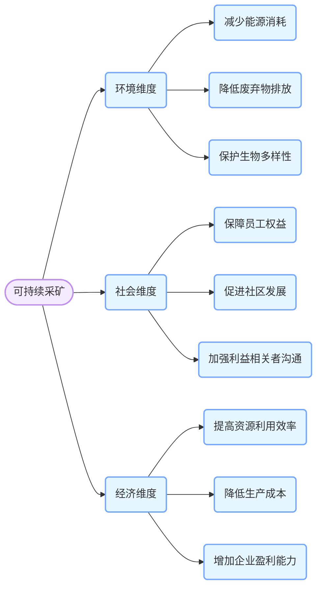

# 可持续采矿实践的经济效益与投资机会

> 关键词：可持续采矿、经济效益、投资机会、环境友好、资源高效利用

> 摘要：本文聚焦于可持续采矿实践，深入探讨其背后的经济效益以及蕴含的投资机会。通过对可持续采矿概念、核心原理的阐述，结合具体算法和数学模型分析其经济影响。同时，借助项目实战案例展示可持续采矿的实际应用与效果。此外，还分析了可持续采矿的实际应用场景，推荐了相关的学习资源、开发工具和研究论文。最后，对可持续采矿的未来发展趋势与挑战进行总结，并提供常见问题解答和扩展阅读参考资料，旨在为相关从业者和投资者全面了解可持续采矿提供有价值的参考。

## 1. 背景介绍 
### 1.1 目的和范围
随着全球对环境保护和资源可持续利用的关注度不断提高，采矿业作为资源开发的重要行业，正面临着巨大的转型压力。传统采矿方式往往对环境造成严重破坏，资源利用率低下，且面临着日益严格的监管政策。因此，探索可持续采矿实践具有重要的现实意义。本文的目的在于全面分析可持续采矿实践的经济效益和投资机会，涵盖从理论原理到实际应用的各个方面，包括可持续采矿的核心概念、算法原理、数学模型、项目实战案例等，为采矿业的可持续发展和相关投资决策提供科学依据。

### 1.2 预期读者
本文预期读者包括采矿业的从业者，如矿业工程师、管理人员等，他们可以从本文中获取可持续采矿实践的最新技术和管理理念，指导实际工作中的决策。同时，对采矿业投资感兴趣的投资者，包括风险投资家、私募股权投资者等，能够通过本文了解可持续采矿的投资潜力和机会。此外，研究资源经济、环境科学等领域的学者和研究人员也可以从本文中获得相关研究的参考资料。

### 1.3 文档结构概述
本文共分为十个部分。第一部分背景介绍，阐述了文章的目的、预期读者和文档结构概述，并给出了相关术语的定义和解释。第二部分介绍可持续采矿的核心概念与联系，包括其原理和架构，并通过文本示意图和 Mermaid 流程图进行展示。第三部分详细讲解可持续采矿的核心算法原理和具体操作步骤，使用 Python 源代码进行阐述。第四部分介绍可持续采矿的数学模型和公式，并通过举例进行详细说明。第五部分通过项目实战，展示可持续采矿的代码实际案例，并对代码进行详细解读和分析。第六部分分析可持续采矿的实际应用场景。第七部分推荐了相关的学习资源、开发工具和研究论文。第八部分总结可持续采矿的未来发展趋势与挑战。第九部分为附录，解答常见问题。第十部分提供扩展阅读和参考资料。

### 1.4 术语表
#### 1.4.1 核心术语定义
- **可持续采矿**：指在满足当前社会对矿产资源需求的同时，确保采矿活动不会对环境、社会和经济造成不可持续的影响，实现资源的长期、高效利用和生态环境的保护。
- **经济效益**：指采矿活动在经济方面所带来的收益，包括直接的销售收入、成本节约以及间接的经济增长、就业机会创造等。
- **投资机会**：指在可持续采矿领域中，投资者可以参与的具有潜在经济回报的项目或活动。
- **环境友好**：指采矿活动对环境的影响最小化，减少对土地、水资源、空气等的污染和破坏。
- **资源高效利用**：指在采矿过程中，尽可能提高矿产资源的回收率和利用率，减少资源的浪费。

#### 1.4.2 相关概念解释
- **循环经济**：一种以资源的高效利用和循环利用为核心，以“减量化、再利用、资源化”为原则，以低消耗、低排放、高效率为基本特征的经济发展模式。在可持续采矿中，循环经济理念体现在对矿产资源的多次利用和废弃物的再加工上。
- **社会责任**：指采矿企业在经营过程中，不仅要追求经济效益，还要考虑对社会的影响，如保障员工权益、促进社区发展、支持教育和文化事业等。

#### 1.4.3 缩略词列表
- **ESG**：Environmental, Social and Governance，即环境、社会和治理，是衡量企业可持续发展能力的重要指标。

## 2. 核心概念与联系 

### 可持续采矿的核心概念原理
可持续采矿的核心原理是在采矿的整个生命周期内，综合考虑环境、社会和经济三个方面的因素，实现三者的平衡和协调发展。在环境方面，要采取措施减少采矿活动对生态环境的破坏，如降低能源消耗、减少废弃物排放、保护生物多样性等。在社会方面，要保障员工的安全和健康，促进当地社区的发展，与利益相关者保持良好的沟通和合作。在经济方面，要提高资源利用效率，降低生产成本，提高企业的盈利能力，同时为社会创造更多的经济价值。

### 可持续采矿的架构
可持续采矿的架构可以分为三个层次：战略层、战术层和操作层。战略层主要负责制定可持续采矿的总体目标和政策，确定企业的发展方向和战略规划。战术层则根据战略层的目标，制定具体的实施计划和措施，如选择合适的采矿技术、优化生产流程、加强环境管理等。操作层是具体的采矿生产过程，负责按照战术层的计划和措施进行实际操作，确保采矿活动的顺利进行。

### 文本示意图
```plaintext
可持续采矿
|-- 环境维度
|   |-- 减少能源消耗
|   |-- 降低废弃物排放
|   |-- 保护生物多样性
|-- 社会维度
|   |-- 保障员工权益
|   |-- 促进社区发展
|   |-- 加强利益相关者沟通
|-- 经济维度
|   |-- 提高资源利用效率
|   |-- 降低生产成本
|   |-- 增加企业盈利能力
```

### Mermaid 流程图


## 3. 核心算法原理 & 具体操作步骤 

### 核心算法原理
在可持续采矿中，一个重要的算法是资源优化配置算法。该算法的目标是在满足各种约束条件的前提下，最大化矿产资源的利用效率和经济效益。以下是一个简化的资源优化配置算法的 Python 实现：

```python
import pulp

# 创建线性规划问题实例，目标是最大化经济效益
prob = pulp.LpProblem("Resource_Optimization", pulp.LpMaximize)

# 定义决策变量
# 假设我们有两种矿产资源 A 和 B，分别定义它们的开采量
x = pulp.LpVariable("x", lowBound=0)  # 矿产资源 A 的开采量
y = pulp.LpVariable("y", lowBound=0)  # 矿产资源 B 的开采量

# 定义目标函数
# 假设矿产资源 A 的单位经济效益为 5，矿产资源 B 的单位经济效益为 3
prob += 5 * x + 3 * y, "Total_Economic_Benefit"

# 定义约束条件
# 假设开采资源 A 和 B 受到设备产能的限制，总产能为 100
prob += x + y <= 100, "Capacity_Constraint"

# 假设开采资源 A 和 B 受到劳动力的限制，总劳动力为 80
prob += 2 * x + y <= 80, "Labor_Constraint"

# 求解线性规划问题
prob.solve()

# 输出结果
print("Status:", pulp.LpStatus[prob.status])
print("Optimal solution:")
print("x =", pulp.value(x))
print("y =", pulp.value(y))
print("Total economic benefit =", pulp.value(prob.objective))
```

### 具体操作步骤
1. **问题定义**：明确需要优化的目标和约束条件，例如上述代码中目标是最大化经济效益，约束条件包括设备产能和劳动力限制。
2. **决策变量定义**：确定需要决策的变量，如矿产资源的开采量。
3. **目标函数定义**：根据问题的目标，构建目标函数，如上述代码中经济效益的计算公式。
4. **约束条件定义**：根据实际情况，定义各种约束条件，如产能约束、劳动力约束等。
5. **求解问题**：使用线性规划求解器求解问题，得到最优解。
6. **结果分析**：分析求解结果，确定最优的资源配置方案。

## 4. 数学模型和公式 & 详细讲解 & 举例说明 

### 数学模型
可持续采矿的资源优化配置问题可以用线性规划模型来描述。线性规划模型的一般形式为：

$$
\begin{align*}
\max_{x_1, x_2, \cdots, x_n} &\quad \sum_{i = 1}^{n} c_i x_i \\
\text{s.t.} &\quad \sum_{i = 1}^{n} a_{ji} x_i \leq b_j, \quad j = 1, 2, \cdots, m \\
&\quad x_i \geq 0, \quad i = 1, 2, \cdots, n
\end{align*}
$$

其中，$x_i$ 是决策变量，表示第 $i$ 种矿产资源的开采量；$c_i$ 是第 $i$ 种矿产资源的单位经济效益；$a_{ji}$ 是第 $j$ 个约束条件中第 $i$ 种矿产资源的系数；$b_j$ 是第 $j$ 个约束条件的上限；$m$ 是约束条件的数量；$n$ 是决策变量的数量。

### 详细讲解
- **目标函数**：$\sum_{i = 1}^{n} c_i x_i$ 表示总经济效益，通过最大化该函数，可以得到最优的资源配置方案，使得经济效益最大。
- **约束条件**：$\sum_{i = 1}^{n} a_{ji} x_i \leq b_j$ 表示各种资源和能力的限制，如设备产能、劳动力等。$x_i \geq 0$ 表示决策变量的非负性，即开采量不能为负数。

### 举例说明
假设我们有两种矿产资源 A 和 B，单位经济效益分别为 $c_1 = 5$ 和 $c_2 = 3$。设备产能限制为 $a_{11} x_1 + a_{12} x_2 \leq b_1$，其中 $a_{11} = 1$，$a_{12} = 1$，$b_1 = 100$；劳动力限制为 $a_{21} x_1 + a_{22} x_2 \leq b_2$，其中 $a_{21} = 2$，$a_{22} = 1$，$b_2 = 80$。则该问题的数学模型为：

$$
\begin{align*}
\max_{x_1, x_2} &\quad 5x_1 + 3x_2 \\
\text{s.t.} &\quad x_1 + x_2 \leq 100 \\
&\quad 2x_1 + x_2 \leq 80 \\
&\quad x_1 \geq 0, x_2 \geq 0
\end{align*}
$$

通过求解该线性规划问题，可以得到最优的开采量 $x_1$ 和 $x_2$，以及最大的经济效益。

## 5. 项目实战：代码实际案例和详细解释说明 

### 5.1  开发环境搭建
1. **安装 Python**：从 Python 官方网站（https://www.python.org/downloads/）下载并安装适合你操作系统的 Python 版本。建议安装 Python 3.6 及以上版本。
2. **安装必要的库**：使用以下命令安装 `pulp` 库，用于线性规划求解：
```sh
pip install pulp
```

### 5.2  源代码详细实现和代码解读
以下是一个更复杂的可持续采矿资源优化配置的 Python 代码示例：

```python
import pulp

# 创建线性规划问题实例，目标是最大化经济效益
prob = pulp.LpProblem("Sustainable_Mining_Optimization", pulp.LpMaximize)

# 定义决策变量
# 假设有三种矿产资源：金、银、铜，分别定义它们的开采量
gold = pulp.LpVariable("gold", lowBound=0)
silver = pulp.LpVariable("silver", lowBound=0)
copper = pulp.LpVariable("copper", lowBound=0)

# 定义目标函数
# 假设金、银、铜的单位经济效益分别为 100、50、20
prob += 100 * gold + 50 * silver + 20 * copper, "Total_Economic_Benefit"

# 定义约束条件
# 设备产能约束：总产能为 200
prob += gold + silver + copper <= 200, "Capacity_Constraint"

# 劳动力约束：总劳动力为 150
prob += 3 * gold + 2 * silver + copper <= 150, "Labor_Constraint"

# 环境排放约束：总排放量不能超过 100
prob += 2 * gold + silver + 0.5 * copper <= 100, "Emission_Constraint"

# 求解线性规划问题
prob.solve()

# 输出结果
print("Status:", pulp.LpStatus[prob.status])
print("Optimal solution:")
print("Gold extraction =", pulp.value(gold))
print("Silver extraction =", pulp.value(silver))
print("Copper extraction =", pulp.value(copper))
print("Total economic benefit =", pulp.value(prob.objective))
```

### 代码解读与分析
1. **问题定义**：创建一个线性规划问题实例，目标是最大化经济效益。
2. **决策变量定义**：定义了三种矿产资源（金、银、铜）的开采量作为决策变量。
3. **目标函数定义**：根据每种矿产资源的单位经济效益，构建了总经济效益的目标函数。
4. **约束条件定义**：添加了设备产能约束、劳动力约束和环境排放约束，确保开采活动在合理的范围内进行。
5. **求解问题**：使用 `pulp` 库的求解器求解线性规划问题。
6. **结果分析**：输出求解结果，包括最优的开采量和最大的经济效益。

通过这个代码示例，可以看到如何使用线性规划算法来优化可持续采矿的资源配置，同时考虑了设备产能、劳动力和环境排放等多个因素。

## 6. 实际应用场景 
### 矿山开采规划
在矿山开采规划中，可持续采矿实践可以帮助企业合理安排开采顺序和开采量，提高资源利用效率，减少对环境的影响。例如，通过资源优化配置算法，可以确定不同矿层的开采时间和开采量，使得在满足市场需求的同时，降低开采成本和环境破坏。

### 尾矿处理与再利用
尾矿是采矿过程中产生的废弃物，传统的处理方式往往会占用大量土地，造成环境污染。可持续采矿实践可以通过先进的技术对尾矿进行处理和再利用，提取其中的有价成分，实现资源的循环利用。例如，采用生物浸出技术可以从尾矿中提取金属，减少资源的浪费。

### 矿区生态修复
可持续采矿要求在采矿结束后对矿区进行生态修复，恢复土地的生态功能。这不仅可以减少采矿活动对环境的长期影响，还可以为当地社区创造新的发展机会。例如，在矿区建设生态公园、发展生态农业等，实现经济、社会和环境的多赢。

### 绿色供应链管理
可持续采矿还涉及到绿色供应链管理，即确保矿产资源从开采、加工到销售的整个过程都符合可持续发展的要求。企业可以通过选择环保的运输方式、优化物流配送等措施，降低供应链的碳排放，提高整个行业的可持续性。

## 7. 工具和资源推荐
### 7.1 学习资源推荐
#### 7.1.1 书籍推荐
- 《可持续采矿：原理与实践》：本书全面介绍了可持续采矿的理论和实践，包括环境管理、社会影响评估、资源高效利用等方面的内容，是学习可持续采矿的经典教材。
- 《矿业经济学》：该书系统阐述了矿业经济的基本原理和方法，对于理解可持续采矿的经济效益和投资机会具有重要的参考价值。

#### 7.1.2 在线课程
- Coursera 上的“可持续发展与采矿业”课程：由知名大学的教授授课，讲解了可持续采矿的最新理念和技术，通过案例分析和实践项目，帮助学员深入理解可持续采矿的应用。
- edX 上的“矿业资源管理与可持续发展”课程：该课程涵盖了矿业资源的规划、开采、加工和环境管理等方面的知识，注重培养学员的实践能力和创新思维。

#### 7.1.3 技术博客和网站
- 国际矿业与金属理事会（ICMM）官网：提供了大量关于可持续采矿的政策、标准和最佳实践案例，是了解全球可持续采矿发展动态的重要平台。
- 中国矿业报官网：及时报道国内矿业行业的最新消息和政策法规，同时也有关于可持续采矿