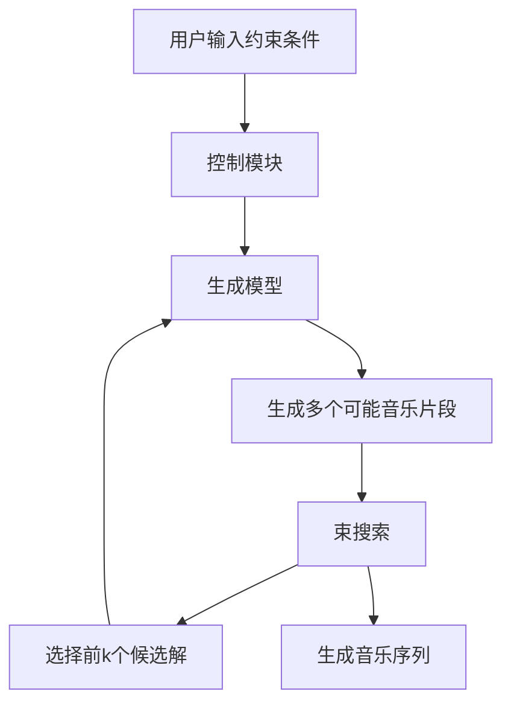

# 可控音乐生成中的束搜索应用

> 关键词：可控音乐生成、束搜索、算法原理、数学模型、实际应用

> 摘要：本文深入探讨了束搜索在可控音乐生成领域的应用。首先介绍了相关背景知识，包括目的范围、预期读者等。接着详细阐述了核心概念，如可控音乐生成和束搜索的原理及架构。通过Python代码解释了束搜索的核心算法原理和具体操作步骤，并给出了相应的数学模型和公式。结合实际案例展示了束搜索在可控音乐生成中的代码实现和分析。同时，探讨了其实际应用场景，推荐了相关的学习资源、开发工具框架以及论文著作。最后总结了未来发展趋势与挑战，并提供了常见问题解答和扩展阅读参考资料，旨在为读者全面深入了解可控音乐生成中束搜索的应用提供专业且详细的指导。

## 1. 背景介绍 
### 1.1 目的和范围
音乐生成一直是人工智能领域中极具吸引力的研究方向。可控音乐生成则进一步提升了音乐创作的灵活性和个性化，使得创作者能够根据特定的要求生成音乐。束搜索作为一种有效的搜索算法，在自然语言处理等领域取得了显著的成果。本文的目的是研究束搜索在可控音乐生成中的应用，探讨如何利用束搜索提高音乐生成的质量和可控性。范围涵盖了束搜索的基本原理、在音乐生成中的具体实现、相关的数学模型以及实际应用场景等方面。

### 1.2 预期读者
本文主要面向对人工智能音乐生成感兴趣的研究人员、开发者以及音乐创作爱好者。对于有一定编程基础，特别是熟悉Python编程语言的读者，能够更好地理解文中的代码实现和算法原理。同时，对于音乐创作有一定了解的读者，能够更深入地体会可控音乐生成的意义和价值。

### 1.3 文档结构概述
本文将按照以下结构进行阐述：首先介绍核心概念，包括可控音乐生成和束搜索的原理及联系；接着详细讲解束搜索的核心算法原理和具体操作步骤，并给出Python代码示例；然后介绍相关的数学模型和公式，并通过举例进行说明；之后通过实际项目案例展示束搜索在可控音乐生成中的代码实现和详细分析；再探讨束搜索在可控音乐生成中的实际应用场景；推荐相关的学习资源、开发工具框架和论文著作；最后总结未来发展趋势与挑战，提供常见问题解答和扩展阅读参考资料。

### 1.4 术语表
#### 1.4.1 核心术语定义
- **可控音乐生成**：指在音乐生成过程中，用户可以根据特定的约束条件（如音乐风格、节奏、音高等）来控制生成音乐的特征和属性。
- **束搜索**：是一种启发式搜索算法，在每一步搜索时，只保留得分最高的前 $k$ 个候选解，从而减少搜索空间，提高搜索效率。
- **音乐表示**：将音乐信息以某种方式进行编码，以便计算机能够处理和分析，常见的音乐表示方式有MIDI、音频波形等。

#### 1.4.2 相关概念解释
- **生成模型**：用于生成新的数据样本，在音乐生成中，生成模型可以根据输入的条件生成相应的音乐序列。
- **搜索空间**：指在搜索过程中所有可能的解的集合，在音乐生成中，搜索空间是所有可能的音乐序列的集合。

#### 1.4.3 缩略词列表
- **MIDI**：Musical Instrument Digital Interface，乐器数字接口，是一种用于在电子音乐设备之间传输音乐信息的标准协议。

## 2. 核心概念与联系 
### 可控音乐生成原理
可控音乐生成的核心思想是在生成音乐的过程中引入用户指定的约束条件。一般来说，可控音乐生成系统由一个生成模型和一个控制模块组成。生成模型负责生成音乐序列，而控制模块则根据用户的输入调整生成过程，使得生成的音乐符合特定的要求。

例如，用户可以指定音乐的风格（如古典、摇滚、爵士等）、节奏模式（如快节奏、慢节奏）、音高范围等。生成模型会根据这些约束条件生成相应的音乐序列。

### 束搜索原理
束搜索是一种在搜索空间中寻找最优解的算法。它通过在每一步搜索时只保留得分最高的前 $k$ 个候选解，从而减少搜索空间的大小，提高搜索效率。

具体来说，束搜索的步骤如下：
1. 初始化：将起始状态作为初始候选解。
2. 扩展：对每个候选解进行扩展，生成所有可能的后续状态。
3. 评分：对每个后续状态进行评分，评估其优劣。
4. 筛选：选择得分最高的前 $k$ 个后续状态作为新的候选解。
5. 重复步骤2 - 4，直到达到终止条件。

### 两者联系
在可控音乐生成中，束搜索可以用于在搜索空间中寻找符合用户约束条件的最优音乐序列。生成模型在每一步生成多个可能的音乐片段，束搜索则根据评分函数选择得分最高的前 $k$ 个片段作为候选解，继续进行搜索。这样可以在保证搜索效率的同时，提高生成音乐的质量和可控性。

### 文本示意图
```plaintext
用户输入（约束条件） -> 控制模块 -> 生成模型 -> 束搜索 -> 生成音乐序列
```

### Mermaid流程图


## 3. 核心算法原理 & 具体操作步骤 
### 核心算法原理
束搜索的核心思想是在每一步搜索时只保留得分最高的前 $k$ 个候选解。在可控音乐生成中，我们可以将每个候选解看作是一个部分生成的音乐序列，评分函数则用于评估每个候选解的优劣。

具体来说，束搜索的算法原理如下：
1. 初始化：将起始状态（如空音乐序列）作为初始候选解。
2. 扩展：对每个候选解进行扩展，生成所有可能的后续状态（即添加一个新的音乐元素）。
3. 评分：使用评分函数对每个后续状态进行评分，评估其符合用户约束条件的程度。
4. 筛选：选择得分最高的前 $k$ 个后续状态作为新的候选解。
5. 重复步骤2 - 4，直到达到终止条件（如生成的音乐序列达到指定长度）。

### 具体操作步骤
以下是使用Python实现束搜索在可控音乐生成中的具体操作步骤：

```python
import heapq

# 定义评分函数
def score_function(music_sequence, constraints):
    # 这里简单示例，实际应用中需要根据具体约束条件实现
    score = 0
    # 假设约束条件是音乐序列的长度
    if len(music_sequence) == constraints['length']:
        score += 1
    return score

# 定义束搜索函数
def beam_search(initial_state, constraints, beam_width, max_length):
    candidates = [(0, initial_state)]  # 初始化候选解，(score, state)
    for _ in range(max_length):
        new_candidates = []
        for score, state in candidates:
            # 扩展当前状态，生成所有可能的后续状态
            for next_state in generate_next_states(state):
                next_score = score_function(next_state, constraints)
                new_candidates.append((next_score, next_state))
        # 选择得分最高的前beam_width个候选解
        new_candidates = heapq.nlargest(beam_width, new_candidates)
        candidates = new_candidates
    # 返回得分最高的候选解
    best_score, best_state = max(candidates)
    return best_state

# 定义生成后续状态的函数
def generate_next_states(state):
    # 这里简单示例，实际应用中需要根据具体音乐生成模型实现
    next_states = []
    # 假设音乐元素是整数
    for i in range(10):
        next_states.append(state + [i])
    return next_states

# 示例使用
initial_state = []
constraints = {'length': 5}
beam_width = 3
max_length = 5
result = beam_search(initial_state, constraints, beam_width, max_length)
print("生成的音乐序列:", result)
```

### 代码解释
1. **评分函数 `score_function`**：用于评估每个候选解的优劣，根据用户的约束条件计算得分。
2. **束搜索函数 `beam_search`**：实现了束搜索的核心逻辑，包括初始化、扩展、评分、筛选等步骤。
3. **生成后续状态的函数 `generate_next_states`**：用于生成当前状态的所有可能后续状态，实际应用中需要根据具体的音乐生成模型进行实现。

## 4. 数学模型和公式 & 详细讲解 & 举例说明 
### 数学模型
在束搜索中，我们可以用以下数学模型来描述搜索过程：

设 $S$ 为搜索空间，$s_0$ 为起始状态，$f(s)$ 为评分函数，用于评估状态 $s$ 的优劣。在每一步搜索中，设当前候选解集合为 $C$，我们需要对每个候选解 $s \in C$ 进行扩展，生成所有可能的后续状态 $N(s)$。然后，我们计算每个后续状态 $s' \in N(s)$ 的得分 $f(s')$，并选择得分最高的前 $k$ 个后续状态作为新的候选解。

### 公式
设 $C_t$ 为第 $t$ 步的候选解集合，$N(s)$ 为状态 $s$ 的所有可能后续状态集合，则束搜索的更新公式为：

$$C_{t+1} = \text{Top}_k\left(\bigcup_{s \in C_t} \{(f(s'), s') | s' \in N(s)\}\right)$$

其中，$\text{Top}_k$ 表示选择得分最高的前 $k$ 个元素。

### 详细讲解
- 起始状态 $s_0$ 作为初始候选解集合 $C_0$。
- 在每一步 $t$，对于每个候选解 $s \in C_t$，我们生成其所有可能的后续状态 $N(s)$。
- 对于每个后续状态 $s' \in N(s)$，我们计算其得分 $f(s')$。
- 将所有后续状态及其得分组成一个集合，然后选择得分最高的前 $k$ 个元素作为新的候选解集合 $C_{t+1}$。
- 重复上述步骤，直到达到终止条件。

### 举例说明
假设我们要生成一个长度为 3 的音乐序列，音乐元素为整数 0 - 2。起始状态为空序列 $[]$，束宽度 $k = 2$。

#### 第一步
- 初始候选解集合 $C_0 = \{([])\}$。
- 扩展初始状态，生成所有可能的后续状态：$N([]) = \{[0], [1], [2]\}$。
- 假设评分函数 $f$ 简单地根据序列长度评分，即 $f([x]) = 1$。
- 后续状态及其得分：$\{(1, [0]), (1, [1]), (1, [2])\}$。
- 选择得分最高的前 2 个元素作为新的候选解集合 $C_1 = \{([0]), ([1])\}$。

#### 第二步
- 对于候选解 $[0]$，扩展得到 $N([0]) = \{[0, 0], [0, 1], [0, 2]\}$；对于候选解 $[1]$，扩展得到 $N([1]) = \{[1, 0], [1, 1], [1, 2]\}$。
- 计算得分：$f([x, y]) = 2$。
- 后续状态及其得分：$\{(2, [0, 0]), (2, [0, 1]), (2, [0, 2]), (2, [1, 0]), (2, [1, 1]), (2, [1, 2])\}$。
- 选择得分最高的前 2 个元素作为新的候选解集合 $C_2 = \{([0, 0]), ([0, 1])\}$。

#### 第三步
- 对于候选解 $[0, 0]$，扩展得到 $N([0, 0]) = \{[0, 0, 0], [0, 0, 1], [0, 0, 2]\}$；对于候选解 $[0, 1]$，扩展得到 $N([0, 1]) = \{[0, 1, 0], [0, 1, 1], [0, 1, 2]\}$。
- 计算得分：$f([x, y, z]) = 3$。
- 后续状态及其得分：$\{(3, [0, 0, 0]), (3, [0, 0, 1]), (3, [0, 0, 2]), (3, [0, 1, 0]), (3, [0, 1, 1]), (3, [0, 1, 2])\}$。
- 选择得分最高的前 2 个元素作为最终候选解集合 $C_3$，假设选择 $([0, 0, 0])$ 和 $([0, 0, 1])$。
- 最终选择得分最高的候选解，假设 $[0, 0, 0]$ 得分最高，则生成的音乐序列为 $[0, 0, 0]$。

## 5. 项目实战：代码实际案例和详细解释说明 
### 5.1  开发环境搭建
#### 安装Python
首先，确保你已经安装了Python 3.x版本。可以从Python官方网站（https://www.python.org/downloads/）下载并安装。

#### 安装必要的库
在可控音乐生成项目中，我们可能需要使用一些库，如 `mido` 用于处理MIDI文件，`numpy` 用于数值计算等。可以使用以下命令进行安装：
```sh
pip install mido numpy
```

### 5.2  源代码详细实现和代码解读
以下是一个更完整的可控音乐生成项目，使用束搜索生成简单的MIDI音乐：

```python
import heapq
import mido
import numpy as np

# 定义评分函数
def score_function(music_sequence, constraints):
    score = 0
    # 约束条件：音高范围
    pitch_range = constraints.get('pitch_range', (0, 127))
    for pitch in music_sequence:
        if pitch_range[0] <= pitch <= pitch_range[1]:
            score += 1
    # 约束条件：节奏模式
    rhythm_pattern = constraints.get('rhythm_pattern', [1])
    if len(music_sequence) % len(rhythm_pattern) == 0:
        score += 1
    return score

# 定义束搜索函数
def beam_search(initial_state, constraints, beam_width, max_length):
    candidates = [(0, initial_state)]
    for _ in range(max_length):
        new_candidates = []
        for score, state in candidates:
            for next_pitch in range(128):
                next_state = state + [next_pitch]
                next_score = score_function(next_state, constraints)
                new_candidates.append((next_score, next_state))
        new_candidates = heapq.nlargest(beam_width, new_candidates)
        candidates = new_candidates
    best_score, best_state = max(candidates)
    return best_state

# 生成MIDI文件
def generate_midi(music_sequence, output_file):
    mid = mido.MidiFile()
    track = mido.MidiTrack()
    mid.tracks.append(track)
    for pitch in music_sequence:
        track.append(mido.Message('note_on', note=pitch, velocity=64, time=32))
        track.append(mido.Message('note_off', note=pitch, velocity=64, time=32))
    mid.save(output_file)

# 示例使用
initial_state = []
constraints = {
    'pitch_range': (60, 72),
    'rhythm_pattern': [1]
}
beam_width = 5
max_length = 10
result = beam_search(initial_state, constraints, beam_width, max_length)
print("生成的音乐序列:", result)
generate_midi(result, 'generated_music.mid')
```

### 5.3  代码解读与分析
#### 评分函数 `score_function`
- 该函数根据用户的约束条件对音乐序列进行评分。具体来说，它考虑了音高范围和节奏模式两个约束条件。如果音乐序列中的音高在指定的范围内，则得分增加；如果音乐序列的长度是节奏模式长度的整数倍，则得分也增加。

#### 束搜索函数 `beam_search`
- 该函数实现了束搜索的核心逻辑。在每一步搜索中，它对每个候选解进行扩展，生成所有可能的后续状态，并计算其得分。然后选择得分最高的前 $k$ 个后续状态作为新的候选解。

#### 生成MIDI文件函数 `generate_midi`
- 该函数将生成的音乐序列转换为MIDI文件。它创建一个MIDI文件对象，添加一个音轨，并将音乐序列中的每个音高转换为MIDI消息添加到音轨中，最后保存为MIDI文件。

#### 示例使用
- 我们设置了初始状态为空序列，约束条件包括音高范围和节奏模式，束宽度为 5，最大长度为 10。调用束搜索函数生成音乐序列，并将其保存为MIDI文件。

## 6. 实际应用场景 
### 音乐创作辅助
对于音乐创作者来说，可控音乐生成中的束搜索可以作为一种创作辅助工具。创作者可以指定音乐的风格、节奏、音高等约束条件，利用束搜索生成多个候选音乐片段，然后从中选择满意的片段进行进一步的创作和修改。这样可以大大提高创作效率，同时激发创作者的灵感。

### 游戏音乐生成
在游戏开发中，需要根据不同的游戏场景生成相应的音乐。使用束搜索的可控音乐生成可以根据游戏场景的特点（如战斗、探索、休息等）生成符合要求的音乐。例如，在战斗场景中，可以生成节奏强烈、激昂的音乐；在探索场景中，可以生成轻松、神秘的音乐。这样可以增强游戏的沉浸感和趣味性。

### 智能音乐推荐
在音乐推荐系统中，可控音乐生成可以用于生成个性化的音乐推荐。根据用户的音乐偏好和历史播放记录，指定特定的约束条件，利用束搜索生成符合用户口味的音乐。这样可以为用户提供更加个性化的音乐体验，提高用户的满意度。

### 音乐教育
在音乐教育中，可控音乐生成可以作为一种教学工具。学生可以通过指定不同的约束条件，观察束搜索生成的音乐序列，了解音乐创作的基本原理和方法。同时，学生也可以对生成的音乐进行分析和评价，提高自己的音乐鉴赏能力。

## 7. 工具和资源推荐
### 7.1 学习资源推荐
#### 7.1.1 书籍推荐
- 《深度学习》（Deep Learning）：由Ian Goodfellow、Yoshua Bengio和Aaron Courville撰写，是深度学习领域的经典教材，介绍了深度学习的基本原理和方法，对于理解可控音乐生成的基础理论有很大帮助。
- 《音乐信息检索》（Music Information Retrieval）：介绍了音乐信息处理的相关技术和方法，包括音乐表示、特征提取、分类等，对于深入了解音乐生成有重要的参考价值。

#### 7.1.2 在线课程
- Coursera上的“深度学习专项课程”（Deep Learning Specialization）：由Andrew Ng教授授课，涵盖了深度学习的各个方面，包括神经网络、卷积神经网络、循环神经网络等，对于学习可控音乐生成中的深度学习模型非常有帮助。
- edX上的“音乐信息检索”（Music Information Retrieval）：介绍了音乐信息处理的基本概念和技术，适合对音乐生成感兴趣的初学者。

#### 7.1.3 技术博客和网站
- Towards Data Science：是一个专注于数据科学和机器学习的技术博客，上面有很多关于音乐生成和人工智能的文章，对于了解最新的研究成果和技术应用有很大帮助。
- Music Tech Policy：关注音乐技术和政策的发展，提供了很多关于音乐生成和音乐产业的信息和观点。

### 7.2 开发工具框架推荐
#### 7.2.1 IDE和编辑器
- PyCharm：是一款专业的Python集成开发环境，提供了丰富的代码编辑、调试和分析功能，适合开发可控音乐生成项目。
- Jupyter Notebook：是一个交互式的开发环境，支持Python代码的编写和运行，同时可以方便地展示代码的执行结果和可视化数据，适合进行实验和研究。

#### 7.2.2 调试和性能分析工具
- PDB：是Python自带的调试工具，可以帮助开发者在代码中设置断点，逐步执行代码，查看变量的值和程序的执行流程。
- cProfile：是Python的性能分析工具，可以分析代码的运行时间和函数调用情况，帮助开发者找出代码中的性能瓶颈。

#### 7.2.3 相关框架和库
- TensorFlow：是一个开源的深度学习框架，提供了丰富的神经网络模型和工具，适合用于构建可控音乐生成的深度学习模型。
- PyTorch：也是一个流行的深度学习框架，具有简洁的API和动态图机制，方便开发者进行模型的构建和训练。
- mido：是一个用于处理MIDI文件的Python库，提供了简单易用的API，可以方便地读取、写入和编辑MIDI文件。

### 7.3 相关论文著作推荐
#### 7.3.1 经典论文
- “Generating Music with Recurrent Neural Networks”：介绍了使用循环神经网络生成音乐的方法，是音乐生成领域的经典论文之一。
- “A Hierarchical Latent Vector Model for Learning Long-Term Structure in Music”：提出了一种分层的潜在向量模型，用于学习音乐的长期结构，提高了音乐生成的质量。

#### 7.3.2 最新研究成果
- 近年来，随着深度学习技术的不断发展，有很多关于可控音乐生成的最新研究成果。可以通过IEEE Xplore、ACM Digital Library等学术数据库搜索相关的论文，了解最新的研究动态。

#### 7.3.3 应用案例分析
- 一些学术会议和期刊上会发表关于可控音乐生成的应用案例分析，如ISMIR（国际音乐信息检索大会）。这些案例分析可以帮助我们了解可控音乐生成在实际应用中的具体实现和效果。

## 8. 总结：未来发展趋势与挑战
### 未来发展趋势
- **多模态融合**：未来的可控音乐生成可能会与其他模态（如图像、文本）进行融合。例如，根据一张图片生成与之匹配的音乐，或者根据一段文字描述生成相应的音乐。这样可以进一步拓展音乐生成的应用场景和创作方式。
- **个性化生成**：随着人工智能技术的发展，可控音乐生成将更加注重个性化。系统可以根据用户的个人喜好、情感状态等因素生成更加符合用户需求的音乐，提供更加个性化的音乐体验。
- **实时交互**：实现实时交互的可控音乐生成是未来的一个重要发展方向。用户可以在生成音乐的过程中实时调整约束条件，系统能够根据用户的调整实时生成新的音乐，实现更加灵活和互动的音乐创作。

### 挑战
- **音乐理解和表达**：虽然深度学习在音乐生成方面取得了一定的进展，但目前的模型对于音乐的理解和表达还不够深入。如何让模型更好地理解音乐的语义、情感和结构，是一个需要解决的挑战。
- **计算资源需求**：可控音乐生成通常需要大量的计算资源，特别是在使用深度学习模型时。如何在有限的计算资源下提高生成效率和质量，是一个实际应用中需要面对的问题。
- **版权和伦理问题**：随着音乐生成技术的发展，版权和伦理问题也日益凸显。如何确保生成的音乐不侵犯他人的版权，以及如何规范音乐生成技术的使用，是需要关注的重要问题。

## 9. 附录：常见问题与解答
### 问题1：束搜索的束宽度 $k$ 如何选择？
束宽度 $k$ 的选择需要根据具体的应用场景和计算资源来决定。一般来说，$k$ 值越大，搜索空间越大，找到最优解的可能性越高，但计算复杂度也会增加；$k$ 值越小，搜索空间越小，计算复杂度降低，但可能会错过最优解。可以通过实验的方法，尝试不同的 $k$ 值，选择在计算效率和生成质量之间取得平衡的 $k$ 值。

### 问题2：评分函数的设计有哪些注意事项？
评分函数的设计需要根据用户的约束条件和生成目标来进行。在设计评分函数时，需要考虑以下几点：
- **明确约束条件**：评分函数应该能够准确地反映用户的约束条件，如音高范围、节奏模式等。
- **合理分配权重**：如果有多个约束条件，需要合理分配每个约束条件的权重，以确保生成的音乐在各个方面都符合要求。
- **可解释性**：评分函数应该具有一定的可解释性，方便用户理解生成结果的优劣。

### 问题3：可控音乐生成的质量如何评估？
可控音乐生成的质量评估是一个复杂的问题，目前还没有统一的评估标准。可以从以下几个方面进行评估：
- **符合约束条件的程度**：检查生成的音乐是否符合用户指定的约束条件，如音高范围、节奏模式等。
- **音乐的美感**：邀请专业的音乐人士或普通用户对生成的音乐进行主观评价，评估其音乐的美感和吸引力。
- **与人类创作的相似性**：比较生成的音乐与人类创作的音乐在结构、风格等方面的相似性。

## 10. 扩展阅读 & 参考资料
### 扩展阅读
- 《人工智能艺术创作》：探讨了人工智能在艺术创作领域的应用，包括音乐生成、绘画创作等方面的内容。
- 《音乐与人工智能》：介绍了音乐与人工智能的交叉领域，包括音乐生成、音乐分析、音乐推荐等方面的技术和方法。

### 参考资料
- Goodfellow, I., Bengio, Y., & Courville, A. (2016). Deep Learning. MIT Press.
- Müller, M. (2015). Fundamentals of Music Processing: Audio, Analysis, Algorithms, Applications. Springer.
- Huang, A., & Yang, Y. H. (2018). Music Generation with Hierarchical Recurrent Neural Networks. arXiv preprint arXiv:1803.05428.

作者：AI天才研究院/AI Genius Institute & 禅与计算机程序设计艺术 /Zen And The Art of Computer Programming