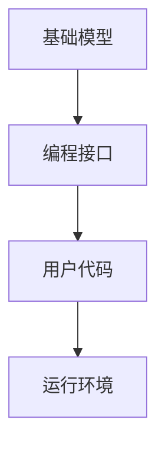

# 可编程AI:增强模型的通用性与灵活性

> 关键词：可编程AI、通用性、灵活性、人工智能模型、编程接口

> 摘要：本文围绕可编程AI展开，深入探讨其如何增强模型的通用性与灵活性。首先介绍了可编程AI的背景知识，包括目的范围、预期读者等内容。接着阐述核心概念与联系，通过文本示意图和Mermaid流程图清晰展示其原理和架构。详细讲解了核心算法原理，用Python代码进行具体阐述，并给出相关数学模型和公式。通过项目实战，展示代码实际案例并进行详细解释。分析了可编程AI的实际应用场景，推荐了相关的工具和资源。最后总结了未来发展趋势与挑战，提供常见问题解答和扩展阅读参考资料，旨在为读者全面呈现可编程AI的相关技术知识。

## 1. 背景介绍 
### 1.1 目的和范围
可编程AI的目的在于突破传统人工智能模型的局限性，使模型能够根据不同的任务需求进行灵活的编程和定制，从而增强其通用性与灵活性。传统的AI模型往往是针对特定任务进行训练和优化的，当面对新的任务或变化的环境时，需要重新进行大量的训练和调整。而可编程AI旨在提供一种更加灵活的方式，让开发者能够在现有模型的基础上，通过编程的手段快速适应新的需求。

本文章的范围涵盖可编程AI的核心概念、算法原理、数学模型、实际应用场景以及相关的工具和资源等方面。通过对这些内容的深入探讨，帮助读者全面了解可编程AI，并能够在实际项目中应用相关技术。

### 1.2 预期读者
本文预期读者包括人工智能领域的研究人员、开发者、软件架构师、CTO等专业人士，以及对人工智能技术感兴趣的学生和爱好者。对于专业人士，本文可以提供深入的技术分析和新的思路；对于初学者，可以作为了解可编程AI的入门资料。

### 1.3 文档结构概述
本文首先介绍可编程AI的背景知识，包括目的、范围、预期读者等内容。接着阐述核心概念与联系，通过文本示意图和Mermaid流程图清晰展示其原理和架构。然后详细讲解核心算法原理，用Python代码进行具体阐述，并给出相关数学模型和公式。通过项目实战，展示代码实际案例并进行详细解释。分析可编程AI的实际应用场景，推荐相关的工具和资源。最后总结未来发展趋势与挑战，提供常见问题解答和扩展阅读参考资料。

### 1.4 术语表
#### 1.4.1 核心术语定义
- **可编程AI**：一种允许开发者通过编程接口对人工智能模型进行定制和扩展的技术，能够根据不同的任务需求灵活调整模型的行为。
- **通用性**：指模型能够适用于多种不同类型的任务，而不是局限于特定的单一任务。
- **灵活性**：模型能够根据环境的变化和任务的需求快速进行调整和适应的能力。
- **编程接口**：提供给开发者用于与人工智能模型进行交互和控制的接口，通过调用这些接口可以实现对模型的定制和扩展。

#### 1.4.2 相关概念解释
- **人工智能模型**：是一种基于数据和算法构建的系统，能够从数据中学习模式和规律，并根据这些模式和规律进行预测和决策。
- **机器学习**：是人工智能的一个重要分支，通过让计算机从数据中自动学习模式和规律，从而实现对未知数据的预测和分类。
- **深度学习**：是机器学习的一种特殊形式，通过构建深层神经网络模型，能够处理更加复杂和抽象的数据模式。

#### 1.4.3 缩略词列表
- **AI**：Artificial Intelligence，人工智能
- **ML**：Machine Learning，机器学习
- **DL**：Deep Learning，深度学习

## 2. 核心概念与联系 

可编程AI的核心思想是通过提供编程接口，让开发者能够对人工智能模型进行定制和扩展，从而增强模型的通用性与灵活性。其基本原理是将模型的一些关键组件和功能暴露给开发者，开发者可以根据自己的需求编写代码来调用这些组件和功能，实现对模型的定制。

### 文本示意图
可编程AI系统主要由以下几个部分组成：
1. **基础模型**：是一个预训练好的人工智能模型，如深度学习模型，它具有一定的通用能力。
2. **编程接口**：提供给开发者的接口，包括模型的输入输出接口、参数调整接口、功能扩展接口等。
3. **用户代码**：开发者编写的代码，通过调用编程接口对基础模型进行定制和扩展。
4. **运行环境**：负责运行基础模型和用户代码，提供必要的计算资源和服务。

```plaintext
+-------------------+
|    基础模型       |
+-------------------+
        |
        v
+-------------------+
|    编程接口       |
+-------------------+
        |
        v
+-------------------+
|    用户代码       |
+-------------------+
        |
        v
+-------------------+
|    运行环境       |
+-------------------+
```

### Mermaid流程图


## 3. 核心算法原理 & 具体操作步骤 

可编程AI的核心算法原理主要涉及到模型的表示、调用和扩展等方面。下面我们以一个简单的图像分类模型为例，使用Python代码详细阐述其具体操作步骤。

### 步骤1：加载基础模型
我们使用PyTorch框架加载一个预训练好的ResNet图像分类模型。
```python
import torch
import torchvision.models as models

# 加载预训练的ResNet模型
model = models.resnet18(pretrained=True)
```

### 步骤2：定义编程接口
我们定义一个简单的编程接口，用于对模型进行输入和输出操作。
```python
def classify_image(model, image):
    """
    对图像进行分类
    :param model: 图像分类模型
    :param image: 输入的图像
    :return: 分类结果
    """
    # 对图像进行预处理
    preprocess = torchvision.transforms.Compose([
        torchvision.transforms.Resize(256),
        torchvision.transforms.CenterCrop(224),
        torchvision.transforms.ToTensor(),
        torchvision.transforms.Normalize(mean=[0.485, 0.456, 0.406], std=[0.229, 0.224, 0.225])
    ])
    input_tensor = preprocess(image)
    input_batch = input_tensor.unsqueeze(0)

    # 进行推理
    with torch.no_grad():
        output = model(input_batch)

    # 获取分类结果
    _, predicted = torch.max(output, 1)
    return predicted.item()
```

### 步骤3：编写用户代码
用户可以编写自己的代码，调用编程接口对模型进行使用。
```python
from PIL import Image

# 加载图像
image = Image.open('test_image.jpg')

# 调用编程接口进行分类
result = classify_image(model, image)
print(f"分类结果: {result}")
```

### 步骤4：扩展模型功能
用户可以通过修改模型的结构或参数来扩展模型的功能。例如，我们可以修改模型的最后一层全连接层，使其适应新的分类任务。
```python
import torch.nn as nn

# 获取模型的最后一层全连接层
num_ftrs = model.fc.in_features

# 修改最后一层全连接层，使其适应新的分类任务
model.fc = nn.Linear(num_ftrs, 10)  # 假设新的分类任务有10个类别

# 重新训练模型
# 这里省略训练代码，实际应用中需要根据具体情况进行训练
```

## 4. 数学模型和公式 & 详细讲解 & 举例说明 

可编程AI涉及到多个数学模型和公式，下面我们以深度学习中的神经网络为例进行详细讲解。

### 神经网络的基本结构
神经网络由输入层、隐藏层和输出层组成。每个神经元接收输入信号，经过加权求和和非线性激活函数处理后，输出结果。

### 前向传播公式
假设神经网络有 $L$ 层，第 $l$ 层的输入为 $a^{(l-1)}$，权重矩阵为 $W^{(l)}$，偏置向量为 $b^{(l)}$，激活函数为 $f$，则第 $l$ 层的输出 $a^{(l)}$ 可以表示为：
$$
z^{(l)} = W^{(l)}a^{(l-1)} + b^{(l)}
$$
$$
a^{(l)} = f(z^{(l)})
$$
其中，$z^{(l)}$ 是第 $l$ 层的加权输入。

### 举例说明
假设我们有一个简单的两层神经网络，输入层有2个神经元，隐藏层有3个神经元，输出层有1个神经元。输入向量 $x = [x_1, x_2]^T$，第一层的权重矩阵 $W^{(1)} = \begin{bmatrix} w_{11}^{(1)} & w_{12}^{(1)} \\ w_{21}^{(1)} & w_{22}^{(1)} \\ w_{31}^{(1)} & w_{32}^{(1)} \end{bmatrix}$，偏置向量 $b^{(1)} = [b_1^{(1)}, b_2^{(1)}, b_3^{(1)}]^T$，激活函数为Sigmoid函数 $\sigma(z) = \frac{1}{1 + e^{-z}}$。

则第一层的加权输入 $z^{(1)}$ 为：
$$
z^{(1)} = W^{(1)}x + b^{(1)} = \begin{bmatrix} w_{11}^{(1)}x_1 + w_{12}^{(1)}x_2 + b_1^{(1)} \\ w_{21}^{(1)}x_1 + w_{22}^{(1)}x_2 + b_2^{(1)} \\ w_{31}^{(1)}x_1 + w_{32}^{(1)}x_2 + b_3^{(1)} \end{bmatrix}
$$
第一层的输出 $a^{(1)}$ 为：
$$
a^{(1)} = \sigma(z^{(1)}) = \begin{bmatrix} \frac{1}{1 + e^{-(w_{11}^{(1)}x_1 + w_{12}^{(1)}x_2 + b_1^{(1)})}} \\ \frac{1}{1 + e^{-(w_{21}^{(1)}x_1 + w_{22}^{(1)}x_2 + b_2^{(1)})}} \\ \frac{1}{1 + e^{-(w_{31}^{(1)}x_1 + w_{32}^{(1)}x_2 + b_3^{(1)})}} \end{bmatrix}
$$
第二层的权重矩阵 $W^{(2)} = [w_1^{(2)}, w_2^{(2)}, w_3^{(2)}]$，偏置向量 $b^{(2)} = [b_1^{(2)}]$，则第二层的加权输入 $z^{(2)}$ 为：
$$
z^{(2)} = W^{(2)}a^{(1)} + b^{(2)} = w_1^{(2)}\frac{1}{1 + e^{-(w_{11}^{(1)}x_1 + w_{12}^{(1)}x_2 + b_1^{(1)})}} + w_2^{(2)}\frac{1}{1 + e^{-(w_{21}^{(1)}x_1 + w_{22}^{(1)}x_2 + b_2^{(1)})}} + w_3^{(2)}\frac{1}{1 + e^{-(w_{31}^{(1)}x_1 + w_{32}^{(1)}x_2 + b_3^{(1)})}} + b_1^{(2)}
$$
第二层的输出 $a^{(2)}$ 为：
$$
a^{(2)} = \sigma(z^{(2)}) = \frac{1}{1 + e^{-z^{(2)}}}
$$

### 反向传播公式
为了训练神经网络，我们需要使用反向传播算法来计算梯度。假设损失函数为 $J$，则第 $l$ 层的误差 $\delta^{(l)}$ 可以表示为：
$$
\delta^{(L)} = \nabla_{z^{(L)}}J
$$
$$
\delta^{(l)} = ((W^{(l+1)})^T\delta^{(l+1)}) \odot f'(z^{(l)})
$$
其中，$\odot$ 表示逐元素相乘，$f'(z^{(l)})$ 是激活函数的导数。

权重和偏置的梯度可以表示为：
$$
\nabla_{W^{(l)}}J = \delta^{(l)}(a^{(l-1)})^T
$$
$$
\nabla_{b^{(l)}}J = \delta^{(l)}
$$

## 5. 项目实战：代码实际案例和详细解释说明 
### 5.1  开发环境搭建
我们以Python和PyTorch框架为例，介绍开发环境的搭建步骤。

#### 安装Python
首先，从Python官方网站（https://www.python.org/downloads/） 下载并安装Python 3.x版本。

#### 安装PyTorch
根据自己的操作系统和CUDA版本，选择合适的PyTorch安装命令。例如，在Windows系统上，使用以下命令安装CPU版本的PyTorch：
```sh
pip install torch torchvision
```
如果需要安装GPU版本的PyTorch，需要根据自己的CUDA版本选择合适的安装命令，具体可以参考PyTorch官方文档（https://pytorch.org/get-started/locally/）。

### 5.2  源代码详细实现和代码解读
我们以一个简单的手写数字识别任务为例，展示可编程AI的实际应用。

```python
import torch
import torch.nn as nn
import torch.optim as optim
from torchvision import datasets, transforms
from torch.utils.data import DataLoader

# 定义超参数
batch_size = 64
learning_rate = 0.01
epochs = 5

# 数据预处理
transform = transforms.Compose([
    transforms.ToTensor(),
    transforms.Normalize((0.1307,), (0.3081,))
])

# 加载数据集
train_dataset = datasets.MNIST(root='./data', train=True,
                               download=True, transform=transform)
test_dataset = datasets.MNIST(root='./data', train=False,
                              download=True, transform=transform)

train_loader = DataLoader(train_dataset, batch_size=batch_size, shuffle=True)
test_loader = DataLoader(test_dataset, batch_size=batch_size, shuffle=False)

# 定义模型
class SimpleNet(nn.Module):
    def __init__(self):
        super(SimpleNet, self).__init__()
        self.fc1 = nn.Linear(28 * 28, 128)
        self.fc2 = nn.Linear(128, 10)

    def forward(self, x):
        x = x.view(-1, 28 * 28)
        x = torch.relu(self.fc1(x))
        x = self.fc2(x)
        return x

model = SimpleNet()

# 定义损失函数和优化器
criterion = nn.CrossEntropyLoss()
optimizer = optim.SGD(model.parameters(), lr=learning_rate)

# 训练模型
for epoch in range(epochs):
    model.train()
    for batch_idx, (data, target) in enumerate(train_loader):
        optimizer.zero_grad()
        output = model(data)
        loss = criterion(output, target)
        loss.backward()
        optimizer.step()
        if batch_idx % 100 == 0:
            print(f'Train Epoch: {epoch} [{batch_idx * len(data)}/{len(train_loader.dataset)} '
                  f'({100. * batch_idx / len(train_loader):.0f}%)]\tLoss: {loss.item():.6f}')

# 测试模型
model.eval()
test_loss = 0
correct = 0
with torch.no_grad():
    for data, target in test_loader:
        output = model(data)
        test_loss += criterion(output, target).item()
        pred = output.argmax(dim=1, keepdim=True)
        correct += pred.eq(target.view_as(pred)).sum().item()

test_loss /= len(test_loader.dataset)
print(f'\nTest set: Average loss: {test_loss:.4f}, Accuracy: {correct}/{len(test_loader.dataset)} '
      f'({100. * correct / len(test_loader.dataset):.0f}%)\n')
```

### 代码解读与分析
1. **数据预处理**：使用 `transforms.Compose` 定义数据预处理操作，包括将图像转换为张量和归一化处理。
2. **数据集加载**：使用 `datasets.MNIST` 加载MNIST手写数字数据集，并使用 `DataLoader` 进行数据加载和批量处理。
3. **模型定义**：定义一个简单的全连接神经网络 `SimpleNet`，包含两个全连接层。
4. **损失函数和优化器**：使用交叉熵损失函数 `nn.CrossEntropyLoss` 和随机梯度下降优化器 `optim.SGD`。
5. **训练模型**：在每个训练周期中，通过前向传播计算输出，计算损失，然后通过反向传播更新模型参数。
6. **测试模型**：在测试集上评估模型的性能，计算平均损失和准确率。

## 6. 实际应用场景 
可编程AI具有广泛的实际应用场景，以下是一些常见的应用场景：

### 智能客服
可编程AI可以用于智能客服系统，根据不同的业务需求定制客服机器人的回答策略和处理流程。例如，对于电商平台的智能客服，可以根据用户的问题类型和历史记录，灵活调用不同的知识库和处理逻辑，提供更加个性化的服务。

### 金融风控
在金融