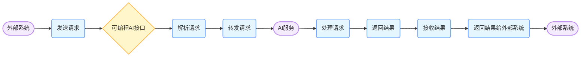

# 可编程AI接口:提高系统灵活性与可扩展性

> 关键词：可编程AI接口、系统灵活性、系统可扩展性、AI集成、接口设计

> 摘要：本文围绕可编程AI接口展开，深入探讨其如何提高系统的灵活性与可扩展性。首先介绍了可编程AI接口的背景知识，包括目的、预期读者、文档结构等内容。接着阐述了核心概念与联系，给出了原理和架构的文本示意图与Mermaid流程图。详细讲解了核心算法原理及具体操作步骤，并使用Python代码进行阐述。同时介绍了相关的数学模型和公式，辅以举例说明。通过项目实战，给出代码实际案例并详细解释。分析了可编程AI接口的实际应用场景，推荐了学习、开发所需的工具和资源，包括书籍、在线课程、开发框架等。最后总结了未来发展趋势与挑战，解答了常见问题，并提供了扩展阅读和参考资料，旨在为读者全面深入地理解可编程AI接口提供帮助。

## 1. 背景介绍 
### 1.1 目的和范围
随着人工智能技术的飞速发展，越来越多的系统希望集成AI能力来提升自身的智能化水平。然而，不同的AI模型和系统之间存在着差异，如何将这些AI能力灵活、高效地集成到现有系统中成为了一个关键问题。可编程AI接口应运而生，其目的在于提供一种标准化、可定制的方式，让系统能够方便地调用和使用各种AI服务，从而提高系统的灵活性与可扩展性。

本文的范围涵盖了可编程AI接口的核心概念、算法原理、数学模型、实际应用案例以及相关的工具和资源推荐等方面，旨在为读者全面介绍可编程AI接口，并帮助他们在实际项目中应用该技术。

### 1.2 预期读者
本文的预期读者包括软件开发人员、系统架构师、AI工程师、技术管理者等。对于软件开发人员来说，他们可以通过本文学习如何在自己的项目中使用可编程AI接口；系统架构师可以从中获取关于如何设计具有高灵活性和可扩展性的系统架构的思路；AI工程师可以了解如何将自己的AI模型封装成可编程接口，以便更好地与其他系统集成；技术管理者则可以从宏观层面了解可编程AI接口对企业系统的重要性和应用价值。

### 1.3 文档结构概述
本文将按照以下结构进行组织：
- 核心概念与联系：介绍可编程AI接口的基本概念、原理和架构，并通过文本示意图和Mermaid流程图进行直观展示。
- 核心算法原理 & 具体操作步骤：详细讲解可编程AI接口所涉及的核心算法原理，并使用Python代码给出具体的操作步骤。
- 数学模型和公式 & 详细讲解 & 举例说明：介绍与可编程AI接口相关的数学模型和公式，并通过具体例子进行说明。
- 项目实战：通过一个实际的项目案例，展示如何使用可编程AI接口进行开发，并对代码进行详细解释。
- 实际应用场景：分析可编程AI接口在不同领域的实际应用场景。
- 工具和资源推荐：推荐学习和开发可编程AI接口所需的工具和资源，包括书籍、在线课程、开发框架等。
- 总结：未来发展趋势与挑战：总结可编程AI接口的发展趋势，并分析其面临的挑战。
- 附录：常见问题与解答：解答读者在学习和使用可编程AI接口过程中可能遇到的常见问题。
- 扩展阅读 & 参考资料：提供相关的扩展阅读材料和参考资料，方便读者进一步深入学习。

### 1.4 术语表
#### 1.4.1 核心术语定义
- **可编程AI接口**：一种标准化的接口，允许外部系统通过编程的方式调用和使用AI服务。它定义了输入输出格式、调用方式等规范，使得不同的AI模型和系统能够方便地集成到其他系统中。
- **系统灵活性**：指系统能够快速适应不同的业务需求和变化的能力。通过可编程AI接口，系统可以方便地集成不同的AI服务，从而实现功能的灵活扩展。
- **系统可扩展性**：指系统能够随着业务的增长和需求的变化，方便地增加新的功能和模块的能力。可编程AI接口提供了一种松耦合的集成方式，使得系统能够轻松地添加新的AI服务，提高系统的可扩展性。
- **AI服务**：指基于人工智能技术提供的各种服务，如图像识别、自然语言处理、语音识别等。

#### 1.4.2 相关概念解释
- **API（Application Programming Interface）**：应用程序编程接口，是一组定义了软件组件之间如何交互的规范。可编程AI接口可以看作是一种特殊的API，专门用于调用AI服务。
- **微服务架构**：一种将大型应用程序拆分成多个小型、自治的服务的架构模式。可编程AI接口可以与微服务架构相结合，将AI服务作为独立的微服务进行部署和管理，提高系统的灵活性和可维护性。

#### 1.4.3 缩略词列表
- **AI（Artificial Intelligence）**：人工智能
- **API（Application Programming Interface）**：应用程序编程接口
- **NLP（Natural Language Processing）**：自然语言处理
- **CV（Computer Vision）**：计算机视觉

## 2. 核心概念与联系 

### 可编程AI接口的基本原理
可编程AI接口的基本原理是将AI服务封装成一个可调用的模块，通过定义标准化的输入输出格式和调用方式，让外部系统能够方便地与AI服务进行交互。具体来说，当外部系统需要使用AI服务时，它会向可编程AI接口发送一个请求，请求中包含了输入数据。可编程AI接口接收到请求后，会对输入数据进行处理，并将其转发给相应的AI服务。AI服务对输入数据进行处理后，将结果返回给可编程AI接口，可编程AI接口再将结果返回给外部系统。

### 可编程AI接口的架构
可编程AI接口的架构主要包括以下几个部分：
- **接口层**：负责接收外部系统的请求，并对请求进行解析和验证。它定义了输入输出格式和调用方式，是外部系统与AI服务之间的桥梁。
- **服务层**：包含了各种AI服务，如图像识别、自然语言处理等。这些服务可以是本地部署的，也可以是云端提供的。
- **管理层**：负责对AI服务进行管理，包括服务的注册、发现、监控等。它确保AI服务的可用性和稳定性。

### 文本示意图
```plaintext
外部系统 <-> 可编程AI接口 <-> AI服务
|                      |
|                      |
V                      V
输入数据              处理结果
```

### Mermaid流程图


## 3. 核心算法原理 & 具体操作步骤 

### 核心算法原理
可编程AI接口的核心算法主要涉及到数据处理、请求转发和结果返回等方面。以下是一个简单的算法流程：
1. **接收请求**：可编程AI接口监听指定的端口，接收外部系统发送的请求。
2. **解析请求**：对接收到的请求进行解析，提取出输入数据和请求参数。
3. **验证请求**：验证请求的合法性，包括输入数据的格式、请求参数的有效性等。
4. **转发请求**：将解析和验证后的请求转发给相应的AI服务。
5. **处理请求**：AI服务对转发过来的请求进行处理，生成处理结果。
6. **接收结果**：可编程AI接口接收AI服务返回的处理结果。
7. **返回结果**：将处理结果返回给外部系统。

### 具体操作步骤（Python代码实现）
以下是一个使用Python和Flask框架实现的简单可编程AI接口示例：

```python
from flask import Flask, request, jsonify
import requests

app = Flask(__name__)

# 定义AI服务的URL
AI_SERVICE_URL = "http://example.com/ai-service"

@app.route('/ai', methods=['POST'])
def ai_api():
    try:
        # 1. 接收请求
        data = request.get_json()

        # 2. 解析请求
        input_data = data.get('input')

        # 3. 验证请求
        if input_data is None:
            return jsonify({"error": "Missing input data"}), 400

        # 4. 转发请求
        response = requests.post(AI_SERVICE_URL, json={"input": input_data})

        # 5. 处理请求（由AI服务完成）

        # 6. 接收结果
        if response.status_code == 200:
            result = response.json()
            # 7. 返回结果
            return jsonify(result)
        else:
            return jsonify({"error": "AI service returned an error"}), 500
    except Exception as e:
        return jsonify({"error": str(e)}), 500

if __name__ == '__main__':
    app.run(debug=True)
```

### 代码解释
1. **导入必要的库**：导入Flask框架和requests库，用于创建Web服务器和发送HTTP请求。
2. **创建Flask应用**：使用`Flask(__name__)`创建一个Flask应用实例。
3. **定义AI服务的URL**：指定AI服务的URL，用于转发请求。
4. **定义路由**：使用`@app.route`装饰器定义一个POST请求的路由`/ai`。
5. **接收和解析请求**：使用`request.get_json()`方法接收并解析请求的JSON数据。
6. **验证请求**：检查输入数据是否存在，如果不存在则返回错误信息。
7. **转发请求**：使用`requests.post`方法将请求转发给AI服务。
8. **接收和返回结果**：根据AI服务的响应状态码，返回相应的结果或错误信息。

## 4. 数学模型和公式 & 详细讲解 & 举例说明 

### 数学模型
可编程AI接口的数学模型主要涉及到数据的传输和处理。可以将其抽象为一个函数映射的过程，即输入数据经过AI服务的处理后，得到输出结果。设输入数据为 $x$，AI服务的处理函数为 $f$，输出结果为 $y$，则可以表示为：

$$y = f(x)$$

其中，$x$ 可以是向量、矩阵、文本等不同类型的数据，$f$ 是一个复杂的函数，通常由AI模型实现。

### 详细讲解
在实际应用中，输入数据 $x$ 可能需要进行预处理，如归一化、编码等，以适应AI模型的输入要求。处理函数 $f$ 可以是各种机器学习或深度学习模型，如神经网络、决策树等。输出结果 $y$ 也可能需要进行后处理，如解码、反归一化等，以便外部系统能够正确理解和使用。

### 举例说明
假设我们有一个图像识别的AI服务，输入数据 $x$ 是一张图像，输出结果 $y$ 是图像中物体的类别。AI服务的处理函数 $f$ 是一个卷积神经网络（CNN）模型。在调用可编程AI接口时，外部系统将图像作为输入数据发送给接口，接口将图像转发给AI服务。AI服务的CNN模型对图像进行处理，输出物体的类别概率分布，经过后处理后得到最终的物体类别，再将结果返回给接口，接口最后将结果返回给外部系统。

## 5. 项目实战：代码实际案例和详细解释说明 

### 5.1  开发环境搭建
#### 环境要求
- Python 3.6 及以上版本
- Flask 框架
- requests 库

#### 安装步骤
1. 安装Python：从Python官方网站（https://www.python.org/downloads/）下载并安装Python 3.6 及以上版本。
2. 创建虚拟环境（可选但推荐）：使用`venv`模块创建一个虚拟环境，以隔离项目的依赖。
```bash
python -m venv myenv
```
3. 激活虚拟环境：
- 在Windows上：
```bash
myenv\Scripts\activate
```
- 在Linux/Mac上：
```bash
source myenv/bin/activate
```
4. 安装Flask和requests库：
```bash
pip install flask requests
```

### 5.2  源代码详细实现和代码解读
以下是一个完整的项目实战代码示例，假设我们要实现一个简单的文本分类的可编程AI接口：

```python
from flask import Flask, request, jsonify
import requests

app = Flask(__name__)

# 定义AI服务的URL
AI_SERVICE_URL = "http://text-classification-service.com/predict"

@app.route('/classify', methods=['POST'])
def classify_api():
    try:
        # 接收请求
        data = request.get_json()

        # 解析请求
        text = data.get('text')

        # 验证请求
        if text is None:
            return jsonify({"error": "Missing text data"}), 400

        # 转发请求
        response = requests.post(AI_SERVICE_URL, json={"text": text})

        # 处理请求（由AI服务完成）

        # 接收结果
        if response.status_code == 200:
            result = response.json()
            # 返回结果
            return jsonify(result)
        else:
            return jsonify({"error": "AI service returned an error"}), 500
    except Exception as e:
        return jsonify({"error": str(e)}), 500

if __name__ == '__main__':
    app.run(debug=True)
```

### 代码解读
1. **导入必要的库**：导入Flask框架和requests库，用于创建Web服务器和发送HTTP请求。
2. **创建Flask应用**：使用`Flask(__name__)`创建一个Flask应用实例。
3. **定义AI服务的URL**：指定文本分类AI服务的URL，用于转发请求。
4. **定义路由**：使用`@app.route`装饰器定义一个POST请求的路由`/classify`。
5. **接收和解析请求**：使用`request.get_json()`方法接收并解析请求的JSON数据，提取出文本数据。
6. **验证请求**：检查文本数据是否存在，如果不存在则返回错误信息。
7. **转发请求**：使用`requests.post`方法将请求转发给AI服务。
8. **接收和返回结果**：根据AI服务的响应状态码，返回相应的结果或错误信息。

### 5.3  代码解读与分析
- **模块化设计**：将AI服务的调用封装在一个独立的路由函数中，使得代码具有良好的模块化结构，易于维护和扩展。
- **错误处理**：在代码中加入了异常处理机制，能够捕获并处理各种可能的错误，提高了系统的健壮性。
- **数据验证**：对输入数据进行验证，确保数据的合法性，避免因无效数据导致的错误。
- **松耦合架构**：通过可编程AI接口将外部系统与AI服务解耦，使得系统具有更好的灵活性和可扩展性。

## 6. 实际应用场景 
### 智能客服系统
在智能客服系统中，可编程AI接口可以用于集成自然语言处理（NLP）服务，如意图识别、情感分析等。当用户发送问题时，客服系统通过可编程AI接口将用户的问题转发给NLP服务，NLP服务对问题进行分析，识别用户的意图和情感，然后将结果返回给客服系统。客服系统根据这些结果自动回复用户，或者将问题转接给人工客服。这样可以提高客服系统的智能化水平，减少人工客服的工作量。

### 金融风险评估
在金融领域，可编程AI接口可以用于集成机器学习模型，进行风险评估。金融机构可以将客户的信息，如信用记录、收入情况等，通过可编程AI接口发送给机器学习模型，模型对这些信息进行分析，评估客户的风险等级。金融机构可以根据评估结果做出决策，如是否批准贷款、确定贷款利率等。

### 智能安防系统
在智能安防系统中，可编程AI接口可以用于集成计算机视觉（CV）服务，如人脸识别、行为分析等。安防摄像头采集到的视频数据可以通过可编程AI接口发送给CV服务，CV服务对视频数据进行分析，识别出人员的身份和行为，如是否有可疑人员进入、是否有异常行为发生等。安防系统根据分析结果及时发出警报，保障安全。

### 电商推荐系统
在电商推荐系统中，可编程AI接口可以用于集成推荐算法模型，为用户提供个性化的商品推荐。电商平台可以将用户的浏览历史、购买记录等信息通过可编程AI接口发送给推荐算法模型，模型根据这些信息为用户推荐合适的商品。这样可以提高用户的购物体验，增加商品的销售量。

## 7. 工具和资源推荐
### 7.1 学习资源推荐
#### 7.1.1 书籍推荐
- 《Python深度学习》：由Francois Chollet所著，是一本深入介绍深度学习的书籍，包含了大量的Python代码示例，适合初学者和有一定基础的开发者学习。
- 《人工智能：一种现代的方法》：这是一本经典的人工智能教材，全面介绍了人工智能的各个领域，包括搜索算法、机器学习、自然语言处理等，适合系统学习人工智能的知识。
- 《机器学习》：由周志华所著，被称为“西瓜书”，是国内机器学习领域的经典教材，内容丰富，讲解详细，适合作为机器学习的入门书籍。

#### 7.1.2 在线课程
- Coursera上的“深度学习专项课程”：由Andrew Ng教授主讲，包括深度学习基础、卷积神经网络、循环神经网络等多个课程，是学习深度学习的优质在线课程。
- edX上的“人工智能导论”：由麻省理工学院（MIT）提供，系统介绍了人工智能的基本概念、算法和应用，适合初学者学习。
- 哔哩哔哩（B站）上有很多关于人工智能和编程的免费教程，如“Python从入门到精通”、“深度学习实战教程”等，可以根据自己的需求选择学习。

#### 7.1.3 技术博客和网站
- Medium：是一个技术博客平台，上面有很多关于人工智能、编程等领域的优质文章，可以关注一些知名的博主，如Towards Data Science、The AI Blog等。
- GitHub：是全球最大的开源代码托管平台，上面有很多人工智能和编程相关的开源项目，可以学习优秀的代码实现和技术方案。
- 机器之心：是一个专注于人工智能领域的科技媒体，提供最新的人工智能技术资讯、研究成果和应用案例等。

### 7.2 开发工具框架推荐
#### 7.2.1 IDE和编辑器
- PyCharm：是一款专门为Python开发设计的集成开发环境（IDE），具有代码自动补全、调试、版本控制等功能，适合专业的Python开发者使用。
- Visual Studio Code：是一款轻量级的代码编辑器，支持多种编程语言，具有丰富的插件生态系统，可以通过安装插件来扩展功能，适合初学者和快速开发。
- Jupyter Notebook：是一个交互式的编程环境，适合进行数据探索、模型训练和可视化等工作，常用于机器学习和深度学习的开发。

#### 7.2.2 调试和性能分析工具
- PDB：是Python自带的调试工具，可以在代码中设置断点，逐步执行代码，查看变量的值和程序的执行流程，帮助调试代码。
- cProfile：是Python的性能分析工具，可以分析代码的执行时间和函数调用情况，找出性能瓶颈，优化代码性能。
- TensorBoard：是TensorFlow的可视化工具，可以用于可视化深度学习模型的训练过程、网络结构、损失函数等，帮助开发者更好地理解和优化模型。

#### 7.2.3 相关框架和库
- Flask：是一个轻量级的Python Web框架，适合快速开发Web应用和API接口，如可编程AI接口。
- Django：是一个功能强大的Python Web框架，提供了丰富的功能和工具，适合开发大型的Web应用。
- TensorFlow：是Google开发的开源深度学习框架，支持多种深度学习模型的开发和训练，具有高效、灵活等特点。
- PyTorch：是Facebook开发的开源深度学习框架，具有动态图的特点，易于使用和调试，在学术界和工业界都有广泛的应用。

### 7.3 相关论文著作推荐
#### 7.3.1 经典论文
- “Attention Is All You Need”：提出了Transformer架构，是自然语言处理领域的经典论文，为后续的预训练模型如BERT、GPT等奠定了基础。
- “ImageNet Classification with Deep Convolutional Neural Networks”：介绍了AlexNet卷积神经网络，在2012年的ImageNet图像分类竞赛中取得了优异的成绩，开启了深度学习在计算机视觉领域的广泛应用。
- “A Logical Calculus of the Ideas Immanent in Nervous Activity”：由Warren McCulloch和Walter Pitts在1943年发表，提出了人工神经元模型，是神经网络领域的开创性论文。

#### 7.3.2 最新研究成果
- 关注顶级学术会议如NeurIPS（神经信息处理系统大会）、ICML（国际机器学习会议）、CVPR（计算机视觉与模式识别会议）等的最新论文，了解人工智能领域的最新研究动态和技术趋势。
- 可以通过学术搜索引擎如Google Scholar、Semantic Scholar等搜索相关的研究论文。

#### 7.3.3 应用案例分析
- 《AI in Practice: How 50 Successful Companies Used Artificial Intelligence to Solve Problems》：介绍了50家成功应用人工智能解决实际问题的公司案例，分析了人工智能在不同行业的应用场景和实施方法。
- 各大科技公司的官方博客和技术报告，如Google、Microsoft、Amazon等，会分享他们在人工智能领域的应用案例和技术经验。

## 8. 总结：未来发展趋势与挑战
### 未来发展趋势
- **标准化和规范化**：随着可编程AI接口的广泛应用，未来将会出现更多的标准化和规范化的接口协议和规范，使得不同的AI服务和系统之间能够更加方便地集成和交互。
- **与云计算和边缘计算的融合**：可编程AI接口将与云计算和边缘计算技术深度融合，实现AI服务的分布式部署和高效运行。在云端可以提供强大的计算资源和存储能力，用于大规模的模型训练和数据处理；在边缘端可以实现实时的推理和响应，减少数据传输延迟。
- **跨领域集成**：可编程AI接口将促进人工智能与其他领域的深度融合，如物联网、区块链、5G等。通过跨领域集成，可以创造出更多的创新应用和商业模式。
- **自动化和智能化**：未来的可编程AI接口将具备更高的自动化和智能化水平，能够自动进行模型选择、参数调优、错误处理等操作，降低开发和使用的门槛。

### 挑战
- **安全和隐私问题**：可编程AI接口涉及到大量的数据传输和处理，安全和隐私问题是一个重要的挑战。需要采取有效的安全措施，如数据加密、访问控制、身份验证等，保护数据的安全和隐私。
- **模型兼容性和互操作性**：不同的AI模型和系统之间存在着差异，如何保证它们之间的兼容性和互操作性是一个难题。需要开发统一的模型格式和接口标准，促进模型的共享和复用。
- **性能和效率问题**：随着AI服务的规模和复杂度不断增加，如何提高可编程AI接口的性能和效率是一个关键问题。需要优化算法和架构，采用分布式计算、并行计算等技术，提高系统的处理能力和响应速度。
- **人才短缺**：可编程AI接口的开发和应用需要具备人工智能、编程、系统架构等多方面知识的复合型人才，目前这类人才短缺，限制了技术的发展和应用。需要加强人才培养和教育，提高人才的素质和能力。

## 9. 附录：常见问题与解答
### 问题1：可编程AI接口和普通API有什么区别？
可编程AI接口是一种特殊的API，专门用于调用AI服务。与普通API相比，可编程AI接口通常需要处理更复杂的数据类型，如图像、文本、语音等，并且需要与AI模型进行交互，实现智能化的处理和分析。

### 问题2：如何选择合适的AI服务来集成到可编程AI接口中？
选择合适的AI服务需要考虑以下几个因素：
- **功能需求**：根据系统的功能需求，选择能够满足需求的AI服务，如图像识别、自然语言处理等。
- **性能和精度**：评估AI服务的性能和精度，选择性能好、精度高的服务。
- **成本**：考虑AI服务的使用成本，包括费用、计算资源等。
- **可扩展性**：选择具有良好可扩展性的AI服务，以便在未来能够方便地进行功能扩展和升级。

### 问题3：可编程AI接口的安全性如何保障？
可以采取以下措施保障可编程AI接口的安全性：
- **数据加密**：对传输的数据进行加密，防止数据在传输过程中被窃取或篡改。
- **访问控制**：设置访问权限，只允许授权的用户和系统访问可编程AI接口。
- **身份验证**：对访问可编程AI接口的用户和系统进行身份验证，确保其合法性。
- **安全审计**：对可编程AI接口的访问和操作进行审计，及时发现和处理安全问题。

### 问题4：如何优化可编程AI接口的性能？
可以从以下几个方面优化可编程AI接口的性能：
- **算法优化**：选择高效的算法和模型，减少计算复杂度。
- **缓存机制**：使用缓存机制，缓存经常使用的数据和结果，减少重复计算。
- **分布式计算**：采用分布式计算技术，将计算任务分配到多个节点上并行处理，提高处理能力。
- **负载均衡**：使用负载均衡技术，将请求均匀地分配到多个服务器上，避免单个服务器负载过高。

## 10. 扩展阅读 & 参考资料
### 扩展阅读
- 《深度学习实战：基于Python和TensorFlow》：进一步深入学习深度学习的实战应用，包括图像识别、自然语言处理等领域的具体案例。
- 《Python数据分析实战》：学习如何使用Python进行数据分析，掌握数据处理、可视化等技能，为AI开发提供数据支持。
- 《微服务架构设计模式》：了解微服务架构的设计原则和模式，学习如何将可编程AI接口与微服务架构相结合。

### 参考资料
- Flask官方文档：https://flask.palletsprojects.com/
- requests库官方文档：https://docs.python-requests.org/
- TensorFlow官方文档：https://www.tensorflow.org/
- PyTorch官方文档：https://pytorch.org/

作者：AI天才研究院/AI Genius Institute & 禅与计算机程序设计艺术 /Zen And The Art of Computer Programming