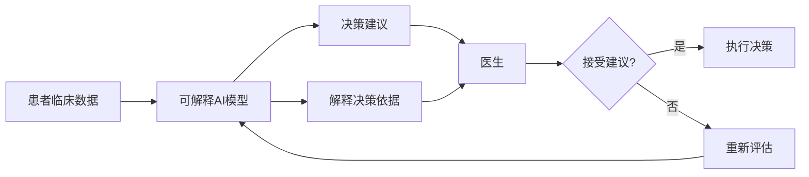

# 可解释AI在临床决策支持系统中的应用研究

> 关键词：可解释AI、临床决策支持系统、医疗应用、算法原理、应用场景

> 摘要：本文聚焦于可解释AI在临床决策支持系统中的应用。首先介绍了相关背景，包括研究目的、预期读者、文档结构和术语定义。接着阐述了可解释AI与临床决策支持系统的核心概念及联系，通过示意图和流程图进行清晰展示。详细讲解了核心算法原理，用Python代码说明具体操作步骤，并给出相关数学模型和公式。通过项目实战，展示了开发环境搭建、源代码实现与解读。分析了可解释AI在临床决策支持系统中的实际应用场景，推荐了学习资源、开发工具框架和相关论文著作。最后总结了未来发展趋势与挑战，还提供了常见问题解答和扩展阅读参考资料，旨在为可解释AI在临床决策支持系统中的应用提供全面深入的研究和指导。

## 1. 背景介绍 
### 1.1 目的和范围
在医疗领域，临床决策支持系统（Clinical Decision Support System, CDSS）旨在帮助医生在复杂的医疗环境中做出更准确、高效的决策。然而，传统的CDSS往往存在决策过程不透明、难以理解的问题。可解释AI（Explainable Artificial Intelligence, XAI）的出现为解决这一问题提供了新的思路。本研究的目的在于深入探讨可解释AI在CDSS中的应用，研究范围涵盖可解释AI的核心概念、算法原理、数学模型，以及在实际临床决策支持中的具体应用案例等方面。

### 1.2 预期读者
本文预期读者包括医疗行业的专业人员，如医生、护士、医疗管理人员等，他们可以通过了解可解释AI在CDSS中的应用，更好地利用技术提升临床决策的质量；同时也面向人工智能领域的研究人员和开发者，为他们在医疗领域的研究和开发提供参考；此外，对医疗技术和人工智能交叉领域感兴趣的学者和爱好者也可以从本文中获取相关知识。

### 1.3 文档结构概述
本文将按照以下结构进行阐述：首先介绍相关背景信息，包括目的、读者和文档结构等；接着详细讲解可解释AI与临床决策支持系统的核心概念及联系；然后阐述核心算法原理和具体操作步骤，并给出相关数学模型和公式；通过项目实战展示代码实现和解读；分析实际应用场景；推荐学习资源、开发工具框架和相关论文著作；最后总结未来发展趋势与挑战，提供常见问题解答和扩展阅读参考资料。

### 1.4 术语表
#### 1.4.1 核心术语定义
- **可解释AI（Explainable Artificial Intelligence, XAI）**：是指能够以人类可理解的方式解释其决策过程和输出结果的人工智能技术。它旨在提高AI系统的透明度和可信度，让用户能够理解AI决策背后的原因。
- **临床决策支持系统（Clinical Decision Support System, CDSS）**：是一种基于计算机技术的医疗辅助系统，它通过整合患者的临床数据、医学知识和决策规则，为临床医生提供决策建议，帮助他们做出更科学、合理的医疗决策。
- **特征重要性（Feature Importance）**：在机器学习中，特征重要性表示每个特征对模型输出结果的影响程度。在可解释AI中，特征重要性可以帮助解释模型决策的依据。
- **局部解释（Local Explanation）**：是指对模型在某个具体输入实例上的决策进行解释，关注的是该实例的特定特征对决策结果的影响。
- **全局解释（Global Explanation）**：是指对模型整体的决策机制进行解释，旨在揭示模型在整个数据集上的一般行为和决策模式。

#### 1.4.2 相关概念解释
- **黑盒模型（Black - Box Model）**：传统的一些AI模型，如深度神经网络，其内部结构复杂，决策过程难以理解，就像一个黑盒子，用户只能看到输入和输出，无法了解模型是如何做出决策的。可解释AI的目标之一就是打破黑盒模型的局限性，使模型决策过程可解释。
- **医学知识图谱（Medical Knowledge Graph）**：是一种将医学领域的知识以图的形式表示的知识库，它包含了医学概念、实体及其之间的关系。在CDSS中，医学知识图谱可以为决策提供丰富的医学背景知识。

#### 1.4.3 缩略词列表
- **XAI**：Explainable Artificial Intelligence（可解释AI）
- **CDSS**：Clinical Decision Support System（临床决策支持系统）
- **ML**：Machine Learning（机器学习）
- **DNN**：Deep Neural Network（深度神经网络）
- **SVM**：Support Vector Machine（支持向量机）

## 2. 核心概念与联系 
### 可解释AI的核心概念
可解释AI的核心目标是使AI系统的决策过程和输出结果能够被人类理解。这涉及到多个方面的技术和方法，包括特征重要性分析、决策规则提取、局部和全局解释等。

从原理上讲，可解释AI通过对模型的输入和输出之间的关系进行分析，找出影响决策的关键因素。例如，在一个疾病诊断模型中，可解释AI可以确定哪些症状（特征）对诊断结果的影响最大。

### 临床决策支持系统的核心概念
临床决策支持系统是基于患者的临床信息（如症状、检查结果、病史等），结合医学知识和决策规则，为临床医生提供决策建议的系统。其核心原理是将医学知识和临床数据进行整合和分析，通过推理机制得出合理的决策建议。

### 可解释AI与临床决策支持系统的联系
可解释AI与临床决策支持系统的结合具有重要意义。在临床决策中，医生需要了解决策建议背后的原因，以便做出更合理的判断。可解释AI可以为CDSS提供透明的决策过程，使医生能够理解系统给出建议的依据。例如，在药物治疗方案推荐中，可解释AI可以解释为什么推荐某种药物，是基于哪些患者特征和医学知识做出的决策。

以下是可解释AI在临床决策支持系统中的工作流程Mermaid流程图：

该流程图展示了可解释AI在临床决策支持系统中的工作过程。首先，系统获取患者的临床数据，输入到可解释AI模型中。模型生成决策建议并提供给医生，医生可以选择接受或拒绝建议。如果拒绝，系统将重新评估。同时，模型会解释决策依据，帮助医生更好地理解建议。

## 3. 核心算法原理 & 具体操作步骤 
### 特征重要性分析算法
特征重要性分析是可解释AI中常用的一种方法，它可以帮助我们了解每个特征对模型决策的影响程度。这里我们以随机森林算法为例，介绍特征重要性分析的原理和具体操作步骤。

#### 算法原理
随机森林是一种集成学习算法，它由多个决策树组成。在随机森林中，每个决策树在构建过程中会随机选择一部分特征进行分裂。通过计算每个特征在所有决策树中的平均分裂增益，可以得到该特征的重要性得分。

#### Python代码实现
```python
import numpy as np
from sklearn.ensemble import RandomForestClassifier
from sklearn.datasets import load_iris

# 加载数据集
iris = load_iris()
X = iris.data
y = iris.target

# 创建随机森林分类器
rf = RandomForestClassifier(n_estimators=100)
rf.fit(X, y)

# 获取特征重要性
feature_importances = rf.feature_importances_

# 打印特征重要性
for i in range(len(iris.feature_names)):
    print(f"{iris.feature_names[i]}: {feature_importances[i]}")
```
#### 代码解释
1. 首先，我们使用`sklearn`库中的`load_iris`函数加载鸢尾花数据集。
2. 然后，创建一个随机森林分类器`RandomForestClassifier`，并使用数据集进行训练。
3. 接着，通过`feature_importances_`属性获取每个特征的重要性得分。
4. 最后，打印每个特征的重要性得分。

### LIME（Local Interpretable Model - agnostic Explanations）算法
LIME是一种局部解释方法，它可以为任何机器学习模型的单个预测提供解释。

#### 算法原理
LIME的基本思想是在待解释的实例周围生成一个局部数据集，然后在这个局部数据集上训练一个简单的可解释模型（如线性回归模型），用这个可解释模型来近似原模型在该实例附近的行为。

#### Python代码实现
```python
import lime
import lime.lime_tabular
from sklearn.datasets import load_breast_cancer
from sklearn.model_selection import train_test_split
from sklearn.ensemble import RandomForestClassifier

# 加载乳腺癌数据集
data = load_breast_cancer()
X = data.data
y = data.target

# 划分训练集和测试集
X_train, X_test, y_train, y_test = train_test_split(X, y, test_size=0.2, random_state=42)

# 训练随机森林分类器
rf = RandomForestClassifier(n_estimators=100)
rf.fit(X_train, y_train)

# 创建LIME解释器
explainer = lime.lime_tabular.LimeTabularExplainer(X_train, feature_names=data.feature_names, class_names=data.target_names, discretize_continuous=True)

# 选择一个测试实例进行解释
idx = 0
exp = explainer.explain_instance(X_test[idx], rf.predict_proba, num_features=5)

# 打印解释结果
print(exp.as_list())
```
#### 代码解释
1. 加载乳腺癌数据集，并将其划分为训练集和测试集。
2. 训练一个随机森林分类器。
3. 创建一个LIME解释器`LimeTabularExplainer`，用于解释表格数据。
4. 选择一个测试实例进行解释，调用`explain_instance`方法生成解释结果。
5. 打印解释结果，结果以列表形式呈现，包含每个特征对预测结果的影响。

## 4. 数学模型和公式 & 详细讲解 & 举例说明 
### 随机森林特征重要性的数学模型
在随机森林中，特征重要性的计算基于基尼不纯度（Gini impurity）或信息增益（Information gain）。这里以基尼不纯度为例进行说明。

#### 基尼不纯度
基尼不纯度是衡量数据集纯度的一个指标，对于一个包含 $n$ 个类别的数据集，其基尼不纯度的计算公式为：
$$Gini = 1 - \sum_{i = 1}^{n}p_{i}^{2}$$
其中，$p_{i}$ 是第 $i$ 个类别的样本在数据集中所占的比例。

#### 特征重要性计算
在随机森林中，每个决策树在构建过程中会根据特征进行分裂，分裂前后的基尼不纯度会发生变化。特征的重要性得分可以通过计算该特征在所有决策树中的平均基尼不纯度减少量来得到。

假设在第 $t$ 棵决策树中，特征 $j$ 在节点 $n$ 处进行分裂，分裂前的基尼不纯度为 $Gini_{n}$，分裂后的左子节点和右子节点的基尼不纯度分别为 $Gini_{left}$ 和 $Gini_{right}$，左子节点和右子节点的样本数分别为 $N_{left}$ 和 $N_{right}$，则该特征在该节点的基尼不纯度减少量为：
$$\Delta Gini_{n}^{j}=Gini_{n}-\frac{N_{left}}{N_{left}+N_{right}}Gini_{left}-\frac{N_{right}}{N_{left}+N_{right}}Gini_{right}$$
特征 $j$ 的重要性得分 $I_{j}$ 为：
$$I_{j}=\frac{1}{T}\sum_{t = 1}^{T}\sum_{n\in N_{t}^{j}}\Delta Gini_{n}^{j}$$
其中，$T$ 是随机森林中决策树的数量，$N_{t}^{j}$ 是第 $t$ 棵决策树中使用特征 $j$ 进行分裂的节点集合。

#### 举例说明
假设我们有一个简单的二分类数据集，包含两个特征 $x_{1}$ 和 $x_{2}$，随机森林中有 3 棵决策树。在第一棵决策树中，特征 $x_{1}$ 在某个节点的基尼不纯度减少量为 0.2，在第二棵决策树中为 0.3，在第三棵决策树中为 0.1。则特征 $x_{1}$ 的重要性得分 $I_{x_{1}}$ 为：
$$I_{x_{1}}=\frac{0.2 + 0.3+0.1}{3}=0.2$$

### LIME的数学模型
LIME的目标是在待解释的实例 $x$ 周围找到一个简单的可解释模型 $g$，使得 $g$ 能够近似原模型 $f$ 在 $x$ 附近的行为。具体来说，LIME通过最小化以下损失函数来训练可解释模型 $g$：
$$\xi(f,g,\pi_{x})=\sum_{z,z'}\pi_{x}(z)(f(z)-g(z))^{2}+\Omega(g)$$
其中，$\pi_{x}(z)$ 是一个距离函数，用于衡量实例 $z$ 与待解释实例 $x$ 的距离，距离越近，权重越大；$\Omega(g)$ 是可解释模型 $g$ 的复杂度惩罚项，用于控制模型的复杂度。

## 5. 项目实战：代码实际案例和详细解释说明 
### 5.1  开发环境搭建
#### 安装Python
首先，确保你已经安装了Python 3.x 版本。可以从Python官方网站（https://www.python.org/downloads/）下载并安装适合你操作系统的Python版本。

#### 安装必要的库
在命令行中使用`pip`命令安装以下必要的库：
```sh
pip install numpy scikit-learn lime pandas matplotlib
```
- `numpy`：用于数值计算。
- `scikit-learn`：提供了丰富的机器学习算法和工具。
- `lime`：用于实现局部解释。
- `pandas`：用于数据处理和分析。
- `matplotlib`：用于数据可视化。

### 5.2  源代码详细实现和代码解读
#### 项目背景
我们将构建一个基于可解释AI的临床决策支持系统，用于预测患者是否患有心脏病。数据集包含患者的年龄、性别、血压等特征。

#### 代码实现
```python
import pandas as pd
from sklearn.model_selection import train_test_split
from sklearn.ensemble import RandomForestClassifier
from sklearn.metrics import accuracy_score
import lime
import lime.lime_tabular
import matplotlib.pyplot as plt

# 加载数据集
data = pd.read_csv('heart_disease.csv')
X = data.drop('target', axis=1)
y = data['target']

# 划分训练集和测试集
X_train, X_test, y_train, y_test = train_test_split(X, y, test_size=0.2, random_state=42)

# 训练随机森林分类器
rf = RandomForestClassifier(n_estimators=100)
rf.fit(X_train, y_train)

# 预测测试集
y_pred = rf.predict(X_test)

# 计算准确率
accuracy = accuracy_score(y_test, y_pred)
print(f"Accuracy: {accuracy}")

# 创建LIME解释器
explainer = lime.lime_tabular.LimeTabularExplainer(X_train.values, feature_names=X_train.columns, class_names=['No Heart Disease', 'Heart Disease'], discretize_continuous=True)

# 选择一个测试实例进行解释
idx = 0
exp = explainer.explain_instance(X_test.values[idx], rf.predict_proba, num_features=5)

# 可视化解释结果
exp.as_pyplot_figure()
plt.show()
```
#### 代码解读
1. **数据加载和预处理**：使用`pandas`库加载心脏病数据集，并将特征和标签分离。
2. **数据集划分**：使用`train_test_split`函数将数据集划分为训练集和测试集，测试集占比为 20%。
3. **模型训练**：使用随机森林分类器进行训练。
4. **模型预测和评估**：使用训练好的模型对测试集进行预测，并计算准确率。
5. **创建LIME解释器**：使用`LimeTabularExplainer`创建一个LIME解释器，用于解释表格数据。
6. **选择实例进行解释**：选择一个测试实例进行解释，调用`explain_instance`方法生成解释结果。
7. **可视化解释结果**：使用`as_pyplot_figure`方法将解释结果可视化。

### 5.3  代码解读与分析
通过上述代码，我们实现了一个基于可解释AI的临床决策支持系统。首先，我们使用随机森林分类器对心脏病数据进行训练和预测，得到了一定的准确率。然后，使用LIME方法对单个预测结果进行解释，通过可视化结果可以直观地看到哪些特征对预测结果的影响最大。

在实际应用中，医生可以根据这些解释结果更好地理解模型的决策依据，从而做出更合理的临床决策。例如，如果某个患者的预测结果为患有心脏病，解释结果显示该患者的血压和胆固醇水平对预测结果的影响较大，医生可以进一步关注这些指标，并采取相应的治疗措施。

## 6. 实际应用场景 
### 疾病诊断
在疾病诊断中，可解释AI可以帮助医生更准确地理解模型的诊断结果。例如，在癌症诊断中，可解释AI可以分析患者的影像数据（如X光、CT等）和临床信息，给出诊断结果并解释决策依据。医生可以根据这些解释，判断模型的诊断是否合理，是否需要进一步进行检查或采取不同的治疗方案。

### 治疗方案推荐
可解释AI可以根据患者的病情、基因信息、药物过敏史等因素，为医生推荐合适的治疗方案，并解释为什么选择这些方案。例如，在糖尿病治疗中，可解释AI可以分析患者的血糖水平、并发症情况等，推荐适合的药物治疗方案，并说明该方案的疗效和可能的副作用的依据。

### 医疗风险评估
在手术、化疗等医疗操作前，可解释AI可以对患者的医疗风险进行评估，如手术死亡率、并发症发生率等。同时，解释评估结果的依据，让医生和患者更好地了解风险情况，做出更明智的决策。例如，在心脏手术前，可解释AI可以分析患者的心脏功能、年龄、病史等因素，评估手术风险，并解释哪些因素对风险评估的影响最大。

### 医疗资源分配
在医疗资源有限的情况下，可解释AI可以帮助医院合理分配医疗资源。例如，根据患者的病情严重程度、治疗需求等因素，对患者进行优先级排序，并解释排序的依据。这样可以确保医疗资源优先分配给最需要的患者，提高医疗资源的利用效率。

## 7. 工具和资源推荐
### 7.1 学习资源推荐
#### 7.1.1 书籍推荐
- 《可解释人工智能：算法原理与应用》：本书系统地介绍了可解释AI的基本概念、算法原理和实际应用案例，对于初学者来说是一本很好的入门书籍。
- 《医疗人工智能：从算法到应用》：该书聚焦于人工智能在医疗领域的应用，包括临床决策支持系统等方面的内容，同时也涉及到可解释AI的相关知识。

#### 7.1.2 在线课程
- Coursera上的“Explainable AI”课程：由知名高校的教授授课，课程内容涵盖可解释AI的多个方面，包括算法原理、评估方法等。
- edX上的“Artificial Intelligence in Healthcare”课程：该课程介绍了人工智能在医疗领域的各种应用，其中也包含了可解释AI在临床决策支持系统中的应用案例。

#### 7.1.3 技术博客和网站
- Towards Data Science：这是一个知名的数据科学和人工智能博客平台，上面有很多关于可解释AI的文章和案例分享。
- KDnuggets：提供了丰富的数据科学和机器学习资源，包括可解释AI的最新研究成果和应用案例。

### 7.2 开发工具框架推荐
#### 7.2.1 IDE和编辑器
- PyCharm：是一款专门为Python开发设计的集成开发环境，具有强大的代码编辑、调试和项目管理功能。
- Jupyter Notebook：是一个交互式的开发环境，适合进行数据分析、模型训练和结果展示等工作。

#### 7.2.2 调试和性能分析工具
- TensorBoard：是TensorFlow的可视化工具，可以用于可视化模型的训练过程、性能指标等。
- Scikit - learn的`cross_val_score`函数：可以用于模型的交叉验证和性能评估，帮助开发者选择合适的模型和参数。

#### 7.2.3 相关框架和库
- LIME：用于实现局部解释的Python库，支持多种机器学习模型的解释。
- SHAP（SHapley Additive exPlanations）：是一种基于博弈论的特征重要性分析方法，提供了Python和R的实现库。

### 7.3 相关论文著作推荐
#### 7.3.1 经典论文
- “Why Should I Trust You?” Explaining the Predictions of Any Classifier：该论文介绍了LIME方法的原理和应用，是可解释AI领域的经典论文之一。
- A Unified Approach to Interpreting Model Predictions：提出了SHAP方法，为可解释AI提供了一种统一的解释框架。

#### 7.3.2 最新研究成果
- 关注顶级学术会议（如NeurIPS、ICML等）和期刊（如Journal of Artificial Intelligence Research）上发表的关于可解释AI在医疗领域应用的最新研究论文。

#### 7.3.3 应用案例分析
- 一些知名的医疗研究机构（如Mayo Clinic、Cleveland Clinic等）会发布可解释AI在临床决策支持系统中的应用案例报告，可以从中了解实际应用中的经验和挑战。

## 8. 总结：未来发展趋势与挑战
### 未来发展趋势
- **多模态数据融合**：未来的可解释AI在临床决策支持系统中将更多地融合多模态数据，如影像数据、基因数据、临床文本数据等。通过综合分析多种类型的数据，可以提高决策的准确性和可靠性。
- **与医学知识图谱深度结合**：可解释AI将与医学知识图谱更紧密地结合，利用知识图谱中的丰富医学知识来增强解释的可信度和专业性。例如，在解释决策时，可以引用知识图谱中的医学原理和临床指南。
- **个性化解释**：为了满足不同医生和患者的需求，可解释AI将提供更加个性化的解释方式。例如，根据医生的专业背景和经验，提供不同详细程度的解释；为患者提供通俗易懂的解释，帮助他们更好地理解治疗方案。

### 挑战
- **数据质量和隐私问题**：医疗数据的质量参差不齐，存在数据缺失、错误等问题，这会影响可解释AI模型的性能和解释的准确性。同时，医疗数据涉及患者的隐私，如何在保证数据安全和隐私的前提下进行数据挖掘和分析是一个重要的挑战。
- **解释的准确性和可靠性**：虽然可解释AI可以提供决策的解释，但解释的准确性和可靠性仍然是一个问题。一些解释方法可能存在偏差或局限性，需要进一步研究和改进。
- **医生和患者的接受度**：医生和患者对可解释AI的接受度也是一个挑战。医生可能习惯于传统的决策方式，对新技术的信任度需要逐步建立；患者可能对复杂的解释难以理解，需要设计更加友好的交互界面和解释方式。

## 9. 附录：常见问题与解答
### 问题1：可解释AI是否会完全取代医生的决策？
解答：不会。可解释AI只是为医生提供决策建议和解释，辅助医生做出更准确、合理的决策。医疗决策涉及到很多复杂的因素，如患者的心理状态、社会背景等，这些因素是目前AI难以完全考虑到的。医生的专业知识和临床经验仍然是不可或缺的。

### 问题2：可解释AI的解释结果是否一定准确？
解答：不一定。可解释AI的解释结果受到多种因素的影响，如模型的质量、数据的准确性等。一些解释方法可能存在一定的局限性，只能提供近似的解释。因此，在使用可解释AI的解释结果时，需要结合医生的专业判断。

### 问题3：如何评估可解释AI的解释质量？
解答：评估可解释AI的解释质量是一个复杂的问题。目前常用的评估指标包括解释的可理解性、准确性、一致性等。可以通过人工评估和自动评估相结合的方式进行评估。人工评估可以邀请医生和领域专家对解释结果进行打分；自动评估可以使用一些预先定义的指标进行计算。

## 10. 扩展阅读 & 参考资料
- [1] Miller, T. (2019). Explanation in artificial intelligence: Insights from the social sciences. Artificial Intelligence, 267, 1-38.
- [2] Ribeiro, M. T., Singh, S., & Guestrin, C. (2016). “Why should I trust you?”: Explaining the predictions of any classifier. In Proceedings of the 22nd ACM SIGKDD international conference on knowledge discovery and data mining (pp. 1135-1144).
- [3] Lundberg, S. M., & Lee, S. I. (2017). A unified approach to interpreting model predictions. In Advances in neural information processing systems (pp. 4765-4774).

作者：AI天才研究院/AI Genius Institute & 禅与计算机程序设计艺术 /Zen And The Art of Computer Programming