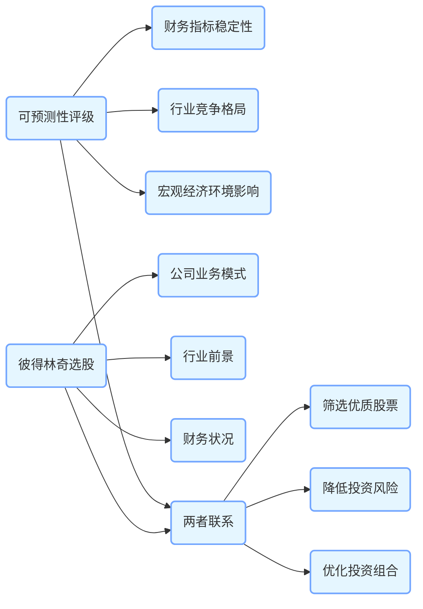

# 可预测性评级在彼得林奇选股中的作用

> 关键词：可预测性评级、彼得林奇选股、股票投资、财务分析、投资策略

> 摘要：本文深入探讨了可预测性评级在彼得林奇选股方法中的重要作用。彼得林奇作为投资界的传奇人物，其选股策略备受关注。可预测性评级为投资者评估股票的稳定性和未来发展趋势提供了关键视角。文章首先介绍了相关背景，包括目的范围、预期读者等内容。接着阐述了可预测性评级和彼得林奇选股的核心概念及联系，通过详细的算法原理和操作步骤进行分析，结合数学模型和公式加以说明。通过项目实战案例，展示了可预测性评级在实际选股中的应用。同时，探讨了其实际应用场景，推荐了相关的学习工具和资源。最后总结了未来发展趋势与挑战，并对常见问题进行了解答，为投资者在运用可预测性评级进行选股时提供全面的参考。

## 1. 背景介绍 
### 1.1 目的和范围
本文章旨在全面剖析可预测性评级在彼得林奇选股策略中的具体作用。通过对相关概念、算法、数学模型的深入探讨，结合实际案例和应用场景，为投资者提供一个系统的视角来理解和运用可预测性评级进行股票投资。范围涵盖了可预测性评级的基本原理、与彼得林奇选股方法的结合方式、在实际投资中的应用以及相关的工具和资源等方面。

### 1.2 预期读者
本文的预期读者主要包括对股票投资感兴趣的个人投资者、金融专业学生、投资分析师以及从事证券研究的专业人士。对于希望深入了解彼得林奇选股策略并运用可预测性评级来优化投资决策的人群具有较高的参考价值。

### 1.3 文档结构概述
本文将按照以下结构进行阐述：首先介绍相关核心概念和它们之间的联系，通过文本示意图和 Mermaid 流程图进行清晰展示；接着详细讲解可预测性评级的核心算法原理和具体操作步骤，并用 Python 源代码进行说明；然后介绍相关的数学模型和公式，并举例进行详细讲解；通过项目实战案例，展示如何在实际中运用可预测性评级进行选股；探讨可预测性评级的实际应用场景；推荐相关的学习工具和资源；最后总结未来发展趋势与挑战，解答常见问题，并提供扩展阅读和参考资料。

### 1.4 术语表
#### 1.4.1 核心术语定义
- **可预测性评级**：是一种对公司未来业绩、财务状况等方面可预测程度的评估指标，通过分析公司的历史数据、行业特点等因素，给出一个综合的评级，用于判断公司未来发展的稳定性和可预测性。
- **彼得林奇选股**：是由著名投资家彼得林奇提出的一套选股方法，强调通过深入研究公司的基本面、业务模式、行业前景等因素，寻找具有投资价值的股票。

#### 1.4.2 相关概念解释
- **基本面分析**：是一种通过研究公司的财务报表、经营状况、行业竞争力等基本面因素来评估股票价值的方法。在彼得林奇选股中，基本面分析是核心内容之一。
- **成长股**：指那些具有持续增长潜力的公司股票，通常表现为营业收入、净利润等指标的快速增长。彼得林奇非常注重寻找成长股。

#### 1.4.3 缩略词列表
- **EPS**：Earnings Per Share，每股收益，是衡量公司盈利能力的重要指标之一。
- **PE**：Price-to-Earnings Ratio，市盈率，反映了股票价格与每股收益之间的关系，用于评估股票的估值水平。

## 2. 核心概念与联系 

### 可预测性评级原理
可预测性评级主要基于对公司历史数据的分析和对行业趋势的判断。其核心思想是，如果一个公司的业绩和财务状况在过去具有较高的稳定性和规律性，那么其未来的发展也更有可能是可预测的。具体来说，会考虑以下几个方面的因素：
- **财务指标的稳定性**：如营业收入、净利润、每股收益等指标的波动情况。如果这些指标在多年内保持相对稳定的增长或波动较小，说明公司的经营状况较为稳定，可预测性较高。
- **行业竞争格局**：处于稳定行业且具有较强竞争优势的公司，其未来业绩更易预测。例如，一些行业龙头企业，由于其在市场份额、技术实力、品牌影响力等方面的优势，能够更好地抵御市场波动和竞争对手的挑战。
- **宏观经济环境的影响**：某些行业对宏观经济环境的变化较为敏感，如周期性行业（钢铁、煤炭等）。而一些非周期性行业（食品、医药等）受宏观经济波动的影响相对较小，其业绩的可预测性也相对较高。

### 彼得林奇选股原理
彼得林奇选股方法强调自下而上的选股策略，即从公司的基本面出发，寻找具有投资价值的股票。他注重以下几个方面：
- **公司的业务模式**：选择那些业务简单易懂、具有独特竞争优势的公司。例如，他喜欢投资那些在日常生活中能够接触到的公司，如零售业、餐饮业等。
- **行业前景**：关注具有良好发展前景的行业，如新兴科技行业、消费升级行业等。他认为，在一个快速增长的行业中，即使是普通的公司也有可能获得较好的发展机会。
- **财务状况**：分析公司的财务报表，关注公司的盈利能力、偿债能力、现金流等指标。他偏好那些具有较高净资产收益率（ROE）、较低负债率和充足现金流的公司。

### 两者的联系
可预测性评级在彼得林奇选股中起着重要的辅助作用。通过对公司进行可预测性评级，投资者可以更好地评估公司未来业绩的稳定性和可靠性，从而筛选出更符合彼得林奇选股标准的股票。具体来说：
- **筛选优质股票**：可预测性评级较高的公司，其未来业绩更有可能符合彼得林奇对成长股的预期。这些公司通常具有稳定的经营模式和良好的财务状况，能够为投资者带来较为稳定的回报。
- **降低投资风险**：在选股过程中，可预测性评级可以帮助投资者识别那些业绩波动较大、不确定性较高的公司，从而避免投资这些风险较高的股票。这与彼得林奇注重风险控制的投资理念相契合。
- **优化投资组合**：将可预测性评级纳入选股考虑因素，可以使投资组合更加多元化和稳定。投资者可以选择不同可预测性评级的股票进行搭配，以平衡投资组合的风险和收益。

### 文本示意图
```plaintext
可预测性评级
|-- 财务指标稳定性
|   |-- 营业收入波动
|   |-- 净利润波动
|   |-- 每股收益波动
|-- 行业竞争格局
|   |-- 市场份额
|   |-- 技术实力
|   |-- 品牌影响力
|-- 宏观经济环境影响
|   |-- 周期性行业敏感度
|   |-- 非周期性行业稳定性

彼得林奇选股
|-- 公司业务模式
|   |-- 业务简单易懂
|   |-- 独特竞争优势
|-- 行业前景
|   |-- 新兴科技行业
|   |-- 消费升级行业
|-- 财务状况
|   |-- 净资产收益率
|   |-- 负债率
|   |-- 现金流

两者联系
|-- 筛选优质股票
|-- 降低投资风险
|-- 优化投资组合
```

### Mermaid 流程图


## 3. 核心算法原理 & 具体操作步骤 

### 核心算法原理
可预测性评级的核心算法主要基于对公司历史财务数据的统计分析和机器学习模型的应用。以下是一种常见的算法思路：
- **数据收集**：收集公司过去多年的财务报表数据，包括营业收入、净利润、每股收益等核心指标。同时，收集行业相关数据，如行业平均增长率、行业竞争格局等。
- **特征提取**：从收集到的数据中提取能够反映公司可预测性的特征。例如，计算财务指标的标准差、变异系数等，以衡量其波动程度；计算公司在行业中的市场份额变化率，以评估其竞争地位的稳定性。
- **模型训练**：选择合适的机器学习模型，如逻辑回归、决策树、随机森林等，对提取的特征进行训练。模型的目标是根据历史数据预测公司未来业绩的可预测性。
- **评级计算**：根据训练好的模型，对新的公司数据进行预测，得到一个可预测性评分。根据评分范围，将公司分为不同的可预测性等级，如高、中、低三个等级。

### 具体操作步骤
#### 步骤 1：数据收集
使用 Python 的`pandas`库和`yfinance`库来收集公司的财务数据。以下是一个示例代码：
```python
import pandas as pd
import yfinance as yf

# 定义股票代码
ticker = 'AAPL'

# 获取股票历史数据
data = yf.download(ticker, start='2010-01-01', end='2023-12-31')

# 获取财务报表数据
stock = yf.Ticker(ticker)
financials = stock.financials
balancesheet = stock.balance_sheet
cashflow = stock.cashflow

# 保存数据到 CSV 文件
data.to_csv('stock_history.csv')
financials.to_csv('financials.csv')
balancesheet.to_csv('balancesheet.csv')
cashflow.to_csv('cashflow.csv')
```
#### 步骤 2：特征提取
对收集到的财务数据进行处理，提取相关特征。以下是一个示例代码：
```python
import pandas as pd
import numpy as np

# 读取财务数据
financials = pd.read_csv('financials.csv')

# 提取营业收入和净利润数据
revenue = financials.loc['Total Revenue'].values
net_income = financials.loc['Net Income'].values

# 计算营业收入和净利润的标准差和变异系数
revenue_std = np.std(revenue)
revenue_cv = revenue_std / np.mean(revenue)
net_income_std = np.std(net_income)
net_income_cv = net_income_std / np.mean(net_income)

# 打印结果
print(f'营业收入标准差: {revenue_std}')
print(f'营业收入变异系数: {revenue_cv}')
print(f'净利润标准差: {net_income_std}')
print(f'净利润变异系数: {net_income_cv}')
```
#### 步骤 3：模型训练
使用`scikit-learn`库中的逻辑回归模型进行训练。以下是一个示例代码：
```python
from sklearn.linear_model import LogisticRegression
from sklearn.model_selection import train_test_split
from sklearn.metrics import accuracy_score
import pandas as pd
import numpy as np

# 读取特征数据
features = pd.read_csv('features.csv')
labels = pd.read_csv('labels.csv')

# 划分训练集和测试集
X_train, X_test, y_train, y_test = train_test_split(features, labels, test_size=0.2, random_state=42)

# 创建逻辑回归模型
model = LogisticRegression()

# 训练模型
model.fit(X_train, y_train)

# 在测试集上进行预测
y_pred = model.predict(X_test)

# 计算准确率
accuracy = accuracy_score(y_test, y_pred)
print(f'模型准确率: {accuracy}')
```
#### 步骤 4：评级计算
根据训练好的模型，对新的公司数据进行预测，得到可预测性评分，并进行评级。以下是一个示例代码：
```python
# 读取新的公司数据
new_data = pd.read_csv('new_data.csv')

# 使用训练好的模型进行预测
predictions = model.predict_proba(new_data)

# 获取可预测性评分
scores = predictions[:, 1]

# 根据评分进行评级
ratings = []
for score in scores:
    if score >= 0.8:
        ratings.append('高')
    elif score >= 0.5:
        ratings.append('中')
    else:
        ratings.append('低')

# 打印评级结果
print('可预测性评级结果:', ratings)
```

## 4. 数学模型和公式 & 详细讲解 & 举例说明 

### 标准差和变异系数
标准差是衡量数据离散程度的统计量，计算公式为：
$$
\sigma = \sqrt{\frac{1}{n} \sum_{i=1}^{n} (x_i - \mu)^2}
$$
其中，$\sigma$ 表示标准差，$n$ 表示数据的个数，$x_i$ 表示第 $i$ 个数据，$\mu$ 表示数据的均值。

变异系数是标准差与均值的比值，用于比较不同数据集的离散程度，计算公式为：
$$
CV = \frac{\sigma}{\mu}
$$
其中，$CV$ 表示变异系数。

举例说明：假设有两家公司 A 和 B，它们过去 5 年的营业收入数据如下：
- 公司 A：[100, 110, 120, 130, 140]
- 公司 B：[80, 100, 120, 140, 160]

首先计算公司 A 的均值和标准差：
$$
\mu_A = \frac{100 + 110 + 120 + 130 + 140}{5} = 120
$$
$$
\sigma_A = \sqrt{\frac{(100 - 120)^2 + (110 - 120)^2 + (120 - 120)^2 + (130 - 120)^2 + (140 - 120)^2}{5}} \approx 14.14
$$
然后计算公司 A 的变异系数：
$$
CV_A = \frac{14.14}{120} \approx 0.12
$$

接着计算公司 B 的均值和标准差：
$$
\mu_B = \frac{80 + 100 + 120 + 140 + 160}{5} = 120
$$
$$
\sigma_B = \sqrt{\frac{(80 - 120)^2 + (100 - 120)^2 + (120 - 120)^2 + (140 - 120)^2 + (160 - 120)^2}{5}} \approx 28.28
$$
最后计算公司 B 的变异系数：
$$
CV_B = \frac{28.28}{120} \approx 0.24
$$

从计算结果可以看出，公司 A 的变异系数小于公司 B，说明公司 A 的营业收入数据更加稳定，可预测性更高。

### 逻辑回归模型
逻辑回归是一种常用的分类算法，用于预测事件发生的概率。其基本原理是通过一个逻辑函数将线性回归的结果映射到 [0, 1] 区间，逻辑函数的公式为：
$$
P(y = 1|x) = \frac{1}{1 + e^{-(w_0 + w_1x_1 + w_2x_2 + \cdots + w_nx_n)}}
$$
其中，$P(y = 1|x)$ 表示在给定特征 $x$ 的情况下，事件发生的概率，$w_0, w_1, w_2, \cdots, w_n$ 是模型的参数，$x_1, x_2, \cdots, x_n$ 是特征变量。

在训练逻辑回归模型时，通常使用最大似然估计来求解模型的参数。最大似然估计的目标是找到一组参数，使得训练数据的似然函数最大。似然函数的公式为：
$$
L(w) = \prod_{i=1}^{n} P(y_i|x_i; w)^{y_i} (1 - P(y_i|x_i; w))^{1 - y_i}
$$
其中，$n$ 表示训练数据的个数，$y_i$ 表示第 $i$ 个样本的标签，$x_i$ 表示第 $i$ 个样本的特征。

为了方便计算，通常对似然函数取对数，得到对数似然函数：
$$
\log L(w) = \sum_{i=1}^{n} [y_i \log P(y_i|x_i; w) + (1 - y_i) \log (1 - P(y_i|x_i; w))]
$$

通过最大化对数似然函数，可以得到模型的最优参数。

举例说明：假设有一个简单的二分类问题，特征变量为 $x$，标签变量为 $y$。训练数据如下：
| $x$ | $y$ |
| --- | --- |
| 1 | 1 |
| 2 | 1 |
| 3 | 0 |
| 4 | 0 |

使用逻辑回归模型进行训练，最终得到模型的参数 $w_0 = -2$，$w_1 = 1$。则对于新的特征 $x = 2.5$，可以计算其发生事件的概率：
$$
P(y = 1|x = 2.5) = \frac{1}{1 + e^{-(-2 + 1 \times 2.5)}} \approx 0.62
$$

根据设定的阈值（如 0.5），可以判断该样本的预测标签为 1。

## 5. 项目实战：代码实际案例和详细解释说明 

### 5.1  开发环境搭建
#### 安装 Python
首先需要安装 Python 环境，建议使用 Python 3.7 及以上版本。可以从 Python 官方网站（https://www.python.org/downloads/）下载并安装适合自己操作系统的 Python 版本。

#### 安装必要的库
使用`pip`命令安装项目所需的库，包括`pandas`、`yfinance`、`scikit-learn`等。在命令行中执行以下命令：
```sh
pip install pandas yfinance scikit-learn
```

### 5.2  源代码详细实现和代码解读
#### 数据收集模块
```python
import pandas as pd
import yfinance as yf

def collect_data(ticker, start_date, end_date):
    # 获取股票历史数据
    data = yf.download(ticker, start=start_date, end=end_date)
    
    # 获取财务报表数据
    stock = yf.Ticker(ticker)
    financials = stock.financials
    balancesheet = stock.balance_sheet
    cashflow = stock.cashflow
    
    # 保存数据到 CSV 文件
    data.to_csv('stock_history.csv')
    financials.to_csv('financials.csv')
    balancesheet.to_csv('balancesheet.csv')
    cashflow.to_csv('cashflow.csv')
    
    return data, financials, balancesheet, cashflow

# 示例调用
ticker = 'AAPL'
start_date = '2010-01-01'
end_date = '2023-12-31'
data, financials, balancesheet, cashflow = collect_data(ticker, start_date, end_date)
```
代码解读：该模块使用`yfinance`库收集指定股票的历史数据和财务报表数据，并将数据保存到 CSV 文件中。通过`yf.download`函数获取股票的历史价格数据，通过`yf.Ticker`对象获取财务报表数据。

#### 特征提取模块
```python
import pandas as pd
import numpy as np

def extract_features(financials):
    # 提取营业收入和净利润数据
    revenue = financials.loc['Total Revenue'].values
    net_income = financials.loc['Net Income'].values
    
    # 计算营业收入和净利润的标准差和变异系数
    revenue_std = np.std(revenue)
    revenue_cv = revenue_std / np.mean(revenue)
    net_income_std = np.std(net_income)
    net_income_cv = net_income_std / np.mean(net_income)
    
    # 创建特征 DataFrame
    features = pd.DataFrame({
        'revenue_std': [revenue_std],
        'revenue_cv': [revenue_cv],
        'net_income_std': [net_income_std],
        'net_income_cv': [net_income_cv]
    })
    
    return features

# 示例调用
features = extract_features(financials)
```
代码解读：该模块从财务报表数据中提取营业收入和净利润数据，并计算它们的标准差和变异系数。最后将这些特征保存到一个`DataFrame`中。

#### 模型训练模块
```python
from sklearn.linear_model import LogisticRegression
from sklearn.model_selection import train_test_split
from sklearn.metrics import accuracy_score
import pandas as pd
import numpy as np

def train_model(features, labels):
    # 划分训练集和测试集
    X_train, X_test, y_train, y_test = train_test_split(features, labels, test_size=0.2, random_state=42)
    
    # 创建逻辑回归模型
    model = LogisticRegression()
    
    # 训练模型
    model.fit(X_train, y_train)
    
    # 在测试集上进行预测
    y_pred = model.predict(X_test)
    
    # 计算准确率
    accuracy = accuracy_score(y_test, y_pred)
    print(f'模型准确率: {accuracy}')
    
    return model

# 示例调用
labels = pd.read_csv('labels.csv')
model = train_model(features, labels)
```
代码解读：该模块使用`scikit-learn`库中的逻辑回归模型进行训练。首先将特征数据和标签数据划分为训练集和测试集，然后创建逻辑回归模型并进行训练。最后在测试集上进行预测，并计算模型的准确率。

#### 评级计算模块
```python
def calculate_ratings(model, new_data):
    # 使用训练好的模型进行预测
    predictions = model.predict_proba(new_data)
    
    # 获取可预测性评分
    scores = predictions[:, 1]
    
    # 根据评分进行评级
    ratings = []
    for score in scores:
        if score >= 0.8:
            ratings.append('高')
        elif score >= 0.5:
            ratings.append('中')
        else:
            ratings.append('低')
    
    return ratings

# 示例调用
new_data = pd.read_csv('new_data.csv')
ratings = calculate_ratings(model, new_data)
print('可预测性评级结果:', ratings)
```
代码解读：该模块使用训练好的模型对新的公司数据进行预测，得到可预测性评分，并根据评分进行评级。评分大于等于 0.8 为高可预测性，评分大于等于 0.5 为中等可预测性，评分小于 0.5 为低可预测性。

### 5.3  代码解读与分析
#### 数据收集部分
通过`yfinance`库可以方便地获取股票的历史数据和财务报表数据。这些数据是后续分析和建模的基础。需要注意的是，`yfinance`库获取的数据可能存在一定的延迟和不准确性，在实际应用中可以考虑使用专业的金融数据提供商。

#### 特征提取部分
标准差和变异系数是衡量数据稳定性的重要指标。通过计算营业收入和净利润的标准差和变异系数，可以评估公司业绩的波动程度。波动程度越小，说明公司的可预测性越高。

#### 模型训练部分
逻辑回归模型是一种简单而有效的分类模型。在训练过程中，通过最大化对数似然函数来求解模型的参数。模型的准确率可以作为评估模型性能的指标，但在实际应用中还需要考虑其他指标，如召回率、F1 值等。

#### 评级计算部分
根据模型预测的可预测性评分进行评级，可以直观地了解公司的可预测性水平。在实际应用中，可以根据不同的投资策略和风险偏好，调整评级的阈值。

## 6. 实际应用场景 
### 股票筛选
投资者可以使用可预测性评级来筛选符合彼得林奇选股标准的股票。优先选择可预测性评级较高的公司，这些公司的未来业绩更有可能符合投资者的预期，从而降低投资风险。例如，在构建投资组合时，可以将可预测性评级作为一个重要的筛选条件，排除那些业绩波动较大、不确定性较高的公司。

### 风险评估
可预测性评级可以帮助投资者评估投资组合的风险水平。如果投资组合中包含较多可预测性评级较低的股票，那么整个投资组合的风险可能会较高。投资者可以根据可预测性评级对投资组合进行调整，以平衡风险和收益。例如，增加可预测性评级较高的股票的比例，减少可预测性评级较低的股票的比例。

### 长期投资决策
对于长期投资者来说，可预测性评级尤为重要。长期投资需要对公司的未来发展有较为准确的预测，可预测性评级较高的公司更有可能在长期内保持稳定的业绩增长。投资者可以将可预测性评级作为长期投资决策的重要参考，选择那些具有较高可预测性的公司进行长期投资。

### 行业比较
可预测性评级还可以用于不同行业之间的比较。不同行业的可预测性水平可能存在较大差异，投资者可以通过比较不同行业的可预测性评级，选择那些可预测性较高的行业进行投资。例如，一些非周期性行业（如食品、医药等）的可预测性通常较高，而一些周期性行业（如钢铁、煤炭等）的可预测性相对较低。

## 7. 工具和资源推荐
### 7.1 学习资源推荐
#### 7.1.1 书籍推荐
- 《彼得林奇的成功投资》：彼得林奇本人所著，详细介绍了他的选股方法和投资理念，是学习彼得林奇选股的经典之作。
- 《聪明的投资者》：本杰明·格雷厄姆所著，被誉为投资界的圣经，书中介绍了价值投资的基本原理和方法，对理解股票投资有很大帮助。
- 《财务报表分析与证券定价》：斯蒂芬·佩因曼所著，深入讲解了如何通过分析财务报表来评估公司的价值，是学习基本面分析的重要书籍。

#### 7.1.2 在线课程
- Coursera 上的“投资学原理”课程：由知名大学教授授课，系统介绍了投资学的基本原理和方法，包括股票投资、债券投资、投资组合理论等内容。
- Udemy 上的“股票投资实战课程”：通过实际案例和操作演示，讲解如何进行股票投资，适合初学者学习。
- 中国大学 MOOC 上的“金融市场与金融机构”课程：介绍了金融市场的基本概念和运行机制，以及金融机构的作用和功能，对理解股票市场有很大帮助。

#### 7.1.3 技术博客和网站
- 雪球网：国内知名的投资社区，提供股票行情、财经新闻、投资分析等内容，投资者可以在上面交流投资经验和心得。
- 东方财富网：提供全面的金融信息和数据服务，包括股票行情、基金净值、财经新闻等内容，是投资者获取信息的重要渠道。
- Seeking Alpha：国外知名的投资分析网站，提供专业的股票分析和投资建议，适合有一定投资经验的投资者参考。

### 7.2 开发工具框架推荐
#### 7.2.1 IDE和编辑器
- PyCharm：一款专业的 Python 集成开发环境，提供代码编辑、调试、版本控制等功能，适合开发 Python 程序。
- Jupyter Notebook：一种交互式的开发环境，支持 Python、R 等多种编程语言，适合进行数据分析和模型训练。
- Visual Studio Code：一款轻量级的代码编辑器，支持多种编程语言和插件扩展，适合快速开发和调试代码。

#### 7.2.2 调试和性能分析工具
- PDB：Python 自带的调试工具，可以帮助开发者定位和解决代码中的问题。
- cProfile：Python 标准库中的性能分析工具，可以分析代码的运行时间和内存使用情况，帮助开发者优化代码性能。
- Py-Spy：一款轻量级的 Python 性能分析工具，可以实时监测 Python 程序的性能，找出性能瓶颈。

#### 7.2.3 相关框架和库
- Pandas：用于数据处理和分析的 Python 库，提供了丰富的数据结构和函数，方便进行数据清洗、转换和分析。
- NumPy：用于科学计算的 Python 库，提供了高效的数组操作和数学函数，是很多数据分析和机器学习库的基础。
- Scikit-learn：用于机器学习的 Python 库，提供了各种机器学习算法和工具，如分类、回归、聚类等，方便进行模型训练和评估。

### 7.3 相关论文著作推荐
#### 7.3.1 经典论文
- “The Cross-Section of Expected Stock Returns”：由 Eugene F. Fama 和 Kenneth R. French 发表，提出了著名的 Fama-French 三因子模型，对股票收益率的影响因素进行了深入研究。
- “Capital Asset Prices: A Theory of Market Equilibrium Under Conditions of Risk”：由 William F. Sharpe 发表，提出了资本资产定价模型（CAPM），为资产定价和投资组合理论奠定了基础。
- “Efficient Capital Markets: A Review of Theory and Empirical Work”：由 Eugene F. Fama 发表，对有效市场假说进行了系统的阐述和总结，是金融领域的经典论文之一。

#### 7.3.2 最新研究成果
- 关注顶级金融学术期刊，如《Journal of Finance》、《Review of Financial Studies》等，这些期刊上发表的最新研究成果可以帮助投资者了解股票投资领域的前沿动态。
- 参加金融学术会议，如美国金融协会（AFA）年会、欧洲金融协会（EFA）年会等，与国内外的学者和专家进行交流和探讨，获取最新的研究信息。

#### 7.3.3 应用案例分析
- 一些金融研究机构和投资公司会发布股票投资的应用案例分析报告，投资者可以参考这些报告，学习如何将理论知识应用到实际投资中。
- 关注财经媒体的报道，如《财经》、《证券时报》等，这些媒体会对一些成功的投资案例进行分析和解读，帮助投资者了解投资策略和方法。

## 8. 总结：未来发展趋势与挑战
### 未来发展趋势
#### 数据驱动的投资决策
随着金融科技的发展，数据的获取和分析变得更加便捷和高效。未来，可预测性评级将更多地依赖于大数据和人工智能技术，通过对海量的金融数据、行业数据和企业数据进行分析和挖掘，提高评级的准确性和可靠性。投资者将更加依赖数据驱动的投资决策，以获取更好的投资回报。

#### 跨领域融合
可预测性评级将与其他领域的技术和方法进行更深入的融合，如机器学习、深度学习、自然语言处理等。通过跨领域融合，可以从更多的维度和角度对公司进行评估，提高评级的全面性和科学性。例如，利用自然语言处理技术对公司的新闻报道、公告等文本信息进行分析，获取更多的市场情绪和公司动态信息。

#### 个性化投资服务
未来，投资者对个性化投资服务的需求将越来越高。可预测性评级将根据投资者的风险偏好、投资目标和投资期限等因素，为投资者提供个性化的投资建议和评级结果。投资机构将利用大数据和人工智能技术，实现投资服务的个性化定制，提高投资者的满意度和忠诚度。

### 挑战
#### 数据质量和可靠性
可预测性评级依赖于大量的历史数据和实时数据，数据的质量和可靠性直接影响评级的准确性。然而，金融数据往往存在噪声、缺失值和异常值等问题，如何有效地处理这些问题，提高数据的质量和可靠性，是可预测性评级面临的一个重要挑战。

#### 模型的解释性和可解释性
随着机器学习和深度学习技术在可预测性评级中的应用，模型的复杂度越来越高，模型的解释性和可解释性变得越来越重要。投资者需要了解模型的决策过程和依据，以便做出合理的投资决策。如何提高模型的解释性和可解释性，是可预测性评级需要解决的一个关键问题。

#### 市场环境的不确定性
股票市场是一个复杂的系统，受到宏观经济环境、政策法规、行业竞争等多种因素的影响。市场环境的不确定性增加了可预测性评级的难度，如何在不确定的市场环境中准确地评估公司的可预测性，是可预测性评级面临的一个挑战。

## 9. 附录：常见问题与解答
### 问题 1：可预测性评级的准确性如何保证？
可预测性评级的准确性受到多种因素的影响，包括数据质量、模型选择和参数设置等。为了保证评级的准确性，需要采取以下措施：
- 确保数据的准确性和完整性，对数据进行清洗和预处理，去除噪声和异常值。
- 选择合适的模型和算法，根据数据的特点和问题的性质进行模型选择和参数调整。
- 进行模型评估和验证，使用交叉验证、留出法等方法对模型进行评估，确保模型的泛化能力。
- 不断更新和优化模型，随着市场环境和数据的变化，及时调整模型的参数和结构，提高模型的适应性。

### 问题 2：可预测性评级与其他选股指标有什么关系？
可预测性评级可以作为其他选股指标的补充，为投资者提供更全面的信息。例如，可预测性评级可以与市盈率、市净率、净资产收益率等指标结合使用，筛选出既具有较高可预测性又具有较好估值水平和盈利能力的股票。同时，可预测性评级也可以帮助投资者识别那些业绩波动较大、不确定性较高的股票，避免投资这些风险较高的股票。

### 问题 3：可预测性评级适用于所有类型的股票吗？
可预测性评级并不适用于所有类型的股票。一些新兴行业的公司，由于其业务模式和市场环境的不确定性较大，其业绩的可预测性较低，可预测性评级的准确性也会受到影响。此外，一些受到重大事件影响的公司，如重组、并购、重大诉讼等，其业绩也难以准确预测，可预测性评级的参考价值也会降低。因此，在使用可预测性评级进行选股时，需要结合公司的具体情况进行综合分析。

### 问题 4：如何获取可预测性评级数据？
目前，市场上有一些金融数据提供商和投资研究机构会提供可预测性评级数据。投资者可以通过购买这些数据服务来获取可预测性评级信息。此外，投资者也可以自己开发可预测性评级模型，根据自己的需求和数据进行评级计算。

## 10. 扩展阅读 & 参考资料
### 扩展阅读
- 《金融炼金术》：乔治·索罗斯所著，介绍了他的反身性理论和投资哲学，对理解金融市场的运行机制有很大帮助。
- 《黑天鹅》：纳西姆·尼古拉斯·塔勒布所著，探讨了不可预测的重大事件对金融市场和投资的影响，提醒投资者要关注不确定性和风险。
- 《穷查理宝典》：查理·芒格所著，收录了查理·芒格的演讲和文章，介绍了他的投资理念和思维方式，对投资者有很大的启发。

### 参考资料
- 彼得林奇. 《彼得林奇的成功投资》. 机械工业出版社.
- 本杰明·格雷厄姆. 《聪明的投资者》. 人民邮电出版社.
- Eugene F. Fama, Kenneth R. French. “The Cross-Section of Expected Stock Returns”. Journal of Finance, 1992.
- William F. Sharpe. “Capital Asset Prices: A Theory of Market Equilibrium Under Conditions of Risk”. Journal of Finance, 1964.
- Eugene F. Fama. “Efficient Capital Markets: A Review of Theory and Empirical Work”. Journal of Finance, 1970.

作者：AI天才研究院/AI Genius Institute & 禅与计算机程序设计艺术 /Zen And The Art of Computer Programming