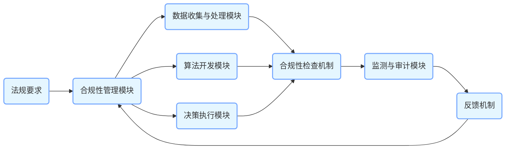

# 合规性管理：确保AI Agent符合法规要求

> 关键词：合规性管理、AI Agent、法规要求、风险评估、技术手段

> 摘要：本文围绕合规性管理，旨在确保AI Agent符合法规要求这一核心主题展开。首先介绍了合规性管理在AI领域的背景信息，包括目的、预期读者、文档结构等。接着阐述了AI Agent和合规性管理的核心概念及其联系，详细讲解了相关核心算法原理与具体操作步骤，并结合数学模型和公式进行深入分析。通过项目实战案例，展示了如何在实际开发中实现AI Agent的合规性。探讨了AI Agent合规性管理的实际应用场景，推荐了相关的学习资源、开发工具框架以及论文著作。最后总结了未来发展趋势与挑战，还提供了常见问题解答和扩展阅读参考资料，为读者全面了解和实践AI Agent的合规性管理提供了系统的指导。

## 1. 背景介绍 
### 1.1 目的和范围
随着人工智能技术的飞速发展，AI Agent在各个领域得到了广泛应用。然而，AI Agent的运行可能会涉及到诸多法规问题，如数据隐私、公平性、安全性等。本文章的目的在于探讨如何进行有效的合规性管理，确保AI Agent的开发、部署和使用过程完全符合相关法规要求。范围涵盖了从AI Agent的基本概念到具体的合规性管理技术，以及实际应用场景和未来发展趋势等多个方面。

### 1.2 预期读者
本文的预期读者包括AI开发人员、数据科学家、软件架构师、合规性管理人员、政策制定者以及对AI技术和法规合规性感兴趣的研究人员。这些读者希望通过本文了解如何在AI Agent的全生命周期中实现合规性管理，以应对日益严格的法规环境。

### 1.3 文档结构概述
本文将按照以下结构进行组织：首先介绍核心概念与联系，让读者对AI Agent和合规性管理有清晰的认识；接着讲解核心算法原理和具体操作步骤，为实际开发提供技术支持；然后通过数学模型和公式进一步阐述合规性管理的理论基础；再通过项目实战案例展示具体的实现过程；之后探讨实际应用场景，让读者了解合规性管理在现实中的应用；推荐相关的工具和资源，帮助读者深入学习和实践；最后总结未来发展趋势与挑战，并提供常见问题解答和扩展阅读参考资料。

### 1.4 术语表
#### 1.4.1 核心术语定义
- **AI Agent**：是一种能够感知环境、进行决策并采取行动以实现特定目标的人工智能实体。它可以是软件程序、机器人或其他智能系统。
- **合规性管理**：指的是确保组织的活动和系统符合相关法律法规、政策标准和道德规范的过程。在AI领域，就是要保证AI Agent的开发、运行和使用不违反任何适用的法规要求。
- **法规要求**：包括国家和地方的法律法规、行业标准、监管机构发布的规定等，这些要求对AI Agent的各个方面进行了规范，如数据处理、算法透明度、公平性等。

#### 1.4.2 相关概念解释
- **数据隐私**：涉及到保护个人数据不被未经授权的访问、使用和披露。在AI Agent中，数据隐私要求确保收集、存储和处理的用户数据符合相关隐私法规。
- **算法透明度**：指的是算法的决策过程和结果能够被解释和理解。对于AI Agent来说，算法透明度有助于确保其决策的公正性和可问责性。
- **公平性**：要求AI Agent在处理不同群体的数据和做出决策时，不产生歧视性结果。公平性是AI领域中一个重要的合规性问题。

#### 1.4.3 缩略词列表
- **GDPR**：General Data Protection Regulation，通用数据保护条例，是欧盟制定的一项严格的数据保护法规。
- **AI**：Artificial Intelligence，人工智能。
- **ML**：Machine Learning，机器学习，是AI的一个重要分支。

## 2. 核心概念与联系 
### 核心概念原理
#### AI Agent原理
AI Agent的核心原理基于感知、决策和行动三个关键环节。感知模块负责收集环境信息，例如传感器获取的数据或从网络上抓取的信息。决策模块则根据感知到的信息，运用各种算法（如机器学习、深度学习算法）进行分析和推理，以确定最佳的行动方案。行动模块根据决策结果执行相应的操作，如控制机器人移动、发送消息等。

#### 合规性管理原理
合规性管理的原理在于建立一套完整的流程和机制，确保AI Agent的各个环节都符合法规要求。这包括对法规的识别和理解、对AI Agent进行风险评估、制定和实施合规性策略、进行持续的监测和审计等。

### 架构的文本示意图
AI Agent的合规性管理架构可以描述如下：
法规要求作为外部输入，首先进入合规性管理模块。该模块对法规进行分析和解读，确定具体的合规性要求。然后，这些要求被传递到AI Agent的各个组件，包括数据收集与处理模块、算法开发模块和决策执行模块。在每个模块中，都有相应的合规性检查机制，确保其操作符合法规要求。同时，监测与审计模块对整个AI Agent的运行过程进行实时监测和定期审计，及时发现和纠正不合规行为。最后，反馈机制将监测和审计的结果反馈给合规性管理模块，以便对合规性策略进行调整和优化。

### Mermaid流程图


## 3. 核心算法原理 & 具体操作步骤 
### 核心算法原理
#### 风险评估算法
风险评估是合规性管理的重要环节，其核心算法可以基于机器学习中的分类算法。例如，使用逻辑回归算法对AI Agent的各种特征进行分析，预测其违反法规的可能性。逻辑回归算法的基本原理是通过对输入特征进行线性组合，然后通过逻辑函数将结果映射到[0, 1]区间，得到一个概率值。

```python
import numpy as np
from sklearn.linear_model import LogisticRegression

# 示例数据，假设有一些AI Agent的特征和对应的合规性标签
X = np.array([[1, 2, 3], [4, 5, 6], [7, 8, 9]])  # 特征矩阵
y = np.array([0, 1, 0])  # 合规性标签，0表示不合规，1表示合规

# 创建逻辑回归模型
model = LogisticRegression()

# 训练模型
model.fit(X, y)

# 预测新的AI Agent的合规性
new_X = np.array([[2, 3, 4]])
prediction = model.predict_proba(new_X)
print("预测的合规性概率:", prediction)
```

#### 合规性检查算法
合规性检查算法可以基于规则引擎实现。规则引擎根据预先定义的法规规则，对AI Agent的操作进行检查。例如，在数据处理环节，检查数据的收集是否获得了用户的明确授权，数据的存储是否符合安全标准等。

```python
# 示例规则引擎
class RuleEngine:
    def __init__(self, rules):
        self.rules = rules

    def check(self, data):
        for rule in self.rules:
            if not rule(data):
                return False
        return True

# 示例规则：检查数据是否为空
def rule_not_empty(data):
    return len(data) > 0

# 示例规则：检查数据长度是否超过10
def rule_length_limit(data):
    return len(data) <= 10

# 创建规则引擎
rules = [rule_not_empty, rule_length_limit]
engine = RuleEngine(rules)

# 示例数据
data = "example data"

# 进行合规性检查
result = engine.check(data)
print("合规性检查结果:", result)
```

### 具体操作步骤
1. **法规识别与理解**：收集和研究相关的法规要求，明确对AI Agent的具体规定。
2. **风险评估**：使用风险评估算法对AI Agent进行评估，确定其潜在的合规性风险。
3. **合规性策略制定**：根据风险评估结果，制定相应的合规性策略，如数据处理规范、算法透明度要求等。
4. **开发与集成**：在AI Agent的开发过程中，将合规性策略集成到各个模块中，确保每个环节都符合法规要求。
5. **合规性检查**：使用合规性检查算法对AI Agent进行实时检查，及时发现和纠正不合规行为。
6. **监测与审计**：建立监测和审计机制，对AI Agent的运行过程进行持续监测和定期审计，确保其长期合规。
7. **反馈与优化**：根据监测和审计的结果，对合规性策略进行调整和优化，不断提高AI Agent的合规性水平。

## 4. 数学模型和公式 & 详细讲解 & 举例说明 
### 风险评估的数学模型
风险评估可以使用逻辑回归模型进行建模。逻辑回归模型的基本公式为：

$$P(y = 1|x) = \frac{1}{1 + e^{-(w_0 + w_1x_1 + w_2x_2 + \cdots + w_nx_n)}}$$

其中，$P(y = 1|x)$ 表示在给定特征向量 $x = [x_1, x_2, \cdots, x_n]$ 的情况下，AI Agent合规（$y = 1$）的概率；$w_0, w_1, w_2, \cdots, w_n$ 是模型的参数，需要通过训练数据进行学习。

详细讲解：逻辑回归模型通过对特征向量进行线性组合，然后使用逻辑函数将结果映射到[0, 1]区间，得到一个概率值。这个概率值可以用来评估AI Agent违反法规的可能性。例如，如果 $P(y = 1|x) = 0.8$，则表示AI Agent有80%的概率是合规的。

举例说明：假设我们使用三个特征 $x_1$（数据收集的授权情况）、$x_2$（算法的透明度得分）和 $x_3$（决策的公平性得分）来评估AI Agent的合规性。经过训练得到的模型参数为 $w_0 = -1$，$w_1 = 0.5$，$w_2 = 0.3$，$w_3 = 0.2$。对于一个新的AI Agent，其特征值为 $x_1 = 1$（已获得授权），$x_2 = 0.8$，$x_3 = 0.7$。则可以计算其合规的概率为：

$$P(y = 1|x) = \frac{1}{1 + e^{-(-1 + 0.5\times1 + 0.3\times0.8 + 0.2\times0.7)}}$$

```python
import numpy as np

w = [-1, 0.5, 0.3, 0.2]
x = [1, 0.8, 0.7]

z = w[0] + np.dot(w[1:], x)
prob = 1 / (1 + np.exp(-z))
print("合规的概率:", prob)
```

### 合规性检查的数学模型
合规性检查可以使用布尔逻辑进行建模。假设我们有 $n$ 条法规规则 $R_1, R_2, \cdots, R_n$，每条规则可以表示为一个布尔函数 $f_i(x)$，其中 $x$ 是AI Agent的相关信息（如数据、决策结果等）。AI Agent的合规性可以表示为：

$$C(x) = f_1(x) \land f_2(x) \land \cdots \land f_n(x)$$

其中，$\land$ 表示逻辑与运算。只有当所有规则都满足时，AI Agent才被认为是合规的。

详细讲解：布尔逻辑模型通过对每条法规规则进行判断，然后将结果进行逻辑与运算，得到最终的合规性判断结果。这种模型简单直观，易于实现。

举例说明：假设我们有两条法规规则：规则 $R_1$ 要求数据长度不超过10，规则 $R_2$ 要求数据必须包含特定的关键字。可以定义两个布尔函数：

$$f_1(x) = \text{len}(x) \leq 10$$

$$f_2(x) = \text{"keyword"} \in x$$

对于一个数据 $x = "example keyword data"$，可以计算其合规性为：

```python
x = "example keyword data"
f1 = len(x) <= 10
f2 = "keyword" in x
C = f1 and f2
print("合规性:", C)
```

## 5. 项目实战：代码实际案例和详细解释说明 
### 5.1  开发环境搭建
#### 安装Python
首先，需要安装Python编程语言。可以从Python官方网站（https://www.python.org/downloads/）下载适合自己操作系统的Python版本，并按照安装向导进行安装。

#### 安装必要的库
在项目中，我们将使用一些Python库，如`scikit-learn`、`numpy`等。可以使用`pip`命令进行安装：

```sh
pip install scikit-learn numpy
```

### 5.2  源代码详细实现和代码解读
#### 风险评估模块
```python
import numpy as np
from sklearn.linear_model import LogisticRegression

# 生成示例数据
np.random.seed(0)
X = np.random.rand(100, 3)  # 100个样本，每个样本有3个特征
y = np.random.randint(0, 2, 100)  # 随机生成合规性标签

# 创建逻辑回归模型
model = LogisticRegression()

# 训练模型
model.fit(X, y)

# 预测新的样本
new_X = np.random.rand(1, 3)
prediction = model.predict_proba(new_X)
print("预测的合规性概率:", prediction)
```
代码解读：
- 首先，使用`numpy`库生成了100个样本的示例数据，每个样本有3个特征，同时随机生成了对应的合规性标签。
- 然后，创建了一个逻辑回归模型，并使用训练数据对其进行训练。
- 最后，生成一个新的样本，使用训练好的模型预测其合规性概率。

#### 合规性检查模块
```python
# 示例规则函数
def rule1(data):
    return len(data) <= 10

def rule2(data):
    return "keyword" in data

# 规则引擎类
class RuleEngine:
    def __init__(self, rules):
        self.rules = rules

    def check(self, data):
        for rule in self.rules:
            if not rule(data):
                return False
        return True

# 创建规则引擎
rules = [rule1, rule2]
engine = RuleEngine(rules)

# 示例数据
data = "example keyword data"

# 进行合规性检查
result = engine.check(data)
print("合规性检查结果:", result)
```
代码解读：
- 定义了两个示例规则函数`rule1`和`rule2`，分别检查数据长度和是否包含特定关键字。
- 创建了一个规则引擎类`RuleEngine`，其中`__init__`方法初始化规则列表，`check`方法对数据进行合规性检查。
- 实例化规则引擎，并使用示例数据进行合规性检查。

### 5.3  代码解读与分析
#### 风险评估模块分析
逻辑回归模型是一种简单而有效的风险评估方法。通过对训练数据的学习，模型可以捕捉到特征与合规性之间的关系。在实际应用中，可以根据具体的法规要求和数据特点，选择合适的特征进行建模。同时，需要注意数据的质量和代表性，以确保模型的准确性。

#### 合规性检查模块分析
规则引擎是一种灵活的合规性检查方法。通过定义不同的规则函数，可以方便地实现各种法规规则的检查。在实际应用中，可以根据法规的变化，动态地添加、删除或修改规则，以保证合规性检查的有效性。

## 6. 实际应用场景 
### 金融领域
在金融领域，AI Agent被广泛应用于风险评估、贷款审批、投资决策等方面。合规性管理对于金融机构至关重要，因为金融行业受到严格的法规监管。例如，GDPR要求金融机构在处理客户数据时必须获得明确授权，并确保数据的安全和隐私。AI Agent在进行风险评估时，需要遵守公平性原则，避免对特定群体产生歧视性结果。通过合规性管理，可以确保AI Agent的决策符合法规要求，保护客户的权益，同时降低金融机构的法律风险。

### 医疗领域
在医疗领域，AI Agent可以辅助医生进行疾病诊断、治疗方案推荐等工作。医疗数据涉及到患者的隐私和健康信息，因此合规性管理尤为重要。例如，《健康保险流通与责任法案》（HIPAA）对医疗数据的保护提出了严格要求。AI Agent在处理医疗数据时，必须确保数据的保密性、完整性和可用性。同时，其诊断和推荐结果需要具有可解释性，以便医生和患者能够理解和信任。合规性管理可以帮助医疗AI Agent满足这些法规要求，提高医疗服务的质量和安全性。

### 交通领域
在交通领域，AI Agent被应用于自动驾驶、智能交通管理等方面。自动驾驶汽车需要遵守交通法规，确保乘客和行人的安全。合规性管理可以确保AI Agent的决策和行为符合交通法规的要求，如限速、礼让行人等。同时，在智能交通管理中，AI Agent需要处理大量的交通数据，这些数据的收集、使用和共享也需要符合相关法规，如数据隐私法规。通过合规性管理，可以促进交通领域的智能化发展，同时保障公众的安全和权益。

## 7. 工具和资源推荐
### 7.1 学习资源推荐
#### 7.1.1 书籍推荐
- 《人工智能：现代方法》（Artificial Intelligence: A Modern Approach）：这是一本经典的人工智能教材，涵盖了AI的各个方面，包括AI Agent的基本概念和算法。
- 《数据科学实战》（Doing Data Science）：介绍了数据科学的实际应用，包括如何处理数据、进行模型训练和评估，对于理解AI Agent中的数据处理和算法开发有很大帮助。
- 《合规管理手册》（Compliance Management Handbook）：专门讲解合规性管理的理论和实践，对于了解如何确保AI Agent符合法规要求具有重要参考价值。

#### 7.1.2 在线课程
- Coursera上的“人工智能基础”（Foundations of Artificial Intelligence）课程：由知名教授授课，系统地介绍了人工智能的基础知识，包括AI Agent的相关内容。
- edX上的“数据隐私与安全”（Data Privacy and Security）课程：深入讲解了数据隐私和安全的法规要求和技术手段，对于AI Agent的合规性管理非常有用。
- Udemy上的“AI合规性实战”（AI Compliance in Practice）课程：结合实际案例，介绍了如何在AI项目中实现合规性管理。

#### 7.1.3 技术博客和网站
- Towards Data Science：这是一个专注于数据科学和人工智能的技术博客平台，上面有很多关于AI Agent和合规性管理的文章。
- IEEE Spectrum：电气和电子工程师协会的官方网站，提供了最新的科技动态和研究成果，包括AI领域的法规和合规性问题。
- O'Reilly Radar：O'Reilly媒体的技术博客，分享了很多关于新兴技术和行业趋势的见解，对于了解AI Agent的合规性管理有一定的参考价值。

### 7.2 开发工具框架推荐
#### 7.2.1 IDE和编辑器
- PyCharm：一款专业的Python集成开发环境，提供了丰富的代码编辑、调试和测试功能，非常适合AI Agent的开发。
- Jupyter Notebook：一种交互式的开发环境，支持Python代码的编写和运行，同时可以方便地展示数据和结果，对于数据处理和模型训练很有帮助。
- Visual Studio Code：一款轻量级的代码编辑器，支持多种编程语言和插件扩展，可用于AI Agent的开发和合规性管理工具的编写。

#### 7.2.2 调试和性能分析工具
- PySnooper：一个简单易用的Python调试工具，可以自动记录函数的执行过程和变量的值，方便排查代码中的问题。
- cProfile：Python内置的性能分析工具，可以分析代码的运行时间和函数调用次数，帮助优化代码性能。
- TensorBoard：一个用于可视化深度学习模型训练过程的工具，可用于分析AI Agent中深度学习模型的性能和参数变化。

#### 7.2.3 相关框架和库
- scikit-learn：一个强大的机器学习库，提供了各种机器学习算法和工具，可用于AI Agent的风险评估和合规性分析。
- TensorFlow：一个广泛使用的深度学习框架，可用于构建和训练复杂的AI Agent模型。
- Pandas：一个用于数据处理和分析的Python库，可帮助处理AI Agent中的大量数据。

### 7.3 相关论文著作推荐
#### 7.3.1 经典论文
- “The Turing Test” by Alan Turing：这篇经典论文提出了图灵测试，对于理解人工智能的本质和发展具有重要意义。
- “Learning Representations by Back-propagating Errors” by David E. Rumelhart, Geoffrey E. Hinton, and Ronald J. Williams：介绍了反向传播算法，是深度学习领域的重要基础。
- “A Unified Approach to Interpreting Model Predictions” by Scott Lundberg and Su-In Lee：提出了一种统一的模型解释方法，对于提高AI Agent的算法透明度有很大帮助。

#### 7.3.2 最新研究成果
- “Ethical and Legal Implications of AI in Healthcare”：探讨了医疗领域AI的伦理和法律问题，对于AI Agent在医疗行业的合规性管理有参考价值。
- “Data Privacy in AI Systems: Challenges and Solutions”：分析了AI系统中数据隐私面临的挑战，并提出了相应的解决方案。
- “Ensuring Fairness in AI Decision-making”：研究了如何确保AI决策的公平性，对于解决AI Agent中的公平性合规问题有指导作用。

#### 7.3.3 应用案例分析
- “Compliance Management in Financial AI Applications”：分析了金融领域AI应用的合规性管理案例，介绍了实际应用中的经验和教训。
- “AI Agent Compliance in Autonomous Vehicles”：研究了自动驾驶汽车中AI Agent的合规性问题，提供了一些实际的解决方案。
- “Case Studies on AI Compliance in Healthcare”：通过多个医疗领域的案例，展示了如何实现AI Agent的合规性管理。

## 8. 总结：未来发展趋势与挑战
### 未来发展趋势
#### 法规不断完善
随着AI技术的不断发展和应用，相关的法规也将不断完善。政府和监管机构将出台更加严格和细致的法规要求，以确保AI Agent的安全、公平和合规。例如，可能会对AI算法的透明度、可解释性提出更高的要求，加强对数据隐私和安全的保护。

#### 技术创新推动合规性管理
新的技术将不断涌现，为合规性管理提供更有效的手段。例如，区块链技术可以用于实现数据的可追溯性和不可篡改，增强数据隐私保护；联邦学习可以在不共享原始数据的情况下进行模型训练，满足数据隐私法规的要求。

#### 行业标准的制定
各个行业将制定自己的AI Agent合规性标准，以规范行业内的AI应用。这些标准将结合行业特点和法规要求，为企业提供更具体的指导。例如，金融行业可能会制定关于AI风险评估和决策的标准，医疗行业可能会制定关于AI诊断和治疗推荐的标准。

### 挑战
#### 法规的复杂性
不同国家和地区的法规存在差异，而且法规的更新速度较快。这给AI开发者和企业带来了很大的挑战，需要花费大量的时间和精力来了解和遵守各种法规要求。

#### 技术实现难度
实现AI Agent的合规性管理需要一定的技术手段，但目前一些合规性要求在技术上还存在一定的实现难度。例如，如何实现复杂AI算法的可解释性，如何确保AI决策的公平性等，仍然是研究的热点和难点问题。

#### 成本与效益的平衡
实施合规性管理需要投入一定的成本，包括人力、物力和财力等方面。企业需要在合规性和经济效益之间找到平衡，既要确保AI Agent符合法规要求，又要保证项目的可行性和盈利能力。

## 9. 附录：常见问题与解答
### 问题1：如何确定哪些法规适用于我的AI Agent？
解答：首先，需要了解AI Agent的应用领域和使用场景。不同的行业和应用场景可能受到不同法规的约束。例如，金融领域的AI Agent需要遵守金融法规，医疗领域的AI Agent需要遵守医疗法规。可以通过咨询法律专家、研究相关的法规文件和监管机构的要求来确定具体适用的法规。

### 问题2：AI Agent的合规性管理是否会影响其性能和效率？
解答：在一定程度上，合规性管理可能会对AI Agent的性能和效率产生影响。例如，进行合规性检查和风险评估需要额外的计算资源和时间。但是，通过合理的设计和优化，可以将这种影响降到最低。例如，可以采用并行计算、分布式计算等技术提高合规性检查的效率。同时，合规性管理也可以提高AI Agent的可靠性和可信度，从长远来看，对其性能和效率的提升是有益的。

### 问题3：如何处理AI Agent在运行过程中出现的合规性问题？
解答：当发现AI Agent在运行过程中出现合规性问题时，首先需要立即停止相关的操作，以避免问题的进一步恶化。然后，对问题进行深入分析，找出问题的根源和影响范围。根据问题的严重程度，采取相应的措施进行整改。例如，如果是数据隐私问题，需要及时删除或加密违规数据；如果是算法公平性问题，需要对算法进行调整和优化。最后，对整改结果进行验证和测试，确保AI Agent重新符合法规要求。

### 问题4：AI Agent的合规性管理是否需要持续监测和更新？
解答：是的，AI Agent的合规性管理需要持续监测和更新。法规要求可能会随着时间的推移而发生变化，同时AI Agent的运行环境和数据也可能会发生改变。因此，需要建立持续监测机制，实时监控AI Agent的运行状态和合规性情况。一旦发现法规变化或出现新的合规性风险，需要及时对合规性策略进行调整和更新，以确保AI Agent始终符合法规要求。

## 10. 扩展阅读 & 参考资料
### 扩展阅读
- 《AI伦理与治理》（AI Ethics and Governance）：深入探讨了AI领域的伦理和治理问题，对于理解AI Agent的合规性管理背后的伦理基础有很大帮助。
- 《未来简史：从智人到神人》（Homo Deus: A Brief History of Tomorrow）：从宏观的角度探讨了AI技术对人类社会的影响，引发读者对AI合规性和社会发展的深入思考。
- 《数字经济时代的法律与治理》（Law and Governance in the Digital Economy Era）：分析了数字经济时代的法律挑战和治理模式，对于理解AI Agent在数字经济中的合规性问题有一定的参考价值。

### 参考资料
- [GDPR官方网站](https://gdpr.eu/)：提供了通用数据保护条例的详细内容和相关解释。
- [IEEE人工智能标准委员会](https://standards.ieee.org/committee/796/index.html)：发布了一系列关于人工智能的标准和指南，可作为AI Agent合规性管理的参考。
- [中国人工智能产业发展联盟](https://www.aia.org.cn/)：发布了中国人工智能领域的相关报告和标准，对于了解国内AI Agent的合规性情况有一定的帮助。

作者：AI天才研究院/AI Genius Institute & 禅与计算机程序设计艺术 /Zen And The Art of Computer Programming