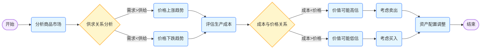

# 吉姆·罗杰斯的商品价值投资：实物资产中的价值

> 关键词：吉姆·罗杰斯、商品价值投资、实物资产、价值分析、投资策略

> 摘要：本文深入探讨了吉姆·罗杰斯所倡导的商品价值投资理念，聚焦于实物资产中的价值挖掘。从背景介绍出发，阐述商品价值投资的目的、适用读者和文档结构。详细剖析核心概念，包括商品价值投资的原理和架构，并通过Mermaid流程图展示其逻辑。深入讲解核心算法原理，用Python代码进行阐述，同时给出相关数学模型和公式并举例说明。结合项目实战，提供开发环境搭建、源代码实现及解读。探讨商品价值投资的实际应用场景，推荐学习资源、开发工具框架和相关论文著作。最后总结未来发展趋势与挑战，解答常见问题并提供扩展阅读和参考资料，帮助读者全面理解和应用吉姆·罗杰斯的商品价值投资理念。

## 1. 背景介绍 
### 1.1 目的和范围
吉姆·罗杰斯是全球知名的投资大师，他的商品价值投资理念在金融投资领域具有广泛影响。本文的目的在于深入剖析罗杰斯的商品价值投资理论，探讨如何在实物资产中发现和挖掘价值。范围涵盖了商品价值投资的核心概念、算法原理、数学模型、项目实战、应用场景等多个方面，旨在为投资者和金融从业者提供全面而深入的知识体系，帮助他们更好地理解和运用这一投资理念。

### 1.2 预期读者
本文预期读者主要包括对金融投资感兴趣的个人投资者、金融机构的投资分析师、基金经理、金融专业的学生以及相关领域的研究人员。对于那些希望学习和掌握商品价值投资方法，在实物资产市场中寻找投资机会的读者来说，本文将提供有价值的参考和指导。

### 1.3 文档结构概述
本文将按照以下结构进行阐述：首先介绍核心概念与联系，包括商品价值投资的原理和架构，并通过示意图和流程图展示其逻辑关系；接着讲解核心算法原理，用Python代码详细说明；然后给出相关数学模型和公式，并举例说明其应用；随后进行项目实战，包括开发环境搭建、源代码实现和代码解读；再探讨商品价值投资的实际应用场景；推荐学习资源、开发工具框架和相关论文著作；最后总结未来发展趋势与挑战，解答常见问题并提供扩展阅读和参考资料。

### 1.4 术语表
#### 1.4.1 核心术语定义
- **商品价值投资**：基于对实物资产内在价值的分析和评估，通过长期持有被低估的商品资产来获取投资回报的投资策略。
- **实物资产**：具有实际物理形态的资产，如黄金、白银、石油、农产品等。
- **内在价值**：商品资产基于其基本面因素，如供求关系、生产成本、稀缺性等所决定的真实价值。
- **价值低估**：商品资产的市场价格低于其内在价值的状态。

#### 1.4.2 相关概念解释
- **供求关系**：商品的供给和需求之间的相互作用，是影响商品价格和内在价值的重要因素。当供给大于需求时，价格可能下跌；当需求大于供给时，价格可能上涨。
- **生产成本**：生产商品所需要的各种成本，包括原材料成本、劳动力成本、能源成本等。生产成本的变化会影响商品的内在价值和市场价格。
- **稀缺性**：某些商品由于资源有限或生产难度大，具有稀缺性。稀缺性会增加商品的内在价值和投资吸引力。

#### 1.4.3 缩略词列表
无

## 2. 核心概念与联系 
### 核心概念原理
吉姆·罗杰斯的商品价值投资理念基于对实物资产内在价值的深入分析。其核心原理在于，实物资产具有实际的使用价值和经济价值，其价格会围绕内在价值波动。当市场价格低于内在价值时，商品处于价值低估状态，此时是投资的良机；而当市场价格高于内在价值时，商品可能被高估，投资者应考虑卖出。

罗杰斯认为，商品市场的供求关系是决定商品价格和内在价值的关键因素。例如，随着全球经济的发展，对能源和工业原材料的需求不断增加，如果供给不能及时跟上，就会导致价格上涨。此外，生产成本、政治因素、自然灾害等也会对商品的供求关系和价格产生影响。

### 架构的文本示意图
```plaintext
商品价值投资架构
|-- 核心目标：挖掘实物资产价值，获取投资回报
|-- 关键因素
|   |-- 供求关系
|   |   |-- 需求分析：经济增长、人口变化、消费趋势等
|   |   |-- 供给分析：生产能力、资源储备、政策法规等
|   |-- 生产成本
|   |   |-- 原材料成本
|   |   |-- 劳动力成本
|   |   |-- 能源成本等
|   |-- 稀缺性
|   |   |-- 资源稀缺性
|   |   |-- 生产难度等
|-- 投资策略
|   |-- 价值评估：确定商品内在价值
|   |-- 时机选择：在价值低估时买入，高估时卖出
|   |-- 资产配置：合理分配资金到不同商品资产
```

### Mermaid流程图


## 3. 核心算法原理 & 具体操作步骤 
### 核心算法原理
商品价值投资的核心算法原理在于通过对商品的供求关系、生产成本等因素进行量化分析，确定商品的内在价值，并与市场价格进行比较。以下是一个简化的算法思路：

1. **收集数据**：收集商品的历史价格数据、供求数据、生产成本数据等。
2. **构建供求模型**：根据收集到的数据，构建供求关系模型，预测商品的未来供求情况。
3. **计算生产成本**：分析商品的生产成本，包括原材料成本、劳动力成本、能源成本等。
4. **确定内在价值**：综合考虑供求关系和生产成本，确定商品的内在价值。
5. **比较市场价格**：将内在价值与市场价格进行比较，判断商品是否被低估或高估。

### Python源代码实现
```python
import pandas as pd
import numpy as np
from sklearn.linear_model import LinearRegression

# 假设我们有商品的历史价格、供给量和需求量数据
# 数据格式：日期，价格，供给量，需求量
data = {
    'date': pd.date_range(start='2020-01-01', periods=100, freq='D'),
    'price': np.random.rand(100) * 100,
    'supply': np.random.rand(100) * 1000,
    'demand': np.random.rand(100) * 1000
}
df = pd.DataFrame(data)

# 构建供求模型
X = df[['supply', 'demand']]
y = df['price']
model = LinearRegression()
model.fit(X, y)

# 假设我们有新的供给量和需求量数据
new_supply = np.array([[800]])
new_demand = np.array([[900]])
new_X = np.column_stack((new_supply, new_demand))

# 预测未来价格
predicted_price = model.predict(new_X)

# 假设我们通过其他方法计算出该商品的生产成本为 50
production_cost = 50

# 判断商品是否被低估或高估
if predicted_price > production_cost:
    print("商品可能被高估")
elif predicted_price < production_cost:
    print("商品可能被低估")
else:
    print("商品价格合理")
```

### 具体操作步骤
1. **数据收集**：可以从金融数据提供商、政府统计部门、行业协会等渠道收集商品的相关数据。
2. **数据预处理**：对收集到的数据进行清洗、整理和转换，确保数据的质量和一致性。
3. **模型构建**：根据数据特点和分析目的，选择合适的模型，如线性回归模型、时间序列模型等。
4. **模型训练**：使用历史数据对模型进行训练，调整模型参数，提高模型的准确性。
5. **预测和评估**：使用训练好的模型对未来价格进行预测，并与生产成本进行比较，评估商品的价值。

## 4. 数学模型和公式 & 详细讲解 & 举例说明 
### 数学模型
在商品价值投资中，常用的数学模型包括线性回归模型、时间序列模型等。这里以线性回归模型为例进行讲解。

线性回归模型的一般形式为：

$$y = \beta_0 + \beta_1x_1 + \beta_2x_2 + \cdots + \beta_nx_n + \epsilon$$

其中，$y$ 是因变量（如商品价格），$x_1, x_2, \cdots, x_n$ 是自变量（如供给量、需求量等），$\beta_0, \beta_1, \cdots, \beta_n$ 是模型参数，$\epsilon$ 是误差项。

### 公式详细讲解
- **模型参数估计**：通过最小二乘法来估计模型参数 $\beta_0, \beta_1, \cdots, \beta_n$，使得误差项 $\epsilon$ 的平方和最小。最小二乘法的目标函数为：

$$\min_{\beta_0, \beta_1, \cdots, \beta_n} \sum_{i=1}^{m} (y_i - (\beta_0 + \beta_1x_{i1} + \beta_2x_{i2} + \cdots + \beta_nx_{in}))^2$$

其中，$m$ 是样本数量，$y_i$ 是第 $i$ 个样本的因变量值，$x_{i1}, x_{i2}, \cdots, x_{in}$ 是第 $i$ 个样本的自变量值。

- **预测**：在得到模型参数后，可以使用以下公式进行预测：

$$\hat{y} = \beta_0 + \beta_1x_1 + \beta_2x_2 + \cdots + \beta_nx_n$$

其中，$\hat{y}$ 是预测值。

### 举例说明
假设我们有以下商品的历史数据：

| 日期 | 价格（元） | 供给量（吨） | 需求量（吨） |
| ---- | ---- | ---- | ---- |
| 2020-01-01 | 50 | 100 | 120 |
| 2020-01-02 | 52 | 110 | 130 |
| 2020-01-03 | 55 | 120 | 140 |
| 2020-01-04 | 58 | 130 | 150 |
| 2020-01-05 | 60 | 140 | 160 |

我们可以使用线性回归模型来预测未来价格。首先，将数据整理成适合模型输入的格式：

```python
import numpy as np

# 数据
prices = np.array([50, 52, 55, 58, 60])
supplies = np.array([100, 110, 120, 130, 140])
demands = np.array([120, 130, 140, 150, 160])

# 构建自变量矩阵
X = np.column_stack((supplies, demands))
y = prices

# 计算模型参数
X = np.insert(X, 0, 1, axis=1)  # 添加截距项
beta = np.linalg.inv(X.T @ X) @ X.T @ y

# 假设新的供给量为 150 吨，需求量为 170 吨
new_X = np.array([1, 150, 170])
predicted_price = new_X @ beta

print("预测价格：", predicted_price)
```

在这个例子中，我们通过线性回归模型预测了商品的未来价格，并可以根据预测价格和生产成本来判断商品是否被低估或高估。

## 5. 项目实战：代码实际案例和详细解释说明 
### 5.1  开发环境搭建
#### 安装Python
首先，需要安装Python编程语言。可以从Python官方网站（https://www.python.org/downloads/）下载适合自己操作系统的Python版本，并按照安装向导进行安装。

#### 安装必要的库
在商品价值投资项目中，需要使用一些Python库来进行数据处理、模型构建和可视化等操作。常用的库包括 `pandas`、`numpy`、`scikit-learn`、`matplotlib` 等。可以使用以下命令来安装这些库：

```sh
pip install pandas numpy scikit-learn matplotlib
```

### 5.2  源代码详细实现和代码解读
```python
import pandas as pd
import numpy as np
from sklearn.linear_model import LinearRegression
import matplotlib.pyplot as plt

# 读取商品历史数据
data = pd.read_csv('commodity_data.csv')

# 提取自变量和因变量
X = data[['supply', 'demand']]
y = data['price']

# 划分训练集和测试集
train_size = int(len(data) * 0.8)
X_train, X_test = X[:train_size], X[train_size:]
y_train, y_test = y[:train_size], y[train_size:]

# 构建线性回归模型
model = LinearRegression()
model.fit(X_train, y_train)

# 预测测试集数据
y_pred = model.predict(X_test)

# 计算模型评估指标
from sklearn.metrics import mean_squared_error, r2_score
mse = mean_squared_error(y_test, y_pred)
r2 = r2_score(y_test, y_pred)

print("均方误差：", mse)
print("决定系数：", r2)

# 可视化预测结果
plt.figure(figsize=(10, 6))
plt.plot(y_test.values, label='实际价格')
plt.plot(y_pred, label='预测价格')
plt.xlabel('样本序号')
plt.ylabel('价格')
plt.title('商品价格预测结果')
plt.legend()
plt.show()
```

### 代码解读与分析
1. **数据读取**：使用 `pandas` 库的 `read_csv` 函数读取商品历史数据文件。
2. **数据划分**：将数据集划分为训练集和测试集，比例为 8:2。
3. **模型构建**：使用 `scikit-learn` 库的 `LinearRegression` 类构建线性回归模型，并使用训练集数据进行训练。
4. **模型预测**：使用训练好的模型对测试集数据进行预测。
5. **模型评估**：使用 `mean_squared_error` 和 `r2_score` 函数计算模型的均方误差和决定系数，评估模型的性能。
6. **可视化**：使用 `matplotlib` 库绘制实际价格和预测价格的折线图，直观展示预测结果。

## 6. 实际应用场景 
### 个人投资
个人投资者可以运用吉姆·罗杰斯的商品价值投资理念，在实物资产市场中寻找被低估的商品进行投资。例如，当黄金价格因市场恐慌而大幅下跌，但黄金的内在价值由于其稀缺性和避险属性并未改变时，投资者可以在价格低估时买入黄金，等待价格回升获取投资回报。

### 基金管理
基金经理可以将商品价值投资纳入投资组合管理中，通过合理配置不同商品资产，降低投资组合的风险。例如，在经济增长周期，增加对工业原材料如铜、铝等的投资；在经济衰退周期，增加对黄金、白银等避险资产的投资。

### 企业风险管理
企业可以利用商品价值投资理念进行风险管理。例如，石油生产企业可以通过分析石油市场的供求关系和价格走势，合理安排生产和库存，避免因价格波动带来的损失。同时，企业还可以通过期货市场进行套期保值，锁定原材料采购成本或产品销售价格。

### 宏观经济分析
政府和研究机构可以运用商品价值投资的方法进行宏观经济分析。商品价格的波动反映了经济的供求关系和通货膨胀水平，通过对商品价格的监测和分析，可以及时发现经济运行中的问题，制定相应的宏观经济政策。

## 7. 工具和资源推荐
### 7.1 学习资源推荐
#### 7.1.1 书籍推荐
- 《热门商品投资》（Hot Commodities）：吉姆·罗杰斯的经典著作，详细阐述了他的商品价值投资理念和方法。
- 《聪明的投资者》（The Intelligent Investor）：本杰明·格雷厄姆的投资经典，介绍了价值投资的基本原理和方法，对商品价值投资有重要的指导意义。
- 《期货市场技术分析》（Technical Analysis of the Futures Markets）：约翰·墨菲的著作，介绍了期货市场的技术分析方法，对商品投资的时机选择有帮助。

#### 7.1.2 在线课程
- Coursera上的“金融市场”课程：由耶鲁大学教授罗伯特·席勒讲授，涵盖了金融市场的基本理论和投资策略，包括商品投资。
- Udemy上的“商品投资入门”课程：适合初学者，介绍了商品投资的基本知识和操作方法。

#### 7.1.3 技术博客和网站
- Seeking Alpha：提供全球金融市场的分析和评论，包括商品市场的研究报告和投资建议。
- Bloomberg：全球知名的金融资讯提供商，提供实时的商品价格数据和市场分析。
- Kitco：专注于贵金属市场的网站，提供黄金、白银等贵金属的价格走势和市场分析。

### 7.2 开发工具框架推荐
#### 7.2.1 IDE和编辑器
- PyCharm：专业的Python集成开发环境，提供丰富的代码编辑、调试和项目管理功能。
- Jupyter Notebook：交互式的开发环境，适合进行数据分析和模型实验，方便展示代码和结果。

#### 7.2.2 调试和性能分析工具
- PDB：Python自带的调试工具，可以帮助开发者定位和解决代码中的问题。
- cProfile：Python的性能分析工具，可以分析代码的运行时间和函数调用情况，帮助优化代码性能。

#### 7.2.3 相关框架和库
- Pandas：强大的数据处理和分析库，提供了丰富的数据结构和数据操作方法，适合处理商品历史数据。
- Numpy：用于科学计算的基础库，提供了高效的数组操作和数学函数，是许多机器学习库的基础。
- Scikit-learn：机器学习库，提供了各种机器学习算法和工具，方便构建商品价格预测模型。

### 7.3 相关论文著作推荐
#### 7.3.1 经典论文
- Fama, E. F., & French, K. R. (1987). Commodity futures prices: Some evidence on forecast power, premiums, and the theory of storage. *Journal of Business*, 60(1), 55-73.
- Gorton, G., & Rouwenhorst, K. G. (2006). Facts and fantasies about commodity futures. *Financial Analysts Journal*, 62(2), 47-68.

#### 7.3.2 最新研究成果
- Bhardwaj, G., Gorton, G., & Rouwenhorst, K. G. (2015). Understanding the drivers of commodity returns. *Review of Financial Studies*, 28(4), 1012-1041.
- Hong, H., & Yogo, M. (2012). Inflation betas. *Journal of Financial Economics*, 104(3), 566-583.

#### 7.3.3 应用案例分析
- 各大金融机构和研究机构发布的商品投资研究报告，分析了不同商品市场的投资机会和风险，提供了实际应用案例和投资建议。

## 8. 总结：未来发展趋势与挑战
### 未来发展趋势
- **数字化和智能化**：随着科技的发展，商品价值投资将越来越多地运用数字化和智能化技术。例如，利用大数据和人工智能算法进行商品市场的分析和预测，提高投资决策的准确性和效率。
- **绿色投资**：全球对环境保护和可持续发展的关注度不断提高，绿色商品如清洁能源、环保材料等的投资需求将不断增加。投资者将更加关注商品的环境和社会影响，推动绿色商品市场的发展。
- **全球化和多元化**：商品市场的全球化趋势将继续加强，投资者可以更加便捷地参与全球商品市场的投资。同时，商品投资的品种也将更加多元化，除了传统的金属、能源和农产品外，新兴商品如数字货币、碳交易等也将逐渐进入投资者的视野。

### 挑战
- **市场不确定性**：商品市场受到多种因素的影响，如供求关系、政治因素、自然灾害等，市场不确定性较大。投资者需要具备较强的风险意识和风险管理能力，才能在市场波动中取得良好的投资回报。
- **数据质量和分析能力**：商品价值投资需要大量的数据支持，数据的质量和准确性直接影响投资决策的正确性。同时，投资者需要具备较强的数据分析能力，能够从海量的数据中提取有价值的信息，构建有效的投资模型。
- **监管政策变化**：商品市场受到各国政府的监管，监管政策的变化可能会对市场产生重大影响。投资者需要及时了解和适应监管政策的变化，避免因政策风险而导致投资损失。

## 9. 附录：常见问题与解答
### 问题1：商品价值投资适合所有投资者吗？
解答：商品价值投资并不适合所有投资者。商品市场的波动性较大，风险相对较高，需要投资者具备一定的风险承受能力和投资经验。同时，商品价值投资需要对商品市场有深入的了解和研究，需要花费较多的时间和精力。因此，对于风险承受能力较低、投资经验不足的投资者来说，建议在专业人士的指导下进行投资。

### 问题2：如何确定商品的内在价值？
解答：确定商品的内在价值需要综合考虑多个因素，如供求关系、生产成本、稀缺性等。可以通过收集和分析商品的历史数据，构建供求模型和成本模型，来估算商品的内在价值。同时，还需要关注宏观经济环境、政策法规等因素对商品价值的影响。

### 问题3：商品价值投资的投资周期一般有多长？
解答：商品价值投资通常是一种长期投资策略，投资周期可能会比较长。因为商品价格的波动往往受到多种因素的影响，需要一定的时间来反映其内在价值的变化。一般来说，投资周期可能在几年甚至更长时间。当然，具体的投资周期还需要根据市场情况和投资者的投资目标来确定。

### 问题4：商品价值投资与股票投资有什么区别？
解答：商品价值投资和股票投资有以下区别：
- **投资对象**：商品价值投资的对象是实物资产，如黄金、石油、农产品等；而股票投资的对象是上市公司的股权。
- **风险特征**：商品市场的波动性较大，风险相对较高；而股票市场的风险也较高，但不同股票的风险特征差异较大。
- **影响因素**：商品价格主要受到供求关系、生产成本、稀缺性等因素的影响；而股票价格则受到公司基本面、宏观经济环境、行业竞争等多种因素的影响。
- **投资策略**：商品价值投资主要基于对商品内在价值的分析和评估，通过长期持有被低估的商品资产来获取投资回报；而股票投资则可以采用价值投资、成长投资、技术分析等多种投资策略。

## 10. 扩展阅读 & 参考资料
### 扩展阅读
- 《金融炼金术》（The Alchemy of Finance）：乔治·索罗斯的著作，介绍了他的投资哲学和方法，对理解金融市场的运行机制有帮助。
- 《漫步华尔街》（A Random Walk Down Wall Street）：伯顿·马尔基尔的经典投资书籍，介绍了有效市场假说和随机漫步理论，对投资决策有一定的启示。

### 参考资料
- 吉姆·罗杰斯的官方网站和社交媒体账号，获取他的最新投资观点和研究成果。
- 各大金融机构和研究机构发布的商品投资研究报告和市场分析文章。
- 相关的学术期刊和会议论文，如《Journal of Finance》、《Review of Financial Studies》等。

作者：AI天才研究院/AI Genius Institute & 禅与计算机程序设计艺术 /Zen And The Art of Computer Programming