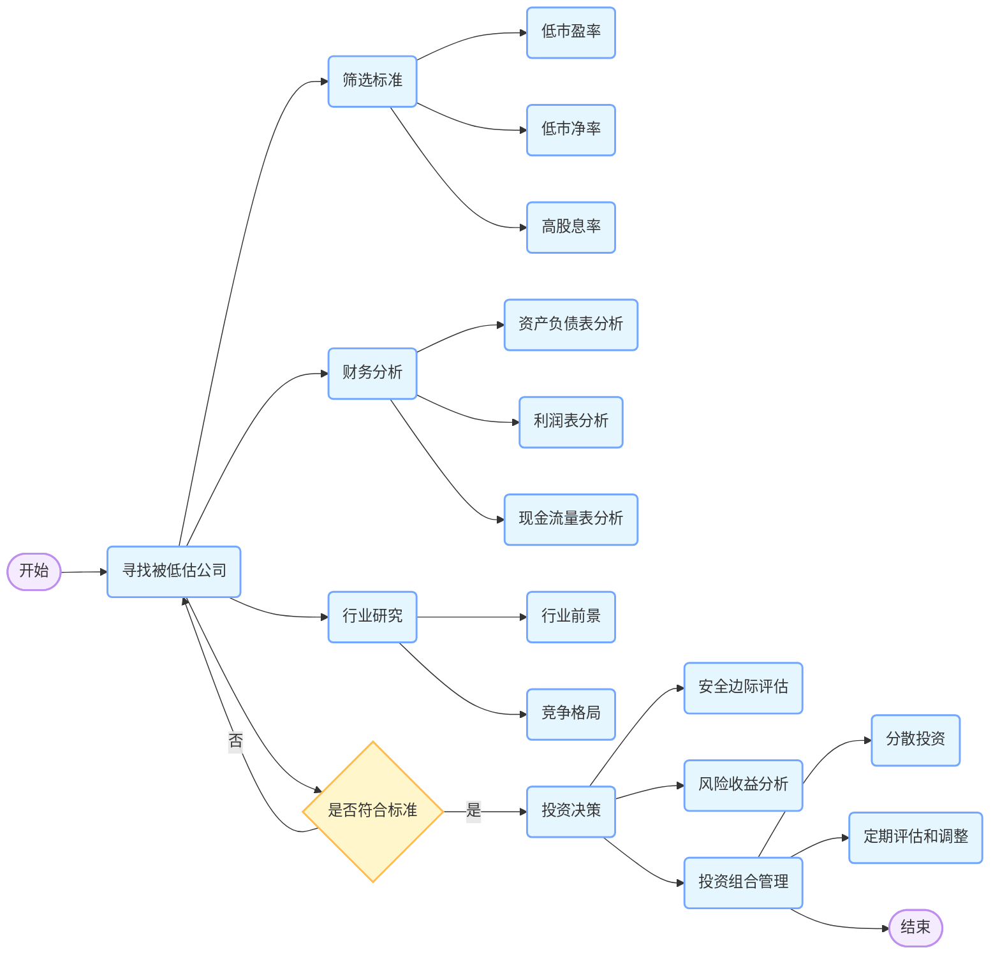

# 唐纳德·约斯的深度价值投资：寻找严重被低估的公司

> 关键词：唐纳德·约斯、深度价值投资、被低估公司、价值评估、投资策略

> 摘要：本文围绕唐纳德·约斯的深度价值投资理念展开，深入探讨如何寻找严重被低估的公司。首先介绍了深度价值投资的背景，包括目的、预期读者等内容。接着阐述了核心概念，如深度价值投资的原理和架构，并给出相应的示意图和流程图。详细讲解了核心算法原理及具体操作步骤，结合数学模型和公式进行说明，并举例分析。通过项目实战，展示了如何在实际中运用相关方法寻找被低估公司。还探讨了深度价值投资的实际应用场景，推荐了学习资源、开发工具和相关论文著作。最后总结了未来发展趋势与挑战，并提供常见问题解答和扩展阅读参考资料，帮助读者全面理解和应用唐纳德·约斯的深度价值投资方法。

## 1. 背景介绍 
### 1.1 目的和范围
深度价值投资作为一种重要的投资策略，旨在寻找那些市场价格远低于其内在价值的公司。唐纳德·约斯的深度价值投资理念为投资者提供了一套独特的方法来筛选和评估这些被严重低估的公司。本文的目的在于深入剖析约斯的投资理念，详细介绍如何运用其方法寻找被低估的公司，涵盖从基本概念、核心算法到实际应用等多个方面。通过本文的学习，读者能够系统地掌握深度价值投资的理论和实践技巧，从而在投资决策中做出更明智的选择。

### 1.2 预期读者
本文适合对价值投资感兴趣的各类人群，包括但不限于专业投资者、金融分析师、股票市场初学者以及希望学习投资知识以实现资产增值的普通投资者。无论是想要深入研究投资理论的专业人士，还是刚刚接触投资领域的新手，都能从本文中获取有价值的信息和启示。

### 1.3 文档结构概述
本文将按照以下结构展开：首先介绍深度价值投资的背景信息，包括目的、读者对象和文档结构。接着阐述核心概念，明确深度价值投资的定义和相关联系，并给出可视化的示意图和流程图。然后详细讲解核心算法原理和具体操作步骤，通过Python代码进行示例。同时，运用数学模型和公式对投资评估进行分析，并举例说明。之后通过项目实战，展示如何在实际中运用这些方法寻找被低估的公司。随后探讨深度价值投资的实际应用场景，推荐相关的学习资源、开发工具和论文著作。最后总结未来发展趋势与挑战，提供常见问题解答和扩展阅读参考资料。

### 1.4 术语表
#### 1.4.1 核心术语定义
- **深度价值投资**：一种投资策略，重点关注那些市场价格显著低于其内在价值的公司，通过挖掘这些被低估的资产来获取潜在的投资回报。
- **内在价值**：公司的真实价值，基于其未来现金流、资产状况、盈利能力等多种因素进行评估。
- **市场价格**：公司股票在证券市场上的交易价格，受市场供求关系、投资者情绪等多种因素影响。

#### 1.4.2 相关概念解释
- **安全边际**：指股票的内在价值与市场价格之间的差距，安全边际越大，投资风险越低。
- **财务报表分析**：对公司的资产负债表、利润表和现金流量表进行分析，以评估公司的财务状况和经营业绩。

#### 1.4.3 缩略词列表
- **PE**：市盈率（Price-to-Earnings Ratio），衡量股票价格相对公司盈利水平的指标。
- **PB**：市净率（Price-to-Book Ratio），反映股票价格与每股净资产之间的关系。

## 2. 核心概念与联系 
### 核心概念原理
唐纳德·约斯的深度价值投资核心在于寻找那些被市场错误定价的公司。市场有时会因为各种原因，如短期的负面消息、行业不景气等，导致某些公司的股票价格大幅下跌，远远低于其内在价值。深度价值投资者通过深入研究和分析，挖掘这些被低估的公司，等待市场重新认识其价值，从而实现资产的增值。

公司的内在价值是深度价值投资的关键概念。内在价值并非简单的账面价值，而是综合考虑公司的未来现金流、竞争优势、管理团队等多种因素后得出的一个合理估值。投资者需要运用各种分析方法，如财务报表分析、行业研究等，来估算公司的内在价值。

### 架构的文本示意图
```plaintext
深度价值投资架构
|-- 寻找被低估公司
|   |-- 筛选标准
|   |   |-- 低市盈率
|   |   |-- 低市净率
|   |   |-- 高股息率
|   |-- 财务分析
|   |   |-- 资产负债表分析
|   |   |-- 利润表分析
|   |   |-- 现金流量表分析
|   |-- 行业研究
|   |   |-- 行业前景
|   |   |-- 竞争格局
|-- 投资决策
|   |-- 安全边际评估
|   |-- 风险收益分析
|-- 投资组合管理
|   |-- 分散投资
|   |-- 定期评估和调整
```

### Mermaid 流程图


## 3. 核心算法原理 & 具体操作步骤 
### 核心算法原理
深度价值投资的核心算法在于评估公司的内在价值，并与市场价格进行比较。常用的方法是现金流折现法（DCF），其基本原理是将公司未来的现金流按照一定的折现率折现到当前，得到公司的内在价值。

### Python源代码详细阐述
```python
import numpy as np

def dcf_valuation(cash_flows, discount_rate, terminal_growth_rate):
    """
    现金流折现法评估公司内在价值
    :param cash_flows: 未来各期的现金流列表
    :param discount_rate: 折现率
    :param terminal_growth_rate: 永续增长率
    :return: 公司的内在价值
    """
    n = len(cash_flows)
    # 计算各期现金流的折现值
    discounted_cash_flows = []
    for i in range(n):
        discounted_cash_flow = cash_flows[i] / ((1 + discount_rate) ** (i + 1))
        discounted_cash_flows.append(discounted_cash_flow)
    # 计算终值
    terminal_value = cash_flows[-1] * (1 + terminal_growth_rate) / (discount_rate - terminal_growth_rate)
    terminal_value_discounted = terminal_value / ((1 + discount_rate) ** n)
    # 计算内在价值
    intrinsic_value = sum(discounted_cash_flows) + terminal_value_discounted
    return intrinsic_value

# 示例数据
cash_flows = [100, 120, 140, 160, 180]
discount_rate = 0.1
terminal_growth_rate = 0.03

# 计算内在价值
intrinsic_value = dcf_valuation(cash_flows, discount_rate, terminal_growth_rate)
print(f"公司的内在价值为: {intrinsic_value}")
```
### 具体操作步骤
1. **收集数据**：收集公司过去的财务报表，包括资产负债表、利润表和现金流量表，以及行业相关数据。
2. **预测现金流**：根据公司的历史数据和行业前景，预测未来各期的现金流。
3. **确定折现率**：折现率反映了投资的风险水平，通常可以参考市场利率和公司的风险特征来确定。
4. **确定永续增长率**：永续增长率是指公司在长期内的增长率，一般取值较低，如2%-3%。
5. **计算内在价值**：使用现金流折现法公式计算公司的内在价值。
6. **比较内在价值和市场价格**：如果内在价值远高于市场价格，则该公司可能被低估。

## 4. 数学模型和公式 & 详细讲解 & 举例说明 
### 现金流折现法公式
现金流折现法的数学模型可以表示为：
$$
V = \sum_{t=1}^{n} \frac{CF_t}{(1 + r)^t} + \frac{CF_n(1 + g)}{(r - g)(1 + r)^n}
$$
其中：
- $V$ 表示公司的内在价值
- $CF_t$ 表示第 $t$ 期的现金流
- $r$ 表示折现率
- $g$ 表示永续增长率
- $n$ 表示预测期数

### 详细讲解
公式的前半部分 $\sum_{t=1}^{n} \frac{CF_t}{(1 + r)^t}$ 是将预测期内各期的现金流折现到当前的价值之和。后半部分 $\frac{CF_n(1 + g)}{(r - g)(1 + r)^n}$ 是终值的折现值，终值是假设公司在预测期结束后以永续增长率 $g$ 持续增长所产生的价值。

### 举例说明
假设一家公司未来5年的现金流分别为100万元、120万元、140万元、160万元和180万元，折现率为10%，永续增长率为3%。
1. 计算各期现金流的折现值：
    - 第1年：$\frac{100}{(1 + 0.1)^1} \approx 90.91$（万元）
    - 第2年：$\frac{120}{(1 + 0.1)^2} \approx 99.17$（万元）
    - 第3年：$\frac{140}{(1 + 0.1)^3} \approx 105.18$（万元）
    - 第4年：$\frac{160}{(1 + 0.1)^4} \approx 109.28$（万元）
    - 第5年：$\frac{180}{(1 + 0.1)^5} \approx 111.76$（万元）
2. 计算终值：
    - 终值 $= \frac{180 \times (1 + 0.03)}{(0.1 - 0.03)} \approx 2631.43$（万元）
    - 终值的折现值 $= \frac{2631.43}{(1 + 0.1)^5} \approx 1637.33$（万元）
3. 计算内在价值：
    - 内在价值 $= 90.91 + 99.17 + 105.18 + 109.28 + 111.76 + 1637.33 = 2153.63$（万元）

## 5. 项目实战：代码实际案例和详细解释说明 
### 5.1  开发环境搭建
为了实现深度价值投资的项目实战，我们需要搭建以下开发环境：
1. **Python环境**：建议使用Python 3.7及以上版本，可以从Python官方网站（https://www.python.org/downloads/）下载并安装。
2. **开发工具**：可以选择使用Jupyter Notebook、PyCharm等开发工具。Jupyter Notebook适合进行交互式开发和数据分析，PyCharm则是一个功能强大的Python集成开发环境。
3. **必要的库**：安装以下Python库：
    - `pandas`：用于数据处理和分析。
    - `numpy`：用于数值计算。
    - `matplotlib`：用于数据可视化。

可以使用以下命令安装这些库：
```sh
pip install pandas numpy matplotlib
```

### 5.2  源代码详细实现和代码解读
```python
import pandas as pd
import numpy as np
import matplotlib.pyplot as plt

# 读取公司财务数据
data = pd.read_csv('company_financials.csv')

# 提取现金流数据
cash_flows = data['CashFlow'].values

# 确定折现率和永续增长率
discount_rate = 0.1
terminal_growth_rate = 0.03

# 定义现金流折现法函数
def dcf_valuation(cash_flows, discount_rate, terminal_growth_rate):
    n = len(cash_flows)
    discounted_cash_flows = []
    for i in range(n):
        discounted_cash_flow = cash_flows[i] / ((1 + discount_rate) ** (i + 1))
        discounted_cash_flows.append(discounted_cash_flow)
    terminal_value = cash_flows[-1] * (1 + terminal_growth_rate) / (discount_rate - terminal_growth_rate)
    terminal_value_discounted = terminal_value / ((1 + discount_rate) ** n)
    intrinsic_value = sum(discounted_cash_flows) + terminal_value_discounted
    return intrinsic_value

# 计算内在价值
intrinsic_value = dcf_valuation(cash_flows, discount_rate, terminal_growth_rate)

# 假设市场价格
market_price = 1500

# 比较内在价值和市场价格
if intrinsic_value > market_price:
    print("该公司被低估，可以考虑投资。")
else:
    print("该公司未被低估，不建议投资。")

# 可视化现金流和折现值
years = np.arange(1, len(cash_flows) + 1)
discounted_cash_flows = [cash_flows[i] / ((1 + discount_rate) ** (i + 1)) for i in range(len(cash_flows))]

plt.figure(figsize=(10, 6))
plt.bar(years, cash_flows, label='现金流')
plt.bar(years, discounted_cash_flows, label='折现值', alpha=0.7)
plt.xlabel('年份')
plt.ylabel('金额')
plt.title('现金流和折现值对比')
plt.legend()
plt.show()
```
### 代码解读与分析
1. **数据读取**：使用`pandas`库的`read_csv`函数读取公司的财务数据，提取现金流数据。
2. **参数设置**：确定折现率和永续增长率。
3. **现金流折现法函数**：定义`dcf_valuation`函数，实现现金流折现法的计算逻辑。
4. **计算内在价值**：调用`dcf_valuation`函数计算公司的内在价值。
5. **比较内在价值和市场价格**：假设一个市场价格，将其与内在价值进行比较，根据比较结果给出投资建议。
6. **数据可视化**：使用`matplotlib`库绘制现金流和折现值的柱状图，直观展示两者的对比。

## 6. 实际应用场景 
### 股票投资
在股票市场中，深度价值投资可以帮助投资者发现那些被市场忽视或错误定价的公司。通过深入分析公司的财务状况、行业前景等因素，投资者可以筛选出具有较高安全边际的股票，从而获得长期的投资回报。

### 并购重组
在企业并购重组过程中，深度价值投资的理念可以用于评估目标公司的价值。收购方可以通过计算目标公司的内在价值，判断其是否被低估，从而决定是否进行收购以及出价的高低。

### 资产配置
投资者可以将深度价值投资作为一种资产配置策略，将一部分资金投资于被低估的公司股票或其他资产。通过分散投资，可以降低投资组合的风险，提高整体收益。

## 7. 工具和资源推荐
### 7.1 学习资源推荐
#### 7.1.1 书籍推荐
- 《聪明的投资者》（The Intelligent Investor）：本杰明·格雷厄姆的经典著作，介绍了价值投资的基本理念和方法。
- 《证券分析》（Security Analysis）：同样是本杰明·格雷厄姆的作品，对证券分析的理论和实践进行了系统阐述。
- 《深度价值投资：寻找被低估的伟大企业》：深入探讨了深度价值投资的策略和技巧。

#### 7.1.2 在线课程
- Coursera上的“投资学原理”（Principles of Investing）：提供了投资学的基础知识和方法。
- Udemy上的“价值投资实战课程”：结合实际案例，讲解价值投资的实践技巧。

#### 7.1.3 技术博客和网站
- 雪球网（https://xueqiu.com/）：提供股票投资的分析和讨论，有很多价值投资者分享经验和观点。
- 价值投资网（https://www.valueinvestorsclub.com/）：专注于价值投资领域，提供公司分析、投资策略等内容。

### 7.2 开发工具框架推荐
#### 7.2.1 IDE和编辑器
- PyCharm：功能强大的Python集成开发环境，提供代码编辑、调试、版本控制等功能。
- Jupyter Notebook：交互式开发环境，适合进行数据分析和可视化。

#### 7.2.2 调试和性能分析工具
- Py-Spy：用于分析Python代码的性能，找出性能瓶颈。
- PDB：Python自带的调试工具，用于调试Python代码。

#### 7.2.3 相关框架和库
- Pandas：用于数据处理和分析，提供了丰富的数据结构和函数。
- Numpy：用于数值计算，提供了高效的数组操作和数学函数。
- Matplotlib：用于数据可视化，提供了多种绘图功能。

### 7.3 相关论文著作推荐
#### 7.3.1 经典论文
- 《有效市场假说》（Efficient Markets Hypothesis）：探讨了市场效率的问题，对价值投资的理论基础有重要影响。
- 《资本资产定价模型》（Capital Asset Pricing Model）：提出了资产定价的基本模型，为投资决策提供了理论依据。

#### 7.3.2 最新研究成果
- 关注顶尖学术期刊，如《金融研究》（Journal of Finance）、《金融经济学杂志》（Journal of Financial Economics）等，了解深度价值投资领域的最新研究动态。

#### 7.3.3 应用案例分析
- 一些知名投资机构的研究报告，如巴菲特的伯克希尔·哈撒韦公司的年报，包含了大量的投资案例和分析。

## 8. 总结：未来发展趋势与挑战
### 未来发展趋势
- **数字化和智能化**：随着科技的发展，深度价值投资将越来越多地借助数字化工具和人工智能技术。例如，利用大数据分析和机器学习算法可以更高效地筛选和评估被低估的公司。
- **全球化**：投资者将有更多机会在全球范围内寻找被低估的公司，跨国投资和资产配置将变得更加普遍。
- **可持续投资**：投资者越来越关注公司的社会责任和可持续发展能力，未来深度价值投资可能会将这些因素纳入评估体系。

### 挑战
- **信息不对称**：获取准确和全面的公司信息是深度价值投资的关键，但在实际中，投资者可能面临信息不对称的问题，导致对公司内在价值的评估出现偏差。
- **市场波动**：市场的短期波动可能会影响投资者的情绪和决策，即使公司的内在价值没有发生变化，市场价格也可能大幅波动，增加了投资的难度。
- **竞争加剧**：随着深度价值投资理念的普及，越来越多的投资者开始关注被低估的公司，市场竞争加剧，寻找优质投资标的的难度也在增加。

## 9. 附录：常见问题与解答
### 问题1：如何确定折现率和永续增长率？
折现率的确定需要考虑市场利率、公司的风险特征等因素。一般可以参考无风险利率加上一定的风险溢价来确定。永续增长率通常取值较低，一般在2%-3%之间，需要结合行业的长期发展趋势和公司的竞争优势来判断。

### 问题2：现金流折现法的局限性是什么？
现金流折现法的局限性在于对未来现金流的预测具有不确定性，预测结果可能与实际情况存在较大偏差。此外，折现率和永续增长率的确定也具有一定的主观性，不同的投资者可能会得出不同的内在价值评估结果。

### 问题3：深度价值投资是否适合所有投资者？
深度价值投资需要投资者具备一定的财务分析能力和耐心，能够忍受较长时间的市场波动。因此，并非所有投资者都适合深度价值投资，投资者应根据自己的风险承受能力、投资目标和投资经验来选择适合自己的投资策略。

## 10. 扩展阅读 & 参考资料
### 扩展阅读
- 《投资最重要的事》（The Most Important Thing Illuminated）：霍华德·马克斯的著作，分享了投资的智慧和经验。
- 《巴菲特致股东的信》（Letters to Shareholders）：沃伦·巴菲特每年写给股东的信，包含了他的投资理念和策略。

### 参考资料
- 相关公司的财务报表和年报。
- 证券交易所的公告和数据。
- 学术期刊和研究报告。

作者：AI天才研究院/AI Genius Institute & 禅与计算机程序设计艺术 /Zen And The Art of Computer Programming