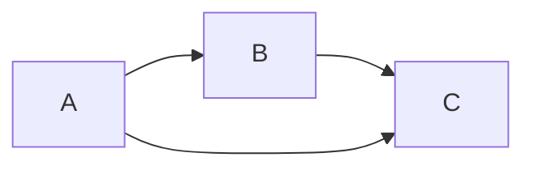

# 因果发现:从数据中提取因果关系

> 关键词：因果发现、数据挖掘、因果关系、因果模型、机器学习

> 摘要：本文聚焦于因果发现这一重要领域，旨在深入探讨如何从数据中提取因果关系。首先介绍了因果发现的背景，包括目的、预期读者、文档结构和相关术语。接着阐述了因果发现的核心概念与联系，通过文本示意图和Mermaid流程图进行直观展示。详细讲解了核心算法原理，并给出Python源代码示例。同时，对因果发现的数学模型和公式进行了深入分析，辅以具体例子说明。通过项目实战，展示了因果发现的实际应用，包括开发环境搭建、源代码实现和代码解读。还探讨了因果发现在不同场景中的实际应用，推荐了相关的学习资源、开发工具框架和论文著作。最后，总结了因果发现的未来发展趋势与挑战，并对常见问题进行了解答，提供了扩展阅读和参考资料。

## 1. 背景介绍 
### 1.1 目的和范围
因果发现是数据科学和机器学习领域中的一个关键问题，其目的是从观测数据中识别出变量之间的因果关系。传统的数据分析方法主要关注变量之间的相关性，然而相关性并不等同于因果性。因果发现旨在深入挖掘数据背后的因果机制，帮助我们理解事物之间的内在联系，从而做出更准确的预测和决策。

本文的范围涵盖了因果发现的基本概念、核心算法、数学模型、实际应用以及相关的工具和资源。我们将详细介绍如何使用不同的方法从数据中提取因果关系，并通过实际案例展示这些方法的应用。

### 1.2 预期读者
本文的预期读者包括数据科学家、机器学习工程师、研究人员以及对因果关系分析感兴趣的技术爱好者。对于希望深入了解因果发现技术的初学者，本文将提供一个系统的入门指南；对于有一定经验的专业人士，本文将提供一些新的思路和方法，帮助他们在实际项目中更好地应用因果发现技术。

### 1.3 文档结构概述
本文将按照以下结构进行组织：
- 核心概念与联系：介绍因果发现的基本概念，包括因果关系的定义、因果模型的类型等，并通过文本示意图和Mermaid流程图展示它们之间的联系。
- 核心算法原理 & 具体操作步骤：详细讲解几种常见的因果发现算法，如基于约束的方法、基于得分的方法等，并给出Python源代码示例。
- 数学模型和公式 & 详细讲解 & 举例说明：介绍因果发现的数学模型和公式，如结构方程模型、因果图模型等，并通过具体例子说明这些模型的应用。
- 项目实战：代码实际案例和详细解释说明：通过一个实际项目，展示如何使用因果发现技术从数据中提取因果关系，包括开发环境搭建、源代码实现和代码解读。
- 实际应用场景：介绍因果发现在不同领域的实际应用，如医疗保健、金融、市场营销等。
- 工具和资源推荐：推荐一些学习因果发现的资源，包括书籍、在线课程、技术博客和网站，以及相关的开发工具框架和论文著作。
- 总结：未来发展趋势与挑战：总结因果发现的发展趋势和面临的挑战。
- 附录：常见问题与解答：解答一些关于因果发现的常见问题。
- 扩展阅读 & 参考资料：提供一些扩展阅读的资料和参考文献。

### 1.4 术语表
#### 1.4.1 核心术语定义
- **因果关系**：指一个变量的变化直接导致另一个变量的变化。例如，吸烟是导致肺癌的一个原因。
- **因果模型**：用于描述变量之间因果关系的数学模型。常见的因果模型包括结构方程模型、因果图模型等。
- **因果发现算法**：用于从数据中识别因果关系的算法。常见的因果发现算法包括基于约束的方法、基于得分的方法等。
- **观测数据**：指通过观察得到的数据，而不是通过实验得到的数据。在因果发现中，我们通常使用观测数据来推断因果关系。
- **干预**：指对一个变量进行人为的改变，以观察其他变量的变化。在因果发现中，干预是验证因果关系的一种重要方法。

#### 1.4.2 相关概念解释
- **相关性**：指两个变量之间的统计关联。相关性并不等同于因果性，两个变量可能存在相关性，但不一定存在因果关系。
- **混杂因素**：指与自变量和因变量都相关的变量，可能会干扰我们对因果关系的判断。例如，在研究吸烟与肺癌的关系时，年龄、性别等因素可能是混杂因素。
- **因果效应**：指一个变量的变化对另一个变量的影响程度。因果效应可以通过实验或统计方法进行估计。

#### 1.4.3 缩略词列表
- **DAG**：有向无环图（Directed Acyclic Graph），是一种常用的因果图模型。
- **SEM**：结构方程模型（Structural Equation Model），是一种用于描述变量之间因果关系的统计模型。
- **PC算法**：彼得斯 - 克拉克算法（Peter - Clark algorithm），是一种基于约束的因果发现算法。
- **GES算法**：贪婪等价搜索算法（Greedy Equivalence Search algorithm），是一种基于得分的因果发现算法。

## 2. 核心概念与联系 

### 2.1 因果关系的定义
因果关系是指一个事件（原因）的发生导致另一个事件（结果）的发生。在数学上，我们可以用函数关系来表示因果关系。设 $X$ 是原因变量，$Y$ 是结果变量，则因果关系可以表示为 $Y = f(X)$，其中 $f$ 是一个函数。

### 2.2 因果模型的类型
常见的因果模型包括：
- **结构方程模型（SEM）**：SEM是一种统计模型，用于描述变量之间的因果关系。它可以表示为一组线性或非线性方程，其中每个方程描述了一个变量与其他变量之间的关系。例如，一个简单的SEM可以表示为：
$$
\begin{cases}
X_1 = \epsilon_1 \\
X_2 = aX_1 + \epsilon_2 \\
X_3 = bX_2 + cX_1 + \epsilon_3
\end{cases}
$$
其中 $X_1, X_2, X_3$ 是变量，$\epsilon_1, \epsilon_2, \epsilon_3$ 是误差项，$a, b, c$ 是系数。

- **因果图模型**：因果图模型是一种用图来表示变量之间因果关系的模型。常见的因果图模型是有向无环图（DAG），其中节点表示变量，有向边表示因果关系。例如，图 1 展示了一个简单的DAG：


图 1：一个简单的有向无环图

### 2.3 核心概念的联系
因果关系是因果发现的核心目标，因果模型是描述因果关系的工具。因果发现算法则是用于从数据中推断因果模型的方法。通过因果发现算法，我们可以从观测数据中识别出变量之间的因果关系，并构建相应的因果模型。

## 3. 核心算法原理 & 具体操作步骤 

### 3.1 基于约束的方法
基于约束的方法是一类因果发现算法，其基本思想是通过检验变量之间的条件独立性来推断因果关系。其中，PC算法是一种经典的基于约束的因果发现算法。

#### 3.1.1 PC算法原理
PC算法的基本步骤如下：
1. **初始化**：构建一个完全无向图，其中每个节点表示一个变量。
2. **独立性检验**：对所有变量对进行条件独立性检验，根据检验结果删除无向图中不满足条件独立性的边。
3. **方向确定**：根据剩余的边和条件独立性信息，确定边的方向，构建有向无环图。

#### 3.1.2 Python代码实现
```python
import numpy as np
import pandas as pd
from causalgraphicalmodels import CausalGraphicalModel
from pgmpy.estimators import PC

# 生成一些示例数据
np.random.seed(0)
n_samples = 1000
X1 = np.random.normal(0, 1, n_samples)
X2 = 0.5 * X1 + np.random.normal(0, 1, n_samples)
X3 = 0.3 * X2 + 0.2 * X1 + np.random.normal(0, 1, n_samples)
data = pd.DataFrame({'X1': X1, 'X2': X2, 'X3': X3})

# 使用PC算法进行因果发现
est = PC(data)
skel, seperating_sets = est.build_skeleton(significance_level=0.05)
pdag = est.skeleton_to_pdag(skel, seperating_sets)
model = est.pdag_to_dag(pdag)

# 输出因果图
print(model.edges())
```

### 3.2 基于得分的方法
基于得分的方法是另一类因果发现算法，其基本思想是通过定义一个得分函数来评估不同的因果模型，选择得分最高的模型作为最优模型。其中，GES算法是一种经典的基于得分的因果发现算法。

#### 3.2.1 GES算法原理
GES算法的基本步骤如下：
1. **初始化**：从一个空的有向无环图开始。
2. **前向搜索**：逐步添加边到图中，直到得分不再增加。
3. **后向搜索**：逐步删除边，直到得分不再增加。

#### 3.2.2 Python代码实现
```python
from pgmpy.estimators import HillClimbSearch
from pgmpy.estimators import BicScore

# 使用GES算法进行因果发现
est = HillClimbSearch(data, scoring_method=BicScore(data))
best_model = est.estimate()

# 输出因果图
print(best_model.edges())
```

## 4. 数学模型和公式 & 详细讲解 & 举例说明 

### 4.1 结构方程模型（SEM）
#### 4.1.1 数学公式
如前面所述，一个简单的SEM可以表示为：
$$
\begin{cases}
X_1 = \epsilon_1 \\
X_2 = aX_1 + \epsilon_2 \\
X_3 = bX_2 + cX_1 + \epsilon_3
\end{cases}
$$
其中 $X_1, X_2, X_3$ 是变量，$\epsilon_1, \epsilon_2, \epsilon_3$ 是误差项，$a, b, c$ 是系数。

#### 4.1.2 详细讲解
在SEM中，每个方程描述了一个变量与其他变量之间的线性关系。误差项表示无法被其他变量解释的部分。通过估计系数 $a, b, c$，我们可以了解变量之间的因果效应。

#### 4.1.3 举例说明
假设我们有一个关于教育程度、工作经验和收入的数据集。我们可以构建一个SEM来描述它们之间的因果关系：
$$
\begin{cases}
\text{教育程度} = \epsilon_1 \\
\text{工作经验} = a\times\text{教育程度} + \epsilon_2 \\
\text{收入} = b\times\text{工作经验} + c\times\text{教育程度} + \epsilon_3
\end{cases}
$$
通过估计系数 $a, b, c$，我们可以了解教育程度对工作经验的影响，以及教育程度和工作经验对收入的影响。

### 4.2 因果图模型
#### 4.2.1 数学基础
因果图模型基于图论和概率论。在有向无环图（DAG）中，每个节点表示一个变量，有向边表示因果关系。我们可以使用条件概率来描述变量之间的关系。例如，对于一个包含三个变量 $X, Y, Z$ 的DAG，如果 $X\rightarrow Y\rightarrow Z$，则 $P(Z|X,Y) = P(Z|Y)$。

#### 4.2.2 详细讲解
因果图模型可以帮助我们直观地理解变量之间的因果关系。通过DAG，我们可以进行因果推理，例如计算因果效应、进行干预分析等。

#### 4.2.3 举例说明
考虑一个医疗场景，假设我们有三个变量：吸烟、肺癌和咳嗽。我们可以构建一个DAG来表示它们之间的因果关系：

从这个DAG中，我们可以看出吸烟是导致肺癌的原因，肺癌是导致咳嗽的原因。我们可以通过干预吸烟这个变量，来观察肺癌和咳嗽的变化，从而验证因果关系。

## 5. 项目实战：代码实际案例和详细解释说明 

### 5.1  开发环境搭建
为了实现因果发现的项目，我们需要搭建以下开发环境：
- **Python环境**：建议使用Python 3.7及以上版本。
- **必要的库**：我们需要安装一些Python库，如`numpy`、`pandas`、`pgmpy`、`causalgraphicalmodels`等。可以使用以下命令进行安装：
```sh
pip install numpy pandas pgmpy causalgraphicalmodels
```

### 5.2  源代码详细实现和代码解读
#### 5.2.1 数据准备
```python
import numpy as np
import pandas as pd

# 生成一些示例数据
np.random.seed(0)
n_samples = 1000
X1 = np.random.normal(0, 1, n_samples)
X2 = 0.5 * X1 + np.random.normal(0, 1, n_samples)
X3 = 0.3 * X2 + 0.2 * X1 + np.random.normal(0, 1, n_samples)
data = pd.DataFrame({'X1': X1, 'X2': X2, 'X3': X3})
```
代码解读：这段代码生成了一个包含三个变量 $X1, X2, X3$ 的数据集。其中，$X2$ 依赖于 $X1$，$X3$ 依赖于 $X1$ 和 $X2$。

#### 5.2.2 使用PC算法进行因果发现
```python
from pgmpy.estimators import PC

# 使用PC算法进行因果发现
est = PC(data)
skel, seperating_sets = est.build_skeleton(significance_level=0.05)
pdag = est.skeleton_to_pdag(skel, seperating_sets)
model = est.pdag_to_dag(pdag)

# 输出因果图
print(model.edges())
```
代码解读：这段代码使用PC算法从数据中推断因果关系。首先，使用`build_skeleton`方法构建无向图的骨架，然后使用`skeleton_to_pdag`方法将骨架转换为部分有向无环图（PDAG），最后使用`pdag_to_dag`方法将PDAG转换为有向无环图（DAG）。

#### 5.2.3 使用GES算法进行因果发现
```python
from pgmpy.estimators import HillClimbSearch
from pgmpy.estimators import BicScore

# 使用GES算法进行因果发现
est = HillClimbSearch(data, scoring_method=BicScore(data))
best_model = est.estimate()

# 输出因果图
print(best_model.edges())
```
代码解读：这段代码使用GES算法从数据中推断因果关系。首先，使用`HillClimbSearch`类初始化一个搜索器，指定得分方法为BIC得分。然后，使用`estimate`方法进行搜索，找到得分最高的模型。

### 5.3  代码解读与分析
通过上述代码，我们可以看到如何使用PC算法和GES算法从数据中提取因果关系。PC算法通过检验变量之间的条件独立性来推断因果关系，而GES算法通过定义得分函数来评估不同的因果模型。在实际应用中，我们可以根据数据的特点和问题的需求选择合适的算法。

## 6. 实际应用场景 
### 6.1 医疗保健
在医疗保健领域，因果发现可以帮助医生理解疾病的病因和治疗效果。例如，通过分析患者的病历数据，我们可以发现某些基因变异与疾病的发生之间的因果关系，从而为个性化医疗提供依据。此外，因果发现还可以用于评估药物的疗效，通过比较接受不同治疗方案的患者的治疗效果，推断治疗方案与治疗效果之间的因果关系。

### 6.2 金融
在金融领域，因果发现可以帮助投资者理解市场波动的原因，从而做出更明智的投资决策。例如，通过分析宏观经济数据、公司财务数据和股票价格数据，我们可以发现某些经济指标与股票价格之间的因果关系，从而预测股票价格的走势。此外，因果发现还可以用于风险管理，通过识别风险因素之间的因果关系，制定更有效的风险控制策略。

### 6.3 市场营销
在市场营销领域，因果发现可以帮助企业了解营销策略与销售业绩之间的因果关系，从而优化营销策略。例如，通过分析广告投放数据、促销活动数据和销售数据，我们可以发现哪些广告渠道和促销活动对销售业绩有显著的影响，从而调整广告投放和促销策略。此外，因果发现还可以用于客户细分，通过识别客户特征与购买行为之间的因果关系，将客户分为不同的群体，制定个性化的营销策略。

## 7. 工具和资源推荐
### 7.1 学习资源推荐
#### 7.1.1 书籍推荐
- 《因果论：模型、推理和推断》（*Causality: Models, Reasoning, and Inference*）：作者是Judea Pearl，这本书是因果推理领域的经典著作，系统地介绍了因果关系的理论和方法。
- 《统计因果推理入门》（*Causal Inference in Statistics: A Primer*）：作者是Judea Pearl、Madelyn Glymour和Nicholas P. Jewell，这本书是一本适合初学者的因果推理教材，用通俗易懂的语言介绍了因果推理的基本概念和方法。

#### 7.1.2 在线课程
- Coursera上的“因果推理”（*Causal Inference*）课程：由哈佛大学的Miguel Hernán教授授课，介绍了因果推理的基本理论和方法。
- edX上的“数据科学中的因果分析”（*Causal Analysis in Data Science*）课程：由华盛顿大学的Bill Howe教授授课，结合实际案例介绍了因果分析在数据科学中的应用。

#### 7.1.3 技术博客和网站
- Causal AI Research：一个专注于因果人工智能研究的网站，提供了最新的研究成果和技术文章。
- Towards Data Science：一个数据科学领域的博客平台，有很多关于因果发现的文章。

### 7.2 开发工具框架推荐
#### 7.2.1 IDE和编辑器
- PyCharm：一个功能强大的Python集成开发环境，适合开发因果发现项目。
- Jupyter Notebook：一个交互式的开发环境，适合进行数据探索和模型验证。

#### 7.2.2 调试和性能分析工具
- PDB：Python自带的调试工具，可以帮助我们调试因果发现代码。
- cProfile：Python的性能分析工具，可以帮助我们分析代码的性能瓶颈。

#### 7.2.3 相关框架和库
- pgmpy：一个Python库，提供了多种因果发现算法的实现，如PC算法、GES算法等。
- causalgraphicalmodels：一个Python库，用于构建和分析因果图模型。

### 7.3 相关论文著作推荐
#### 7.3.1 经典论文
- “Causal diagrams for empirical research”：Judea Pearl发表的一篇经典论文，介绍了因果图模型在实证研究中的应用。
- “Learning Bayesian networks: The combination of knowledge and statistical data”：David Heckerman等人发表的一篇论文，介绍了基于得分的因果发现方法。

#### 7.3.2 最新研究成果
- 可以关注NeurIPS、ICML、KDD等顶级机器学习会议上关于因果发现的最新研究成果。

#### 7.3.3 应用案例分析
- 可以参考一些实际应用案例，如医疗保健、金融、市场营销等领域的因果发现应用案例，了解因果发现技术在实际场景中的应用。

## 8. 总结：未来发展趋势与挑战
### 8.1 未来发展趋势
- **与深度学习的结合**：将因果发现与深度学习相结合，利用深度学习的强大特征提取能力，提高因果发现的准确性和效率。
- **因果强化学习**：将因果推理引入强化学习中，帮助智能体更好地理解环境中的因果关系，从而做出更明智的决策。
- **因果解释性**：提高因果发现模型的解释性，使人们能够更好地理解模型的决策过程和因果关系。

### 8.2 挑战
- **数据质量问题**：因果发现需要高质量的数据，然而实际数据中往往存在噪声、缺失值等问题，这些问题会影响因果发现的准确性。
- **计算复杂度**：一些因果发现算法的计算复杂度较高，在处理大规模数据时效率较低。
- **因果关系的不确定性**：因果关系往往存在一定的不确定性，如何准确地评估因果关系的不确定性是一个挑战。

## 9. 附录：常见问题与解答
### 9.1 因果关系和相关性有什么区别？
相关性是指两个变量之间的统计关联，而因果关系是指一个变量的变化直接导致另一个变量的变化。两个变量可能存在相关性，但不一定存在因果关系。例如，冰淇淋的销量和游泳池的溺水人数之间存在相关性，但这并不意味着冰淇淋的销量导致了游泳池的溺水人数增加，它们之间的相关性可能是由气温等其他因素引起的。

### 9.2 因果发现算法的准确率如何？
因果发现算法的准确率受到多种因素的影响，如数据质量、样本大小、算法的选择等。在实际应用中，我们需要根据具体情况选择合适的算法，并进行充分的实验和验证，以提高因果发现的准确率。

### 9.3 如何验证因果关系？
验证因果关系的一种常用方法是进行实验。通过对自变量进行干预，观察因变量的变化，从而验证因果关系。在无法进行实验的情况下，我们可以使用一些统计方法，如工具变量法、倾向得分匹配法等，来控制混杂因素，从而推断因果关系。

## 10. 扩展阅读 & 参考资料
### 10.1 扩展阅读
- 《为什么：关于因果关系的新科学》（*The Book of Why: The New Science of Cause and Effect*）：作者是Judea Pearl和Dana Mackenzie，这本书以通俗易懂的语言介绍了因果关系的新科学。
- 《因果推理：基础与学习算法》（*Causal Inference: Foundations and Learning Algorithms*）：作者是Bernhard Schölkopf等人，这本书系统地介绍了因果推理的基础理论和学习算法。

### 10.2 参考资料
- Pearl, J. (2009). Causality: Models, Reasoning, and Inference. Cambridge University Press.
- Pearl, J., Glymour, M., & Jewell, N. P. (2016). Causal Inference in Statistics: A Primer. Wiley.

作者：AI天才研究院/AI Genius Institute & 禅与计算机程序设计艺术 /Zen And The Art of Computer Programming