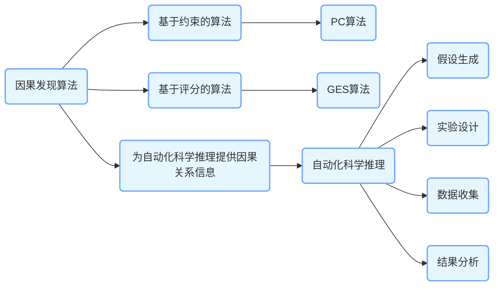

# 因果发现算法在自动化科学推理中的应用

> 关键词：因果发现算法、自动化科学推理、因果关系、机器学习、科学研究

> 摘要：本文深入探讨了因果发现算法在自动化科学推理中的应用。首先介绍了因果发现算法和自动化科学推理的背景知识，包括目的、预期读者等。接着阐述了核心概念及它们之间的联系，详细讲解了核心算法原理和具体操作步骤，并给出Python代码示例。通过数学模型和公式进一步剖析因果发现的本质，还结合实际项目案例进行代码实现和解读。分析了因果发现算法在多个实际场景中的应用，推荐了相关的学习资源、开发工具和论文著作。最后总结了未来的发展趋势与挑战，同时提供常见问题解答和扩展阅读参考资料，旨在为科研人员和从业者在该领域的研究和实践提供全面的指导。

## 1. 背景介绍 
### 1.1 目的和范围
因果发现算法旨在从数据中识别变量之间的因果关系，而自动化科学推理则是利用计算机技术实现科学研究过程中的推理自动化。本文的目的是探讨因果发现算法如何在自动化科学推理中发挥作用，包括介绍相关概念、算法原理、实际应用案例等。范围涵盖了常见的因果发现算法，如基于约束的算法、基于评分的算法等，以及这些算法在不同科学领域的应用。

### 1.2 预期读者
本文预期读者包括科研人员、数据科学家、机器学习从业者、对自动化科学推理和因果关系感兴趣的学生等。无论是从事理论研究还是实际应用开发的人员，都能从本文中获取有价值的信息。

### 1.3 文档结构概述
本文首先介绍背景知识，让读者对因果发现算法和自动化科学推理有初步了解。接着阐述核心概念及联系，帮助读者建立理论框架。然后详细讲解核心算法原理和具体操作步骤，通过Python代码进行演示。利用数学模型和公式深入分析因果关系。通过项目实战案例展示算法的实际应用。分析实际应用场景，为读者提供参考。推荐相关的学习资源、开发工具和论文著作，方便读者进一步学习。最后总结未来发展趋势与挑战，解答常见问题，并提供扩展阅读参考资料。

### 1.4 术语表
#### 1.4.1 核心术语定义
- **因果发现算法**：一类用于从数据中发现变量之间因果关系的算法，通过分析数据的统计特征和结构来推断因果方向。
- **自动化科学推理**：利用计算机程序和算法自动完成科学研究中的推理过程，如假设生成、实验设计、结果验证等。
- **因果关系**：指一个变量的变化会导致另一个变量的变化，具有方向性和因果效应。
- **条件独立性**：在给定其他变量的条件下，两个变量之间相互独立，是因果发现算法中常用的概念。

#### 1.4.2 相关概念解释
- **因果图**：一种用图的形式表示变量之间因果关系的模型，节点表示变量，边表示因果关系。
- **马尔可夫条件**：在因果图中，一个变量在给定其直接父节点的条件下，与其他非后代变量条件独立。
- **忠实性条件**：数据中的条件独立性关系与因果图中的结构一致。

#### 1.4.3 缩略词列表
- **PC算法**：Peter-Clark算法，一种基于约束的因果发现算法。
- **GES算法**：Greedy Equivalence Search算法，一种基于评分的因果发现算法。
- **DAG**：Directed Acyclic Graph，有向无环图，常用于表示因果关系。

## 2. 核心概念与联系 

### 因果发现算法的核心概念
因果发现算法的核心目标是从观测数据中推断变量之间的因果关系。常见的因果发现算法可以分为基于约束的算法和基于评分的算法。

基于约束的算法通过检验变量之间的条件独立性来构建因果图。例如，PC算法通过逐步删除不满足条件独立性的边来构建因果图。其基本思想是，如果两个变量在给定其他变量的条件下是独立的，那么它们之间就不存在直接的因果关系。

基于评分的算法则通过定义一个评分函数来评估不同因果图的优劣，然后通过搜索算法找到评分最高的因果图。例如，GES算法通过贪心搜索的方式在因果图的空间中进行搜索，逐步添加或删除边来优化评分函数。

### 自动化科学推理的核心概念
自动化科学推理是指利用计算机技术自动完成科学研究中的推理过程。它包括假设生成、实验设计、数据收集、结果分析等多个环节。自动化科学推理的目标是提高科学研究的效率和准确性，减少人为因素的干扰。

### 因果发现算法与自动化科学推理的联系
因果发现算法是自动化科学推理中的重要组成部分。在自动化科学推理中，需要从大量的数据中发现变量之间的因果关系，以便提出合理的假设和进行有效的实验设计。因果发现算法可以帮助我们从数据中挖掘出潜在的因果关系，为自动化科学推理提供支持。

### 文本示意图
```plaintext
因果发现算法
|-- 基于约束的算法
|   |-- PC算法
|-- 基于评分的算法
|   |-- GES算法

自动化科学推理
|-- 假设生成
|-- 实验设计
|-- 数据收集
|-- 结果分析

因果发现算法与自动化科学推理的联系
因果发现算法 --> 自动化科学推理（提供因果关系信息）
```

### Mermaid流程图


## 3. 核心算法原理 & 具体操作步骤 

### PC算法原理
PC算法是一种基于约束的因果发现算法，其基本思想是通过检验变量之间的条件独立性来构建因果图。具体步骤如下：
1. **初始化**：构建一个完全无向图，节点表示变量。
2. **删除边**：对于每个节点对，检验它们在不同条件集下的条件独立性。如果在某个条件集下两个节点是独立的，则删除它们之间的边。
3. **定向边**：根据删除边后的图结构，通过一些规则来确定边的方向，得到有向无环图（DAG）。

### Python代码实现PC算法
```python
import numpy as np
import pandas as pd
from causalgraphicalmodels import CausalGraphicalModel
from causallearn.search.ConstraintBased.PC import pc

# 生成示例数据
np.random.seed(0)
n_samples = 1000
x = np.random.normal(0, 1, n_samples)
y = 2 * x + np.random.normal(0, 1, n_samples)
z = 3 * y + np.random.normal(0, 1, n_samples)
data = pd.DataFrame({'X': x, 'Y': y, 'Z': z})

# 使用PC算法进行因果发现
cg = pc(data.values)

# 输出因果图
print(cg.G)
```

### 代码解释
1. **数据生成**：使用`numpy`生成示例数据，其中`Y`依赖于`X`，`Z`依赖于`Y`。
2. **PC算法调用**：使用`causallearn`库中的`pc`函数对数据进行因果发现，得到因果图对象`cg`。
3. **结果输出**：打印因果图的结构。

### GES算法原理
GES算法是一种基于评分的因果发现算法，其基本思想是通过定义一个评分函数来评估不同因果图的优劣，然后通过贪心搜索的方式在因果图的空间中进行搜索，逐步添加或删除边来优化评分函数。具体步骤如下：
1. **初始化**：从一个空图开始。
2. **前向搜索**：不断添加边，直到评分函数不再提高。
3. **后向搜索**：不断删除边，直到评分函数不再提高。

### Python代码实现GES算法
```python
from causallearn.search.ScoreBased.GES import ges

# 使用GES算法进行因果发现
score, dag = ges(data.values)

# 输出因果图
print(dag)
```

### 代码解释
1. **GES算法调用**：使用`causallearn`库中的`ges`函数对数据进行因果发现，得到评分和因果图对象`dag`。
2. **结果输出**：打印因果图的结构。

## 4. 数学模型和公式 & 详细讲解 & 举例说明 

### 条件独立性检验
在因果发现算法中，条件独立性检验是一个重要的步骤。常用的条件独立性检验方法有卡方检验、Fisher's Z检验等。

#### 卡方检验
卡方检验用于检验两个分类变量之间的独立性。假设我们有两个分类变量$X$和$Y$，它们的联合分布为$P(X,Y)$，边缘分布为$P(X)$和$P(Y)$。如果$X$和$Y$是独立的，则有$P(X,Y)=P(X)P(Y)$。

卡方统计量的计算公式为：
$$\chi^2=\sum_{i,j}\frac{(O_{ij}-E_{ij})^2}{E_{ij}}$$
其中，$O_{ij}$是观测频数，$E_{ij}$是期望频数，$E_{ij}=nP(X = i)P(Y = j)$，$n$是样本数量。

#### Fisher's Z检验
Fisher's Z检验用于检验两个连续变量之间的条件独立性。假设我们有三个连续变量$X$、$Y$和$Z$，我们要检验在给定$Z$的条件下，$X$和$Y$是否独立。

首先，计算$X$和$Y$在给定$Z$的条件下的偏相关系数$\rho_{XY|Z}$，然后将其转换为$Z$分数：
$$Z=\frac{1}{2}\ln\frac{1+\rho_{XY|Z}}{1-\rho_{XY|Z}}$$
在原假设$H_0:\rho_{XY|Z}=0$下，$Z$近似服从正态分布$N(0,\frac{1}{n - |Z| - 3})$，其中$n$是样本数量，$|Z|$是条件集$Z$的大小。

### 评分函数
在基于评分的因果发现算法中，评分函数用于评估不同因果图的优劣。常用的评分函数有贝叶斯信息准则（BIC）、最小描述长度准则（MDL）等。

#### 贝叶斯信息准则（BIC）
BIC评分函数的计算公式为：
$$BIC(G,D)=-2\ln P(D|G)+|G|\ln n$$
其中，$G$是因果图，$D$是数据，$P(D|G)$是数据在因果图$G$下的似然函数，$|G|$是因果图$G$的参数数量，$n$是样本数量。

#### 举例说明
假设我们有一个简单的因果图$G$，包含两个变量$X$和$Y$，$X$是$Y$的原因。我们有一组观测数据$D$，包含$n = 100$个样本。

首先，我们计算数据在因果图$G$下的似然函数$P(D|G)$。假设$Y$服从线性回归模型$Y=\beta X+\epsilon$，其中$\epsilon$是噪声项，服从正态分布$N(0,\sigma^2)$。我们可以使用最大似然估计来估计参数$\beta$和$\sigma^2$，然后计算似然函数$P(D|G)$。

假设我们估计得到$\beta = 2$，$\sigma^2 = 1$，则似然函数为：
$$P(D|G)=\prod_{i = 1}^{n}\frac{1}{\sqrt{2\pi\sigma^2}}\exp\left(-\frac{(y_i - \beta x_i)^2}{2\sigma^2}\right)$$

因果图$G$的参数数量$|G| = 2$（$\beta$和$\sigma^2$）。

最后，我们可以计算BIC评分：
$$BIC(G,D)=-2\ln P(D|G)+|G|\ln n$$

## 5. 项目实战：代码实际案例和详细解释说明 

### 5.1  开发环境搭建
#### 安装Python
首先，确保你已经安装了Python 3.x版本。你可以从Python官方网站（https://www.python.org/downloads/）下载并安装Python。

#### 安装必要的库
我们需要安装一些必要的Python库，包括`numpy`、`pandas`、`causallearn`等。可以使用以下命令进行安装：
```sh
pip install numpy pandas causallearn
```

### 5.2  源代码详细实现和代码解读
#### 项目背景
假设我们要研究学生的学习成绩（`Grade`）、学习时间（`StudyTime`）和睡眠时间（`SleepTime`）之间的因果关系。我们收集了一组学生的数据，包括他们的学习时间、睡眠时间和学习成绩。

#### 代码实现
```python
import numpy as np
import pandas as pd
from causallearn.search.ConstraintBased.PC import pc
from causallearn.utils.GraphUtils import GraphUtils
import matplotlib.pyplot as plt

# 生成示例数据
np.random.seed(0)
n_samples = 1000
study_time = np.random.normal(5, 1, n_samples)
sleep_time = np.random.normal(7, 1, n_samples)
grade = 0.5 * study_time + 0.3 * sleep_time + np.random.normal(0, 1, n_samples)
data = pd.DataFrame({'StudyTime': study_time, 'SleepTime': sleep_time, 'Grade': grade})

# 使用PC算法进行因果发现
cg = pc(data.values)

# 可视化因果图
pyd = GraphUtils.to_pydot(cg.G)
pyd.write_png('causal_graph.png')

# 显示因果图
img = plt.imread('causal_graph.png')
plt.imshow(img)
plt.axis('off')
plt.show()
```

#### 代码解读
1. **数据生成**：使用`numpy`生成示例数据，其中`Grade`依赖于`StudyTime`和`SleepTime`。
2. **PC算法调用**：使用`causallearn`库中的`pc`函数对数据进行因果发现，得到因果图对象`cg`。
3. **因果图可视化**：使用`GraphUtils.to_pydot`函数将因果图对象转换为`pydot`对象，然后将其保存为PNG文件。最后使用`matplotlib`库显示因果图。

### 5.3  代码解读与分析
#### 结果分析
运行上述代码后，我们可以得到一个因果图，该图显示了`StudyTime`、`SleepTime`和`Grade`之间的因果关系。如果因果图中存在从`StudyTime`到`Grade`的边，说明学习时间对学习成绩有因果影响；同理，如果存在从`SleepTime`到`Grade`的边，说明睡眠时间对学习成绩有因果影响。

#### 局限性
需要注意的是，因果发现算法的结果依赖于数据的质量和样本数量。如果数据存在噪声或样本数量不足，可能会导致因果关系的误判。此外，因果发现算法只能发现数据中潜在的因果关系，不能证明因果关系的存在，需要结合领域知识和实验验证。

## 6. 实际应用场景 
### 医学研究
在医学研究中，因果发现算法可以帮助医生和研究人员从大量的临床数据中发现疾病的危险因素和治疗效果的因果关系。例如，通过分析患者的基因数据、生活习惯数据和疾病诊断数据，可以发现哪些基因和生活习惯与某种疾病的发生和发展有关，从而为疾病的预防和治疗提供依据。

### 经济学
在经济学中，因果发现算法可以用于分析经济变量之间的因果关系，如通货膨胀率、失业率和利率之间的关系。通过发现这些因果关系，可以帮助政策制定者制定更加有效的经济政策。

### 市场营销
在市场营销中，因果发现算法可以帮助企业分析广告投放、促销活动和销售业绩之间的因果关系。例如，通过分析不同广告渠道的投放数据和销售数据，可以发现哪些广告渠道对销售业绩有显著的因果影响，从而优化广告投放策略。

### 环境科学
在环境科学中，因果发现算法可以用于分析环境因素和生态系统之间的因果关系。例如，通过分析气候变化数据、污染物排放数据和生物多样性数据，可以发现哪些环境因素对生物多样性有显著的因果影响，从而为环境保护和生态修复提供依据。

## 7. 工具和资源推荐
### 7.1 学习资源推荐
#### 7.1.1 书籍推荐
- 《Causality: Models, Reasoning, and Inference》：由Judea Pearl所著，是因果关系领域的经典著作，详细介绍了因果关系的理论和方法。
- 《Elements of Causal Inference: Foundations and Learning Algorithms》：由Jonas Peters、Dominik Janzing和Bernhard Schölkopf所著，系统地介绍了因果推断的基本概念、算法和应用。

#### 7.1.2 在线课程
- Coursera上的“Causal Graphical Models”课程：由哥伦比亚大学的教授授课，介绍了因果图模型的基本概念和应用。
- edX上的“Probability-The Science of Uncertainty and Data”课程：涵盖了概率和统计的基础知识，以及因果推断的相关内容。

#### 7.1.3 技术博客和网站
- Towards Data Science：一个专注于数据科学和机器学习的技术博客，有很多关于因果发现和因果推断的文章。
- Causal Inference Initiative：一个专门研究因果推断的网站，提供了大量的研究论文、代码和工具。

### 7.2 开发工具框架推荐
#### 7.2.1 IDE和编辑器
- PyCharm：一个功能强大的Python集成开发环境，支持代码调试、代码分析等功能。
- Jupyter Notebook：一个交互式的开发环境，适合进行数据探索和模型开发。

#### 7.2.2 调试和性能分析工具
- PDB：Python自带的调试工具，可以帮助我们调试代码。
- cProfile：Python自带的性能分析工具，可以帮助我们分析代码的性能瓶颈。

#### 7.2.3 相关框架和库
- causallearn：一个开源的因果发现库，提供了多种因果发现算法的实现。
- DoWhy：一个用于因果推断的Python库，支持多种因果推断方法。

### 7.3 相关论文著作推荐
#### 7.3.1 经典论文
- “Causal Diagrams for Empirical Research”：由Judea Pearl所著，介绍了因果图在实证研究中的应用。
- “Learning Bayesian Networks: The Combination of Knowledge and Statistical Data”：由Gregory F. Cooper和Edward Herskovits所著，介绍了贝叶斯网络的学习方法。

#### 7.3.2 最新研究成果
- 可以关注顶级学术会议如NeurIPS、ICML、AAAI等上关于因果发现和因果推断的最新研究成果。

#### 7.3.3 应用案例分析
- 可以在ACM SIGKDD、IEEE ICDM等数据挖掘会议上找到因果发现算法在不同领域的应用案例分析。

## 8. 总结：未来发展趋势与挑战
### 未来发展趋势
- **与深度学习的结合**：将因果发现算法与深度学习相结合，利用深度学习强大的特征提取能力，提高因果发现的准确性和效率。
- **多源数据融合**：在实际应用中，数据往往来自多个不同的数据源。未来的研究将注重多源数据的融合，以更全面地发现因果关系。
- **可解释性因果模型**：随着人工智能的广泛应用，对模型的可解释性要求越来越高。未来的因果发现算法将更加注重可解释性，以便更好地应用于实际场景。

### 挑战
- **数据质量和数量**：因果发现算法的性能高度依赖于数据的质量和数量。在实际应用中，往往面临数据噪声大、样本数量不足等问题，需要进一步研究如何处理这些问题。
- **因果关系的复杂性**：现实世界中的因果关系往往非常复杂，存在多个中间变量和反馈回路。如何准确地发现和表示这些复杂的因果关系是一个挑战。
- **计算复杂度**：因果发现算法的计算复杂度通常较高，尤其是在处理大规模数据和复杂因果图时。如何降低计算复杂度，提高算法的效率是未来需要解决的问题。

## 9. 附录：常见问题与解答
### 问题1：因果发现算法和相关性分析有什么区别？
相关性分析只能发现变量之间的线性或非线性关联，不能确定因果关系的方向。而因果发现算法的目标是从数据中推断变量之间的因果关系，具有方向性。

### 问题2：因果发现算法的结果一定是准确的吗？
不一定。因果发现算法的结果依赖于数据的质量和样本数量，以及所采用的假设和方法。在实际应用中，需要结合领域知识和实验验证来确定因果关系的存在。

### 问题3：如何选择合适的因果发现算法？
选择合适的因果发现算法需要考虑数据的类型（如连续数据、分类数据）、样本数量、因果关系的复杂程度等因素。一般来说，基于约束的算法适用于数据量较大、因果关系相对简单的情况；基于评分的算法适用于数据量较小、因果关系相对复杂的情况。

## 10. 扩展阅读 & 参考资料
- Pearl, J. (2009). Causality: Models, Reasoning, and Inference. Cambridge University Press.
- Peters, J., Janzing, D., & Schölkopf, B. (2017). Elements of Causal Inference: Foundations and Learning Algorithms. MIT Press.
- Spirtes, P., Glymour, C. N., & Scheines, R. (2000). Causation, Prediction, and Search. MIT Press.

作者：AI天才研究院/AI Genius Institute & 禅与计算机程序设计艺术 /Zen And The Art of Computer Programming