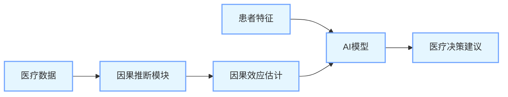

# 因果推断增强AI模型在医疗决策中的可靠性

> 关键词：因果推断、AI模型、医疗决策、可靠性、机器学习

> 摘要：本文聚焦于因果推断增强AI模型在医疗决策中的应用，旨在探讨如何利用因果推断提升AI模型在医疗场景下的可靠性。首先介绍了研究的背景、目的、预期读者和文档结构，详细解释了相关术语。接着阐述了因果推断与AI模型的核心概念及联系，给出了原理和架构的示意图与流程图。深入分析了核心算法原理，并用Python代码进行详细阐述，同时给出了数学模型和公式。通过项目实战展示了代码的实际应用，包括开发环境搭建、源代码实现与解读。探讨了该技术在医疗决策中的实际应用场景，推荐了相关的学习资源、开发工具框架和论文著作。最后总结了未来发展趋势与挑战，并提供了常见问题解答和扩展阅读参考资料，为推动因果推断增强AI模型在医疗决策中的应用提供了全面的技术指导。

## 1. 背景介绍 
### 1.1 目的和范围
在医疗领域，AI模型已经被广泛应用于疾病诊断、治疗方案推荐等多个方面。然而，传统的AI模型往往基于相关性进行预测，缺乏对因果关系的理解，这可能导致在医疗决策中出现不准确或不合理的建议。本研究的目的是探讨如何利用因果推断的方法增强AI模型在医疗决策中的可靠性，使模型能够更好地理解治疗措施与患者结果之间的因果关系，从而为医生提供更准确、更具解释性的决策支持。

研究范围涵盖了因果推断的基本理论、常用的因果推断算法、如何将因果推断与AI模型相结合，以及在医疗决策中的具体应用。同时，还会通过实际案例展示如何在医疗场景中实现和应用这些技术，评估其对医疗决策可靠性的提升效果。

### 1.2 预期读者
本文的预期读者包括医疗领域的专业人士，如医生、医学研究人员，他们可以通过了解因果推断增强AI模型的技术，更好地利用这些工具辅助医疗决策；计算机科学领域的研究人员和开发者，他们对AI模型和因果推断技术感兴趣，希望将这些技术应用于医疗场景；以及对医疗信息化和人工智能交叉领域感兴趣的学生和爱好者。

### 1.3 文档结构概述
本文将按照以下结构进行组织：首先介绍相关的背景知识和术语，为后续的讨论奠定基础；然后详细阐述因果推断与AI模型的核心概念及联系，包括原理和架构；接着分析核心算法原理，并给出Python代码实现；通过数学模型和公式进一步深入解释相关技术；进行项目实战，展示代码的实际应用和详细解读；探讨该技术在医疗决策中的实际应用场景；推荐相关的学习资源、开发工具框架和论文著作；最后总结未来发展趋势与挑战，提供常见问题解答和扩展阅读参考资料。

### 1.4 术语表
#### 1.4.1 核心术语定义
- **因果推断（Causal Inference）**：是一种从数据中识别和估计因果关系的统计方法。它旨在回答“如果改变某个因素，会对结果产生怎样的影响”这类问题，而不仅仅是观察变量之间的相关性。
- **AI模型（Artificial Intelligence Model）**：是基于人工智能技术构建的数学模型，用于处理和分析数据，进行预测、分类、聚类等任务。在医疗领域，常见的AI模型包括神经网络、决策树、支持向量机等。
- **医疗决策（Medical Decision - Making）**：是指医生根据患者的症状、检查结果、病史等信息，结合医学知识和经验，选择最适合患者的治疗方案的过程。
- **可靠性（Reliability）**：在本文中，指的是AI模型在医疗决策中提供准确、稳定、可解释的建议的能力。

#### 1.4.2 相关概念解释
- **相关性与因果性**：相关性是指两个变量之间的统计关联，即一个变量的变化与另一个变量的变化存在某种趋势。而因果性则表示一个变量的变化直接导致了另一个变量的变化。例如，冰淇淋销量和游泳溺亡人数可能存在相关性，但它们之间并没有因果关系，真正的因果因素可能是天气炎热。
- **反事实推理（Counterfactual Reasoning）**：是因果推断中的一个重要概念，它考虑在不同干预条件下可能发生的结果。例如，对于一个接受了某种治疗的患者，反事实推理会思考如果该患者没有接受这种治疗，结果会是怎样。

#### 1.4.3 缩略词列表
- **ML（Machine Learning）**：机器学习，是AI的一个重要分支，专注于让计算机通过数据学习模式和规律。
- **DL（Deep Learning）**：深度学习，是一种基于神经网络的机器学习技术，具有强大的特征提取和建模能力。
- **ATE（Average Treatment Effect）**：平均治疗效果，是因果推断中常用的一个指标，用于衡量某种治疗措施对总体人群的平均影响。

## 2. 核心概念与联系 

### 核心概念原理
因果推断的核心原理是通过对数据的分析和建模，识别出变量之间的因果关系。在医疗场景中，我们通常关注的是治疗措施（如药物治疗、手术等）与患者结果（如康复情况、生存率等）之间的因果联系。传统的统计方法往往只能发现变量之间的相关性，而因果推断则试图排除其他混淆因素的干扰，找出真正的因果效应。

一种常见的因果推断方法是基于潜在结果框架（Potential Outcomes Framework）。该框架假设每个个体都有两种潜在结果：接受治疗的结果和未接受治疗的结果。由于一个个体在某一时刻只能接受一种治疗，所以我们只能观察到其中一个潜在结果，另一个则是反事实结果。因果推断的目标就是通过对观察数据的分析，估计出这些反事实结果，从而计算出治疗的因果效应。

AI模型则是通过对大量数据的学习，构建出输入（如患者的特征、症状等）与输出（如疾病诊断、治疗效果预测等）之间的映射关系。常见的AI模型包括决策树、神经网络、支持向量机等，它们在处理复杂的非线性关系方面具有很强的能力。

### 架构示意图

该架构示意图展示了因果推断与AI模型相结合的基本流程。首先，从医疗数据中提取信息，经过因果推断模块估计出治疗的因果效应。同时，患者的特征数据输入到AI模型中。因果效应估计结果也会作为输入信息传递给AI模型，最终AI模型输出医疗决策建议。

### 核心概念联系
因果推断和AI模型在医疗决策中可以相互补充。因果推断可以为AI模型提供更深入的因果信息，帮助模型更好地理解变量之间的关系，从而提高模型的可靠性和可解释性。例如，在预测某种药物的治疗效果时，因果推断可以帮助模型排除其他因素的干扰，准确估计出药物的真实效果。

另一方面，AI模型强大的数据分析和建模能力可以为因果推断提供更高效的计算方法。AI模型可以处理大规模的医疗数据，发现其中隐藏的模式和规律，为因果推断提供更丰富的数据支持。通过将因果推断与AI模型相结合，可以构建出更智能、更可靠的医疗决策支持系统。

## 3. 核心算法原理 & 具体操作步骤 

### 核心算法原理
在因果推断中，一种常用的算法是倾向得分匹配（Propensity Score Matching，PSM）。倾向得分是指个体接受某种治疗的概率，通过对倾向得分进行匹配，可以使接受治疗和未接受治疗的两组个体在其他特征上尽可能相似，从而减少混淆因素的影响，估计出治疗的因果效应。

具体来说，倾向得分匹配的步骤如下：
1. **计算倾向得分**：使用逻辑回归等方法，根据个体的特征变量预测其接受治疗的概率，得到倾向得分。
2. **匹配个体**：根据倾向得分，为接受治疗的个体找到与之倾向得分相近的未接受治疗的个体进行匹配。
3. **估计因果效应**：对匹配后的两组个体的结果进行比较，计算出平均治疗效果（ATE）。

### Python源代码详细阐述
```python
import pandas as pd
import numpy as np
from sklearn.linear_model import LogisticRegression
from sklearn.neighbors import NearestNeighbors

# 生成示例数据
np.random.seed(0)
n = 1000
X = np.random.randn(n, 5)  # 特征变量
T = np.random.binomial(1, 0.5, n)  # 治疗变量
Y = 2 * T + 0.5 * X[:, 0] + np.random.randn(n)  # 结果变量

data = pd.DataFrame(np.hstack([X, T.reshape(-1, 1), Y.reshape(-1, 1)]),
                    columns=['X1', 'X2', 'X3', 'X4', 'X5', 'T', 'Y'])

# 步骤1：计算倾向得分
model = LogisticRegression()
model.fit(data[['X1', 'X2', 'X3', 'X4', 'X5']], data['T'])
data['propensity_score'] = model.predict_proba(data[['X1', 'X2', 'X3', 'X4', 'X5']])[:, 1]

# 步骤2：匹配个体
treated = data[data['T'] == 1]
control = data[data['T'] == 0]

nbrs = NearestNeighbors(n_neighbors=1).fit(control[['propensity_score']])
distances, indices = nbrs.kneighbors(treated[['propensity_score']])

matched_control = control.iloc[indices.flatten()]

# 步骤3：估计因果效应
ate = np.mean(treated['Y']) - np.mean(matched_control['Y'])
print(f"平均治疗效果 (ATE): {ate}")
```
### 代码解释
1. **数据生成**：使用`numpy`生成示例数据，包括特征变量`X`、治疗变量`T`和结果变量`Y`。
2. **计算倾向得分**：使用`sklearn`中的`LogisticRegression`模型，根据特征变量预测个体接受治疗的概率，得到倾向得分。
3. **匹配个体**：使用`NearestNeighbors`算法，为接受治疗的个体找到与之倾向得分最接近的未接受治疗的个体进行匹配。
4. **估计因果效应**：计算匹配后接受治疗组和未接受治疗组的平均结果差异，得到平均治疗效果（ATE）。

## 4. 数学模型和公式 & 详细讲解 & 举例说明 

### 潜在结果框架
潜在结果框架是因果推断的基础理论之一。假设对于每个个体 $i$，有两种潜在结果：$Y_i(1)$ 表示个体 $i$ 接受治疗时的结果，$Y_i(0)$ 表示个体 $i$ 未接受治疗时的结果。而我们实际观察到的结果 $Y_i$ 可以表示为：
$$Y_i = T_iY_i(1)+(1 - T_i)Y_i(0)$$
其中 $T_i$ 是个体 $i$ 的治疗变量，$T_i = 1$ 表示接受治疗，$T_i = 0$ 表示未接受治疗。

### 平均治疗效果（ATE）
平均治疗效果（ATE）是衡量治疗措施对总体人群平均影响的指标，定义为：
$$ATE = E[Y(1)-Y(0)]$$
其中 $E[\cdot]$ 表示期望。由于我们无法同时观察到同一个体的 $Y(1)$ 和 $Y(0)$，所以需要通过因果推断的方法来估计 ATE。

### 倾向得分
倾向得分 $e(X)$ 是个体接受治疗的条件概率，定义为：
$$e(X)=P(T = 1|X)$$
其中 $X$ 是个体的特征变量。倾向得分的作用是平衡接受治疗和未接受治疗两组个体的特征分布，从而减少混淆因素的影响。

### 举例说明
假设有一个医学研究，研究某种药物对患者康复情况的影响。我们收集了 100 名患者的数据，包括患者的年龄、性别、病情严重程度等特征变量 $X$，治疗变量 $T$（$T = 1$ 表示使用药物，$T = 0$ 表示未使用药物）和康复情况 $Y$（$Y = 1$ 表示康复，$Y = 0$ 表示未康复）。

首先，我们使用逻辑回归模型计算每个患者的倾向得分 $e(X)$。然后，根据倾向得分进行匹配，为使用药物的患者找到与之倾向得分相近的未使用药物的患者。最后，比较匹配后两组患者的康复率，估计出该药物的平均治疗效果（ATE）。如果 ATE 为正且显著，说明该药物对患者的康复有积极的影响。

## 5. 项目实战：代码实际案例和详细解释说明 

### 5.1  开发环境搭建
#### 安装Python
首先需要安装Python，建议使用Python 3.7及以上版本。可以从Python官方网站（https://www.python.org/downloads/）下载安装包，按照安装向导进行安装。

#### 安装必要的库
使用`pip`命令安装以下必要的Python库：
```bash
pip install pandas numpy scikit-learn
```
- `pandas`：用于数据处理和分析。
- `numpy`：用于数值计算。
- `scikit-learn`：提供了丰富的机器学习算法和工具。

### 5.2  源代码详细实现和代码解读
```python
import pandas as pd
import numpy as np
from sklearn.linear_model import LogisticRegression
from sklearn.neighbors import NearestNeighbors
from sklearn.model_selection import train_test_split
from sklearn.metrics import accuracy_score

# 加载医疗数据集
data = pd.read_csv('medical_data.csv')

# 划分特征变量、治疗变量和结果变量
X = data.drop(['treatment', 'outcome'], axis=1)
T = data['treatment']
Y = data['outcome']

# 步骤1：计算倾向得分
model = LogisticRegression()
model.fit(X, T)
propensity_scores = model.predict_proba(X)[:, 1]

# 步骤2：匹配个体
treated_indices = T[T == 1].index
control_indices = T[T == 0].index

treated_scores = propensity_scores[treated_indices]
control_scores = propensity_scores[control_indices]

nbrs = NearestNeighbors(n_neighbors=1).fit(control_scores.reshape(-1, 1))
distances, indices = nbrs.kneighbors(treated_scores.reshape(-1, 1))

matched_control_indices = control_indices[indices.flatten()]

# 步骤3：估计因果效应
treated_outcomes = Y[treated_indices]
matched_control_outcomes = Y[matched_control_indices]

ate = np.mean(treated_outcomes) - np.mean(matched_control_outcomes)
print(f"平均治疗效果 (ATE): {ate}")

# 步骤4：构建AI模型进行医疗决策
X_train, X_test, Y_train, Y_test = train_test_split(X, Y, test_size=0.2, random_state=42)

from sklearn.ensemble import RandomForestClassifier
rf_model = RandomForestClassifier()
rf_model.fit(X_train, Y_train)

Y_pred = rf_model.predict(X_test)
accuracy = accuracy_score(Y_test, Y_pred)
print(f"AI模型准确率: {accuracy}")
```
### 代码解读与分析
1. **数据加载与预处理**：使用`pandas`库加载医疗数据集，并将特征变量、治疗变量和结果变量进行划分。
2. **计算倾向得分**：使用逻辑回归模型计算每个个体的倾向得分，反映其接受治疗的概率。
3. **匹配个体**：根据倾向得分，为接受治疗的个体找到与之最接近的未接受治疗的个体进行匹配。
4. **估计因果效应**：计算匹配后接受治疗组和未接受治疗组的平均结果差异，得到平均治疗效果（ATE）。
5. **构建AI模型**：使用随机森林分类器构建AI模型，对患者的结果进行预测，并计算模型的准确率。

通过这种方式，我们将因果推断与AI模型相结合，既可以估计出治疗的因果效应，又可以利用AI模型进行医疗决策的预测。

## 6. 实际应用场景 
### 药物疗效评估
在药物研发和临床应用中，因果推断增强的AI模型可以更准确地评估药物的疗效。传统的临床试验往往只能观察到药物与患者结果之间的相关性，而因果推断可以排除其他混淆因素的干扰，估计出药物的真实因果效应。例如，在评估一种新的抗癌药物时，考虑到患者的年龄、性别、病情严重程度等因素，通过因果推断可以更准确地判断药物对患者生存率的影响，为药物的推广和应用提供更可靠的依据。

### 治疗方案选择
在临床实践中，医生需要根据患者的具体情况选择最适合的治疗方案。因果推断增强的AI模型可以为医生提供更科学的决策支持。通过分析大量的医疗数据，模型可以估计出不同治疗方案对患者结果的因果效应，帮助医生权衡各种治疗方案的利弊。例如，对于患有心脏病的患者，模型可以根据患者的特征，预测不同治疗方法（如药物治疗、手术治疗等）对患者康复情况的影响，从而辅助医生做出更合理的治疗决策。

### 疾病风险预测
因果推断增强的AI模型还可以用于疾病风险预测。通过识别疾病发生的因果因素，模型可以更准确地预测个体患某种疾病的风险。例如，在预测糖尿病的发病风险时，考虑到患者的饮食习惯、运动情况、家族病史等因果因素，模型可以给出更精准的风险评估，有助于医生提前采取预防措施，降低疾病的发生率。

### 医疗资源分配
在医疗资源有限的情况下，合理分配资源至关重要。因果推断增强的AI模型可以帮助医疗机构优化资源分配。通过分析不同治疗措施对患者结果的因果效应，模型可以确定哪些患者最需要某种医疗资源，从而提高资源的利用效率。例如，在分配器官移植资源时，模型可以根据患者的病情、预后等因素，评估不同患者接受器官移植后的效果，为资源分配提供科学依据。

## 7. 工具和资源推荐
### 7.1 学习资源推荐
#### 7.1.1 书籍推荐
- 《因果推断：基础与学习算法》（Causal Inference: What If）：这本书由Miguel A. Hernán和James M. Robins所著，是因果推断领域的经典教材，详细介绍了因果推断的基本理论和方法，包括潜在结果框架、倾向得分匹配、工具变量法等。
- 《人工智能：一种现代的方法》（Artificial Intelligence: A Modern Approach）：由Stuart Russell和Peter Norvig编写，是人工智能领域的权威著作，涵盖了AI的各个方面，包括机器学习、深度学习、知识表示等，为理解AI模型提供了坚实的基础。
- 《医学数据挖掘与分析》：介绍了如何将数据挖掘和分析技术应用于医学领域，包括疾病预测、治疗效果评估等，对于将因果推断和AI模型应用于医疗决策具有重要的参考价值。

#### 7.1.2 在线课程
- Coursera上的“因果推断入门”（A Crash Course in Causality）：由宾夕法尼亚大学的Jason A. Roy教授授课，课程内容涵盖了因果推断的基本概念、方法和应用，通过实际案例帮助学习者掌握因果推断的技术。
- edX上的“人工智能基础”（Introduction to Artificial Intelligence）：由麻省理工学院的Patrick H. Winston教授授课，系统介绍了人工智能的基本原理和方法，包括搜索算法、机器学习、自然语言处理等，是学习AI模型的优秀课程。
- 中国大学MOOC上的“医学大数据分析与应用”：结合医学领域的实际需求，介绍了大数据分析的方法和技术，以及如何将其应用于医疗决策和研究中。

#### 7.1.3 技术博客和网站
- Towards Data Science：是一个专注于数据科学和机器学习的博客平台，上面有很多关于因果推断和AI模型的文章，包括算法讲解、案例分析等，对于学习和实践具有很大的帮助。
- ArXiv：是一个开放的学术预印本平台，上面可以找到很多关于因果推断和人工智能的最新研究成果和论文，及时了解该领域的前沿动态。
- Kaggle：是一个数据科学竞赛平台，上面有很多医疗相关的数据集和竞赛项目，可以通过参与竞赛和学习他人的解决方案，提高自己在因果推断和AI模型应用方面的能力。

### 7.2 开发工具框架推荐
#### 7.2.1 IDE和编辑器
- PyCharm：是一款专门为Python开发设计的集成开发环境（IDE），具有强大的代码编辑、调试、自动补全、版本控制等功能，非常适合开发因果推断和AI模型相关的Python代码。
- Jupyter Notebook：是一个交互式的开发环境，支持Python、R等多种编程语言。它以笔记本的形式组织代码和文档，方便进行数据探索、模型训练和结果展示，是数据科学和机器学习领域常用的工具之一。
- Visual Studio Code：是一款轻量级的代码编辑器，具有丰富的插件生态系统。可以通过安装Python相关的插件，实现代码编辑、调试、运行等功能，同时还支持版本控制和团队协作。

#### 7.2.2 调试和性能分析工具
- pdb：是Python自带的调试器，可以在代码中设置断点，逐步执行代码，查看变量的值和程序的执行流程，帮助开发者定位和解决代码中的问题。
- cProfile：是Python的性能分析工具，可以统计代码中各个函数的执行时间和调用次数，找出代码中的性能瓶颈，优化代码的性能。
- TensorBoard：是TensorFlow框架提供的可视化工具，也可以用于其他深度学习框架。它可以可视化模型的训练过程、损失函数的变化、模型的结构等，帮助开发者更好地理解和优化模型。

#### 7.2.3 相关框架和库
- scikit - learn：是Python中最常用的机器学习库之一，提供了丰富的机器学习算法和工具，包括分类、回归、聚类、降维等。在因果推断中，可以使用其逻辑回归、决策树等算法进行倾向得分计算和模型训练。
- TensorFlow：是Google开发的开源深度学习框架，具有强大的计算能力和灵活性。可以用于构建和训练各种深度学习模型，如神经网络、卷积神经网络等，在医疗图像分析、疾病预测等方面有广泛的应用。
- PyTorch：是另一个流行的深度学习框架，以其简洁易用的接口和动态图机制受到开发者的喜爱。在因果推断和AI模型研究中，PyTorch可以用于实现复杂的模型结构和算法。

### 7.3 相关论文著作推荐
#### 7.3.1 经典论文
- “The Central Role of the Propensity Score in Observational Studies for Causal Effects”：由Paul R. Rosenbaum和Donald B. Rubin发表，首次提出了倾向得分的概念，并详细阐述了其在因果推断中的应用，是倾向得分匹配方法的经典论文。
- “Causality: Models, Reasoning, and Inference”：Judea Pearl的著作，系统地介绍了因果推断的理论和方法，包括因果图模型、干预计算等，对因果推断领域的发展产生了深远的影响。
- “Deep Residual Learning for Image Recognition”：由Kaiming He等人发表，提出了残差网络（ResNet）的概念，解决了深度神经网络训练中的梯度消失问题，在计算机视觉领域取得了巨大的成功，也为AI模型在医疗图像分析中的应用提供了重要的基础。

#### 7.3.2 最新研究成果
- 关注顶级学术会议如NeurIPS（神经信息处理系统大会）、ICML（国际机器学习会议）、KDD（知识发现与数据挖掘会议）等，这些会议上会发表很多关于因果推断和AI模型的最新研究成果。例如，一些研究致力于将因果推断与强化学习相结合，用于优化医疗决策过程；另一些研究则探索如何利用深度学习技术提高因果效应估计的准确性。
- 医学领域的顶级期刊如《新英格兰医学杂志》（The New England Journal of Medicine）、《柳叶刀》（The Lancet）等也会发表一些关于AI在医疗决策中应用的研究论文，这些论文通常结合了实际的临床数据，具有很高的实践价值。

#### 7.3.3 应用案例分析
- 《应用因果分析》（Applied Causal Analysis）：书中包含了大量的因果推断应用案例，涉及医疗、经济、社会等多个领域。通过学习这些案例，可以了解因果推断在不同场景下的具体应用方法和实践经验。
- Kaggle上的一些医疗相关竞赛项目的解决方案，这些方案通常详细介绍了如何使用因果推断和AI模型解决实际的医疗问题，如疾病诊断、治疗效果预测等，可以从中学习到实际应用中的技巧和方法。

## 8. 总结：未来发展趋势与挑战
### 未来发展趋势
#### 多模态数据融合
未来，因果推断增强的AI模型将越来越多地融合多模态数据，如医疗图像、基因数据、电子病历等。通过综合分析不同类型的数据，可以更全面地了解患者的病情，提高医疗决策的准确性和可靠性。例如，结合医学影像和基因数据，可以更精准地预测癌症患者的治疗反应和预后情况。

#### 可解释性增强
随着AI模型在医疗决策中的应用越来越广泛，对模型可解释性的要求也越来越高。未来的研究将致力于开发更具解释性的因果推断和AI模型，使医生能够理解模型的决策过程和依据。例如，通过引入因果图模型和特征重要性分析等方法，解释模型为什么做出某个治疗建议，增强医生对模型的信任。

#### 个性化医疗决策
因果推断增强的AI模型将为个性化医疗决策提供更强大的支持。根据患者的个体特征，如基因组成、生活习惯、病史等，模型可以为每个患者制定个性化的治疗方案，提高治疗效果和患者的生活质量。例如，在肿瘤治疗中，根据患者的基因检测结果和肿瘤特征，选择最适合的治疗药物和治疗方案。

#### 与其他技术的融合
因果推断增强的AI模型将与其他技术，如物联网、区块链等进行融合。物联网可以实时收集患者的生理数据，为模型提供更及时、准确的信息；区块链可以保证医疗数据的安全性和隐私性，促进数据的共享和流通。通过这些技术的融合，可以构建更加智能、高效的医疗决策支持系统。

### 挑战
#### 数据质量和隐私问题
医疗数据通常存在质量参差不齐、标注不准确等问题，这会影响因果推断和AI模型的性能。此外，医疗数据涉及患者的隐私，如何在保证数据安全和隐私的前提下，有效地利用这些数据进行研究和应用，是一个亟待解决的问题。

#### 因果关系的复杂性
在医疗领域，因果关系往往非常复杂，受到多种因素的影响。例如，一种疾病的发生可能与遗传因素、环境因素、生活方式等多个因素相互作用有关。如何准确地识别和估计这些复杂的因果关系，是因果推断面临的一个挑战。

#### 模型的可解释性和可靠性
虽然提高模型的可解释性是未来的发展趋势，但目前很多复杂的AI模型，如深度学习模型，仍然缺乏有效的解释方法。此外，模型的可靠性也是一个重要的问题，如何保证模型在不同的数据集和应用场景下都能稳定、准确地工作，需要进一步的研究和验证。

#### 跨学科合作的难度
因果推断增强的AI模型在医疗决策中的应用需要计算机科学、统计学、医学等多个学科的知识和技能。跨学科合作面临着沟通障碍、知识背景差异等问题，如何促进不同学科之间的交流与合作，是推动该领域发展的关键。

## 9. 附录：常见问题与解答
### 问题1：因果推断和相关性分析有什么区别？
答：相关性分析主要关注变量之间的统计关联，即一个变量的变化与另一个变量的变化是否存在某种趋势。而因果推断则试图找出变量之间的因果关系，即一个变量的变化是否直接导致了另一个变量的变化。例如，冰淇淋销量和游泳溺亡人数可能存在相关性，但它们之间并没有因果关系，真正的因果因素可能是天气炎热。

### 问题2：倾向得分匹配的局限性是什么？
答：倾向得分匹配的局限性主要包括以下几点：首先，倾向得分的计算依赖于所选的特征变量，如果遗漏了重要的混淆因素，可能会导致匹配结果不准确。其次，倾向得分匹配只能处理观察性数据，对于存在未观测到的混淆因素的情况，可能无法准确估计因果效应。此外，匹配过程可能会导致样本量的减少，影响估计的精度。

### 问题3：如何评估因果推断增强的AI模型的性能？
答：可以从多个方面评估因果推断增强的AI模型的性能。在因果效应估计方面，可以使用平均治疗效果（ATE）的估计误差、置信区间等指标来评估估计的准确性。在医疗决策预测方面，可以使用准确率、召回率、F1值等传统的机器学习指标来评估模型的分类性能。此外，还可以通过临床实践中的实际应用效果，如患者的治疗结果、医生的满意度等，来综合评估模型的性能。

### 问题4：因果推断增强的AI模型是否可以完全替代医生的决策？
答：目前来看，因果推断增强的AI模型不能完全替代医生的决策。虽然模型可以提供更准确、更科学的决策支持，但医疗决策不仅仅是基于数据和算法，还涉及到医生的专业知识、临床经验、患者的意愿等多个因素。模型可以作为医生的辅助工具，帮助医生做出更合理的决策，但最终的决策仍然需要医生根据具体情况进行综合判断。

## 10. 扩展阅读 & 参考资料
### 扩展阅读
- 《大数据医疗：数据驱动的医学革命》：探讨了大数据技术在医疗领域的应用，包括疾病预测、医疗质量评估等方面，与因果推断增强的AI模型在医疗决策中的应用有一定的关联。
- 《智能医疗：AI如何变革医疗和大健康》：介绍了人工智能技术在医疗和大健康领域的应用现状和发展趋势，包括医疗影像诊断、药物研发、健康管理等方面，为进一步了解AI在医疗领域的应用提供了广阔的视野。

### 参考资料
- Hernán MA, Robins JM. Causal Inference: What If. Boca Raton: Chapman & Hall/CRC, 2020.
- Russell S, Norvig P. Artificial Intelligence: A Modern Approach. 4th ed. Pearson, 2020.
- Rosenbaum PR, Rubin DB. The central role of the propensity score in observational studies for causal effects. Biometrika. 1983;70(1):41 - 55.
- Pearl J. Causality: Models, Reasoning, and Inference. 2nd ed. Cambridge University Press, 2009.

作者：AI天才研究院/AI Genius Institute & 禅与计算机程序设计艺术 /Zen And The Art of Computer Programming