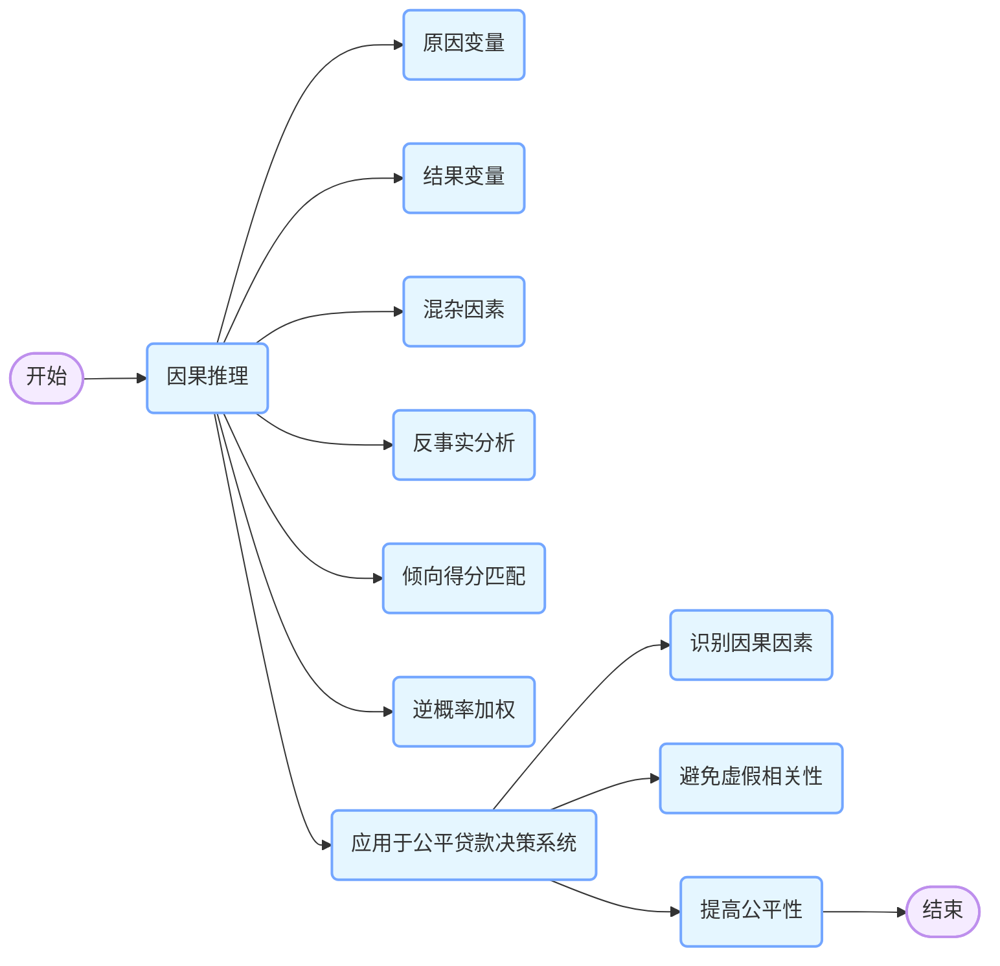

# 因果推理在公平贷款决策系统中的应用研究

> 关键词：因果推理、公平贷款决策系统、贷款审批、反事实分析、公平性评估

> 摘要：本文聚焦于因果推理在公平贷款决策系统中的应用。随着金融行业对贷款决策公平性的日益重视，传统基于相关性的决策方法已难以满足需求。因果推理通过揭示变量之间的因果关系，为构建更加公平、透明的贷款决策系统提供了新的思路和方法。文章详细介绍了因果推理的核心概念与联系、算法原理、数学模型，通过项目实战展示了其在实际贷款决策系统中的应用，并探讨了实际应用场景、推荐了相关工具和资源，最后对未来发展趋势与挑战进行了总结。

## 1. 背景介绍 
### 1.1 目的和范围
本研究的目的是深入探讨因果推理在公平贷款决策系统中的应用，旨在解决传统贷款决策系统中存在的公平性问题。传统的贷款决策系统往往基于历史数据中的相关性来评估申请人的信用风险，这可能导致对某些群体的不公平歧视，例如基于种族、性别等因素的歧视。因果推理可以帮助我们识别真正影响贷款违约风险的因果因素，从而构建更加公平的贷款决策模型。

本研究的范围涵盖了因果推理的基本概念、核心算法、数学模型，以及如何将其应用于实际的贷款决策系统中。同时，还将探讨因果推理在公平贷款决策中的实际应用场景、相关工具和资源，以及未来的发展趋势和挑战。

### 1.2 预期读者
本文的预期读者包括金融行业的从业者，如贷款审批人员、风险管理人员等，他们可以通过本文了解如何利用因果推理来提高贷款决策的公平性；计算机科学和人工智能领域的研究人员和开发者，他们可以从本文中获取关于因果推理在金融领域应用的技术细节和实践经验；以及对金融公平性和人工智能应用感兴趣的普通读者，他们可以通过本文了解因果推理在解决社会公平问题中的作用。

### 1.3 文档结构概述
本文将按照以下结构进行组织：
- 核心概念与联系：介绍因果推理和公平贷款决策系统的核心概念，以及它们之间的联系，并通过文本示意图和 Mermaid 流程图进行可视化展示。
- 核心算法原理 & 具体操作步骤：详细讲解因果推理的核心算法原理，并使用 Python 源代码进行具体实现和步骤说明。
- 数学模型和公式 & 详细讲解 & 举例说明：介绍因果推理中的数学模型和公式，并通过具体例子进行详细讲解。
- 项目实战：代码实际案例和详细解释说明：通过一个实际的贷款决策系统项目，展示因果推理的具体应用，包括开发环境搭建、源代码实现和代码解读。
- 实际应用场景：探讨因果推理在公平贷款决策中的实际应用场景。
- 工具和资源推荐：推荐与因果推理和公平贷款决策相关的学习资源、开发工具框架和论文著作。
- 总结：未来发展趋势与挑战：对因果推理在公平贷款决策系统中的应用进行总结，并探讨未来的发展趋势和挑战。
- 附录：常见问题与解答：解答读者在阅读本文过程中可能遇到的常见问题。
- 扩展阅读 & 参考资料：提供与本文主题相关的扩展阅读材料和参考资料。

### 1.4 术语表
#### 1.4.1 核心术语定义
- **因果推理**：是一种从数据中识别变量之间因果关系的方法，它不仅仅关注变量之间的相关性，更注重确定一个变量的变化是否会导致另一个变量的变化。
- **公平贷款决策系统**：是指在贷款审批过程中，能够公平地对待所有申请人，不基于种族、性别、年龄等敏感因素进行歧视的决策系统。
- **反事实分析**：是因果推理中的一种重要方法，它通过假设某个变量的值发生改变，来预测其他变量的变化情况，从而评估该变量的因果效应。
- **信用风险评估**：是指对借款人按时偿还贷款本息的可能性进行评估的过程，是贷款决策的重要依据。

#### 1.4.2 相关概念解释
- **相关性与因果性**：相关性是指两个变量之间的统计关联，而因果性是指一个变量的变化直接导致另一个变量的变化。例如，冰淇淋销量和游泳池溺水人数之间存在相关性，但并不是因果关系，真正的因果关系可能是天气炎热导致了冰淇淋销量和游泳池溺水人数的增加。
- **混杂因素**：是指同时影响原因变量和结果变量的因素，它会干扰我们对因果关系的判断。例如，在研究吸烟与肺癌的关系时，年龄可能是一个混杂因素，因为年龄既影响吸烟的概率，也影响患肺癌的概率。
- **倾向得分匹配**：是一种常用的因果推理方法，它通过匹配处理组和对照组中具有相似特征的个体，来减少混杂因素的影响，从而更准确地估计因果效应。

#### 1.4.3 缩略词列表
- **ATE**：Average Treatment Effect，平均处理效应，是指处理组和对照组之间结果变量的平均差异，用于衡量处理因素的因果效应。
- **IPW**：Inverse Probability Weighting，逆概率加权，是一种因果推理方法，通过对样本进行加权，使得处理组和对照组的分布更加相似，从而估计因果效应。
- **RCT**：Randomized Controlled Trial，随机对照试验，是一种用于确定因果关系的黄金标准方法，通过随机分配处理组和对照组，来消除混杂因素的影响。

## 2. 核心概念与联系 
### 因果推理的核心概念
因果推理旨在从数据中识别变量之间的因果关系，而不仅仅是相关性。在因果推理中，我们通常关注以下几个核心概念：
- **原因变量（Treatment）**：是指我们认为可能会对结果变量产生影响的变量。例如，在贷款决策中，申请人的收入水平可能是一个原因变量，因为它可能会影响申请人的还款能力。
- **结果变量（Outcome）**：是指我们想要解释或预测的变量。在贷款决策中，贷款是否违约是一个结果变量。
- **混杂因素（Confounder）**：如前所述，是指同时影响原因变量和结果变量的因素。例如，申请人的教育程度可能是一个混杂因素，因为它既影响申请人的收入水平，也影响申请人的还款能力。

### 公平贷款决策系统的核心概念
公平贷款决策系统的核心目标是确保贷款审批过程的公平性，避免基于敏感因素（如种族、性别、年龄等）对申请人进行歧视。为了实现这一目标，公平贷款决策系统需要考虑以下几个方面：
- **公平性指标**：如统计均等性、机会均等性等，用于衡量贷款决策系统的公平性。
- **特征选择**：选择与贷款违约风险真正相关的特征，避免使用敏感特征或与敏感特征高度相关的特征。
- **模型评估**：使用公平性评估指标来评估贷款决策模型的公平性，确保模型在不同群体之间的表现一致。

### 因果推理与公平贷款决策系统的联系
因果推理可以为公平贷款决策系统提供重要的支持。通过因果推理，我们可以识别真正影响贷款违约风险的因果因素，避免将与敏感因素相关的虚假相关性纳入贷款决策模型中。例如，如果我们发现申请人的居住地区与贷款违约风险之间存在相关性，但进一步的因果分析表明，这种相关性是由于居住地区与收入水平等真正的因果因素相关导致的，那么我们可以在贷款决策模型中直接考虑收入水平等因果因素，而避免使用居住地区这一可能存在歧视的特征。

### 文本示意图
```plaintext
因果推理
    |
    |-- 原因变量
    |-- 结果变量
    |-- 混杂因素
    |
    |-- 反事实分析
    |-- 倾向得分匹配
    |-- 逆概率加权
    |
    |-- 应用于公平贷款决策系统
            |
            |-- 识别因果因素
            |-- 避免虚假相关性
            |-- 提高公平性
```

### Mermaid 流程图


## 3. 核心算法原理 & 具体操作步骤 
### 倾向得分匹配（Propensity Score Matching）
#### 算法原理
倾向得分匹配是一种常用的因果推理方法，其基本思想是通过匹配处理组和对照组中具有相似倾向得分的个体，来减少混杂因素的影响，从而更准确地估计因果效应。倾向得分是指个体接受处理的概率，通常通过逻辑回归等方法进行估计。

#### 具体操作步骤
1. **估计倾向得分**：使用逻辑回归等方法，根据混杂因素来估计每个个体接受处理的概率。
2. **匹配个体**：根据倾向得分，为处理组中的每个个体找到一个或多个对照组中倾向得分相近的个体进行匹配。
3. **估计因果效应**：比较匹配后的处理组和对照组的结果变量，计算平均处理效应（ATE）。

#### Python 源代码实现
```python
import pandas as pd
from sklearn.linear_model import LogisticRegression
from sklearn.neighbors import NearestNeighbors

# 生成示例数据
data = {
    'treatment': [1, 0, 1, 0, 1, 0],
    'confounder1': [2, 3, 4, 1, 5, 2],
    'confounder2': [10, 12, 15, 8, 18, 11],
    'outcome': [20, 15, 25, 12, 30, 16]
}
df = pd.DataFrame(data)

# 分离处理组和对照组
treatment_group = df[df['treatment'] == 1]
control_group = df[df['treatment'] == 0]

# 估计倾向得分
X = df[['confounder1', 'confounder2']]
y = df['treatment']
model = LogisticRegression()
model.fit(X, y)
df['propensity_score'] = model.predict_proba(X)[:, 1]

# 匹配个体
treatment_scores = treatment_group['propensity_score'].values.reshape(-1, 1)
control_scores = control_group['propensity_score'].values.reshape(-1, 1)
nn = NearestNeighbors(n_neighbors=1)
nn.fit(control_scores)
distances, indices = nn.kneighbors(treatment_scores)

# 计算平均处理效应
matched_control_outcomes = control_group.iloc[indices.flatten()]['outcome'].values
treatment_outcomes = treatment_group['outcome'].values
ate = (treatment_outcomes - matched_control_outcomes).mean()

print(f"平均处理效应 (ATE): {ate}")
```

### 逆概率加权（Inverse Probability Weighting）
#### 算法原理
逆概率加权是另一种常用的因果推理方法，其基本思想是通过对样本进行加权，使得处理组和对照组的分布更加相似，从而估计因果效应。具体来说，对于处理组中的个体，其权重为接受处理的概率的倒数；对于对照组中的个体，其权重为不接受处理的概率的倒数。

#### 具体操作步骤
1. **估计倾向得分**：使用逻辑回归等方法，根据混杂因素来估计每个个体接受处理的概率。
2. **计算权重**：对于处理组中的个体，计算其接受处理的概率的倒数作为权重；对于对照组中的个体，计算其不接受处理的概率的倒数作为权重。
3. **加权回归**：使用加权最小二乘法等方法，对结果变量进行回归分析，估计因果效应。

#### Python 源代码实现
```python
import pandas as pd
from sklearn.linear_model import LogisticRegression
import statsmodels.api as sm

# 生成示例数据
data = {
    'treatment': [1, 0, 1, 0, 1, 0],
    'confounder1': [2, 3, 4, 1, 5, 2],
    'confounder2': [10, 12, 15, 8, 18, 11],
    'outcome': [20, 15, 25, 12, 30, 16]
}
df = pd.DataFrame(data)

# 估计倾向得分
X = df[['confounder1', 'confounder2']]
y = df['treatment']
model = LogisticRegression()
model.fit(X, y)
df['propensity_score'] = model.predict_proba(X)[:, 1]

# 计算权重
df['weight'] = df['treatment'] / df['propensity_score'] + (1 - df['treatment']) / (1 - df['propensity_score'])

# 加权回归
X = sm.add_constant(df[['treatment', 'confounder1', 'confounder2']])
y = df['outcome']
weights = df['weight']
wls_model = sm.WLS(y, X, weights=weights)
results = wls_model.fit()

# 提取因果效应
ate = results.params['treatment']

print(f"平均处理效应 (ATE): {ate}")
```

## 4. 数学模型和公式 & 详细讲解 & 举例说明 
### 平均处理效应（ATE）
#### 数学公式
平均处理效应（ATE）是因果推理中常用的一个指标，用于衡量处理因素的因果效应。其数学公式为：
$$ATE = E[Y(1) - Y(0)]$$
其中，$Y(1)$ 表示个体接受处理时的结果变量，$Y(0)$ 表示个体不接受处理时的结果变量，$E$ 表示期望。

#### 详细讲解
由于我们无法同时观察到同一个体接受处理和不接受处理时的结果变量，因此需要通过一些方法来估计 ATE。倾向得分匹配和逆概率加权等方法都是为了实现这一目标。

#### 举例说明
假设我们要研究某种药物对患者康复时间的影响。我们将患者随机分为处理组（服用药物）和对照组（不服用药物）。经过一段时间的观察，我们得到了处理组和对照组患者的康复时间。通过倾向得分匹配或逆概率加权等方法，我们可以估计出该药物的平均处理效应，即服用药物的患者比不服用药物的患者平均提前康复的时间。

### 倾向得分（Propensity Score）
#### 数学公式
倾向得分是指个体接受处理的概率，通常通过逻辑回归等方法进行估计。其数学公式为：
$$e(X) = P(T = 1 | X)$$
其中，$T$ 表示处理变量，$X$ 表示混杂因素，$e(X)$ 表示个体在混杂因素 $X$ 下接受处理的概率。

#### 详细讲解
倾向得分的作用是将高维的混杂因素降维为一维的得分，从而方便进行匹配和加权。通过估计倾向得分，我们可以找到处理组和对照组中具有相似特征的个体，减少混杂因素的影响。

#### 举例说明
假设我们要研究教育程度对收入的影响，同时考虑年龄、性别等混杂因素。我们可以使用逻辑回归模型，以教育程度为处理变量，年龄、性别等为混杂因素，估计每个个体接受高教育程度的概率，即倾向得分。然后，根据倾向得分进行匹配，比较匹配后的处理组和对照组的收入差异，从而估计教育程度对收入的因果效应。

### 逆概率加权（IPW）
#### 数学公式
逆概率加权的基本思想是通过对样本进行加权，使得处理组和对照组的分布更加相似。其数学公式为：
$$\hat{\tau}_{IPW} = \frac{\sum_{i=1}^{n} T_i Y_i / e(X_i)}{\sum_{i=1}^{n} T_i / e(X_i)} - \frac{\sum_{i=1}^{n} (1 - T_i) Y_i / (1 - e(X_i))}{\sum_{i=1}^{n} (1 - T_i) / (1 - e(X_i))}$$
其中，$\hat{\tau}_{IPW}$ 表示逆概率加权估计的平均处理效应，$T_i$ 表示第 $i$ 个个体的处理变量，$Y_i$ 表示第 $i$ 个个体的结果变量，$e(X_i)$ 表示第 $i$ 个个体的倾向得分。

#### 详细讲解
逆概率加权的核心是根据个体接受处理的概率来调整样本的权重。对于处理组中的个体，接受处理的概率越小，其权重越大；对于对照组中的个体，不接受处理的概率越小，其权重越大。通过这种方式，我们可以使得处理组和对照组的分布更加相似，从而更准确地估计因果效应。

#### 举例说明
假设我们要研究某种培训对员工绩效的影响，同时考虑员工的工作经验、学历等混杂因素。我们可以使用逻辑回归模型估计每个员工参加培训的倾向得分。然后，根据逆概率加权的公式，对样本进行加权，计算参加培训和不参加培训的员工的平均绩效差异，从而估计培训对员工绩效的因果效应。

## 5. 项目实战：代码实际案例和详细解释说明 
### 5.1  开发环境搭建
#### 安装 Python
首先，确保你已经安装了 Python 3.x 版本。你可以从 Python 官方网站（https://www.python.org/downloads/）下载并安装适合你操作系统的 Python 版本。

#### 安装必要的库
我们需要安装一些必要的 Python 库，包括 `pandas`、`numpy`、`scikit-learn`、`statsmodels` 等。可以使用以下命令进行安装：
```sh
pip install pandas numpy scikit-learn statsmodels
```

### 5.2  源代码详细实现和代码解读
#### 数据准备
假设我们有一个包含贷款申请人信息的数据集，包括申请人的年龄、收入、信用评分、是否违约等信息。我们的目标是使用因果推理方法来评估某个特征（如收入）对贷款违约风险的因果效应。

```python
import pandas as pd
import numpy as np
from sklearn.linear_model import LogisticRegression
import statsmodels.api as sm

# 生成示例数据
np.random.seed(0)
n_samples = 1000
age = np.random.randint(20, 60, n_samples)
income = np.random.normal(50000, 10000, n_samples)
credit_score = np.random.randint(300, 850, n_samples)
treatment = np.random.binomial(1, 0.5, n_samples)  # 处理变量，如是否参加某种培训
outcome = (income > 60000) * treatment + np.random.binomial(1, 0.1, n_samples)  # 结果变量，如是否违约

data = {
    'age': age,
    'income': income,
    'credit_score': credit_score,
    'treatment': treatment,
    'outcome': outcome
}
df = pd.DataFrame(data)
```

#### 倾向得分估计
使用逻辑回归模型估计每个申请人接受处理的倾向得分。

```python
# 分离特征和处理变量
X = df[['age', 'income', 'credit_score']]
y = df['treatment']

# 训练逻辑回归模型
model = LogisticRegression()
model.fit(X, y)

# 估计倾向得分
df['propensity_score'] = model.predict_proba(X)[:, 1]
```

#### 逆概率加权
根据倾向得分计算样本的权重，并使用加权最小二乘法估计因果效应。

```python
# 计算权重
df['weight'] = df['treatment'] / df['propensity_score'] + (1 - df['treatment']) / (1 - df['propensity_score'])

# 加权回归
X = sm.add_constant(df[['treatment', 'age', 'income', 'credit_score']])
y = df['outcome']
weights = df['weight']
wls_model = sm.WLS(y, X, weights=weights)
results = wls_model.fit()

# 提取因果效应
ate = results.params['treatment']
print(f"平均处理效应 (ATE): {ate}")
```

### 5.3  代码解读与分析
#### 数据准备部分
- 我们使用 `numpy` 生成了一些随机数据，包括申请人的年龄、收入、信用评分、处理变量和结果变量。
- 将这些数据存储在一个 `pandas` 数据框中，方便后续处理。

#### 倾向得分估计部分
- 从数据框中分离出特征变量和处理变量。
- 使用 `LogisticRegression` 模型训练一个逻辑回归模型，估计每个申请人接受处理的倾向得分。

#### 逆概率加权部分
- 根据倾向得分计算每个样本的权重，处理组样本的权重为接受处理的概率的倒数，对照组样本的权重为不接受处理的概率的倒数。
- 使用 `statsmodels` 库的 `WLS` 函数进行加权最小二乘回归，估计因果效应。
- 最后，从回归结果中提取处理变量的系数，即平均处理效应（ATE）。

通过这个项目实战，我们展示了如何使用因果推理方法来评估某个特征对贷款违约风险的因果效应，从而为公平贷款决策提供依据。

## 6. 实际应用场景 
### 贷款审批过程中的公平性评估
在传统的贷款审批过程中，银行往往会使用一些历史数据来建立信用风险评估模型。然而，这些模型可能会存在公平性问题，例如对某些群体的歧视。通过因果推理，我们可以识别出真正影响贷款违约风险的因果因素，避免将与敏感因素相关的虚假相关性纳入模型中。例如，我们可以使用因果推理方法来评估申请人的收入、工作稳定性等因素对贷款违约风险的因果效应，而不是仅仅依赖于一些可能存在歧视的特征，如种族、性别等。

### 个性化贷款方案设计
因果推理可以帮助银行根据申请人的具体情况设计个性化的贷款方案。通过分析不同因素对贷款违约风险的因果效应，银行可以了解每个申请人的风险特征，从而为他们提供更合适的贷款额度、利率和还款期限等。例如，如果某个申请人的收入水平较高，但工作稳定性较差，银行可以根据因果推理的结果，为他提供一个相对较低的贷款额度和较高的利率，以平衡风险和收益。

### 贷款政策评估
银行可以使用因果推理方法来评估不同贷款政策的效果。例如，银行可以通过比较不同贷款政策下的贷款违约率、客户满意度等指标，来评估这些政策的因果效应。如果发现某个贷款政策对某些群体的影响较大，银行可以及时调整政策，以提高贷款决策的公平性和有效性。

### 反欺诈检测
因果推理可以帮助银行识别贷款申请中的欺诈行为。通过分析申请人的行为数据和其他相关信息，银行可以建立因果模型，识别出欺诈行为的因果因素。例如，如果发现某个申请人的申请行为与其他正常申请人存在明显的差异，并且这些差异与欺诈行为之间存在因果关系，银行可以及时采取措施，防止欺诈行为的发生。

## 7. 工具和资源推荐
### 7.1 学习资源推荐
#### 7.1.1 书籍推荐
- 《因果推理导论》（*Causal Inference in Statistics: A Primer*）：这本书由 Judea Pearl、Madelyn Glymour 和 Nicholas P. Jewell 合著，是一本系统介绍因果推理基本概念和方法的入门书籍，适合初学者阅读。
- 《为什么：关于因果关系的新科学》（*The Book of Why: The New Science of Cause and Effect*）：作者是 Judea Pearl 和 Dana Mackenzie，这本书以通俗易懂的语言介绍了因果推理的发展历程和重要思想，对于理解因果推理的本质和应用具有很大的帮助。
- 《应用回归分析与因果推断》（*Applied Regression Analysis and Other Multivariable Methods*）：这本书由 David G. Kleinbaum、Lawrence L. Kupper 和 Keith E. Muller 合著，详细介绍了回归分析和因果推断的方法和应用，适合有一定统计学基础的读者阅读。

#### 7.1.2 在线课程
- Coursera 上的 “因果推理”（*Causal Inference*）课程：该课程由哈佛大学的 Miguel Hernán 教授和 Jamie Robins 教授讲授，系统介绍了因果推理的基本概念、方法和应用，课程内容丰富，讲解详细。
- edX 上的 “因果分析”（*Causal Analysis*）课程：由加州大学伯克利分校的 Ani Adhikari 教授讲授，通过实际案例介绍了因果分析的方法和工具，适合有一定编程基础的读者学习。

#### 7.1.3 技术博客和网站
- 因果推断社区（https://www.causalinference.org/）：这是一个专注于因果推断研究和应用的社区，提供了丰富的学术资源、研究成果和讨论论坛。
- 因果科学与机器学习社区（https://www.causalscience.cn/）：该社区致力于推动因果科学和机器学习的交叉研究，提供了相关的学术论文、技术博客和开源代码。

### 7.2 开发工具框架推荐
#### 7.2.1 IDE和编辑器
- PyCharm：是一款专业的 Python 集成开发环境，具有代码编辑、调试、版本控制等功能，适合开发大型 Python 项目。
- Jupyter Notebook：是一个交互式的开发环境，支持 Python、R 等多种编程语言，适合进行数据分析和模型开发。

#### 7.2.2 调试和性能分析工具
- pdb：是 Python 自带的调试工具，可以帮助我们在代码中设置断点、单步执行代码等，方便调试程序。
- cProfile：是 Python 自带的性能分析工具，可以帮助我们分析代码的运行时间和函数调用次数，找出代码中的性能瓶颈。

#### 7.2.3 相关框架和库
- CausalML：是一个开源的 Python 库，提供了多种因果推理方法和工具，包括倾向得分匹配、逆概率加权、双重差分等。
- EconML：是微软开源的一个 Python 库，专注于经济因果分析和机器学习的结合，提供了多种因果推理模型和算法。

### 7.3 相关论文著作推荐
#### 7.3.1 经典论文
- Pearl, J. (2009). *Causality: Models, Reasoning, and Inference*. Cambridge University Press. 这本书是因果推理领域的经典著作，系统介绍了因果推理的理论和方法。
- Rubin, D. B. (1974). Estimating causal effects of treatments in randomized and nonrandomized studies. *Journal of Educational Psychology*, 66(5), 688-701. 这篇论文提出了著名的 Rubin 因果模型，为因果推理的发展奠定了基础。

#### 7.3.2 最新研究成果
- Athey, S., & Imbens, G. W. (2016). Recursive partitioning for heterogeneous causal effects. *Proceedings of the National Academy of Sciences*, 113(27), 7353-7360. 这篇论文提出了一种基于递归划分的方法，用于估计异质因果效应。
- Wager, S., & Athey, S. (2018). Estimation and inference of heterogeneous treatment effects using random forests. *Journal of the American Statistical Association*, 113(523), 1228-1242. 这篇论文介绍了如何使用随机森林方法来估计和推断异质因果效应。

#### 7.3.3 应用案例分析
- Khandker, S. R., Koolwal, G. B., & Samad, H. A. (2010). *Impact evaluation in practice*. The World Bank. 这本书介绍了因果推理在发展经济学中的应用，通过实际案例展示了如何使用因果推理方法来评估政策和项目的效果。
- Angrist, J. D., & Pischke, J. -S. (2009). *Mostly harmless econometrics: An empiricist's companion*. Princeton University Press. 这本书介绍了因果推理在计量经济学中的应用，通过实际案例展示了如何使用因果推理方法来解决经济学中的实际问题。

## 8. 总结：未来发展趋势与挑战
### 未来发展趋势
#### 与机器学习的深度融合
因果推理与机器学习的结合将是未来的一个重要发展趋势。传统的机器学习方法主要关注数据中的相关性，而因果推理可以帮助我们识别变量之间的因果关系。通过将因果推理与机器学习相结合，我们可以构建更加智能、可解释的模型，提高模型的预测能力和决策的可靠性。例如，我们可以使用因果推理方法来选择特征、调整模型参数，从而提高模型的性能。

#### 多源数据的综合利用
随着信息技术的发展，我们可以获取到越来越多的多源数据，如文本数据、图像数据、传感器数据等。未来，因果推理将更加注重多源数据的综合利用，通过融合不同类型的数据，我们可以更全面地了解变量之间的因果关系。例如，在贷款决策中，我们可以结合申请人的信用记录、社交媒体数据、消费行为数据等多源数据，更准确地评估申请人的信用风险。

#### 应用领域的不断拓展
因果推理的应用领域将不断拓展，除了金融领域，还将在医疗、教育、交通、环境等领域得到广泛应用。例如，在医疗领域，因果推理可以帮助我们评估药物的疗效、分析疾病的病因；在教育领域，因果推理可以帮助我们评估教育政策的效果、分析学生的学习行为。

### 挑战
#### 数据质量和可获得性
因果推理需要大量高质量的数据来支持，然而，在实际应用中，数据质量和可获得性往往是一个挑战。例如，数据可能存在缺失值、噪声、偏差等问题，这些问题会影响因果推理的准确性。此外，某些数据可能受到隐私保护、商业机密等因素的限制，难以获取。

#### 因果关系的识别和验证
因果关系的识别和验证是因果推理中的一个核心问题，也是一个具有挑战性的问题。在实际应用中，我们往往难以确定变量之间的因果关系是真实存在的还是虚假的。此外，由于因果关系可能受到多种因素的影响，我们需要考虑到各种混杂因素和中介因素，这增加了因果关系识别和验证的难度。

#### 模型的可解释性和复杂性
因果推理模型的可解释性和复杂性是一个需要平衡的问题。一方面，我们希望模型具有良好的可解释性，能够清晰地解释变量之间的因果关系；另一方面，为了提高模型的准确性和预测能力，我们可能需要使用一些复杂的模型和算法。如何在可解释性和复杂性之间找到一个平衡点，是未来需要解决的一个重要问题。

## 9. 附录：常见问题与解答
### 因果推理和相关性分析有什么区别？
相关性分析主要关注变量之间的统计关联，即一个变量的变化是否与另一个变量的变化相关。而因果推理则更深入地探讨变量之间的因果关系，即一个变量的变化是否会导致另一个变量的变化。例如，冰淇淋销量和游泳池溺水人数之间存在相关性，但并不是因果关系，真正的因果关系可能是天气炎热导致了冰淇淋销量和游泳池溺水人数的增加。

### 因果推理在公平贷款决策中的优势是什么？
因果推理可以帮助我们识别真正影响贷款违约风险的因果因素，避免将与敏感因素相关的虚假相关性纳入贷款决策模型中。通过使用因果推理方法，我们可以构建更加公平、透明的贷款决策系统，减少对某些群体的歧视，提高贷款决策的公平性和可靠性。

### 倾向得分匹配和逆概率加权有什么区别？
倾向得分匹配是通过匹配处理组和对照组中具有相似倾向得分的个体，来减少混杂因素的影响，从而估计因果效应。而逆概率加权是通过对样本进行加权，使得处理组和对照组的分布更加相似，从而估计因果效应。倾向得分匹配更侧重于个体的匹配，而逆概率加权更侧重于样本的加权。

### 因果推理模型的可解释性重要吗？
因果推理模型的可解释性非常重要。在贷款决策等实际应用中，我们不仅需要模型具有良好的预测能力，还需要能够清晰地解释模型的决策过程和依据。可解释的因果推理模型可以帮助我们理解变量之间的因果关系，发现潜在的问题和风险，提高决策的透明度和可信度。

## 10. 扩展阅读 & 参考资料
### 扩展阅读
- Pearl, J., & Mackenzie, D. (2018). *The Book of Why: The New Science of Cause and Effect*. Basic Books.
- Hernán, M. A., & Robins, J. M. (2020). *Causal Inference: What If*. Chapman and Hall/CRC.
- Angrist, J. D., & Pischke, J. -S. (2014). *Mastering 'Metrics: The Path from Cause to Effect*. Princeton University Press.

### 参考资料
- Pearl, J. (2009). *Causality: Models, Reasoning, and Inference*. Cambridge University Press.
- Rubin, D. B. (1974). Estimating causal effects of treatments in randomized and nonrandomized studies. *Journal of Educational Psychology*, 66(5), 688-701.
- Athey, S., & Imbens, G. W. (2016). Recursive partitioning for heterogeneous causal effects. *Proceedings of the National Academy of Sciences*, 113(27), 7353-7360.
- Wager, S., & Athey, S. (2018). Estimation and inference of heterogeneous treatment effects using random forests. *Journal of the American Statistical Association*, 113(523), 1228-1242.

作者：AI天才研究院/AI Genius Institute & 禅与计算机程序设计艺术 /Zen And The Art of Computer Programming