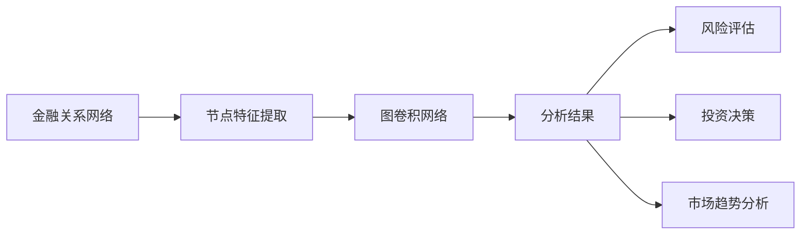

# 图卷积网络在金融关系网络分析中的应用

> 关键词：图卷积网络、金融关系网络、网络分析、深度学习、风险评估、投资决策、数据挖掘

> 摘要：本文深入探讨了图卷积网络（GCN）在金融关系网络分析中的应用。首先介绍了研究的背景、目的和范围，以及相关的核心概念和术语。接着详细阐述了图卷积网络的核心算法原理，通过Python代码进行说明，并给出了相应的数学模型和公式。在项目实战部分，展示了如何搭建开发环境，实现源代码并进行解读分析。还探讨了图卷积网络在金融领域的实际应用场景，推荐了相关的学习资源、开发工具框架和论文著作。最后总结了图卷积网络在金融关系网络分析中的未来发展趋势与挑战，并对常见问题进行了解答。

## 1. 背景介绍 
### 1.1 目的和范围
金融领域中存在着复杂的关系网络，如银行间的借贷关系、企业间的股权关系、投资者与金融产品之间的关系等。对这些金融关系网络进行深入分析，有助于理解金融市场的运行机制、识别潜在的风险以及做出更明智的投资决策。图卷积网络作为一种强大的深度学习工具，能够有效地处理图结构数据，为金融关系网络分析提供了新的方法和思路。

本文的范围主要涵盖图卷积网络的基本原理、在金融关系网络分析中的应用场景、相关的算法实现以及实际案例分析等方面。旨在为读者提供一个全面的了解图卷积网络在金融领域应用的视角。

### 1.2 预期读者
本文预期读者包括金融领域的从业者，如金融分析师、风险评估师、投资经理等，他们希望借助图卷积网络技术来提升对金融关系网络的分析能力；也包括计算机科学领域的研究人员和开发者，对图神经网络的应用和金融数据挖掘感兴趣；同时，对于对金融科技有兴趣的学生和爱好者，也可以通过本文初步了解图卷积网络在金融领域的应用。

### 1.3 文档结构概述
本文将按照以下结构进行阐述：首先介绍相关的背景知识和核心概念，包括图卷积网络和金融关系网络的基本原理和联系；接着详细讲解图卷积网络的核心算法原理和具体操作步骤，通过Python代码进行说明；然后给出图卷积网络的数学模型和公式，并举例说明；在项目实战部分，展示如何搭建开发环境，实现源代码并进行解读分析；之后探讨图卷积网络在金融领域的实际应用场景；再推荐相关的学习资源、开发工具框架和论文著作；最后总结图卷积网络在金融关系网络分析中的未来发展趋势与挑战，并对常见问题进行解答。

### 1.4 术语表
#### 1.4.1 核心术语定义
- **图卷积网络（Graph Convolutional Network, GCN）**：是一种专门用于处理图结构数据的深度学习模型，通过在图的节点和边上进行卷积操作，学习节点的特征表示。
- **金融关系网络**：由金融实体（如银行、企业、投资者等）作为节点，它们之间的关系（如借贷、股权、投资等）作为边所构成的图结构。
- **节点特征**：描述图中节点属性的特征向量，例如企业的财务指标、投资者的风险偏好等。
- **邻接矩阵**：用于表示图中节点之间连接关系的矩阵，矩阵中的元素表示节点之间是否存在边以及边的权重。

#### 1.4.2 相关概念解释
- **图结构数据**：与传统的欧几里得空间数据（如图片、文本等）不同，图结构数据中的节点和边的连接关系是不规则的，节点的邻居数量和顺序也不固定。
- **卷积操作**：在传统的卷积神经网络中，卷积操作是在规则的网格结构（如图像的像素网格）上进行的。而在图卷积网络中，卷积操作是在图的节点和边上进行的，通过聚合节点的邻居信息来更新节点的特征表示。
- **深度学习**：是一类基于人工神经网络的机器学习方法，通过多层的神经网络结构自动学习数据中的复杂模式和特征。

#### 1.4.3 缩略词列表
- **GCN**：Graph Convolutional Network（图卷积网络）
- **MLP**：Multi - Layer Perceptron（多层感知机）
- **ReLU**：Rectified Linear Unit（修正线性单元）

## 2. 核心概念与联系 

### 2.1 图卷积网络的核心概念
图卷积网络是一种基于图结构数据的深度学习模型，其核心思想是通过聚合节点的邻居信息来更新节点的特征表示。在图中，每个节点都有自己的特征向量，通过图卷积操作，可以将节点的邻居节点的特征信息传递到该节点，从而使节点的特征表示更加丰富和全面。

图卷积网络的基本架构通常包括输入层、隐藏层和输出层。输入层接收节点的原始特征向量，隐藏层通过多次图卷积操作对节点的特征进行更新和转换，输出层则根据任务的需求输出相应的结果，如节点分类、边预测等。

### 2.2 金融关系网络的核心概念
金融关系网络是由金融实体（如银行、企业、投资者等）作为节点，它们之间的关系（如借贷、股权、投资等）作为边所构成的图结构。金融关系网络可以反映金融市场中各个实体之间的相互作用和依赖关系，通过对金融关系网络的分析，可以发现潜在的风险、识别市场趋势以及做出更明智的投资决策。

金融关系网络中的节点通常具有丰富的属性信息，如企业的财务指标、投资者的风险偏好等，这些属性信息可以作为节点的特征向量输入到图卷积网络中进行分析。

### 2.3 图卷积网络与金融关系网络的联系
图卷积网络可以很好地处理金融关系网络这种图结构数据。通过图卷积网络，可以将金融关系网络中的节点和边的信息进行有效的整合和利用，从而挖掘出金融关系网络中隐藏的模式和规律。

例如，在风险评估中，可以将企业作为节点，企业之间的借贷关系作为边，构建金融关系网络。然后使用图卷积网络对节点的特征进行更新和分析，预测企业的违约风险。在投资决策中，可以将投资者和金融产品作为节点，投资关系作为边，通过图卷积网络分析投资者的偏好和金融产品的特征，为投资者提供个性化的投资建议。

### 2.4 文本示意图
图卷积网络在金融关系网络分析中的应用可以用以下示意图表示：

金融关系网络（节点：金融实体，边：关系） -- 节点特征提取 -- 图卷积网络（输入层、隐藏层、输出层） -- 分析结果（风险评估、投资决策等）

### 2.5 Mermaid 流程图


## 3. 核心算法原理 & 具体操作步骤 

### 3.1 图卷积网络的核心算法原理
图卷积网络的核心思想是通过聚合节点的邻居信息来更新节点的特征表示。在每一层图卷积中，节点的特征会根据其邻居节点的特征进行更新。

设 $X$ 是节点的特征矩阵，$A$ 是图的邻接矩阵，$W$ 是可学习的权重矩阵。图卷积层的输出 $H^{(l + 1)}$ 可以通过以下公式计算：

$H^{(l + 1)} = \sigma(\tilde{D}^{-\frac{1}{2}}\tilde{A}\tilde{D}^{-\frac{1}{2}}H^{(l)}W^{(l)})$

其中，$\tilde{A} = A + I$ 是添加了自环的邻接矩阵，$I$ 是单位矩阵；$\tilde{D}$ 是 $\tilde{A}$ 的度矩阵，即 $\tilde{D}_{ii}=\sum_{j}\tilde{A}_{ij}$；$\sigma$ 是激活函数，如ReLU函数。

### 3.2 具体操作步骤
1. **数据预处理**：收集金融关系网络的数据，包括节点的属性信息和节点之间的连接关系，构建邻接矩阵 $A$ 和节点特征矩阵 $X$。
2. **初始化参数**：随机初始化权重矩阵 $W^{(l)}$。
3. **图卷积操作**：按照上述公式进行图卷积操作，逐层更新节点的特征表示。
4. **损失计算**：根据具体的任务（如节点分类、边预测等），定义损失函数，计算模型的损失。
5. **参数更新**：使用优化算法（如随机梯度下降）更新权重矩阵 $W^{(l)}$，以最小化损失函数。
6. **重复步骤3 - 5**：重复进行图卷积操作、损失计算和参数更新，直到模型收敛。

### 3.3 Python源代码实现
以下是一个使用PyTorch实现简单图卷积网络的示例代码：

```python
import torch
import torch.nn as nn
import torch.nn.functional as F

class GraphConvolution(nn.Module):
    def __init__(self, in_features, out_features):
        super(GraphConvolution, self).__init__()
        self.weight = nn.Parameter(torch.FloatTensor(in_features, out_features))
        self.reset_parameters()

    def reset_parameters(self):
        nn.init.xavier_uniform_(self.weight)

    def forward(self, input, adj):
        support = torch.mm(input, self.weight)
        output = torch.spmm(adj, support)
        return output

class GCN(nn.Module):
    def __init__(self, nfeat, nhid, nclass, dropout):
        super(GCN, self).__init__()
        self.gc1 = GraphConvolution(nfeat, nhid)
        self.gc2 = GraphConvolution(nhid, nclass)
        self.dropout = dropout

    def forward(self, x, adj):
        x = F.relu(self.gc1(x, adj))
        x = F.dropout(x, self.dropout, training=self.training)
        x = self.gc2(x, adj)
        return F.log_softmax(x, dim=1)
```

### 3.4 代码解释
- `GraphConvolution` 类：定义了一个图卷积层，其中 `__init__` 方法初始化了权重矩阵，`reset_parameters` 方法对权重矩阵进行初始化，`forward` 方法实现了图卷积操作。
- `GCN` 类：定义了一个简单的图卷积网络，包含两个图卷积层和一个Dropout层，`forward` 方法实现了网络的前向传播过程。

## 4. 数学模型和公式 & 详细讲解 & 举例说明 

### 4.1 图卷积网络的数学模型
图卷积网络的数学模型基于图信号处理和神经网络的思想。在图卷积网络中，节点的特征更新可以看作是一个信息传播的过程，通过聚合节点的邻居信息来更新节点的特征表示。

设 $x_i^{(l)}$ 是第 $l$ 层中节点 $i$ 的特征向量，$N(i)$ 是节点 $i$ 的邻居节点集合。图卷积层的更新公式可以表示为：

$x_i^{(l + 1)} = \sigma\left(\sum_{j\in N(i)\cup\{i\}}\frac{1}{\sqrt{d_id_j}}W^{(l)}x_j^{(l)}\right)$

其中，$d_i$ 和 $d_j$ 分别是节点 $i$ 和节点 $j$ 的度，$W^{(l)}$ 是第 $l$ 层的可学习权重矩阵，$\sigma$ 是激活函数。

### 4.2 详细讲解
- **邻接矩阵的处理**：在实际计算中，通常使用添加自环的邻接矩阵 $\tilde{A} = A + I$ 来确保节点可以聚合自身的信息。同时，为了平衡不同节点的度的影响，使用 $\tilde{D}^{-\frac{1}{2}}\tilde{A}\tilde{D}^{-\frac{1}{2}}$ 对邻接矩阵进行归一化处理。
- **权重矩阵的作用**：权重矩阵 $W^{(l)}$ 是可学习的参数，通过训练可以学习到不同特征之间的重要性和组合方式，从而使节点的特征表示更加有效。
- **激活函数的选择**：激活函数 $\sigma$ 通常选择ReLU函数，它可以引入非线性因素，增强模型的表达能力。

### 4.3 举例说明
假设有一个简单的图，包含3个节点，节点的特征矩阵 $X$ 为：

$X = \begin{bmatrix}
1 & 2 \\
3 & 4 \\
5 & 6
\end{bmatrix}$

邻接矩阵 $A$ 为：

$A = \begin{bmatrix}
0 & 1 & 0 \\
1 & 0 & 1 \\
0 & 1 & 0
\end{bmatrix}$

添加自环后的邻接矩阵 $\tilde{A}$ 为：

$\tilde{A} = \begin{bmatrix}
1 & 1 & 0 \\
1 & 1 & 1 \\
0 & 1 & 1
\end{bmatrix}$

度矩阵 $\tilde{D}$ 为：

$\tilde{D} = \begin{bmatrix}
2 & 0 & 0 \\
0 & 3 & 0 \\
0 & 0 & 2
\end{bmatrix}$

$\tilde{D}^{-\frac{1}{2}}$ 为：

$\tilde{D}^{-\frac{1}{2}} = \begin{bmatrix}
\frac{1}{\sqrt{2}} & 0 & 0 \\
0 & \frac{1}{\sqrt{3}} & 0 \\
0 & 0 & \frac{1}{\sqrt{2}}
\end{bmatrix}$

$\tilde{D}^{-\frac{1}{2}}\tilde{A}\tilde{D}^{-\frac{1}{2}}$ 为：

$\tilde{D}^{-\frac{1}{2}}\tilde{A}\tilde{D}^{-\frac{1}{2}} = \begin{bmatrix}
\frac{1}{2} & \frac{1}{\sqrt{6}} & 0 \\
\frac{1}{\sqrt{6}} & \frac{1}{3} & \frac{1}{\sqrt{6}} \\
0 & \frac{1}{\sqrt{6}} & \frac{1}{2}
\end{bmatrix}$

假设权重矩阵 $W$ 为：

$W = \begin{bmatrix}
0.1 & 0.2 \\
0.3 & 0.4
\end{bmatrix}$

则经过一层图卷积后的输出 $H^{(1)}$ 为：

$H^{(1)} = \sigma\left(\tilde{D}^{-\frac{1}{2}}\tilde{A}\tilde{D}^{-\frac{1}{2}}XW\right)$

## 5. 项目实战：代码实际案例和详细解释说明 

### 5.1  开发环境搭建
1. **安装Python**：建议使用Python 3.7及以上版本。
2. **安装深度学习框架**：本文使用PyTorch作为深度学习框架，可以根据自己的系统和CUDA版本选择合适的安装方式，具体安装命令可以参考PyTorch官方网站。
3. **安装其他依赖库**：还需要安装 `numpy`、`scipy` 等常用的科学计算库。

### 5.2  源代码详细实现和代码解读
以下是一个完整的使用图卷积网络进行节点分类的项目实战代码：

```python
import torch
import torch.nn as nn
import torch.nn.functional as F
import numpy as np
import scipy.sparse as sp
from sklearn.preprocessing import StandardScaler

# 定义图卷积层
class GraphConvolution(nn.Module):
    def __init__(self, in_features, out_features):
        super(GraphConvolution, self).__init__()
        self.weight = nn.Parameter(torch.FloatTensor(in_features, out_features))
        self.reset_parameters()

    def reset_parameters(self):
        nn.init.xavier_uniform_(self.weight)

    def forward(self, input, adj):
        support = torch.mm(input, self.weight)
        output = torch.spmm(adj, support)
        return output

# 定义图卷积网络
class GCN(nn.Module):
    def __init__(self, nfeat, nhid, nclass, dropout):
        super(GCN, self).__init__()
        self.gc1 = GraphConvolution(nfeat, nhid)
        self.gc2 = GraphConvolution(nhid, nclass)
        self.dropout = dropout

    def forward(self, x, adj):
        x = F.relu(self.gc1(x, adj))
        x = F.dropout(x, self.dropout, training=self.training)
        x = self.gc2(x, adj)
        return F.log_softmax(x, dim=1)

# 数据预处理
def normalize_adj(adj):
    """对称归一化邻接矩阵"""
    adj = adj + sp.eye(adj.shape[0])
    rowsum = np.array(adj.sum(1))
    d_inv_sqrt = np.power(rowsum, -0.5).flatten()
    d_inv_sqrt[np.isinf(d_inv_sqrt)] = 0.
    d_mat_inv_sqrt = sp.diags(d_inv_sqrt)
    return adj.dot(d_mat_inv_sqrt).transpose().dot(d_mat_inv_sqrt).tocoo()

def sparse_mx_to_torch_sparse_tensor(sparse_mx):
    """将稀疏矩阵转换为torch稀疏张量"""
    sparse_mx = sparse_mx.tocoo().astype(np.float32)
    indices = torch.from_numpy(
        np.vstack((sparse_mx.row, sparse_mx.col)).astype(np.int64))
    values = torch.from_numpy(sparse_mx.data)
    shape = torch.Size(sparse_mx.shape)
    return torch.sparse.FloatTensor(indices, values, shape)

# 加载数据
def load_data():
    # 