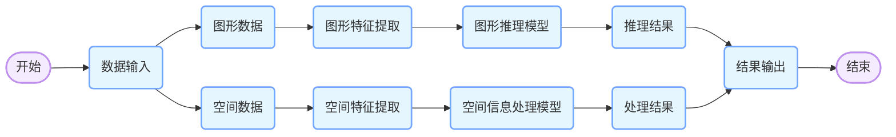

# 图形推理和空间信息处理中的模型局限性

> 关键词：图形推理、空间信息处理、模型局限性、深度学习、传统方法

> 摘要：本文聚焦于图形推理和空间信息处理中的模型局限性。首先介绍了相关背景知识，包括研究目的、预期读者、文档结构等。接着阐述了图形推理和空间信息处理的核心概念及其联系，并给出了原理和架构的示意图与流程图。深入分析了核心算法原理，结合 Python 代码进行详细说明，同时讲解了相关数学模型和公式。通过项目实战展示代码案例及解读，探讨了实际应用场景。还推荐了学习资源、开发工具框架以及相关论文著作。最后总结了未来发展趋势与挑战，解答了常见问题并提供扩展阅读和参考资料，旨在全面剖析当前模型在图形推理和空间信息处理方面存在的不足，为后续研究提供参考。

## 1. 背景介绍 
### 1.1 目的和范围
图形推理和空间信息处理在计算机视觉、人工智能、地理信息系统等众多领域有着广泛的应用。例如在计算机视觉中，图形推理可用于图像识别、目标检测等任务；在地理信息系统中，空间信息处理能帮助进行地图绘制、空间分析等工作。然而，当前用于图形推理和空间信息处理的模型存在着诸多局限性，限制了其在更复杂场景下的应用效果。本文章的目的在于深入分析这些模型的局限性，涵盖从传统的机器学习模型到现代的深度学习模型，探讨其在处理图形和空间信息时面临的问题，包括但不限于对复杂图形结构的理解不足、对空间关系的建模不准确等。

### 1.2 预期读者
本文预期读者包括计算机科学、人工智能、地理信息系统等相关领域的研究人员、开发者，以及对图形推理和空间信息处理感兴趣的学生。对于研究人员，本文可以为其研究方向提供参考，帮助发现新的研究问题；对于开发者，能够了解当前模型的不足，在实际开发中避免一些潜在的问题；对于学生，则可以作为学习资料，加深对图形推理和空间信息处理的理解。

### 1.3 文档结构概述
本文将按照以下结构进行组织：首先介绍图形推理和空间信息处理的核心概念及其联系，通过示意图和流程图直观展示其原理和架构；接着详细阐述核心算法原理，结合 Python 代码进行说明；然后讲解相关的数学模型和公式，并举例说明；通过项目实战，展示代码实际案例并进行详细解释；探讨图形推理和空间信息处理的实际应用场景；推荐相关的学习资源、开发工具框架以及论文著作；最后总结未来发展趋势与挑战，解答常见问题并提供扩展阅读和参考资料。

### 1.4 术语表
#### 1.4.1 核心术语定义
- **图形推理**：指从已知的图形中发现规律，并运用这些规律对未知图形进行预测或分类的过程。它涉及到对图形的特征提取、模式识别等操作。
- **空间信息处理**：主要处理与空间位置、空间关系相关的信息，包括对地理空间数据、三维物体空间信息等的分析、存储、传输和可视化等操作。
- **模型局限性**：指模型在处理特定任务时存在的不足，如精度不高、泛化能力差、对复杂情况处理能力有限等问题。

#### 1.4.2 相关概念解释
- **特征提取**：从原始数据中提取出能够代表数据本质特征的信息，在图形推理中，就是从图形中提取出形状、颜色、纹理等特征。
- **模式识别**：对数据中存在的模式进行识别和分类，例如在图形推理中，识别出不同类型的图形模式。
- **空间关系**：描述物体在空间中的相对位置和方向等关系，如相邻、包含、相交等。

#### 1.4.3 缩略词列表
- **CNN**：Convolutional Neural Network，卷积神经网络，是一种常用于图像和图形处理的深度学习模型。
- **RNN**：Recurrent Neural Network，循环神经网络，主要用于处理序列数据，在一些涉及时间序列或空间序列的图形推理任务中有应用。
- **GIS**：Geographic Information System，地理信息系统，用于存储、分析和展示地理空间数据。

## 2. 核心概念与联系 

### 图形推理核心概念
图形推理的核心在于从图形中提取有意义的特征，并根据这些特征发现图形之间的规律。例如，在一组由不同形状和颜色的图形组成的序列中，我们需要提取出形状、颜色等特征，然后分析这些特征在序列中的变化规律，从而预测下一个图形的特征。

### 空间信息处理核心概念
空间信息处理主要关注物体在空间中的位置、方向和相互关系。在地理信息系统中，空间信息处理涉及到对地图数据的处理，包括地图的投影转换、空间数据的查询和分析等。在计算机图形学中，空间信息处理用于处理三维物体的建模、渲染和动画等。

### 两者的联系
图形推理和空间信息处理有着密切的联系。在图形推理中，很多图形的规律与空间关系相关，例如图形的旋转、平移、缩放等变换都涉及到空间信息的处理。而在空间信息处理中，也需要运用图形推理的方法来发现空间数据中的规律，例如通过对地理空间数据的分析，发现城市发展的规律。

### 原理和架构的文本示意图
```plaintext
           图形推理和空间信息处理系统
           ┌───────────────────────────────┐
           │                               │
           │       数据输入层             │
           │   ┌─────────────┬─────────┐   │
           │   │ 图形数据    │ 空间数据 │   │
           │   └─────────────┴─────────┘   │
           │                               │
           │       特征提取层             │
           │   ┌─────────────┬─────────┐   │
           │   │ 图形特征提取│ 空间特征提取│ │
           │   └─────────────┴─────────┘   │
           │                               │
           │       模型处理层             │
           │   ┌─────────────┬─────────┐   │
           │   │ 图形推理模型│ 空间信息处理模型 │
           │   └─────────────┴─────────┘   │
           │                               │
           │       结果输出层             │
           │   ┌─────────────┬─────────┐   │
           │   │ 推理结果    │ 处理结果 │   │
           │   └─────────────┴─────────┘   │
           └───────────────────────────────┘
```

### Mermaid 流程图


## 3. 核心算法原理 & 具体操作步骤 

### 传统机器学习算法 - 支持向量机（SVM）在图形推理中的应用
支持向量机是一种常用的分类和回归算法，在图形推理中可以用于对图形进行分类。其基本原理是找到一个最优的超平面，将不同类别的图形分开。

```python
import numpy as np
from sklearn import svm
from sklearn.model_selection import train_test_split
from sklearn.metrics import accuracy_score

# 生成一些简单的图形特征数据
# 假设每个图形有两个特征，这里生成 100 个样本
X = np.random.rand(100, 2)
# 生成对应的标签，0 或 1
y = np.random.randint(0, 2, 100)

# 划分训练集和测试集
X_train, X_test, y_train, y_test = train_test_split(X, y, test_size=0.2, random_state=42)

# 创建 SVM 分类器
clf = svm.SVC(kernel='linear')

# 训练模型
clf.fit(X_train, y_train)

# 进行预测
y_pred = clf.predict(X_test)

# 计算准确率
accuracy = accuracy_score(y_test, y_pred)
print(f"Accuracy: {accuracy}")
```

### 具体操作步骤
1. **数据准备**：收集图形数据，并提取图形的特征，将其转换为适合机器学习算法处理的格式，如特征向量。
2. **数据划分**：将数据集划分为训练集和测试集，训练集用于训练模型，测试集用于评估模型的性能。
3. **模型选择和初始化**：选择合适的机器学习算法，如支持向量机，并初始化模型的参数。
4. **模型训练**：使用训练集对模型进行训练，让模型学习图形特征和标签之间的关系。
5. **模型评估**：使用测试集对训练好的模型进行评估，计算准确率、召回率等指标，评估模型的性能。

### 深度学习算法 - 卷积神经网络（CNN）在图形推理中的应用
卷积神经网络是一种专门用于处理图像和图形数据的深度学习模型，它通过卷积层、池化层和全连接层等结构，自动提取图形的特征。

```python
import tensorflow as tf
from tensorflow.keras import layers, models
from tensorflow.keras.datasets import mnist
from tensorflow.keras.utils import to_categorical

# 加载 MNIST 数据集
(train_images, train_labels), (test_images, test_labels) = mnist.load_data()

# 数据预处理
train_images = train_images.reshape((60000, 28, 28, 1)).astype('float32') / 255
test_images = test_images.reshape((10000, 28, 28, 1)).astype('float32') / 255

train_labels = to_categorical(train_labels)
test_labels = to_categorical(test_labels)

# 构建 CNN 模型
model = models.Sequential()
model.add(layers.Conv2D(32, (3, 3), activation='relu', input_shape=(28, 28, 1)))
model.add(layers.MaxPooling2D((2, 2)))
model.add(layers.Conv2D(64, (3, 3), activation='relu'))
model.add(layers.MaxPooling2D((2, 2)))
model.add(layers.Flatten())
model.add(layers.Dense(64, activation='relu'))
model.add(layers.Dense(10, activation='softmax'))

# 编译模型
model.compile(optimizer='adam',
              loss='categorical_crossentropy',
              metrics=['accuracy'])

# 训练模型
model.fit(train_images, train_labels, epochs=5, batch_size=64)

# 评估模型
test_loss, test_acc = model.evaluate(test_images, test_labels)
print(f"Test accuracy: {test_acc}")
```

### 具体操作步骤
1. **数据准备**：加载图形数据集，并进行预处理，如归一化、调整图像大小等。
2. **模型构建**：构建卷积神经网络模型，包括卷积层、池化层、全连接层等。
3. **模型编译**：选择合适的优化器、损失函数和评估指标，对模型进行编译。
4. **模型训练**：使用训练集对模型进行训练，设置训练的轮数和批次大小。
5. **模型评估**：使用测试集对训练好的模型进行评估，计算测试集上的损失和准确率。

## 4. 数学模型和公式 & 详细讲解 & 举例说明 

### 支持向量机（SVM）的数学模型和公式
支持向量机的目标是找到一个最优的超平面 $w^T x + b = 0$，使得不同类别的样本到超平面的间隔最大。对于线性可分的情况，SVM 的优化问题可以表示为：

$$
\begin{aligned}
\min_{w, b} &\quad \frac{1}{2} \| w \|^2 \\
\text{s.t.} &\quad y_i (w^T x_i + b) \geq 1, \quad i = 1, 2, \cdots, n
\end{aligned}
$$

其中，$w$ 是超平面的法向量，$b$ 是偏置项，$x_i$ 是第 $i$ 个样本，$y_i$ 是第 $i$ 个样本的标签（$y_i \in \{-1, 1\}$）。

### 详细讲解
- 目标函数 $\frac{1}{2} \| w \|^2$ 是为了使超平面的间隔最大，间隔的大小与 $\| w \|$ 成反比。
- 约束条件 $y_i (w^T x_i + b) \geq 1$ 保证了所有样本都被正确分类，并且到超平面的距离至少为 1。

### 举例说明
假设我们有两个样本 $x_1 = [1, 1]^T$，$y_1 = 1$ 和 $x_2 = [-1, -1]^T$，$y_2 = -1$，我们可以通过求解上述优化问题找到最优的超平面。

### 卷积神经网络（CNN）的数学模型和公式
在卷积神经网络中，卷积层的核心操作是卷积运算。对于输入图像 $X$ 和卷积核 $K$，卷积运算的结果 $Y$ 可以表示为：

$$
Y(i, j) = \sum_{m} \sum_{n} X(i + m, j + n) K(m, n)
$$

其中，$i$ 和 $j$ 是输出特征图的坐标，$m$ 和 $n$ 是卷积核的坐标。

### 详细讲解
- 卷积运算通过滑动卷积核在输入图像上进行局部操作，提取图像的局部特征。
- 卷积核的参数是通过训练学习得到的，不同的卷积核可以提取不同类型的特征，如边缘、纹理等。

### 举例说明
假设输入图像 $X$ 是一个 $3 \times 3$ 的矩阵：

$$
X = \begin{bmatrix}
1 & 2 & 3 \\
4 & 5 & 6 \\
7 & 8 & 9
\end{bmatrix}
$$

卷积核 $K$ 是一个 $2 \times 2$ 的矩阵：

$$
K = \begin{bmatrix}
1 & 0 \\
0 & 1
\end{bmatrix}
$$

则卷积运算的结果 $Y$ 为：

$$
Y = \begin{bmatrix}
1\times1 + 2\times0 + 4\times0 + 5\times1 & 2\times1 + 3\times0 + 5\times0 + 6\times1 \\
4\times1 + 5\times0 + 7\times0 + 8\times1 & 5\times1 + 6\times0 + 8\times0 + 9\times1
\end{bmatrix} = \begin{bmatrix}
6 & 8 \\
12 & 14
\end{bmatrix}
$$

## 5. 项目实战：代码实际案例和详细解释说明 

### 5.1  开发环境搭建
在进行图形推理和空间信息处理的项目实战时，我们需要搭建相应的开发环境。以下是具体步骤：

#### 安装 Python
Python 是一种广泛使用的编程语言，在数据处理、机器学习和深度学习等领域有着丰富的库和工具。可以从 Python 官方网站（https://www.python.org/downloads/）下载并安装适合自己操作系统的 Python 版本。

#### 安装必要的库
使用 pip 命令安装以下必要的库：
```sh
pip install numpy pandas scikit-learn tensorflow matplotlib
```
- **numpy**：用于数值计算和数组操作。
- **pandas**：用于数据处理和分析。
- **scikit-learn**：提供了各种机器学习算法和工具。
- **tensorflow**：用于深度学习模型的构建和训练。
- **matplotlib**：用于数据可视化。

### 5.2  源代码详细实现和代码解读
#### 项目背景
我们将使用一个简单的图形分类项目来展示图形推理的实际应用。假设我们有一组由圆形、三角形和正方形组成的图形数据集，我们的目标是训练一个模型来对这些图形进行分类。

#### 数据准备
```python
import numpy as np
import matplotlib.pyplot as plt
from sklearn.model_selection import train_test_split
from sklearn.preprocessing import LabelEncoder

# 生成一些简单的图形数据
# 假设每个图形用一个 10x10 的二进制矩阵表示
num_samples = 300
image_size = 10

# 生成圆形数据
circles = np.zeros((num_samples, image_size, image_size))
for i in range(num_samples):
    center_x = np.random.randint(2, image_size - 2)
    center_y = np.random.randint(2, image_size - 2)
    radius = np.random.randint(1, 4)
    for x in range(image_size):
        for y in range(image_size):
            if (x - center_x) ** 2 + (y - center_y) ** 2 <= radius ** 2:
                circles[i, x, y] = 1

# 生成三角形数据
triangles = np.zeros((num_samples, image_size, image_size))
for i in range(num_samples):
    base_x = np.random.randint(1, image_size - 3)
    base_y = np.random.randint(1, image_size - 3)
    height = np.random.randint(2, 5)
    for x in range(base_x, base_x + height):
        for y in range(base_y, base_y + height - (x - base_x)):
            triangles[i, x, y] = 1

# 生成正方形数据
squares = np.zeros((num_samples, image_size, image_size))
for i in range(num_samples):
    top_left_x = np.random.randint(1, image_size - 3)
    top_left_y = np.random.randint(1, image_size - 3)
    side_length = np.random.randint(2, 5)
    for x in range(top_left_x, top_left_x + side_length):
        for y in range(top_left_y, top_left_y + side_length):
            squares[i, x, y] = 1

# 合并数据和标签
X = np.concatenate((circles, triangles, squares), axis=0)
y = np.array(['circle'] * num_samples + ['triangle'] * num_samples + ['square'] * num_samples)

# 对标签进行编码
label_encoder = LabelEncoder()
y = label_encoder.fit_transform(y)

# 划分训练集和测试集
X_train, X_test, y_train, y_test = train_test_split(X, y, test_size=0.2, random_state=42)

# 显示一些样本
plt.figure(figsize=(10, 5))
for i in range(10):
    plt.subplot(2, 5, i + 1)
    plt.imshow(X_train[i], cmap='gray')
    plt.title(label_encoder.inverse_transform([y_train[i]])[0])
    plt.axis('off')
plt.show()
```

#### 代码解读
1. **数据生成**：我们使用循环生成了圆形、三角形和正方形的图形数据，每个图形用一个 $10 \times 10$ 的二进制矩阵表示。
2. **数据合并和标签编码**：将生成的图形数据合并成一个大的数据集，并对标签进行编码，将字符串标签转换为整数标签。
3. **数据划分**：使用 `train_test_split` 函数将数据集划分为训练集和测试集。
4. **数据可视化**：使用 `matplotlib` 库显示一些训练样本，帮助我们直观地了解数据。

#### 模型构建和训练
```python
import tensorflow as tf
from tensorflow.keras import layers, models

# 调整数据形状以适应 CNN 输入
X_train = X_train.reshape(-1, image_size, image_size, 1)
X_test = X_test.reshape(-1, image_size, image_size, 1)

# 构建 CNN 模型
model = models.Sequential()
model.add(layers.Conv2D(32, (3, 3), activation='relu', input_shape=(image_size, image_size, 1)))
model.add(layers.MaxPooling2D((2, 2)))
model.add(layers.Conv2D(64, (3, 3), activation='relu'))
model.add(layers.MaxPooling2D((2, 2)))
model.add(layers.Flatten())
model.add(layers.Dense(64, activation='relu'))
model.add(layers.Dense(3, activation='softmax'))

# 编译模型
model.compile(optimizer='adam',
              loss='sparse_categorical_crossentropy',
              metrics=['accuracy'])

# 训练模型
history = model.fit(X_train, y_train, epochs=10, batch_size=32, validation_data=(X_test, y_test))

# 绘制训练和验证损失曲线
plt.figure(figsize=(12, 4))
plt.subplot(1, 2, 1)
plt.plot(history.history['loss'], label='Training Loss')
plt.plot(history.history['val_loss'], label='Validation Loss')
plt.xlabel('Epoch')
plt.ylabel('Loss')
plt.legend()

# 绘制训练和验证准确率曲线
plt.subplot(1, 2, 2)
plt.plot(history.history['accuracy'], label='Training Accuracy')
plt.plot(history.history['val_accuracy'], label='Validation Accuracy')
plt.xlabel('Epoch')
plt.ylabel('Accuracy')
plt.legend()
plt.show()
```

#### 代码解读
1. **数据调整**：将训练集和测试集的数据形状调整为适合 CNN 输入的形状。
2. **模型构建**：构建一个简单的 CNN 模型，包括卷积层、池化层、全连接层等。
3. **模型编译**：选择 `adam` 优化器和 `sparse_categorical_crossentropy` 损失函数，对模型进行编译。
4. **模型训练**：使用训练集对模型进行训练，并在验证集上进行验证，记录训练过程中的损失和准确率。
5. **数据可视化**：使用 `matplotlib` 库绘制训练和验证损失曲线以及准确率曲线，帮助我们观察模型的训练情况。

### 5.3  代码解读与分析
#### 模型性能分析
从训练和验证损失曲线以及准确率曲线可以看出，模型在训练集上的损失逐渐下降，准确率逐渐提高，说明模型在学习数据中的特征。然而，在验证集上，损失和准确率可能会出现波动，这可能是由于模型过拟合或数据分布不均匀等原因导致的。

#### 局限性分析
- **数据生成的局限性**：我们生成的图形数据比较简单，实际的图形数据可能更加复杂，包含更多的噪声和变化，因此模型在实际应用中的性能可能会受到影响。
- **模型结构的局限性**：我们构建的 CNN 模型比较简单，对于更复杂的图形推理任务，可能需要更复杂的模型结构，如更深的卷积神经网络或引入注意力机制等。

## 6. 实际应用场景 
### 计算机视觉领域
在计算机视觉领域，图形推理和空间信息处理有着广泛的应用。例如，在图像识别任务中，通过图形推理可以识别出图像中的物体类别，如汽车、飞机、动物等。在目标检测任务中，需要处理物体的空间信息，确定物体在图像中的位置和边界框。在自动驾驶领域，图形推理和空间信息处理可以帮助车辆识别道路、交通标志和其他车辆，从而做出决策。

### 地理信息系统（GIS）领域
在地理信息系统中，空间信息处理是核心任务之一。例如，通过对地理空间数据的分析，可以进行城市规划、土地利用分析、资源管理等。图形推理可以用于发现地理空间数据中的规律，如城市发展的趋势、自然灾害的分布等。

### 医学影像领域
在医学影像领域，图形推理和空间信息处理可以帮助医生进行疾病诊断。例如，通过对 X 光、CT 等医学影像的分析，识别出病变的位置和特征，辅助医生做出诊断决策。

### 工业制造领域
在工业制造领域，图形推理和空间信息处理可以用于质量检测和机器人操作。例如，通过对产品的图像进行分析，检测产品是否存在缺陷；在机器人操作中，处理物体的空间信息，实现机器人的抓取和放置任务。

## 7. 工具和资源推荐
### 7.1 学习资源推荐
#### 7.1.1 书籍推荐
- 《深度学习》（Deep Learning）：由 Ian Goodfellow、Yoshua Bengio 和 Aaron Courville 所著，是深度学习领域的经典教材，涵盖了深度学习的基本原理、算法和应用。
- 《计算机视觉：算法与应用》（Computer Vision: Algorithms and Applications）：由 Richard Szeliski 所著，介绍了计算机视觉的各种算法和应用，包括图形推理和空间信息处理的相关内容。
- 《地理信息系统：原理、技术、应用与管理》（Geographic Information Systems: Principles, Techniques, Applications, and Management）：由 Michael F. Goodchild、John P. Wilson 等所著，全面介绍了地理信息系统的原理、技术和应用。

#### 7.1.2 在线课程
- Coursera 上的“深度学习专项课程”（Deep Learning Specialization）：由 Andrew Ng 教授授课，包括深度学习的基础知识、卷积神经网络、循环神经网络等内容。
- edX 上的“计算机视觉基础”（Foundations of Computer Vision）：介绍了计算机视觉的基本概念、算法和应用。
- Udemy 上的“地理信息系统（GIS）基础课程”（GIS Basics Course）：适合初学者学习地理信息系统的基本操作和原理。

#### 7.1.3 技术博客和网站
- Medium 上的 Towards Data Science：有很多关于机器学习、深度学习和计算机视觉的技术文章。
- arXiv.org：是一个预印本服务器，提供了大量的学术论文，包括图形推理和空间信息处理领域的最新研究成果。
- GIS Stack Exchange：是一个地理信息系统领域的问答社区，用户可以在这里提问、分享经验和获取相关资源。

### 7.2 开发工具框架推荐
#### 7.2.1 IDE和编辑器
- PyCharm：是一款专门为 Python 开发设计的集成开发环境（IDE），提供了丰富的功能，如代码编辑、调试、版本控制等。
- Jupyter Notebook：是一个交互式的开发环境，适合进行数据探索、模型训练和结果展示。
- Visual Studio Code：是一款轻量级的代码编辑器，支持多种编程语言和插件，可用于开发图形推理和空间信息处理项目。

#### 7.2.2 调试和性能分析工具
- TensorBoard：是 TensorFlow 提供的可视化工具，可以用于监控模型的训练过程、查看模型的结构和性能指标。
- Py-Spy：是一个 Python 性能分析工具，可以帮助我们找出代码中的性能瓶颈。
- NVIDIA Nsight Systems：是一款用于 GPU 性能分析的工具，对于使用 GPU 进行深度学习训练的项目非常有用。

#### 7.2.3 相关框架和库
- TensorFlow：是一个开源的深度学习框架，提供了丰富的工具和库，可用于构建和训练各种深度学习模型。
- PyTorch：是另一个流行的深度学习框架，具有动态图的特点，易于使用和调试。
- GeoPandas：是一个用于地理空间数据处理的 Python 库，提供了类似于 Pandas 的数据结构和操作方法。

### 7.3 相关论文著作推荐
#### 7.3.1 经典论文
- LeCun, Y., Bottou, L., Bengio, Y., & Haffner, P. (1998). Gradient-based learning applied to document recognition. Proceedings of the IEEE, 86(11), 2278-2324. 该论文介绍了卷积神经网络在文档识别中的应用，是卷积神经网络的经典之作。
- Lowe, D. G. (2004). Distinctive image features from scale-invariant keypoints. International journal of computer vision, 60(2), 91-110. 提出了尺度不变特征变换（SIFT）算法，用于图像特征提取。

#### 7.3.2 最新研究成果
- 在 arXiv.org 上可以搜索到图形推理和空间信息处理领域的最新研究成果，例如关于基于深度学习的图形推理模型、空间信息处理的新算法等。

#### 7.3.3 应用案例分析
- 一些学术会议和期刊会发表图形推理和空间信息处理的应用案例分析，如 IEEE Conference on Computer Vision and Pattern Recognition (CVPR)、International Journal of Geographical Information Science 等。

## 8. 总结：未来发展趋势与挑战
### 未来发展趋势
#### 融合多种模态信息
未来的图形推理和空间信息处理模型将不仅仅依赖于图像或空间数据，而是会融合多种模态的信息，如文本、音频等。例如，在医学影像诊断中，结合病历文本信息和医学影像数据，可以提高诊断的准确性。

#### 强化学习的应用
强化学习可以让模型在与环境的交互中不断学习和优化，在图形推理和空间信息处理中具有很大的应用潜力。例如，在机器人导航中，通过强化学习可以让机器人根据环境的反馈不断调整自己的行动策略。

#### 跨领域应用
图形推理和空间信息处理技术将在更多的领域得到应用，如农业、教育、文化遗产保护等。例如，在农业领域，通过对卫星图像和气象数据的分析，可以实现精准农业。

### 挑战
#### 数据质量和标注问题
高质量的数据和准确的标注是训练有效模型的基础。然而，在实际应用中，数据可能存在噪声、缺失值等问题，标注也可能存在误差。如何提高数据质量和标注的准确性是一个挑战。

#### 模型可解释性问题
深度学习模型通常是黑盒模型，难以解释其决策过程。在一些对可解释性要求较高的领域，如医疗和金融，模型的可解释性是一个重要的问题。如何开发具有可解释性的图形推理和空间信息处理模型是未来的研究方向之一。

#### 计算资源和效率问题
随着模型复杂度的增加，训练和推理所需的计算资源也越来越大。如何在有限的计算资源下提高模型的效率，是一个亟待解决的问题。

## 9. 附录：常见问题与解答
### 问题 1：图形推理和空间信息处理模型在处理复杂图形时效果不佳怎么办？
解答：可以尝试以下方法：
- 增加训练数据的多样性，包括不同形状、大小、颜色的图形。
- 调整模型结构，如增加卷积层的数量、引入注意力机制等。
- 使用数据增强技术，如旋转、翻转、缩放等，扩充训练数据。

### 问题 2：如何评估图形推理和空间信息处理模型的性能？
解答：可以使用以下指标来评估模型的性能：
- **准确率**：预测正确的样本数占总样本数的比例。
- **召回率**：预测为正类的样本中实际为正类的比例。
- **F1 值**：综合考虑准确率和召回率的指标。
- **均方误差（MSE）**：用于回归任务，衡量预测值与真实值之间的平均误差。

### 问题 3：在空间信息处理中，如何处理大规模的地理空间数据？
解答：可以采用以下方法：
- 数据采样：从大规模数据中选取一部分有代表性的数据进行处理。
- 分布式计算：使用分布式计算框架，如 Hadoop、Spark 等，将数据分布到多个节点上进行并行处理。
- 数据压缩：采用合适的数据压缩算法，减少数据的存储空间和传输时间。

## 10. 扩展阅读 & 参考资料
### 扩展阅读
- 《人工智能：一种现代的方法》（Artificial Intelligence: A Modern Approach）：全面介绍了人工智能的各个领域，包括图形推理和空间信息处理的相关内容。
- 《数字图像处理》（Digital Image Processing）：详细介绍了数字图像处理的基本原理和算法，对于理解图形推理和空间信息处理有很大帮助。

### 参考资料
- Goodfellow, I., Bengio, Y., & Courville, A. (2016). Deep Learning. MIT Press.
- Szeliski, R. (2010). Computer Vision: Algorithms and Applications. Springer.
- Goodchild, M. F., & Longley, P. A. (2005). Geographic Information Systems and Science. Wiley.

作者：AI天才研究院/AI Genius Institute & 禅与计算机程序设计艺术 /Zen And The Art of Computer Programming