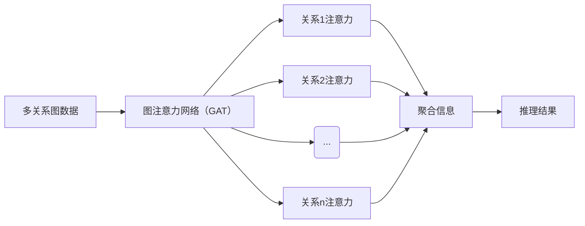

# 图注意力网络在多关系推理中的优化方法

> 关键词：图注意力网络、多关系推理、优化方法、图神经网络、注意力机制

> 摘要：本文聚焦于图注意力网络在多关系推理中的优化方法。首先介绍了相关的背景知识，包括研究的目的、预期读者、文档结构和术语表等。接着阐述了图注意力网络和多关系推理的核心概念及它们之间的联系，给出了原理和架构的文本示意图与 Mermaid 流程图。详细讲解了核心算法原理，并通过 Python 源代码进行具体操作步骤的说明。深入探讨了相关的数学模型和公式，结合举例进行详细讲解。通过项目实战展示了代码的实际案例，并对其进行详细解释说明。分析了图注意力网络在多关系推理中的实际应用场景。推荐了学习所需的工具和资源，包括书籍、在线课程、技术博客、开发工具框架以及相关论文著作等。最后总结了未来的发展趋势与挑战，还给出了常见问题的解答和扩展阅读及参考资料，旨在为研究和应用图注意力网络进行多关系推理的人员提供全面而深入的技术指导。

## 1. 背景介绍 
### 1.1 目的和范围
在当今的人工智能和知识图谱等领域，多关系推理是一个重要的研究方向。多关系推理旨在从复杂的图结构数据中挖掘出实体之间的多种关系，并进行有效的推理。图注意力网络（Graph Attention Network, GAT）作为一种强大的图神经网络模型，具有能够自适应地学习节点之间的重要性权重的能力，在多关系推理中展现出了巨大的潜力。

本研究的目的在于深入探讨图注意力网络在多关系推理中的优化方法，通过对现有技术的改进和创新，提高多关系推理的准确性和效率。研究范围涵盖了图注意力网络的基本原理、多关系推理的相关概念、核心算法的优化、数学模型的构建以及实际应用场景的分析等方面。

### 1.2 预期读者
本文预期读者包括但不限于以下几类人群：
1. **研究人员**：对图神经网络、多关系推理等领域有深入研究兴趣的学者和科研人员，希望通过本文了解最新的优化方法和研究进展。
2. **工程师**：从事人工智能、知识图谱、自然语言处理等相关领域开发的工程师，期望借鉴本文的优化方法来提升实际项目的性能。
3. **学生**：计算机科学、人工智能等相关专业的学生，希望通过本文系统地学习图注意力网络在多关系推理中的应用和优化技术。

### 1.3 文档结构概述
本文将按照以下结构进行组织：
1. **背景介绍**：介绍研究的目的、预期读者、文档结构和术语表等基本信息。
2. **核心概念与联系**：阐述图注意力网络和多关系推理的核心概念，给出原理和架构的文本示意图与 Mermaid 流程图。
3. **核心算法原理 & 具体操作步骤**：详细讲解图注意力网络在多关系推理中的核心算法原理，并通过 Python 源代码进行具体操作步骤的说明。
4. **数学模型和公式 & 详细讲解 & 举例说明**：深入探讨相关的数学模型和公式，结合举例进行详细讲解。
5. **项目实战：代码实际案例和详细解释说明**：通过实际项目展示代码的具体实现，并对代码进行详细解读和分析。
6. **实际应用场景**：分析图注意力网络在多关系推理中的实际应用场景。
7. **工具和资源推荐**：推荐学习所需的工具和资源，包括书籍、在线课程、技术博客、开发工具框架以及相关论文著作等。
8. **总结：未来发展趋势与挑战**：总结图注意力网络在多关系推理中的未来发展趋势和面临的挑战。
9. **附录：常见问题与解答**：对常见问题进行解答，帮助读者更好地理解和应用相关技术。
10. **扩展阅读 & 参考资料**：提供扩展阅读的相关内容和参考资料，方便读者进一步深入学习。

### 1.4 术语表
#### 1.4.1 核心术语定义
1. **图注意力网络（Graph Attention Network, GAT）**：一种基于注意力机制的图神经网络模型，通过学习节点之间的注意力权重，自适应地聚合邻居节点的信息。
2. **多关系推理**：在包含多种关系的图结构数据中，根据已知的实体和关系信息，推断出未知的实体关系的过程。
3. **知识图谱**：一种以图结构形式表示知识的语义网络，由实体、关系和属性组成。
4. **注意力机制**：一种在处理序列数据或图数据时，能够自适应地分配不同部分重要性权重的机制。

#### 1.4.2 相关概念解释
1. **图神经网络（Graph Neural Network, GNN）**：一类专门用于处理图结构数据的神经网络模型，通过消息传递机制聚合节点信息。
2. **消息传递**：图神经网络中节点之间信息传递和聚合的过程，通过邻居节点的信息更新当前节点的表示。
3. **实体**：知识图谱中具有独立意义的对象，如人物、地点、事件等。
4. **关系**：实体之间的联系，如“父子关系”、“工作于”等。

#### 1.4.3 缩略词列表
1. **GAT**：Graph Attention Network（图注意力网络）
2. **GNN**：Graph Neural Network（图神经网络）
3. **KG**：Knowledge Graph（知识图谱）

## 2. 核心概念与联系 

### 图注意力网络（GAT）原理
图注意力网络是一种基于注意力机制的图神经网络模型。传统的图神经网络在聚合邻居节点信息时，对所有邻居节点采用相同的权重，而 GAT 则通过注意力机制为不同的邻居节点分配不同的权重，从而更好地捕捉节点之间的重要性差异。

其基本原理如下：
1. **节点特征表示**：对于图中的每个节点 $v_i$，都有一个对应的特征向量 $\mathbf{h}_i \in \mathbb{R}^F$，其中 $F$ 是特征维度。
2. **注意力计算**：GAT 通过一个共享的注意力机制计算节点 $v_i$ 与邻居节点 $v_j$ 之间的注意力系数 $e_{ij}$，通常使用一个单层前馈神经网络来实现：
   $$e_{ij} = a(\mathbf{W}\mathbf{h}_i, \mathbf{W}\mathbf{h}_j)$$
   其中 $\mathbf{W} \in \mathbb{R}^{F' \times F}$ 是可学习的权重矩阵，$a: \mathbb{R}^{2F'} \to \mathbb{R}$ 是一个注意力评分函数，通常采用 LeakyReLU 激活函数。
3. **注意力归一化**：为了使注意力系数具有可比性，需要对其进行归一化处理，通常使用 softmax 函数：
   $$\alpha_{ij} = \text{softmax}_j(e_{ij}) = \frac{\exp(e_{ij})}{\sum_{k \in \mathcal{N}_i} \exp(e_{ik})}$$
   其中 $\mathcal{N}_i$ 是节点 $v_i$ 的邻居节点集合。
4. **节点特征更新**：根据注意力系数，聚合邻居节点的信息来更新当前节点的特征：
   $$\mathbf{h}'_i = \sigma\left(\sum_{j \in \mathcal{N}_i} \alpha_{ij} \mathbf{W}\mathbf{h}_j\right)$$
   其中 $\sigma$ 是激活函数，如 ReLU 或 LeakyReLU。

### 多关系推理概念
多关系推理是在包含多种关系的图结构数据中进行推理的过程。在知识图谱等应用中，实体之间存在着多种不同类型的关系，多关系推理的目标是根据已知的实体和关系信息，推断出未知的实体关系。

例如，在一个知识图谱中，已知“张三”和“李四”是“同事关系”，“李四”和“王五”是“朋友关系”，多关系推理可以尝试推断“张三”和“王五”之间可能存在的关系。

### 核心概念联系
图注意力网络在多关系推理中具有重要的作用。通过注意力机制，GAT 可以自适应地学习不同关系在推理过程中的重要性，从而更好地捕捉实体之间的复杂关系。具体来说，在多关系推理中，GAT 可以根据不同的关系类型为邻居节点分配不同的注意力权重，使得模型能够更加关注与当前推理任务相关的关系信息，提高推理的准确性和效率。

### 文本示意图
```plaintext
            多关系图数据
                |
                |
        图注意力网络（GAT）
        /           |           \
  关系1注意力   关系2注意力   ... 关系n注意力
        \           |           /
                聚合信息
                |
                |
            推理结果
```

### Mermaid 流程图


## 3. 核心算法原理 & 具体操作步骤 

### 核心算法原理
图注意力网络在多关系推理中的核心算法主要包括以下几个步骤：
1. **多关系图构建**：将原始数据转换为包含多种关系的图结构，其中节点表示实体，边表示关系。
2. **节点特征初始化**：为每个节点分配一个初始的特征向量，可以使用节点的属性信息或随机初始化。
3. **注意力计算**：对于每个节点，计算其与邻居节点在不同关系下的注意力系数。
4. **信息聚合**：根据注意力系数，聚合邻居节点的信息来更新当前节点的特征。
5. **推理预测**：根据更新后的节点特征，进行关系推理预测。

### 具体操作步骤及 Python 源代码

以下是一个简单的 Python 代码示例，使用 PyTorch 和 DGL 库实现图注意力网络在多关系推理中的基本操作：

```python
import torch
import torch.nn as nn
import torch.nn.functional as F
import dgl
import dgl.function as fn

# 定义图注意力网络层
class GATLayer(nn.Module):
    def __init__(self, in_feats, out_feats, num_rels):
        super(GATLayer, self).__init__()
        self.num_rels = num_rels
        self.W = nn.Parameter(torch.FloatTensor(size=(in_feats, out_feats)))
        self.a = nn.Parameter(torch.FloatTensor(size=(2 * out_feats, 1)))
        nn.init.xavier_uniform_(self.W.data, gain=1.414)
        nn.init.xavier_uniform_(self.a.data, gain=1.414)
        self.leakyrelu = nn.LeakyReLU(0.2)

    def edge_attention(self, edges):
        z2 = torch.cat([edges.src['z'], edges.dst['z']], dim=1)
        a = self.leakyrelu(torch.matmul(z2, self.a))
        return {'e': a}

    def message_func(self, edges):
        return {'z': edges.src['z'], 'e': edges.data['e']}

    def reduce_func(self, nodes):
        alpha = F.softmax(nodes.mailbox['e'], dim=1)
        h = torch.sum(alpha * nodes.mailbox['z'], dim=1)
        return {'h': h}

    def forward(self, g, inputs):
        z = torch.matmul(inputs, self.W)
        g.ndata['z'] = z
        g.apply_edges(self.edge_attention)
        g.update_all(self.message_func, self.reduce_func)
        return g.ndata.pop('h')

# 定义多关系图注意力网络模型
class MultiRelGAT(nn.Module):
    def __init__(self, in_feats, hidden_feats, out_feats, num_rels):
        super(MultiRelGAT, self).__init__()
        self.gat_layer = GATLayer(in_feats, hidden_feats, num_rels)
        self.fc = nn.Linear(hidden_feats, out_feats)

    def forward(self, g, inputs):
        h = self.gat_layer(g, inputs)
        h = F.relu(h)
        h = self.fc(h)
        return h

# 示例数据
num_nodes = 10
num_edges = 20
num_rels = 3
in_feats = 16
hidden_feats = 32
out_feats = 8

# 构建多关系图
src = torch.randint(0, num_nodes, (num_edges,))
dst = torch.randint(0, num_nodes, (num_edges,))
rel_type = torch.randint(0, num_rels, (num_edges,))
g = dgl.graph((src, dst))
g.edata['rel_type'] = rel_type

# 初始化节点特征
node_features = torch.randn(num_nodes, in_feats)

# 初始化模型
model = MultiRelGAT(in_feats, hidden_feats, out_feats, num_rels)

# 前向传播
output = model(g, node_features)
print(output.shape)
```

### 代码解释
1. **GATLayer 类**：定义了图注意力网络的一层，包括注意力计算、消息传递和信息聚合等操作。
2. **MultiRelGAT 类**：定义了多关系图注意力网络模型，包含一个 GAT 层和一个全连接层。
3. **示例数据**：构建了一个简单的多关系图，并初始化了节点特征。
4. **前向传播**：将图和节点特征输入到模型中，得到输出结果。

## 4. 数学模型和公式 & 详细讲解 & 举例说明 

### 数学模型和公式
#### 注意力计算
在图注意力网络中，注意力系数的计算是核心步骤之一。对于节点 $v_i$ 和其邻居节点 $v_j$，注意力系数 $e_{ij}$ 的计算公式为：
$$e_{ij} = \text{LeakyReLU}(\mathbf{a}^T [\mathbf{W}\mathbf{h}_i || \mathbf{W}\mathbf{h}_j])$$
其中 $\mathbf{a} \in \mathbb{R}^{2F'}$ 是可学习的注意力参数，$\mathbf{W} \in \mathbb{R}^{F' \times F}$ 是权重矩阵，$\mathbf{h}_i$ 和 $\mathbf{h}_j$ 分别是节点 $v_i$ 和 $v_j$ 的特征向量，$||$ 表示向量拼接操作。

#### 注意力归一化
为了使注意力系数具有可比性，需要对其进行归一化处理，通常使用 softmax 函数：
$$\alpha_{ij} = \frac{\exp(e_{ij})}{\sum_{k \in \mathcal{N}_i} \exp(e_{ik})}$$
其中 $\mathcal{N}_i$ 是节点 $v_i$ 的邻居节点集合。

#### 节点特征更新
根据注意力系数，聚合邻居节点的信息来更新当前节点的特征：
$$\mathbf{h}'_i = \sigma\left(\sum_{j \in \mathcal{N}_i} \alpha_{ij} \mathbf{W}\mathbf{h}_j\right)$$
其中 $\sigma$ 是激活函数，如 ReLU 或 LeakyReLU。

### 详细讲解
1. **注意力计算**：通过将节点特征向量进行线性变换和拼接，然后使用 LeakyReLU 激活函数计算注意力系数。LeakyReLU 函数可以避免梯度消失问题，使得模型能够更好地学习到节点之间的重要性差异。
2. **注意力归一化**：使用 softmax 函数将注意力系数转化为概率分布，使得所有邻居节点的注意力系数之和为 1，从而可以根据这些系数对邻居节点的信息进行加权聚合。
3. **节点特征更新**：根据归一化后的注意力系数，对邻居节点的特征进行加权求和，然后通过激活函数进行非线性变换，得到更新后的节点特征。

### 举例说明
假设我们有一个简单的图，包含 3 个节点 $v_1$、$v_2$ 和 $v_3$，节点特征向量分别为 $\mathbf{h}_1 = [1, 2]^T$，$\mathbf{h}_2 = [3, 4]^T$ 和 $\mathbf{h}_3 = [5, 6]^T$。

1. **注意力计算**：
   假设 $\mathbf{W} = \begin{bmatrix} 0.1 & 0.2 \\ 0.3 & 0.4 \end{bmatrix}$，$\mathbf{a} = [0.1, 0.2, 0.3, 0.4]^T$。
   对于节点 $v_1$ 和其邻居节点 $v_2$，计算 $\mathbf{W}\mathbf{h}_1 = \begin{bmatrix} 0.1 & 0.2 \\ 0.3 & 0.4 \end{bmatrix} \begin{bmatrix} 1 \\ 2 \end{bmatrix} = \begin{bmatrix} 0.5 \\ 1.1 \end{bmatrix}$，$\mathbf{W}\mathbf{h}_2 = \begin{bmatrix} 0.1 & 0.2 \\ 0.3 & 0.4 \end{bmatrix} \begin{bmatrix} 3 \\ 4 \end{bmatrix} = \begin{bmatrix} 1.1 \\ 2.5 \end{bmatrix}$。
   拼接得到 $[\mathbf{W}\mathbf{h}_1 || \mathbf{W}\mathbf{h}_2] = [0.5, 1.1, 1.1, 2.5]^T$。
   计算 $e_{12} = \text{LeakyReLU}(\mathbf{a}^T [\mathbf{W}\mathbf{h}_1 || \mathbf{W}\mathbf{h}_2]) = \text{LeakyReLU}(0.1 \times 0.5 + 0.2 \times 1.1 + 0.3 \times 1.1 + 0.4 \times 2.5) = \text{LeakyReLU}(1.6) = 1.6$。
2. **注意力归一化**：
   假设节点 $v_1$ 的邻居节点为 $v_2$ 和 $v_3$，计算 $e_{13}$ 同理。
   假设 $e_{13} = 2.0$，则 $\alpha_{12} = \frac{\exp(1.6)}{\exp(1.6) + \exp(2.0)} \approx 0.377$，$\alpha_{13} = \frac{\exp(2.0)}{\exp(1.6) + \exp(2.0)} \approx 0.623$。
3. **节点特征更新**：
   假设 $\sigma$ 为 ReLU 函数，$\mathbf{h}'_1 = \text{ReLU}(\alpha_{12} \mathbf{W}\mathbf{h}_2 + \alpha_{13} \mathbf{W}\mathbf{h}_3)$。

## 5. 项目实战：代码实际案例和详细解释说明 

### 5.1  开发环境搭建
#### 安装 Python
首先需要安装 Python 环境，建议使用 Python 3.7 及以上版本。可以从 Python 官方网站（https://www.python.org/downloads/）下载并安装。

#### 安装依赖库
本项目需要使用以下几个主要的库：
1. **PyTorch**：深度学习框架，用于构建和训练神经网络模型。可以根据自己的 CUDA 版本和操作系统选择合适的安装方式，具体安装命令可以参考 PyTorch 官方网站（https://pytorch.org/get-started/locally/）。
2. **DGL**：图神经网络库，用于处理图结构数据。可以使用以下命令进行安装：
```sh
pip install dgl
```
3. **NumPy**：用于数值计算和数组操作。可以使用以下命令进行安装：
```sh
pip install numpy
```
4. **Matplotlib**：用于数据可视化。可以使用以下命令进行安装：
```sh
pip install matplotlib
```

### 5.2  源代码详细实现和代码解读
以下是一个完整的项目实战代码示例，使用图注意力网络进行多关系推理：

```python
import torch
import torch.nn as nn
import torch.nn.functional as F
import dgl
import dgl.function as fn
import numpy as np
import matplotlib.pyplot as plt

# 定义图注意力网络层
class GATLayer(nn.Module):
    def __init__(self, in_feats, out_feats, num_rels):
        super(GATLayer, self).__init__()
        self.num_rels = num_rels
        self.W = nn.Parameter(torch.FloatTensor(size=(in_feats, out_feats)))
        self.a = nn.Parameter(torch.FloatTensor(size=(2 * out_feats, 1)))
        nn.init.xavier_uniform_(self.W.data, gain=1.414)
        nn.init.xavier_uniform_(self.a.data, gain=1.414)
        self.leakyrelu = nn.LeakyReLU(0.2)

    def edge_attention(self, edges):
        z2 = torch.cat([edges.src['z'], edges.dst['z']], dim=1)
        a = self.leakyrelu(torch.matmul(z2, self.a))
        return {'e': a}

    def message_func(self, edges):
        return {'z': edges.src['z'], 'e': edges.data['e']}

    def reduce_func(self, nodes):
        alpha = F.softmax(nodes.mailbox['e'], dim=1)
        h = torch.sum(alpha * nodes.mailbox['z'], dim=1)
        return {'h': h}

    def forward(self, g, inputs):
        z = torch.matmul(inputs, self.W)
        g.ndata['z'] = z
        g.apply_edges(self.edge_attention)
        g.update_all(self.message_func, self.reduce_func)
        return g.ndata.pop('h')

# 定义多关系图注意力网络模型
class MultiRelGAT(nn.Module):
    def __init__(self, in_feats, hidden_feats, out_feats, num_rels):
        super(MultiRelGAT, self).__init__()
        self.gat_layer = GATLayer(in_feats, hidden_feats, num_rels)
        self.fc = nn.Linear(hidden_feats, out_feats)

    def forward(self, g, inputs):
        h = self.gat_layer(g, inputs)
        h = F.relu(h)
        h = self.fc(h)
        return h

# 生成示例数据
num_nodes = 50
num_edges = 100
num_rels = 3
in_feats = 16
hidden_feats = 32
out_feats = 8
src = torch.randint(0, num_nodes, (num_edges,))
dst = torch.randint(0, num_nodes, (num_edges,))
rel_type = torch.randint(0, num_rels, (num_edges,))
g = dgl.graph((src, dst))
g.edata['rel_type'] = rel_type
node_features = torch.randn(num_nodes, in_feats)
labels = torch.randint(0, 2, (num_nodes,))  # 示例标签

# 初始化模型、优化器和损失函数
model = MultiRelGAT(in_feats, hidden_feats, out_feats, num_rels)
optimizer = torch.optim.Adam(model.parameters(), lr=0.01)
criterion = nn.CrossEntropyLoss()

# 训练模型
num_epochs = 100
losses = []
for epoch in range(num_epochs):
    optimizer.zero_grad()
    outputs = model(g, node_features)
    loss = criterion(outputs, labels)
    loss.backward()
    optimizer.step()
    losses.append(loss.item())
    if (epoch + 1) % 10 == 0:
        print(f'Epoch [{epoch + 1}/{num_epochs}], Loss: {loss.item():.4f}')

# 绘制损失曲线
plt.plot(np.arange(num_epochs), losses)
plt.xlabel('Epoch')
plt.ylabel('Loss')
plt.title('Training Loss')
plt.show()
```

### 5.3  代码解读与分析
1. **GATLayer 类**：定义了图注意力网络的一层，包括注意力计算、消息传递和信息聚合等操作。
   - `__init__` 方法：初始化可学习的参数 $\mathbf{W}$ 和 $\mathbf{a}$，并使用 Xavier 初始化方法进行参数初始化。
   - `edge_attention` 方法：计算节点之间的注意力系数。
   - `message_func` 方法：定义消息传递函数，将源节点的特征和注意力系数传递给目标节点。
   - `reduce_func` 方法：定义信息聚合函数，根据注意力系数对邻居节点的特征进行加权求和。
   - `forward` 方法：前向传播函数，完成节点特征的更新。
2. **MultiRelGAT 类**：定义了多关系图注意力网络模型，包含一个 GAT 层和一个全连接层。
   - `__init__` 方法：初始化 GAT 层和全连接层。
   - `forward` 方法：前向传播函数，将 GAT 层的输出经过 ReLU 激活函数后输入到全连接层，得到最终的输出。
3. **示例数据生成**：生成一个包含 50 个节点、100 条边和 3 种关系的图，并初始化节点特征和标签。
4. **模型训练**：使用 Adam 优化器和交叉熵损失函数进行模型训练，训练 100 个 epoch，并记录每个 epoch 的损失值。
5. **损失曲线绘制**：使用 Matplotlib 库绘制训练损失曲线，直观地展示模型的训练过程。

## 6. 实际应用场景 
### 知识图谱补全
在知识图谱中，由于数据的不完整性，存在大量的缺失关系。图注意力网络在多关系推理中的优化方法可以通过学习实体之间的多种关系，推断出缺失的关系，从而实现知识图谱的补全。例如，在一个人物关系知识图谱中，已知部分人物之间的亲属关系、工作关系等，可以使用图注意力网络推断出其他可能存在的关系，如朋友关系、合作伙伴关系等。

### 推荐系统
在推荐系统中，用户和物品之间存在多种关系，如浏览、购买、收藏等。图注意力网络可以将用户和物品表示为图中的节点，将这些关系表示为边，通过多关系推理学习用户的兴趣偏好和物品的特征，从而为用户提供更精准的推荐。例如，在电商推荐系统中，根据用户的历史购买记录、浏览记录和收藏记录，使用图注意力网络推断用户可能感兴趣的商品。

### 社交网络分析
在社交网络中，用户之间存在多种关系，如好友关系、关注关系、互动关系等。图注意力网络可以用于分析社交网络中的用户行为和关系模式，预测用户之间的潜在关系，如预测用户是否会成为好友、是否会进行互动等。例如，在社交媒体平台中，通过分析用户的社交行为和关系网络，使用图注意力网络推荐可能感兴趣的好友。

### 生物信息学
在生物信息学中，生物分子之间存在多种相互作用关系，如蛋白质 - 蛋白质相互作用、基因调控关系等。图注意力网络可以将生物分子表示为图中的节点，将这些相互作用关系表示为边，通过多关系推理研究生物分子的功能和相互作用机制，预测疾病的发生和发展。例如，在药物研发中，使用图注意力网络分析药物分子与生物靶点之间的相互作用关系，筛选出潜在的药物靶点。

## 7. 工具和资源推荐
### 7.1 学习资源推荐
#### 7.1.1 书籍推荐
1. 《图神经网络：基础、前沿与应用》：全面介绍了图神经网络的基本原理、算法和应用，对图注意力网络等相关内容有详细的讲解。
2. 《深度学习》：深度学习领域的经典教材，对神经网络的基本原理和算法有深入的介绍，为学习图注意力网络提供了理论基础。
3. 《知识图谱：方法、实践与应用》：详细介绍了知识图谱的构建、推理和应用，对图注意力网络在知识图谱中的应用有相关的案例分析。

#### 7.1.2 在线课程
1. Coursera 上的“Graph Neural Networks”课程：由知名学者授课，系统地介绍了图神经网络的基本原理和算法，包括图注意力网络的相关内容。
2. edX 上的“Deep Learning for Graphs”课程：专注于图深度学习的相关内容，对图注意力网络在多关系推理中的应用有深入的讲解。
3. B 站等平台上的相关图神经网络教程：有许多开源的图神经网络教程，包含了丰富的代码示例和讲解，适合初学者学习。

#### 7.1.3 技术博客和网站
1. Medium 上的图神经网络相关博客：有许多图神经网络领域的专家和研究者在 Medium 上分享他们的研究成果和经验，对图注意力网络在多关系推理中的优化方法有相关的讨论。
2. 知乎上的图神经网络话题：知乎上有许多关于图神经网络的讨论和问答，涉及到图注意力网络的原理、应用和优化等方面的内容。
3. 开源代码库 GitHub：在 GitHub 上可以找到许多图神经网络的开源代码实现，包括图注意力网络的相关代码，通过阅读和学习这些代码可以更好地理解和应用图注意力网络。

### 7.2 开发工具框架推荐
#### 7.2.1 IDE和编辑器
1. PyCharm：一款功能强大的 Python 集成开发环境，提供了代码编辑、调试、版本控制等丰富的功能，适合开发图神经网络相关项目。
2. Visual Studio Code：一款轻量级的代码编辑器，支持多种编程语言和插件扩展，对 Python 开发有很好的支持，也可以用于开发图神经网络项目。
3. Jupyter Notebook：一种交互式的开发环境，适合进行数据分析和模型实验，在图神经网络的研究和开发中经常使用。

#### 7.2.2 调试和性能分析工具
1. PyTorch Profiler：PyTorch 提供的性能分析工具，可以帮助开发者分析模型的性能瓶颈，优化模型的运行效率。
2. TensorBoard：一款可视化工具，可以用于可视化模型的训练过程、损失曲线、准确率等指标，帮助开发者更好地理解模型的训练情况。
3. cProfile：Python 内置的性能分析工具，可以用于分析 Python 代码的性能，找出代码中的性能瓶颈。

#### 7.2.3 相关框架和库
1. PyTorch：一个开源的深度学习框架，提供了丰富的神经网络层和优化算法，对图神经网络的支持也很好，许多图神经网络的研究和开发都基于 PyTorch 实现。
2. DGL：一个专门用于图神经网络的开源库，提供了高效的图数据处理和图神经网络模型的实现，支持多种图神经网络架构，包括图注意力网络。
3. NetworkX：一个用于图论和网络分析的 Python 库，可以用于构建、操作和研究复杂的图结构，在图数据预处理和分析中经常使用。

### 7.3 相关论文著作推荐
#### 7.3.1 经典论文
1. “Graph Attention Networks”：图注意力网络的经典论文，详细介绍了图注意力网络的原理和算法，为后续的研究和应用奠定了基础。
2. “Modeling Relational Data with Graph Convolutional Networks”：提出了一种基于图卷积网络的多关系推理模型，对图神经网络在多关系推理中的应用有重要的参考价值。
3. “Knowledge Graph Embedding: A Survey of Approaches and Applications”：对知识图谱嵌入的相关方法和应用进行了全面的综述，对图注意力网络在知识图谱中的应用有一定的启示作用。

#### 7.3.2 最新研究成果
1. 每年的顶级学术会议如 NeurIPS、ICML、ACL 等上的相关论文：这些会议上的论文代表了图神经网络和多关系推理领域的最新研究成果和发展趋势。
2. 相关学术期刊如 Journal of Artificial Intelligence Research (JAIR)、Artificial Intelligence 等上的论文：这些期刊上的论文质量较高，对图注意力网络在多关系推理中的优化方法有深入的研究。

#### 7.3.3 应用案例分析
1. 工业界的技术博客和案例分享：许多科技公司如 Google、Facebook、Microsoft 等会在其技术博客上分享图神经网络在实际应用中的案例和经验，对图注意力网络在多关系推理中的应用有很好的借鉴作用。
2. 开源项目的文档和案例：一些开源的图神经网络项目会提供详细的文档和案例，展示图注意力网络在不同场景下的应用，通过学习这些案例可以更好地掌握图注意力网络的应用技巧。

## 8. 总结：未来发展趋势与挑战
### 未来发展趋势
1. **模型结构优化**：未来的研究可能会继续探索更高效、更强大的图注意力网络模型结构，以提高多关系推理的准确性和效率。例如，引入更复杂的注意力机制、结合其他深度学习模型等。
2. **多模态融合**：随着多模态数据的不断增加，图注意力网络可能会与其他模态的数据（如图像、文本、语音等）进行融合，实现更全面、更深入的多关系推理。例如，在知识图谱中结合图像和文本信息，更好地理解实体之间的关系。
3. **可解释性增强**：图注意力网络的可解释性一直是一个重要的研究方向。未来的研究可能会致力于提高图注意力网络在多关系推理中的可解释性，使得模型的决策过程更加透明，便于用户理解和信任。
4. **应用场景拓展**：图注意力网络在多关系推理中的应用场景将不断拓展，除了现有的知识图谱补全、推荐系统、社交网络分析等领域，还可能会应用到医疗、金融、交通等更多领域，为这些领域的决策和分析提供支持。

### 挑战
1. **数据稀疏性**：在多关系推理中，数据往往存在稀疏性问题，即图中的边和关系数量相对较少。这会导致模型难以学习到足够的信息，影响推理的准确性。解决数据稀疏性问题是未来研究的一个重要挑战。
2. **计算资源需求**：图注意力网络的训练和推理通常需要大量的计算资源，特别是在处理大规模图数据时。如何在有限的计算资源下提高模型的训练和推理效率是一个亟待解决的问题。
3. **多关系建模的复杂性**：多关系推理中存在多种不同类型的关系，这些关系之间可能存在复杂的交互和依赖。如何有效地建模这些多关系，捕捉它们之间的复杂信息，是图注意力网络面临的一个挑战。
4. **模型可扩展性**：随着图数据规模的不断增大，图注意力网络的模型规模也会相应增大，导致模型的可扩展性变差。如何设计可扩展的图注意力网络模型，以适应大规模图数据的处理，是未来研究的一个重要方向。

## 9. 附录：常见问题与解答
### 1. 图注意力网络与传统图神经网络有什么区别？
传统图神经网络在聚合邻居节点信息时，对所有邻居节点采用相同的权重，而图注意力网络通过注意力机制为不同的邻居节点分配不同的权重，从而更好地捕捉节点之间的重要性差异，提高模型的性能。

### 2. 如何选择合适的注意力机制？
选择合适的注意力机制需要考虑具体的应用场景和数据特点。常见的注意力机制包括点积注意力、加性注意力等。可以通过实验比较不同注意力机制的性能，选择最适合的一种。

### 3. 图注意力网络在多关系推理中的训练过程是怎样的？
图注意力网络在多关系推理中的训练过程通常包括以下步骤：
1. 数据预处理：将原始数据转换为图结构数据，并进行节点特征初始化。
2. 模型定义：定义图注意力网络模型，包括注意力层和全连接层等。
3. 损失函数定义：选择合适的损失函数，如交叉熵损失函数、均方误差损失函数等。
4. 优化器选择：选择合适的优化器，如 Adam 优化器、SGD 优化器等。
5. 训练过程：将图数据和节点特征输入到模型中，进行前向传播计算损失，然后进行反向传播更新模型参数。
6. 模型评估：在训练过程中，定期评估模型的性能，选择性能最好的模型。

### 4. 如何处理大规模图数据？
处理大规模图数据可以采用以下方法：
1. 图采样：通过采样的方式减少图的规模，如随机采样、分层采样等。
2. 分布式训练：使用分布式计算框架，如 PyTorch Distributed 或 TensorFlow Distributed，将图数据和模型分布到多个计算节点上进行训练。
3. 增量学习：采用增量学习的方法，逐步更新模型参数，避免一次性处理大规模图数据。

### 5. 图注意力网络在多关系推理中的可解释性如何提高？
提高图注意力网络在多关系推理中的可解释性可以采用以下方法：
1. 可视化注意力权重：将注意力权重进行可视化，展示模型在推理过程中对不同邻居节点的关注程度。
2. 特征重要性分析：分析节点特征对推理结果的重要性，找出影响推理结果的关键特征。
3. 规则提取：从模型的推理结果中提取规则，将模型的决策过程转化为可理解的规则形式。

## 10. 扩展阅读 & 参考资料
### 扩展阅读
1. 《深度学习中的注意力机制》：深入介绍了深度学习中各种注意力机制的原理和应用，对理解图注意力网络的注意力机制有很大的帮助。
2. 《知识图谱与深度学习》：探讨了知识图谱和深度学习的结合方法和应用，对图注意力网络在知识图谱中的应用有进一步的拓展。
3. 《图论及其应用》：系统地介绍了图论的基本概念和算法，为理解图结构数据和图神经网络提供了理论基础。

### 参考资料
1. Veličković, P., Cucurull, G., Casanova, A., Romero, A., Liò, P., & Bengio, Y. (2017). Graph attention networks. arXiv preprint arXiv:1710.10903.
2. Schlichtkrull, M. S., Kipf, T. N., Bloem, P., Van Den Berg, R., Titov, I., & Welling, M. (2017). Modeling relational data with graph convolutional networks. arXiv preprint arXiv:1703.06103.
3. Wang, Q., Mao, Z., Wang, B., & Guo, L. (2017). Knowledge graph embedding: A survey of approaches and applications. IEEE Transactions on Knowledge and Data Engineering, 29(12), 2724-2743.

作者：AI天才研究院/AI Genius Institute & 禅与计算机程序设计艺术 /Zen And The Art of Computer Programming