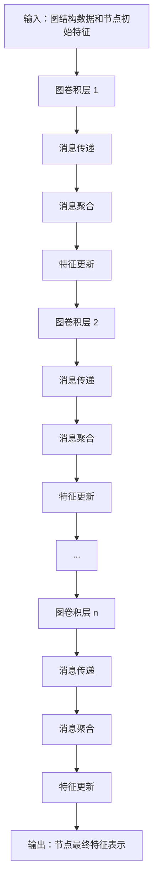

# 图神经网络在复杂关系建模中的应用

> 关键词：图神经网络、复杂关系建模、图结构数据、深度学习、图卷积网络

> 摘要：本文深入探讨了图神经网络在复杂关系建模中的应用。首先介绍了相关背景，包括目的范围、预期读者等。接着阐述了图神经网络的核心概念与联系，给出原理和架构示意图及流程图。详细讲解了核心算法原理与操作步骤，并使用 Python 代码进行说明。同时给出了相关数学模型和公式，并举例解释。通过项目实战展示代码案例并详细解读。分析了图神经网络在不同实际场景中的应用，推荐了学习资源、开发工具框架和相关论文著作。最后总结了未来发展趋势与挑战，还提供了常见问题解答和扩展阅读参考资料，旨在为读者全面呈现图神经网络在复杂关系建模领域的应用情况。

## 1. 背景介绍 
### 1.1 目的和范围
在现实世界中，许多数据都呈现出复杂的关系结构，如社交网络中的用户关系、生物分子中的原子连接、交通网络中的道路连接等。传统的机器学习方法难以有效地处理这些具有复杂关系的数据。图神经网络（Graph Neural Networks, GNN）作为一种专门处理图结构数据的深度学习模型，能够很好地捕捉数据中的复杂关系，挖掘隐藏在其中的信息。本文的目的是系统地介绍图神经网络在复杂关系建模中的应用，涵盖图神经网络的基本概念、算法原理、实际应用案例等方面，为读者提供一个全面深入的了解。范围包括图神经网络的常见类型、核心算法、在不同领域的应用场景，以及相关的学习资源和工具推荐。

### 1.2 预期读者
本文预期读者包括对深度学习、机器学习感兴趣的研究人员和学生，希望了解图神经网络在复杂关系建模中应用的技术开发者，以及从事数据分析、数据挖掘等领域工作，需要处理图结构数据的专业人士。无论您是初学者，希望对图神经网络有一个初步的认识，还是有一定基础的专业人员，想要深入研究其在复杂关系建模中的应用，本文都将为您提供有价值的信息。

### 1.3 文档结构概述
本文将按照以下结构进行组织：首先介绍图神经网络的核心概念与联系，包括其原理和架构，并通过示意图和流程图进行直观展示；接着详细讲解核心算法原理和具体操作步骤，使用 Python 代码进行说明；给出相关的数学模型和公式，并通过具体例子进行解释；通过项目实战展示代码实际案例，并进行详细解读；分析图神经网络在不同实际场景中的应用；推荐相关的学习资源、开发工具框架和论文著作；最后总结图神经网络在复杂关系建模中的未来发展趋势与挑战，提供常见问题解答和扩展阅读参考资料。

### 1.4 术语表
#### 1.4.1 核心术语定义
- **图神经网络（Graph Neural Networks, GNN）**：一类专门用于处理图结构数据的深度学习模型，通过对图中的节点和边进行信息传递和聚合，学习节点和图的特征表示。
- **图结构数据**：由节点（Vertex）和边（Edge）组成的数据结构，节点表示实体，边表示实体之间的关系。
- **节点特征**：每个节点所具有的属性信息，如社交网络中用户的年龄、性别等。
- **图卷积网络（Graph Convolutional Network, GCN）**：一种常见的图神经网络，通过在图上进行卷积操作，实现节点特征的更新和聚合。
- **信息传递机制**：图神经网络中节点之间传递信息的方式，用于更新节点的特征表示。

#### 1.4.2 相关概念解释
- **邻接矩阵（Adjacency Matrix）**：用于表示图中节点之间连接关系的矩阵。如果节点 $i$ 和节点 $j$ 之间有边相连，则邻接矩阵中第 $i$ 行第 $j$ 列的元素为 1，否则为 0。
- **度矩阵（Degree Matrix）**：一个对角矩阵，对角线上的元素表示每个节点的度（即与该节点相连的边的数量）。
- **拉普拉斯矩阵（Laplacian Matrix）**：由邻接矩阵和度矩阵计算得到，用于图信号处理和图卷积操作。

#### 1.4.3 缩略词列表
- **GNN**：Graph Neural Networks（图神经网络）
- **GCN**：Graph Convolutional Network（图卷积网络）
- **DGL**：Deep Graph Library（深度图库）
- **PyTorch**：一个开源的深度学习框架

## 2. 核心概念与联系 

### 2.1 图神经网络的基本原理
图神经网络的核心思想是通过节点之间的信息传递和聚合，学习节点和图的特征表示。在图结构数据中，每个节点都有自己的特征，节点之间的边表示它们之间的关系。图神经网络通过迭代地更新节点的特征，使得每个节点能够综合考虑其邻居节点的信息。具体来说，图神经网络的信息传递过程可以分为以下几个步骤：
1. **消息传递**：每个节点将自己的特征信息传递给其邻居节点。
2. **消息聚合**：每个节点收集其邻居节点传递过来的消息，并进行聚合操作，如求和、求平均等。
3. **特征更新**：每个节点根据聚合后的消息更新自己的特征。

### 2.2 图神经网络的架构
图神经网络的架构通常由多个图卷积层组成，每个图卷积层都包含信息传递和特征更新的过程。输入是图结构数据和节点的初始特征，经过多个图卷积层的处理后，输出节点的最终特征表示。这些特征可以用于节点分类、图分类、链接预测等任务。

### 2.3 文本示意图
下面是一个简单的图神经网络架构的文本示意图：

```plaintext
输入：图结构数据（节点、边）和节点初始特征
|
|__ 图卷积层 1
|     |
|     |__ 消息传递
|     |
|     |__ 消息聚合
|     |
|     |__ 特征更新
|
|__ 图卷积层 2
|     |
|     |__ 消息传递
|     |
|     |__ 消息聚合
|     |
|     |__ 特征更新
|
...
|
|__ 图卷积层 n
|     |
|     |__ 消息传递
|     |
|     |__ 消息聚合
|     |
|     |__ 特征更新
|
输出：节点最终特征表示
```

### 2.4 Mermaid 流程图


## 3. 核心算法原理 & 具体操作步骤 

### 3.1 图卷积网络（GCN）的算法原理
图卷积网络（GCN）是一种常见的图神经网络，其核心思想是通过在图上进行卷积操作，实现节点特征的更新和聚合。GCN 的卷积操作可以表示为：

$$H^{(l+1)} = \sigma(\tilde{D}^{-\frac{1}{2}}\tilde{A}\tilde{D}^{-\frac{1}{2}}H^{(l)}W^{(l)})$$

其中：
- $H^{(l)}$ 是第 $l$ 层的节点特征矩阵，形状为 $N \times F^{(l)}$，$N$ 是节点数量，$F^{(l)}$ 是第 $l$ 层的特征维度。
- $\tilde{A} = A + I$ 是邻接矩阵 $A$ 加上自环后的矩阵，$I$ 是单位矩阵。
- $\tilde{D}$ 是 $\tilde{A}$ 的度矩阵。
- $W^{(l)}$ 是第 $l$ 层的可学习权重矩阵，形状为 $F^{(l)} \times F^{(l+1)}$。
- $\sigma$ 是激活函数，如 ReLU 函数。

### 3.2 具体操作步骤
下面是使用 PyTorch 实现一个简单的 GCN 层的 Python 代码：

```python
import torch
import torch.nn as nn
import torch.nn.functional as F

class GCNLayer(nn.Module):
    def __init__(self, in_features, out_features):
        super(GCNLayer, self).__init__()
        self.linear = nn.Linear(in_features, out_features)

    def forward(self, adj, features):
        # 计算邻接矩阵加上自环
        adj_hat = adj + torch.eye(adj.size(0))
        # 计算度矩阵
        d_hat = torch.diag(torch.pow(adj_hat.sum(dim=1), -0.5))
        # 计算对称归一化的邻接矩阵
        adj_norm = torch.mm(torch.mm(d_hat, adj_hat), d_hat)
        # 进行卷积操作
        support = torch.mm(adj_norm, features)
        output = self.linear(support)
        return output

# 示例使用
# 定义输入特征维度和输出特征维度
in_features = 16
out_features = 32
# 创建 GCN 层
gcn_layer = GCNLayer(in_features, out_features)
# 随机生成邻接矩阵和节点特征
adj = torch.randn(10, 10)
features = torch.randn(10, in_features)
# 前向传播
output = gcn_layer(adj, features)
print(output.shape)
```

### 3.3 代码解释
1. **GCNLayer 类**：继承自 `nn.Module`，用于定义一个 GCN 层。
2. **`__init__` 方法**：初始化一个线性层，用于将输入特征映射到输出特征。
3. **`forward` 方法**：实现 GCN 层的前向传播过程。具体步骤包括：
    - 计算邻接矩阵加上自环 $\tilde{A}$。
    - 计算度矩阵 $\tilde{D}$。
    - 计算对称归一化的邻接矩阵 $\tilde{D}^{-\frac{1}{2}}\tilde{A}\tilde{D}^{-\frac{1}{2}}$。
    - 进行卷积操作，将归一化的邻接矩阵与节点特征相乘，再通过线性层进行特征映射。
4. **示例使用**：随机生成邻接矩阵和节点特征，调用 GCN 层的前向传播方法，输出节点的特征表示。

## 4. 数学模型和公式 & 详细讲解 & 举例说明 

### 4.1 图卷积网络（GCN）的数学模型
GCN 的核心数学模型是图卷积操作，其公式为：

$$H^{(l+1)} = \sigma(\tilde{D}^{-\frac{1}{2}}\tilde{A}\tilde{D}^{-\frac{1}{2}}H^{(l)}W^{(l)})$$

### 4.2 详细讲解
- **邻接矩阵 $A$**：表示图中节点之间的连接关系。如果节点 $i$ 和节点 $j$ 之间有边相连，则 $A_{ij} = 1$，否则 $A_{ij} = 0$。
- **自环矩阵 $I$**：单位矩阵，用于在邻接矩阵中添加自环，使得每个节点可以考虑自身的信息。
- **$\tilde{A} = A + I$**：邻接矩阵加上自环后的矩阵。
- **度矩阵 $\tilde{D}$**：对角矩阵，对角线上的元素 $\tilde{D}_{ii}$ 表示节点 $i$ 的度（即与节点 $i$ 相连的边的数量，包括自环）。
- **对称归一化**：$\tilde{D}^{-\frac{1}{2}}\tilde{A}\tilde{D}^{-\frac{1}{2}}$ 是对邻接矩阵进行对称归一化的操作，目的是平衡不同节点的度对信息传递的影响。
- **可学习权重矩阵 $W^{(l)}$**：用于将第 $l$ 层的节点特征映射到第 $l+1$ 层的节点特征。
- **激活函数 $\sigma$**：如 ReLU 函数，用于引入非线性，增加模型的表达能力。

### 4.3 举例说明
假设我们有一个简单的图，包含 3 个节点，邻接矩阵 $A$ 为：

$$A = \begin{bmatrix}
0 & 1 & 0 \\
1 & 0 & 1 \\
0 & 1 & 0
\end{bmatrix}$$

节点的初始特征矩阵 $H^{(0)}$ 为：

$$H^{(0)} = \begin{bmatrix}
1 & 2 \\
3 & 4 \\
5 & 6
\end{bmatrix}$$

可学习权重矩阵 $W^{(0)}$ 为：

$$W^{(0)} = \begin{bmatrix}
0.1 & 0.2 \\
0.3 & 0.4
\end{bmatrix}$$

首先，计算 $\tilde{A} = A + I$：

$$\tilde{A} = \begin{bmatrix}
1 & 1 & 0 \\
1 & 1 & 1 \\
0 & 1 & 1
\end{bmatrix}$$

然后，计算度矩阵 $\tilde{D}$：

$$\tilde{D} = \begin{bmatrix}
2 & 0 & 0 \\
0 & 3 & 0 \\
0 & 0 & 2
\end{bmatrix}$$

接着，计算对称归一化的邻接矩阵 $\tilde{D}^{-\frac{1}{2}}\tilde{A}\tilde{D}^{-\frac{1}{2}}$：

$$\tilde{D}^{-\frac{1}{2}} = \begin{bmatrix}
\frac{1}{\sqrt{2}} & 0 & 0 \\
0 & \frac{1}{\sqrt{3}} & 0 \\
0 & 0 & \frac{1}{\sqrt{2}}
\end{bmatrix}$$

$$\tilde{D}^{-\frac{1}{2}}\tilde{A}\tilde{D}^{-\frac{1}{2}} = \begin{bmatrix}
\frac{1}{2} & \frac{1}{\sqrt{6}} & 0 \\
\frac{1}{\sqrt{6}} & \frac{1}{3} & \frac{1}{\sqrt{6}} \\
0 & \frac{1}{\sqrt{6}} & \frac{1}{2}
\end{bmatrix}$$

最后，进行图卷积操作：

$$H^{(1)} = \sigma(\tilde{D}^{-\frac{1}{2}}\tilde{A}\tilde{D}^{-\frac{1}{2}}H^{(0)}W^{(0)})$$

假设激活函数 $\sigma$ 为 ReLU 函数，则：

$$\tilde{D}^{-\frac{1}{2}}\tilde{A}\tilde{D}^{-\frac{1}{2}}H^{(0)} = \begin{bmatrix}
\frac{1}{2} \times 1 + \frac{1}{\sqrt{6}} \times 3 & \frac{1}{2} \times 2 + \frac{1}{\sqrt{6}} \times 4 \\
\frac{1}{\sqrt{6}} \times 1 + \frac{1}{3} \times 3 + \frac{1}{\sqrt{6}} \times 5 & \frac{1}{\sqrt{6}} \times 2 + \frac{1}{3} \times 4 + \frac{1}{\sqrt{6}} \times 6 \\
\frac{1}{\sqrt{6}} \times 3 + \frac{1}{2} \times 5 & \frac{1}{\sqrt{6}} \times 4 + \frac{1}{2} \times 6
\end{bmatrix}$$

$$\tilde{D}^{-\frac{1}{2}}\tilde{A}\tilde{D}^{-\frac{1}{2}}H^{(0)}W^{(0)} = \begin{bmatrix}
(\frac{1}{2} \times 1 + \frac{1}{\sqrt{6}} \times 3) \times 0.1 + (\frac{1}{2} \times 2 + \frac{1}{\sqrt{6}} \times 4) \times 0.3 & (\frac{1}{2} \times 1 + \frac{1}{\sqrt{6}} \times 3) \times 0.2 + (\frac{1}{2} \times 2 + \frac{1}{\sqrt{6}} \times 4) \times 0.4 \\
(\frac{1}{\sqrt{6}} \times 1 + \frac{1}{3} \times 3 + \frac{1}{\sqrt{6}} \times 5) \times 0.1 + (\frac{1}{\sqrt{6}} \times 2 + \frac{1}{3} \times 4 + \frac{1}{\sqrt{6}} \times 6) \times 0.3 & (\frac{1}{\sqrt{6}} \times 1 + \frac{1}{3} \times 3 + \frac{1}{\sqrt{6}} \times 5) \times 0.2 + (\frac{1}{\sqrt{6}} \times 2 + \frac{1}{3} \times 4 + \frac{1}{\sqrt{6}} \times 6) \times 0.4 \\
(\frac{1}{\sqrt{6}} \times 3 + \frac{1}{2} \times 5) \times 0.1 + (\frac{1}{\sqrt{6}} \times 4 + \frac{1}{2} \times 6) \times 0.3 & (\frac{1}{\sqrt{6}} \times 3 + \frac{1}{2} \times 5) \times 0.2 + (\frac{1}{\sqrt{6}} \times 4 + \frac{1}{2} \times 6) \times 0.4
\end{bmatrix}$$

$$H^{(1)} = \text{ReLU}(\tilde{D}^{-\frac{1}{2}}\tilde{A}\tilde{D}^{-\frac{1}{2}}H^{(0)}W^{(0)})$$

通过上述计算，我们得到了节点在第一层图卷积后的特征表示。

## 5. 项目实战：代码实际案例和详细解释说明 

### 5.1  开发环境搭建
#### 5.1.1 安装 Python
首先，确保你已经安装了 Python 3.6 或更高版本。你可以从 Python 官方网站（https://www.python.org/downloads/）下载并安装 Python。

#### 5.1.2 安装深度学习框架
我们使用 PyTorch 作为深度学习框架，同时使用 DGL（Deep Graph Library）来处理图结构数据。可以使用以下命令安装：

```bash
pip install torch
pip install dgl
```

#### 5.1.3 安装其他依赖库
还需要安装一些其他的依赖库，如 NumPy、Matplotlib 等，可以使用以下命令安装：

```bash
pip install numpy matplotlib
```

### 5.2  源代码详细实现和代码解读
#### 5.2.1 定义图数据
```python
import dgl
import torch

# 创建一个简单的图
src = torch.tensor([0, 1, 2])
dst = torch.tensor([1, 2, 0])
g = dgl.graph((src, dst))

# 为节点添加特征
g.ndata['feat'] = torch.randn(3, 16)
```
**代码解读**：首先使用 `dgl.graph` 函数创建一个简单的图，指定源节点和目标节点的索引。然后使用 `g.ndata` 为节点添加随机生成的特征。

#### 5.2.2 定义 GCN 模型
```python
import torch.nn as nn
import dgl.nn as dglnn

class GCN(nn.Module):
    def __init__(self, in_feats, h_feats, num_classes):
        super(GCN, self).__init__()
        self.conv1 = dglnn.GraphConv(in_feats, h_feats)
        self.conv2 = dglnn.GraphConv(h_feats, num_classes)

    def forward(self, g, in_feat):
        h = self.conv1(g, in_feat)
        h = F.relu(h)
        h = self.conv2(g, h)
        return h

# 初始化模型
model = GCN(16, 32, 2)
```
**代码解读**：定义一个 `GCN` 类，继承自 `nn.Module`。在 `__init__` 方法中，初始化两个 `GraphConv` 层，分别用于将输入特征映射到隐藏特征和将隐藏特征映射到输出类别。在 `forward` 方法中，实现模型的前向传播过程，包括第一个图卷积层、ReLU 激活函数和第二个图卷积层。

#### 5.2.3 训练模型
```python
import torch.optim as optim
import torch.nn.functional as F

# 定义损失函数和优化器
criterion = nn.CrossEntropyLoss()
optimizer = optim.Adam(model.parameters(), lr=0.01)

# 模拟训练数据
labels = torch.tensor([0, 1, 0])

# 训练模型
for epoch in range(200):
    logits = model(g, g.ndata['feat'])
    loss = criterion(logits, labels)
    optimizer.zero_grad()
    loss.backward()
    optimizer.step()
    if epoch % 10 == 0:
        print(f'Epoch {epoch}, Loss: {loss.item()}')
```
**代码解读**：定义交叉熵损失函数和 Adam 优化器。模拟训练数据的标签，然后进行 200 个 epoch 的训练。在每个 epoch 中，计算模型的输出，计算损失，进行反向传播和参数更新。每 10 个 epoch 打印一次损失值。

### 5.3  代码解读与分析
#### 5.3.1 图数据处理
使用 DGL 库可以方便地创建和处理图结构数据。通过 `dgl.graph` 函数可以创建一个图，通过 `g.ndata` 可以为节点添加特征。

#### 5.3.2 模型定义
使用 PyTorch 和 DGL 定义 GCN 模型。`dglnn.GraphConv` 是 DGL 提供的图卷积层，用于实现图卷积操作。模型的前向传播过程包括多个图卷积层和激活函数。

#### 5.3.3 训练过程
使用交叉熵损失函数和 Adam 优化器进行模型训练。在每个 epoch 中，计算模型的输出，计算损失，进行反向传播和参数更新。通过不断迭代，模型的损失值会逐渐降低，直到收敛。

## 6. 实际应用场景 
### 6.1 社交网络分析
在社交网络中，用户可以看作是节点，用户之间的关系（如好友关系、关注关系等）可以看作是边。图神经网络可以用于挖掘社交网络中的社区结构、预测用户之间的潜在关系、进行用户行为分析等。例如，通过图神经网络可以发现社交网络中的紧密子群体，预测用户可能感兴趣的其他用户，从而实现个性化推荐。

### 6.2 生物信息学
在生物信息学中，分子结构可以用图来表示，原子是节点，化学键是边。图神经网络可以用于预测分子的性质（如溶解度、毒性等）、进行药物发现等。例如，通过学习分子图的特征表示，可以预测新分子的生物活性，帮助筛选潜在的药物分子。

### 6.3 交通网络优化
交通网络中的路口可以看作是节点，道路可以看作是边。图神经网络可以用于交通流量预测、路径规划、交通拥堵预警等。例如，通过分析交通网络的图结构和历史交通数据，预测未来的交通流量，为驾驶员提供最佳的行驶路径。

### 6.4 知识图谱推理
知识图谱是一种以图的形式表示知识的方法，实体是节点，实体之间的关系是边。图神经网络可以用于知识图谱的补全、推理和问答系统。例如，通过学习知识图谱中的图结构和实体关系，预测实体之间的潜在关系，回答用户的问题。

### 6.5 推荐系统
在推荐系统中，用户和物品可以看作是节点，用户对物品的行为（如购买、浏览等）可以看作是边。图神经网络可以用于挖掘用户和物品之间的复杂关系，实现个性化推荐。例如，通过学习用户-物品图的特征表示，预测用户可能感兴趣的物品，提高推荐的准确性和多样性。

## 7. 工具和资源推荐
### 7.1 学习资源推荐
#### 7.1.1 书籍推荐
- 《Deep Learning》（Ian Goodfellow、Yoshua Bengio 和 Aaron Courville 著）：深度学习领域的经典教材，涵盖了深度学习的基本概念、算法和应用。
- 《Graph Neural Networks: Foundations, Frontiers, and Applications》（Jiawei Han、Jianwei Zhang 和 Peng Cui 著）：专门介绍图神经网络的书籍，详细讲解了图神经网络的原理、算法和应用。
- 《Pattern Recognition and Machine Learning》（Christopher M. Bishop 著）：机器学习领域的经典教材，对机器学习的基本概念、算法和数学原理进行了深入的讲解。

#### 7.1.2 在线课程
- Coursera 上的 “Deep Learning Specialization”：由 Andrew Ng 教授授课，涵盖了深度学习的多个方面，包括神经网络、卷积神经网络、循环神经网络等。
- edX 上的 “Introduction to Graph Neural Networks”：专门介绍图神经网络的在线课程，包括图神经网络的基本概念、算法和应用。
- B 站上有许多关于图神经网络的教学视频，如 “图神经网络入门教程” 等，可以帮助初学者快速入门。

#### 7.1.3 技术博客和网站
- Medium 上有许多关于图神经网络的技术博客，如 “Graph Neural Networks: A Comprehensive Guide” 等，可以了解图神经网络的最新研究成果和应用案例。
- arXiv 是一个预印本数据库，上面有许多关于图神经网络的研究论文，可以及时了解图神经网络的最新研究动态。
- DGL 官方文档（https://docs.dgl.ai/）和 PyTorch 官方文档（https://pytorch.org/docs/stable/）提供了详细的 API 文档和教程，可以帮助开发者快速上手。

### 7.2 开发工具框架推荐
#### 7.2.1 IDE和编辑器
- PyCharm：一款专业的 Python 集成开发环境，提供了代码编辑、调试、版本控制等功能，适合开发图神经网络项目。
- Jupyter Notebook：一个交互式的开发环境，可以在浏览器中编写和运行代码，适合进行数据探索和模型实验。
- Visual Studio Code：一款轻量级的代码编辑器，支持多种编程语言和插件，适合快速开发和调试。

#### 7.2.2 调试和性能分析工具
- PyTorch Profiler：PyTorch 提供的性能分析工具，可以帮助开发者分析模型的运行时间和内存使用情况，找出性能瓶颈。
- TensorBoard：一个可视化工具，可以用于可视化模型的训练过程、损失曲线、准确率等指标，帮助开发者监控模型的训练情况。
- NVIDIA Nsight Systems：一款用于 GPU 性能分析的工具，可以帮助开发者优化模型在 GPU 上的运行性能。

#### 7.2.3 相关框架和库
- DGL（Deep Graph Library）：一个专门用于处理图结构数据的深度学习框架，提供了丰富的图神经网络模型和工具，支持多种深度学习框架（如 PyTorch、TensorFlow 等）。
- PyTorch Geometric：一个基于 PyTorch 的图神经网络库，提供了高效的图数据处理和图神经网络模型实现，适合快速开发图神经网络项目。
- NetworkX：一个用于创建、操作和研究复杂网络的 Python 库，可以用于图数据的创建、分析和可视化。

### 7.3 相关论文著作推荐
#### 7.3.1 经典论文
- “Semi-Supervised Classification with Graph Convolutional Networks”（Thomas N. Kipf 和 Max Welling 著）：提出了图卷积网络（GCN）的经典论文，为图神经网络的发展奠定了基础。
- “Graph Attention Networks”（Petar Veličković 等著）：提出了图注意力网络（GAT），通过引入注意力机制，提高了图神经网络的表达能力。
- “Inductive Representation Learning on Large Graphs”（William L. Hamilton 等著）：提出了 GraphSAGE 算法，用于大规模图的归纳式表示学习。

#### 7.3.2 最新研究成果
- 关注 arXiv 上关于图神经网络的最新研究论文，可以了解图神经网络的最新发展趋势和技术创新。
- 参加相关的学术会议，如 NeurIPS、ICML、KDD 等，了解图神经网络领域的最新研究成果和应用案例。

#### 7.3.3 应用案例分析
- 《Graph Neural Networks in Real-World Applications》：介绍了图神经网络在不同领域的实际应用案例，包括社交网络分析、生物信息学、交通网络优化等。
- 相关的学术期刊和会议论文集，如《Journal of Artificial Intelligence Research》、《ACM Transactions on Knowledge Discovery from Data》等，发表了许多图神经网络的应用案例研究。

## 8. 总结：未来发展趋势与挑战
### 8.1 未来发展趋势
#### 8.1.1 模型的可扩展性
随着图数据规模的不断增大，如何提高图神经网络模型的可扩展性是未来的一个重要发展方向。研究人员将探索更高效的图神经网络架构和算法，以处理大规模图数据。

#### 8.1.2 融合多模态信息
现实世界中的数据往往是多模态的，如图像、文本、音频等。未来的图神经网络将更加注重融合多模态信息，以提高模型的表达能力和性能。

#### 8.1.3 强化学习与图神经网络的结合
强化学习可以用于解决决策和控制问题，图神经网络可以用于处理复杂关系。将强化学习与图神经网络相结合，可以应用于更多的领域，如自动驾驶、机器人控制等。

#### 8.1.4 图神经网络的理论研究
虽然图神经网络在实际应用中取得了很好的效果，但目前其理论基础还不够完善。未来的研究将更加注重图神经网络的理论研究，如模型的收敛性、泛化能力等。

### 8.2 挑战
#### 8.2.1 数据质量和标注问题
图数据的质量和标注是影响图神经网络性能的重要因素。在实际应用中，图数据往往存在噪声、缺失值等问题，而且标注数据的成本较高。如何处理低质量数据和减少标注工作量是一个挑战。

#### 8.2.2 计算资源和时间成本
图神经网络的训练和推理通常需要大量的计算资源和时间。特别是在处理大规模图数据时，计算资源和时间成本会成为一个瓶颈。如何优化图神经网络的计算效率是一个亟待解决的问题。

#### 8.2.3 模型的可解释性
图神经网络是一种黑盒模型，其决策过程往往难以解释。在一些对可解释性要求较高的领域，如医疗、金融等，模型的可解释性是一个重要的问题。如何提高图神经网络的可解释性是未来的一个研究方向。

#### 8.2.4 隐私和安全问题
在处理图数据时，往往涉及到用户的隐私和数据安全问题。如何在保证图神经网络性能的同时，保护用户的隐私和数据安全是一个挑战。

## 9. 附录：常见问题与解答
### 9.1 图神经网络和传统神经网络有什么区别？
传统神经网络（如多层感知机、卷积神经网络、循环神经网络等）通常处理的是欧几里得空间的数据（如向量、矩阵、序列等），而图神经网络专门处理图结构数据。图结构数据具有不规则性和局部连接性，图神经网络通过信息传递和聚合机制，能够有效地捕捉图中节点和边的关系。

### 9.2 图神经网络的训练过程和传统神经网络有什么不同？
图神经网络的训练过程和传统神经网络类似，都包括前向传播、损失计算、反向传播和参数更新等步骤。但由于图数据的特殊性，图神经网络在训练过程中需要考虑节点之间的信息传递和聚合。例如，在图卷积网络中，需要计算邻接矩阵的归一化和节点特征的更新。

### 9.3 如何选择合适的图神经网络模型？
选择合适的图神经网络模型需要考虑多个因素，如图数据的规模、图的结构、任务的类型等。如果图数据规模较小，可以选择简单的图神经网络模型，如 GCN；如果图数据规模较大，可以选择具有更好可扩展性的模型，如 GraphSAGE。如果任务需要考虑节点之间的注意力机制，可以选择图注意力网络（GAT）。

### 9.4 图神经网络可以处理有向图和加权图吗？
可以。大多数图神经网络模型都可以处理有向图和加权图。对于有向图，只需要在构建邻接矩阵时考虑边的方向；对于加权图，可以将边的权重信息融入到邻接矩阵中。例如，在图卷积网络中，可以将邻接矩阵中的元素替换为边的权重值。

### 9.5 图神经网络的应用场景有哪些限制？
图神经网络的应用场景受到数据质量、计算资源和模型可解释性等因素的限制。如果图数据质量较差，存在噪声和缺失值，会影响模型的性能；如果计算资源有限，无法处理大规模图数据；在一些对可解释性要求较高的领域，图神经网络的黑盒性质可能会限制其应用。

## 10. 扩展阅读 & 参考资料
### 10.1 扩展阅读
- 《Advanced Graph Neural Networks and Applications》：深入介绍了图神经网络的高级算法和应用，适合有一定基础的读者进一步学习。
- 《Graph Machine Learning》：涵盖了图机器学习的多个方面，包括图表示学习、图分类、图生成等，为读者提供了更全面的知识体系。

### 10.2 参考资料
- Kipf, T. N., & Welling, M. (2016). Semi-Supervised Classification with Graph Convolutional Networks. arXiv preprint arXiv:1609.02907.
- Veličković, P., Cucurull, G., Casanova, A., Romero, A., Lio, P., & Bengio, Y. (2017). Graph Attention Networks. arXiv preprint arXiv:1710.10903.
- Hamilton, W. L., Ying, Z., & Leskovec, J. (2017). Inductive Representation Learning on Large Graphs. Advances in Neural Information Processing Systems.

作者：AI天才研究院/AI Genius Institute & 禅与计算机程序设计艺术 /Zen And The Art of Computer Programming