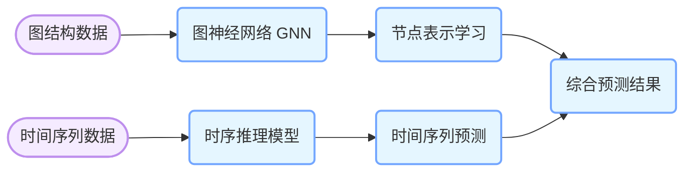

# 图神经网络在时序推理中的应用研究

> 关键词：图神经网络、时序推理、深度学习、图结构数据、时间序列分析

> 摘要：本文聚焦于图神经网络在时序推理中的应用。首先介绍了相关背景知识，包括研究目的、预期读者、文档结构和术语表。接着阐述了图神经网络和时序推理的核心概念及联系，给出了相应的原理和架构示意图与流程图。详细讲解了核心算法原理，并使用Python代码进行具体操作步骤的说明。探讨了相关数学模型和公式，并举例说明。通过项目实战展示了代码的实际案例及详细解释。分析了图神经网络在时序推理中的实际应用场景。推荐了相关的学习资源、开发工具框架和论文著作。最后总结了未来发展趋势与挑战，提供了常见问题解答和扩展阅读参考资料。旨在为研究和应用图神经网络进行时序推理的人员提供全面而深入的指导。

## 1. 背景介绍 
### 1.1 目的和范围
本研究的目的在于深入探索图神经网络在时序推理领域的应用潜力和实际效果。随着数据量的不断增长和数据结构的日益复杂，传统的时序分析方法在处理具有复杂关联的图结构数据时面临诸多挑战。图神经网络作为一种强大的深度学习模型，能够有效捕捉图结构数据中的节点和边的信息，将其应用于时序推理可以为解决复杂时序问题提供新的思路和方法。

本研究的范围涵盖了图神经网络的基本原理、时序推理的相关概念、图神经网络在时序推理中的核心算法、数学模型，以及通过实际项目案例展示其应用过程。同时，还将探讨图神经网络在不同实际场景中的应用，并推荐相关的学习资源、开发工具和研究论文。

### 1.2 预期读者
本文预期读者包括对深度学习、图神经网络和时序分析感兴趣的研究人员、工程师和学生。对于希望了解如何将图神经网络应用于时序推理问题的初学者，本文将提供基础的理论知识和实践指导；对于有一定经验的专业人士，本文将深入探讨相关算法原理和实际应用案例，为他们的研究和开发工作提供参考。

### 1.3 文档结构概述
本文将按照以下结构进行组织：
- 核心概念与联系：介绍图神经网络和时序推理的基本概念，以及它们之间的联系，并通过示意图和流程图进行直观展示。
- 核心算法原理 & 具体操作步骤：详细讲解图神经网络在时序推理中的核心算法原理，并使用Python代码实现具体操作步骤。
- 数学模型和公式 & 详细讲解 & 举例说明：给出相关的数学模型和公式，并进行详细讲解和举例说明。
- 项目实战：通过实际项目案例，展示图神经网络在时序推理中的代码实现和详细解释。
- 实际应用场景：分析图神经网络在不同实际场景中的应用。
- 工具和资源推荐：推荐相关的学习资源、开发工具框架和研究论文。
- 总结：总结图神经网络在时序推理中的未来发展趋势与挑战。
- 附录：提供常见问题与解答。
- 扩展阅读 & 参考资料：列出相关的扩展阅读资料和参考文献。

### 1.4 术语表
#### 1.4.1 核心术语定义
- **图神经网络（Graph Neural Network, GNN）**：是一种专门用于处理图结构数据的深度学习模型，它通过节点和边的信息传播和聚合来学习图的表示。
- **时序推理（Temporal Reasoning）**：是指根据时间序列数据进行推理和预测的过程，通常涉及到对数据的时间依赖性和动态变化的建模。
- **时间序列（Time Series）**：是指按照时间顺序排列的一组数据点，每个数据点通常包含一个时间戳和相应的观测值。
- **图结构数据（Graph-structured Data）**：是指由节点和边组成的数据结构，节点表示实体，边表示实体之间的关系。

#### 1.4.2 相关概念解释
- **消息传递机制（Message Passing Mechanism）**：是图神经网络中常用的一种信息传播方式，通过节点之间的消息传递和聚合来更新节点的表示。
- **注意力机制（Attention Mechanism）**：是一种用于自动分配权重的机制，在图神经网络中可以用于捕捉节点之间的重要性和相关性。
- **循环神经网络（Recurrent Neural Network, RNN）**：是一种用于处理序列数据的神经网络，它可以通过循环结构来捕捉序列数据的时间依赖性。

#### 1.4.3 缩略词列表
- **GNN**：Graph Neural Network
- **RNN**：Recurrent Neural Network
- **LSTM**：Long Short-Term Memory
- **GRU**：Gated Recurrent Unit

## 2. 核心概念与联系 
### 图神经网络的基本概念
图神经网络是一种专门用于处理图结构数据的深度学习模型。图可以表示为 $G=(V, E)$，其中 $V$ 是节点的集合，$E$ 是边的集合。每个节点 $v_i \in V$ 可以有自己的特征向量 $x_i$，边 $(v_i, v_j) \in E$ 可以表示节点之间的关系。

图神经网络的核心思想是通过节点之间的信息传播和聚合来学习节点的表示。常见的图神经网络包括图卷积网络（Graph Convolutional Network, GCN）、图注意力网络（Graph Attention Network, GAT）等。

### 时序推理的基本概念
时序推理是指根据时间序列数据进行推理和预测的过程。时间序列数据通常具有时间依赖性，即当前时刻的数据与过去时刻的数据相关。时序推理的目标是通过对时间序列数据的建模，预测未来时刻的数据或推断数据中的隐藏模式。

常见的时序推理方法包括自回归模型（Autoregressive Model, AR）、移动平均模型（Moving Average Model, MA）、自回归移动平均模型（Autoregressive Moving Average Model, ARMA）等。随着深度学习的发展，循环神经网络（RNN）及其变体如长短期记忆网络（LSTM）和门控循环单元（GRU）也被广泛应用于时序推理。

### 图神经网络与时序推理的联系
在许多实际应用中，数据不仅具有时间序列的特征，还具有图结构的特征。例如，在交通流量预测中，不同路段的交通流量构成时间序列数据，而路段之间的连接关系构成图结构数据。图神经网络可以用于捕捉图结构数据中的节点和边的信息，而时序推理方法可以用于处理时间序列数据的时间依赖性。

将图神经网络应用于时序推理可以充分利用图结构数据和时间序列数据的信息，提高时序推理的准确性和性能。例如，可以使用图神经网络学习图中节点的表示，然后将这些表示输入到时序推理模型中进行时间序列的预测。

### 核心概念原理和架构的文本示意图
```plaintext
+------------------+           +------------------+
|   图结构数据     |           |   时间序列数据   |
+------------------+           +------------------+
        |                            |
        v                            v
+------------------+           +------------------+
|  图神经网络 (GNN) |           |  时序推理模型   |
+------------------+           +------------------+
        |                            |
        v                            v
+------------------+           +------------------+
|  节点表示学习     |           |  时间序列预测   |
+------------------+           +------------------+
        |                            |
        v                            v
+------------------+
|  综合预测结果     |
+------------------+
```

### Mermaid 流程图


## 3. 核心算法原理 & 具体操作步骤 
### 图卷积网络（GCN）原理
图卷积网络（GCN）是一种常见的图神经网络，它通过对节点的邻居信息进行聚合来更新节点的表示。假设图 $G=(V, E)$ 有 $N$ 个节点，节点 $i$ 的特征向量为 $x_i$，图的邻接矩阵为 $A$，度矩阵为 $D$。

GCN 的一层传播可以表示为：
$$H^{(l+1)} = \sigma(\tilde{D}^{-\frac{1}{2}}\tilde{A}\tilde{D}^{-\frac{1}{2}}H^{(l)}W^{(l)})$$
其中，$H^{(l)}$ 是第 $l$ 层的节点特征矩阵，$W^{(l)}$ 是第 $l$ 层的可学习权重矩阵，$\tilde{A} = A + I$ 是添加自环后的邻接矩阵，$\tilde{D}$ 是 $\tilde{A}$ 的度矩阵，$\sigma$ 是激活函数。

### 基于 GCN 的时序推理算法原理
在基于 GCN 的时序推理中，我们可以将图结构数据和时间序列数据结合起来。具体步骤如下：
1. **图嵌入阶段**：使用 GCN 学习图中节点的静态表示。
2. **时序建模阶段**：将节点的静态表示输入到时序推理模型（如 LSTM 或 GRU）中，处理时间序列数据的时间依赖性。
3. **预测阶段**：根据时序推理模型的输出进行时间序列的预测。

### Python 代码实现具体操作步骤
```python
import torch
import torch.nn as nn
import torch.nn.functional as F

# 定义 GCN 层
class GCNLayer(nn.Module):
    def __init__(self, in_features, out_features):
        super(GCNLayer, self).__init__()
        self.weight = nn.Parameter(torch.FloatTensor(in_features, out_features))
        nn.init.xavier_uniform_(self.weight)

    def forward(self, x, adj):
        support = torch.mm(x, self.weight)
        output = torch.spmm(adj, support)
        return output

# 定义基于 GCN 的时序推理模型
class GCN_Temporal(nn.Module):
    def __init__(self, in_features, hidden_features, out_features, seq_len):
        super(GCN_Temporal, self).__init__()
        self.gcn = GCNLayer(in_features, hidden_features)
        self.lstm = nn.LSTM(hidden_features, hidden_features, batch_first=True)
        self.fc = nn.Linear(hidden_features * seq_len, out_features)

    def forward(self, x, adj):
        # 图嵌入阶段
        gcn_output = F.relu(self.gcn(x, adj))
        # 调整维度以适应 LSTM 输入
        gcn_output = gcn_output.unsqueeze(0)  # 添加 batch 维度
        # 时序建模阶段
        lstm_output, _ = self.lstm(gcn_output)
        lstm_output = lstm_output.view(lstm_output.size(0), -1)
        # 预测阶段
        output = self.fc(lstm_output)
        return output

# 示例使用
in_features = 10
hidden_features = 20
out_features = 1
seq_len = 5
num_nodes = 100

# 随机生成输入数据
x = torch.randn(num_nodes, in_features)
adj = torch.eye(num_nodes)  # 简单示例，使用单位矩阵作为邻接矩阵

model = GCN_Temporal(in_features, hidden_features, out_features, seq_len)
output = model(x, adj)
print(output)
```

### 代码解释
1. **GCNLayer 类**：定义了一个 GCN 层，包含一个可学习的权重矩阵 `weight`。在 `forward` 方法中，首先计算节点特征与权重矩阵的乘积，然后使用稀疏矩阵乘法计算邻接矩阵与特征矩阵的乘积。
2. **GCN_Temporal 类**：定义了基于 GCN 的时序推理模型。包含一个 GCN 层、一个 LSTM 层和一个全连接层。在 `forward` 方法中，首先通过 GCN 层进行图嵌入，然后将 GCN 输出输入到 LSTM 层进行时序建模，最后通过全连接层进行预测。
3. **示例使用**：随机生成输入数据 `x` 和邻接矩阵 `adj`，创建模型实例并进行前向传播，输出预测结果。

## 4. 数学模型和公式 & 详细讲解 & 举例说明 
### 图卷积网络（GCN）的数学模型
在第 3 节中已经介绍了 GCN 的一层传播公式：
$$H^{(l+1)} = \sigma(\tilde{D}^{-\frac{1}{2}}\tilde{A}\tilde{D}^{-\frac{1}{2}}H^{(l)}W^{(l)})$$

下面详细讲解这个公式的各个部分：
- $\tilde{A} = A + I$：添加自环后的邻接矩阵，其中 $A$ 是原始邻接矩阵，$I$ 是单位矩阵。添加自环的目的是让节点在信息传播过程中考虑自身的信息。
- $\tilde{D}$：$\tilde{A}$ 的度矩阵，是一个对角矩阵，对角元素 $\tilde{D}_{ii}$ 表示节点 $i$ 的度（包括自环）。
- $\tilde{D}^{-\frac{1}{2}}$：$\tilde{D}$ 的逆平方根矩阵。对邻接矩阵进行归一化处理，使得不同度的节点在信息传播过程中具有相同的重要性。
- $H^{(l)}$：第 $l$ 层的节点特征矩阵，形状为 $(N, F^{(l)})$，其中 $N$ 是节点数量，$F^{(l)}$ 是第 $l$ 层的特征维度。
- $W^{(l)}$：第 $l$ 层的可学习权重矩阵，形状为 $(F^{(l)}, F^{(l+1)})$，用于将第 $l$ 层的特征映射到第 $l+1$ 层的特征。
- $\sigma$：激活函数，如 ReLU 函数，用于引入非线性。

### 基于 GCN 的时序推理的数学模型
假设我们有一个时间序列的图结构数据，每个时间步 $t$ 的图表示为 $G_t=(V, E_t)$，节点特征矩阵为 $X_t$，邻接矩阵为 $A_t$。

#### 图嵌入阶段
在每个时间步 $t$，使用 GCN 学习节点的静态表示 $H_t$：
$$H_t^{(l+1)} = \sigma(\tilde{D}_t^{-\frac{1}{2}}\tilde{A}_t\tilde{D}_t^{-\frac{1}{2}}H_t^{(l)}W^{(l)})$$
其中，$\tilde{A}_t = A_t + I$，$\tilde{D}_t$ 是 $\tilde{A}_t$ 的度矩阵。

#### 时序建模阶段
将每个时间步的节点表示 $H_t$ 输入到时序推理模型（如 LSTM）中。假设 LSTM 的输入序列为 $[H_1, H_2, \cdots, H_T]$，LSTM 的输出序列为 $[O_1, O_2, \cdots, O_T]$。

#### 预测阶段
最后，使用全连接层对 LSTM 的输出进行预测。假设 $O_T$ 是 LSTM 在最后一个时间步的输出，预测结果 $\hat{y}$ 可以表示为：
$$\hat{y} = f(O_T W_{out} + b_{out})$$
其中，$W_{out}$ 是全连接层的权重矩阵，$b_{out}$ 是偏置项，$f$ 是激活函数（如线性函数）。

### 举例说明
假设我们有一个简单的图，包含 3 个节点，节点特征维度为 2，邻接矩阵为：
$$A = \begin{bmatrix}
0 & 1 & 1 \\
1 & 0 & 1 \\
1 & 1 & 0
\end{bmatrix}$$
节点特征矩阵为：
$$X = \begin{bmatrix}
1 & 2 \\
3 & 4 \\
5 & 6
\end{bmatrix}$$

添加自环后的邻接矩阵为：
$$\tilde{A} = A + I = \begin{bmatrix}
1 & 1 & 1 \\
1 & 1 & 1 \\
1 & 1 & 1
\end{bmatrix}$$
度矩阵为：
$$\tilde{D} = \begin{bmatrix}
3 & 0 & 0 \\
0 & 3 & 0 \\
0 & 0 & 3
\end{bmatrix}$$
逆平方根矩阵为：
$$\tilde{D}^{-\frac{1}{2}} = \begin{bmatrix}
\frac{1}{\sqrt{3}} & 0 & 0 \\
0 & \frac{1}{\sqrt{3}} & 0 \\
0 & 0 & \frac{1}{\sqrt{3}}
\end{bmatrix}$$

假设 GCN 的权重矩阵为：
$$W = \begin{bmatrix}
0.1 & 0.2 \\
0.3 & 0.4
\end{bmatrix}$$

则 GCN 的一层传播计算如下：
$$\tilde{D}^{-\frac{1}{2}}\tilde{A}\tilde{D}^{-\frac{1}{2}} = \begin{bmatrix}
\frac{1}{3} & \frac{1}{3} & \frac{1}{3} \\
\frac{1}{3} & \frac{1}{3} & \frac{1}{3} \\
\frac{1}{3} & \frac{1}{3} & \frac{1}{3}
\end{bmatrix}$$
$$\tilde{D}^{-\frac{1}{2}}\tilde{A}\tilde{D}^{-\frac{1}{2}}X = \begin{bmatrix}
3 & 4 \\
3 & 4 \\
3 & 4
\end{bmatrix}$$
$$\tilde{D}^{-\frac{1}{2}}\tilde{A}\tilde{D}^{-\frac{1}{2}}XW = \begin{bmatrix}
0.9 & 1.4 \\
0.9 & 1.4 \\
0.9 & 1.4
\end{bmatrix}$$

假设激活函数为 ReLU 函数，则：
$$H^{(1)} = \sigma(\tilde{D}^{-\frac{1}{2}}\tilde{A}\tilde{D}^{-\frac{1}{2}}XW) = \begin{bmatrix}
0.9 & 1.4 \\
0.9 & 1.4 \\
0.9 & 1.4
\end{bmatrix}$$

## 5. 项目实战：代码实际案例和详细解释说明 
### 5.1  开发环境搭建
#### 安装 Python
首先，确保你已经安装了 Python 环境。推荐使用 Python 3.7 及以上版本。你可以从 Python 官方网站（https://www.python.org/downloads/）下载并安装 Python。

#### 安装 PyTorch
PyTorch 是一个流行的深度学习框架，我们将使用它来实现图神经网络和时序推理模型。可以根据你的 CUDA 版本和操作系统选择合适的安装命令，在命令行中运行以下命令安装 PyTorch：
```bash
pip install torch torchvision
```

#### 安装其他依赖库
还需要安装一些其他的依赖库，如 `numpy`、`scipy` 等。可以使用以下命令安装：
```bash
pip install numpy scipy
```

### 5.2  源代码详细实现和代码解读
#### 数据集准备
假设我们使用一个简单的交通流量数据集，该数据集包含多个路段在不同时间步的交通流量信息，同时路段之间的连接关系构成图结构。

```python
import numpy as np

# 生成示例数据集
num_nodes = 10  # 节点数量
seq_len = 20  # 时间序列长度
in_features = 1  # 节点特征维度

# 随机生成节点特征矩阵
X = np.random.randn(num_nodes, in_features)

# 随机生成邻接矩阵
A = np.random.randint(0, 2, size=(num_nodes, num_nodes))
np.fill_diagonal(A, 0)  # 对角线元素置为 0

# 生成时间序列数据
time_series = np.random.randn(seq_len, num_nodes, in_features)
```

#### 定义模型
```python
import torch
import torch.nn as nn
import torch.nn.functional as F

# 定义 GCN 层
class GCNLayer(nn.Module):
    def __init__(self, in_features, out_features):
        super(GCNLayer, self).__init__()
        self.weight = nn.Parameter(torch.FloatTensor(in_features, out_features))
        nn.init.xavier_uniform_(self.weight)

    def forward(self, x, adj):
        support = torch.mm(x, self.weight)
        output = torch.spmm(adj, support)
        return output

# 定义基于 GCN 的时序推理模型
class GCN_Temporal(nn.Module):
    def __init__(self, in_features, hidden_features, out_features, seq_len):
        super(GCN_Temporal, self).__init__()
        self.gcn = GCNLayer(in_features, hidden_features)
        self.lstm = nn.LSTM(hidden_features, hidden_features, batch_first=True)
        self.fc = nn.Linear(hidden_features * seq_len, out_features)

    def forward(self, x, adj):
        # 图嵌入阶段
        gcn_output = F.relu(self.gcn(x, adj))
        # 调整维度以适应 LSTM 输入
        gcn_output = gcn_output.unsqueeze(0)  # 添加 batch 维度
        # 时序建模阶段
        lstm_output, _ = self.lstm(gcn_output)
        lstm_output = lstm_output.view(lstm_output.size(0), -1)
        # 预测阶段
        output = self.fc(lstm_output)
        return output
```

#### 训练模型
```python
# 转换为 PyTorch 张量
X = torch.FloatTensor(X)
A = torch.FloatTensor(A)
time_series = torch.FloatTensor(time_series)

# 初始化模型
in_features = 1
hidden_features = 10
out_features = 1
seq_len = 20
model = GCN_Temporal(in_features, hidden_features, out_features, seq_len)

# 定义损失函数和优化器
criterion = nn.MSELoss()
optimizer = torch.optim.Adam(model.parameters(), lr=0.01)

# 训练模型
num_epochs = 100
for epoch in range(num_epochs):
    optimizer.zero_grad()
    output = model(X, A)
    loss = criterion(output, torch.mean(time_series))
    loss.backward()
    optimizer.step()
    if (epoch + 1) % 10 == 0:
        print(f'Epoch [{epoch+1}/{num_epochs}], Loss: {loss.item():.4f}')
```

### 5.3  代码解读与分析
#### 数据集准备
- `X`：节点特征矩阵，形状为 `(num_nodes, in_features)`。
- `A`：邻接矩阵，形状为 `(num_nodes, num_nodes)`。
- `time_series`：时间序列数据，形状为 `(seq_len, num_nodes, in_features)`。

#### 模型定义
- `GCNLayer` 类：定义了一个 GCN 层，用于学习节点的静态表示。
- `GCN_Temporal` 类：定义了基于 GCN 的时序推理模型，包含 GCN 层、LSTM 层和全连接层。

#### 训练模型
- `criterion`：使用均方误差损失函数（MSE）来衡量预测结果与真实值之间的误差。
- `optimizer`：使用 Adam 优化器来更新模型的参数。
- 在每个训练 epoch 中，首先将梯度清零，然后进行前向传播计算预测结果，计算损失值，进行反向传播更新参数。

## 6. 实际应用场景 
### 交通流量预测
在交通系统中，不同路段的交通流量构成时间序列数据，而路段之间的连接关系构成图结构数据。图神经网络可以用于捕捉路段之间的空间依赖关系，时序推理模型可以用于处理交通流量的时间依赖性。通过将图神经网络和时序推理模型相结合，可以更准确地预测交通流量，为交通管理和规划提供决策支持。

### 电力负荷预测
电力系统中的各个节点（如发电厂、变电站等）的电力负荷数据构成时间序列，节点之间的电气连接关系构成图结构。图神经网络可以学习节点之间的电气耦合关系，时序推理模型可以预测电力负荷的变化趋势。这有助于电力系统的调度和优化，提高电力供应的可靠性和经济性。

### 社交网络分析
社交网络中的用户构成节点，用户之间的关系（如好友关系、关注关系等）构成图结构。用户的行为数据（如发布动态的时间、频率等）构成时间序列。通过图神经网络和时序推理，可以分析用户的行为模式和社交影响力的变化，为社交平台的推荐系统和广告投放提供依据。

### 医疗健康监测
在医疗领域，患者的生理指标（如心率、血压等）构成时间序列数据，患者之间的关系（如同病房、同疾病等）构成图结构。图神经网络可以捕捉患者之间的相似性和相互影响，时序推理模型可以预测患者的病情发展。这有助于医生及时采取治疗措施，提高医疗质量。

## 7. 工具和资源推荐
### 7.1 学习资源推荐
#### 7.1.1 书籍推荐
- 《深度学习》（Deep Learning）：由 Ian Goodfellow、Yoshua Bengio 和 Aaron Courville 所著，是深度学习领域的经典教材，涵盖了神经网络的基本原理、训练方法和应用等方面的内容。
- 《图神经网络：基础、前沿与应用》：全面介绍了图神经网络的基本概念、算法和应用，对于深入学习图神经网络在时序推理中的应用有很大帮助。

#### 7.1.2 在线课程
- Coursera 上的 “Deep Learning Specialization”：由 Andrew Ng 教授授课，是深度学习领域的经典在线课程，包含了神经网络的基础、卷积神经网络、循环神经网络等内容。
- edX 上的 “Graph Neural Networks for Machine Learning”：专门介绍图神经网络的原理和应用，对于学习图神经网络在时序推理中的应用有很大的参考价值。

#### 7.1.3 技术博客和网站
- Medium 上的 Towards Data Science：是一个数据科学和机器学习领域的技术博客平台，有很多关于图神经网络和时序推理的优秀文章。
- arXiv.org：是一个预印本论文平台，及时发布了很多关于图神经网络和时序推理的最新研究成果。

### 7.2 开发工具框架推荐
#### 7.2.1 IDE和编辑器
- PyCharm：是一款专业的 Python 集成开发环境，提供了丰富的代码编辑、调试和项目管理功能，适合开发图神经网络和时序推理模型。
- Jupyter Notebook：是一个交互式的开发环境，可以方便地进行代码编写、数据可视化和结果展示，非常适合进行模型的实验和调试。

#### 7.2.2 调试和性能分析工具
- TensorBoard：是 TensorFlow 提供的可视化工具，可以用于监控模型的训练过程、可视化模型的结构和性能指标等。
- PyTorch Profiler：是 PyTorch 提供的性能分析工具，可以帮助分析模型的运行时间、内存使用等情况，优化模型的性能。

#### 7.2.3 相关框架和库
- PyTorch Geometric：是一个基于 PyTorch 的图神经网络库，提供了丰富的图神经网络模型和数据集，方便进行图神经网络的开发和实验。
- DGL（Deep Graph Library）：是一个用于图神经网络的深度学习框架，支持多种深度学习后端（如 PyTorch、TensorFlow 等），具有高效的图计算能力。

### 7.3 相关论文著作推荐
#### 7.3.1 经典论文
- “Semi-Supervised Classification with Graph Convolutional Networks”：提出了图卷积网络（GCN）的概念，是图神经网络领域的经典论文。
- “Long Short-Term Memory”：介绍了长短期记忆网络（LSTM）的原理和应用，是时序推理领域的经典论文。

#### 7.3.2 最新研究成果
- 关注 arXiv.org 上的最新论文，了解图神经网络在时序推理中的最新研究进展。
- 参加相关的学术会议（如 NeurIPS、ICML 等），获取最新的研究成果和技术动态。

#### 7.3.3 应用案例分析
- 阅读相关的行业报告和研究论文，了解图神经网络在交通流量预测、电力负荷预测等实际应用场景中的案例分析和经验总结。

## 8. 总结：未来发展趋势与挑战
### 未来发展趋势
#### 模型融合与创新
未来，图神经网络和时序推理模型可能会与其他深度学习模型（如生成对抗网络、强化学习等）进行融合，创造出更强大的模型架构，以解决更复杂的实际问题。

#### 可解释性研究
随着图神经网络在时序推理中的应用越来越广泛，模型的可解释性变得越来越重要。未来的研究将更加关注如何解释图神经网络和时序推理模型的决策过程，提高模型的可信度和可解释性。

#### 大规模应用
随着计算能力的不断提升和数据量的不断增长，图神经网络在时序推理中的应用将向大规模场景拓展，如智慧城市、工业互联网等领域。

### 挑战
#### 数据质量和可获取性
图结构数据和时间序列数据的质量和可获取性是影响图神经网络在时序推理中应用效果的重要因素。在实际应用中，数据可能存在噪声、缺失值等问题，需要进行有效的数据预处理和清洗。

#### 计算资源需求
图神经网络和时序推理模型通常需要大量的计算资源来进行训练和推理。在大规模应用场景中，如何高效地利用计算资源，降低计算成本，是一个亟待解决的问题。

#### 模型评估和比较
由于图神经网络和时序推理模型的多样性，如何选择合适的模型和评估指标进行模型评估和比较是一个挑战。需要建立统一的评估标准和方法，以准确评估模型的性能。

## 9. 附录：常见问题与解答
### 图神经网络和传统神经网络有什么区别？
传统神经网络（如多层感知机、卷积神经网络等）通常处理的是结构化数据（如图像、文本等），而图神经网络专门用于处理图结构数据。图神经网络通过节点和边的信息传播和聚合来学习图的表示，能够捕捉图中节点之间的复杂关系。

### 如何选择合适的图神经网络模型？
选择合适的图神经网络模型需要考虑数据的特点、问题的复杂度和计算资源等因素。如果数据具有较强的局部结构，可以选择图卷积网络（GCN）；如果需要考虑节点之间的重要性和相关性，可以选择图注意力网络（GAT）。

### 图神经网络在时序推理中的训练时间通常有多长？
图神经网络在时序推理中的训练时间取决于多个因素，如模型的复杂度、数据的规模、计算资源等。一般来说，训练时间可能从几分钟到数小时甚至数天不等。可以通过优化模型结构、使用更高效的计算资源等方法来缩短训练时间。

### 如何处理图结构数据中的缺失值和噪声？
处理图结构数据中的缺失值和噪声可以采用以下方法：
- 缺失值处理：可以使用插值法（如线性插值、多项式插值等）填充缺失值，或者使用基于模型的方法（如自编码器）进行缺失值预测。
- 噪声处理：可以使用滤波方法（如高斯滤波、中值滤波等）去除噪声，或者使用鲁棒性较强的模型（如鲁棒图神经网络）来处理噪声数据。

## 10. 扩展阅读 & 参考资料
### 扩展阅读
- 阅读相关的学术期刊和会议论文，深入了解图神经网络和时序推理的最新研究进展。
- 参与相关的技术社区和论坛，与其他研究人员和开发者交流经验和心得。

### 参考资料
- Goodfellow, I., Bengio, Y., & Courville, A. (2016). Deep Learning. MIT Press.
- Kipf, T. N., & Welling, M. (2016). Semi-Supervised Classification with Graph Convolutional Networks. arXiv preprint arXiv:1609.02907.
- Hochreiter, S., & Schmidhuber, J. (1997). Long Short-Term Memory. Neural Computation, 9(8), 1735-1780.

作者：AI天才研究院/AI Genius Institute & 禅与计算机程序设计艺术 /Zen And The Art of Computer Programming