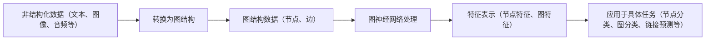

# 图神经网络在非结构化数据分析中的应用

> 关键词：图神经网络、非结构化数据、数据分析、图结构、深度学习

> 摘要：本文围绕图神经网络在非结构化数据分析中的应用展开深入探讨。首先介绍了研究的背景、目的、预期读者以及文档结构等内容，接着阐述了图神经网络和非结构化数据的核心概念及其联系。详细讲解了图神经网络的核心算法原理，并给出Python代码示例。通过数学模型和公式进一步剖析其工作机制，结合实际案例展示了图神经网络在非结构化数据分析中的具体应用。同时，介绍了相关的工具和资源，最后对图神经网络在非结构化数据分析领域的未来发展趋势与挑战进行总结，还提供了常见问题解答和扩展阅读参考资料，旨在为读者全面了解和应用图神经网络处理非结构化数据提供有价值的指导。

## 1. 背景介绍 
### 1.1 目的和范围
在当今数字化时代，数据呈现出爆炸式增长的态势，其中非结构化数据占据了相当大的比例，如文本、图像、音频、社交网络数据等。非结构化数据由于缺乏明确的结构和组织，传统的数据处理和分析方法往往难以充分挖掘其潜在价值。图神经网络（Graph Neural Networks，GNN）作为一种新兴的深度学习技术，能够有效地处理图结构数据，为非结构化数据分析提供了新的思路和方法。

本文的目的在于深入探讨图神经网络在非结构化数据分析中的应用，详细介绍图神经网络的原理、算法和实际应用案例，帮助读者了解如何利用图神经网络挖掘非结构化数据中的有价值信息。文章的范围涵盖了图神经网络的基本概念、核心算法、数学模型、实际应用场景以及相关的工具和资源等方面。

### 1.2 预期读者
本文的预期读者主要包括以下几类人群：
- 数据科学家和分析师：希望了解如何运用图神经网络处理非结构化数据，以提升数据分析的效率和准确性。
- 机器学习和深度学习研究者：对图神经网络的原理和应用感兴趣，希望深入研究其在非结构化数据分析中的潜力。
- 软件开发人员：有意将图神经网络技术应用到实际项目中，处理非结构化数据相关的任务。
- 高校相关专业的学生：学习图神经网络和非结构化数据分析的基础知识和应用案例，为进一步的研究和实践打下基础。

### 1.3 文档结构概述
本文的文档结构如下：
- 核心概念与联系：介绍图神经网络和非结构化数据的核心概念，以及它们之间的联系，通过文本示意图和Mermaid流程图进行直观展示。
- 核心算法原理 & 具体操作步骤：详细讲解图神经网络的核心算法原理，并给出Python源代码进行阐述。
- 数学模型和公式 & 详细讲解 & 举例说明：通过数学模型和公式深入剖析图神经网络的工作机制，并结合具体例子进行说明。
- 项目实战：代码实际案例和详细解释说明：展示图神经网络在非结构化数据分析中的实际应用案例，包括开发环境搭建、源代码实现和代码解读。
- 实际应用场景：介绍图神经网络在非结构化数据分析中的常见应用场景。
- 工具和资源推荐：推荐相关的学习资源、开发工具框架和论文著作。
- 总结：未来发展趋势与挑战：对图神经网络在非结构化数据分析领域的未来发展趋势和面临的挑战进行总结。
- 附录：常见问题与解答：提供常见问题的解答，帮助读者解决在学习和应用过程中遇到的问题。
- 扩展阅读 & 参考资料：提供相关的扩展阅读资料和参考文献，方便读者进一步深入学习。

### 1.4 术语表
#### 1.4.1 核心术语定义
- **图神经网络（Graph Neural Networks，GNN）**：是一类专门用于处理图结构数据的神经网络，它能够通过节点之间的连接关系学习节点和图的特征表示。
- **非结构化数据**：是指没有固定结构和组织的数据，如文本、图像、音频、视频等，难以用传统的关系型数据库进行存储和处理。
- **图（Graph）**：由节点（Vertex）和边（Edge）组成的一种数据结构，用于表示对象之间的关系。
- **节点特征（Node Feature）**：每个节点所具有的属性信息，如文本的词向量、图像的像素特征等。
- **邻接矩阵（Adjacency Matrix）**：用于表示图中节点之间连接关系的矩阵，矩阵中的元素表示两个节点之间是否存在边。

#### 1.4.2 相关概念解释
- **消息传递机制（Message Passing Mechanism）**：图神经网络中常用的一种信息传播机制，节点通过与邻居节点交换信息来更新自身的特征表示。
- **图卷积（Graph Convolution）**：是图神经网络中的一种核心操作，类似于传统卷积神经网络中的卷积操作，用于提取图结构数据的特征。
- **图嵌入（Graph Embedding）**：将图中的节点或整个图映射到低维向量空间的过程，以便于后续的分析和处理。

#### 1.4.3 缩略词列表
- **GNN**：Graph Neural Networks（图神经网络）
- **GCN**：Graph Convolutional Network（图卷积网络）
- **GAT**：Graph Attention Network（图注意力网络）
- **MSE**：Mean Squared Error（均方误差）

## 2. 核心概念与联系 
### 2.1 图神经网络的核心概念
图神经网络是一种专门用于处理图结构数据的深度学习模型。在图结构中，节点代表实体，边代表实体之间的关系。图神经网络的目标是通过节点之间的连接关系学习节点和图的特征表示，从而实现节点分类、图分类、链接预测等任务。

图神经网络的核心思想是消息传递机制。在每一层中，节点通过与邻居节点交换信息来更新自身的特征表示。具体来说，节点会收集邻居节点的特征信息，并将其聚合到自身的特征中，然后通过一个非线性变换得到更新后的特征。

### 2.2 非结构化数据的核心概念
非结构化数据是指没有固定结构和组织的数据，如文本、图像、音频、视频等。这些数据通常不能直接用传统的关系型数据库进行存储和处理，需要采用特殊的方法进行分析和挖掘。

非结构化数据具有以下特点：
- **数据量大**：非结构化数据的规模通常非常大，如社交媒体上的海量文本数据、互联网上的大量图像和视频数据等。
- **数据多样性**：非结构化数据的类型多样，包括文本、图像、音频、视频等，每种类型的数据具有不同的特点和处理方法。
- **数据缺乏结构**：非结构化数据没有明确的结构和组织，难以用传统的方法进行分析和处理。

### 2.3 图神经网络与非结构化数据的联系
非结构化数据虽然缺乏明确的结构，但其中往往蕴含着丰富的关系信息。可以将非结构化数据转换为图结构数据，从而利用图神经网络进行分析和处理。

例如，在文本数据中，可以将单词作为节点，单词之间的共现关系作为边，构建文本图；在图像数据中，可以将图像中的像素或超像素作为节点，像素之间的空间关系作为边，构建图像图。通过将非结构化数据转换为图结构数据，图神经网络可以更好地捕捉数据中的关系信息，从而提高数据分析的效果。

### 2.4 文本示意图
```plaintext
非结构化数据（文本、图像、音频等）
    |
    | 转换为图结构
    v
图结构数据（节点、边）
    |
    | 图神经网络处理
    v
特征表示（节点特征、图特征）
    |
    | 应用于具体任务
    v
节点分类、图分类、链接预测等
```

### 2.5 Mermaid流程图


## 3. 核心算法原理 & 具体操作步骤 
### 3.1 图卷积网络（GCN）原理
图卷积网络（Graph Convolutional Network，GCN）是一种常见的图神经网络模型。GCN的核心思想是通过图卷积操作来提取图结构数据的特征。

图卷积操作可以表示为：
$$
H^{(l+1)} = \sigma(\tilde{D}^{-\frac{1}{2}}\tilde{A}\tilde{D}^{-\frac{1}{2}}H^{(l)}W^{(l)})
$$
其中，$H^{(l)}$ 是第 $l$ 层的节点特征矩阵，$W^{(l)}$ 是第 $l$ 层的可学习权重矩阵，$\tilde{A} = A + I$ 是邻接矩阵 $A$ 加上自环后的矩阵，$\tilde{D}$ 是 $\tilde{A}$ 的度矩阵，$\sigma$ 是激活函数。

### 3.2 具体操作步骤
1. **数据预处理**：将非结构化数据转换为图结构数据，构建邻接矩阵 $A$ 和节点特征矩阵 $X$。
2. **初始化参数**：初始化可学习权重矩阵 $W^{(0)}, W^{(1)}, \cdots$。
3. **图卷积操作**：通过图卷积公式计算每一层的节点特征矩阵 $H^{(l+1)}$。
4. **非线性变换**：使用激活函数 $\sigma$ 对 $H^{(l+1)}$ 进行非线性变换。
5. **重复步骤3和4**：直到达到预设的层数。
6. **输出结果**：根据具体任务，使用最后一层的节点特征矩阵进行节点分类、图分类等任务。

### 3.3 Python源代码实现
```python
import torch
import torch.nn as nn
import torch.nn.functional as F

# 定义图卷积层
class GraphConvolution(nn.Module):
    def __init__(self, in_features, out_features):
        super(GraphConvolution, self).__init__()
        self.weight = nn.Parameter(torch.FloatTensor(in_features, out_features))
        self.reset_parameters()

    def reset_parameters(self):
        nn.init.xavier_uniform_(self.weight)

    def forward(self, input, adj):
        support = torch.mm(input, self.weight)
        output = torch.spmm(adj, support)
        return output

# 定义图卷积网络
class GCN(nn.Module):
    def __init__(self, nfeat, nhid, nclass):
        super(GCN, self).__init__()
        self.gc1 = GraphConvolution(nfeat, nhid)
        self.gc2 = GraphConvolution(nhid, nclass)

    def forward(self, x, adj):
        x = F.relu(self.gc1(x, adj))
        x = self.gc2(x, adj)
        return F.log_softmax(x, dim=1)
```

### 3.4 代码解释
- `GraphConvolution` 类实现了图卷积层的功能，包括权重初始化和前向传播。
- `GCN` 类定义了一个简单的两层图卷积网络，包含两个图卷积层和一个非线性激活函数。
- `forward` 方法定义了网络的前向传播过程，包括图卷积操作和非线性变换。

## 4. 数学模型和公式 & 详细讲解 & 举例说明 
### 4.1 图卷积公式详细讲解
图卷积公式 $H^{(l+1)} = \sigma(\tilde{D}^{-\frac{1}{2}}\tilde{A}\tilde{D}^{-\frac{1}{2}}H^{(l)}W^{(l)})$ 可以分解为以下几个步骤：

1. **邻接矩阵加上自环**：$\tilde{A} = A + I$，其中 $A$ 是邻接矩阵，$I$ 是单位矩阵。加上自环的目的是让节点在更新特征时考虑自身的信息。
2. **计算度矩阵**：$\tilde{D}$ 是 $\tilde{A}$ 的度矩阵，其对角元素表示每个节点的度（即与该节点相连的边的数量）。
3. **归一化操作**：$\tilde{D}^{-\frac{1}{2}}\tilde{A}\tilde{D}^{-\frac{1}{2}}$ 是对邻接矩阵进行归一化处理，目的是平衡不同节点的度对特征传播的影响。
4. **特征传播**：$\tilde{D}^{-\frac{1}{2}}\tilde{A}\tilde{D}^{-\frac{1}{2}}H^{(l)}$ 表示节点通过邻居节点的特征信息进行更新。
5. **线性变换**：$H^{(l)}W^{(l)}$ 是对节点特征进行线性变换，$W^{(l)}$ 是可学习的权重矩阵。
6. **非线性变换**：$\sigma$ 是激活函数，如ReLU、Sigmoid等，用于引入非线性因素。

### 4.2 举例说明
假设有一个简单的图，包含3个节点，其邻接矩阵 $A$ 和节点特征矩阵 $X$ 如下：
$$
A = \begin{bmatrix}
0 & 1 & 1 \\
1 & 0 & 1 \\
1 & 1 & 0
\end{bmatrix},
X = \begin{bmatrix}
1 & 0 \\
0 & 1 \\
1 & 1
\end{bmatrix}
$$

首先，计算 $\tilde{A} = A + I$：
$$
\tilde{A} = \begin{bmatrix}
1 & 1 & 1 \\
1 & 1 & 1 \\
1 & 1 & 1
\end{bmatrix}
$$

然后，计算 $\tilde{D}$：
$$
\tilde{D} = \begin{bmatrix}
3 & 0 & 0 \\
0 & 3 & 0 \\
0 & 0 & 3
\end{bmatrix}
$$

接着，计算 $\tilde{D}^{-\frac{1}{2}}$：
$$
\tilde{D}^{-\frac{1}{2}} = \begin{bmatrix}
\frac{1}{\sqrt{3}} & 0 & 0 \\
0 & \frac{1}{\sqrt{3}} & 0 \\
0 & 0 & \frac{1}{\sqrt{3}}
\end{bmatrix}
$$

再计算 $\tilde{D}^{-\frac{1}{2}}\tilde{A}\tilde{D}^{-\frac{1}{2}}$：
$$
\tilde{D}^{-\frac{1}{2}}\tilde{A}\tilde{D}^{-\frac{1}{2}} = \begin{bmatrix}
\frac{1}{3} & \frac{1}{3} & \frac{1}{3} \\
\frac{1}{3} & \frac{1}{3} & \frac{1}{3} \\
\frac{1}{3} & \frac{1}{3} & \frac{1}{3}
\end{bmatrix}
$$

假设 $W^{(0)}$ 是一个 $2 \times 2$ 的可学习权重矩阵：
$$
W^{(0)} = \begin{bmatrix}
0.1 & 0.2 \\
0.3 & 0.4
\end{bmatrix}
$$

则 $H^{(1)} = \sigma(\tilde{D}^{-\frac{1}{2}}\tilde{A}\tilde{D}^{-\frac{1}{2}}H^{(0)}W^{(0)})$ 为：
$$
H^{(0)}W^{(0)} = \begin{bmatrix}
1 & 0 \\
0 & 1 \\
1 & 1
\end{bmatrix}
\begin{bmatrix}
0.1 & 0.2 \\
0.3 & 0.4
\end{bmatrix}
= \begin{bmatrix}
0.1 & 0.2 \\
0.3 & 0.4 \\
0.4 & 0.6
\end{bmatrix}
$$

$$
\tilde{D}^{-\frac{1}{2}}\tilde{A}\tilde{D}^{-\frac{1}{2}}H^{(0)}W^{(0)} = \begin{bmatrix}
\frac{1}{3} & \frac{1}{3} & \frac{1}{3} \\
\frac{1}{3} & \frac{1}{3} & \frac{1}{3} \\
\frac{1}{3} & \frac{1}{3} & \frac{1}{3}
\end{bmatrix}
\begin{bmatrix}
0.1 & 0.2 \\
0.3 & 0.4 \\
0.4 & 0.6
\end{bmatrix}
= \begin{bmatrix}
\frac{0.8}{3} & \frac{1.2}{3} \\
\frac{0.8}{3} & \frac{1.2}{3} \\
\frac{0.8}{3} & \frac{1.2}{3}
\end{bmatrix}
$$

假设激活函数 $\sigma$ 为ReLU，则：
$$
H^{(1)} = \begin{bmatrix}
\frac{0.8}{3} & \frac{1.2}{3} \\
\frac{0.8}{3} & \frac{1.2}{3} \\
\frac{0.8}{3} & \frac{1.2}{3}
\end{bmatrix}
$$

### 4.3 图注意力网络（GAT）的数学模型
图注意力网络（Graph Attention Network，GAT）是另一种常见的图神经网络模型，它引入了注意力机制，能够自适应地分配不同邻居节点的权重。

GAT的注意力系数计算如下：
$$
e_{ij} = \text{LeakyReLU}(\vec{a}^T[\mathbf{W}\mathbf{h}_i || \mathbf{W}\mathbf{h}_j])
$$
其中，$\mathbf{h}_i$ 和 $\mathbf{h}_j$ 分别是节点 $i$ 和节点 $j$ 的特征向量，$\mathbf{W}$ 是可学习的权重矩阵，$\vec{a}$ 是注意力机制的可学习参数，$||$ 表示拼接操作。

然后，对注意力系数进行归一化处理：
$$
\alpha_{ij} = \frac{\exp(e_{ij})}{\sum_{k \in \mathcal{N}(i)} \exp(e_{ik})}
$$
其中，$\mathcal{N}(i)$ 是节点 $i$ 的邻居节点集合。

最后，节点 $i$ 的更新特征表示为：
$$
\mathbf{h}_i' = \sigma\left(\sum_{j \in \mathcal{N}(i)} \alpha_{ij} \mathbf{W}\mathbf{h}_j\right)
$$

## 5. 项目实战：代码实际案例和详细解释说明 
### 5.1  开发环境搭建
#### 5.1.1 安装Python
首先，需要安装Python环境。建议使用Python 3.7及以上版本，可以从Python官方网站（https://www.python.org/downloads/） 下载并安装。

#### 5.1.2 安装深度学习框架
本文使用PyTorch作为深度学习框架，可以通过以下命令安装：
```bash
pip install torch torchvision
```

#### 5.1.3 安装图神经网络库
可以使用DGL（Deep Graph Library）或PyTorch Geometric等图神经网络库，这里以PyTorch Geometric为例，安装命令如下：
```bash
pip install torch-geometric
```

### 5.2  源代码详细实现和代码解读
#### 5.2.1 数据加载和预处理
```python
import torch
from torch_geometric.datasets import Planetoid
import torch_geometric.transforms as T

# 加载数据集
dataset = Planetoid(root='data/Planetoid', name='Cora', transform=T.NormalizeFeatures())
data = dataset[0]

# 打印数据集信息
print(f'Dataset: {dataset}:')
print('======================')
print(f'Number of graphs: {len(dataset)}')
print(f'Number of features: {dataset.num_features}')
print(f'Number of classes: {dataset.num_classes}')

# 打印数据信息
print(f'Number of nodes: {data.num_nodes}')
print(f'Number of edges: {data.num_edges}')
print(f'Average node degree: {data.num_edges / data.num_nodes:.2f}')
print(f'Number of training nodes: {data.train_mask.sum()}')
print(f'Training node label rate: {int(data.train_mask.sum()) / data.num_nodes:.2f}')
print(f'Contains isolated nodes: {data.contains_isolated_nodes()}')
print(f'Contains self-loops: {data.contains_self_loops()}')
print(f'Is undirected: {data.is_undirected()}')
```
代码解读：
- 使用 `Planetoid` 数据集加载Cora数据集，该数据集是一个常用的节点分类数据集。
- 使用 `T.NormalizeFeatures()` 对节点特征进行归一化处理。
- 打印数据集和数据的相关信息，如节点数、边数、特征数、类别数等。

#### 5.2.2 定义图神经网络模型
```python
import torch.nn.functional as F
from torch_geometric.nn import GCNConv

class GCN(torch.nn.Module):
    def __init__(self, in_channels, hidden_channels, out_channels):
        super(GCN, self).__init__()
        self.conv1 = GCNConv(in_channels, hidden_channels)
        self.conv2 = GCNConv(hidden_channels, out_channels)

    def forward(self, x, edge_index):
        x = self.conv1(x, edge_index)
        x = F.relu(x)
        x = F.dropout(x, training=self.training)
        x = self.conv2(x, edge_index)
        return F.log_softmax(x, dim=1)
```
代码解读：
- 定义了一个简单的两层图卷积网络 `GCN`，包含两个 `GCNConv` 层和一个ReLU激活函数。
- `forward` 方法定义了网络的前向传播过程，包括图卷积操作、非线性变换和Dropout操作。

#### 5.2.3 模型训练和评估
```python
device = torch.device('cuda' if torch.cuda.is_available() else 'cpu')
model = GCN(dataset.num_node_features, 16, dataset.num_classes).to(device)
data = data.to(device)
optimizer = torch.optim.Adam(model.parameters(), lr=0.01, weight_decay=5e-4)

def train():
      model.train()
      optimizer.zero_grad()
      out = model(data.x, data.edge_index)
      loss = F.nll_loss(out[data.train_mask], data.y[data.train_mask])
      loss.backward()
      optimizer.step()
      return loss.item()

def test():
      model.eval()
      out = model(data.x, data.edge_index)
      pred = out.argmax(dim=1)
      test_correct = pred[data.test_mask] == data.y[data.test_mask]
      test_acc = int(test_correct.sum()) / int(data.test_mask.sum())
      return test_acc

for epoch in range(200):
    loss = train()
    if (epoch + 1) % 10 == 0:
        test_acc = test()
        print(f'Epoch: {epoch+1:03d}, Loss: {loss:.4f}, Test Acc: {test_acc:.4f}')
```
代码解读：
- 将模型和数据移动到GPU（如果可用）上进行训练。
- 使用Adam优化器进行模型训练，学习率为0.01，权重衰减为 $5 \times 10^{-4}$。
- `train` 函数定义了模型的训练过程，包括前向传播、损失计算、反向传播和参数更新。
- `test` 函数定义了模型的评估过程，计算测试集上的准确率。
- 训练200个epoch，每10个epoch打印一次损失和测试准确率。

### 5.3  代码解读与分析
通过上述代码，我们实现了一个简单的图卷积网络用于节点分类任务。在训练过程中，模型通过不断调整参数来最小化训练集上的损失，从而学习到节点的特征表示。在测试过程中，模型根据学习到的特征表示对测试集上的节点进行分类，并计算分类准确率。

从代码中可以看出，图神经网络的训练过程与传统的神经网络类似，主要包括数据加载、模型定义、优化器选择、训练和评估等步骤。不同之处在于，图神经网络需要处理图结构数据，使用图卷积操作来提取图结构数据的特征。

## 6. 实际应用场景 
### 6.1 社交网络分析
在社交网络中，用户可以看作是节点，用户之间的关系（如好友关系、关注关系等）可以看作是边。图神经网络可以用于社交网络分析，如用户分类、社区发现、链接预测等任务。

例如，通过图神经网络可以对用户进行分类，预测用户的兴趣爱好、消费习惯等；可以发现社交网络中的社区结构，了解用户之间的聚集情况；还可以预测用户之间是否会建立新的关系，为社交网络的推荐系统提供支持。

### 6.2 知识图谱推理
知识图谱是一种结构化的语义网络，由实体和实体之间的关系组成。图神经网络可以用于知识图谱推理，如实体分类、关系预测、知识补全 等任务。

例如，通过图神经网络可以对知识图谱中的实体进行分类，判断实体所属的类别；可以预测实体之间是否存在某种关系，补充知识图谱中缺失的关系；还可以进行知识推理，从已知的知识中推导出新的知识。

### 6.3 推荐系统
在推荐系统中，用户、物品和它们之间的交互关系可以构成一个图结构。图神经网络可以用于推荐系统，通过学习用户和物品的特征表示，为用户推荐个性化的物品。

例如，通过图神经网络可以捕捉用户和物品之间的复杂关系，考虑用户的历史行为、物品的属性以及用户之间的社交关系等因素，提高推荐的准确性和多样性。

### 6.4 图像和视频分析
在图像和视频分析中，可以将图像或视频中的像素、超像素或物体作为节点，它们之间的空间关系或语义关系作为边，构建图结构数据。图神经网络可以用于图像和视频分析，如图像分类、目标检测、动作识别等任务。

例如，通过图神经网络可以捕捉图像或视频中物体之间的关系，提高图像和视频分析的效果。在图像分类任务中，图神经网络可以考虑图像中物体的空间布局和相互关系，从而更准确地对图像进行分类。

### 6.5 生物信息学
在生物信息学中，蛋白质、基因和它们之间的相互作用可以构成一个图结构。图神经网络可以用于生物信息学，如蛋白质功能预测、药物发现、基因调控网络分析等任务。

例如，通过图神经网络可以学习蛋白质的结构和功能特征，预测蛋白质的功能；可以发现潜在的药物靶点，加速药物研发过程；还可以分析基因调控网络，了解基因之间的相互作用机制。

## 7. 工具和资源推荐
### 7.1 学习资源推荐
#### 7.1.1 书籍推荐
- 《深度学习》（Deep Learning）：由Ian Goodfellow、Yoshua Bengio和Aaron Courville所著，是深度学习领域的经典教材，涵盖了深度学习的基本概念、算法和应用。
- 《图神经网络：基础、前沿与应用》：全面介绍了图神经网络的基本原理、算法和应用，适合初学者和研究人员阅读。
- 《Python深度学习》（Deep Learning with Python）：由Francois Chollet所著，介绍了如何使用Python和Keras进行深度学习开发，包含了丰富的代码示例和实际案例。

#### 7.1.2 在线课程
- Coursera上的“深度学习专项课程”（Deep Learning Specialization）：由Andrew Ng教授授课，涵盖了深度学习的基础知识和应用，包括神经网络、卷积神经网络、循环神经网络等。
- edX上的“图神经网络”（Graph Neural Networks）：介绍了图神经网络的基本原理、算法和应用，适合对图神经网络感兴趣的学习者。
- B站（哔哩哔哩）上有很多关于图神经网络和深度学习的教学视频，如李沐的《动手学深度学习》系列课程，讲解详细，适合初学者。

#### 7.1.3 技术博客和网站
- Medium：是一个技术博客平台，有很多关于图神经网络和深度学习的优质文章，如Towards Data Science、The AI Summer等。
- arXiv：是一个预印本平台，提供了大量的学术论文，包括图神经网络领域的最新研究成果。
- 开源中国（OSChina）：是一个国内的开源技术社区，有很多关于图神经网络和深度学习的技术文章和项目分享。

### 7.2 开发工具框架推荐
#### 7.2.1 IDE和编辑器
- PyCharm：是一款专门用于Python开发的集成开发环境（IDE），具有代码编辑、调试、版本控制等功能，适合专业的Python开发者使用。
- Jupyter Notebook：是一个交互式的开发环境，支持Python、R等多种编程语言，适合数据科学家和研究人员进行数据分析和模型开发。
- Visual Studio Code：是一款轻量级的代码编辑器，支持多种编程语言和插件扩展，具有丰富的代码编辑和调试功能，适合初学者和开发者使用。

#### 7.2.2 调试和性能分析工具
- PyTorch Profiler：是PyTorch自带的性能分析工具，可以帮助开发者分析模型的性能瓶颈，优化模型的训练和推理速度。
- TensorBoard：是TensorFlow的可视化工具，也可以用于PyTorch模型的可视化，支持损失曲线、准确率曲线、模型结构等多种可视化功能。
- NVIDIA Nsight Systems：是NVIDIA提供的性能分析工具，可以对GPU加速的深度学习模型进行性能分析，帮助开发者优化GPU的使用效率。

#### 7.2.3 相关框架和库
- PyTorch Geometric：是一个基于PyTorch的图神经网络库，提供了丰富的图神经网络模型和数据集，方便开发者进行图神经网络的开发和研究。
- DGL（Deep Graph Library）：是一个开源的图神经网络库，支持多种深度学习框架，如PyTorch、TensorFlow等，具有高效的图计算和分布式训练功能。
- NetworkX：是一个用于创建、操作和研究复杂网络的Python库，提供了丰富的图算法和数据结构，适合进行图数据的处理和分析。

### 7.3 相关论文著作推荐
#### 7.3.1 经典论文
- “Semi-Supervised Classification with Graph Convolutional Networks”：提出了图卷积网络（GCN）的概念，是图神经网络领域的经典论文之一。
- “Graph Attention Networks”：提出了图注意力网络（GAT）的概念，引入了注意力机制，提高了图神经网络的性能。
- “Inductive Representation Learning on Large Graphs”：提出了GraphSAGE算法，用于大规模图的归纳式表示学习。

#### 7.3.2 最新研究成果
- “Deep Graph Infomax”：提出了一种基于互信息最大化的图神经网络训练方法，用于学习图的无监督表示。
- “Graph Neural Networks for Node Classification in Attributed Graphs: A Survey”：对属性图上的节点分类任务进行了综述，介绍了图神经网络在该任务中的应用和研究进展。
- “Self-Supervised Learning on Graphs: A Survey”：对图上的自监督学习方法进行了综述，介绍了自监督学习在图神经网络中的应用和研究进展。

#### 7.3.3 应用案例分析
- “Graph Neural Networks in Recommender Systems: A Survey”：对图神经网络在推荐系统中的应用进行了综述，介绍了图神经网络在推荐系统中的优势和挑战。
- “Graph Neural Networks for Biomedical Data Analysis: A Survey”：对图神经网络在生物医学数据分析中的应用进行了综述，介绍了图神经网络在蛋白质功能预测、药物发现等任务中的应用。
- “Graph Neural Networks for Social Network Analysis: A Survey”：对图神经网络在社交网络分析中的应用进行了综述，介绍了图神经网络在用户分类、社区发现等任务中的应用。

## 8. 总结：未来发展趋势与挑战
### 8.1 未来发展趋势
#### 8.1.1 模型创新
未来，图神经网络的模型结构将不断创新。研究人员可能会提出更加复杂和高效的图神经网络模型，如结合多种注意力机制、引入强化学习等方法，以提高图神经网络的性能和表达能力。

#### 8.1.2 多模态融合
非结构化数据通常包含多种模态的信息，如图像、文本、音频等。未来，图神经网络将更加注重多模态融合，将不同模态的数据转换为图结构数据，并通过图神经网络进行联合分析和处理，以挖掘更多有价值的信息。

#### 8.1.3 大规模应用
随着计算能力的不断提升和数据量的不断增加，图神经网络将在更多的领域得到大规模应用。例如，在金融领域，图神经网络可以用于风险评估、欺诈检测等任务；在医疗领域，图神经网络可以用于疾病诊断、药物研发等任务。

#### 8.1.4 可解释性研究
图神经网络的可解释性是一个重要的研究方向。未来，研究人员将致力于提高图神经网络的可解释性，开发出能够解释图神经网络决策过程的方法和工具，以便更好地应用于实际场景。

### 8.2 挑战
#### 8.2.1 数据处理和表示
非结构化数据的处理和表示是图神经网络面临的一个挑战。如何将非结构化数据转换为合适的图结构数据，以及如何选择合适的节点特征和边特征，将直接影响图神经网络的性能。

#### 8.2.2 计算效率
图神经网络的计算复杂度较高，尤其是在处理大规模图数据时，计算效率成为一个瓶颈。如何优化图神经网络的算法和模型结构，提高计算效率，是未来需要解决的问题之一。

#### 8.2.3 模型可扩展性
随着数据量和图规模的不断增加，图神经网络的模型可扩展性成为一个挑战。如何设计具有良好可扩展性的图神经网络模型，以适应不同规模的图数据，是未来需要研究的方向。

#### 8.2.4 数据隐私和安全
在处理非结构化数据时，数据隐私和安全是一个重要的问题。图神经网络需要处理大量的敏感数据，如用户的个人信息、医疗记录等。如何保证数据的隐私和安全，防止数据泄露和滥用，是未来需要关注的问题。

## 9. 附录：常见问题与解答
### 9.1 图神经网络和传统神经网络有什么区别？
传统神经网络主要处理结构化数据，如向量、矩阵等，而图神经网络专门处理图结构数据。图神经网络通过节点之间的连接关系学习节点和图的特征表示，能够更好地捕捉数据中的关系信息。

### 9.2 如何将非结构化数据转换为图结构数据？
可以根据非结构化数据的特点和应用场景，选择合适的方法将其转换为图结构数据。例如，在文本数据中，可以将单词作为节点，单词之间的共现关系作为边；在图像数据中，可以将图像中的像素或超像素作为节点，像素之间的空间关系作为边。

### 9.3 图神经网络的训练时间为什么比较长？
图神经网络的训练时间较长主要是由于其计算复杂度较高。图神经网络需要处理节点之间的连接关系，进行大量的矩阵运算，尤其是在处理大规模图数据时，计算量会显著增加。此外，图神经网络的模型结构通常比较复杂，需要更多的参数进行训练，也会导致训练时间变长。

### 9.4 如何选择合适的图神经网络模型？
选择合适的图神经网络模型需要考虑多个因素，如数据的特点、任务的需求、计算资源等。如果数据的图结构比较简单，可以选择简单的图神经网络模型，如GCN；如果数据的图结构比较复杂，需要考虑节点之间的重要性差异，可以选择引入注意力机制的图神经网络模型，如GAT。

### 9.5 图神经网络在实际应用中面临哪些挑战？
图神经网络在实际应用中面临的数据处理和表示、计算效率、模型可扩展性、数据隐私和安全等挑战。需要针对这些挑战，采取相应的措施进行解决，如优化数据处理方法、提高计算效率、设计可扩展的模型结构、加强数据隐私保护等。

## 10. 扩展阅读 & 参考资料
### 10.1 扩展阅读
- 《人工智能：现代方法》（Artificial Intelligence: A Modern Approach）：全面介绍了人工智能的基本概念、算法和应用，是人工智能领域的经典教材。
- 《深度学习实战》（Deep Learning in Practice）：通过实际案例介绍了深度学习的应用，包括图像识别、自然语言处理、语音识别等领域。
- 《图算法》（Graph Algorithms）：介绍了图算法的基本概念、算法和应用，适合对图数据处理和分析感兴趣的读者。

### 10.2 参考资料
- Kipf, T. N., & Welling, M. (2016). Semi-Supervised Classification with Graph Convolutional Networks. arXiv preprint arXiv:1609.02907.
- Veličković, P., Cucurull, G., Casanova, A., Romero, A., Lio, P., & Bengio, Y. (2017). Graph Attention Networks. arXiv preprint arXiv:1710.10903.
- Hamilton, W. L., Ying, Z., & Leskovec, J. (2017). Inductive Representation Learning on Large Graphs. Advances in Neural Information Processing Systems, 1024-1034.

作者：AI天才研究院/AI Genius Institute & 禅与计算机程序设计艺术 /Zen And The Art of Computer Programming