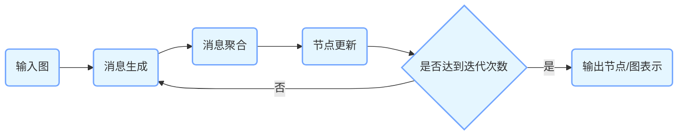

# 图神经网络：处理结构化数据的AI Agent

> 关键词：图神经网络、结构化数据、AI Agent、图卷积网络、消息传递机制

> 摘要：本文深入探讨了图神经网络作为处理结构化数据的AI Agent的相关内容。首先介绍了图神经网络的背景，包括目的、预期读者、文档结构和相关术语。接着阐述了图神经网络的核心概念与联系，包括原理和架构，并通过Mermaid流程图进行直观展示。详细讲解了核心算法原理和具体操作步骤，同时给出Python源代码。还介绍了图神经网络的数学模型和公式，并举例说明。通过项目实战，展示了代码的实际案例和详细解释。分析了图神经网络的实际应用场景，推荐了学习资源、开发工具框架和相关论文著作。最后总结了未来发展趋势与挑战，并提供了常见问题与解答以及扩展阅读和参考资料。

## 1. 背景介绍 
### 1.1 目的和范围
在当今的数据驱动时代，结构化数据无处不在，如社交网络、生物分子结构、知识图谱等。这些数据的特点是其元素之间存在复杂的关系，传统的机器学习方法难以充分挖掘这些关系中的信息。图神经网络（Graph Neural Networks，GNNs）作为一种专门处理图结构数据的深度学习模型，能够有效捕捉节点之间的依赖关系，为解决结构化数据处理问题提供了强大的工具。本文的目的是全面介绍图神经网络作为处理结构化数据的AI Agent的原理、算法、应用等方面的内容，帮助读者深入理解和应用图神经网络。

### 1.2 预期读者
本文的预期读者包括但不限于：对深度学习和图结构数据处理感兴趣的研究人员、数据科学家、机器学习工程师、研究生和高年级本科生。无论是初学者希望了解图神经网络的基础知识，还是有一定经验的从业者希望深入研究图神经网络的应用和算法优化，都能从本文中获得有价值的信息。

### 1.3 文档结构概述
本文将按照以下结构进行组织：首先介绍图神经网络的核心概念与联系，包括其原理和架构；接着详细讲解核心算法原理和具体操作步骤，并给出Python源代码；然后介绍图神经网络的数学模型和公式，并举例说明；通过项目实战展示代码的实际案例和详细解释；分析图神经网络的实际应用场景；推荐相关的学习资源、开发工具框架和论文著作；最后总结未来发展趋势与挑战，提供常见问题与解答以及扩展阅读和参考资料。

### 1.4 术语表
#### 1.4.1 核心术语定义
- **图（Graph）**：图是一种由节点（Node）和边（Edge）组成的数据结构，用于表示对象之间的关系。节点表示对象，边表示对象之间的连接。
- **图神经网络（Graph Neural Networks，GNNs）**：是一类专门处理图结构数据的深度学习模型，通过节点之间的信息传递来学习节点和图的表示。
- **节点特征（Node Feature）**：每个节点所具有的属性信息，通常用向量表示。
- **邻接矩阵（Adjacency Matrix）**：用于表示图中节点之间连接关系的矩阵，矩阵元素表示节点之间是否存在边。
- **图卷积网络（Graph Convolutional Network，GCN）**：是一种常见的图神经网络模型，通过对节点特征进行卷积操作来更新节点表示。

#### 1.4.2 相关概念解释
- **消息传递机制（Message Passing Mechanism）**：图神经网络中用于节点之间信息交换的机制，通过邻居节点的信息来更新当前节点的表示。
- **图嵌入（Graph Embedding）**：将图中的节点或图本身映射到低维向量空间的过程，以便进行后续的机器学习任务。
- **同构图（Homogeneous Graph）**：图中所有节点和边具有相同的类型。
- **异构图（Heterogeneous Graph）**：图中包含不同类型的节点和边。

#### 1.4.3 缩略词列表
- **GNNs**：Graph Neural Networks，图神经网络
- **GCN**：Graph Convolutional Network，图卷积网络
- **DGL**：Deep Graph Library，深度图库
- **PyTorch**：一个开源的深度学习框架

## 2. 核心概念与联系 
### 核心概念原理
图神经网络的核心思想是通过节点之间的信息传递来学习节点和图的表示。其基本原理基于消息传递机制，具体步骤如下：
1. **消息生成**：每个节点根据自身的特征和邻居节点的特征生成消息。
2. **消息聚合**：将邻居节点生成的消息进行聚合，得到当前节点的聚合消息。
3. **节点更新**：根据聚合消息和当前节点的特征更新当前节点的表示。

通过多次迭代上述过程，节点可以不断吸收邻居节点的信息，从而学习到更丰富的表示。

### 架构示意图
图神经网络的架构可以用以下文本示意图表示：

```plaintext
输入图（节点特征、邻接矩阵）
  |
  v
消息传递层（多次迭代）
  |
  v
输出节点表示或图表示
```

### Mermaid流程图


## 3. 核心算法原理 & 具体操作步骤 
### 图卷积网络（GCN）算法原理
图卷积网络（GCN）是一种常见的图神经网络模型，其核心思想是通过对节点特征进行卷积操作来更新节点表示。GCN的数学公式如下：

$$H^{(l+1)} = \sigma(\tilde{D}^{-\frac{1}{2}}\tilde{A}\tilde{D}^{-\frac{1}{2}}H^{(l)}W^{(l)})$$

其中：
- $H^{(l)}$ 是第 $l$ 层的节点特征矩阵，形状为 $N \times F^{(l)}$，$N$ 是节点数量，$F^{(l)}$ 是第 $l$ 层的特征维度。
- $\tilde{A} = A + I$ 是添加自环后的邻接矩阵，$A$ 是原始邻接矩阵，$I$ 是单位矩阵。
- $\tilde{D}$ 是 $\tilde{A}$ 的度矩阵，即 $\tilde{D}_{ii} = \sum_{j}\tilde{A}_{ij}$。
- $W^{(l)}$ 是第 $l$ 层的可学习权重矩阵，形状为 $F^{(l)} \times F^{(l+1)}$。
- $\sigma$ 是激活函数，如ReLU。

### Python源代码实现
```python
import torch
import torch.nn as nn
import torch.nn.functional as F

class GraphConvolution(nn.Module):
    def __init__(self, in_features, out_features):
        super(GraphConvolution, self).__init__()
        self.weight = nn.Parameter(torch.FloatTensor(in_features, out_features))
        self.reset_parameters()

    def reset_parameters(self):
        nn.init.xavier_uniform_(self.weight)

    def forward(self, input, adj):
        support = torch.mm(input, self.weight)
        output = torch.spmm(adj, support)
        return output

class GCN(nn.Module):
    def __init__(self, nfeat, nhid, nclass, dropout):
        super(GCN, self).__init__()
        self.gc1 = GraphConvolution(nfeat, nhid)
        self.gc2 = GraphConvolution(nhid, nclass)
        self.dropout = dropout

    def forward(self, x, adj):
        x = F.relu(self.gc1(x, adj))
        x = F.dropout(x, self.dropout, training=self.training)
        x = self.gc2(x, adj)
        return F.log_softmax(x, dim=1)
```

### 具体操作步骤
1. **数据准备**：准备图的邻接矩阵和节点特征矩阵。
2. **模型初始化**：初始化GCN模型，设置输入特征维度、隐藏层维度、输出类别数和 dropout 率。
3. **训练模型**：定义损失函数和优化器，进行模型训练。
4. **模型评估**：使用训练好的模型进行预测，并评估模型性能。

以下是一个简单的训练和评估示例：
```python
# 假设已经有了邻接矩阵 adj 和节点特征矩阵 features
# 以及节点标签 labels 和训练、测试索引 train_idx, test_idx

# 初始化模型
model = GCN(nfeat=features.shape[1], nhid=16, nclass=labels.max().item() + 1, dropout=0.5)
optimizer = torch.optim.Adam(model.parameters(), lr=0.01, weight_decay=5e-4)

# 训练模型
for epoch in range(200):
    model.train()
    optimizer.zero_grad()
    output = model(features, adj)
    loss_train = F.nll_loss(output[train_idx], labels[train_idx])
    loss_train.backward()
    optimizer.step()

# 评估模型
model.eval()
output = model(features, adj)
loss_test = F.nll_loss(output[test_idx], labels[test_idx])
acc_test = accuracy(output[test_idx], labels[test_idx])
print(f'Test set results: loss = {loss_test.item()}, accuracy = {acc_test.item()}')
```

## 4. 数学模型和公式 & 详细讲解 & 举例说明 
### 图神经网络的数学基础
图神经网络的数学基础主要基于线性代数和图论。在图神经网络中，图通常用邻接矩阵 $A$ 来表示，节点特征用矩阵 $X$ 来表示。邻接矩阵 $A$ 是一个 $N \times N$ 的矩阵，其中 $N$ 是节点数量，$A_{ij}$ 表示节点 $i$ 和节点 $j$ 之间是否存在边。节点特征矩阵 $X$ 是一个 $N \times F$ 的矩阵，其中 $F$ 是节点特征的维度。

### 图卷积网络的数学公式
如前面所述，GCN的核心公式为：

$$H^{(l+1)} = \sigma(\tilde{D}^{-\frac{1}{2}}\tilde{A}\tilde{D}^{-\frac{1}{2}}H^{(l)}W^{(l)})$$

下面详细讲解这个公式：
1. **添加自环**：$\tilde{A} = A + I$，添加自环的目的是让节点在信息传递过程中能够考虑自身的特征。
2. **度矩阵归一化**：$\tilde{D}^{-\frac{1}{2}}\tilde{A}\tilde{D}^{-\frac{1}{2}}$ 是对邻接矩阵进行归一化处理，其作用是平衡不同节点的邻居数量对信息传递的影响。
3. **线性变换**：$H^{(l)}W^{(l)}$ 是对第 $l$ 层的节点特征进行线性变换，$W^{(l)}$ 是可学习的权重矩阵。
4. **激活函数**：$\sigma$ 是激活函数，如ReLU，用于引入非线性因素，增强模型的表达能力。

### 举例说明
假设我们有一个简单的图，包含3个节点，节点特征维度为2，邻接矩阵 $A$ 如下：

$$A = \begin{bmatrix}
0 & 1 & 1 \\
1 & 0 & 1 \\
1 & 1 & 0
\end{bmatrix}$$

添加自环后的邻接矩阵 $\tilde{A}$ 为：

$$\tilde{A} = \begin{bmatrix}
1 & 1 & 1 \\
1 & 1 & 1 \\
1 & 1 & 1
\end{bmatrix}$$

度矩阵 $\tilde{D}$ 为：

$$\tilde{D} = \begin{bmatrix}
3 & 0 & 0 \\
0 & 3 & 0 \\
0 & 0 & 3
\end{bmatrix}$$

$\tilde{D}^{-\frac{1}{2}}$ 为：

$$\tilde{D}^{-\frac{1}{2}} = \begin{bmatrix}
\frac{1}{\sqrt{3}} & 0 & 0 \\
0 & \frac{1}{\sqrt{3}} & 0 \\
0 & 0 & \frac{1}{\sqrt{3}}
\end{bmatrix}$$

则 $\tilde{D}^{-\frac{1}{2}}\tilde{A}\tilde{D}^{-\frac{1}{2}}$ 为：

$$\tilde{D}^{-\frac{1}{2}}\tilde{A}\tilde{D}^{-\frac{1}{2}} = \begin{bmatrix}
\frac{1}{3} & \frac{1}{3} & \frac{1}{3} \\
\frac{1}{3} & \frac{1}{3} & \frac{1}{3} \\
\frac{1}{3} & \frac{1}{3} & \frac{1}{3}
\end{bmatrix}$$

假设第 $l$ 层的节点特征矩阵 $H^{(l)}$ 为：

$$H^{(l)} = \begin{bmatrix}
1 & 2 \\
3 & 4 \\
5 & 6
\end{bmatrix}$$

可学习的权重矩阵 $W^{(l)}$ 为：

$$W^{(l)} = \begin{bmatrix}
0.1 & 0.2 \\
0.3 & 0.4
\end{bmatrix}$$

则 $H^{(l)}W^{(l)}$ 为：

$$H^{(l)}W^{(l)} = \begin{bmatrix}
1\times0.1 + 2\times0.3 & 1\times0.2 + 2\times0.4 \\
3\times0.1 + 4\times0.3 & 3\times0.2 + 4\times0.4 \\
5\times0.1 + 6\times0.3 & 5\times0.2 + 6\times0.4
\end{bmatrix} = \begin{bmatrix}
0.7 & 1 \\
1.5 & 2.2 \\
2.3 & 3.4
\end{bmatrix}$$

$\tilde{D}^{-\frac{1}{2}}\tilde{A}\tilde{D}^{-\frac{1}{2}}H^{(l)}W^{(l)}$ 为：

$$\tilde{D}^{-\frac{1}{2}}\tilde{A}\tilde{D}^{-\frac{1}{2}}H^{(l)}W^{(l)} = \begin{bmatrix}
\frac{1}{3}\times(0.7 + 1.5 + 2.3) & \frac{1}{3}\times(1 + 2.2 + 3.4) \\
\frac{1}{3}\times(0.7 + 1.5 + 2.3) & \frac{1}{3}\times(1 + 2.2 + 3.4) \\
\frac{1}{3}\times(0.7 + 1.5 + 2.3) & \frac{1}{3}\times(1 + 2.2 + 3.4)
\end{bmatrix} = \begin{bmatrix}
1.5 & 2.2 \\
1.5 & 2.2 \\
1.5 & 2.2
\end{bmatrix}$$

假设激活函数 $\sigma$ 为ReLU，则 $H^{(l+1)}$ 为：

$$H^{(l+1)} = \begin{bmatrix}
1.5 & 2.2 \\
1.5 & 2.2 \\
1.5 & 2.2
\end{bmatrix}$$

## 5. 项目实战：代码实际案例和详细解释说明 
### 5.1  开发环境搭建
在进行图神经网络项目实战之前，需要搭建相应的开发环境。以下是具体步骤：
1. **安装Python**：推荐使用Python 3.7及以上版本，可以从Python官方网站（https://www.python.org/downloads/）下载并安装。
2. **安装深度学习框架**：本文使用PyTorch作为深度学习框架，可以根据自己的CUDA版本从PyTorch官方网站（https://pytorch.org/get-started/locally/）选择合适的安装命令进行安装。例如，对于没有CUDA支持的系统，可以使用以下命令安装：
```bash
pip install torch torchvision
```
3. **安装图神经网络库**：推荐使用DGL（Deep Graph Library），它是一个专门用于图神经网络的深度学习库。可以使用以下命令安装：
```bash
pip install dgl
```

### 5.2  源代码详细实现和代码解读
以下是一个使用DGL和PyTorch实现的图节点分类项目的完整代码：
```python
import dgl
import torch
import torch.nn as nn
import torch.nn.functional as F
from dgl.data import CoraGraphDataset

# 加载数据集
dataset = CoraGraphDataset()
g = dataset[0]
features = g.ndata['feat']
labels = g.ndata['label']
train_mask = g.ndata['train_mask']
val_mask = g.ndata['val_mask']
test_mask = g.ndata['test_mask']

# 定义图卷积层
class GraphConv(nn.Module):
    def __init__(self, in_feats, out_feats):
        super(GraphConv, self).__init__()
        self.linear = nn.Linear(in_feats, out_feats)

    def forward(self, g, inputs):
        # 消息传递
        with g.local_scope():
            g.ndata['h'] = inputs
            g.update_all(dgl.function.copy_u('h', 'm'), dgl.function.sum('m', 'h'))
            h = g.ndata['h']
            return self.linear(h)

# 定义图神经网络模型
class GNN(nn.Module):
    def __init__(self, in_feats, hidden_size, num_classes):
        super(GNN, self).__init__()
        self.conv1 = GraphConv(in_feats, hidden_size)
        self.conv2 = GraphConv(hidden_size, num_classes)

    def forward(self, g, inputs):
        h = self.conv1(g, inputs)
        h = F.relu(h)
        h = self.conv2(g, h)
        return h

# 初始化模型、损失函数和优化器
model = GNN(features.shape[1], 16, dataset.num_classes)
criterion = nn.CrossEntropyLoss()
optimizer = torch.optim.Adam(model.parameters(), lr=0.01)

# 训练模型
for epoch in range(200):
    model.train()
    logits = model(g, features)
    loss = criterion(logits[train_mask], labels[train_mask])

    optimizer.zero_grad()
    loss.backward()
    optimizer.step()

    # 验证模型
    model.eval()
    with torch.no_grad():
        logits = model(g, features)
        val_loss = criterion(logits[val_mask], labels[val_mask])
        val_acc = (logits[val_mask].argmax(1) == labels[val_mask]).float().mean()
    print(f'Epoch {epoch}: Train Loss {loss.item()}, Val Loss {val_loss.item()}, Val Acc {val_acc.item()}')

# 测试模型
model.eval()
with torch.no_grad():
    logits = model(g, features)
    test_loss = criterion(logits[test_mask], labels[test_mask])
    test_acc = (logits[test_mask].argmax(1) == labels[test_mask]).float().mean()
print(f'Test Loss {test_loss.item()}, Test Acc {test_acc.item()}')
```

### 5.3  代码解读与分析
1. **数据加载**：使用DGL的 `CoraGraphDataset` 加载Cora数据集，该数据集是一个常用的图节点分类数据集。
2. **图卷积层定义**：`GraphConv` 类实现了一个简单的图卷积层，通过 `dgl.function.copy_u` 和 `dgl.function.sum` 实现了消息传递机制。
3. **图神经网络模型定义**：`GNN` 类定义了一个两层的图神经网络模型，包含两个图卷积层和一个ReLU激活函数。
4. **模型训练**：使用交叉熵损失函数和Adam优化器进行模型训练，在每个epoch中计算训练损失和验证损失、准确率。
5. **模型测试**：在训练完成后，使用测试集对模型进行评估，计算测试损失和准确率。

## 6. 实际应用场景 
### 社交网络分析
在社交网络中，用户可以看作是节点，用户之间的关系可以看作是边。图神经网络可以用于社交网络的节点分类、链接预测、社区发现等任务。例如，通过节点分类可以将用户分为不同的兴趣群体，通过链接预测可以预测用户之间是否会建立新的关系，通过社区发现可以找出社交网络中的社区结构。

### 生物信息学
在生物信息学中，蛋白质结构、基因调控网络等都可以用图来表示。图神经网络可以用于蛋白质功能预测、药物发现、疾病诊断等任务。例如，通过图神经网络可以预测蛋白质的功能，筛选潜在的药物分子，辅助疾病的早期诊断。

### 知识图谱
知识图谱是一种结构化的语义网络，由实体和实体之间的关系组成。图神经网络可以用于知识图谱的实体分类、关系预测、知识推理等任务。例如，通过实体分类可以将知识图谱中的实体分为不同的类别，通过关系预测可以预测实体之间是否存在某种关系，通过知识推理可以从已知的知识中推导出新的知识。

### 推荐系统
在推荐系统中，用户和物品可以看作是节点，用户对物品的行为（如点击、购买等）可以看作是边。图神经网络可以用于推荐系统的用户建模、物品推荐等任务。例如，通过图神经网络可以学习用户和物品的表示，根据用户的历史行为为用户推荐感兴趣的物品。

## 7. 工具和资源推荐
### 7.1 学习资源推荐
#### 7.1.1 书籍推荐
- 《深度学习》（Deep Learning）：由Ian Goodfellow、Yoshua Bengio和Aaron Courville所著，是深度学习领域的经典教材，涵盖了深度学习的基本概念、算法和应用。
- 《图神经网络：基础、前沿与应用》：全面介绍了图神经网络的基本原理、算法和应用，适合初学者和有一定基础的读者。

#### 7.1.2 在线课程
- Coursera上的“Deep Learning Specialization”：由Andrew Ng教授主讲，是深度学习领域的经典在线课程，包含了神经网络、卷积神经网络、循环神经网络等内容。
- edX上的“Graph Neural Networks for Machine Learning”：专门介绍图神经网络的在线课程，由知名学者授课，内容丰富。

#### 7.1.3 技术博客和网站
- Medium上的“Towards Data Science”：是一个数据科学和机器学习领域的知名博客，经常发布图神经网络相关的技术文章。
- 图神经网络官方网站：如DGL（https://www.dgl.ai/）和PyTorch Geometric（https://pytorch-geometric.readthedocs.io/）的官方网站，提供了丰富的文档和教程。

### 7.2 开发工具框架推荐
#### 7.2.1 IDE和编辑器
- PyCharm：是一款专业的Python集成开发环境，提供了丰富的代码编辑、调试和版本控制功能，适合开发图神经网络项目。
- Jupyter Notebook：是一个交互式的开发环境，支持Python代码的实时运行和可视化，适合进行图神经网络的实验和数据分析。

#### 7.2.2 调试和性能分析工具
- TensorBoard：是TensorFlow提供的可视化工具，也可以与PyTorch结合使用，用于可视化模型的训练过程、损失曲线、准确率等指标。
- PyTorch Profiler：是PyTorch提供的性能分析工具，可以帮助开发者找出模型训练过程中的性能瓶颈。

#### 7.2.3 相关框架和库
- DGL（Deep Graph Library）：是一个专门用于图神经网络的深度学习库，提供了丰富的图神经网络模型和工具，支持多种深度学习框架。
- PyTorch Geometric：是基于PyTorch的图神经网络库，提供了高效的图数据处理和图神经网络模型实现。

### 7.3 相关论文著作推荐
#### 7.3.1 经典论文
- “Semi-Supervised Classification with Graph Convolutional Networks”：提出了图卷积网络（GCN）的经典论文，为图神经网络的发展奠定了基础。
- “Graph Attention Networks”：提出了图注意力网络（GAT），通过引入注意力机制提高了图神经网络的性能。

#### 7.3.2 最新研究成果
- 关注NeurIPS、ICML、CVPR等顶级学术会议上的图神经网络相关论文，了解最新的研究成果和技术趋势。
- 关注arXiv上的预印本论文，及时获取最新的研究动态。

#### 7.3.3 应用案例分析
- 一些知名的学术期刊和会议会发表图神经网络在不同领域的应用案例分析，如ACM SIGKDD、IEEE Transactions on Neural Networks and Learning Systems等。

## 8. 总结：未来发展趋势与挑战
### 未来发展趋势
- **模型创新**：未来可能会出现更多新型的图神经网络模型，如结合注意力机制、Transformer架构等，以提高模型的性能和表达能力。
- **多模态融合**：将图神经网络与其他模态的数据（如图像、文本、音频等）进行融合，以处理更复杂的现实问题。
- **可解释性研究**：随着图神经网络在医疗、金融等领域的应用越来越广泛，对模型的可解释性要求也越来越高，未来会有更多的研究关注图神经网络的可解释性。
- **大规模图处理**：随着数据规模的不断增大，如何高效处理大规模图数据是一个重要的研究方向，未来可能会出现更高效的图神经网络算法和分布式计算框架。

### 挑战
- **数据质量和规模**：图数据的质量和规模对图神经网络的性能有很大影响，如何获取高质量、大规模的图数据是一个挑战。
- **计算资源需求**：图神经网络的训练和推理通常需要大量的计算资源，如何降低计算成本是一个需要解决的问题。
- **过拟合问题**：图神经网络容易出现过拟合问题，特别是在数据量较小的情况下，如何解决过拟合问题是一个挑战。
- **模型评估标准**：目前图神经网络的评估标准还不够完善，如何建立科学合理的评估标准是一个需要研究的问题。

## 9. 附录：常见问题与解答
### 问题1：图神经网络和传统神经网络有什么区别？
答：传统神经网络（如全连接神经网络、卷积神经网络、循环神经网络等）主要处理欧几里得空间的数据，如图像、文本、时间序列等。而图神经网络专门处理图结构数据，能够捕捉节点之间的复杂关系。图神经网络通过消息传递机制在节点之间进行信息交换，从而学习节点和图的表示。

### 问题2：如何选择合适的图神经网络模型？
答：选择合适的图神经网络模型需要考虑多个因素，如数据的特点（如节点数量、边的密度、节点特征的维度等）、任务的类型（如节点分类、图分类、链接预测等）、计算资源等。一般来说，如果数据规模较小，可以选择简单的图神经网络模型，如GCN；如果数据规模较大，可以选择更复杂的模型，如GAT、GraphSAGE等。

### 问题3：图神经网络的训练时间通常比较长，有什么方法可以加快训练速度？
答：可以采取以下方法加快图神经网络的训练速度：
- 使用GPU进行计算，提高计算效率。
- 采用小批量训练，减少每次迭代的计算量。
- 优化模型结构，减少模型的参数数量。
- 使用分布式计算框架，并行计算加速训练。

### 问题4：图神经网络在处理异构图时需要注意什么？
答：处理异构图时需要注意以下几点：
- 节点和边的类型不同，需要对不同类型的节点和边进行区分和处理。
- 不同类型的节点和边可能具有不同的特征和语义，需要设计合适的特征表示和信息传递机制。
- 异构图的结构比较复杂，需要选择合适的图神经网络模型，如Heterogeneous Graph Neural Network（HGNN）等。

## 10. 扩展阅读 & 参考资料
### 扩展阅读
- 《深度学习与图神经网络》：进一步深入探讨了深度学习和图神经网络的结合，介绍了更多的图神经网络模型和应用案例。
- 《图论及其应用》：学习图论的基础知识，对于理解图神经网络的原理和算法有很大帮助。

### 参考资料
- [DGL官方文档](https://docs.dgl.ai/)
- [PyTorch官方文档](https://pytorch.org/docs/stable/index.html)
- [图神经网络相关学术论文](https://scholar.google.com/)

作者：AI天才研究院/AI Genius Institute & 禅与计算机程序设计艺术 /Zen And The Art of Computer Programming