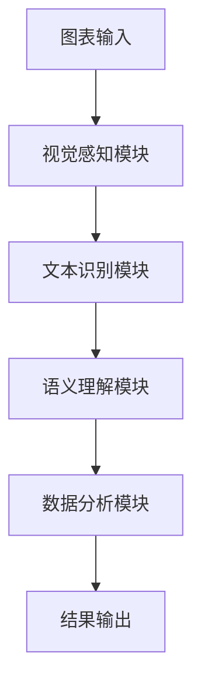

# 图表理解技术：增强AI Agent的数据分析能力

> 关键词：图表理解技术、AI Agent、数据分析能力、视觉识别、语义理解

> 摘要：本文聚焦于图表理解技术在增强AI Agent数据分析能力方面的应用。详细阐述了图表理解技术的核心概念、算法原理、数学模型，通过实际项目案例展示其实现过程。同时探讨了该技术的实际应用场景，推荐了相关的学习资源、开发工具和论文著作。最后分析了未来发展趋势与挑战，并对常见问题进行解答，旨在为读者全面深入地介绍图表理解技术，助力其在AI领域的学习和实践。

## 1. 背景介绍 
### 1.1 目的和范围
随着数据量的爆炸式增长，图表作为一种直观、高效的数据可视化方式，在各个领域得到了广泛应用。然而，AI Agent要想从图表中提取有价值的信息并进行深入分析，面临着诸多挑战。本文的目的是介绍图表理解技术，帮助AI Agent更好地理解和分析图表，从而增强其数据分析能力。

本文的范围涵盖了图表理解技术的基本概念、核心算法、数学模型、实际应用以及相关的工具和资源推荐等方面。通过对这些内容的详细阐述，读者可以全面了解图表理解技术，并将其应用到实际项目中。

### 1.2 预期读者
本文预期读者包括人工智能领域的研究人员、开发者、数据分析师以及对图表理解技术感兴趣的技术爱好者。对于研究人员，本文可以为他们提供最新的研究思路和方法；对于开发者，本文可以帮助他们掌握图表理解技术的实现细节，开发出更智能的AI Agent；对于数据分析师，本文可以提供一种新的数据分析手段，提高数据分析的效率和准确性；对于技术爱好者，本文可以让他们了解图表理解技术的基本原理和应用场景，拓宽技术视野。

### 1.3 文档结构概述
本文将按照以下结构进行组织：
1. **背景介绍**：介绍文章的目的、范围、预期读者和文档结构，以及相关术语的定义。
2. **核心概念与联系**：阐述图表理解技术的核心概念，包括图表的类型、图表理解的层次等，并通过文本示意图和Mermaid流程图展示其架构。
3. **核心算法原理 & 具体操作步骤**：详细讲解图表理解的核心算法，如目标检测、OCR、语义分析等，并使用Python源代码进行具体实现。
4. **数学模型和公式 & 详细讲解 & 举例说明**：介绍图表理解中涉及的数学模型和公式，如卷积神经网络、循环神经网络等，并通过具体例子进行详细讲解。
5. **项目实战：代码实际案例和详细解释说明**：通过一个实际的项目案例，展示图表理解技术的实现过程，包括开发环境搭建、源代码详细实现和代码解读。
6. **实际应用场景**：探讨图表理解技术在金融、医疗、教育等领域的实际应用场景。
7. **工具和资源推荐**：推荐相关的学习资源、开发工具和论文著作，帮助读者进一步深入学习和研究图表理解技术。
8. **总结：未来发展趋势与挑战**：分析图表理解技术的未来发展趋势和面临的挑战。
9. **附录：常见问题与解答**：对读者可能遇到的常见问题进行解答。
10. **扩展阅读 & 参考资料**：提供相关的扩展阅读材料和参考资料，方便读者进一步查阅。

### 1.4 术语表
#### 1.4.1 核心术语定义
- **图表理解技术**：指AI Agent对图表进行视觉识别、语义理解和数据分析的技术。
- **AI Agent**：指具有自主学习和决策能力的人工智能程序。
- **数据分析能力**：指对数据进行收集、整理、分析和解释的能力。
- **视觉识别**：指对图像或视频中的物体、场景等进行识别和分类的技术。
- **语义理解**：指对文本或图像中的语义信息进行理解和分析的技术。

#### 1.4.2 相关概念解释
- **图表类型**：常见的图表类型包括柱状图、折线图、饼图、散点图等，不同类型的图表适用于不同的数据展示和分析需求。
- **图表理解层次**：图表理解可以分为三个层次，即视觉感知层、语义理解层和数据分析层。视觉感知层主要负责对图表的视觉元素进行识别和定位；语义理解层主要负责对图表中的文本和符号进行语义分析；数据分析层主要负责对图表中的数据进行提取和分析。

#### 1.4.3 缩略词列表
- **OCR**：Optical Character Recognition，光学字符识别
- **CNN**：Convolutional Neural Network，卷积神经网络
- **RNN**：Recurrent Neural Network，循环神经网络
- **LSTM**：Long Short-Term Memory，长短期记忆网络

## 2. 核心概念与联系 
### 核心概念原理
图表理解技术的核心目标是让AI Agent能够像人类一样理解图表中的信息。其原理主要基于计算机视觉和自然语言处理技术，通过对图表的视觉识别和语义理解，提取图表中的数据和信息，并进行分析和推理。

具体来说，图表理解技术包括以下几个步骤：
1. **视觉感知**：使用计算机视觉技术对图表的视觉元素进行识别和定位，如坐标轴、刻度、图例、数据点等。
2. **文本识别**：使用OCR技术对图表中的文本进行识别，如标题、标签、数据值等。
3. **语义理解**：对识别出的文本和视觉元素进行语义分析，理解图表的含义和数据之间的关系。
4. **数据分析**：根据语义理解的结果，对图表中的数据进行提取和分析，如计算平均值、最大值、最小值等。

### 架构的文本示意图
```plaintext
             +---------------------+
             |     图表输入        |
             +---------------------+
                       |
                       v
             +---------------------+
             |    视觉感知模块     |
             |  （目标检测、定位）  |
             +---------------------+
                       |
                       v
             +---------------------+
             |    文本识别模块     |
             |     （OCR技术）     |
             +---------------------+
                       |
                       v
             +---------------------+
             |    语义理解模块     |
             |  （语义分析、推理）  |
             +---------------------+
                       |
                       v
             +---------------------+
             |    数据分析模块     |
             |  （数据提取、计算）  |
             +---------------------+
                       |
                       v
             +---------------------+
             |    结果输出         |
             +---------------------+
```

### Mermaid流程图


## 3. 核心算法原理 & 具体操作步骤 
### 目标检测算法
目标检测是图表理解中视觉感知的重要步骤，用于识别图表中的各种视觉元素。常用的目标检测算法有YOLO（You Only Look Once）和Faster R-CNN等。

以下是使用YOLOv5进行目标检测的Python代码示例：
```python
import torch

# 加载预训练的YOLOv5模型
model = torch.hub.load('ultralytics/yolov5', 'yolov5s', pretrained=True)

# 读取图表图像
img = 'chart.jpg'

# 进行目标检测
results = model(img)

# 显示检测结果
results.show()
```

### OCR算法
OCR技术用于识别图表中的文本。常用的OCR库有Tesseract和EasyOCR等。

以下是使用EasyOCR进行文本识别的Python代码示例：
```python
import easyocr

# 创建OCR读取器
reader = easyocr.Reader(['en'])

# 读取图表图像
img = 'chart.jpg'

# 进行文本识别
results = reader.readtext(img)

# 输出识别结果
for (bbox, text, prob) in results:
    print(f'Text: {text}, Probability: {prob}')
```

### 语义分析算法
语义分析用于理解图表中的文本和视觉元素的含义。常用的语义分析方法有基于规则的方法和基于机器学习的方法。

以下是一个简单的基于规则的语义分析示例：
```python
# 假设我们已经识别出了图表的标题和数据标签
chart_title = 'Monthly Sales'
data_labels = ['January', 'February', 'March']

# 根据规则进行语义分析
if 'Sales' in chart_title:
    print('This chart is about sales data.')
    if 'Monthly' in chart_title:
        print('The data is presented on a monthly basis.')
    for label in data_labels:
        if 'uary' in label:
            print(f'The data includes information for {label}.')
```

### 具体操作步骤
1. **数据准备**：收集和整理图表数据集，用于训练和测试目标检测、OCR和语义分析模型。
2. **模型训练**：使用准备好的数据集对目标检测、OCR和语义分析模型进行训练。
3. **图表输入**：将待分析的图表输入到系统中。
4. **视觉感知**：使用训练好的目标检测模型对图表的视觉元素进行识别和定位。
5. **文本识别**：使用训练好的OCR模型对图表中的文本进行识别。
6. **语义理解**：对识别出的文本和视觉元素进行语义分析，理解图表的含义和数据之间的关系。
7. **数据分析**：根据语义理解的结果，对图表中的数据进行提取和分析。
8. **结果输出**：将分析结果以合适的形式输出，如文本报告、可视化图表等。

## 4. 数学模型和公式 & 详细讲解 & 举例说明 
### 卷积神经网络（CNN）
卷积神经网络是一种广泛应用于计算机视觉领域的深度学习模型，用于图像的特征提取和分类。其基本结构包括卷积层、池化层和全连接层。

#### 卷积层
卷积层通过卷积操作提取图像的局部特征。卷积操作可以用以下公式表示：
$$y_{i,j}^l = \sum_{m=0}^{M-1} \sum_{n=0}^{N-1} x_{i+m,j+n}^{l-1} \cdot w_{m,n}^l + b^l$$
其中，$y_{i,j}^l$ 是第 $l$ 层卷积层在位置 $(i,j)$ 处的输出，$x_{i+m,j+n}^{l-1}$ 是第 $l-1$ 层在位置 $(i+m,j+n)$ 处的输入，$w_{m,n}^l$ 是卷积核的权重，$b^l$ 是偏置项，$M$ 和 $N$ 是卷积核的大小。

#### 池化层
池化层用于降低特征图的维度，减少计算量。常用的池化操作有最大池化和平均池化。

最大池化的公式表示为：
$$y_{i,j}^l = \max_{m=0}^{M-1} \max_{n=0}^{N-1} x_{iM+m,jN+n}^{l-1}$$
其中，$y_{i,j}^l$ 是第 $l$ 层池化层在位置 $(i,j)$ 处的输出，$x_{iM+m,jN+n}^{l-1}$ 是第 $l-1$ 层在位置 $(iM+m,jN+n)$ 处的输入，$M$ 和 $N$ 是池化窗口的大小。

#### 全连接层
全连接层将卷积层和池化层提取的特征进行整合，用于最终的分类或回归任务。全连接层的输出可以用以下公式表示：
$$y^l = \sigma(W^l \cdot x^{l-1} + b^l)$$
其中，$y^l$ 是第 $l$ 层全连接层的输出，$W^l$ 是权重矩阵，$x^{l-1}$ 是第 $l-1$ 层的输入，$b^l$ 是偏置项，$\sigma$ 是激活函数，如ReLU、Sigmoid等。

#### 举例说明
假设我们有一个简单的CNN模型，用于识别手写数字。输入图像的大小为 $28 \times 28$，经过一个卷积层（卷积核大小为 $3 \times 3$，卷积核数量为 16）、一个最大池化层（池化窗口大小为 $2 \times 2$）和一个全连接层（输出维度为 10）。

```python
import torch
import torch.nn as nn

class SimpleCNN(nn.Module):
    def __init__(self):
        super(SimpleCNN, self).__init__()
        self.conv1 = nn.Conv2d(1, 16, kernel_size=3)
        self.pool = nn.MaxPool2d(2, 2)
        self.fc1 = nn.Linear(16 * 13 * 13, 10)

    def forward(self, x):
        x = self.pool(torch.relu(self.conv1(x)))
        x = x.view(-1, 16 * 13 * 13)
        x = self.fc1(x)
        return x

# 创建模型实例
model = SimpleCNN()

# 输入数据
input_data = torch.randn(1, 1, 28, 28)

# 前向传播
output = model(input_data)
print(output.shape)
```

### 循环神经网络（RNN）
循环神经网络是一种用于处理序列数据的深度学习模型，常用于自然语言处理中的文本生成、机器翻译等任务。

#### RNN单元
RNN单元的计算公式如下：
$$h_t = \tanh(W_{hh} h_{t-1} + W_{xh} x_t + b_h)$$
$$y_t = W_{hy} h_t + b_y$$
其中，$h_t$ 是时刻 $t$ 的隐藏状态，$x_t$ 是时刻 $t$ 的输入，$W_{hh}$、$W_{xh}$ 和 $W_{hy}$ 是权重矩阵，$b_h$ 和 $b_y$ 是偏置项，$\tanh$ 是激活函数。

#### 长短期记忆网络（LSTM）
LSTM是一种特殊的RNN，用于解决传统RNN的梯度消失问题。LSTM单元的计算公式如下：
$$i_t = \sigma(W_{ii} x_t + W_{hi} h_{t-1} + b_i)$$
$$f_t = \sigma(W_{if} x_t + W_{hf} h_{t-1} + b_f)$$
$$o_t = \sigma(W_{io} x_t + W_{ho} h_{t-1} + b_o)$$
$$g_t = \tanh(W_{ig} x_t + W_{hg} h_{t-1} + b_g)$$
$$c_t = f_t \odot c_{t-1} + i_t \odot g_t$$
$$h_t = o_t \odot \tanh(c_t)$$
其中，$i_t$、$f_t$ 和 $o_t$ 分别是输入门、遗忘门和输出门，$g_t$ 是候选记忆单元，$c_t$ 是细胞状态，$\odot$ 表示逐元素相乘，$\sigma$ 是Sigmoid激活函数。

#### 举例说明
以下是一个使用LSTM进行文本分类的示例：
```python
import torch
import torch.nn as nn

class LSTMClassifier(nn.Module):
    def __init__(self, input_size, hidden_size, num_classes):
        super(LSTMClassifier, self).__init__()
        self.lstm = nn.LSTM(input_size, hidden_size, batch_first=True)
        self.fc = nn.Linear(hidden_size, num_classes)

    def forward(self, x):
        out, _ = self.lstm(x)
        out = out[:, -1, :]
        out = self.fc(out)
        return out

# 创建模型实例
input_size = 10
hidden_size = 20
num_classes = 2
model = LSTMClassifier(input_size, hidden_size, num_classes)

# 输入数据
input_data = torch.randn(32, 5, input_size)

# 前向传播
output = model(input_data)
print(output.shape)
```

## 5. 项目实战：代码实际案例和详细解释说明 
### 5.1  开发环境搭建
#### 操作系统
建议使用Ubuntu 18.04或以上版本的Linux系统，或者Windows 10系统。

#### 编程语言和库
- **Python**：建议使用Python 3.7或以上版本。
- **深度学习框架**：推荐使用PyTorch，可通过以下命令安装：
```bash
pip install torch torchvision
```
- **计算机视觉库**：安装OpenCV和EasyOCR，可通过以下命令安装：
```bash
pip install opencv-python-headless easyocr
```

#### 开发工具
推荐使用PyCharm作为开发工具，它提供了强大的代码编辑、调试和项目管理功能。

### 5.2  源代码详细实现和代码解读
#### 项目概述
本项目的目标是实现一个简单的图表理解系统，能够识别柱状图中的数据。

#### 代码实现
```python
import cv2
import easyocr
import numpy as np

# 初始化OCR读取器
reader = easyocr.Reader(['en'])

def detect_bars(image):
    # 转换为灰度图像
    gray = cv2.cvtColor(image, cv2.COLOR_BGR2GRAY)

    # 边缘检测
    edges = cv2.Canny(gray, 50, 150)

    # 查找轮廓
    contours, _ = cv2.findContours(edges, cv2.RETR_EXTERNAL, cv2.CHAIN_APPROX_SIMPLE)

    bars = []
    for contour in contours:
        # 计算轮廓的边界框
        x, y, w, h = cv2.boundingRect(contour)
        # 过滤掉过小的轮廓
        if w > 10 and h > 10:
            bars.append((x, y, w, h))

    return bars

def recognize_text(image, bars):
    text_results = []
    for (x, y, w, h) in bars:
        # 提取柱状图区域
        bar_image = image[y:y+h, x:x+w]

        # 进行文本识别
        results = reader.readtext(bar_image)

        for (bbox, text, prob) in results:
            text_results.append((x, y, text, prob))

    return text_results

def main():
    # 读取图表图像
    image = cv2.imread('bar_chart.jpg')

    # 检测柱状图
    bars = detect_bars(image)

    # 识别文本
    text_results = recognize_text(image, bars)

    # 输出识别结果
    for (x, y, text, prob) in text_results:
        print(f'Position: ({x}, {y}), Text: {text}, Probability: {prob}')

if __name__ == '__main__':
    main()
```

#### 代码解读
1. **初始化OCR读取器**：使用EasyOCR库初始化一个OCR读取器，用于识别图表中的文本。
2. **检测柱状图**：定义 `detect_bars` 函数，该函数将输入的图像转换为灰度图像，然后使用Canny边缘检测算法检测边缘，最后查找轮廓并过滤掉过小的轮廓，得到柱状图的边界框。
3. **识别文本**：定义 `recognize_text` 函数，该函数遍历每个柱状图的边界框，提取柱状图区域，然后使用OCR读取器对该区域进行文本识别，得到识别结果。
4. **主函数**：在 `main` 函数中，读取图表图像，调用 `detect_bars` 函数检测柱状图，调用 `recognize_text` 函数识别文本，最后输出识别结果。

### 5.3  代码解读与分析
#### 优点
- **简单易懂**：代码结构清晰，使用的算法和库都是常见的，易于理解和实现。
- **可扩展性**：可以通过更换不同的目标检测算法和OCR库，提高系统的性能和准确性。

#### 缺点
- **准确性有限**：由于使用的是简单的边缘检测和OCR技术，对于复杂的图表和模糊的文本，识别准确性可能会受到影响。
- **缺乏语义理解**：代码只实现了文本识别，没有对识别结果进行语义理解和数据分析。

#### 改进方向
- **使用更先进的目标检测算法**：如YOLOv5、Faster R-CNN等，提高柱状图检测的准确性。
- **引入语义理解模型**：如BERT、GPT等，对识别结果进行语义分析，提取更有价值的信息。

## 6. 实际应用场景 
### 金融领域
在金融领域，图表理解技术可以用于分析股票走势图、财务报表等。通过对这些图表的理解和分析，投资者可以更好地了解市场趋势和公司财务状况，做出更明智的投资决策。

### 医疗领域
在医疗领域，图表理解技术可以用于分析医学影像、病历报告等。医生可以通过对这些图表的理解和分析，更准确地诊断疾病，制定个性化的治疗方案。

### 教育领域
在教育领域，图表理解技术可以用于分析学生的学习成绩、作业完成情况等。教师可以通过对这些图表的理解和分析，了解学生的学习状况，及时调整教学策略。

### 商业领域
在商业领域，图表理解技术可以用于分析市场调研数据、销售报表等。企业可以通过对这些图表的理解和分析，了解市场需求和竞争态势，制定更有效的市场营销策略。

## 7. 工具和资源推荐
### 7.1 学习资源推荐
#### 7.1.1 书籍推荐
- 《深度学习》（Deep Learning）：由Ian Goodfellow、Yoshua Bengio和Aaron Courville合著，是深度学习领域的经典教材。
- 《Python计算机视觉编程》（Programming Computer Vision with Python）：由Jan Erik Solem著，介绍了使用Python进行计算机视觉编程的基础知识和实践方法。
- 《自然语言处理入门》（Natural Language Processing with Python）：由Steven Bird、Ewan Klein和Edward Loper合著，是自然语言处理领域的入门教材。

#### 7.1.2 在线课程
- Coursera上的“深度学习专项课程”（Deep Learning Specialization）：由Andrew Ng教授授课，系统介绍了深度学习的基础知识和应用。
- edX上的“计算机视觉基础”（Foundations of Computer Vision）：由Berkeley University提供，介绍了计算机视觉的基本概念和算法。
- 中国大学MOOC上的“自然语言处理”：由哈尔滨工业大学提供，介绍了自然语言处理的基本理论和方法。

#### 7.1.3 技术博客和网站
- Medium：一个技术博客平台，上面有很多关于人工智能、计算机视觉和自然语言处理的优质文章。
- arXiv：一个预印本平台，提供了大量的最新研究论文。
- Kaggle：一个数据科学竞赛平台，上面有很多关于图表理解和数据分析的竞赛和数据集。

### 7.2 开发工具框架推荐
#### 7.2.1 IDE和编辑器
- PyCharm：一个专门为Python开发设计的集成开发环境，提供了强大的代码编辑、调试和项目管理功能。
- Jupyter Notebook：一个交互式的开发环境，适合进行数据分析和模型训练。
- Visual Studio Code：一个轻量级的代码编辑器，支持多种编程语言和插件。

#### 7.2.2 调试和性能分析工具
- PyTorch Profiler：PyTorch提供的性能分析工具，用于分析模型的运行时间和内存使用情况。
- TensorBoard：TensorFlow提供的可视化工具，用于监控模型的训练过程和性能指标。
- cProfile：Python内置的性能分析工具，用于分析Python代码的运行时间和函数调用次数。

#### 7.2.3 相关框架和库
- PyTorch：一个开源的深度学习框架，提供了丰富的神经网络层和优化算法。
- TensorFlow：一个广泛使用的深度学习框架，支持分布式训练和模型部署。
- OpenCV：一个开源的计算机视觉库，提供了丰富的图像处理和计算机视觉算法。
- EasyOCR：一个简单易用的OCR库，支持多种语言的文本识别。

### 7.3 相关论文著作推荐
#### 7.3.1 经典论文
- 《Gradient-Based Learning Applied to Document Recognition》：由Yann LeCun等人发表，介绍了卷积神经网络在手写数字识别中的应用。
- 《Long Short-Term Memory》：由Sepp Hochreiter和Jürgen Schmidhuber发表，提出了长短期记忆网络（LSTM）。
- 《Attention Is All You Need》：由Ashish Vaswani等人发表，提出了Transformer模型，是自然语言处理领域的重要突破。

#### 7.3.2 最新研究成果
- 《ChartOCR: A Dataset for Chart Information Extraction》：提出了一个用于图表信息提取的数据集ChartOCR，并介绍了相关的研究方法。
- 《Deep Learning for Image-Based Chart Understanding: A Survey》：对基于深度学习的图表理解技术进行了全面的综述。
- 《Graph Neural Networks for Chart Understanding》：探索了图神经网络在图表理解中的应用。

#### 7.3.3 应用案例分析
- 《Financial Chart Analysis Using Deep Learning Techniques》：介绍了如何使用深度学习技术对金融图表进行分析。
- 《Medical Image Analysis with Convolutional Neural Networks》：介绍了卷积神经网络在医学图像分析中的应用。
- 《Educational Data Mining with Machine Learning》：介绍了机器学习在教育数据挖掘中的应用。

## 8. 总结：未来发展趋势与挑战
### 未来发展趋势
- **多模态融合**：将图表理解技术与语音识别、视频分析等多模态技术相结合，实现更全面、更智能的数据分析。
- **跨领域应用**：将图表理解技术应用到更多的领域，如交通、能源、环保等，为这些领域的决策提供支持。
- **自主学习和进化**：让AI Agent具备自主学习和进化的能力，能够不断适应新的图表类型和数据变化。

### 挑战
- **数据标注困难**：图表理解需要大量的标注数据，而数据标注的过程非常耗时耗力，且标注质量难以保证。
- **复杂图表理解**：对于复杂的图表，如三维图表、交互式图表等，现有的图表理解技术还存在很大的挑战。
- **语义理解深度**：目前的图表理解技术主要侧重于文本识别和数据提取，对于图表中隐含的语义信息和知识的理解还不够深入。

## 9. 附录：常见问题与解答
### 问题1：图表理解技术的准确率如何提高？
解答：可以通过以下方法提高图表理解技术的准确率：
- 使用更先进的目标检测和OCR算法。
- 增加训练数据的数量和多样性。
- 引入语义理解模型，对识别结果进行更深入的分析。

### 问题2：图表理解技术可以处理哪些类型的图表？
解答：图表理解技术可以处理常见的图表类型，如柱状图、折线图、饼图、散点图等。对于一些复杂的图表，如三维图表、交互式图表等，还需要进一步的研究和改进。

### 问题3：图表理解技术在实际应用中面临哪些挑战？
解答：图表理解技术在实际应用中面临以下挑战：
- 数据质量问题：图表中的文本可能存在模糊、遮挡等问题，影响识别准确性。
- 图表类型多样性：不同类型的图表具有不同的结构和特征，需要针对性的处理方法。
- 语义理解难度：图表中隐含的语义信息和知识需要更深入的分析和理解。

## 10. 扩展阅读 & 参考资料
### 扩展阅读
- 《人工智能：现代方法》（Artificial Intelligence: A Modern Approach）：全面介绍了人工智能的基本概念、算法和应用。
- 《计算机视觉：算法与应用》（Computer Vision: Algorithms and Applications）：深入介绍了计算机视觉的各种算法和应用场景。
- 《自然语言处理综论》（Speech and Language Processing）：详细介绍了自然语言处理的理论和方法。

### 参考资料
- [PyTorch官方文档](https://pytorch.org/docs/stable/index.html)
- [OpenCV官方文档](https://docs.opencv.org/4.x/)
- [EasyOCR官方文档](https://www.jaided.ai/easyocr/documentation/)

作者：AI天才研究院/AI Genius Institute & 禅与计算机程序设计艺术 /Zen And The Art of Computer Programming