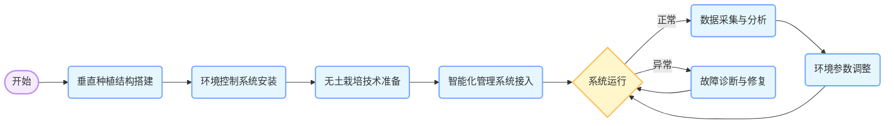

# 垂直农业技术的发展与投资前景

> 关键词：垂直农业技术、发展历程、投资前景、核心算法、应用场景

> 摘要：本文深入探讨了垂直农业技术的发展与投资前景。首先介绍了垂直农业技术的背景信息，包括目的和范围、预期读者、文档结构概述以及相关术语。接着阐述了垂直农业技术的核心概念、算法原理、数学模型等内容。通过项目实战案例，详细展示了垂直农业技术的代码实现与分析。同时，分析了垂直农业技术的实际应用场景，推荐了相关的学习资源、开发工具和论文著作。最后对垂直农业技术的未来发展趋势与挑战进行总结，并提供了常见问题解答和扩展阅读参考资料，旨在为读者全面了解垂直农业技术及其投资潜力提供专业的指导。

## 1. 背景介绍 
### 1.1 目的和范围
本文章的目的在于全面且深入地探讨垂直农业技术的发展状况以及其蕴含的投资前景。范围涵盖了垂直农业技术的核心概念、相关算法原理、数学模型、实际应用场景等技术层面，同时也包括开发环境搭建、代码实现与分析等项目实战内容，以及学习资源、开发工具、论文著作推荐等辅助知识，旨在为对垂直农业技术感兴趣的读者提供一个系统、全面的知识体系。

### 1.2 预期读者
本文预期读者主要包括从事农业科技领域的科研人员和技术开发者，他们可以从文章中获取垂直农业技术的最新研究成果和技术实现细节；对农业投资有兴趣的投资者，通过了解垂直农业技术的发展前景和投资潜力，为投资决策提供参考；农业相关专业的学生，可将本文作为学习垂直农业技术的参考资料，拓宽专业知识面；以及关注农业可持续发展的各界人士，以了解垂直农业技术在解决农业问题方面的作用和意义。

### 1.3 文档结构概述
本文将按照以下结构展开：首先介绍垂直农业技术的背景信息，让读者对文章的目的、范围、预期读者和整体结构有清晰的认识；接着阐述垂直农业技术的核心概念与联系，通过文本示意图和 Mermaid 流程图帮助读者理解；然后详细讲解核心算法原理和具体操作步骤，并结合 Python 源代码进行说明；随后介绍数学模型和公式，并举例说明其应用；通过项目实战展示代码实际案例和详细解释；分析垂直农业技术的实际应用场景；推荐相关的学习资源、开发工具和论文著作；最后总结垂直农业技术的未来发展趋势与挑战，提供常见问题解答和扩展阅读参考资料。

### 1.4 术语表
#### 1.4.1 核心术语定义
- **垂直农业**：是一种在垂直空间上进行农业生产的新型农业模式，通过利用多层建筑或垂直结构，在有限的空间内实现农作物的高效种植。
- **无土栽培**：不使用天然土壤，而是采用营养液或其他基质来提供植物生长所需养分和支撑的栽培方式。
- **环境控制系统**：用于调节垂直农业环境中的温度、湿度、光照、二氧化碳浓度等参数，以满足农作物生长需求的系统。

#### 1.4.2 相关概念解释
- **光照周期**：指植物在一天中接受光照和黑暗的时间长度，不同的农作物对光照周期有不同的要求，合理控制光照周期可以促进农作物的生长和发育。
- **营养液配方**：根据农作物的生长需求，将各种营养元素按照一定的比例和浓度配制成的溶液，为植物提供生长所需的养分。

#### 1.4.3 缩略词列表
- **LED**：Light Emitting Diode，发光二极管，在垂直农业中常用于提供植物生长所需的光照。
- **PLC**：Programmable Logic Controller，可编程逻辑控制器，用于实现垂直农业环境控制系统的自动化控制。

## 2. 核心概念与联系 
垂直农业技术的核心概念主要包括垂直种植结构、环境控制系统、无土栽培技术和智能化管理。

### 核心概念原理
- **垂直种植结构**：通过搭建多层的种植架，充分利用垂直空间，增加种植面积。例如，在城市中的高楼大厦内，可以设置多层的种植层，每层种植不同的农作物，提高土地利用率。
- **环境控制系统**：利用传感器实时监测垂直农业环境中的温度、湿度、光照、二氧化碳浓度等参数，并通过控制系统自动调节这些参数，为农作物创造适宜的生长环境。例如，当温度过高时，系统会自动启动降温设备；当光照不足时，会增加 LED 光照强度。
- **无土栽培技术**：不依赖传统土壤，而是使用营养液或其他基质（如岩棉、椰糠等）为植物提供养分和支撑。无土栽培可以避免土壤病虫害的影响，提高农作物的产量和质量。
- **智能化管理**：借助物联网、大数据和人工智能技术，对垂直农业的生产过程进行实时监控和管理。例如，通过数据分析可以预测农作物的生长情况，提前采取措施预防病虫害的发生。

### 架构的文本示意图
```plaintext
垂直农业系统
|-- 垂直种植结构
|   |-- 多层种植架
|   |-- 种植层布局
|-- 环境控制系统
|   |-- 传感器（温度、湿度、光照、CO2 浓度等）
|   |-- 控制器（PLC 等）
|   |-- 执行设备（空调、风机、LED 灯等）
|-- 无土栽培技术
|   |-- 营养液配方
|   |-- 基质选择
|-- 智能化管理
|   |-- 物联网平台
|   |-- 大数据分析
|   |-- 人工智能算法
```

### Mermaid 流程图


## 3. 核心算法原理 & 具体操作步骤 
### 核心算法原理
在垂直农业中，一个重要的算法是基于传感器数据的环境参数调节算法。该算法的核心思想是根据传感器采集到的温度、湿度、光照等环境参数，与农作物生长所需的理想参数进行比较，然后通过控制相应的执行设备来调整环境参数。

以下是一个简化的 Python 代码示例，用于模拟环境参数调节算法：
```python
# 定义农作物生长所需的理想环境参数
ideal_temperature = 25  # 理想温度，单位：摄氏度
ideal_humidity = 60  # 理想湿度，单位：百分比
ideal_light = 1000  # 理想光照强度，单位：勒克斯

# 模拟传感器数据采集
def collect_sensor_data():
    import random
    temperature = random.uniform(20, 30)  # 随机生成温度数据
    humidity = random.uniform(50, 70)  # 随机生成湿度数据
    light = random.uniform(800, 1200)  # 随机生成光照数据
    return temperature, humidity, light

# 环境参数调节算法
def adjust_environment(temperature, humidity, light):
    temperature_diff = temperature - ideal_temperature
    humidity_diff = humidity - ideal_humidity
    light_diff = light - ideal_light

    # 温度调节
    if temperature_diff > 0:
        print("温度过高，启动降温设备")
    elif temperature_diff < 0:
        print("温度过低，启动升温设备")

    # 湿度调节
    if humidity_diff > 0:
        print("湿度过高，启动除湿设备")
    elif humidity_diff < 0:
        print("湿度过低，启动加湿设备")

    # 光照调节
    if light_diff > 0:
        print("光照过强，降低光照强度")
    elif light_diff < 0:
        print("光照不足，增加光照强度")

# 主循环
while True:
    temperature, humidity, light = collect_sensor_data()
    print(f"当前温度: {temperature}°C，当前湿度: {humidity}%，当前光照: {light}lux")
    adjust_environment(temperature, humidity, light)
    import time
    time.sleep(5)  # 每隔 5 秒采集一次数据
```

### 具体操作步骤
1. **初始化理想环境参数**：根据不同农作物的生长需求，确定理想的温度、湿度、光照等环境参数。
2. **传感器数据采集**：使用各类传感器实时采集垂直农业环境中的实际环境参数。
3. **计算参数差值**：将采集到的实际参数与理想参数进行比较，计算出参数差值。
4. **执行设备控制**：根据参数差值，控制相应的执行设备（如空调、加湿器、LED 灯等）来调整环境参数。
5. **循环监测与调节**：持续循环执行上述步骤，实现对环境参数的实时监测和动态调节。

## 4. 数学模型和公式 & 详细讲解 & 举例说明 
### 数学模型
在垂直农业中，农作物的生长与环境参数之间存在着复杂的关系。可以用一个多元函数来描述这种关系：
$$G = f(T, H, L, C)$$
其中，$G$ 表示农作物的生长指标（如产量、品质等），$T$ 表示温度，$H$ 表示湿度，$L$ 表示光照强度，$C$ 表示二氧化碳浓度。

### 公式详细讲解
这个多元函数可以通过实验数据进行拟合，得到具体的表达式。例如，在一定的范围内，农作物的生长速度可能与温度、光照强度成正比，与湿度成反比。可以假设一个简单的线性关系：
$$G = aT + bL - cH + dC + e$$
其中，$a$、$b$、$c$、$d$ 是系数，$e$ 是常数。这些系数可以通过对大量实验数据进行线性回归分析得到。

### 举例说明
假设通过实验得到以下数据：

| 温度 ($T$) | 湿度 ($H$) | 光照强度 ($L$) | 二氧化碳浓度 ($C$) | 生长指标 ($G$) |
| ---- | ---- | ---- | ---- | ---- |
| 20 | 50 | 800 | 400 | 10 |
| 22 | 55 | 900 | 420 | 12 |
| 24 | 60 | 1000 | 440 | 15 |

使用 Python 的 `numpy` 库进行线性回归分析：
```python
import numpy as np

# 输入数据
X = np.array([[20, 50, 800, 400], [22, 55, 900, 420], [24, 60, 1000, 440]])
y = np.array([10, 12, 15])

# 线性回归
coefficients, residuals, rank, singular_values = np.linalg.lstsq(X, y, rcond=None)

print("系数:", coefficients)
```
运行上述代码后，可以得到系数 $a$、$b$、$c$、$d$ 的值，从而确定具体的数学模型。通过这个数学模型，可以预测不同环境参数下农作物的生长情况，为环境参数的调节提供依据。

## 5. 项目实战：代码实际案例和详细解释说明 
### 5.1  开发环境搭建
#### 硬件环境
- **传感器**：选择合适的温度传感器（如 DHT11、DS18B20）、湿度传感器、光照传感器（如 BH1750）和二氧化碳传感器（如 MH-Z19），用于采集环境参数。
- **控制器**：可以使用 Arduino 或 Raspberry Pi 作为控制器，实现对传感器数据的采集和执行设备的控制。
- **执行设备**：准备空调、加湿器、风机、LED 灯等执行设备，用于调节环境参数。

#### 软件环境
- **编程语言**：选择 Python 作为开发语言，因为 Python 具有丰富的库和易于学习的语法。
- **开发工具**：使用 PyCharm 或 Visual Studio Code 作为集成开发环境（IDE），方便代码的编写和调试。
- **物联网平台**：可以选择阿里云 IoT 平台或腾讯云 IoT 平台，实现传感器数据的上传和远程控制。

### 5.2  源代码详细实现和代码解读
以下是一个基于 Raspberry Pi 和 Python 的垂直农业环境监测与控制系统的代码示例：
```python
import time
import board
import adafruit_dht
import smbus

# 初始化 DHT11 传感器
dhtDevice = adafruit_dht.DHT11(board.D4)

# 初始化光照传感器
bus = smbus.SMBus(1)
DEVICE = 0x23  # 光照传感器地址
POWER_DOWN = 0x00  # 关机模式
POWER_ON = 0x01  # 开机模式
RESET = 0x07  # 重置数据寄存器值
CONTINUOUS_LOW_RES_MODE = 0x13  # 连续低分辨率模式
CONTINUOUS_HIGH_RES_MODE_1 = 0x10  # 连续高分辨率模式 1
CONTINUOUS_HIGH_RES_MODE_2 = 0x11  # 连续高分辨率模式 2
ONE_TIME_HIGH_RES_MODE_1 = 0x20  # 单次高分辨率模式 1
ONE_TIME_HIGH_RES_MODE_2 = 0x21  # 单次高分辨率模式 2
ONE_TIME_LOW_RES_MODE = 0x23  # 单次低分辨率模式

def convertToNumber(data):
    result = (data[1] + (256 * data[0])) / 1.2
    return (result)

def readLight(addr=DEVICE):
    data = bus.read_i2c_block_data(addr, ONE_TIME_HIGH_RES_MODE_1)
    return convertToNumber(data)

# 主循环
while True:
    try:
        # 读取温度和湿度数据
        temperature_c = dhtDevice.temperature
        humidity = dhtDevice.humidity

        # 读取光照强度数据
        light = readLight()

        print(f"温度: {temperature_c}°C，湿度: {humidity}%，光照强度: {light} lux")

        # 这里可以添加环境参数调节逻辑
        if temperature_c > 25:
            print("温度过高，启动降温设备")
        elif temperature_c < 20:
            print("温度过低，启动升温设备")

        if humidity > 60:
            print("湿度过高，启动除湿设备")
        elif humidity < 50:
            print("湿度过低，启动加湿设备")

        if light > 1200:
            print("光照过强，降低光照强度")
        elif light < 800:
            print("光照不足，增加光照强度")

    except RuntimeError as error:
        print(error.args[0])
        time.sleep(2.0)
        continue
    except Exception as error:
        dhtDevice.exit()
        raise error

    time.sleep(5.0)
```

### 代码解读与分析
- **传感器初始化**：使用 `adafruit_dht` 库初始化 DHT11 温度和湿度传感器，使用 `smbus` 库初始化光照传感器。
- **数据读取**：在主循环中，通过 `dhtDevice.temperature` 和 `dhtDevice.humidity` 读取温度和湿度数据，通过 `readLight` 函数读取光照强度数据。
- **环境参数调节逻辑**：根据读取到的环境参数，判断是否超出正常范围，并输出相应的调节指令。
- **异常处理**：使用 `try-except` 语句捕获可能出现的异常，如传感器读取错误等，并进行相应的处理。

## 6. 实际应用场景 
### 城市农业
在城市中，土地资源有限，垂直农业可以利用高楼大厦的闲置空间或地下室等场所进行农作物种植。例如，在城市的商业中心或居民区附近建立垂直农场，为居民提供新鲜的蔬菜和水果，减少农产品的运输距离，降低运输成本和环境污染。

### 太空农业
随着人类对太空探索的不断深入，太空农业成为解决宇航员食物供应的重要途径。垂直农业技术可以在太空舱内实现农作物的种植，为宇航员提供新鲜的食物。例如，国际空间站已经开展了一些太空植物种植实验，使用垂直农业技术为宇航员提供了少量的蔬菜。

### 沙漠农业
在沙漠地区，水资源匮乏，土地贫瘠，传统农业难以发展。垂直农业可以通过无土栽培和精准的环境控制技术，在沙漠中建立高效的农业生产系统。例如，在中东的一些沙漠国家，已经开始建设垂直农场，利用海水淡化技术提供水源，种植蔬菜和水果，实现了沙漠地区的农业自给自足。

### 极地农业
在极地地区，气候寒冷，光照时间短，不适合传统农业生产。垂直农业可以通过人工光照和温度控制技术，在极地地区建立农业生产基地。例如，在南极的科考站，已经开始尝试使用垂直农业技术种植蔬菜，为科考人员提供新鲜的食物。

## 7. 工具和资源推荐
### 7.1 学习资源推荐
#### 7.1.1 书籍推荐
- 《垂直农业：养活世界的革命》：本书详细介绍了垂直农业的概念、技术和发展前景，是了解垂直农业的经典著作。
- 《无土栽培技术》：系统阐述了无土栽培的原理、方法和实践经验，对于学习垂直农业中的无土栽培技术有很大帮助。
- 《农业物联网技术》：介绍了物联网技术在农业领域的应用，包括传感器技术、数据传输和处理等方面，与垂直农业的智能化管理密切相关。

#### 7.1.2 在线课程
- Coursera 上的 “Agricultural Technology and Innovation” 课程：由知名农业专家授课，涵盖了农业科技的多个方面，包括垂直农业技术。
- edX 上的 “Sustainable Agriculture and Food Systems” 课程：从可持续发展的角度探讨农业技术，对垂直农业的发展有深入的分析。

#### 7.1.3 技术博客和网站
- 垂直农业网：提供垂直农业的最新技术、项目案例和行业动态。
- 农业物联网资讯网：专注于农业物联网技术的报道和分析，与垂直农业的智能化管理密切相关。

### 7.2 开发工具框架推荐
#### 7.2.1 IDE和编辑器
- PyCharm：功能强大的 Python 集成开发环境，提供代码编辑、调试、版本控制等功能，适合开发垂直农业相关的 Python 代码。
- Visual Studio Code：轻量级的代码编辑器，支持多种编程语言，具有丰富的插件扩展功能，可以满足不同的开发需求。

#### 7.2.2 调试和性能分析工具
- pdb：Python 自带的调试工具，可以帮助开发者定位代码中的错误。
- cProfile：Python 的性能分析工具，可以分析代码的执行时间和资源消耗情况，优化代码性能。

#### 7.2.3 相关框架和库
- Django：一个高级的 Python Web 框架，可以用于开发垂直农业的物联网平台和管理系统。
- Flask：轻量级的 Python Web 框架，适合快速开发小型的垂直农业应用程序。
- numpy 和 pandas：用于数据处理和分析的 Python 库，可以对传感器采集到的数据进行处理和分析。

### 7.3 相关论文著作推荐
#### 7.3.1 经典论文
- “Vertical Farming: A Solution for Urban Agriculture?”：该论文探讨了垂直农业在城市农业中的应用前景和挑战。
- “Hydroponics: A Sustainable Solution for Food Production”：介绍了无土栽培技术在垂直农业中的应用和优势。

#### 7.3.2 最新研究成果
- 关注《Agricultural and Forest Meteorology》《Journal of Cleaner Production》等学术期刊，这些期刊经常发表关于垂直农业技术的最新研究成果。

#### 7.3.3 应用案例分析
- 可以在 IEEE Xplore、ACM Digital Library 等数据库中搜索垂直农业的应用案例分析论文，了解实际项目中的技术应用和经验教训。

## 8. 总结：未来发展趋势与挑战
### 未来发展趋势
- **智能化程度不断提高**：随着物联网、大数据和人工智能技术的不断发展，垂直农业的智能化管理将更加完善。例如，通过人工智能算法可以实现对农作物生长的精准预测和自动控制，提高生产效率和质量。
- **与其他产业融合发展**：垂直农业将与城市规划、建筑设计、物流配送等产业深度融合。例如，在城市建设中，可以将垂直农场与商业建筑、住宅等相结合，实现农业与城市的和谐发展。
- **可持续发展成为主流**：垂直农业将更加注重资源的高效利用和环境保护。例如，采用可再生能源（如太阳能、风能）为垂直农场供电，减少对传统能源的依赖；推广循环水利用技术，降低水资源的消耗。

### 挑战
- **技术成本较高**：目前，垂直农业技术的研发和应用成本较高，包括设备购置、能源消耗、技术维护等方面。这限制了垂直农业的大规模推广和应用。
- **技术标准不完善**：垂直农业作为一种新兴的农业模式，相关的技术标准和规范还不够完善。这导致不同企业和项目之间的技术水平和产品质量存在差异，影响了行业的健康发展。
- **消费者认知度不足**：部分消费者对垂直农业产品的认知度和接受度较低，认为其口感和品质不如传统农产品。需要加强对垂直农业的宣传和推广，提高消费者的认知度和信任度。

## 9. 附录：常见问题与解答
### 垂直农业的产量能达到传统农业的水平吗？
在合理的环境控制和种植管理下，垂直农业的单位面积产量可以达到甚至超过传统农业。因为垂直农业可以充分利用垂直空间，增加种植密度，同时通过精准的环境控制和营养液供应，为农作物提供最佳的生长条件。

### 垂直农业的能源消耗大吗？
垂直农业的能源消耗主要集中在光照、温度和湿度控制等方面。虽然与传统农业相比，垂直农业的能源消耗相对较高，但随着技术的不断进步，如采用高效的 LED 光照系统和节能的环境控制设备，可以有效降低能源消耗。

### 垂直农业产品的安全性如何？
垂直农业采用无土栽培和封闭的环境控制技术，可以避免土壤污染和病虫害的影响，减少农药和化肥的使用。因此，垂直农业产品的安全性相对较高。

### 投资垂直农业有哪些风险？
投资垂直农业的风险主要包括技术风险、市场风险和政策风险。技术风险主要是指垂直农业技术还不够成熟，可能存在设备故障、技术难题等问题；市场风险主要是指消费者对垂直农业产品的接受度和市场需求不确定；政策风险主要是指相关政策的变化可能对垂直农业的发展产生影响。

## 10. 扩展阅读 & 参考资料
### 扩展阅读
- 《未来农业：科技驱动的农业革命》：探讨了未来农业的发展趋势和科技应用，对垂直农业的未来发展有一定的启示。
- 《农业可持续发展研究》：从可持续发展的角度分析农业发展面临的问题和解决方案，与垂直农业的发展理念相契合。

### 参考资料
- 相关学术期刊和会议论文
- 行业报告和统计数据
- 垂直农业企业的官方网站和技术文档

作者：AI天才研究院/AI Genius Institute & 禅与计算机程序设计艺术 /Zen And The Art of Computer Programming