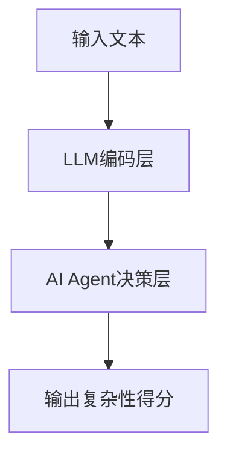

# 基于LLM的AI Agent文本复杂性评估

> 关键词：大语言模型（LLM）、AI Agent、文本复杂性评估、自然语言处理、语义理解

> 摘要：本文聚焦于基于大语言模型（LLM）的AI Agent文本复杂性评估。随着大语言模型和AI Agent技术的迅速发展，对文本复杂性进行准确评估变得愈发重要。文章将详细介绍相关核心概念、算法原理、数学模型，通过实际案例展示如何运用这些技术进行文本复杂性评估，探讨其在多个实际场景中的应用，同时推荐了学习资源、开发工具和相关论文著作。最后，对该领域的未来发展趋势与挑战进行总结，并提供常见问题解答和扩展阅读参考资料。

## 1. 背景介绍 
### 1.1 目的和范围
在当今信息爆炸的时代，文本数据呈现出指数级增长。大语言模型（LLM）如GPT - 3、ChatGPT等的出现，使得AI Agent在自然语言处理任务中得到了广泛应用。然而，不同的文本具有不同的复杂性，准确评估文本复杂性对于AI Agent的文本理解、信息提取、生成回复等任务至关重要。本文的目的在于深入探讨如何利用LLM来构建AI Agent进行文本复杂性评估，涵盖从核心概念到实际应用的各个方面，包括算法原理、数学模型、实际案例等。

### 1.2 预期读者
本文预期读者包括自然语言处理领域的研究人员、AI开发工程师、对大语言模型和AI Agent感兴趣的技术爱好者以及希望将文本复杂性评估应用于实际业务的从业者。通过阅读本文，读者能够系统地了解基于LLM的AI Agent文本复杂性评估的原理、方法和应用。

### 1.3 文档结构概述
本文将按照以下结构展开：首先介绍核心概念与联系，明确相关术语和概念之间的关系；接着阐述核心算法原理和具体操作步骤，并通过Python代码详细说明；然后介绍数学模型和公式，结合具体例子进行讲解；之后通过项目实战展示代码的实际应用和详细解释；再探讨实际应用场景；随后推荐学习资源、开发工具和相关论文著作；最后总结未来发展趋势与挑战，提供常见问题解答和扩展阅读参考资料。

### 1.4 术语表
#### 1.4.1 核心术语定义
- **大语言模型（LLM）**：是一种基于深度学习的自然语言处理模型，通过在大规模文本数据上进行训练，学习语言的模式和规律，能够生成自然流畅的文本、回答问题、进行语言翻译等。
- **AI Agent**：是一种能够感知环境、进行决策并采取行动的智能实体。在自然语言处理领域，AI Agent可以与用户进行交互，处理文本信息。
- **文本复杂性评估**：指对文本的难易程度、理解复杂度进行量化评估的过程，考虑的因素包括词汇难度、句子结构、语义深度等。

#### 1.4.2 相关概念解释
- **自然语言处理（NLP）**：是计算机科学与人工智能领域中的一个重要方向，研究如何让计算机理解、处理和生成人类语言。
- **语义理解**：是指计算机对文本所表达的含义进行理解的过程，包括识别文本中的实体、关系和意图等。

#### 1.4.3 缩略词列表
- **LLM**：Large Language Model（大语言模型）
- **NLP**：Natural Language Processing（自然语言处理）

## 2. 核心概念与联系 

### 核心概念原理
基于LLM的AI Agent文本复杂性评估主要基于以下几个核心概念：

#### 大语言模型（LLM）
LLM通过大量的文本数据进行预训练，学习到了丰富的语言知识和模式。它可以对输入的文本进行编码，将文本转换为向量表示，以便后续的处理和分析。例如，GPT系列模型采用了Transformer架构，通过多头注意力机制捕捉文本中的长距离依赖关系，从而能够更好地理解文本的语义。

#### AI Agent
AI Agent利用LLM的能力，结合自身的决策和推理机制，对文本复杂性进行评估。它可以根据文本的特征，如词汇、句子结构、语义等，运用一定的算法计算出文本的复杂程度得分。AI Agent可以不断学习和优化，提高评估的准确性。

#### 文本复杂性评估指标
常见的文本复杂性评估指标包括：
- **词汇难度**：可以通过词汇的频率、词长、语义复杂度等因素来衡量。例如，生僻词的出现会增加文本的复杂性。
- **句子结构复杂度**：包括句子的长度、嵌套层次、语法结构的复杂程度等。长句子和复杂的嵌套结构会使文本更难理解。
- **语义深度**：指文本所表达的含义的复杂程度，涉及到概念的抽象程度、逻辑关系的复杂度等。

### 架构的文本示意图
```plaintext
+-----------------+
|  输入文本        |
+-----------------+
       |
       v
+-----------------+
|  LLM 编码层      |
| （将文本转换为向量） |
+-----------------+
       |
       v
+-----------------+
|  AI Agent决策层  |
| （计算文本复杂性得分） |
+-----------------+
       |
       v
+-----------------+
|  输出复杂性得分  |
+-----------------+
```

### Mermaid流程图


## 3. 核心算法原理 & 具体操作步骤 

### 核心算法原理
基于LLM的AI Agent文本复杂性评估可以采用以下算法原理：

#### 特征提取
利用LLM对输入文本进行编码，提取文本的特征向量。这些特征向量包含了文本的语义信息和语言结构信息。例如，可以使用预训练的BERT模型对文本进行编码，得到每个词的嵌入向量，然后将这些向量进行聚合，得到整个文本的特征向量。

#### 复杂性得分计算
根据提取的特征向量，AI Agent可以使用机器学习模型（如线性回归、决策树等）或深度学习模型（如多层感知机）来计算文本的复杂性得分。在训练过程中，可以使用标注好的文本数据，将文本的实际复杂性得分作为标签，对模型进行训练。

### 具体操作步骤
以下是基于Python和Hugging Face Transformers库实现文本复杂性评估的具体步骤：

```python
import torch
from transformers import AutoTokenizer, AutoModel

# 步骤1：加载预训练的LLM模型和分词器
model_name = 'bert-base-uncased'
tokenizer = AutoTokenizer.from_pretrained(model_name)
model = AutoModel.from_pretrained(model_name)

# 步骤2：定义输入文本
text = "This is a sample text for complexity evaluation."

# 步骤3：对文本进行分词
inputs = tokenizer(text, return_tensors='pt')

# 步骤4：使用LLM模型进行编码
with torch.no_grad():
    outputs = model(**inputs)

# 步骤5：提取文本的特征向量
# 这里取[CLS]标记的输出作为整个文本的特征向量
features = outputs.last_hidden_state[:, 0, :]

# 步骤6：假设我们有一个已经训练好的线性回归模型来计算复杂性得分
# 这里简单模拟一个线性回归模型的权重和偏置
weights = torch.randn(features.shape[1], 1)
bias = torch.randn(1)

# 步骤7：计算复杂性得分
complexity_score = torch.matmul(features, weights) + bias
print("文本复杂性得分:", complexity_score.item())
```

### 代码解释
1. **加载预训练的LLM模型和分词器**：使用Hugging Face Transformers库加载预训练的BERT模型和对应的分词器。
2. **定义输入文本**：将需要评估复杂性的文本作为输入。
3. **对文本进行分词**：使用分词器将文本转换为模型可以接受的输入格式。
4. **使用LLM模型进行编码**：将分词后的输入传递给BERT模型，得到模型的输出。
5. **提取文本的特征向量**：取[CLS]标记的输出作为整个文本的特征向量。
6. **模拟线性回归模型**：简单模拟一个线性回归模型的权重和偏置。
7. **计算复杂性得分**：使用特征向量和线性回归模型的参数计算文本的复杂性得分。

## 4. 数学模型和公式 & 详细讲解 & 举例说明 

### 数学模型
基于LLM的AI Agent文本复杂性评估可以使用线性回归模型来计算文本的复杂性得分。线性回归模型的数学表达式为：

$$y = \mathbf{w}^T\mathbf{x} + b$$

其中，$y$ 是文本的复杂性得分，$\mathbf{w}$ 是权重向量，$\mathbf{x}$ 是文本的特征向量，$b$ 是偏置项。

### 详细讲解
- **特征向量 $\mathbf{x}$**：通过LLM对文本进行编码得到，包含了文本的语义和语言结构信息。
- **权重向量 $\mathbf{w}$**：是线性回归模型的参数，通过训练得到。权重向量的每个元素表示对应特征对文本复杂性得分的贡献程度。
- **偏置项 $b$**：是一个常数，用于调整模型的输出。

### 举例说明
假设我们有一个简单的文本“Hello, world!”，经过LLM编码后得到的特征向量 $\mathbf{x} = [0.1, 0.2, 0.3]$，权重向量 $\mathbf{w} = [0.2, 0.3, 0.4]^T$，偏置项 $b = 0.1$。则文本的复杂性得分 $y$ 可以计算如下：

$$
\begin{align*}
y &= \mathbf{w}^T\mathbf{x} + b \\
&= [0.2, 0.3, 0.4] \begin{bmatrix}0.1 \\ 0.2 \\ 0.3\end{bmatrix} + 0.1 \\
&= 0.2\times0.1 + 0.3\times0.2 + 0.4\times0.3 + 0.1 \\
&= 0.02 + 0.06 + 0.12 + 0.1 \\
&= 0.3
\end{align*}
$$

因此，文本“Hello, world!”的复杂性得分是0.3。

## 5. 项目实战：代码实际案例和详细解释说明 

### 5.1  开发环境搭建
#### 安装Python
确保你已经安装了Python 3.6或更高版本。可以从Python官方网站（https://www.python.org/downloads/）下载并安装。

#### 安装必要的库
使用以下命令安装Hugging Face Transformers库和PyTorch：
```sh
pip install transformers torch
```

### 5.2  源代码详细实现和代码解读
```python
import torch
from transformers import AutoTokenizer, AutoModel
from sklearn.linear_model import LinearRegression
import numpy as np

# 步骤1：加载预训练的LLM模型和分词器
model_name = 'bert-base-uncased'
tokenizer = AutoTokenizer.from_pretrained(model_name)
model = AutoModel.from_pretrained(model_name)

# 步骤2：准备训练数据
# 假设我们有一些标注好的文本数据和对应的复杂性得分
texts = [
    "This is a simple sentence.",
    "The complex mathematical problem requires advanced knowledge.",
    "A short text for testing."
]
labels = [0.2, 0.8, 0.3]

# 步骤3：提取特征向量
features = []
for text in texts:
    inputs = tokenizer(text, return_tensors='pt')
    with torch.no_grad():
        outputs = model(**inputs)
    feature = outputs.last_hidden_state[:, 0, :].numpy()
    features.append(feature.flatten())
features = np.array(features)

# 步骤4：训练线性回归模型
reg = LinearRegression()
reg.fit(features, labels)

# 步骤5：定义待评估的文本
new_text = "This is a new text to evaluate its complexity."

# 步骤6：提取新文本的特征向量
inputs = tokenizer(new_text, return_tensors='pt')
with torch.no_grad():
    outputs = model(**inputs)
new_feature = outputs.last_hidden_state[:, 0, :].numpy().flatten()

# 步骤7：使用训练好的模型计算复杂性得分
complexity_score = reg.predict([new_feature])[0]
print("新文本的复杂性得分:", complexity_score)
```

### 5.3  代码解读与分析
1. **加载预训练的LLM模型和分词器**：使用Hugging Face Transformers库加载预训练的BERT模型和对应的分词器。
2. **准备训练数据**：准备一些标注好的文本数据和对应的复杂性得分，用于训练线性回归模型。
3. **提取特征向量**：对每个文本进行分词，使用BERT模型进行编码，提取[CLS]标记的输出作为文本的特征向量。
4. **训练线性回归模型**：使用提取的特征向量和对应的复杂性得分训练线性回归模型。
5. **定义待评估的文本**：选择一个新的文本，需要评估其复杂性。
6. **提取新文本的特征向量**：对新文本进行分词，使用BERT模型进行编码，提取[CLS]标记的输出作为新文本的特征向量。
7. **使用训练好的模型计算复杂性得分**：将新文本的特征向量输入到训练好的线性回归模型中，计算出文本的复杂性得分。

## 6. 实际应用场景 
### 教育领域
在教育领域，文本复杂性评估可以用于教材编写、阅读材料分级、学生作文评估等。例如，教师可以根据文本的复杂性得分选择适合学生阅读水平的教材，帮助学生逐步提高阅读能力。同时，在评估学生作文时，可以使用文本复杂性评估指标来评价作文的难度和质量。

### 信息检索与推荐
在信息检索和推荐系统中，文本复杂性评估可以用于对搜索结果和推荐内容进行排序。对于用户来说，他们可能更倾向于阅读复杂度适中的文本。因此，系统可以根据文本的复杂性得分对搜索结果进行排序，优先展示复杂度合适的文本。

### 自然语言生成
在自然语言生成任务中，如机器翻译、文本摘要等，文本复杂性评估可以用于控制生成文本的难度。例如，在机器翻译中，可以根据目标用户的语言水平，生成复杂度适中的翻译文本。

### 无障碍阅读
对于视力障碍者或阅读能力较低的人群，文本复杂性评估可以用于对文本进行简化和调整。通过评估文本的复杂性，系统可以将复杂的文本转换为更易于理解的形式，提高这些人群的阅读体验。

## 7. 工具和资源推荐
### 7.1 学习资源推荐
#### 7.1.1 书籍推荐
- 《自然语言处理入门》：介绍了自然语言处理的基本概念、算法和技术，适合初学者入门。
- 《深度学习》：详细讲解了深度学习的原理和方法，对于理解大语言模型的工作原理有很大帮助。
- 《Python自然语言处理实战》：通过实际案例介绍了如何使用Python进行自然语言处理任务，包括文本复杂性评估。

#### 7.1.2 在线课程
- Coursera上的“Natural Language Processing Specialization”：由知名教授授课，系统地介绍了自然语言处理的各个方面。
- edX上的“Deep Learning for Natural Language Processing”：专注于深度学习在自然语言处理中的应用。

#### 7.1.3 技术博客和网站
- Hugging Face博客（https://huggingface.co/blog）：提供了关于大语言模型和自然语言处理的最新技术和研究成果。
- Towards Data Science（https://towardsdatascience.com/）：有许多关于自然语言处理和机器学习的优质文章。

### 7.2 开发工具框架推荐
#### 7.2.1 IDE和编辑器
- PyCharm：是一款功能强大的Python集成开发环境，提供了代码编辑、调试、版本控制等功能。
- Jupyter Notebook：适合进行交互式编程和数据分析，方便展示代码和结果。

#### 7.2.2 调试和性能分析工具
- TensorBoard：可以用于可视化深度学习模型的训练过程和性能指标。
- Py-Spy：用于分析Python代码的性能瓶颈。

#### 7.2.3 相关框架和库
- Hugging Face Transformers：提供了丰富的预训练模型和工具，方便进行自然语言处理任务。
- Scikit-learn：是一个常用的机器学习库，提供了各种机器学习算法和工具。

### 7.3 相关论文著作推荐
#### 7.3.1 经典论文
- “Attention Is All You Need”：介绍了Transformer架构，是大语言模型的基础。
- “BERT: Pre-training of Deep Bidirectional Transformers for Language Understanding”：提出了BERT模型，在自然语言处理领域取得了巨大成功。

#### 7.3.2 最新研究成果
- 可以关注ACL（Association for Computational Linguistics）、EMNLP（Conference on Empirical Methods in Natural Language Processing）等自然语言处理领域的顶级会议，获取最新的研究成果。

#### 7.3.3 应用案例分析
- 一些知名科技公司的博客文章会分享他们在自然语言处理领域的应用案例，如Google、Microsoft等公司的博客。

## 8. 总结：未来发展趋势与挑战
### 未来发展趋势
- **多模态融合**：未来的文本复杂性评估可能会结合图像、音频等多模态信息，更全面地评估文本的复杂性。例如，在评估一篇包含图片和文字的文章时，考虑图片对文本理解的影响。
- **个性化评估**：根据用户的阅读习惯、知识水平等因素进行个性化的文本复杂性评估。不同用户对同一文本的理解难度可能不同，个性化评估可以提供更精准的结果。
- **实时评估**：在实时交互场景中，如聊天机器人、实时翻译等，需要实时评估文本的复杂性，以便及时调整回复策略。

### 挑战
- **数据标注困难**：文本复杂性评估需要大量标注好的数据进行训练，但数据标注是一项耗时耗力的工作，且不同标注者之间可能存在标注差异。
- **语义理解的局限性**：尽管大语言模型在语义理解方面取得了很大进展，但仍然存在一些局限性，如对隐喻、歧义等语义的理解不够准确，这会影响文本复杂性评估的准确性。
- **计算资源需求大**：使用大语言模型进行文本复杂性评估需要大量的计算资源，对于一些资源受限的设备和场景，应用起来可能存在困难。

## 9. 附录：常见问题与解答
### 问题1：如何选择合适的LLM模型进行文本复杂性评估？
解答：可以根据任务的需求和数据的特点选择合适的LLM模型。如果数据是英文文本，可以选择BERT、GPT等预训练模型；如果是中文文本，可以选择中文BERT、ERNIE等模型。同时，还可以考虑模型的大小和计算资源的限制。

### 问题2：文本复杂性评估的结果是否准确？
解答：文本复杂性评估的结果受到多种因素的影响，如模型的选择、特征提取方法、训练数据的质量等。目前的方法虽然取得了一定的效果，但仍然存在一定的误差。可以通过不断优化模型和方法，提高评估结果的准确性。

### 问题3：如何处理不同领域的文本复杂性评估？
解答：不同领域的文本具有不同的特点和语言风格，可以针对不同领域的数据进行单独训练，或者使用领域自适应技术，将预训练模型调整到适合特定领域的文本复杂性评估任务。

## 10. 扩展阅读 & 参考资料
- 《自然语言处理：理论与实践》
- ACL Anthology（https://aclanthology.org/）
- Hugging Face官方文档（https://huggingface.co/docs/transformers/index）

作者：AI天才研究院/AI Genius Institute & 禅与计算机程序设计艺术 /Zen And The Art of Computer Programming