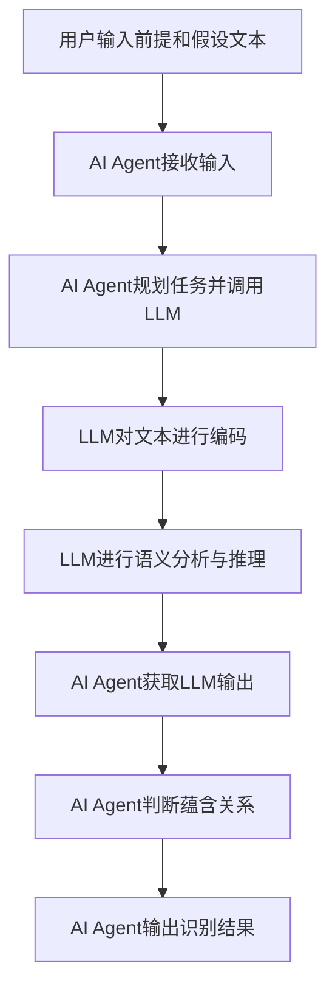

# 基于LLM的AI Agent文本蕴含识别

> 关键词：大语言模型（LLM）、AI Agent、文本蕴含识别、自然语言处理、推理算法

> 摘要：本文聚焦于基于大语言模型（LLM）的AI Agent在文本蕴含识别领域的应用。首先介绍了相关背景知识，包括研究目的、预期读者和文档结构等。接着阐述了核心概念及其联系，给出了原理和架构的示意图与流程图。详细讲解了核心算法原理及具体操作步骤，并使用Python代码进行说明。同时，介绍了相关数学模型和公式，结合实例帮助理解。通过项目实战展示了代码实现及解读。探讨了实际应用场景，推荐了学习、开发相关的工具和资源。最后总结了未来发展趋势与挑战，并提供了常见问题解答和扩展阅读参考资料，旨在为研究者和开发者深入了解和应用基于LLM的AI Agent进行文本蕴含识别提供全面的指导。

## 1. 背景介绍 
### 1.1 目的和范围
文本蕴含识别是自然语言处理中的一个重要任务，旨在判断一个文本（前提）是否蕴含另一个文本（假设）。随着大语言模型（LLM）的发展，其强大的语言理解和生成能力为文本蕴含识别带来了新的机遇。本文章的目的在于深入探讨如何利用基于LLM的AI Agent来实现高效准确的文本蕴含识别。研究范围涵盖了从核心概念的理解、算法原理的剖析、实际项目的开发，到应用场景的分析等多个方面，全面展示基于LLM的AI Agent在文本蕴含识别中的应用全貌。

### 1.2 预期读者
本文的预期读者主要包括自然语言处理领域的研究者、人工智能相关专业的学生、从事文本分析和处理的开发者，以及对基于LLM的AI Agent技术在文本蕴含识别应用感兴趣的技术爱好者。无论您是初学者希望了解相关基础知识，还是有一定经验的专业人士想要深入研究具体算法和应用，本文都能为您提供有价值的信息。

### 1.3 文档结构概述
本文将按照以下结构展开：首先介绍相关背景知识，包括目的、读者群体和文档结构等内容。接着详细阐述核心概念及其联系，通过示意图和流程图帮助读者理解。然后深入讲解核心算法原理和具体操作步骤，并使用Python代码进行说明。同时，介绍相关数学模型和公式，结合实例加深理解。通过项目实战部分展示代码的实际实现和解读。之后探讨基于LLM的AI Agent文本蕴含识别的实际应用场景。推荐学习、开发相关的工具和资源。最后总结未来发展趋势与挑战，提供常见问题解答和扩展阅读参考资料。

### 1.4 术语表
#### 1.4.1 核心术语定义
- **大语言模型（LLM）**：是一种基于深度学习的语言模型，通过在大规模文本数据上进行训练，学习语言的模式和规律，能够生成自然流畅的文本，具有强大的语言理解和生成能力，如GPT - 3、ChatGPT等。
- **AI Agent**：是一种能够感知环境、自主决策并采取行动以实现特定目标的智能实体。在自然语言处理领域，基于LLM的AI Agent可以利用LLM的能力进行文本处理和推理，完成各种语言相关的任务。
- **文本蕴含识别**：判断一个文本（前提）是否在逻辑上蕴含另一个文本（假设）。如果前提文本的含义能够推出假设文本的含义，则认为存在蕴含关系；反之，则不存在。

#### 1.4.2 相关概念解释
- **自然语言处理（NLP）**：是计算机科学与人工智能领域的一个重要分支，研究如何让计算机理解、处理和生成人类语言。文本蕴含识别是自然语言处理中的一个具体任务，旨在解决语言中的语义推理问题。
- **语义理解**：指计算机对文本所表达的含义的理解能力。在文本蕴含识别中，需要对前提和假设文本的语义进行准确理解，才能判断它们之间的蕴含关系。

#### 1.4.3 缩略词列表
- **LLM**：Large Language Model（大语言模型）
- **NLP**：Natural Language Processing（自然语言处理）

## 2. 核心概念与联系 

### 核心概念原理
基于LLM的AI Agent文本蕴含识别的核心原理是利用大语言模型强大的语言理解和生成能力，结合AI Agent的自主决策和推理机制，对前提文本和假设文本进行处理和分析，从而判断它们之间是否存在蕴含关系。

大语言模型通过在大规模文本数据上进行预训练，学习到了丰富的语言知识和语义信息。当输入前提和假设文本时，LLM能够对文本进行编码，将其转换为向量表示，然后根据这些向量进行语义分析和推理。

AI Agent则负责与LLM进行交互，根据任务需求向LLM发送合适的输入，并对LLM的输出进行处理和判断。AI Agent可以根据不同的策略和规则，决定如何调用LLM的能力，以提高文本蕴含识别的准确性和效率。

### 架构的文本示意图
```plaintext
+---------------------+
|     用户输入       |
| （前提文本、假设文本） |
+---------------------+
          |
          v
+---------------------+
|      AI Agent       |
|  - 任务规划与决策    |
|  - 与LLM交互控制    |
+---------------------+
          |
          v
+---------------------+
|       LLM           |
|  - 文本编码         |
|  - 语义分析与推理   |
+---------------------+
          |
          v
+---------------------+
|    AI Agent处理输出 |
|  - 判断蕴含关系     |
|  - 输出结果         |
+---------------------+
```

### Mermaid流程图


## 3. 核心算法原理 & 具体操作步骤 

### 核心算法原理
基于LLM的AI Agent文本蕴含识别的核心算法主要包括以下几个步骤：

1. **文本编码**：将前提文本和假设文本输入到LLM中，LLM将文本转换为向量表示。例如，使用预训练的Transformer模型，将每个词转换为词向量，然后通过多层的Transformer层进行特征提取，得到整个文本的向量表示。

2. **特征融合**：将前提文本和假设文本的向量表示进行融合，以便模型能够同时考虑两者的信息。常见的融合方法包括拼接、相加、相减等。

3. **语义推理**：利用LLM的推理能力，对融合后的特征进行分析，判断前提文本是否蕴含假设文本。可以通过在LLM的输出层添加一个分类器，将其转换为一个二分类问题（蕴含或不蕴含）。

### 具体操作步骤

#### 步骤1：安装必要的库
```python
import torch
from transformers import AutoTokenizer, AutoModelForSequenceClassification

# 这里以Hugging Face的transformers库为例
```

#### 步骤2：加载预训练模型和分词器
```python
# 选择合适的预训练模型，如roberta-large-mnli
model_name = "roberta-large-mnli"
tokenizer = AutoTokenizer.from_pretrained(model_name)
model = AutoModelForSequenceClassification.from_pretrained(model_name)
```

#### 步骤3：准备输入文本
```python
premise = "The dog is chasing the cat."
hypothesis = "The cat is being chased by the dog."

# 对文本进行分词
inputs = tokenizer(premise, hypothesis, return_tensors="pt")
```

#### 步骤4：进行推理
```python
# 使用模型进行推理
with torch.no_grad():
    outputs = model(**inputs)

# 获取预测结果
logits = outputs.logits
predicted_class_id = logits.argmax().item()
labels = model.config.id2label
predicted_label = labels[predicted_class_id]

print(f"预测结果: {predicted_label}")
```

## 4. 数学模型和公式 & 详细讲解 & 举例说明 

### 数学模型和公式
在基于LLM的AI Agent文本蕴含识别中，主要涉及到以下数学模型和公式。

#### 文本编码
假设输入的前提文本为 $P = \{p_1, p_2, \cdots, p_m\}$，假设文本为 $H = \{h_1, h_2, \cdots, h_n\}$，其中 $p_i$ 和 $h_j$ 分别表示前提文本和假设文本中的第 $i$ 个和第 $j$ 个词。

使用预训练的Transformer模型进行文本编码，将每个词转换为词向量。设词嵌入矩阵为 $E \in \mathbb{R}^{|V| \times d}$，其中 $|V|$ 是词汇表的大小，$d$ 是词向量的维度。则前提文本和假设文本的词向量表示分别为：

$$
\mathbf{P}_{vec} = [E(p_1), E(p_2), \cdots, E(p_m)]
$$

$$
\mathbf{H}_{vec} = [E(h_1), E(h_2), \cdots, E(h_n)]
$$

经过Transformer层的特征提取后，得到前提文本和假设文本的上下文向量表示 $\mathbf{P}_{ctx}$ 和 $\mathbf{H}_{ctx}$。

#### 特征融合
将前提文本和假设文本的上下文向量进行融合，常见的拼接融合方法可以表示为：

$$
\mathbf{F} = [\mathbf{P}_{ctx}; \mathbf{H}_{ctx}]
$$

其中 $[\cdot; \cdot]$ 表示向量的拼接操作。

#### 语义推理
在LLM的输出层添加一个全连接层作为分类器，将融合后的特征 $\mathbf{F}$ 映射到分类标签空间。设分类器的权重矩阵为 $W \in \mathbb{R}^{C \times D}$，偏置向量为 $\mathbf{b} \in \mathbb{R}^{C}$，其中 $C$ 是分类的类别数（这里为2，即蕴含和不蕴含），$D$ 是融合特征的维度。则分类器的输出为：

$$
\mathbf{z} = W\mathbf{F} + \mathbf{b}
$$

使用softmax函数将输出 $\mathbf{z}$ 转换为概率分布：

$$
\mathbf{y} = \text{softmax}(\mathbf{z})
$$

其中 $\text{softmax}(z_i) = \frac{e^{z_i}}{\sum_{j=1}^{C} e^{z_j}}$。

### 详细讲解
- **文本编码**：通过词嵌入将文本中的每个词转换为低维向量，然后利用Transformer的自注意力机制捕捉词与词之间的上下文关系，得到更具语义信息的上下文向量表示。
- **特征融合**：将前提文本和假设文本的上下文向量进行融合，使模型能够同时考虑两者的信息，有助于更准确地判断蕴含关系。
- **语义推理**：使用全连接层和softmax函数将融合后的特征映射到分类标签空间，得到每个类别的概率，从而进行分类决策。

### 举例说明
假设前提文本 $P$ 为 "The boy is playing football."，假设文本 $H$ 为 "A child is engaged in a football game."。

经过词嵌入和Transformer层的处理，得到前提文本的上下文向量 $\mathbf{P}_{ctx}$ 和假设文本的上下文向量 $\mathbf{H}_{ctx}$。将它们拼接得到融合特征 $\mathbf{F}$。

假设分类器的权重矩阵 $W$ 和偏置向量 $\mathbf{b}$ 已经训练好，计算 $\mathbf{z} = W\mathbf{F} + \mathbf{b}$，然后通过softmax函数得到概率分布 $\mathbf{y}$。如果 $\mathbf{y}$ 中蕴含类别的概率大于不蕴含类别的概率，则判断前提文本蕴含假设文本。

## 5. 项目实战：代码实际案例和详细解释说明 

### 5.1  开发环境搭建
#### 操作系统
可以选择Windows、Linux（如Ubuntu）或macOS等主流操作系统。

#### Python环境
建议使用Python 3.7及以上版本。可以通过Anaconda或Python官方网站下载安装Python。

#### 安装必要的库
使用pip安装所需的库：
```bash
pip install torch transformers
```

### 5.2  源代码详细实现和代码解读
```python
import torch
from transformers import AutoTokenizer, AutoModelForSequenceClassification

# 步骤1：选择预训练模型和加载分词器
model_name = "roberta-large-mnli"
tokenizer = AutoTokenizer.from_pretrained(model_name)
model = AutoModelForSequenceClassification.from_pretrained(model_name)

# 步骤2：定义前提文本和假设文本
premise = "The sun is shining brightly."
hypothesis = "It is a sunny day."

# 步骤3：对文本进行分词
inputs = tokenizer(premise, hypothesis, return_tensors="pt")

# 步骤4：进行推理
with torch.no_grad():
    outputs = model(**inputs)

# 步骤5：获取预测结果
logits = outputs.logits
predicted_class_id = logits.argmax().item()
labels = model.config.id2label
predicted_label = labels[predicted_class_id]

# 步骤6：输出结果
print(f"前提文本: {premise}")
print(f"假设文本: {hypothesis}")
print(f"预测结果: {predicted_label}")
```

### 代码解读与分析
- **步骤1**：选择了预训练的 `roberta-large-mnli` 模型，该模型在多类型自然语言推理任务上进行了训练，适合用于文本蕴含识别。使用 `AutoTokenizer` 和 `AutoModelForSequenceClassification` 从Hugging Face的模型库中加载分词器和模型。
- **步骤2**：定义了前提文本和假设文本，用于进行蕴含关系的判断。
- **步骤3**：使用分词器对前提文本和假设文本进行分词，并将其转换为PyTorch张量，以便输入到模型中。
- **步骤4**：使用 `torch.no_grad()` 上下文管理器，避免在推理过程中计算梯度，提高推理效率。调用模型进行推理，得到模型的输出。
- **步骤5**：从模型的输出中获取logits值，使用 `argmax()` 函数找到最大logit值对应的类别索引，然后通过 `model.config.id2label` 将索引转换为标签名称。
- **步骤6**：输出前提文本、假设文本和预测结果，方便用户查看。

## 6. 实际应用场景 
### 信息检索
在信息检索系统中，基于LLM的AI Agent文本蕴含识别可以帮助判断查询语句与文档内容之间的蕴含关系。例如，当用户输入一个查询语句时，系统可以使用文本蕴含识别技术判断哪些文档的内容蕴含了查询语句的含义，从而提高检索的准确性和相关性。

### 问答系统
在问答系统中，文本蕴含识别可以用于判断问题与答案之间的逻辑关系。当用户提出一个问题时，系统可以使用AI Agent结合LLM对候选答案进行筛选，判断哪些答案蕴含了问题的答案，从而提高问答系统的回答质量。

### 文本摘要
在文本摘要任务中，文本蕴含识别可以用于判断摘要内容是否蕴含了原文的关键信息。通过使用基于LLM的AI Agent，可以更准确地提取原文中的重要信息，生成高质量的摘要。

### 机器翻译评估
在机器翻译评估中，文本蕴含识别可以用于判断翻译结果是否蕴含了原文的含义。通过比较原文和翻译结果之间的蕴含关系，可以评估翻译的质量，为翻译系统的优化提供参考。

## 7. 工具和资源推荐
### 7.1 学习资源推荐
#### 7.1.1 书籍推荐
- 《自然语言处理入门》：这本书系统地介绍了自然语言处理的基本概念、算法和应用，适合初学者入门。
- 《深度学习》：深度学习是大语言模型的基础，这本书详细介绍了深度学习的原理和方法，对于理解LLM的工作机制有很大帮助。
- 《Python自然语言处理实战》：通过实际案例介绍了如何使用Python进行自然语言处理任务，包括文本蕴含识别等。

#### 7.1.2 在线课程
- Coursera上的“Natural Language Processing Specialization”：由知名高校的教授授课，全面介绍了自然语言处理的各个方面，包括文本蕴含识别的相关技术。
- edX上的“Deep Learning for Natural Language Processing”：专注于深度学习在自然语言处理中的应用，对理解基于LLM的AI Agent有很大帮助。

#### 7.1.3 技术博客和网站
- Hugging Face官方博客：提供了关于大语言模型和自然语言处理的最新技术和应用案例，对于了解基于LLM的AI Agent的发展动态非常有帮助。
- Medium上的自然语言处理相关博客：有很多专业人士分享自然语言处理的研究成果和实践经验。

### 7.2 开发工具框架推荐
#### 7.2.1 IDE和编辑器
- PyCharm：功能强大的Python集成开发环境，提供了代码编辑、调试、版本控制等功能，适合开发基于Python的自然语言处理项目。
- Visual Studio Code：轻量级的代码编辑器，支持多种编程语言和插件，对于快速开发和调试自然语言处理代码非常方便。

#### 7.2.2 调试和性能分析工具
- PyTorch Profiler：用于分析PyTorch模型的性能，帮助开发者找出代码中的性能瓶颈。
- TensorBoard：可以可视化模型的训练过程和性能指标，方便开发者监控和调试模型。

#### 7.2.3 相关框架和库
- Hugging Face Transformers：提供了丰富的预训练模型和工具，方便开发者使用大语言模型进行自然语言处理任务，包括文本蕴含识别。
- NLTK（Natural Language Toolkit）：是Python中常用的自然语言处理库，提供了各种文本处理工具和数据集，有助于进行自然语言处理的基础开发。

### 7.3 相关论文著作推荐
#### 7.3.1 经典论文
- “Attention Is All You Need”：介绍了Transformer模型的原理和架构，是大语言模型的基础。
- “A Large Annotated Corpus for Learning Natural Language Inference”：提出了SNLI数据集，为文本蕴含识别任务的研究提供了重要的基准。

#### 7.3.2 最新研究成果
- 关注ACL（Association for Computational Linguistics）、EMNLP（Conference on Empirical Methods in Natural Language Processing）等自然语言处理领域的顶级会议，这些会议上会发布最新的研究成果。

#### 7.3.3 应用案例分析
- 可以在ACM Digital Library、IEEE Xplore等数据库中查找基于LLM的AI Agent在文本蕴含识别方面的应用案例分析，了解实际应用中的技术和挑战。

## 8. 总结：未来发展趋势与挑战
### 未来发展趋势
- **模型性能提升**：随着大语言模型的不断发展，其在文本蕴含识别任务上的性能将不断提高。通过更大规模的数据训练、更先进的模型架构和优化算法，模型的准确性和泛化能力将得到进一步提升。
- **多模态融合**：未来的文本蕴含识别可能会与图像、音频等多模态信息进行融合。例如，结合图像信息来判断文本描述与图像内容之间的蕴含关系，拓展文本蕴含识别的应用场景。
- **个性化和自适应**：基于用户的偏好和历史数据，AI Agent可以实现个性化的文本蕴含识别。同时，模型可以根据不同的应用场景和任务需求进行自适应调整，提高识别的准确性和效率。

### 挑战
- **数据质量和标注成本**：高质量的标注数据是训练准确模型的关键。然而，文本蕴含识别任务的标注需要专业的知识和大量的人力，标注成本较高。如何获取高质量的标注数据，同时降低标注成本，是一个亟待解决的问题。
- **计算资源需求**：大语言模型的训练和推理需要大量的计算资源，包括高性能的GPU和大规模的存储设备。如何在有限的计算资源下实现高效的文本蕴含识别，是一个挑战。
- **语义理解的局限性**：尽管大语言模型在语言理解方面取得了很大进展，但仍然存在语义理解的局限性。例如，对于一些复杂的语义关系和隐喻表达，模型可能无法准确理解，从而影响文本蕴含识别的准确性。

## 9. 附录：常见问题与解答
### 问题1：如何选择合适的预训练模型进行文本蕴含识别？
答：选择预训练模型时，可以考虑以下几个因素：模型的规模、在相关任务上的性能表现、是否有公开的预训练权重等。例如，`roberta-large-mnli` 模型在多类型自然语言推理任务上进行了训练，适合用于文本蕴含识别。

### 问题2：文本蕴含识别的准确率如何提高？
答：可以从以下几个方面提高准确率：使用更多高质量的标注数据进行训练、选择更合适的模型架构和优化算法、进行模型融合等。此外，对输入文本进行预处理，如去除噪声、进行词性标注等，也有助于提高准确率。

### 问题3：基于LLM的AI Agent文本蕴含识别在实际应用中有哪些限制？
答：主要限制包括计算资源需求大、语义理解的局限性、数据标注成本高、对上下文的理解不够深入等。在实际应用中，需要根据具体场景和需求，权衡模型的性能和资源消耗。

## 10. 扩展阅读 & 参考资料
### 扩展阅读
- 《自然语言处理：基于预训练模型的方法》：深入介绍了基于预训练模型的自然语言处理技术，对于理解基于LLM的AI Agent在文本蕴含识别中的应用有很大帮助。
- 《人工智能：现代方法》：全面介绍了人工智能的各个领域，包括自然语言处理和AI Agent的相关知识。

### 参考资料
- Hugging Face官方文档：https://huggingface.co/docs
- PyTorch官方文档：https://pytorch.org/docs/stable/index.html
- ACL Anthology：https://aclanthology.org/

作者：AI天才研究院/AI Genius Institute & 禅与计算机程序设计艺术 /Zen And The Art of Computer Programming