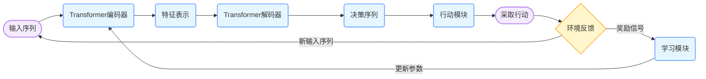

# 基于Transformer的AI Agent架构设计

> 关键词：Transformer、AI Agent、架构设计、人工智能、自然语言处理、机器学习、强化学习

> 摘要：本文聚焦于基于Transformer的AI Agent架构设计，详细探讨了相关核心概念、算法原理、数学模型。通过项目实战展示了如何搭建开发环境、实现并解读代码。同时分析了其实际应用场景，推荐了学习资源、开发工具框架以及相关论文著作。最后总结了未来发展趋势与挑战，并提供常见问题解答和扩展阅读参考资料，旨在为开发者和研究者提供全面深入的技术指导。

## 1. 背景介绍 
### 1.1 目的和范围
随着人工智能技术的不断发展，AI Agent在各个领域的应用越来越广泛。Transformer架构以其出色的序列处理能力和并行计算优势，成为了构建强大AI Agent的核心组件。本文的目的在于深入探讨如何基于Transformer设计高效、智能的AI Agent架构，涵盖从理论原理到实际应用的各个方面，包括核心概念、算法实现、数学模型、项目实战以及应用场景分析等，为相关领域的研究者和开发者提供全面的技术指导。

### 1.2 预期读者
本文预期读者包括人工智能领域的研究者、软件开发者、机器学习工程师、数据科学家以及对AI Agent和Transformer架构感兴趣的技术爱好者。读者需要具备一定的机器学习、深度学习基础，了解Python编程语言和常见的深度学习框架（如PyTorch、TensorFlow）。

### 1.3 文档结构概述
本文将按照以下结构进行阐述：首先介绍核心概念与联系，包括Transformer和AI Agent的原理及它们之间的关联；接着详细讲解核心算法原理和具体操作步骤，并使用Python源代码进行说明；然后给出相关的数学模型和公式，并举例说明；通过项目实战展示代码的实际案例和详细解释；分析实际应用场景；推荐学习资源、开发工具框架和相关论文著作；最后总结未来发展趋势与挑战，提供常见问题解答和扩展阅读参考资料。

### 1.4 术语表
#### 1.4.1 核心术语定义
- **Transformer**：一种基于注意力机制的深度学习架构，用于处理序列数据，在自然语言处理、语音识别等领域取得了显著成果。
- **AI Agent**：人工智能代理，是一种能够感知环境、做出决策并采取行动以实现特定目标的智能实体。
- **注意力机制**：一种在深度学习中用于自动关注输入序列中重要部分的机制，能够提高模型的性能和效率。
- **强化学习**：一种机器学习方法，通过智能体与环境进行交互，根据环境反馈的奖励信号来学习最优的行为策略。

#### 1.4.2 相关概念解释
- **多头注意力**：Transformer中的一种机制，通过多个注意力头并行计算，使模型能够捕捉输入序列中不同方面的信息。
- **位置编码**：为了让Transformer能够处理序列的顺序信息，在输入中加入的一种编码方式。
- **前馈神经网络**：一种简单的神经网络结构，由输入层、隐藏层和输出层组成，用于对输入进行非线性变换。

#### 1.4.3 缩略词列表
- **NLP**：Natural Language Processing，自然语言处理
- **ML**：Machine Learning，机器学习
- **RL**：Reinforcement Learning，强化学习
- **GPT**：Generative Pretrained Transformer，生成式预训练Transformer
- **BERT**：Bidirectional Encoder Representations from Transformers，基于Transformer的双向编码器表示

## 2. 核心概念与联系 

### 2.1 Transformer原理
Transformer是由Vaswani等人在2017年提出的一种基于注意力机制的深度学习架构，主要用于处理序列数据，如自然语言处理中的文本序列。其核心思想是通过注意力机制来捕捉输入序列中不同位置之间的依赖关系，从而避免了传统循环神经网络（RNN）在处理长序列时的梯度消失和计算效率低的问题。

Transformer的主要组件包括多头注意力机制（Multi-Head Attention）、前馈神经网络（Feed Forward Network）、层归一化（Layer Normalization）和位置编码（Positional Encoding）。

#### 2.1.1 多头注意力机制
多头注意力机制允许模型在不同的表示子空间中并行地关注输入序列的不同部分。对于输入序列 $X = [x_1, x_2,..., x_n]$，多头注意力机制的计算过程如下：

1. 将输入序列 $X$ 分别通过三个线性变换矩阵 $W^Q$、$W^K$ 和 $W^V$ 得到查询（Query）、键（Key）和值（Value）矩阵 $Q$、$K$ 和 $V$：
    - $Q = XW^Q$
    - $K = XW^K$
    - $V = XW^V$

2. 计算注意力分数：
    - $Attention(Q, K, V) = softmax(\frac{QK^T}{\sqrt{d_k}})V$
    其中 $d_k$ 是查询和键的维度，$\sqrt{d_k}$ 用于缩放注意力分数，防止点积结果过大。

3. 多头注意力机制通过多个注意力头并行计算，最后将结果拼接并通过一个线性变换得到最终输出：
    - $MultiHead(Q, K, V) = Concat(head_1, head_2,..., head_h)W^O$
    其中 $head_i = Attention(QW_i^Q, KW_i^K, VW_i^V)$，$h$ 是注意力头的数量，$W^O$ 是输出线性变换矩阵。

#### 2.1.2 前馈神经网络
前馈神经网络由两个线性层和一个非线性激活函数（通常是ReLU）组成，用于对多头注意力机制的输出进行非线性变换：
- $FFN(x) = max(0, xW_1 + b_1)W_2 + b_2$
其中 $W_1$、$W_2$ 是线性变换矩阵，$b_1$、$b_2$ 是偏置项。

#### 2.1.3 层归一化
层归一化用于对每个样本的特征进行归一化，使得模型的训练更加稳定：
- $LayerNorm(x) = \frac{x - \mu}{\sqrt{\sigma^2 + \epsilon}} \odot \gamma + \beta$
其中 $\mu$ 和 $\sigma$ 是样本的均值和标准差，$\epsilon$ 是一个小的常数，用于防止分母为零，$\gamma$ 和 $\beta$ 是可学习的缩放和偏移参数。

#### 2.1.4 位置编码
由于Transformer本身不具备处理序列顺序信息的能力，因此需要在输入中加入位置编码。位置编码通常使用正弦和余弦函数来生成：
- $PE_{(pos, 2i)} = sin(\frac{pos}{10000^{\frac{2i}{d_{model}}}})$
- $PE_{(pos, 2i+1)} = cos(\frac{pos}{10000^{\frac{2i}{d_{model}}}})$
其中 $pos$ 是位置索引，$i$ 是维度索引，$d_{model}$ 是模型的维度。

### 2.2 AI Agent原理
AI Agent是一种能够感知环境、做出决策并采取行动以实现特定目标的智能实体。一个典型的AI Agent通常由以下几个部分组成：

#### 2.2.1 感知模块
感知模块用于从环境中获取信息，例如在自然语言处理任务中，感知模块可以是一个文本编码器，将输入的文本转换为向量表示。

#### 2.2.2 决策模块
决策模块根据感知模块提供的信息，结合自身的知识和目标，做出决策。决策模块可以使用各种机器学习方法，如强化学习、深度学习等。

#### 2.2.3 行动模块
行动模块根据决策模块的输出，采取相应的行动。例如在对话系统中，行动模块可以生成回复文本。

#### 2.2.4 学习模块
学习模块用于从环境中获取反馈信息，更新自身的知识和策略，以提高性能。学习模块可以使用监督学习、无监督学习或强化学习等方法。

### 2.3 Transformer与AI Agent的联系
Transformer作为一种强大的序列处理模型，可以为AI Agent的感知模块和决策模块提供有力支持。在感知模块中，Transformer可以用于对输入的文本、图像等序列数据进行编码，提取特征信息。在决策模块中，Transformer可以用于生成决策序列，例如在对话系统中生成回复文本，在游戏中生成行动策略等。

通过将Transformer与强化学习等方法相结合，可以构建更加智能、灵活的AI Agent。例如，在强化学习中，Transformer可以用于学习环境的状态表示和策略函数，从而实现高效的决策和行动。

### 2.4 核心概念架构的文本示意图
```plaintext
AI Agent
├── 感知模块
│   └── Transformer编码器：对输入序列进行编码，提取特征信息
├── 决策模块
│   └── Transformer解码器：根据感知模块的输出，生成决策序列
├── 行动模块
│   └── 根据决策模块的输出，采取相应的行动
└── 学习模块
    └── 根据环境反馈，更新Transformer模型的参数
```

### 2.5 Mermaid流程图


## 3. 核心算法原理 & 具体操作步骤 

### 3.1 核心算法原理
基于Transformer的AI Agent架构主要涉及到Transformer的编码和解码过程，以及强化学习中的策略学习和价值学习。下面我们将详细介绍这些算法的原理。

#### 3.1.1 Transformer编码过程
Transformer编码器由多个编码器层组成，每个编码器层包含多头注意力机制和前馈神经网络。编码过程如下：

1. 输入序列 $X$ 经过位置编码后得到 $X_{pos}$。
2. 将 $X_{pos}$ 输入到第一个编码器层：
    - 多头注意力机制计算输入序列的注意力表示 $Z_1$。
    - 层归一化对 $Z_1$ 进行归一化得到 $\hat{Z}_1$。
    - 前馈神经网络对 $\hat{Z}_1$ 进行非线性变换得到 $Z_2$。
    - 层归一化对 $Z_2$ 进行归一化得到编码器层的输出 $O_1$。
3. 将 $O_1$ 输入到下一个编码器层，重复步骤2，直到所有编码器层都处理完毕。

#### 3.1.2 Transformer解码过程
Transformer解码器由多个解码器层组成，每个解码器层包含掩码多头注意力机制、编码器 - 解码器注意力机制和前馈神经网络。解码过程如下：

1. 目标序列 $Y$ 经过位置编码后得到 $Y_{pos}$。
2. 将 $Y_{pos}$ 输入到第一个解码器层：
    - 掩码多头注意力机制计算目标序列的自注意力表示 $Z_1$，掩码用于防止模型看到未来的信息。
    - 层归一化对 $Z_1$ 进行归一化得到 $\hat{Z}_1$。
    - 编码器 - 解码器注意力机制计算目标序列与编码器输出的注意力表示 $Z_2$。
    - 层归一化对 $Z_2$ 进行归一化得到 $\hat{Z}_2$。
    - 前馈神经网络对 $\hat{Z}_2$ 进行非线性变换得到 $Z_3$。
    - 层归一化对 $Z_3$ 进行归一化得到解码器层的输出 $O_1$。
3. 将 $O_1$ 输入到下一个解码器层，重复步骤2，直到所有解码器层都处理完毕。
4. 最后通过一个线性层和softmax函数得到输出序列的概率分布。

#### 3.1.3 强化学习中的策略学习和价值学习
在基于Transformer的AI Agent中，强化学习可以用于学习最优的行动策略。常见的强化学习算法包括策略梯度算法（如REINFORCE、A2C、A3C）和值函数算法（如Q - learning、DQN）。

- **策略梯度算法**：通过最大化累计奖励的期望来更新策略网络的参数。策略网络通常由Transformer解码器实现，输入当前的环境状态，输出行动的概率分布。
- **值函数算法**：通过学习值函数来估计在某个状态下采取某个行动的价值，然后根据值函数选择最优的行动。值函数网络也可以由Transformer实现。

### 3.2 具体操作步骤
下面我们将使用Python和PyTorch框架来实现基于Transformer的AI Agent的核心算法。

```python
import torch
import torch.nn as nn
import torch.nn.functional as F

# 定义多头注意力机制
class MultiHeadAttention(nn.Module):
    def __init__(self, d_model, num_heads):
        super(MultiHeadAttention, self).__init__()
        assert d_model % num_heads == 0, "d_model must be divisible by num_heads"

        self.d_model = d_model
        self.num_heads = num_heads
        self.d_k = d_model // num_heads

        self.W_q = nn.Linear(d_model, d_model)
        self.W_k = nn.Linear(d_model, d_model)
        self.W_v = nn.Linear(d_model, d_model)
        self.W_o = nn.Linear(d_model, d_model)

    def scaled_dot_product_attention(self, Q, K, V, mask=None):
        attn_scores = torch.matmul(Q, K.transpose(-2, -1)) / torch.sqrt(torch.tensor(self.d_k, dtype=torch.float32))
        if mask is not None:
            attn_scores = attn_scores.masked_fill(mask == 0, -1e9)
        attn_probs = F.softmax(attn_scores, dim=-1)
        output = torch.matmul(attn_probs, V)
        return output

    def split_heads(self, x):
        batch_size, seq_length, d_model = x.size()
        return x.view(batch_size, seq_length, self.num_heads, self.d_k).transpose(1, 2)

    def combine_heads(self, x):
        batch_size, num_heads, seq_length, d_k = x.size()
        return x.transpose(1, 2).contiguous().view(batch_size, seq_length, self.d_model)

    def forward(self, Q, K, V, mask=None):
        Q = self.split_heads(self.W_q(Q))
        K = self.split_heads(self.W_k(K))
        V = self.split_heads(self.W_v(V))

        attn_output = self.scaled_dot_product_attention(Q, K, V, mask)
        output = self.W_o(self.combine_heads(attn_output))
        return output

# 定义前馈神经网络
class FeedForwardNetwork(nn.Module):
    def __init__(self, d_model, d_ff):
        super(FeedForwardNetwork, self).__init__()
        self.fc1 = nn.Linear(d_model, d_ff)
        self.fc2 = nn.Linear(d_ff, d_model)
        self.relu = nn.ReLU()

    def forward(self, x):
        return self.fc2(self.relu(self.fc1(x)))

# 定义编码器层
class EncoderLayer(nn.Module):
    def __init__(self, d_model, num_heads, d_ff, dropout):
        super(EncoderLayer, self).__init__()
        self.self_attn = MultiHeadAttention(d_model, num_heads)
        self.feed_forward = FeedForwardNetwork(d_model, d_ff)
        self.norm1 = nn.LayerNorm(d_model)
        self.norm2 = nn.LayerNorm(d_model)
        self.dropout = nn.Dropout(dropout)

    def forward(self, x, mask):
        attn_output = self.self_attn(x, x, x, mask)
        x = self.norm1(x + self.dropout(attn_output))
        ff_output = self.feed_forward(x)
        x = self.norm2(x + self.dropout(ff_output))
        return x

# 定义解码器层
class DecoderLayer(nn.Module):
    def __init__(self, d_model, num_heads, d_ff, dropout):
        super(DecoderLayer, self).__init__()
        self.self_attn = MultiHeadAttention(d_model, num_heads)
        self.cross_attn = MultiHeadAttention(d_model, num_heads)
        self.feed_forward = FeedForwardNetwork(d_model, d_ff)
        self.norm1 = nn.LayerNorm(d_model)
        self.norm2 = nn.LayerNorm(d_model)
        self.norm3 = nn.LayerNorm(d_model)
        self.dropout = nn.Dropout(dropout)

    def forward(self, x, enc_output, src_mask, tgt_mask):
        attn_output1 = self.self_attn(x, x, x, tgt_mask)
        x = self.norm1(x + self.dropout(attn_output1))
        attn_output2 = self.cross_attn(x, enc_output, enc_output, src_mask)
        x = self.norm2(x + self.dropout(attn_output2))
        ff_output = self.feed_forward(x)
        x = self.norm3(x + self.dropout(ff_output))
        return x

# 定义Transformer编码器
class Encoder(nn.Module):
    def __init__(self, num_layers, d_model, num_heads, d_ff, input_vocab_size, maximum_position_encoding, dropout):
        super(Encoder, self).__init__()
        self.d_model = d_model
        self.embedding = nn.Embedding(input_vocab_size, d_model)
        self.pos_encoding = self.get_position_encoding(maximum_position_encoding, d_model)
        self.layers = nn.ModuleList([EncoderLayer(d_model, num_heads, d_ff, dropout) for _ in range(num_layers)])
        self.dropout = nn.Dropout(dropout)

    def get_position_encoding(self, position, d_model):
        angle_rads = self.get_angles(torch.arange(position)[:, None],
                                     torch.arange(d_model)[None, :],
                                     d_model)
        # apply sin to even indices in the array; 2i
        angle_rads[:, 0::2] = torch.sin(angle_rads[:, 0::2])
        # apply cos to odd indices in the array; 2i+1
        angle_rads[:, 1::2] = torch.cos(angle_rads[:, 1::2])
        pos_encoding = angle_rads[None,...]
        return pos_encoding.to(torch.float32)

    def get_angles(self, pos, i, d_model):
        angle_rates = 1 / torch.pow(10000, (2 * (i // 2)) / torch.tensor(d_model, dtype=torch.float32))
        return pos * angle_rates

    def forward(self, x, mask):
        seq_length = x.size(1)
        x = self.embedding(x) * torch.sqrt(torch.tensor(self.d_model, dtype=torch.float32))
        x += self.pos_encoding[:, :seq_length, :]
        x = self.dropout(x)

        for layer in self.layers:
            x = layer(x, mask)

        return x

# 定义Transformer解码器
class Decoder(nn.Module):
    def __init__(self, num_layers, d_model, num_heads, d_ff, target_vocab_size, maximum_position_encoding, dropout):
        super(Decoder, self).__init__()
        self.d_model = d_model
        self.embedding = nn.Embedding(target_vocab_size, d_model)
        self.pos_encoding = self.get_position_encoding(maximum_position_encoding, d_model)
        self.layers = nn.ModuleList([DecoderLayer(d_model, num_heads, d_ff, dropout) for _ in range(num_layers)])
        self.dropout = nn.Dropout(dropout)

    def get_position_encoding(self, position, d_model):
        angle_rads = self.get_angles(torch.arange(position)[:, None],
                                     torch.arange(d_model)[None, :],
                                     d_model)
        # apply sin to even indices in the array; 2i
        angle_rads[:, 0::2] = torch.sin(angle_rads[:, 0::2])
        # apply cos to odd indices in the array; 2i+1
        angle_rads[:, 1::2] = torch.cos(angle_rads[:, 1::2])
        pos_encoding = angle_rads[None,...]
        return pos_encoding.to(torch.float32)

    def get_angles(self, pos, i, d_model):
        angle_rates = 1 / torch.pow(10000, (2 * (i // 2)) / torch.tensor(d_model, dtype=torch.float32))
        return pos * angle_rates

    def forward(self, x, enc_output, src_mask, tgt_mask):
        seq_length = x.size(1)
        x = self.embedding(x) * torch.sqrt(torch.tensor(self.d_model, dtype=torch.float32))
        x += self.pos_encoding[:, :seq_length, :]
        x = self.dropout(x)

        for layer in self.layers:
            x = layer(x, enc_output, src_mask, tgt_mask)

        return x

# 定义Transformer模型
class Transformer(nn.Module):
    def __init__(self, num_layers, d_model, num_heads, d_ff, input_vocab_size,
                 target_vocab_size, pe_input, pe_target, dropout):
        super(Transformer, self).__init__()
        self.encoder = Encoder(num_layers, d_model, num_heads, d_ff,
                               input_vocab_size, pe_input, dropout)
        self.decoder = Decoder(num_layers, d_model, num_heads, d_ff,
                               target_vocab_size, pe_target, dropout)
        self.final_layer = nn.Linear(d_model, target_vocab_size)

    def forward(self, inp, tar, src_mask, tgt_mask):
        enc_output = self.encoder(inp, src_mask)
        dec_output = self.decoder(tar, enc_output, src_mask, tgt_mask)
        final_output = self.final_layer(dec_output)
        return final_output
```

### 3.3 代码解释
- **MultiHeadAttention类**：实现了多头注意力机制，包括缩放点积注意力和多头拼接操作。
- **FeedForwardNetwork类**：实现了前馈神经网络，包含两个线性层和一个ReLU激活函数。
- **EncoderLayer类**：实现了编码器层，包含多头注意力机制和前馈神经网络。
- **DecoderLayer类**：实现了解码器层，包含掩码多头注意力机制、编码器 - 解码器注意力机制和前馈神经网络。
- **Encoder类**：实现了Transformer编码器，包括输入嵌入、位置编码和多个编码器层。
- **Decoder类**：实现了Transformer解码器，包括目标嵌入、位置编码和多个解码器层。
- **Transformer类**：实现了完整的Transformer模型，包括编码器、解码器和最终的线性层。

## 4. 数学模型和公式 & 详细讲解 & 举例说明 

### 4.1 多头注意力机制的数学模型和公式
多头注意力机制的核心公式为：

- **缩放点积注意力**：
    - $Attention(Q, K, V) = softmax(\frac{QK^T}{\sqrt{d_k}})V$
    - 其中 $Q$ 是查询矩阵，$K$ 是键矩阵，$V$ 是值矩阵，$d_k$ 是查询和键的维度。

- **多头注意力**：
    - $MultiHead(Q, K, V) = Concat(head_1, head_2,..., head_h)W^O$
    - 其中 $head_i = Attention(QW_i^Q, KW_i^K, VW_i^V)$，$h$ 是注意力头的数量，$W^O$ 是输出线性变换矩阵。

### 4.2 详细讲解
- **缩放点积注意力**：通过计算查询矩阵 $Q$ 和键矩阵 $K$ 的点积，得到注意力分数。为了防止点积结果过大，需要除以 $\sqrt{d_k}$。然后使用softmax函数将注意力分数转换为概率分布，最后与值矩阵 $V$ 相乘得到注意力输出。

- **多头注意力**：通过多个注意力头并行计算，每个注意力头关注输入序列的不同方面。最后将所有注意力头的输出拼接起来，并通过一个线性变换得到最终输出。

### 4.3 举例说明
假设输入序列 $X$ 的维度为 $[batch_size, seq_length, d_model]$，其中 $batch_size = 2$，$seq_length = 3$，$d_model = 4$。我们设置注意力头的数量 $h = 2$，则 $d_k = d_model // h = 2$。

```python
import torch

# 输入序列
X = torch.randn(2, 3, 4)

# 定义多头注意力机制
d_model = 4
num_heads = 2
d_k = d_model // num_heads

W_q = torch.randn(d_model, d_model)
W_k = torch.randn(d_model, d_model)
W_v = torch.randn(d_model, d_model)
W_o = torch.randn(d_model, d_model)

# 计算查询、键和值矩阵
Q = torch.matmul(X, W_q)
K = torch.matmul(X, W_k)
V = torch.matmul(X, W_v)

# 分割注意力头
Q = Q.view(2, 3, num_heads, d_k).transpose(1, 2)
K = K.view(2, 3, num_heads, d_k).transpose(1, 2)
V = V.view(2, 3, num_heads, d_k).transpose(1, 2)

# 计算注意力分数
attn_scores = torch.matmul(Q, K.transpose(-2, -1)) / torch.sqrt(torch.tensor(d_k, dtype=torch.float32))

# 计算注意力概率
attn_probs = torch.softmax(attn_scores, dim=-1)

# 计算注意力输出
attn_output = torch.matmul(attn_probs, V)

# 合并注意力头
attn_output = attn_output.transpose(1, 2).contiguous().view(2, 3, d_model)

# 最终输出
final_output = torch.matmul(attn_output, W_o)

print("最终输出的形状:", final_output.shape)
```

### 4.4 前馈神经网络的数学模型和公式
前馈神经网络的公式为：

- $FFN(x) = max(0, xW_1 + b_1)W_2 + b_2$
其中 $W_1$、$W_2$ 是线性变换矩阵，$b_1$、$b_2$ 是偏置项。

### 4.5 详细讲解
前馈神经网络由两个线性层和一个ReLU激活函数组成。首先将输入 $x$ 通过第一个线性层 $xW_1 + b_1$，然后使用ReLU激活函数进行非线性变换 $max(0, xW_1 + b_1)$，最后通过第二个线性层 $max(0, xW_1 + b_1)W_2 + b_2$ 得到输出。

### 4.6 举例说明
假设输入 $x$ 的维度为 $[batch_size, d_model]$，其中 $batch_size = 2$，$d_model = 4$。我们设置第一个线性层的输出维度 $d_ff = 8$。

```python
import torch
import torch.nn as nn

# 输入
x = torch.randn(2, 4)

# 定义前馈神经网络
d_model = 4
d_ff = 8
fc1 = nn.Linear(d_model, d_ff)
fc2 = nn.Linear(d_ff, d_model)
relu = nn.ReLU()

# 前向传播
output = fc2(relu(fc1(x)))

print("前馈神经网络的输出形状:", output.shape)
```

### 4.7 位置编码的数学模型和公式
位置编码的公式为：

- $PE_{(pos, 2i)} = sin(\frac{pos}{10000^{\frac{2i}{d_{model}}}})$
- $PE_{(pos, 2i+1)} = cos(\frac{pos}{10000^{\frac{2i}{d_{model}}}})$
其中 $pos$ 是位置索引，$i$ 是维度索引，$d_{model}$ 是模型的维度。

### 4.8 详细讲解
位置编码使用正弦和余弦函数来生成，对于偶数维度使用正弦函数，对于奇数维度使用余弦函数。通过这种方式，位置编码可以捕捉到序列的相对位置信息。

### 4.9 举例说明
假设 $d_model = 4$，$pos = 3$。

```python
import torch
import math

d_model = 4
pos = 3

pe = torch.zeros(d_model)
for i in range(0, d_model, 2):
    pe[i] = math.sin(pos / (10000 ** ((2 * i) / d_model)))
    pe[i + 1] = math.cos(pos / (10000 ** ((2 * (i + 1)) / d_model)))

print("位置编码:", pe)
```

## 5. 项目实战：代码实际案例和详细解释说明 

### 5.1  开发环境搭建
#### 5.1.1 安装Python
确保你已经安装了Python 3.6或更高版本。你可以从Python官方网站（https://www.python.org/downloads/） 下载并安装Python。

#### 5.1.2 安装PyTorch
PyTorch是一个流行的深度学习框架，我们可以使用它来实现基于Transformer的AI Agent。根据你的操作系统和CUDA版本，选择合适的安装命令。例如，如果你使用的是CPU版本的PyTorch，可以使用以下命令安装：

```bash
pip install torch torchvision
```

#### 5.1.3 安装其他依赖库
还需要安装一些其他的依赖库，如NumPy、Matplotlib等。可以使用以下命令安装：

```bash
pip install numpy matplotlib
```

### 5.2  源代码详细实现和代码解读
下面我们将实现一个简单的基于Transformer的AI Agent，用于文本生成任务。

```python
import torch
import torch.nn as nn
import torch.optim as optim
import numpy as np

# 定义超参数
num_layers = 2
d_model = 128
num_heads = 8
d_ff = 512
input_vocab_size = 1000
target_vocab_size = 1000
pe_input = 100
pe_target = 100
dropout = 0.1
batch_size = 32
epochs = 10
learning_rate = 0.0001

# 定义Transformer模型
class Transformer(nn.Module):
    def __init__(self, num_layers, d_model, num_heads, d_ff, input_vocab_size,
                 target_vocab_size, pe_input, pe_target, dropout):
        super(Transformer, self).__init__()
        self.encoder = Encoder(num_layers, d_model, num_heads, d_ff,
                               input_vocab_size, pe_input, dropout)
        self.decoder = Decoder(num_layers, d_model, num_heads, d_ff,
                               target_vocab_size, pe_target, dropout)
        self.final_layer = nn.Linear(d_model, target_vocab_size)

    def forward(self, inp, tar, src_mask, tgt_mask):
        enc_output = self.encoder(inp, src_mask)
        dec_output = self.decoder(tar, enc_output, src_mask, tgt_mask)
        final_output = self.final_layer(dec_output)
        return final_output

# 定义编码器层
class EncoderLayer(nn.Module):
    def __init__(self, d_model, num_heads, d_ff, dropout):
        super(EncoderLayer, self).__init__()
        self.self_attn = MultiHeadAttention(d_model, num_heads)
        self.feed_forward = FeedForwardNetwork(d_model, d_ff)
        self.norm1 = nn.LayerNorm(d_model)
        self.norm2 = nn.LayerNorm(d_model)
        self.dropout = nn.Dropout(dropout)

    def forward(self, x, mask):
        attn_output = self.self_attn(x, x, x, mask)
        x = self.norm1(x + self.dropout(attn_output))
        ff_output = self.feed_forward(x)
        x = self.norm2(x + self.dropout(ff_output))
        return x

# 定义解码器层
class DecoderLayer(nn.Module):
    def __init__(self, d_model, num_heads, d_ff, dropout):
        super(DecoderLayer, self).__init__()
        self.self_attn = MultiHeadAttention(d_model, num_heads)
        self.cross_attn = MultiHeadAttention(d_model, num_heads)
        self.feed_forward = FeedForwardNetwork(d_model, d_ff)
        self.norm1 = nn.LayerNorm(d_model)
        self.norm2 = nn.LayerNorm(d_model)
        self.norm3 = nn.LayerNorm(d_model)
        self.dropout = nn.Dropout(dropout)

    def forward(self, x, enc_output, src_mask, tgt_mask):
        attn_output1 = self.self_attn(x, x, x, tgt_mask)
        x = self.norm1(x + self.dropout(attn_output1))
        attn_output2 = self.cross_attn(x, enc_output, enc_output, src_mask)
        x = self.norm2(x + self.dropout(attn_output2))
        ff_output = self.feed_forward(x)
        x = self.norm3(x + self.dropout(ff_output))
        return x

# 定义多头注意力机制
class MultiHeadAttention(nn.Module):
    def __init__(self, d_model, num_heads):
        super(MultiHeadAttention, self).__init__()
        assert d_model % num_heads == 0, "d_model must be divisible by num_heads"

        self.d_model = d_model
        self.num_heads = num_heads
        self.d_k = d_model // num_heads

        self.W_q = nn.Linear(d_model, d_model)
        self.W_k = nn.Linear(d_model, d_model)
        self.W_v = nn.Linear(d_model, d_model)
        self.W_o = nn.Linear(d_model, d_model)

    def scaled_dot_product_attention(self, Q, K, V, mask=None):
        attn_scores = torch.matmul(Q, K.transpose(-2, -1)) / torch.sqrt(torch.tensor(self.d_k, dtype=torch.float32))
        if mask is not None:
            attn_scores = attn_scores.masked_fill(mask == 0, -1e9)
        attn_probs = torch.softmax(attn_scores, dim=-1)
        output = torch.matmul(attn_probs, V)
        return output

    def split_heads(self, x):
        batch_size, seq_length, d_model = x.size()
        return x.view(batch_size, seq_length, self.num_heads, self.d_k).transpose(1, 2)

    def combine_heads(self, x):
        batch_size, num_heads, seq_length, d_k = x.size()
        return x.transpose(1, 2).contiguous().view(batch_size, seq_length, self.d_model)

    def forward(self, Q, K, V, mask=None):
        Q = self.split_heads(self.W_q(Q))
        K = self.split_heads(self.W_k(K))
        V = self.split_heads(self.W_v(V))

        attn_output = self.scaled_dot_product_attention(Q, K, V, mask)
        output = self.W_o(self.combine_heads(attn_output))
        return output

# 定义前馈神经网络
class FeedForwardNetwork(nn.Module):
    def __init__(self, d_model, d_ff):
        super(FeedForwardNetwork, self).__init__()
        self.fc1 = nn.Linear(d_model, d_ff)
        self.fc2 = nn.Linear(d_ff, d_model)
        self.relu = nn.ReLU()

    def forward(self, x):
        return self.fc2(self.relu(self.fc1(x)))

# 定义编码器
class Encoder(nn.Module):
    def __init__(self, num_layers, d_model, num_heads, d_ff, input_vocab_size, maximum_position_encoding, dropout):
        super(Encoder, self).__init__()
        self.d_model = d_model
        self.embedding = nn.Embedding(input_vocab_size, d_model)
        self.pos_encoding = self.get_position_encoding(maximum_position_encoding, d_model)
        self.layers = nn.ModuleList([EncoderLayer(d_model, num_heads, d_ff, dropout) for _ in range(num_layers)])
        self.dropout = nn.Dropout(dropout)

    def get_position_encoding(self, position, d_model):
        angle_rads = self.get_angles(torch.arange(position)[:, None],
                                     torch.arange(d_model)[None, :],
                                     d_model)
        # apply sin to even indices in the array; 2i
        angle_rads[:, 0::2] = torch.sin(angle_rads[:, 0::2])
        # apply cos to odd indices in the array; 2i+1
        angle_rads[:, 1::2] = torch.cos(angle_rads[:, 1::2])
        pos_encoding = angle_rads[None,...]
        return pos_encoding.to(torch.float32)

    def get_angles(self, pos, i, d_model):
        angle_rates = 1 / torch.pow(10000, (2 * (i // 2)) / torch.tensor(d_model, dtype=torch.float32))
        return pos * angle_rates

    def forward(self, x, mask):
        seq_length = x.size(1)
        x = self.embedding(x) * torch.sqrt(torch.tensor(self.d_model, dtype=torch.float32))
        x += self.pos_encoding[:, :seq_length, :]
        x = self.dropout(x)

        for layer in self.layers:
            x = layer(x, mask)

        return x

# 定义解码器
class Decoder(nn.Module):
    def __init__(self, num_layers, d_model, num_heads, d_ff, target_vocab_size, maximum_position_encoding, dropout):
        super(Decoder, self).__init__()
        self.d_model = d_model
        self.embedding = nn.Embedding(target_vocab_size, d_model)
        self.pos_encoding = self.get_position_encoding(maximum_position_encoding, d_model)
        self.layers = nn.ModuleList([DecoderLayer(d_model, num_heads, d_ff, dropout) for _ in range(num_layers)])
        self.dropout = nn.Dropout(dropout)

    def get_position_encoding(self, position, d_model):
        angle_rads = self.get_angles(torch.arange(position)[:, None],
                                     torch.arange(d_model)[None, :],
                                     d_model)
        # apply sin to even indices in the array; 2i
        angle_rads[:, 0::2] = torch.sin(angle_rads[:, 0::2])
        # apply cos to odd indices in the array; 2i+1
        angle_rads[:, 1::2] = torch.cos(angle_rads[:, 1::2])
        pos_encoding = angle_rads[None,...]
        return pos_encoding.to(torch.float32)

    def get_angles(self, pos, i, d_model):
        angle_rates = 1 / torch.pow(10000, (2 * (i // 2)) / torch.tensor(d_model, dtype=torch.float32))
        return pos * angle_rates

    def forward(self, x, enc_output, src_mask, tgt_mask):
        seq_length = x.size(1)
        x = self.embedding(x) * torch.sqrt(torch.tensor(self.d_model, dtype=torch.float32))
        x += self.pos_encoding[:, :seq_length, :]
        x = self.dropout(x)

        for layer in self.layers:
            x = layer(x, enc_output, src_mask, tgt_mask)

        return x

# 生成掩码
def create_masks(inp, tar):
    # 编码器掩码
    src_mask = (inp!= 0).unsqueeze(1).unsqueeze(2)

    # 解码器掩码
    tgt_mask = (tar!= 0).unsqueeze(1).unsqueeze(2)
    seq_length = tar.size(1)
    look_ahead_mask = 1 - torch.tril(torch.ones((seq_length, seq_length)))
    tgt_mask = tgt_mask & look_ahead_mask

    return src_mask, tgt_mask

# 训练模型
model = Transformer(num_layers, d_model, num_heads, d_ff, input_vocab_size,
                    target_vocab_size, pe_input, pe_target, dropout)
criterion = nn.CrossEntropyLoss()
optimizer = optim.Adam(model.parameters(), lr=learning_rate)

for epoch in range(epochs):
    # 生成随机输入和目标序列
    inp = torch.randint(0, input_vocab_size, (batch_size, 10))
    tar = torch.randint(0, target_vocab_size, (batch_size, 10))

    # 生成掩码
    src_mask, tgt_mask = create_masks(inp, tar)

    # 前向传播
    output = model(inp, tar[:, :-1], src_mask, tgt_mask[:, :, :-1, :-1])
    loss = criterion(output.reshape(-1, output.size(-1)), tar[:, 1:].reshape(-1))

    # 反向传播
    optimizer.zero_grad()
    loss.backward()
    optimizer.step()

    print(f'Epoch {epoch + 1}/{epochs}, Loss: {loss.item()}')
```

### 5.3  代码解读与分析
- **超参数设置**：定义了模型的超参数，如层数、模型维度、注意力头数量等。
- **模型定义**：定义了Transformer模型，包括编码器、解码器和最终的线性层。
- **掩码生成**：`create_masks` 函数用于生成编码器掩码和解码器掩码，解码器掩码用于防止模型看到未来的信息。
- **训练过程**：在每个epoch中，生成随机输入和目标序列，计算掩码，进行前向传播和反向传播，更新模型参数。

## 6. 实际应用场景 
### 6.1 自然语言处理
#### 6.1.1 机器翻译
基于Transformer的AI Agent可以用于机器翻译任务。编码器对源语言句子进行编码，解码器根据编码器的输出生成目标语言句子。通过大规模的语料库训练，模型可以学习到不同语言之间的语义和语法对应关系，从而实现高质量的机器翻译。

#### 6.1.