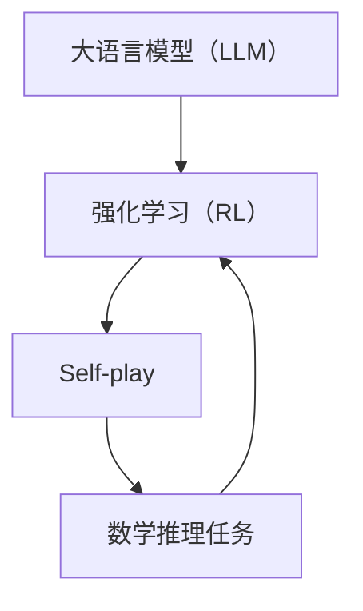

# 基于self-play的LLM RL方法在数学推理任务中的效果评估

> 关键词：self-play、大语言模型（LLM）、强化学习（RL）、数学推理任务、效果评估

> 摘要：本文聚焦于基于self-play的大语言模型（LLM）强化学习（RL）方法在数学推理任务中的应用与效果评估。首先介绍了研究的背景、目的、预期读者和文档结构，对相关术语进行了明确界定。接着阐述了核心概念，包括self-play、LLM和RL的原理及相互联系，并给出了对应的文本示意图和Mermaid流程图。详细讲解了核心算法原理，通过Python源代码展示具体操作步骤。同时，给出了相关的数学模型和公式，并举例说明。在项目实战部分，从开发环境搭建、源代码实现及解读等方面进行了详细说明。探讨了该方法在实际中的应用场景，推荐了学习资源、开发工具框架和相关论文著作。最后总结了未来发展趋势与挑战，提供了常见问题解答和扩展阅读参考资料，旨在为研究和应用该方法提供全面而深入的指导。

## 1. 背景介绍 
### 1.1 目的和范围
在当今人工智能领域，大语言模型（LLM）取得了显著进展，但在数学推理任务上仍面临挑战。基于self-play的强化学习（RL）方法为提升LLM在数学推理方面的能力提供了新的思路。本研究的目的在于全面评估基于self-play的LLM RL方法在数学推理任务中的效果，通过理论分析、实验验证和实际应用案例，深入了解该方法的优势与不足，为进一步改进和应用提供依据。

研究范围涵盖了多种数学推理任务，如代数方程求解、几何证明、逻辑推理等。同时，考虑不同类型的LLM和RL算法，对比基于self-play的方法与传统方法在数学推理任务中的表现。

### 1.2 预期读者
本文预期读者包括人工智能领域的研究人员、工程师、研究生和对数学推理与人工智能结合感兴趣的爱好者。对于研究人员，本文可提供新的研究方向和实验思路；对于工程师，有助于在实际项目中应用和优化基于self-play的LLM RL方法；对于研究生和爱好者，能加深对相关概念和技术的理解。

### 1.3 文档结构概述
本文共分为十个部分。背景介绍部分阐述了研究的目的、范围、预期读者和文档结构，对相关术语进行了定义和解释。核心概念与联系部分详细介绍了self-play、LLM和RL的原理及相互关系，并给出了示意图和流程图。核心算法原理 & 具体操作步骤部分通过Python代码详细讲解了基于self-play的LLM RL算法。数学模型和公式部分给出了相关的数学模型和公式，并举例说明。项目实战部分从开发环境搭建、源代码实现及解读等方面进行了详细说明。实际应用场景部分探讨了该方法在不同领域的应用。工具和资源推荐部分推荐了学习资源、开发工具框架和相关论文著作。总结部分分析了未来发展趋势与挑战。附录部分提供了常见问题解答。扩展阅读 & 参考资料部分列出了相关的参考资料。

### 1.4 术语表
#### 1.4.1 核心术语定义
- **Self-play**：自我对弈，是一种强化学习技术，智能体与自身或其他版本的自身进行交互，以提高性能。
- **大语言模型（LLM）**：一类基于深度学习的语言模型，具有强大的语言理解和生成能力，如GPT、BERT等。
- **强化学习（RL）**：一种机器学习范式，智能体通过与环境交互，根据环境反馈的奖励信号来学习最优策略。
- **数学推理任务**：涉及数学概念、规则和逻辑的问题求解任务，如证明定理、求解方程等。

#### 1.4.2 相关概念解释
- **策略网络**：在强化学习中，策略网络用于生成智能体的动作，根据当前状态输出动作的概率分布。
- **价值网络**：用于评估当前状态的价值，即从该状态开始，遵循某个策略所能获得的长期累计奖励的期望。
- **奖励函数**：定义了智能体在环境中采取某个动作后所获得的奖励，用于引导智能体学习最优策略。

#### 1.4.3 缩略词列表
- **LLM**：Large Language Model（大语言模型）
- **RL**：Reinforcement Learning（强化学习）
- **MDP**：Markov Decision Process（马尔可夫决策过程）

## 2. 核心概念与联系 

### 核心概念原理

#### Self-play
Self-play的核心思想是让智能体与自身或其他版本的自身进行交互。在数学推理任务中，智能体可以将自己生成的解答作为新的问题进行处理，通过不断的自我对弈来探索更多的解题思路和策略。例如，在求解代数方程时，智能体可以先给出一个初始的解题步骤，然后将这个步骤作为新的问题，尝试进一步求解，如此反复，直到得到最终的答案。

#### 大语言模型（LLM）
LLM是基于大规模语料库训练的深度学习模型，通过多层神经网络学习语言的模式和规律。在数学推理任务中，LLM可以用于理解问题的描述，生成解题思路和步骤。例如，它可以将自然语言描述的数学问题转化为数学表达式，并尝试给出解题的步骤。

#### 强化学习（RL）
RL是一种通过智能体与环境交互来学习最优策略的机器学习方法。在数学推理任务中，环境可以看作是数学问题的集合，智能体的动作是生成解题步骤，奖励函数根据解题的正确性和效率来给予奖励。智能体通过不断地尝试不同的动作，根据奖励信号来调整自己的策略，以提高解题的能力。

### 架构的文本示意图
```plaintext
+------------------+
|  大语言模型（LLM）  |
+------------------+
        |
        v
+------------------+
|  强化学习（RL）  |
+------------------+
        |
        v
+------------------+
|    Self-play     |
+------------------+
        |
        v
+------------------+
|  数学推理任务  |
+------------------+
```

### Mermaid流程图


## 3. 核心算法原理 & 具体操作步骤 

### 核心算法原理
基于self-play的LLM RL方法的核心是将Self-play与LLM和RL相结合。具体来说，首先使用LLM生成初始的解题步骤，然后将这些步骤作为状态输入到RL的策略网络中，策略网络根据当前状态生成下一步的动作（解题步骤）。环境根据动作的正确性和效率给予奖励，智能体根据奖励信号更新策略网络和价值网络。在Self-play过程中，智能体不断地与自己生成的状态进行交互，以探索更多的解题策略。

### 具体操作步骤及Python源代码

```python
import torch
import torch.nn as nn
import torch.optim as optim
import numpy as np

# 定义策略网络
class PolicyNetwork(nn.Module):
    def __init__(self, input_size, output_size):
        super(PolicyNetwork, self).__init__()
        self.fc1 = nn.Linear(input_size, 128)
        self.fc2 = nn.Linear(128, output_size)

    def forward(self, x):
        x = torch.relu(self.fc1(x))
        x = torch.softmax(self.fc2(x), dim=-1)
        return x

# 定义价值网络
class ValueNetwork(nn.Module):
    def __init__(self, input_size):
        super(ValueNetwork, self).__init__()
        self.fc1 = nn.Linear(input_size, 128)
        self.fc2 = nn.Linear(128, 1)

    def forward(self, x):
        x = torch.relu(self.fc1(x))
        x = self.fc2(x)
        return x

# 初始化策略网络和价值网络
input_size = 10
output_size = 5
policy_network = PolicyNetwork(input_size, output_size)
value_network = ValueNetwork(input_size)

# 定义优化器
policy_optimizer = optim.Adam(policy_network.parameters(), lr=0.001)
value_optimizer = optim.Adam(value_network.parameters(), lr=0.001)

# 模拟数学推理任务的环境
class MathReasoningEnv:
    def __init__(self):
        self.state = np.random.rand(input_size)

    def step(self, action):
        # 模拟环境反馈，根据动作计算奖励
        reward = np.random.rand()
        done = np.random.rand() > 0.8
        self.state = np.random.rand(input_size)
        return self.state, reward, done

# 训练过程
env = MathReasoningEnv()
num_episodes = 100
for episode in range(num_episodes):
    state = env.state
    state_tensor = torch.FloatTensor(state).unsqueeze(0)
    action_probs = policy_network(state_tensor)
    action = torch.multinomial(action_probs, 1).item()
    next_state, reward, done = env.step(action)
    next_state_tensor = torch.FloatTensor(next_state).unsqueeze(0)

    # 计算优势函数
    value = value_network(state_tensor)
    next_value = value_network(next_state_tensor)
    advantage = reward + (1 - done) * 0.9 * next_value - value

    # 更新策略网络
    policy_loss = -torch.log(action_probs[0, action]) * advantage
    policy_optimizer.zero_grad()
    policy_loss.backward()
    policy_optimizer.step()

    # 更新价值网络
    value_loss = advantage.pow(2).mean()
    value_optimizer.zero_grad()
    value_loss.backward()
    value_optimizer.step()

    if done:
        print(f"Episode {episode} finished with reward: {reward}")
```

在上述代码中，首先定义了策略网络和价值网络，然后初始化优化器。接着模拟了一个数学推理任务的环境，在训练过程中，智能体根据策略网络生成动作，与环境交互得到奖励和下一个状态，计算优势函数并更新策略网络和价值网络。

## 4. 数学模型和公式 & 详细讲解 & 举例说明 

### 马尔可夫决策过程（MDP）
在强化学习中，数学推理任务可以建模为一个马尔可夫决策过程（MDP）。MDP由一个四元组 $(S, A, P, R)$ 表示，其中：
- $S$ 是状态空间，表示数学推理任务中的所有可能状态，例如问题的描述、当前的解题步骤等。
- $A$ 是动作空间，表示智能体可以采取的所有可能动作，例如生成下一步的解题步骤。
- $P(s'|s, a)$ 是状态转移概率，表示在状态 $s$ 采取动作 $a$ 后转移到状态 $s'$ 的概率。
- $R(s, a)$ 是奖励函数，表示在状态 $s$ 采取动作 $a$ 后获得的奖励。

### 策略网络和价值网络
策略网络 $\pi(a|s; \theta)$ 表示在状态 $s$ 下采取动作 $a$ 的概率，其中 $\theta$ 是策略网络的参数。价值网络 $V(s; \phi)$ 表示在状态 $s$ 下的价值，其中 $\phi$ 是价值网络的参数。

### 目标函数
策略网络的目标是最大化长期累计奖励的期望，即：
$$J(\theta) = \mathbb{E}_{\tau \sim \pi(\tau; \theta)} \left[ \sum_{t=0}^{T} \gamma^t R(s_t, a_t) \right]$$
其中 $\tau = (s_0, a_0, s_1, a_1, \cdots, s_T, a_T)$ 是一个轨迹，$\gamma$ 是折扣因子。

使用策略梯度算法更新策略网络的参数 $\theta$，策略梯度公式为：
$$\nabla_{\theta} J(\theta) = \mathbb{E}_{\tau \sim \pi(\tau; \theta)} \left[ \sum_{t=0}^{T} \nabla_{\theta} \log \pi(a_t|s_t; \theta) A(s_t, a_t) \right]$$
其中 $A(s_t, a_t) = Q(s_t, a_t) - V(s_t)$ 是优势函数，表示在状态 $s_t$ 采取动作 $a_t$ 相对于平均价值的优势。

价值网络的目标是最小化预测价值与实际价值之间的误差，通常使用均方误差损失函数：
$$L(\phi) = \mathbb{E}_{s \sim D} \left[ (V(s; \phi) - \hat{V}(s))^2 \right]$$
其中 $D$ 是经验数据集，$\hat{V}(s)$ 是实际价值的估计值。

### 举例说明
假设我们有一个简单的数学推理任务：求解方程 $2x + 3 = 7$。初始状态 $s_0$ 是方程的描述，动作空间 $A$ 包括加、减、乘、除等操作。智能体根据策略网络 $\pi(a|s_0; \theta)$ 选择一个动作，例如减去 3，得到新的状态 $s_1$：$2x = 4$。环境根据动作的正确性给予奖励，例如如果动作正确，奖励为 1，否则为 -1。智能体根据奖励信号更新策略网络和价值网络，以提高在后续类似问题中的解题能力。

## 5. 项目实战：代码实际案例和详细解释说明 

### 5.1  开发环境搭建
#### 安装Python
首先需要安装Python，建议使用Python 3.7及以上版本。可以从Python官方网站（https://www.python.org/downloads/）下载并安装。

#### 安装深度学习框架
本项目使用PyTorch作为深度学习框架，可以使用以下命令进行安装：
```sh
pip install torch torchvision
```

#### 安装其他依赖库
还需要安装一些其他的依赖库，如NumPy等，可以使用以下命令进行安装：
```sh
pip install numpy
```

### 5.2  源代码详细实现和代码解读

```python
import torch
import torch.nn as nn
import torch.optim as optim
import numpy as np

# 定义策略网络
class PolicyNetwork(nn.Module):
    def __init__(self, input_size, output_size):
        super(PolicyNetwork, self).__init__()
        self.fc1 = nn.Linear(input_size, 128)
        self.fc2 = nn.Linear(128, output_size)

    def forward(self, x):
        x = torch.relu(self.fc1(x))
        x = torch.softmax(self.fc2(x), dim=-1)
        return x

# 定义价值网络
class ValueNetwork(nn.Module):
    def __init__(self, input_size):
        super(ValueNetwork, self).__init__()
        self.fc1 = nn.Linear(input_size, 128)
        self.fc2 = nn.Linear(128, 1)

    def forward(self, x):
        x = torch.relu(self.fc1(x))
        x = self.fc2(x)
        return x

# 初始化策略网络和价值网络
input_size = 10
output_size = 5
policy_network = PolicyNetwork(input_size, output_size)
value_network = ValueNetwork(input_size)

# 定义优化器
policy_optimizer = optim.Adam(policy_network.parameters(), lr=0.001)
value_optimizer = optim.Adam(value_network.parameters(), lr=0.001)

# 模拟数学推理任务的环境
class MathReasoningEnv:
    def __init__(self):
        self.state = np.random.rand(input_size)

    def step(self, action):
        # 模拟环境反馈，根据动作计算奖励
        reward = np.random.rand()
        done = np.random.rand() > 0.8
        self.state = np.random.rand(input_size)
        return self.state, reward, done

# 训练过程
env = MathReasoningEnv()
num_episodes = 100
for episode in range(num_episodes):
    state = env.state
    state_tensor = torch.FloatTensor(state).unsqueeze(0)
    action_probs = policy_network(state_tensor)
    action = torch.multinomial(action_probs, 1).item()
    next_state, reward, done = env.step(action)
    next_state_tensor = torch.FloatTensor(next_state).unsqueeze(0)

    # 计算优势函数
    value = value_network(state_tensor)
    next_value = value_network(next_state_tensor)
    advantage = reward + (1 - done) * 0.9 * next_value - value

    # 更新策略网络
    policy_loss = -torch.log(action_probs[0, action]) * advantage
    policy_optimizer.zero_grad()
    policy_loss.backward()
    policy_optimizer.step()

    # 更新价值网络
    value_loss = advantage.pow(2).mean()
    value_optimizer.zero_grad()
    value_loss.backward()
    value_optimizer.step()

    if done:
        print(f"Episode {episode} finished with reward: {reward}")
```

### 代码解读与分析
#### 策略网络和价值网络
- `PolicyNetwork` 是策略网络，它接受一个输入状态，通过两层全连接层和ReLU激活函数，最后使用softmax函数输出动作的概率分布。
- `ValueNetwork` 是价值网络，它接受一个输入状态，通过两层全连接层和ReLU激活函数，最后输出该状态的价值估计。

#### 优化器
使用Adam优化器分别对策略网络和价值网络的参数进行更新，学习率设置为 0.001。

#### 环境模拟
`MathReasoningEnv` 类模拟了一个数学推理任务的环境，`step` 方法根据动作计算奖励和下一个状态。

#### 训练过程
在训练过程中，智能体根据策略网络生成动作，与环境交互得到奖励和下一个状态。计算优势函数，使用策略梯度算法更新策略网络的参数，使用均方误差损失函数更新价值网络的参数。

## 6. 实际应用场景 
### 教育领域
在教育领域，基于self-play的LLM RL方法可以用于智能辅导系统。例如，为学生提供个性化的数学学习辅导，根据学生的问题和解题步骤，智能体可以通过Self-play不断探索更多的解题思路，并给予学生针对性的建议和指导。同时，该方法还可以用于自动批改作业和考试，提高批改效率和准确性。

### 科研领域
在科研领域，该方法可以用于解决复杂的数学问题和进行理论推导。例如，在数学定理证明中，智能体可以通过Self-play不断尝试不同的证明思路，帮助科研人员发现新的证明方法和思路。

### 金融领域
在金融领域，数学推理任务广泛存在，如风险评估、投资决策等。基于self-play的LLM RL方法可以用于构建智能金融决策系统，通过对金融数据的分析和推理，为投资者提供更准确的投资建议和决策支持。

## 7. 工具和资源推荐
### 7.1 学习资源推荐
#### 7.1.1 书籍推荐
- 《强化学习：原理与Python实现》：本书详细介绍了强化学习的基本原理和算法，并通过Python代码进行了实现，适合初学者入门。
- 《深度学习》：由Ian Goodfellow、Yoshua Bengio和Aaron Courville撰写，是深度学习领域的经典教材，对大语言模型的原理和技术有深入的介绍。

#### 7.1.2 在线课程
- Coursera上的“强化学习专项课程”：由David Silver教授授课，系统地介绍了强化学习的理论和应用。
- edX上的“深度学习微硕士项目”：包含了深度学习的多个方面，包括大语言模型和强化学习。

#### 7.1.3 技术博客和网站
- OpenAI博客：提供了人工智能领域的最新研究成果和技术动态。
- Hugging Face博客：专注于自然语言处理领域，有很多关于大语言模型的文章和教程。

### 7.2 开发工具框架推荐
#### 7.2.1 IDE和编辑器
- PyCharm：一款功能强大的Python集成开发环境，提供了代码编辑、调试、版本控制等功能。
- Jupyter Notebook：适合进行交互式的代码开发和数据分析，方便展示代码和结果。

#### 7.2.2 调试和性能分析工具
- TensorBoard：用于可视化深度学习模型的训练过程和性能指标。
- Py-Spy：一个轻量级的Python性能分析工具，可以帮助定位代码中的性能瓶颈。

#### 7.2.3 相关框架和库
- PyTorch：一个开源的深度学习框架，提供了丰富的神经网络层和优化算法。
- Hugging Face Transformers：一个用于自然语言处理的库，包含了多种预训练的大语言模型。

### 7.3 相关论文著作推荐
#### 7.3.1 经典论文
- “Playing Atari with Deep Reinforcement Learning”：首次提出了深度Q网络（DQN）算法，开创了深度强化学习的先河。
- “Attention Is All You Need”：介绍了Transformer架构，是大语言模型的基础。

#### 7.3.2 最新研究成果
- “Self-Play Reinforcement Learning for Mathematical Reasoning”：探讨了基于self-play的强化学习方法在数学推理任务中的应用。
- “Large Language Models for Complex Reasoning”：研究了大语言模型在复杂推理任务中的表现和改进方法。

#### 7.3.3 应用案例分析
- “Applying Reinforcement Learning to Solve Mathematical Problems in Education”：介绍了强化学习在教育领域解决数学问题的应用案例。
- “Financial Decision Making with Reinforcement Learning and Large Language Models”：探讨了强化学习和大语言模型在金融决策中的应用。

## 8. 总结：未来发展趋势与挑战
### 未来发展趋势
- **多模态融合**：将基于self-play的LLM RL方法与图像、语音等多模态信息相结合，以处理更复杂的数学推理任务。例如，在几何问题中，结合图像信息可以更直观地理解问题。
- **跨领域应用**：该方法将在更多领域得到应用，如医疗、交通、工业制造等。在医疗领域，可以用于疾病诊断和治疗方案的制定。
- **模型可解释性**：随着模型的复杂度不断增加，提高模型的可解释性将成为未来的重要研究方向。例如，解释智能体在数学推理过程中的决策依据。

### 挑战
- **计算资源需求**：基于self-play的LLM RL方法通常需要大量的计算资源，特别是在训练大规模的语言模型时。如何降低计算成本，提高训练效率是一个挑战。
- **奖励函数设计**：奖励函数的设计直接影响智能体的学习效果。在数学推理任务中，如何设计合理的奖励函数来引导智能体学习正确的解题策略是一个难题。
- **数据质量和数量**：高质量的数据对于训练有效的模型至关重要。在数学推理任务中，获取足够多的高质量数据并进行标注是一个挑战。

## 9. 附录：常见问题与解答
### 问题1：Self-play在数学推理任务中的作用是什么？
Self-play在数学推理任务中可以让智能体不断地与自己生成的状态进行交互，探索更多的解题思路和策略。通过自我对弈，智能体可以发现新的解题方法，提高解题的能力。

### 问题2：如何选择合适的大语言模型和强化学习算法？
选择合适的大语言模型和强化学习算法需要考虑任务的复杂度、数据的规模和计算资源等因素。对于简单的数学推理任务，可以选择较小的语言模型和简单的强化学习算法；对于复杂的任务，则需要选择更强大的语言模型和更复杂的强化学习算法。

### 问题3：训练过程中如何避免过拟合？
可以采用以下方法避免过拟合：增加训练数据的多样性和数量、使用正则化方法（如L1和L2正则化）、进行模型融合等。在训练过程中，还可以通过交叉验证等方法来评估模型的泛化能力。

## 10. 扩展阅读 & 参考资料
- Silver, D., Huang, A., Maddison, C. J., et al. (2016). Mastering the game of Go with deep neural networks and tree search. Nature, 529(7587), 484-489.
- Vaswani, A., Shazeer, N., Parmar, N., et al. (2017). Attention is all you need. Advances in neural information processing systems, 30.
- OpenAI. (2023). GPT-4 Technical Report.

作者：AI天才研究院/AI Genius Institute & 禅与计算机程序设计艺术 /Zen And The Art of Computer Programming