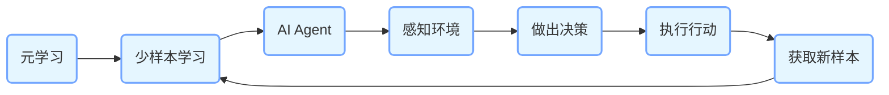

# 基于元学习的AI Agent少样本学习能力

> 关键词：元学习、AI Agent、少样本学习、机器学习、深度学习、模型泛化、智能体决策

> 摘要：本文聚焦于基于元学习的AI Agent少样本学习能力。首先介绍了元学习和少样本学习在当前人工智能领域的重要性和背景，阐述了相关核心概念及其联系。详细讲解了核心算法原理，通过Python代码进行示例说明，并给出相应的数学模型和公式。结合项目实战，展示了如何实现基于元学习的少样本学习，对代码进行了详细解读与分析。探讨了其实际应用场景，推荐了相关的学习资源、开发工具框架以及论文著作。最后总结了该领域的未来发展趋势与挑战，还提供了常见问题解答和扩展阅读参考资料，旨在全面深入地探讨基于元学习的AI Agent少样本学习能力，为相关研究和实践提供有价值的参考。

## 1. 背景介绍 
### 1.1 目的和范围
在传统的机器学习和深度学习任务中，模型通常需要大量的标注数据才能达到较好的性能。然而，在许多实际应用场景中，获取大量标注数据是非常困难、昂贵甚至不可行的。例如，在医疗诊断中，某些罕见病的病例数据非常有限；在工业检测中，新出现的故障模式可能没有足够的样本。少样本学习（Few - Shot Learning，FSL）正是为了解决这些问题而提出的一种学习范式，旨在让模型在少量标注样本的情况下也能具有良好的泛化能力。

元学习（Meta - Learning）则是一种“学会学习”的方法，它的目标是让模型能够快速适应新的任务，通过在多个相关任务上进行训练，学习到通用的学习策略和模型初始化参数，从而在面对新的少样本任务时能够快速收敛和学习。

本文的范围涵盖了基于元学习的AI Agent少样本学习能力的理论基础、算法原理、数学模型、项目实战、应用场景以及相关资源推荐等多个方面，旨在为读者提供一个全面而深入的了解。

### 1.2 预期读者
本文预期读者包括人工智能、机器学习、深度学习等领域的研究人员、工程师、学生以及对相关技术感兴趣的爱好者。对于希望深入了解少样本学习和元学习技术的专业人士，本文将提供详细的理论和实践指导；对于初学者，也可以通过本文初步了解相关概念和方法。

### 1.3 文档结构概述
本文首先介绍背景知识，包括目的、预期读者和文档结构概述以及相关术语。接着阐述核心概念与联系，包括元学习、少样本学习和AI Agent的原理和架构，并给出相应的流程图。然后详细讲解核心算法原理和具体操作步骤，使用Python代码进行示例。之后介绍数学模型和公式，并举例说明。通过项目实战展示代码实现和解读。探讨实际应用场景，推荐相关工具和资源。最后总结未来发展趋势与挑战，提供常见问题解答和扩展阅读参考资料。

### 1.4 术语表
#### 1.4.1 核心术语定义
- **元学习（Meta - Learning）**：也称为“学习如何学习”，是一种让模型在多个任务上学习通用的学习策略和初始化参数，以便在新任务上能够快速学习和适应的方法。
- **少样本学习（Few - Shot Learning）**：指模型在仅有少量标注样本的情况下进行学习和泛化的能力。
- **AI Agent（人工智能智能体）**：是一种能够感知环境、做出决策并执行行动的智能实体，它可以根据不同的任务和环境进行自适应学习和决策。
- **支持集（Support Set）**：在少样本学习中，用于训练模型的少量标注样本集合。
- **查询集（Query Set）**：用于评估模型在少样本学习任务上性能的样本集合。

#### 1.4.2 相关概念解释
- **任务（Task）**：在元学习中，任务是指一个具体的学习问题，例如一个分类任务或回归任务。多个任务组成一个任务分布。
- **元训练（Meta - Training）**：在元学习中，模型在多个任务上进行训练，学习通用的学习策略和初始化参数的过程。
- **元测试（Meta - Testing）**：在元学习中，使用学习到的策略和参数，在新的少样本任务上进行测试和评估的过程。

#### 1.4.3 缩略词列表
- **FSL**：Few - Shot Learning（少样本学习）
- **MAML**：Model - Agnostic Meta - Learning（模型无关元学习）
- **Prototypical Networks**：原型网络
- **Siamese Networks**：孪生网络

## 2. 核心概念与联系 

### 2.1 元学习原理
元学习的核心思想是在多个相关任务上进行训练，学习到一种通用的学习策略或模型初始化参数，使得模型能够在新的任务上快速学习和适应。元学习可以分为基于优化的元学习、基于度量的元学习和基于模型的元学习等不同类型。

基于优化的元学习方法，如MAML，通过在多个任务上进行快速的梯度更新，学习到一个初始参数，使得模型在新任务上能够快速收敛。基于度量的元学习方法，如原型网络和孪生网络，通过学习样本之间的距离度量，来判断样本的类别。基于模型的元学习方法则是通过设计特殊的模型结构，使其具有快速学习的能力。

### 2.2 少样本学习原理
少样本学习的目标是在仅有少量标注样本的情况下，让模型能够学习到有效的分类或回归模型。少样本学习通常采用元学习的方法，通过在多个相关任务上进行训练，学习到通用的特征表示和分类器，从而在新的少样本任务上能够快速泛化。

### 2.3 AI Agent与少样本学习的联系
AI Agent是一种能够感知环境、做出决策并执行行动的智能实体。在许多实际应用场景中，AI Agent需要在新的环境或任务中快速学习和适应，而少样本学习能力可以帮助AI Agent在仅有少量样本的情况下快速学习到有效的决策策略。例如，在机器人导航任务中，AI Agent可能需要在新的环境中快速学习到如何避开障碍物，少样本学习可以让AI Agent利用少量的环境样本快速学习到有效的导航策略。

### 2.4 核心概念架构的文本示意图
元学习、少样本学习和AI Agent之间的关系可以用以下文本示意图表示：

元学习为少样本学习提供了一种有效的学习策略，通过在多个任务上学习通用的学习方法和初始化参数，使得模型能够在少样本任务上快速学习和泛化。AI Agent则可以利用少样本学习的能力，在新的环境或任务中快速学习到有效的决策策略，从而提高其智能水平和适应性。

### 2.5 Mermaid流程图


## 3. 核心算法原理 & 具体操作步骤 

### 3.1 模型无关元学习（MAML）算法原理
MAML是一种基于优化的元学习算法，其核心思想是学习一个初始参数，使得模型在新任务上能够通过少量的梯度更新快速收敛。

#### 3.1.1 算法步骤
1. **元训练阶段**：
    - 从任务分布中随机采样一批任务。
    - 对于每个任务，从任务的支持集中计算梯度，更新模型参数。
    - 计算更新后的模型在任务查询集上的损失。
    - 对所有任务的查询集损失求和，得到元损失。
    - 使用元损失更新初始参数。
2. **元测试阶段**：
    - 对于新的少样本任务，使用学习到的初始参数进行初始化。
    - 从新任务的支持集中计算梯度，更新模型参数。
    - 使用更新后的模型对查询集进行预测。

#### 3.1.2 Python代码实现
```python
import torch
import torch.nn as nn
import torch.optim as optim

# 定义一个简单的神经网络模型
class SimpleNet(nn.Module):
    def __init__(self, input_size, hidden_size, output_size):
        super(SimpleNet, self).__init__()
        self.fc1 = nn.Linear(input_size, hidden_size)
        self.relu = nn.ReLU()
        self.fc2 = nn.Linear(hidden_size, output_size)

    def forward(self, x):
        out = self.fc1(x)
        out = self.relu(out)
        out = self.fc2(out)
        return out

# 定义MAML算法
class MAML:
    def __init__(self, model, lr_inner, lr_outer, num_inner_steps):
        self.model = model
        self.lr_inner = lr_inner
        self.lr_outer = lr_outer
        self.num_inner_steps = num_inner_steps
        self.optimizer = optim.Adam(self.model.parameters(), lr=lr_outer)

    def meta_train(self, task_batch):
        meta_loss = 0
        for task in task_batch:
            support_x, support_y, query_x, query_y = task
            fast_weights = list(self.model.parameters())

            # 内循环更新
            for _ in range(self.num_inner_steps):
                logits = self.model.forward(support_x)
                loss = nn.CrossEntropyLoss()(logits, support_y)
                grads = torch.autograd.grad(loss, fast_weights)
                fast_weights = [w - self.lr_inner * g for w, g in zip(fast_weights, grads)]

            # 计算查询集损失
            logits = self.model.forward(query_x)
            loss = nn.CrossEntropyLoss()(logits, query_y)
            meta_loss += loss

        # 元更新
        self.optimizer.zero_grad()
        meta_loss.backward()
        self.optimizer.step()
        return meta_loss.item()

    def meta_test(self, task):
        support_x, support_y, query_x, query_y = task
        fast_weights = list(self.model.parameters())

        # 内循环更新
        for _ in range(self.num_inner_steps):
            logits = self.model.forward(support_x)
            loss = nn.CrossEntropyLoss()(logits, support_y)
            grads = torch.autograd.grad(loss, fast_weights)
            fast_weights = [w - self.lr_inner * g for w, g in zip(fast_weights, grads)]

        # 预测
        logits = self.model.forward(query_x)
        _, predicted = torch.max(logits.data, 1)
        accuracy = (predicted == query_y).sum().item() / query_y.size(0)
        return accuracy
```

### 3.2 原型网络（Prototypical Networks）算法原理
原型网络是一种基于度量的元学习算法，其核心思想是通过计算样本与每个类别的原型之间的距离来进行分类。

#### 3.2.1 算法步骤
1. **训练阶段**：
    - 从任务分布中随机采样一批任务。
    - 对于每个任务，计算每个类别的原型，原型是该类别所有样本的特征向量的均值。
    - 计算查询集中每个样本与各个原型之间的距离，使用距离度量（如欧几里得距离）。
    - 根据距离进行分类，计算分类损失。
    - 使用分类损失更新模型参数。
2. **测试阶段**：
    - 对于新的少样本任务，计算每个类别的原型。
    - 计算查询集中每个样本与各个原型之间的距离。
    - 根据距离进行分类，得到预测结果。

#### 3.2.2 Python代码实现
```python
import torch
import torch.nn as nn
import torch.optim as optim
import torch.nn.functional as F

# 定义一个简单的特征提取器
class FeatureExtractor(nn.Module):
    def __init__(self, input_size, hidden_size):
        super(FeatureExtractor, self).__init__()
        self.fc1 = nn.Linear(input_size, hidden_size)
        self.relu = nn.ReLU()

    def forward(self, x):
        out = self.fc1(x)
        out = self.relu(out)
        return out

# 定义原型网络
class PrototypicalNetworks:
    def __init__(self, feature_extractor, lr):
        self.feature_extractor = feature_extractor
        self.optimizer = optim.Adam(self.feature_extractor.parameters(), lr=lr)

    def euclidean_distance(self, x1, x2):
        return torch.sum((x1 - x2) ** 2, dim=1)

    def compute_prototypes(self, support_x, support_y, num_classes):
        prototypes = []
        for c in range(num_classes):
            indices = (support_y == c).nonzero(as_tuple=True)[0]
            class_samples = support_x[indices]
            prototype = torch.mean(class_samples, dim=0)
            prototypes.append(prototype)
        return torch.stack(prototypes)

    def train(self, task_batch):
        loss_total = 0
        for task in task_batch:
            support_x, support_y, query_x, query_y = task
            num_classes = len(torch.unique(support_y))

            # 提取特征
            support_features = self.feature_extractor(support_x)
            query_features = self.feature_extractor(query_x)

            # 计算原型
            prototypes = self.compute_prototypes(support_features, support_y, num_classes)

            # 计算距离
            distances = []
            for query_feature in query_features:
                dist = self.euclidean_distance(query_feature, prototypes)
                distances.append(dist)
            distances = torch.stack(distances)

            # 计算损失
            log_p_y = F.log_softmax(-distances, dim=1)
            loss = -torch.gather(log_p_y, 1, query_y.unsqueeze(1)).squeeze().mean()
            loss_total += loss

        # 更新参数
        self.optimizer.zero_grad()
        loss_total.backward()
        self.optimizer.step()
        return loss_total.item()

    def test(self, task):
        support_x, support_y, query_x, query_y = task
        num_classes = len(torch.unique(support_y))

        # 提取特征
        support_features = self.feature_extractor(support_x)
        query_features = self.feature_extractor(query_x)

        # 计算原型
        prototypes = self.compute_prototypes(support_features, support_y, num_classes)

        # 计算距离
        distances = []
        for query_feature in query_features:
            dist = self.euclidean_distance(query_feature, prototypes)
            distances.append(dist)
        distances = torch.stack(distances)

        # 预测
        _, predicted = torch.min(distances, dim=1)
        accuracy = (predicted == query_y).sum().item() / query_y.size(0)
        return accuracy
```

## 4. 数学模型和公式 & 详细讲解 & 举例说明 

### 4.1 模型无关元学习（MAML）的数学模型
#### 4.1.1 元训练阶段
设 $\theta$ 为模型的初始参数，$\tau$ 为从任务分布 $\mathcal{T}$ 中采样的一个任务，$L_{\tau}(\theta)$ 为任务 $\tau$ 的损失函数。在元训练阶段，对于每个任务 $\tau$，我们首先使用支持集 $S_{\tau}$ 计算梯度 $\nabla_{\theta} L_{\tau}(\theta)$，然后更新参数 $\theta'_{\tau}=\theta - \alpha \nabla_{\theta} L_{\tau}(\theta)$，其中 $\alpha$ 是内循环的学习率。

接着，我们计算更新后的参数 $\theta'_{\tau}$ 在查询集 $Q_{\tau}$ 上的损失 $L_{\tau}(\theta'_{\tau})$。元损失 $\mathcal{L}(\theta)$ 是所有任务的查询集损失的期望：

$$\mathcal{L}(\theta)=\mathbb{E}_{\tau \sim \mathcal{T}}[L_{\tau}(\theta - \alpha \nabla_{\theta} L_{\tau}(\theta))]$$

最后，我们使用元损失 $\mathcal{L}(\theta)$ 来更新初始参数 $\theta$：

$$\theta \leftarrow \theta - \beta \nabla_{\theta} \mathcal{L}(\theta)$$

其中 $\beta$ 是外循环的学习率。

#### 4.1.2 元测试阶段
在元测试阶段，对于新的少样本任务 $\tau_{new}$，我们使用学习到的初始参数 $\theta$ 进行初始化，然后使用支持集 $S_{\tau_{new}}$ 进行少量的梯度更新，得到更新后的参数 $\theta'_{\tau_{new}}$，最后使用 $\theta'_{\tau_{new}}$ 对查询集 $Q_{\tau_{new}}$ 进行预测。

### 4.2 原型网络（Prototypical Networks）的数学模型
#### 4.2.1 计算原型
设 $x_{i}$ 是支持集中的一个样本，$y_{i}$ 是其对应的类别标签，$C$ 是类别集合。对于每个类别 $c \in C$，其原型 $p_{c}$ 定义为该类别所有样本的特征向量的均值：

$$p_{c}=\frac{1}{|S_{c}|}\sum_{i:y_{i}=c} \phi(x_{i})$$

其中 $\phi(x)$ 是特征提取器，$|S_{c}|$ 是类别 $c$ 的样本数量。

#### 4.2.2 计算距离
对于查询集中的一个样本 $x_{q}$，其特征向量为 $\phi(x_{q})$，我们计算它与每个原型 $p_{c}$ 之间的欧几里得距离 $d(\phi(x_{q}), p_{c})$：

$$d(\phi(x_{q}), p_{c})=\|\phi(x_{q}) - p_{c}\|^{2}$$

#### 4.2.3 分类损失
分类损失使用负对数似然损失，即：

$$L = -\log \left( \frac{\exp(-d(\phi(x_{q}), p_{y_{q}}))}{\sum_{c' \in C} \exp(-d(\phi(x_{q}), p_{c'}))} \right)$$

其中 $y_{q}$ 是查询样本 $x_{q}$ 的真实类别标签。

### 4.3 举例说明
#### 4.3.1 MAML举例
假设我们有一个简单的分类任务，输入是二维向量，输出是 3 个类别。我们使用 MAML 算法进行训练。在元训练阶段，我们从任务分布中采样一批任务，每个任务有 10 个支持样本和 5 个查询样本。内循环学习率 $\alpha = 0.01$，外循环学习率 $\beta = 0.001$，内循环步数为 5。通过多次元训练迭代，模型学习到一个初始参数，使得在新的少样本任务上能够快速收敛。

#### 4.3.2 原型网络举例
同样对于上述分类任务，我们使用原型网络进行训练。在训练阶段，我们计算每个类别的原型，对于查询集中的样本，计算其与各个原型之间的距离，根据距离进行分类。例如，一个查询样本的特征向量与类别 1 的原型距离最近，那么我们就将该样本分类为类别 1。

## 5. 项目实战：代码实际案例和详细解释说明 

### 5.1  开发环境搭建
#### 5.1.1 安装Python
首先需要安装Python，建议使用Python 3.7及以上版本。可以从Python官方网站（https://www.python.org/downloads/） 下载安装包进行安装。

#### 5.1.2 安装深度学习框架
本文使用PyTorch作为深度学习框架，可以根据自己的系统和CUDA版本选择合适的安装方式。可以参考PyTorch官方网站（https://pytorch.org/get-started/locally/） 进行安装。

#### 5.1.3 安装其他依赖库
还需要安装一些其他的依赖库，如`numpy`、`matplotlib`等。可以使用`pip`命令进行安装：

```bash
pip install numpy matplotlib
```

### 5.2  源代码详细实现和代码解读
#### 5.2.1 数据准备
我们使用一个简单的合成数据集来演示基于元学习的少样本学习。以下是数据生成的代码：

```python
import numpy as np
import torch

# 生成任务数据
def generate_task(num_classes, num_support, num_query, input_size):
    support_x = []
    support_y = []
    query_x = []
    query_y = []

    for c in range(num_classes):
        class_mean = np.random.randn(input_size)
        class_cov = np.eye(input_size)

        support_samples = np.random.multivariate_normal(class_mean, class_cov, num_support)
        query_samples = np.random.multivariate_normal(class_mean, class_cov, num_query)

        support_x.extend(support_samples)
        support_y.extend([c] * num_support)
        query_x.extend(query_samples)
        query_y.extend([c] * num_query)

    support_x = torch.FloatTensor(support_x)
    support_y = torch.LongTensor(support_y)
    query_x = torch.FloatTensor(query_x)
    query_y = torch.LongTensor(query_y)

    return support_x, support_y, query_x, query_y

# 生成一批任务
def generate_task_batch(num_tasks, num_classes, num_support, num_query, input_size):
    task_batch = []
    for _ in range(num_tasks):
        task = generate_task(num_classes, num_support, num_query, input_size)
        task_batch.append(task)
    return task_batch
```

#### 5.2.2 使用MAML进行训练和测试
```python
# 定义模型和MAML算法
input_size = 2
hidden_size = 10
output_size = 3
model = SimpleNet(input_size, hidden_size, output_size)
maml = MAML(model, lr_inner=0.01, lr_outer=0.001, num_inner_steps=5)

# 元训练
num_epochs = 100
num_tasks_per_epoch = 10
num_classes = 3
num_support = 10
num_query = 5

for epoch in range(num_epochs):
    task_batch = generate_task_batch(num_tasks_per_epoch, num_classes, num_support, num_query, input_size)
    meta_loss = maml.meta_train(task_batch)
    print(f'Epoch {epoch+1}/{num_epochs}, Meta Loss: {meta_loss}')

# 元测试
test_task = generate_task(num_classes, num_support, num_query, input_size)
accuracy = maml.meta_test(test_task)
print(f'Test Accuracy: {accuracy}')
```

#### 5.2.3 使用原型网络进行训练和测试
```python
# 定义特征提取器和原型网络
feature_extractor = FeatureExtractor(input_size, hidden_size)
prototypical_networks = PrototypicalNetworks(feature_extractor, lr=0.001)

# 训练
num_epochs = 100
num_tasks_per_epoch = 10

for epoch in range(num_epochs):
    task_batch = generate_task_batch(num_tasks_per_epoch, num_classes, num_support, num_query, input_size)
    loss = prototypical_networks.train(task_batch)
    print(f'Epoch {epoch+1}/{num_epochs}, Loss: {loss}')

# 测试
test_task = generate_task(num_classes, num_support, num_query, input_size)
accuracy = prototypical_networks.test(test_task)
print(f'Test Accuracy: {accuracy}')
```

### 5.3  代码解读与分析
#### 5.3.1 数据生成部分
`generate_task` 函数用于生成一个任务的数据，包括支持集和查询集。每个类别的样本是从一个多元正态分布中采样得到的。`generate_task_batch` 函数用于生成一批任务的数据。

#### 5.3.2 MAML部分
`MAML` 类实现了MAML算法的元训练和元测试过程。在元训练阶段，通过内循环更新参数，计算查询集损失，然后使用元损失更新初始参数。在元测试阶段，使用学习到的初始参数进行初始化，然后进行少量的梯度更新，最后进行预测。

#### 5.3.3 原型网络部分
`PrototypicalNetworks` 类实现了原型网络的训练和测试过程。在训练阶段，计算每个类别的原型，计算查询集样本与原型之间的距离，根据距离计算分类损失，然后更新特征提取器的参数。在测试阶段，同样计算原型和距离，根据距离进行分类。

## 6. 实际应用场景 
### 6.1 医疗诊断
在医疗诊断中，某些罕见病的病例数据非常有限。基于元学习的AI Agent少样本学习能力可以帮助医生在仅有少量病例数据的情况下，快速学习到有效的诊断模型。例如，对于一些罕见的遗传疾病，通过元学习在多个相关疾病的数据集上进行训练，学习到通用的诊断策略，当遇到新的罕见病病例时，能够快速做出诊断。

### 6.2 工业检测
在工业生产中，新出现的故障模式可能没有足够的样本。少样本学习可以帮助AI Agent在少量故障样本的情况下，快速学习到故障检测模型。例如，在制造业中，当新的产品型号出现时，可能只有少量的故障样本，通过元学习可以快速训练出一个有效的故障检测模型，提高生产效率和产品质量。

### 6.3 智能机器人
智能机器人需要在不同的环境中快速学习和适应。少样本学习能力可以帮助机器人在新的环境中利用少量的环境样本快速学习到有效的导航、操作等策略。例如，在救援机器人的应用中，机器人需要在未知的灾难现场快速学习到如何避开障碍物、寻找幸存者等，少样本学习可以提高机器人的适应性和效率。

### 6.4 自然语言处理
在自然语言处理中，对于一些特定领域的文本分类、情感分析等任务，可能没有足够的标注数据。基于元学习的少样本学习可以帮助模型在少量标注样本的情况下，快速学习到有效的文本分类和情感分析模型。例如，在法律文本、医学文本等领域，通过元学习在多个相关领域的数据集上进行训练，学习到通用的语言特征和分类策略，当遇到新的领域文本时，能够快速进行分类和分析。

## 7. 工具和资源推荐
### 7.1 学习资源推荐
#### 7.1.1 书籍推荐
- 《深度学习》（Deep Learning）：由Ian Goodfellow、Yoshua Bengio和Aaron Courville所著，是深度学习领域的经典教材，涵盖了深度学习的基本概念、算法和应用。
- 《机器学习》（Machine Learning: A Probabilistic Perspective）：由Kevin P. Murphy所著，从概率的角度介绍了机器学习的基本概念和算法，对于理解元学习和少样本学习的理论基础有很大帮助。
- 《元学习：原理与算法》（Meta - Learning: Theory and Algorithms）：专门介绍元学习的书籍，详细讲解了元学习的各种算法和应用。

#### 7.1.2 在线课程
- Coursera上的“深度学习专项课程”（Deep Learning Specialization）：由Andrew Ng教授授课，涵盖了深度学习的各个方面，包括卷积神经网络、循环神经网络、强化学习等。
- edX上的“人工智能基础”（Foundations of Artificial Intelligence）：介绍了人工智能的基本概念和算法，包括机器学习、深度学习、自然语言处理等。
- 哔哩哔哩上的一些关于元学习和少样本学习的教程视频，由一些知名的人工智能博主制作，内容通俗易懂，适合初学者。

#### 7.1.3 技术博客和网站
- arXiv（https://arxiv.org/）：是一个预印本服务器，提供了大量的人工智能、机器学习等领域的最新研究论文。
- Medium（https://medium.com/）：有很多关于人工智能和机器学习的技术博客文章，包括元学习和少样本学习的最新进展和应用案例。
- AI开源社区（https://www.aiopen.com.cn/）：提供了丰富的人工智能开源项目和技术文章，对于学习和实践元学习和少样本学习有很大帮助。

### 7.2 开发工具框架推荐
#### 7.2.1 IDE和编辑器
- PyCharm：是一款专门为Python开发设计的集成开发环境，具有强大的代码编辑、调试和版本控制等功能，非常适合开发基于Python的深度学习项目。
- Jupyter Notebook：是一个交互式的开发环境，可以将代码、文本、图表等内容整合在一起，方便进行数据分析和模型训练。
- Visual Studio Code：是一款轻量级的代码编辑器，支持多种编程语言和插件，对于快速开发和调试深度学习代码非常方便。

#### 7.2.2 调试和性能分析工具
- PyTorch Profiler：是PyTorch提供的一个性能分析工具，可以帮助用户分析模型的训练和推理过程中的性能瓶颈，优化模型的性能。
- TensorBoard：是TensorFlow提供的一个可视化工具，也可以与PyTorch结合使用，用于可视化模型的训练过程、损失曲线、准确率等指标。
- NVIDIA Nsight Systems：是NVIDIA提供的一个性能分析工具，可以帮助用户分析GPU的使用情况，优化深度学习模型在GPU上的性能。

#### 7.2.3 相关框架和库
- PyTorch：是一个开源的深度学习框架，具有动态图、自动求导等功能，非常适合开发基于元学习和少样本学习的模型。
- TensorFlow：是另一个开源的深度学习框架，具有广泛的应用和丰富的工具库，也可以用于开发元学习和少样本学习的模型。
- scikit - learn：是一个用于机器学习的Python库，提供了各种机器学习算法和工具，对于数据预处理、模型评估等任务非常有用。

### 7.3 相关论文著作推荐
#### 7.3.1 经典论文
- "Model - Agnostic Meta - Learning for Fast Adaptation of Deep Networks"：介绍了MAML算法的经典论文，提出了一种模型无关的元学习方法，在少样本学习任务上取得了很好的效果。
- "Prototypical Networks for Few - Shot Learning"：提出了原型网络的论文，通过计算样本与原型之间的距离进行少样本学习。
- "Siamese Neural Networks for One - Shot Image Recognition"：介绍了孪生网络的论文，用于解决单样本学习问题。

#### 7.3.2 最新研究成果
- 可以通过arXiv等预印本服务器关注元学习和少样本学习领域的最新研究论文，了解该领域的最新进展和技术。

#### 7.3.3 应用案例分析
- 一些国际顶级学术会议（如NeurIPS、ICML、CVPR等）上的论文会介绍元学习和少样本学习在不同领域的应用案例，可以通过这些论文了解实际应用中的技术和方法。

## 8. 总结：未来发展趋势与挑战
### 8.1 未来发展趋势
#### 8.1.1 与其他技术的融合
基于元学习的AI Agent少样本学习能力将与强化学习、迁移学习等技术进行更深入的融合。例如，将元学习与强化学习相结合，可以让AI Agent在新的环境中更快地学习到最优的决策策略；将元学习与迁移学习相结合，可以更好地利用已有的知识和经验，提高少样本学习的性能。

#### 8.1.2 跨领域应用
少样本学习将在更多的领域得到应用，如金融、教育、交通等。例如，在金融领域，少样本学习可以帮助银行在少量客户数据的情况下，快速评估客户的信用风险；在教育领域，少样本学习可以帮助教师根据少量学生的学习数据，制定个性化的教学方案。

#### 8.1.3 模型的可解释性
随着少样本学习技术的发展，模型的可解释性将变得越来越重要。研究人员将致力于开发具有可解释性的少样本学习模型，使得模型的决策过程和结果能够被人类理解和信任。

### 8.2 挑战
#### 8.2.1 数据稀缺性问题
虽然少样本学习旨在解决数据稀缺的问题，但在某些极端情况下，数据仍然非常有限，这可能导致模型的性能下降。如何在数据极度稀缺的情况下，进一步提高少样本学习的性能是一个挑战。

#### 8.2.2 模型泛化能力
少样本学习模型需要在少量样本的情况下学习到通用的特征和模式，以实现良好的泛化能力。然而，由于样本数量有限，模型可能容易过拟合，导致泛化能力下降。如何提高少样本学习模型的泛化能力是一个关键问题。

#### 8.2.3 计算资源需求
一些元学习算法，如MAML，需要进行多次的梯度更新和参数计算，这对计算资源的需求较大。如何在有限的计算资源下，高效地实现少样本学习算法是一个挑战。

## 9. 附录：常见问题与解答
### 9.1 元学习和少样本学习有什么区别？
元学习是一种“学会学习”的方法，它的目标是让模型在多个任务上学习通用的学习策略和初始化参数，以便在新任务上能够快速学习和适应。少样本学习则是一种学习范式，旨在让模型在仅有少量标注样本的情况下也能具有良好的泛化能力。元学习可以为少样本学习提供有效的学习策略，帮助模型在少样本任务上快速学习。

### 9.2 少样本学习模型容易过拟合吗？
由于少样本学习模型是在少量样本的情况下进行学习的，因此容易出现过拟合的问题。为了防止过拟合，可以采用一些正则化方法，如L1和L2正则化、Dropout等，也可以使用数据增强技术来增加样本的多样性。

### 9.3 如何选择合适的少样本学习算法？
选择合适的少样本学习算法需要考虑多个因素，如任务的类型、数据的特点、计算资源等。如果任务的目标是快速适应新任务，可以选择基于优化的元学习算法，如MAML；如果任务的目标是学习样本之间的距离度量，可以选择基于度量的元学习算法，如原型网络和孪生网络。

### 9.4 少样本学习在实际应用中有哪些局限性？
少样本学习在实际应用中的局限性主要包括数据稀缺性、模型泛化能力和计算资源需求等方面。在数据极度稀缺的情况下，模型的性能可能会下降；由于样本数量有限，模型可能容易过拟合，导致泛化能力下降；一些元学习算法对计算资源的需求较大，可能无法在资源有限的设备上运行。

## 10. 扩展阅读 & 参考资料
1. Goodfellow, I., Bengio, Y., & Courville, A. (2016). Deep Learning. MIT Press.
2. Murphy, K. P. (2012). Machine Learning: A Probabilistic Perspective. MIT Press.
3. Finn, C., Abbeel, P., & Levine, S. (2017). Model - Agnostic Meta - Learning for Fast Adaptation of Deep Networks. arXiv preprint arXiv:1703.03400.
4. Snell, J., Swersky, K., & Zemel, R. S. (2017). Prototypical Networks for Few - Shot Learning. arXiv preprint arXiv:1703.05175.
5. Koch, G., Zemel, R., & Salakhutdinov, R. (2015). Siamese Neural Networks for One - Shot Image Recognition. arXiv preprint arXiv:1503.03832.
6. PyTorch官方文档（https://pytorch.org/docs/stable/index.html）
7. TensorFlow官方文档（https://www.tensorflow.org/api_docs）
8. scikit - learn官方文档（https://scikit - learn.org/stable/documentation.html）

作者：AI天才研究院/AI Genius Institute & 禅与计算机程序设计艺术 /Zen And The Art of Computer Programming