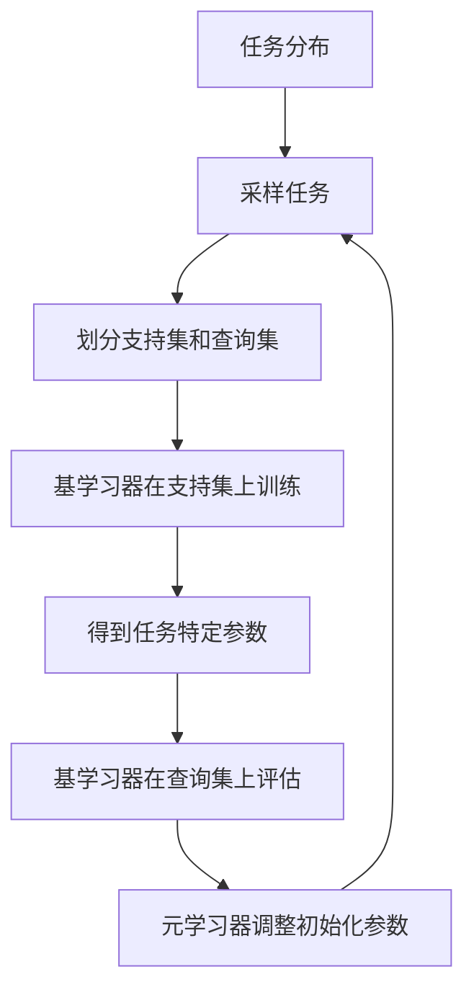

# 基于元学习的AI快速适应新任务的方法探索

> 关键词：元学习、AI、快速适应、新任务、机器学习

> 摘要：本文旨在深入探索基于元学习的AI快速适应新任务的方法。首先介绍了研究的背景、目的、预期读者、文档结构和相关术语。接着阐述了元学习的核心概念、联系以及架构原理，并给出了相应的文本示意图和Mermaid流程图。详细讲解了核心算法原理，通过Python源代码进行说明，同时介绍了相关的数学模型和公式，并举例说明。通过项目实战，展示了开发环境搭建、源代码实现和代码解读。探讨了元学习在实际中的应用场景，推荐了学习资源、开发工具框架和相关论文著作。最后总结了未来发展趋势与挑战，提供了常见问题解答和扩展阅读参考资料。

## 1. 背景介绍 
### 1.1 目的和范围
在传统的机器学习中，模型通常需要大量的数据和长时间的训练才能在特定任务上取得较好的效果。然而，在现实世界中，新的任务不断涌现，要求AI系统能够快速适应这些新任务。元学习（Meta-learning）作为一种新兴的机器学习范式，旨在让模型学会如何学习，从而能够在少量数据和短时间内快速适应新任务。本文的目的是探索基于元学习的AI快速适应新任务的方法，涵盖元学习的核心概念、算法原理、实际应用等方面。

### 1.2 预期读者
本文预期读者包括机器学习、人工智能领域的研究人员、开发者，以及对元学习感兴趣的学生和爱好者。对于有一定机器学习基础的读者，能够深入了解元学习的原理和应用；对于初学者，也能通过本文建立对元学习的基本认识。

### 1.3 文档结构概述
本文将按照以下结构进行组织：首先介绍相关术语，然后阐述元学习的核心概念和联系，接着讲解核心算法原理和具体操作步骤，介绍数学模型和公式，通过项目实战展示代码实现和解读，探讨实际应用场景，推荐学习资源、开发工具框架和相关论文著作，最后总结未来发展趋势与挑战，提供常见问题解答和扩展阅读参考资料。

### 1.4 术语表
#### 1.4.1 核心术语定义
- **元学习（Meta-learning）**：也称为“学习如何学习”，是一种让模型在多个任务上进行训练，从而学会快速适应新任务的机器学习范式。
- **基学习器（Base learner）**：在元学习中，用于在具体任务上进行学习的模型。
- **元学习器（Meta-learner）**：负责学习如何调整基学习器的参数，以使其能够快速适应新任务的模型。
- **支持集（Support set）**：在元学习中，用于训练基学习器的少量数据集合。
- **查询集（Query set）**：用于评估基学习器在新任务上性能的数据集。

#### 1.4.2 相关概念解释
- **少样本学习（Few-shot learning）**：是元学习的一个重要应用场景，指的是在只有少量样本的情况下进行学习和预测。
- **模型无关元学习（Model-agnostic meta-learning，MAML）**：一种流行的元学习算法，旨在找到一个通用的初始化参数，使得基学习器在经过少量梯度更新后能够快速适应新任务。

#### 1.4.3 缩略词列表
- **MAML**：Model-agnostic meta-learning
- **AI**：Artificial Intelligence
- **ML**：Machine Learning

## 2. 核心概念与联系 
### 核心概念原理
元学习的核心思想是通过在多个任务上进行训练，让模型学会如何学习，从而能够快速适应新的任务。传统的机器学习模型通常是针对单个任务进行训练，而元学习模型则是在多个任务组成的任务分布上进行训练。在面对新任务时，元学习模型可以利用之前学到的“学习能力”，通过少量的样本快速调整自身参数，以适应新任务。

### 架构的文本示意图
元学习的基本架构可以分为元学习器和基学习器两部分。元学习器负责学习如何调整基学习器的参数，以使其能够快速适应新任务。基学习器则是在具体任务上进行学习和预测的模型。

具体来说，元学习的过程可以分为以下几个步骤：
1. 从任务分布中采样一组任务。
2. 对于每个任务，将其数据集分为支持集和查询集。
3. 基学习器在支持集上进行训练，得到任务特定的参数。
4. 元学习器根据基学习器在查询集上的性能，调整基学习器的初始化参数。
5. 重复步骤1-4，直到元学习器收敛。

### Mermaid流程图


## 3. 核心算法原理 & 具体操作步骤 
### 模型无关元学习（MAML）算法原理
模型无关元学习（MAML）是一种流行的元学习算法，其核心思想是找到一个通用的初始化参数，使得基学习器在经过少量梯度更新后能够快速适应新任务。具体来说，MAML的目标是最大化基学习器在经过一次或多次梯度更新后的性能。

### 具体操作步骤
1. **初始化参数**：随机初始化基学习器的参数 $\theta$。
2. **采样任务**：从任务分布 $p(\mathcal{T})$ 中采样一组任务 $\{\mathcal{T}_1, \mathcal{T}_2, \cdots, \mathcal{T}_n\}$。
3. **内循环更新**：对于每个任务 $\mathcal{T}_i$，将其数据集分为支持集 $S_i$ 和查询集 $Q_i$。在支持集 $S_i$ 上使用梯度下降法更新基学习器的参数，得到任务特定的参数 $\theta_i'$：
   - 计算损失函数 $L(\theta, S_i)$。
   - 计算梯度 $\nabla_{\theta} L(\theta, S_i)$。
   - 更新参数 $\theta_i' = \theta - \alpha \nabla_{\theta} L(\theta, S_i)$，其中 $\alpha$ 是内循环的学习率。
4. **外循环更新**：根据基学习器在查询集 $Q_i$ 上的性能，更新基学习器的初始化参数 $\theta$：
   - 计算损失函数 $L(\theta_i', Q_i)$。
   - 计算梯度 $\nabla_{\theta} \sum_{i=1}^{n} L(\theta_i', Q_i)$。
   - 更新参数 $\theta = \theta - \beta \nabla_{\theta} \sum_{i=1}^{n} L(\theta_i', Q_i)$，其中 $\beta$ 是外循环的学习率。
5. **重复步骤2-4**：直到元学习器收敛。

### Python源代码实现
```python
import torch
import torch.nn as nn
import torch.optim as optim

# 定义基学习器
class BaseLearner(nn.Module):
    def __init__(self, input_size, hidden_size, output_size):
        super(BaseLearner, self).__init__()
        self.fc1 = nn.Linear(input_size, hidden_size)
        self.relu = nn.ReLU()
        self.fc2 = nn.Linear(hidden_size, output_size)

    def forward(self, x):
        out = self.fc1(x)
        out = self.relu(out)
        out = self.fc2(out)
        return out

# 定义元学习器
def maml(train_tasks, num_epochs, alpha, beta, input_size, hidden_size, output_size):
    # 初始化基学习器的参数
    base_learner = BaseLearner(input_size, hidden_size, output_size)
    meta_optimizer = optim.Adam(base_learner.parameters(), lr=beta)

    for epoch in range(num_epochs):
        meta_loss = 0
        for task in train_tasks:
            support_set, query_set = task
            # 内循环更新
            fast_weights = list(base_learner.parameters())
            for i in range(len(support_set)):
                x, y = support_set[i]
                logits = base_learner(x)
                loss = nn.CrossEntropyLoss()(logits, y)
                grads = torch.autograd.grad(loss, fast_weights)
                fast_weights = [w - alpha * g for w, g in zip(fast_weights, grads)]

            # 外循环更新
            for i in range(len(query_set)):
                x, y = query_set[i]
                logits = base_learner.forward_with_weights(x, fast_weights)
                meta_loss += nn.CrossEntropyLoss()(logits, y)

        # 更新基学习器的初始化参数
        meta_optimizer.zero_grad()
        meta_loss.backward()
        meta_optimizer.step()

        if (epoch + 1) % 100 == 0:
            print(f'Epoch {epoch + 1}, Meta Loss: {meta_loss.item()}')

    return base_learner

# 示例使用
input_size = 10
hidden_size = 20
output_size = 5
train_tasks = []  # 这里需要填充具体的训练任务
num_epochs = 1000
alpha = 0.01
beta = 0.001

base_learner = maml(train_tasks, num_epochs, alpha, beta, input_size, hidden_size, output_size)
```

## 4. 数学模型和公式 & 详细讲解 & 举例说明 
### 数学模型和公式
#### 内循环更新
在MAML的内循环中，对于每个任务 $\mathcal{T}_i$，我们使用梯度下降法更新基学习器的参数，得到任务特定的参数 $\theta_i'$。具体公式如下：
$$\theta_i' = \theta - \alpha \nabla_{\theta} L(\theta, S_i)$$
其中，$\theta$ 是基学习器的初始化参数，$\alpha$ 是内循环的学习率，$L(\theta, S_i)$ 是基学习器在支持集 $S_i$ 上的损失函数。

#### 外循环更新
在MAML的外循环中，我们根据基学习器在查询集 $Q_i$ 上的性能，更新基学习器的初始化参数 $\theta$。具体公式如下：
$$\theta = \theta - \beta \nabla_{\theta} \sum_{i=1}^{n} L(\theta_i', Q_i)$$
其中，$\beta$ 是外循环的学习率，$L(\theta_i', Q_i)$ 是基学习器在查询集 $Q_i$ 上的损失函数。

### 详细讲解
内循环的目的是让基学习器在支持集上快速适应每个任务，得到任务特定的参数 $\theta_i'$。外循环的目的是根据基学习器在查询集上的性能，调整基学习器的初始化参数 $\theta$，使得基学习器在经过少量梯度更新后能够快速适应新任务。

### 举例说明
假设我们有一个二分类任务，输入特征维度为2，输出维度为2。基学习器是一个简单的全连接神经网络，包含一个隐藏层。我们从任务分布中采样两个任务 $\mathcal{T}_1$ 和 $\mathcal{T}_2$，每个任务的支持集和查询集分别有10个样本。

#### 内循环更新
对于任务 $\mathcal{T}_1$，我们在支持集上使用梯度下降法更新基学习器的参数，得到任务特定的参数 $\theta_1'$。具体步骤如下：
1. 计算基学习器在支持集上的损失函数 $L(\theta, S_1)$。
2. 计算损失函数关于参数 $\theta$ 的梯度 $\nabla_{\theta} L(\theta, S_1)$。
3. 更新参数 $\theta_1' = \theta - \alpha \nabla_{\theta} L(\theta, S_1)$。

#### 外循环更新
根据基学习器在查询集 $Q_1$ 和 $Q_2$ 上的性能，更新基学习器的初始化参数 $\theta$。具体步骤如下：
1. 计算基学习器在查询集 $Q_1$ 上的损失函数 $L(\theta_1', Q_1)$ 和在查询集 $Q_2$ 上的损失函数 $L(\theta_2', Q_2)$。
2. 计算损失函数的总和 $\sum_{i=1}^{2} L(\theta_i', Q_i)$。
3. 计算总和关于参数 $\theta$ 的梯度 $\nabla_{\theta} \sum_{i=1}^{2} L(\theta_i', Q_i)$。
4. 更新参数 $\theta = \theta - \beta \nabla_{\theta} \sum_{i=1}^{2} L(\theta_i', Q_i)$。

## 5. 项目实战：代码实际案例和详细解释说明 
### 5.1  开发环境搭建
#### 安装Python
首先，确保你已经安装了Python 3.x版本。可以从Python官方网站（https://www.python.org/downloads/）下载并安装。

#### 安装必要的库
在命令行中运行以下命令安装必要的库：
```sh
pip install torch torchvision numpy matplotlib
```

### 5.2  源代码详细实现和代码解读
```python
import torch
import torch.nn as nn
import torch.optim as optim
import numpy as np
import matplotlib.pyplot as plt

# 定义基学习器
class BaseLearner(nn.Module):
    def __init__(self, input_size, hidden_size, output_size):
        super(BaseLearner, self).__init__()
        self.fc1 = nn.Linear(input_size, hidden_size)
        self.relu = nn.ReLU()
        self.fc2 = nn.Linear(hidden_size, output_size)

    def forward(self, x):
        out = self.fc1(x)
        out = self.relu(out)
        out = self.fc2(out)
        return out

    def forward_with_weights(self, x, weights):
        fc1_weight, fc1_bias, fc2_weight, fc2_bias = weights
        out = nn.functional.linear(x, fc1_weight, fc1_bias)
        out = self.relu(out)
        out = nn.functional.linear(out, fc2_weight, fc2_bias)
        return out

# 生成训练任务
def generate_tasks(num_tasks, num_samples_per_task, input_size, output_size):
    tasks = []
    for _ in range(num_tasks):
        # 生成随机数据
        x = torch.randn(num_samples_per_task, input_size)
        y = torch.randint(0, output_size, (num_samples_per_task,))

        # 划分支持集和查询集
        support_size = int(num_samples_per_task * 0.8)
        support_set = (x[:support_size], y[:support_size])
        query_set = (x[support_size:], y[support_size:])

        tasks.append((support_set, query_set))

    return tasks

# 定义元学习器
def maml(train_tasks, num_epochs, alpha, beta, input_size, hidden_size, output_size):
    # 初始化基学习器的参数
    base_learner = BaseLearner(input_size, hidden_size, output_size)
    meta_optimizer = optim.Adam(base_learner.parameters(), lr=beta)

    meta_losses = []
    for epoch in range(num_epochs):
        meta_loss = 0
        for task in train_tasks:
            support_set, query_set = task
            # 内循环更新
            fast_weights = list(base_learner.parameters())
            for i in range(len(support_set[0])):
                x, y = support_set[0][i].unsqueeze(0), support_set[1][i].unsqueeze(0)
                logits = base_learner.forward_with_weights(x, fast_weights)
                loss = nn.CrossEntropyLoss()(logits, y)
                grads = torch.autograd.grad(loss, fast_weights)
                fast_weights = [w - alpha * g for w, g in zip(fast_weights, grads)]

            # 外循环更新
            for i in range(len(query_set[0])):
                x, y = query_set[0][i].unsqueeze(0), query_set[1][i].unsqueeze(0)
                logits = base_learner.forward_with_weights(x, fast_weights)
                meta_loss += nn.CrossEntropyLoss()(logits, y)

        # 更新基学习器的初始化参数
        meta_optimizer.zero_grad()
        meta_loss.backward()
        meta_optimizer.step()

        meta_losses.append(meta_loss.item())
        if (epoch + 1) % 100 == 0:
            print(f'Epoch {epoch + 1}, Meta Loss: {meta_loss.item()}')

    # 绘制元损失曲线
    plt.plot(meta_losses)
    plt.xlabel('Epoch')
    plt.ylabel('Meta Loss')
    plt.show()

    return base_learner

# 示例使用
input_size = 10
hidden_size = 20
output_size = 5
num_tasks = 100
num_samples_per_task = 20
num_epochs = 1000
alpha = 0.01
beta = 0.001

train_tasks = generate_tasks(num_tasks, num_samples_per_task, input_size, output_size)
base_learner = maml(train_tasks, num_epochs, alpha, beta, input_size, hidden_size, output_size)
```

### 5.3  代码解读与分析
#### 基学习器
`BaseLearner` 类定义了一个简单的全连接神经网络，包含一个隐藏层。`forward` 方法用于前向传播，`forward_with_weights` 方法用于在给定参数的情况下进行前向传播。

#### 生成训练任务
`generate_tasks` 函数用于生成训练任务，每个任务包含支持集和查询集。

#### 元学习器
`maml` 函数实现了MAML算法，包括内循环更新和外循环更新。在每个epoch中，元学习器会遍历所有的训练任务，计算元损失，并更新基学习器的初始化参数。最后，绘制元损失曲线。

## 6. 实际应用场景 
### 少样本学习
少样本学习是元学习的一个重要应用场景。在实际应用中，获取大量的标注数据往往是困难且昂贵的。元学习可以让模型在只有少量样本的情况下进行学习和预测，例如图像分类、目标检测等领域。

### 快速适应新环境
在机器人领域，机器人需要在不同的环境中执行任务。元学习可以让机器人快速适应新的环境，通过少量的交互数据调整自身的行为策略。

### 个性化推荐
在个性化推荐系统中，用户的兴趣和偏好是不断变化的。元学习可以让推荐系统快速适应新用户的偏好，提供更加个性化的推荐服务。

## 7. 工具和资源推荐
### 7.1 学习资源推荐
#### 7.1.1 书籍推荐
- 《深度学习》（Deep Learning）：由Ian Goodfellow、Yoshua Bengio和Aaron Courville撰写，是深度学习领域的经典教材，涵盖了元学习的相关内容。
- 《机器学习》（Machine Learning）：由Tom Mitchell撰写，是机器学习领域的经典教材，对元学习的基本概念和算法有详细的介绍。

#### 7.1.2 在线课程
- Coursera上的“深度学习专项课程”（Deep Learning Specialization）：由Andrew Ng教授讲授，包含了深度学习的各个方面，包括元学习。
- edX上的“人工智能基础”（Introduction to Artificial Intelligence）：由MIT教授讲授，对元学习的原理和应用有深入的讲解。

#### 7.1.3 技术博客和网站
- arXiv：一个预印本平台，提供了大量关于元学习的最新研究成果。
- Medium：一个技术博客平台，有很多关于元学习的文章和教程。

### 7.2 开发工具框架推荐
#### 7.2.1 IDE和编辑器
- PyCharm：一个专业的Python IDE，提供了丰富的调试和开发工具。
- Jupyter Notebook：一个交互式的开发环境，适合进行数据分析和模型实验。

#### 7.2.2 调试和性能分析工具
- TensorBoard：一个可视化工具，用于监控模型的训练过程和性能。
- PyTorch Profiler：一个性能分析工具，用于分析模型的运行时间和内存使用情况。

#### 7.2.3 相关框架和库
- PyTorch：一个流行的深度学习框架，提供了丰富的API和工具，方便实现元学习算法。
- MetaLearn：一个专门用于元学习的Python库，提供了多种元学习算法的实现。

### 7.3 相关论文著作推荐
#### 7.3.1 经典论文
- "Model-Agnostic Meta-Learning for Fast Adaptation of Deep Networks"：介绍了MAML算法，是元学习领域的经典论文。
- "Matching Networks for One Shot Learning"：提出了匹配网络（Matching Networks），用于少样本学习。

#### 7.3.2 最新研究成果
- 关注arXiv上的最新论文，了解元学习领域的最新研究进展。

#### 7.3.3 应用案例分析
- 可以在ACM、IEEE等学术数据库中搜索元学习的应用案例，了解元学习在实际中的应用。

## 8. 总结：未来发展趋势与挑战
### 未来发展趋势
- **与其他技术的融合**：元学习可能会与强化学习、迁移学习等技术相结合，形成更加强大的学习范式。
- **在实际应用中的拓展**：元学习将在更多的领域得到应用，如医疗、金融、交通等。
- **理论研究的深入**：对元学习的理论基础进行深入研究，进一步提高元学习的性能和可解释性。

### 挑战
- **计算资源需求**：元学习通常需要大量的计算资源，如何在有限的计算资源下提高元学习的效率是一个挑战。
- **数据质量和多样性**：元学习的性能高度依赖于数据的质量和多样性，如何获取高质量、多样化的数据是一个挑战。
- **模型可解释性**：元学习模型通常比较复杂，如何提高模型的可解释性是一个重要的研究方向。

## 9. 附录：常见问题与解答
### 元学习和传统机器学习有什么区别？
传统机器学习模型通常是针对单个任务进行训练，需要大量的数据和长时间的训练才能取得较好的效果。而元学习模型是在多个任务上进行训练，学会如何学习，能够在少量数据和短时间内快速适应新任务。

### MAML算法的优缺点是什么？
优点：MAML算法具有模型无关性，可以应用于各种类型的基学习器；能够在少量样本的情况下快速适应新任务。缺点：计算复杂度较高，需要大量的计算资源；对超参数比较敏感，需要仔细调整。

### 如何选择合适的元学习算法？
选择合适的元学习算法需要考虑任务的特点、数据的规模和质量、计算资源等因素。如果任务是少样本学习，MAML算法是一个不错的选择；如果任务是基于记忆的学习，匹配网络（Matching Networks）可能更适合。

## 10. 扩展阅读 & 参考资料
### 扩展阅读
- 阅读更多关于元学习的论文和书籍，深入了解元学习的理论和应用。
- 参与元学习的开源项目，实践和探索元学习的技术。

### 参考资料
- "Model-Agnostic Meta-Learning for Fast Adaptation of Deep Networks"
- "Matching Networks for One Shot Learning"
- 《深度学习》（Deep Learning）
- 《机器学习》（Machine Learning）

作者：AI天才研究院/AI Genius Institute & 禅与计算机程序设计艺术 /Zen And The Art of Computer Programming