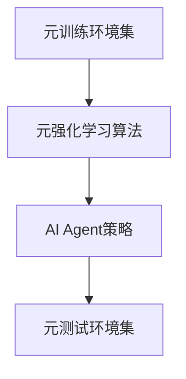

# 基于元强化学习的AI Agent策略泛化

> 关键词：元强化学习、AI Agent、策略泛化、强化学习算法、泛化能力提升

> 摘要：本文聚焦于基于元强化学习的AI Agent策略泛化这一前沿领域。首先介绍了研究的背景、目的和范围，明确预期读者与文档结构。详细阐述了元强化学习、AI Agent、策略泛化等核心概念及其联系，并给出相应的文本示意图和Mermaid流程图。深入讲解了核心算法原理，结合Python源代码进行具体操作步骤的说明。通过数学模型和公式对策略泛化过程进行了严谨分析，并举例说明。以项目实战展示了代码的实际案例，包括开发环境搭建、源代码实现与解读。探讨了该技术在不同场景的实际应用，推荐了学习资源、开发工具框架以及相关论文著作。最后总结了未来发展趋势与挑战，解答常见问题，并提供扩展阅读与参考资料，旨在为该领域的研究和实践提供全面而深入的指导。

## 1. 背景介绍 
### 1.1 目的和范围
在人工智能领域，AI Agent的策略泛化能力是衡量其智能水平和实用性的关键指标之一。传统的强化学习方法在特定环境下训练出的策略往往难以在新的、未见过的环境中有效执行，这限制了AI Agent的应用范围。元强化学习作为一种新兴的技术，旨在通过学习如何学习，使AI Agent能够快速适应新环境，提高策略的泛化能力。本文的目的在于深入探讨基于元强化学习的AI Agent策略泛化的原理、算法和应用，为相关研究和实践提供全面的理论和技术支持。范围涵盖了从核心概念的阐述、算法原理的分析、数学模型的建立，到实际项目的开发和应用场景的探讨。

### 1.2 预期读者
本文预期读者包括人工智能、机器学习、强化学习领域的研究人员、工程师和学生。对于希望深入了解元强化学习和策略泛化技术的专业人士，本文提供了详细的理论和实践指导；对于初学者，本文从基础概念出发，逐步引导读者理解该领域的核心知识和技术。

### 1.3 文档结构概述
本文共分为十个部分。第一部分为背景介绍，阐述研究的目的、范围、预期读者和文档结构。第二部分介绍核心概念与联系，包括元强化学习、AI Agent和策略泛化的原理和架构，并给出相应的示意图和流程图。第三部分讲解核心算法原理和具体操作步骤，通过Python源代码进行详细说明。第四部分建立数学模型和公式，对策略泛化过程进行深入分析，并举例说明。第五部分进行项目实战，包括开发环境搭建、源代码实现和代码解读。第六部分探讨实际应用场景。第七部分推荐学习资源、开发工具框架和相关论文著作。第八部分总结未来发展趋势与挑战。第九部分为附录，解答常见问题。第十部分提供扩展阅读和参考资料。

### 1.4 术语表
#### 1.4.1 核心术语定义
- **元强化学习（Meta-Reinforcement Learning）**：一种强化学习方法，通过在多个任务上进行学习，使智能体能够快速适应新的任务，学习如何学习。
- **AI Agent（人工智能智能体）**：能够感知环境、做出决策并执行动作的人工智能实体。
- **策略泛化（Policy Generalization）**：AI Agent在训练环境中学到的策略能够在未见过的新环境中有效执行的能力。
- **强化学习（Reinforcement Learning）**：一种机器学习方法，智能体通过与环境进行交互，根据环境反馈的奖励信号来学习最优策略。
- **策略（Policy）**：智能体在特定状态下选择动作的规则。

#### 1.4.2 相关概念解释
- **任务分布（Task Distribution）**：一组相关任务的集合，元强化学习通常在任务分布上进行训练。
- **元训练（Meta-Training）**：在多个任务上进行训练，使智能体学习到如何快速适应新任务的过程。
- **元测试（Meta-Testing）**：在未见过的新任务上测试智能体的泛化能力的过程。
- **奖励函数（Reward Function）**：定义了智能体在环境中执行动作后获得的奖励值，用于指导智能体的学习。

#### 1.4.3 缩略词列表
- **MDP（Markov Decision Process）**：马尔可夫决策过程，是强化学习中常用的数学模型。
- **PPO（Proximal Policy Optimization）**：近端策略优化算法，一种常用的强化学习算法。
- **VPG（Vanilla Policy Gradient）**：香草策略梯度算法，一种基本的策略梯度算法。
- **LSTM（Long Short-Term Memory）**：长短期记忆网络，一种循环神经网络，常用于处理序列数据。

## 2. 核心概念与联系 

### 核心概念原理
#### 元强化学习
元强化学习的核心思想是在多个任务上进行学习，使智能体能够学习到如何快速适应新的任务。传统的强化学习方法通常在单个任务上进行训练，而元强化学习则考虑了任务之间的相关性，通过在多个任务上进行学习，智能体可以学习到通用的学习策略，从而在新任务上能够更快地收敛到最优策略。

#### AI Agent
AI Agent是能够感知环境、做出决策并执行动作的人工智能实体。在强化学习中，AI Agent通过与环境进行交互，根据环境的状态选择动作，并根据环境反馈的奖励信号来调整自己的策略。AI Agent的目标是在环境中最大化累积奖励。

#### 策略泛化
策略泛化是指AI Agent在训练环境中学到的策略能够在未见过的新环境中有效执行的能力。在实际应用中，环境往往是动态变化的，AI Agent需要具备良好的策略泛化能力才能在不同的环境中正常工作。元强化学习通过学习如何学习，提高了AI Agent的策略泛化能力。

### 架构的文本示意图
```plaintext
            +----------------+
            |  元训练环境集  |
            +----------------+
                    |
                    v
            +----------------+
            |  元强化学习算法  |
            +----------------+
                    |
                    v
            +----------------+
            |   AI Agent策略  |
            +----------------+
                    |
                    v
            +----------------+
            |  元测试环境集  |
            +----------------+
```

### Mermaid流程图


## 3. 核心算法原理 & 具体操作步骤 

### 核心算法原理
基于元强化学习的AI Agent策略泛化通常采用策略梯度算法。策略梯度算法通过直接优化策略来最大化累积奖励。在元强化学习中，我们的目标是在多个任务上学习一个通用的策略，使得智能体能够快速适应新的任务。

一种常用的元强化学习算法是基于模型无关的元学习（Model-Agnostic Meta-Learning，MAML）。MAML的核心思想是找到一个初始策略，使得在新任务上进行少量的梯度更新后，策略能够快速收敛到最优策略。

### 具体操作步骤及Python源代码

```python
import torch
import torch.nn as nn
import torch.optim as optim

# 定义策略网络
class PolicyNetwork(nn.Module):
    def __init__(self, input_dim, output_dim):
        super(PolicyNetwork, self).__init__()
        self.fc1 = nn.Linear(input_dim, 64)
        self.fc2 = nn.Linear(64, output_dim)

    def forward(self, x):
        x = torch.relu(self.fc1(x))
        x = torch.softmax(self.fc2(x), dim=-1)
        return x

# 定义元训练函数
def meta_train(policy_network, meta_optimizer, meta_envs, num_tasks, num_updates):
    for task in range(num_tasks):
        # 选择一个任务环境
        env = meta_envs[task]
        state = env.reset()
        # 保存初始参数
        params = list(policy_network.parameters())
        # 进行内循环更新
        for update in range(num_updates):
            log_probs = []
            rewards = []
            for step in range(100):
                state_tensor = torch.FloatTensor(state).unsqueeze(0)
                action_probs = policy_network(state_tensor)
                action = torch.multinomial(action_probs, 1).item()
                next_state, reward, done, _ = env.step(action)
                log_prob = torch.log(action_probs.squeeze(0)[action])
                log_probs.append(log_prob)
                rewards.append(reward)
                state = next_state
                if done:
                    break
            # 计算损失
            returns = []
            discounted_return = 0
            for r in reversed(rewards):
                discounted_return = r + 0.9 * discounted_return
                returns.insert(0, discounted_return)
            returns = torch.FloatTensor(returns)
            log_probs = torch.stack(log_probs)
            loss = -(log_probs * returns).sum()
            # 计算梯度
            grads = torch.autograd.grad(loss, params)
            # 更新参数
            new_params = []
            for param, grad in zip(params, grads):
                new_param = param - 0.01 * grad
                new_params.append(new_param)
            # 替换参数
            for param, new_param in zip(policy_network.parameters(), new_params):
                param.data = new_param.data
        # 进行外循环更新
        state = env.reset()
        log_probs = []
        rewards = []
        for step in range(100):
            state_tensor = torch.FloatTensor(state).unsqueeze(0)
            action_probs = policy_network(state_tensor)
            action = torch.multinomial(action_probs, 1).item()
            next_state, reward, done, _ = env.step(action)
            log_prob = torch.log(action_probs.squeeze(0)[action])
            log_probs.append(log_prob)
            rewards.append(reward)
            state = next_state
            if done:
                break
        # 计算损失
        returns = []
        discounted_return = 0
        for r in reversed(rewards):
            discounted_return = r + 0.9 * discounted_return
            returns.insert(0, discounted_return)
        returns = torch.FloatTensor(returns)
        log_probs = torch.stack(log_probs)
        meta_loss = -(log_probs * returns).sum()
        # 反向传播
        meta_optimizer.zero_grad()
        meta_loss.backward()
        meta_optimizer.step()
    return policy_network

# 定义元测试函数
def meta_test(policy_network, test_env):
    state = test_env.reset()
    total_reward = 0
    for step in range(100):
        state_tensor = torch.FloatTensor(state).unsqueeze(0)
        action_probs = policy_network(state_tensor)
        action = torch.multinomial(action_probs, 1).item()
        next_state, reward, done, _ = test_env.step(action)
        total_reward += reward
        state = next_state
        if done:
            break
    return total_reward

# 主函数
if __name__ == "__main__":
    input_dim = 4
    output_dim = 2
    policy_network = PolicyNetwork(input_dim, output_dim)
    meta_optimizer = optim.Adam(policy_network.parameters(), lr=0.001)
    # 假设这里有多个训练环境
    meta_envs = [None] * 10  # 这里需要替换为实际的环境
    num_tasks = 10
    num_updates = 5
    # 元训练
    trained_policy_network = meta_train(policy_network, meta_optimizer, meta_envs, num_tasks, num_updates)
    # 假设这里有一个测试环境
    test_env = None  # 这里需要替换为实际的环境
    # 元测试
    total_reward = meta_test(trained_policy_network, test_env)
    print(f"Total reward in test environment: {total_reward}")


```

### 代码解释
1. **策略网络定义**：`PolicyNetwork` 类定义了一个简单的神经网络，用于表示AI Agent的策略。输入是环境的状态，输出是动作的概率分布。
2. **元训练函数**：`meta_train` 函数实现了元训练的过程。在每个任务上，首先进行内循环更新，通过在任务环境中进行交互，计算损失并更新参数。然后进行外循环更新，再次在任务环境中进行交互，计算元损失并更新初始参数。
3. **元测试函数**：`meta_test` 函数用于在测试环境中测试训练好的策略。在测试环境中，智能体根据策略选择动作，与环境进行交互，计算累积奖励。
4. **主函数**：在主函数中，我们初始化策略网络和优化器，定义训练环境和测试环境，调用元训练函数进行训练，然后调用元测试函数进行测试。

## 4. 数学模型和公式 & 详细讲解 & 举例说明 

### 马尔可夫决策过程（MDP）
马尔可夫决策过程是强化学习中常用的数学模型，用于描述智能体与环境的交互过程。一个MDP可以用一个五元组 $\langle S, A, P, R, \gamma \rangle$ 表示，其中：
- $S$ 是状态空间，表示环境的所有可能状态。
- $A$ 是动作空间，表示智能体可以采取的所有可能动作。
- $P(s'|s, a)$ 是状态转移概率，表示在状态 $s$ 下采取动作 $a$ 后转移到状态 $s'$ 的概率。
- $R(s, a)$ 是奖励函数，表示在状态 $s$ 下采取动作 $a$ 后获得的奖励。
- $\gamma \in [0, 1]$ 是折扣因子，用于衡量未来奖励的重要性。

### 策略梯度算法
策略梯度算法通过直接优化策略来最大化累积奖励。策略 $\pi(a|s; \theta)$ 表示在状态 $s$ 下选择动作 $a$ 的概率，其中 $\theta$ 是策略的参数。策略梯度算法的目标是最大化期望累积奖励：

$$J(\theta) = \mathbb{E}_{\tau \sim \pi(\tau; \theta)} \left[ \sum_{t=0}^{T} \gamma^t R(s_t, a_t) \right]$$

其中 $\tau = (s_0, a_0, s_1, a_1, \cdots, s_T, a_T)$ 是一个轨迹，$\pi(\tau; \theta)$ 是生成轨迹 $\tau$ 的概率。

根据策略梯度定理，策略梯度可以表示为：

$$\nabla_{\theta} J(\theta) = \mathbb{E}_{\tau \sim \pi(\tau; \theta)} \left[ \sum_{t=0}^{T} \nabla_{\theta} \log \pi(a_t|s_t; \theta) \sum_{k=t}^{T} \gamma^{k-t} R(s_k, a_k) \right]$$

### 基于模型无关的元学习（MAML）
MAML的目标是找到一个初始策略 $\theta$，使得在新任务上进行少量的梯度更新后，策略能够快速收敛到最优策略。具体来说，对于一个任务 $\mathcal{T}$，我们首先在任务 $\mathcal{T}$ 上进行一次梯度更新，得到新的策略 $\theta'$：

$$\theta' = \theta - \alpha \nabla_{\theta} L(\theta; \mathcal{T})$$

其中 $\alpha$ 是学习率，$L(\theta; \mathcal{T})$ 是任务 $\mathcal{T}$ 上的损失函数。然后我们在新策略 $\theta'$ 上计算元损失 $L(\theta'; \mathcal{T})$，并更新初始策略 $\theta$：

$$\theta \leftarrow \theta - \beta \nabla_{\theta} L(\theta'; \mathcal{T})$$

其中 $\beta$ 是元学习率。

### 举例说明
假设我们有一个简单的二维迷宫环境，智能体的目标是从起点到达终点。状态空间 $S$ 是迷宫中所有可能的位置，动作空间 $A$ 是上下左右四个方向。奖励函数 $R(s, a)$ 在到达终点时为正，否则为负。我们可以使用策略梯度算法来训练智能体的策略，通过不断更新策略的参数 $\theta$，使得智能体能够找到最优路径。在元强化学习中，我们可以在多个不同的迷宫环境上进行训练，学习一个通用的策略，使得智能体能够快速适应新的迷宫环境。

## 5. 项目实战：代码实际案例和详细解释说明 

### 5.1  开发环境搭建
#### 安装Python
首先，确保你已经安装了Python 3.6或更高版本。可以从Python官方网站（https://www.python.org/downloads/）下载并安装Python。

#### 安装依赖库
在命令行中使用以下命令安装所需的依赖库：
```sh
pip install torch gym
```
- `torch` 是PyTorch深度学习框架，用于构建和训练神经网络。
- `gym` 是OpenAI开发的强化学习环境库，提供了各种模拟环境。

### 5.2  源代码详细实现和代码解读
```python
import torch
import torch.nn as nn
import torch.optim as optim
import gym

# 定义策略网络
class PolicyNetwork(nn.Module):
    def __init__(self, input_dim, output_dim):
        super(PolicyNetwork, self).__init__()
        self.fc1 = nn.Linear(input_dim, 64)
        self.fc2 = nn.Linear(64, output_dim)

    def forward(self, x):
        x = torch.relu(self.fc1(x))
        x = torch.softmax(self.fc2(x), dim=-1)
        return x

# 定义元训练函数
def meta_train(policy_network, meta_optimizer, meta_envs, num_tasks, num_updates):
    for task in range(num_tasks):
        # 选择一个任务环境
        env = meta_envs[task]
        state = env.reset()
        # 保存初始参数
        params = list(policy_network.parameters())
        # 进行内循环更新
        for update in range(num_updates):
            log_probs = []
            rewards = []
            for step in range(100):
                state_tensor = torch.FloatTensor(state).unsqueeze(0)
                action_probs = policy_network(state_tensor)
                action = torch.multinomial(action_probs, 1).item()
                next_state, reward, done, _ = env.step(action)
                log_prob = torch.log(action_probs.squeeze(0)[action])
                log_probs.append(log_prob)
                rewards.append(reward)
                state = next_state
                if done:
                    break
            # 计算损失
            returns = []
            discounted_return = 0
            for r in reversed(rewards):
                discounted_return = r + 0.9 * discounted_return
                returns.insert(0, discounted_return)
            returns = torch.FloatTensor(returns)
            log_probs = torch.stack(log_probs)
            loss = -(log_probs * returns).sum()
            # 计算梯度
            grads = torch.autograd.grad(loss, params)
            # 更新参数
            new_params = []
            for param, grad in zip(params, grads):
                new_param = param - 0.01 * grad
                new_params.append(new_param)
            # 替换参数
            for param, new_param in zip(policy_network.parameters(), new_params):
                param.data = new_param.data
        # 进行外循环更新
        state = env.reset()
        log_probs = []
        rewards = []
        for step in range(100):
            state_tensor = torch.FloatTensor(state).unsqueeze(0)
            action_probs = policy_network(state_tensor)
            action = torch.multinomial(action_probs, 1).item()
            next_state, reward, done, _ = env.step(action)
            log_prob = torch.log(action_probs.squeeze(0)[action])
            log_probs.append(log_prob)
            rewards.append(reward)
            state = next_state
            if done:
                break
        # 计算损失
        returns = []
        discounted_return = 0
        for r in reversed(rewards):
            discounted_return = r + 0.9 * discounted_return
            returns.insert(0, discounted_return)
        returns = torch.FloatTensor(returns)
        log_probs = torch.stack(log_probs)
        meta_loss = -(log_probs * returns).sum()
        # 反向传播
        meta_optimizer.zero_grad()
        meta_loss.backward()
        meta_optimizer.step()
    return policy_network

# 定义元测试函数
def meta_test(policy_network, test_env):
    state = test_env.reset()
    total_reward = 0
    for step in range(100):
        state_tensor = torch.FloatTensor(state).unsqueeze(0)
        action_probs = policy_network(state_tensor)
        action = torch.multinomial(action_probs, 1).item()
        next_state, reward, done, _ = test_env.step(action)
        total_reward += reward
        state = next_state
        if done:
            break
    return total_reward

# 主函数
if __name__ == "__main__":
    # 创建环境
    meta_envs = [gym.make('CartPole-v1') for _ in range(10)]
    test_env = gym.make('CartPole-v1')
    input_dim = meta_envs[0].observation_space.shape[0]
    output_dim = meta_envs[0].action_space.n
    policy_network = PolicyNetwork(input_dim, output_dim)
    meta_optimizer = optim.Adam(policy_network.parameters(), lr=0.001)
    num_tasks = 10
    num_updates = 5
    # 元训练
    trained_policy_network = meta_train(policy_network, meta_optimizer, meta_envs, num_tasks, num_updates)
    # 元测试
    total_reward = meta_test(trained_policy_network, test_env)
    print(f"Total reward in test environment: {total_reward}")


```

### 5.3  代码解读与分析
#### 策略网络定义
`PolicyNetwork` 类定义了一个简单的两层全连接神经网络，用于表示AI Agent的策略。输入层的维度是环境的状态维度，输出层的维度是动作空间的维度。通过 `torch.softmax` 函数将输出转换为动作的概率分布。

#### 元训练函数
`meta_train` 函数实现了元训练的核心逻辑。在每个任务上，首先进行内循环更新，通过在任务环境中进行交互，计算损失并更新参数。内循环更新的目的是让策略快速适应当前任务。然后进行外循环更新，再次在任务环境中进行交互，计算元损失并更新初始参数。外循环更新的目的是让初始策略能够在多个任务上都具有较好的泛化能力。

#### 元测试函数
`meta_test` 函数用于在测试环境中测试训练好的策略。在测试环境中，智能体根据策略选择动作，与环境进行交互，计算累积奖励。通过累积奖励可以评估策略的泛化能力。

#### 主函数
在主函数中，我们创建了多个训练环境和一个测试环境，初始化策略网络和优化器，调用元训练函数进行训练，然后调用元测试函数进行测试。最后打印出测试环境中的累积奖励。

## 6. 实际应用场景 
### 机器人控制
在机器人控制领域，机器人需要在不同的环境中执行各种任务，如导航、抓取等。基于元强化学习的AI Agent策略泛化可以使机器人快速适应新的环境和任务。例如，在一个仓库环境中，机器人需要学习如何在不同的货架布局下进行导航和货物抓取。通过元强化学习，机器人可以在多个不同的仓库布局上进行训练，学习到通用的导航和抓取策略，从而在新的仓库布局中能够快速适应。

### 游戏AI
在游戏领域，游戏环境通常是动态变化的，AI Agent需要具备良好的策略泛化能力才能在不同的游戏场景中取得胜利。例如，在即时战略游戏中，地图布局、资源分布等因素都会影响游戏的进程。基于元强化学习的AI Agent可以在多个不同的游戏地图和资源分布上进行训练，学习到通用的游戏策略，从而在新的游戏场景中能够快速做出决策。

### 自动驾驶
在自动驾驶领域，车辆需要在不同的道路条件、交通规则和天气状况下行驶。基于元强化学习的AI Agent策略泛化可以使自动驾驶车辆快速适应新的驾驶环境。例如，在不同城市的道路上，交通规则和道路布局可能会有所不同。通过元强化学习，自动驾驶车辆可以在多个不同城市的道路上进行训练，学习到通用的驾驶策略，从而在新的城市中能够安全、高效地行驶。

### 金融投资
在金融投资领域，市场环境是复杂多变的，投资者需要根据不同的市场情况做出决策。基于元强化学习的AI Agent策略泛化可以帮助投资者快速适应新的市场环境。例如，在不同的经济周期和市场波动下，股票、债券等资产的表现会有所不同。通过元强化学习，AI Agent可以在多个不同的市场环境下进行训练，学习到通用的投资策略，从而在新的市场环境中能够做出更明智的投资决策。

## 7. 工具和资源推荐
### 7.1 学习资源推荐
#### 7.1.1 书籍推荐
- 《Reinforcement Learning: An Introduction》（《强化学习：原理与Python实现》）：这本书是强化学习领域的经典教材，详细介绍了强化学习的基本概念、算法和应用。
- 《Deep Reinforcement Learning Hands-On》（《深度强化学习实战》）：本书通过实际案例介绍了深度强化学习的应用，包括基于元强化学习的方法。
- 《Meta-Learning: A Survey》（《元学习：综述》）：这篇综述文章全面介绍了元学习的概念、算法和应用，是了解元学习领域的重要参考资料。

#### 7.1.2 在线课程
- Coursera上的“Reinforcement Learning Specialization”：这是一个由多门课程组成的强化学习专项课程，涵盖了强化学习的基础知识和高级算法。
- Udemy上的“Deep Reinforcement Learning A-Z™: Hands-On Artificial Intelligence”：该课程通过实际项目介绍了深度强化学习的应用，包括元强化学习。
- OpenAI Gym官方文档和教程：OpenAI Gym是一个广泛使用的强化学习环境库，其官方文档和教程提供了丰富的学习资源。

#### 7.1.3 技术博客和网站
- Medium上的“Towards Data Science”：该博客上有许多关于强化学习和元学习的文章，涵盖了最新的研究成果和应用案例。
- ArXiv.org：这是一个预印本平台，提供了大量关于机器学习和人工智能的最新研究论文。
- GitHub上的强化学习和元学习相关项目：GitHub上有许多开源的强化学习和元学习项目，可以通过学习这些项目的代码来深入了解相关技术。

### 7.2 开发工具框架推荐
#### 7.2.1 IDE和编辑器
- PyCharm：这是一个功能强大的Python集成开发环境，提供了代码编辑、调试、版本控制等功能，非常适合开发强化学习和元学习项目。
- Jupyter Notebook：这是一个交互式的开发环境，适合进行数据探索、模型训练和可视化。可以通过Jupyter Notebook快速验证算法和模型的效果。
- Visual Studio Code：这是一个轻量级的代码编辑器，支持多种编程语言和插件，具有丰富的扩展功能，可以提高开发效率。

#### 7.2.2 调试和性能分析工具
- PyTorch Profiler：这是PyTorch提供的性能分析工具，可以帮助开发者分析模型的运行时间、内存使用等情况，优化模型的性能。
- TensorBoard：这是TensorFlow提供的可视化工具，也可以与PyTorch结合使用。通过TensorBoard可以可视化模型的训练过程、损失曲线等信息，方便调试和优化模型。
- cProfile：这是Python标准库中的性能分析工具，可以分析Python代码的运行时间和函数调用情况，帮助开发者找出性能瓶颈。

#### 7.2.3 相关框架和库
- PyTorch：这是一个广泛使用的深度学习框架，提供了丰富的神经网络层和优化算法，支持GPU加速。在强化学习和元学习领域，PyTorch被广泛应用于模型的构建和训练。
- TensorFlow：这是另一个流行的深度学习框架，具有强大的分布式训练和部署能力。TensorFlow也提供了许多强化学习和元学习的工具和库。
- OpenAI Gym：这是一个开源的强化学习环境库，提供了各种模拟环境，如经典控制问题、Atari游戏等。可以使用OpenAI Gym快速搭建强化学习实验环境。
- Stable Baselines：这是一个基于OpenAI Gym和PyTorch/TensorFlow的强化学习库，提供了许多常用的强化学习算法的实现，方便开发者进行实验和应用。

### 7.3 相关论文著作推荐
#### 7.3.1 经典论文
- "Model-Agnostic Meta-Learning for Fast Adaptation of Deep Networks"（《用于深度网络快速适应的模型无关元学习》）：这篇论文提出了MAML算法，是元学习领域的经典之作。
- "Proximal Policy Optimization Algorithms"（《近端策略优化算法》）：这篇论文提出了PPO算法，是一种高效的策略梯度算法，在强化学习领域得到了广泛应用。
- "Deep Reinforcement Learning with Double Q-Learning"（《基于双Q学习的深度强化学习》）：这篇论文提出了Double Q-Learning算法，有效解决了Q学习中的过估计问题。

#### 7.3.2 最新研究成果
- 在ArXiv.org上搜索“Meta-Reinforcement Learning”和“Policy Generalization”等关键词，可以找到最新的研究论文。这些论文涵盖了元强化学习和策略泛化的最新算法和应用。
- 参加机器学习和人工智能领域的顶级会议，如NeurIPS、ICML、AAAI等，这些会议上会发布许多关于元强化学习和策略泛化的最新研究成果。

#### 7.3.3 应用案例分析
- 在IEEE Xplore、ACM Digital Library等学术数据库中搜索相关的应用案例论文。这些论文介绍了元强化学习和策略泛化在机器人控制、游戏AI、自动驾驶等领域的实际应用案例，可以从中学习到如何将理论知识应用到实际项目中。

## 8. 总结：未来发展趋势与挑战
### 未来发展趋势
#### 与其他技术的融合
元强化学习可能会与深度学习、迁移学习、进化算法等技术进一步融合，以提高AI Agent的策略泛化能力和学习效率。例如，将元强化学习与深度学习中的注意力机制相结合，可以使智能体更加关注环境中的重要信息，提高决策的准确性。

#### 应用领域的拓展
随着技术的不断发展，基于元强化学习的AI Agent策略泛化将在更多领域得到应用，如医疗保健、农业、能源管理等。在医疗保健领域，智能体可以学习如何根据不同患者的病情制定个性化的治疗方案；在农业领域，智能体可以学习如何根据不同的土壤条件和气候环境进行精准农业生产。

#### 理论研究的深入
未来，关于元强化学习和策略泛化的理论研究将更加深入。研究人员将探索更加有效的算法和模型，提高智能体的学习能力和泛化能力。同时，理论研究也将为实际应用提供更加坚实的基础。

### 挑战
#### 计算资源需求
元强化学习通常需要大量的计算资源和时间来进行训练。随着任务的复杂性和数量的增加，计算资源的需求将进一步提高。如何在有限的计算资源下提高训练效率是一个亟待解决的问题。

#### 环境建模和数据收集
在实际应用中，环境的建模和数据的收集是一个具有挑战性的任务。环境的复杂性和不确定性使得准确建模和收集足够的数据变得困难。如何设计有效的环境模型和数据收集方法是提高策略泛化能力的关键。

#### 可解释性和安全性
基于元强化学习的AI Agent通常是一个黑盒模型，其决策过程难以解释。在一些关键领域，如医疗保健和自动驾驶，可解释性和安全性是至关重要的。如何提高模型的可解释性和安全性是未来研究的重要方向。

## 9. 附录：常见问题与解答
### 问题1：元强化学习和传统强化学习有什么区别？
传统强化学习通常在单个任务上进行训练，智能体学习到的策略只能在该任务上有效。而元强化学习在多个任务上进行训练，智能体学习到的是如何快速适应新任务的能力，能够在未见过的新任务上快速收敛到最优策略，具有更好的策略泛化能力。

### 问题2：MAML算法的优缺点是什么？
优点：MAML算法具有较强的通用性和灵活性，可以应用于各种不同的任务和模型。通过少量的梯度更新，MAML可以使策略快速适应新任务。
缺点：MAML算法的计算复杂度较高，需要在每个任务上进行多次梯度更新。同时，MAML算法对超参数比较敏感，需要仔细调整超参数才能取得较好的效果。

### 问题3：如何评估AI Agent的策略泛化能力？
可以通过在未见过的新环境中测试AI Agent的性能来评估其策略泛化能力。常用的评估指标包括累积奖励、成功率等。累积奖励越高、成功率越高，说明AI Agent的策略泛化能力越强。

### 问题4：在实际应用中，如何选择合适的元强化学习算法？
选择合适的元强化学习算法需要考虑多个因素，如任务的复杂性、数据的规模、计算资源等。如果任务比较简单，可以选择一些简单的元强化学习算法，如MAML；如果任务比较复杂，需要考虑使用更高效的算法，如基于模型的元强化学习算法。同时，还需要根据实际情况进行实验和比较，选择最适合的算法。

## 10. 扩展阅读 & 参考资料
### 扩展阅读
- "Hierarchical Meta-Reinforcement Learning"（《分层元强化学习》）：介绍了分层元强化学习的概念和算法，进一步提高了智能体的学习能力和泛化能力。
- "Meta-Learning for Few-Shot Learning in Deep Neural Networks"（《深度神经网络中用于少样本学习的元学习》）：探讨了元学习在少样本学习中的应用，解决了数据稀缺情况下的学习问题。
- "Reinforcement Learning in Continuous Action Spaces"（《连续动作空间中的强化学习》）：介绍了在连续动作空间中进行强化学习的方法和技术。

### 参考资料
- OpenAI官方文档：https://openai.com/
- PyTorch官方文档：https://pytorch.org/
- TensorFlow官方文档：https://www.tensorflow.org/
- OpenAI Gym官方文档：https://gym.openai.com/
- Stable Baselines官方文档：https://stable-baselines.readthedocs.io/

作者：AI天才研究院/AI Genius Institute & 禅与计算机程序设计艺术 /Zen And The Art of Computer Programming