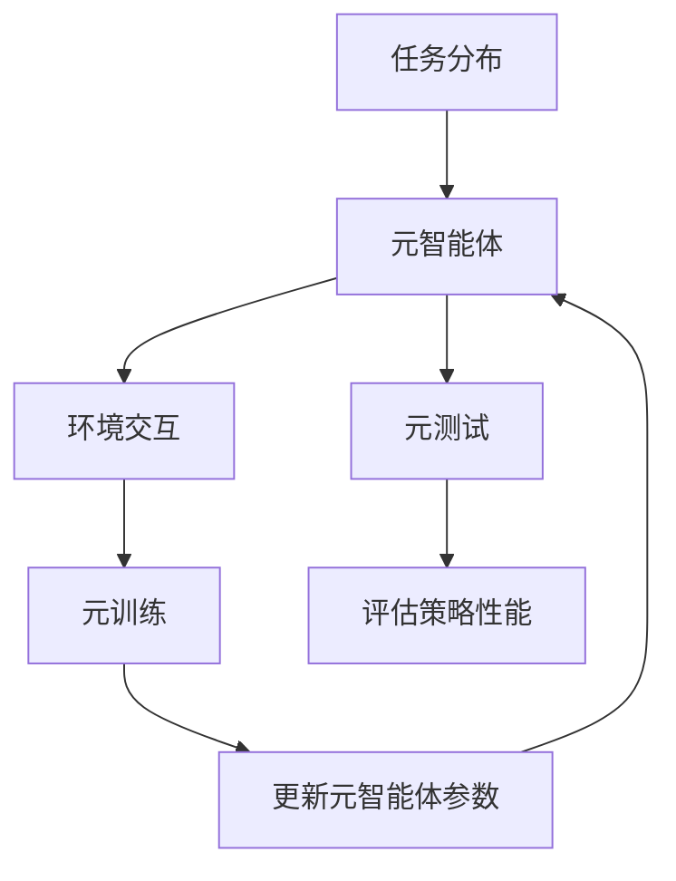

# 基于元强化学习的AI Agent策略生成

> 关键词：元强化学习、AI Agent、策略生成、强化学习、智能决策

> 摘要：本文深入探讨了基于元强化学习的AI Agent策略生成技术。首先介绍了相关背景知识，包括目的、预期读者、文档结构和术语表。接着详细阐述了核心概念，给出了原理和架构的文本示意图及Mermaid流程图。对核心算法原理进行了Python代码实现和讲解，同时引入了相关数学模型和公式并举例说明。通过项目实战，展示了代码的实际案例并进行详细解读。分析了该技术的实际应用场景，推荐了学习资源、开发工具框架以及相关论文著作。最后总结了未来发展趋势与挑战，并提供了常见问题解答和扩展阅读参考资料。旨在帮助读者全面了解基于元强化学习的AI Agent策略生成的原理、实现和应用。

## 1. 背景介绍 
### 1.1 目的和范围
元强化学习作为强化学习领域的一个新兴研究方向，旨在让智能体（AI Agent）能够快速适应新的任务和环境。传统的强化学习方法在面对不同任务时，往往需要大量的训练数据和时间来学习有效的策略。而元强化学习通过学习如何学习，使得智能体能够在新任务上更快地收敛到最优策略。本文的目的是深入探讨基于元强化学习的AI Agent策略生成技术，涵盖其核心概念、算法原理、数学模型、实际应用等方面，为读者提供一个全面的技术指南。范围包括理论知识的讲解、Python代码的实现、项目实战案例以及相关工具和资源的推荐。

### 1.2 预期读者
本文预期读者包括对强化学习、元学习和人工智能领域感兴趣的研究人员、工程师和学生。具有一定的编程基础（如Python）和机器学习基础知识（如神经网络、强化学习基本概念）的读者将能够更好地理解本文内容。同时，对于希望将元强化学习技术应用到实际项目中的从业者也具有一定的参考价值。

### 1.3 文档结构概述
本文共分为十个部分。第一部分为背景介绍，包括目的和范围、预期读者、文档结构概述和术语表。第二部分介绍核心概念与联系，给出原理和架构的文本示意图及Mermaid流程图。第三部分讲解核心算法原理，并使用Python源代码详细阐述。第四部分引入数学模型和公式，进行详细讲解并举例说明。第五部分通过项目实战，展示代码的实际案例并进行详细解释。第六部分分析实际应用场景。第七部分推荐学习资源、开发工具框架和相关论文著作。第八部分总结未来发展趋势与挑战。第九部分为附录，提供常见问题与解答。第十部分为扩展阅读与参考资料。

### 1.4 术语表
#### 1.4.1 核心术语定义
- **元强化学习（Meta-Reinforcement Learning）**：一种强化学习方法，智能体不仅学习在特定任务中获得奖励的策略，还学习如何在新任务上快速学习有效的策略。
- **AI Agent（智能体）**：在环境中执行动作并根据环境反馈获得奖励的实体，其目标是最大化累积奖励。
- **策略（Policy）**：智能体在给定状态下选择动作的规则，通常用函数 $\pi(a|s)$ 表示，其中 $s$ 是状态，$a$ 是动作。
- **状态（State）**：环境的一种表示，包含了智能体执行动作所需的信息。
- **动作（Action）**：智能体在环境中可以执行的操作。
- **奖励（Reward）**：环境根据智能体的动作给予的反馈信号，用于评估动作的好坏。

#### 1.4.2 相关概念解释
- **强化学习（Reinforcement Learning）**：一种机器学习范式，智能体通过与环境进行交互，根据环境反馈的奖励信号来学习最优策略。
- **元学习（Meta-Learning）**：也称为“学习如何学习”，旨在让模型能够快速适应新的任务和环境，通过在多个任务上进行训练，学习到通用的学习策略。
- **多任务学习（Multi-Task Learning）**：同时在多个相关任务上进行学习，以提高模型在各个任务上的性能。

#### 1.4.3 缩略词列表
- **MDP（Markov Decision Process）**：马尔可夫决策过程，是强化学习中常用的数学模型。
- **PPO（Proximal Policy Optimization）**：近端策略优化算法，是一种常用的强化学习算法。
- **RNN（Recurrent Neural Network）**：循环神经网络，常用于处理序列数据。
- **LSTM（Long Short-Term Memory）**：长短期记忆网络，是一种特殊的RNN，能够有效处理长序列数据。

## 2. 核心概念与联系 
### 核心概念原理
元强化学习的核心思想是让智能体在多个任务上进行训练，学习到一种通用的学习策略，使得在面对新任务时能够快速适应。传统的强化学习通常只关注在单个任务上的学习，而元强化学习则将多个任务视为一个整体，通过学习任务之间的共性，提高智能体在新任务上的学习效率。

在元强化学习中，通常有两个层次的学习：元训练和元测试。在元训练阶段，智能体在多个训练任务上进行学习，优化其内部参数，以学习到通用的学习策略。在元测试阶段，智能体面对一个新的测试任务，使用在元训练阶段学习到的知识，快速适应新任务并学习到有效的策略。

### 架构的文本示意图
元强化学习的架构可以分为以下几个主要部分：
1. **任务分布**：包含多个训练任务和测试任务，每个任务可以看作是一个马尔可夫决策过程（MDP）。
2. **元智能体**：是学习的主体，包含一个策略网络和一个元学习模块。策略网络用于根据当前状态选择动作，元学习模块用于学习如何快速适应新任务。
3. **环境交互**：元智能体与环境进行交互，执行动作并接收环境反馈的奖励和新状态。
4. **元训练和元测试**：在元训练阶段，智能体在多个训练任务上进行学习；在元测试阶段，智能体在新的测试任务上进行学习和评估。

### Mermaid流程图


## 3. 核心算法原理 & 具体操作步骤 
### 核心算法原理
本文将介绍一种基于模型无关元学习（Model-Agnostic Meta-Learning，MAML）的元强化学习算法。MAML的核心思想是找到一组初始化参数，使得在经过少量的梯度更新后，模型能够在新任务上取得较好的性能。

在元强化学习中，MAML的具体实现步骤如下：
1. **采样任务**：从任务分布中随机采样一组训练任务。
2. **内循环更新**：对于每个采样的训练任务，使用当前的元智能体参数进行少量的梯度更新，得到每个任务的临时参数。
3. **外循环更新**：使用所有任务的临时参数，计算元损失并更新元智能体的参数。

### Python源代码实现
```python
import torch
import torch.nn as nn
import torch.optim as optim

# 定义策略网络
class PolicyNetwork(nn.Module):
    def __init__(self, input_dim, output_dim):
        super(PolicyNetwork, self).__init__()
        self.fc1 = nn.Linear(input_dim, 64)
        self.fc2 = nn.Linear(64, output_dim)

    def forward(self, x):
        x = torch.relu(self.fc1(x))
        x = self.fc2(x)
        return x

# 定义元智能体
class MetaAgent:
    def __init__(self, input_dim, output_dim, lr_meta=0.001, lr_inner=0.01, num_inner_steps=5):
        self.policy = PolicyNetwork(input_dim, output_dim)
        self.meta_optimizer = optim.Adam(self.policy.parameters(), lr=lr_meta)
        self.lr_inner = lr_inner
        self.num_inner_steps = num_inner_steps

    def inner_update(self, task, params=None):
        if params is None:
            params = self.policy.parameters()
        optimizer = optim.SGD(params, lr=self.lr_inner)
        for _ in range(self.num_inner_steps):
            states, actions, rewards = task.sample_data()
            logits = self.policy(states)
            loss = self.compute_loss(logits, actions, rewards)
            optimizer.zero_grad()
            loss.backward()
            optimizer.step()
        return list(self.policy.parameters())

    def outer_update(self, tasks):
        meta_loss = 0
        for task in tasks:
            temp_params = self.inner_update(task)
            states, actions, rewards = task.sample_data()
            logits = self.policy(states)
            loss = self.compute_loss(logits, actions, rewards)
            meta_loss += loss
        self.meta_optimizer.zero_grad()
        meta_loss.backward()
        self.meta_optimizer.step()

    def compute_loss(self, logits, actions, rewards):
        probs = torch.softmax(logits, dim=1)
        log_probs = torch.log(probs)
        action_log_probs = log_probs.gather(1, actions.unsqueeze(1)).squeeze(1)
        loss = -(action_log_probs * rewards).mean()
        return loss
```

### 具体操作步骤
1. **初始化元智能体**：创建一个`MetaAgent`对象，指定输入维度、输出维度、元学习率、内循环学习率和内循环步数。
2. **采样训练任务**：从任务分布中随机采样一组训练任务。
3. **进行元训练**：调用`outer_update`方法，对元智能体的参数进行更新。
4. **元测试**：在新的测试任务上评估元智能体的性能。

## 4. 数学模型和公式 & 详细讲解 & 举例说明 
### 马尔可夫决策过程（MDP）
马尔可夫决策过程是强化学习中常用的数学模型，定义为一个五元组 $(S, A, P, R, \gamma)$，其中：
- $S$ 是状态空间，表示环境的所有可能状态。
- $A$ 是动作空间，表示智能体可以执行的所有可能动作。
- $P(s'|s, a)$ 是状态转移概率，表示在状态 $s$ 执行动作 $a$ 后转移到状态 $s'$ 的概率。
- $R(s, a)$ 是奖励函数，表示在状态 $s$ 执行动作 $a$ 后获得的奖励。
- $\gamma$ 是折扣因子，用于权衡未来奖励和当前奖励。

### 策略梯度定理
策略梯度定理是强化学习中用于优化策略的重要定理。设策略 $\pi(a|s; \theta)$ 是参数化的策略，其中 $\theta$ 是策略的参数。策略梯度定理表明，策略的目标函数 $J(\theta)$ 关于参数 $\theta$ 的梯度可以表示为：
$$\nabla_{\theta} J(\theta) = \mathbb{E}_{\tau \sim \pi_{\theta}} \left[ \sum_{t=0}^{T} \nabla_{\theta} \log \pi_{\theta}(a_t|s_t) R(\tau) \right]$$
其中 $\tau = (s_0, a_0, s_1, a_1, \cdots, s_T, a_T)$ 是一个轨迹，$R(\tau) = \sum_{t=0}^{T} \gamma^t r_t$ 是轨迹的累积折扣奖励。

### MAML的数学公式
在MAML中，目标是找到一组初始化参数 $\theta$，使得在经过少量的梯度更新后，模型能够在新任务上取得较好的性能。设 $\theta'$ 是在任务 $T$ 上经过一次梯度更新后的参数，更新公式为：
$$\theta' = \theta - \alpha \nabla_{\theta} L_T(\theta)$$
其中 $\alpha$ 是内循环学习率，$L_T(\theta)$ 是任务 $T$ 上的损失函数。

元损失函数定义为在多个任务上更新后的参数 $\theta'$ 的损失函数的期望：
$$L_{meta}(\theta) = \mathbb{E}_{T \sim p(T)} \left[ L_T(\theta') \right]$$
元训练的目标是最小化元损失函数，即：
$$\theta^* = \arg \min_{\theta} L_{meta}(\theta)$$

### 举例说明
假设我们有一个简单的二维迷宫任务，智能体的目标是从起点走到终点。状态空间 $S$ 是迷宫中所有可能的位置，动作空间 $A$ 是上下左右四个方向。奖励函数 $R(s, a)$ 在到达终点时为正，否则为负。

在MAML的元训练过程中，我们从多个不同的迷宫任务中采样，对于每个任务，先使用当前的元智能体参数进行少量的梯度更新，得到临时参数 $\theta'$，然后计算在这些临时参数下的损失，最后更新元智能体的参数 $\theta$ 以最小化元损失。

## 5. 项目实战：代码实际案例和详细解释说明 
### 5.1  开发环境搭建
1. **安装Python**：建议使用Python 3.7及以上版本。
2. **安装依赖库**：使用`pip`安装所需的库，包括`torch`、`numpy`等。
```bash
pip install torch numpy
```

### 5.2  源代码详细实现和代码解读
```python
import torch
import torch.nn as nn
import torch.optim as optim
import numpy as np

# 定义简单的任务类
class SimpleTask:
    def __init__(self, num_states=10, num_actions=2):
        self.num_states = num_states
        self.num_actions = num_actions

    def sample_data(self):
        states = torch.randn(10, self.num_states)
        actions = torch.randint(0, self.num_actions, (10,))
        rewards = torch.randn(10)
        return states, actions, rewards

# 定义策略网络
class PolicyNetwork(nn.Module):
    def __init__(self, input_dim, output_dim):
        super(PolicyNetwork, self).__init__()
        self.fc1 = nn.Linear(input_dim, 64)
        self.fc2 = nn.Linear(64, output_dim)

    def forward(self, x):
        x = torch.relu(self.fc1(x))
        x = self.fc2(x)
        return x

# 定义元智能体
class MetaAgent:
    def __init__(self, input_dim, output_dim, lr_meta=0.001, lr_inner=0.01, num_inner_steps=5):
        self.policy = PolicyNetwork(input_dim, output_dim)
        self.meta_optimizer = optim.Adam(self.policy.parameters(), lr=lr_meta)
        self.lr_inner = lr_inner
        self.num_inner_steps = num_inner_steps

    def inner_update(self, task, params=None):
        if params is None:
            params = self.policy.parameters()
        optimizer = optim.SGD(params, lr=self.lr_inner)
        for _ in range(self.num_inner_steps):
            states, actions, rewards = task.sample_data()
            logits = self.policy(states)
            loss = self.compute_loss(logits, actions, rewards)
            optimizer.zero_grad()
            loss.backward()
            optimizer.step()
        return list(self.policy.parameters())

    def outer_update(self, tasks):
        meta_loss = 0
        for task in tasks:
            temp_params = self.inner_update(task)
            states, actions, rewards = task.sample_data()
            logits = self.policy(states)
            loss = self.compute_loss(logits, actions, rewards)
            meta_loss += loss
        self.meta_optimizer.zero_grad()
        meta_loss.backward()
        self.meta_optimizer.step()

    def compute_loss(self, logits, actions, rewards):
        probs = torch.softmax(logits, dim=1)
        log_probs = torch.log(probs)
        action_log_probs = log_probs.gather(1, actions.unsqueeze(1)).squeeze(1)
        loss = -(action_log_probs * rewards).mean()
        return loss

# 主函数
if __name__ == "__main__":
    input_dim = 10
    output_dim = 2
    num_tasks = 5
    meta_agent = MetaAgent(input_dim, output_dim)
    tasks = [SimpleTask() for _ in range(num_tasks)]
    for epoch in range(100):
        meta_agent.outer_update(tasks)
        print(f"Epoch {epoch}: Meta loss updated")
```

### 代码解读与分析
1. **SimpleTask类**：定义了一个简单的任务类，包含状态数和动作数。`sample_data`方法用于随机采样状态、动作和奖励。
2. **PolicyNetwork类**：定义了策略网络，使用两层全连接神经网络。
3. **MetaAgent类**：定义了元智能体，包含策略网络和元学习模块。`inner_update`方法用于在单个任务上进行内循环更新，`outer_update`方法用于在多个任务上进行外循环更新。
4. **主函数**：初始化元智能体和任务列表，进行100个epoch的元训练。

## 6. 实际应用场景 
### 机器人控制
在机器人控制领域，元强化学习可以帮助机器人快速适应不同的任务和环境。例如，机器人需要在不同的地形上行走、抓取不同形状的物体等。通过元强化学习，机器人可以学习到通用的学习策略，在面对新的任务时能够快速调整自己的行为。

### 游戏AI
在游戏开发中，元强化学习可以用于训练游戏AI。游戏中的任务和环境通常是多变的，元强化学习可以让游戏AI在不同的游戏关卡和场景中快速学习到有效的策略，提高游戏的趣味性和挑战性。

### 金融投资
在金融投资领域，元强化学习可以用于优化投资策略。金融市场的环境是复杂多变的，不同的市场条件需要不同的投资策略。通过元强化学习，投资者可以学习到在不同市场环境下的最优投资策略，提高投资回报率。

### 自动驾驶
在自动驾驶领域，元强化学习可以帮助自动驾驶车辆快速适应不同的路况和交通场景。例如，在不同的天气条件、道路类型和交通流量下，自动驾驶车辆需要采取不同的驾驶策略。元强化学习可以让车辆学习到通用的学习策略，在新的路况下快速调整驾驶行为。

## 7. 工具和资源推荐
### 7.1 学习资源推荐
#### 7.1.1 书籍推荐
- 《Reinforcement Learning: An Introduction》：由Richard S. Sutton和Andrew G. Barto编写，是强化学习领域的经典教材，全面介绍了强化学习的基本概念、算法和应用。
- 《Meta-Learning: A Survey》：对元学习领域进行了全面的综述，介绍了元学习的各种方法和应用。

#### 7.1.2 在线课程
- Coursera上的“Reinforcement Learning Specialization”：由DeepMind的研究人员授课，提供了强化学习的系统学习课程。
- edX上的“Meta-Learning: Learning to Learn”：专门介绍元学习的原理和方法。

#### 7.1.3 技术博客和网站
- OpenAI博客：提供了关于强化学习和元学习的最新研究成果和应用案例。
- Distill.pub：发表了许多高质量的机器学习和人工智能研究论文，包括元强化学习相关的文章。

### 7.2 开发工具框架推荐
#### 7.2.1 IDE和编辑器
- PyCharm：是一款功能强大的Python集成开发环境，提供了代码编辑、调试、版本控制等功能。
- Jupyter Notebook：是一个交互式的开发环境，适合进行数据探索、模型训练和可视化。

#### 7.2.2 调试和性能分析工具
- TensorBoard：是TensorFlow提供的可视化工具，可以用于监控模型的训练过程、可视化模型结构和分析性能指标。
- Py-Spy：是一个Python性能分析工具，可以帮助开发者找出代码中的性能瓶颈。

#### 7.2.3 相关框架和库
- PyTorch：是一个开源的深度学习框架，提供了丰富的神经网络层和优化算法，方便开发者进行元强化学习的实现。
- Stable Baselines3：是一个基于PyTorch的强化学习库，提供了多种强化学习算法的实现，方便开发者进行快速实验。

### 7.3 相关论文著作推荐
#### 7.3.1 经典论文
- "Model-Agnostic Meta-Learning for Fast Adaptation of Deep Networks"：提出了模型无关元学习（MAML）算法，是元学习领域的经典论文。
- "Learning to Reinforcement Learn"：首次提出了元强化学习的概念，并介绍了一种基于循环神经网络的元强化学习方法。

#### 7.3.2 最新研究成果
- "Meta-Learning with Implicit Gradients"：提出了一种基于隐式梯度的元学习方法，提高了元学习的效率和性能。
- "Meta-Reinforcement Learning with Temporal Abstraction"：将时间抽象引入元强化学习，提高了智能体在复杂任务上的学习能力。

#### 7.3.3 应用案例分析
- "Meta-Reinforcement Learning for Adaptive Robot Control"：介绍了元强化学习在机器人控制领域的应用案例，展示了元强化学习在快速适应不同任务和环境方面的优势。
- "Meta-Learning in Game AI: A Case Study"：通过一个游戏AI的案例，分析了元强化学习在游戏开发中的应用效果。

## 8. 总结：未来发展趋势与挑战
### 未来发展趋势
1. **结合深度学习和元学习**：将深度学习的强大表示能力和元学习的快速适应能力相结合，开发更加高效和智能的元强化学习算法。
2. **多模态元强化学习**：考虑多种模态的信息，如图像、语音、文本等，提高智能体在复杂环境中的感知和决策能力。
3. **元强化学习在实际应用中的推广**：将元强化学习技术应用到更多的实际领域，如医疗、交通、教育等，解决实际问题。

### 挑战
1. **计算资源需求**：元强化学习通常需要大量的计算资源和时间来进行训练，如何提高算法的效率和降低计算成本是一个挑战。
2. **任务分布的设计**：任务分布的设计对元强化学习的性能有很大影响，如何设计合理的任务分布是一个需要深入研究的问题。
3. **可解释性**：元强化学习模型通常是黑盒模型，缺乏可解释性，如何提高模型的可解释性是一个重要的研究方向。

## 9. 附录：常见问题与解答
### 问题1：元强化学习和传统强化学习有什么区别？
传统强化学习通常只关注在单个任务上的学习，需要大量的训练数据和时间来学习有效的策略。而元强化学习通过学习如何学习，使得智能体能够在多个任务上进行训练，学习到通用的学习策略，在面对新任务时能够快速适应。

### 问题2：MAML算法的优缺点是什么？
优点：MAML算法具有模型无关性，可以应用于各种类型的模型；能够在少量的梯度更新后快速适应新任务。缺点：MAML算法的计算复杂度较高，需要大量的计算资源和时间来进行训练；对任务分布的设计比较敏感。

### 问题3：如何选择合适的学习率？
学习率的选择通常需要通过实验来确定。一般来说，可以先尝试不同的学习率，观察模型的训练效果和收敛速度，选择一个能够使模型快速收敛且性能较好的学习率。同时，也可以使用学习率衰减策略，在训练过程中逐渐降低学习率，提高模型的稳定性。

## 10. 扩展阅读 & 参考资料
- Finn, C., Abbeel, P., & Levine, S. (2017). Model-agnostic meta-learning for fast adaptation of deep networks. In Proceedings of the 34th International Conference on Machine Learning-Volume 70 (pp. 1126-1135).
- Wang, J. X., Kurth-Nelson, Z., Tirumala, D., Soyer, H., Leibo, J. Z., Munos, R.,... & Botvinick, M. (2016). Learning to reinforcement learn. arXiv preprint arXiv:1611.05763.
- OpenAI Gym官方文档：https://gym.openai.com/docs/
- PyTorch官方文档：https://pytorch.org/docs/stable/index.html

作者：AI天才研究院/AI Genius Institute & 禅与计算机程序设计艺术 /Zen And The Art of Computer Programming