# 基于元强化学习的AI自适应学习系统

> 关键词：元强化学习、AI自适应学习系统、强化学习、智能体、学习策略

> 摘要：本文深入探讨了基于元强化学习的AI自适应学习系统。首先介绍了该系统研究的背景、目的、预期读者以及文档结构和相关术语。接着详细阐述了核心概念，包括元强化学习、AI自适应学习系统等，给出了原理和架构的文本示意图及Mermaid流程图。对核心算法原理进行了深入分析，使用Python代码详细展示操作步骤。讲解了相关数学模型和公式，并举例说明。通过项目实战部分，给出了开发环境搭建、源代码实现与解读。探讨了该系统的实际应用场景，推荐了学习资源、开发工具框架和相关论文著作。最后总结了未来发展趋势与挑战，提供了常见问题解答和扩展阅读参考资料。

## 1. 背景介绍 
### 1.1 目的和范围
在当今人工智能快速发展的时代，传统的机器学习方法在面对复杂多变的环境和任务时，往往表现出一定的局限性。例如，在不同的游戏场景、机器人控制任务或者智能决策系统中，需要不断调整和优化模型以适应新的情况。元强化学习为解决这一问题提供了新的思路和方法。

本文的目的是详细介绍基于元强化学习的AI自适应学习系统，包括其核心概念、算法原理、数学模型、实际应用等方面。范围涵盖了从理论基础到实际项目开发的全过程，旨在为读者提供一个全面、深入的了解。

### 1.2 预期读者
本文预期读者包括人工智能领域的研究人员、开发者、学生以及对元强化学习和自适应学习系统感兴趣的技术爱好者。对于有一定机器学习和强化学习基础的读者，能够进一步深入理解元强化学习的原理和应用；对于初学者，也可以通过本文初步了解相关概念和技术。

### 1.3 文档结构概述
本文共分为十个部分。第一部分为背景介绍，阐述了研究目的、预期读者和文档结构。第二部分介绍核心概念与联系，给出相关原理和架构的示意图及流程图。第三部分详细讲解核心算法原理和具体操作步骤，使用Python代码进行说明。第四部分介绍数学模型和公式，并举例说明。第五部分通过项目实战，展示代码实现和详细解释。第六部分探讨实际应用场景。第七部分推荐学习资源、开发工具框架和相关论文著作。第八部分总结未来发展趋势与挑战。第九部分为附录，解答常见问题。第十部分提供扩展阅读和参考资料。

### 1.4 术语表
#### 1.4.1 核心术语定义
- **元强化学习（Meta-Reinforcement Learning）**：是强化学习的一个扩展，它不仅学习如何在特定环境中采取行动以最大化奖励，还学习如何快速适应新的环境和任务。元强化学习的智能体可以从过去的经验中学习到通用的学习策略，从而在面对新任务时能够更快地收敛到最优策略。
- **AI自适应学习系统（AI Adaptive Learning System）**：是一种能够根据环境变化和任务需求自动调整学习策略和行为的人工智能系统。它利用元强化学习等技术，使智能体能够在不同的环境中高效地学习和决策。
- **智能体（Agent）**：在强化学习和元强化学习中，智能体是与环境进行交互的实体。它根据当前的状态选择行动，并根据环境反馈的奖励来调整自己的行为。
- **环境（Environment）**：智能体所处的外部世界，它定义了智能体可以感知的状态和可以采取的行动，以及根据智能体的行动给予的奖励。
- **策略（Policy）**：是智能体在给定状态下选择行动的规则。在强化学习中，目标是学习一个最优策略，使得智能体在环境中获得最大的累积奖励。

#### 1.4.2 相关概念解释
- **强化学习（Reinforcement Learning）**：是一种机器学习范式，智能体通过与环境进行交互，根据环境反馈的奖励信号来学习最优行为策略。强化学习的核心问题是在不确定性环境中寻找最大化长期奖励的行动序列。
- **元学习（Meta-Learning）**：也称为“学习如何学习”，它的目标是让模型能够快速适应新的任务。元学习通过在多个相关任务上进行训练，学习到通用的学习策略和模型初始化参数，从而在面对新任务时能够更快地收敛。
- **自适应学习（Adaptive Learning）**：强调系统能够根据环境变化和个体差异自动调整学习过程和内容。在AI自适应学习系统中，智能体可以根据环境的动态变化实时调整自己的学习策略和行为。

#### 1.4.3 缩略词列表
- **MDP（Markov Decision Process）**：马尔可夫决策过程，是强化学习中常用的数学模型，用于描述智能体与环境的交互过程。
- **RL（Reinforcement Learning）**：强化学习。
- **Meta-RL（Meta-Reinforcement Learning）**：元强化学习。

## 2. 核心概念与联系 

### 核心概念原理
#### 元强化学习原理
元强化学习的核心思想是让智能体不仅学习在特定环境中的最优策略，还学习如何快速适应新的环境和任务。在元强化学习中，通常有两个层次的学习过程。外层学习是在多个不同的任务上进行训练，学习到通用的学习策略；内层学习是在每个具体任务上进行快速适应。

例如，在一个机器人控制任务中，元强化学习智能体可以通过在多个不同的环境（如不同的地形、不同的目标）上进行训练，学习到如何快速调整自己的运动策略以适应新的环境。当遇到一个新的地形时，智能体可以利用之前学习到的通用学习策略，快速收敛到适合该地形的最优运动策略。

#### AI自适应学习系统原理
AI自适应学习系统基于元强化学习等技术，通过不断感知环境变化和任务需求，自动调整学习策略和行为。系统中的智能体可以根据环境的反馈实时更新自己的策略，以适应不同的情况。

例如，在一个智能教育系统中，AI自适应学习系统可以根据学生的学习进度、知识掌握情况和学习风格，自动调整教学内容和方法。如果学生在某个知识点上遇到困难，系统可以提供更多的练习和辅导；如果学生学习进度较快，系统可以提供更高级的学习内容。

### 架构的文本示意图
```plaintext
元强化学习模块
|-- 外层学习：学习通用学习策略
|   |-- 任务分布采样
|   |-- 多任务训练
|-- 内层学习：快速适应新任务
|   |-- 新任务感知
|   |-- 策略调整

AI自适应学习系统
|-- 环境感知模块
|   |-- 状态监测
|   |-- 环境变化检测
|-- 学习策略调整模块
|   |-- 根据环境反馈更新策略
|-- 行动执行模块
|   |-- 根据新策略采取行动
```

### Mermaid流程图

```mermaid
graph LR
    classDef startend fill:#F5EBFF,stroke:#BE8FED,stroke-width:2px;
    classDef process fill:#E5F6FF,stroke:#73A6FF,stroke-width:2px;
    classDef decision fill:#FFF6CC,stroke:#FFBC52,stroke-width:2px;

    A([开始]):::startend --> B(元强化学习外层学习):::process
    B --> C(多任务训练):::process
    C --> D(学习通用学习策略):::process
    D --> E(新任务到来):::decision
    E -->|是| F(元强化学习内层学习):::process
    F --> G(新任务感知):::process
    G --> H(策略调整):::process
    H --> I(AI自适应学习系统环境感知):::process
    I --> J(状态监测):::process
    J --> K(环境变化检测):::process
    K --> L(学习策略调整模块):::process
    L --> M(根据环境反馈更新策略):::process
    M --> N(行动执行模块):::process
    N --> O(根据新策略采取行动):::process
    O --> P(环境反馈奖励):::process
    P --> Q{任务完成?}:::decision
    Q -->|否| F
    Q -->|是| R([结束]):::startend
    E -->|否| C
```


## 3. 核心算法原理 & 具体操作步骤 

### 核心算法原理
元强化学习中常用的算法是基于模型无关的方法，如ProMP（ProMP: Proximal Meta-Policy Search）和MAML（Model-Agnostic Meta-Learning）等。这里以MAML为例进行讲解。

MAML的核心思想是找到一个通用的模型初始化参数，使得在新任务上进行少量的梯度更新后，模型能够快速适应新任务。具体来说，MAML的训练过程分为两个步骤：

1. **内层更新**：在每个任务上，使用当前的模型参数进行少量的梯度更新，得到适应该任务的临时参数。
2. **外层更新**：在多个任务上，根据内层更新得到的临时参数，计算元目标函数的梯度，更新模型的原始参数。

### 具体操作步骤及Python代码实现
以下是一个简化的MAML算法的Python代码示例：

```python
import torch
import torch.nn as nn
import torch.optim as optim

# 定义一个简单的神经网络模型
class SimpleNet(nn.Module):
    def __init__(self, input_size, hidden_size, output_size):
        super(SimpleNet, self).__init__()
        self.fc1 = nn.Linear(input_size, hidden_size)
        self.relu = nn.ReLU()
        self.fc2 = nn.Linear(hidden_size, output_size)

    def forward(self, x):
        out = self.fc1(x)
        out = self.relu(out)
        out = self.fc2(out)
        return out

# 定义内层更新函数
def inner_update(model, optimizer, loss_fn, support_x, support_y, num_inner_steps, inner_lr):
    temp_model = SimpleNet(model.fc1.in_features, model.fc1.out_features, model.fc2.out_features)
    temp_model.load_state_dict(model.state_dict())
    temp_optimizer = optim.SGD(temp_model.parameters(), lr=inner_lr)

    for _ in range(num_inner_steps):
        temp_optimizer.zero_grad()
        output = temp_model(support_x)
        loss = loss_fn(output, support_y)
        loss.backward()
        temp_optimizer.step()

    return temp_model

# 定义外层更新函数
def outer_update(model, optimizer, loss_fn, tasks, num_inner_steps, inner_lr):
    meta_loss = 0
    for support_x, support_y, query_x, query_y in tasks:
        temp_model = inner_update(model, optimizer, loss_fn, support_x, support_y, num_inner_steps, inner_lr)
        output = temp_model(query_x)
        loss = loss_fn(output, query_y)
        meta_loss += loss

    optimizer.zero_grad()
    meta_loss.backward()
    optimizer.step()

    return meta_loss.item()

# 训练过程
input_size = 10
hidden_size = 20
output_size = 5
model = SimpleNet(input_size, hidden_size, output_size)
optimizer = optim.Adam(model.parameters(), lr=0.001)
loss_fn = nn.MSELoss()

# 模拟多个任务
tasks = []
for _ in range(10):
    support_x = torch.randn(20, input_size)
    support_y = torch.randn(20, output_size)
    query_x = torch.randn(10, input_size)
    query_y = torch.randn(10, output_size)
    tasks.append((support_x, support_y, query_x, query_y))

num_epochs = 100
num_inner_steps = 3
inner_lr = 0.01

for epoch in range(num_epochs):
    loss = outer_update(model, optimizer, loss_fn, tasks, num_inner_steps, inner_lr)
    if (epoch + 1) % 10 == 0:
        print(f'Epoch {epoch + 1}/{num_epochs}, Loss: {loss}')
```

### 代码解释
1. **SimpleNet类**：定义了一个简单的两层神经网络模型，用于处理输入数据并输出预测结果。
2. **inner_update函数**：在每个任务上进行内层更新，使用当前模型的参数创建一个临时模型，并在支持集上进行少量的梯度更新。
3. **outer_update函数**：在多个任务上进行外层更新，根据内层更新得到的临时模型，计算查询集上的损失，并更新原始模型的参数。
4. **训练过程**：模拟了多个任务，每个任务包含支持集和查询集。在每个epoch中，调用outer_update函数进行外层更新，并打印损失值。

## 4. 数学模型和公式 & 详细讲解 & 举例说明 

### 马尔可夫决策过程（MDP）
马尔可夫决策过程是强化学习中常用的数学模型，用于描述智能体与环境的交互过程。一个MDP可以用一个五元组 $(S, A, P, R, \gamma)$ 表示：

- $S$ 是状态空间，表示环境的所有可能状态。
- $A$ 是行动空间，表示智能体可以采取的所有可能行动。
- $P(s'|s, a)$ 是状态转移概率，表示在状态 $s$ 采取行动 $a$ 后转移到状态 $s'$ 的概率。
- $R(s, a)$ 是奖励函数，表示在状态 $s$ 采取行动 $a$ 后获得的即时奖励。
- $\gamma \in [0, 1]$ 是折扣因子，用于权衡即时奖励和未来奖励。

### 价值函数
在MDP中，价值函数用于评估状态或状态 - 行动对的好坏。主要有两种价值函数：

#### 状态价值函数 $V^\pi(s)$
状态价值函数 $V^\pi(s)$ 表示在策略 $\pi$ 下，从状态 $s$ 开始的期望累积折扣奖励：

$$V^\pi(s) = \mathbb{E}_\pi \left[ \sum_{t=0}^{\infty} \gamma^t R(s_t, a_t) \big| s_0 = s \right]$$

其中，$\mathbb{E}_\pi$ 表示在策略 $\pi$ 下的期望。

#### 行动价值函数 $Q^\pi(s, a)$
行动价值函数 $Q^\pi(s, a)$ 表示在策略 $\pi$ 下，从状态 $s$ 采取行动 $a$ 后，后续的期望累积折扣奖励：

$$Q^\pi(s, a) = \mathbb{E}_\pi \left[ \sum_{t=0}^{\infty} \gamma^t R(s_t, a_t) \big| s_0 = s, a_0 = a \right]$$

### 贝尔曼方程
贝尔曼方程是价值函数的递归表达式，它将当前状态的价值与下一个状态的价值联系起来。

#### 状态价值函数的贝尔曼方程
$$V^\pi(s) = \sum_{a \in A} \pi(a|s) \left[ R(s, a) + \gamma \sum_{s' \in S} P(s'|s, a) V^\pi(s') \right]$$

#### 行动价值函数的贝尔曼方程
$$Q^\pi(s, a) = R(s, a) + \gamma \sum_{s' \in S} P(s'|s, a) \sum_{a' \in A} \pi(a'|s') Q^\pi(s', a')$$

### 举例说明
假设一个简单的MDP，状态空间 $S = \{s_1, s_2\}$，行动空间 $A = \{a_1, a_2\}$，状态转移概率和奖励函数如下：

- $P(s_1|s_1, a_1) = 0.8, P(s_2|s_1, a_1) = 0.2$
- $P(s_1|s_1, a_2) = 0.3, P(s_2|s_1, a_2) = 0.7$
- $P(s_1|s_2, a_1) = 0.4, P(s_2|s_2, a_1) = 0.6$
- $P(s_1|s_2, a_2) = 0.1, P(s_2|s_2, a_2) = 0.9$
- $R(s_1, a_1) = 1, R(s_1, a_2) = 2$
- $R(s_2, a_1) = 3, R(s_2, a_2) = 4$

折扣因子 $\gamma = 0.9$，策略 $\pi(a_1|s_1) = 0.6, \pi(a_2|s_1) = 0.4, \pi(a_1|s_2) = 0.7, \pi(a_2|s_2) = 0.3$。

我们可以使用贝尔曼方程计算状态价值函数 $V^\pi(s)$：

对于状态 $s_1$：

$$
\begin{align*}
V^\pi(s_1) &= \pi(a_1|s_1) \left[ R(s_1, a_1) + \gamma \left( P(s_1|s_1, a_1) V^\pi(s_1) + P(s_2|s_1, a_1) V^\pi(s_2) \right) \right] + \pi(a_2|s_1) \left[ R(s_1, a_2) + \gamma \left( P(s_1|s_1, a_2) V^\pi(s_1) + P(s_2|s_1, a_2) V^\pi(s_2) \right) \right] \\
&= 0.6 \left[ 1 + 0.9 \left( 0.8 V^\pi(s_1) + 0.2 V^\pi(s_2) \right) \right] + 0.4 \left[ 2 + 0.9 \left( 0.3 V^\pi(s_1) + 0.7 V^\pi(s_2) \right) \right]
\end{align*}
$$

对于状态 $s_2$：

$$
\begin{align*}
V^\pi(s_2) &= \pi(a_1|s_2) \left[ R(s_2, a_1) + \gamma \left( P(s_1|s_2, a_1) V^\pi(s_1) + P(s_2|s_2, a_1) V^\pi(s_2) \right) \right] + \pi(a_2|s_2) \left[ R(s_2, a_2) + \gamma \left( P(s_1|s_2, a_2) V^\pi(s_1) + P(s_2|s_2, a_2) V^\pi(s_2) \right) \right] \\
&= 0.7 \left[ 3 + 0.9 \left( 0.4 V^\pi(s_1) + 0.6 V^\pi(s_2) \right) \right] + 0.3 \left[ 4 + 0.9 \left( 0.1 V^\pi(s_1) + 0.9 V^\pi(s_2) \right) \right]
\end{align*}
$$

通过联立这两个方程，可以求解出 $V^\pi(s_1)$ 和 $V^\pi(s_2)$ 的值。

## 5. 项目实战：代码实际案例和详细解释说明 

### 5.1  开发环境搭建
#### 操作系统
推荐使用Linux系统，如Ubuntu 18.04或更高版本，也可以使用Windows 10或macOS。

#### 编程语言和框架
- **Python**：版本3.6或更高版本。
- **PyTorch**：深度学习框架，用于构建和训练神经网络。可以使用以下命令安装：
```bash
pip install torch torchvision
```
- **NumPy**：用于数值计算。安装命令：
```bash
pip install numpy
```
- **Matplotlib**：用于数据可视化。安装命令：
```bash
pip install matplotlib
```

### 5.2  源代码详细实现和代码解读
以下是一个基于元强化学习的AI自适应学习系统的完整代码示例，用于解决一个简单的多任务分类问题。

```python
import torch
import torch.nn as nn
import torch.optim as optim
import numpy as np
import matplotlib.pyplot as plt

# 定义一个简单的神经网络模型
class SimpleNet(nn.Module):
    def __init__(self, input_size, hidden_size, output_size):
        super(SimpleNet, self).__init__()
        self.fc1 = nn.Linear(input_size, hidden_size)
        self.relu = nn.ReLU()
        self.fc2 = nn.Linear(hidden_size, output_size)

    def forward(self, x):
        out = self.fc1(x)
        out = self.relu(out)
        out = self.fc2(out)
        return out

# 定义内层更新函数
def inner_update(model, optimizer, loss_fn, support_x, support_y, num_inner_steps, inner_lr):
    temp_model = SimpleNet(model.fc1.in_features, model.fc1.out_features, model.fc2.out_features)
    temp_model.load_state_dict(model.state_dict())
    temp_optimizer = optim.SGD(temp_model.parameters(), lr=inner_lr)

    for _ in range(num_inner_steps):
        temp_optimizer.zero_grad()
        output = temp_model(support_x)
        loss = loss_fn(output, support_y)
        loss.backward()
        temp_optimizer.step()

    return temp_model

# 定义外层更新函数
def outer_update(model, optimizer, loss_fn, tasks, num_inner_steps, inner_lr):
    meta_loss = 0
    for support_x, support_y, query_x, query_y in tasks:
        temp_model = inner_update(model, optimizer, loss_fn, support_x, support_y, num_inner_steps, inner_lr)
        output = temp_model(query_x)
        loss = loss_fn(output, query_y)
        meta_loss += loss

    optimizer.zero_grad()
    meta_loss.backward()
    optimizer.step()

    return meta_loss.item()

# 生成任务数据
def generate_tasks(num_tasks, input_size, output_size, support_size, query_size):
    tasks = []
    for _ in range(num_tasks):
        # 生成支持集数据
        support_x = torch.randn(support_size, input_size)
        support_y = torch.randint(0, output_size, (support_size,))

        # 生成查询集数据
        query_x = torch.randn(query_size, input_size)
        query_y = torch.randint(0, output_size, (query_size,))

        tasks.append((support_x, support_y, query_x, query_y))

    return tasks

# 训练过程
input_size = 10
hidden_size = 20
output_size = 5
model = SimpleNet(input_size, hidden_size, output_size)
optimizer = optim.Adam(model.parameters(), lr=0.001)
loss_fn = nn.CrossEntropyLoss()

num_epochs = 100
num_inner_steps = 3
inner_lr = 0.01
num_tasks = 10
support_size = 20
query_size = 10

losses = []

for epoch in range(num_epochs):
    tasks = generate_tasks(num_tasks, input_size, output_size, support_size, query_size)
    loss = outer_update(model, optimizer, loss_fn, tasks, num_inner_steps, inner_lr)
    losses.append(loss)
    if (epoch + 1) % 10 == 0:
        print(f'Epoch {epoch + 1}/{num_epochs}, Loss: {loss}')

# 绘制损失曲线
plt.plot(losses)
plt.xlabel('Epoch')
plt.ylabel('Loss')
plt.title('Meta-Learning Loss Curve')
plt.show()
```

### 代码解读与分析
1. **SimpleNet类**：定义了一个简单的两层神经网络模型，包含一个输入层、一个隐藏层和一个输出层。输入层将输入数据映射到隐藏层，隐藏层使用ReLU激活函数进行非线性变换，输出层输出预测结果。
2. **inner_update函数**：在每个任务上进行内层更新。首先创建一个临时模型，复制当前模型的参数。然后在支持集上进行少量的梯度更新，使用SGD优化器更新临时模型的参数。
3. **outer_update函数**：在多个任务上进行外层更新。对于每个任务，调用inner_update函数得到临时模型，然后在查询集上计算损失。将所有任务的损失相加得到元损失，使用Adam优化器更新原始模型的参数。
4. **generate_tasks函数**：生成多个任务的数据，每个任务包含支持集和查询集。支持集和查询集的数据是随机生成的，标签是随机整数。
5. **训练过程**：在每个epoch中，生成新的任务数据，调用outer_update函数进行外层更新，并记录损失值。每10个epoch打印一次损失值。
6. **损失曲线绘制**：使用Matplotlib库绘制损失曲线，直观地展示训练过程中损失的变化情况。

通过这个项目实战，我们可以看到如何使用元强化学习的方法实现一个简单的AI自适应学习系统，并且可以观察到模型在训练过程中的学习效果。

## 6. 实际应用场景 
### 机器人控制
在机器人控制领域，基于元强化学习的AI自适应学习系统可以使机器人快速适应不同的环境和任务。例如，在工业生产中，机器人需要在不同的生产线和工作场景中执行任务，元强化学习可以让机器人学习到通用的运动策略和操作方法，当遇到新的工作场景时，能够快速调整自己的行为，提高生产效率。

### 智能游戏
在智能游戏中，AI自适应学习系统可以让游戏智能体更好地应对不同的对手和游戏场景。例如，在策略游戏中，智能体可以通过元强化学习学习到不同的策略和战术，根据对手的行为和游戏局势快速调整自己的策略，提高游戏的胜率。

### 智能医疗
在智能医疗领域，基于元强化学习的系统可以根据患者的个体差异和病情变化，自动调整治疗方案和护理计划。例如，在癌症治疗中，系统可以根据患者的基因信息、病情进展和治疗反应，实时调整化疗药物的剂量和治疗周期，提高治疗效果。

### 智能教育
在智能教育中，AI自适应学习系统可以根据学生的学习进度、知识掌握情况和学习风格，自动调整教学内容和方法。例如，系统可以为学生提供个性化的学习计划，根据学生的答题情况实时推送针对性的练习和辅导，提高学生的学习效果。

## 7. 工具和资源推荐
### 7.1 学习资源推荐
#### 7.1.1 书籍推荐
- 《Reinforcement Learning: An Introduction》：由Richard S. Sutton和Andrew G. Barto所著，是强化学习领域的经典教材，全面介绍了强化学习的基本概念、算法和应用。
- 《Deep Learning》：由Ian Goodfellow、Yoshua Bengio和Aaron Courville所著，是深度学习领域的权威书籍，涵盖了深度学习的各个方面，包括神经网络、优化算法、卷积神经网络等。
- 《Meta-Learning: A Survey》：对元学习进行了全面的综述，介绍了元学习的基本概念、算法和应用场景。

#### 7.1.2 在线课程
- **Coursera上的“Reinforcement Learning Specialization”**：由University of Alberta的Richard S. Sutton教授等人授课，系统地介绍了强化学习的理论和实践。
- **edX上的“Deep Learning Fundamentals”**：由Microsoft和Carnegie Mellon University联合推出，讲解了深度学习的基础知识和应用。
- **OpenAI的“Spinning Up in Deep Reinforcement Learning”**：提供了深度强化学习的教程和代码实现，帮助学习者快速上手。

#### 7.1.3 技术博客和网站
- **Medium上的“Towards Data Science”**：有很多关于人工智能、机器学习和强化学习的高质量文章。
- **OpenAI的官方博客**：发布了很多关于强化学习和人工智能的最新研究成果和应用案例。
- **Arxiv.org**：是一个预印本服务器，提供了大量的学术论文，包括元强化学习和自适应学习系统的相关研究。

### 7.2 开发工具框架推荐
#### 7.2.1 IDE和编辑器
- **PyCharm**：是一款专门为Python开发设计的集成开发环境，提供了丰富的代码编辑、调试和项目管理功能。
- **Jupyter Notebook**：是一个交互式的开发环境，适合进行数据分析、模型训练和实验验证。
- **Visual Studio Code**：是一款轻量级的代码编辑器，支持多种编程语言和插件，具有丰富的扩展功能。

#### 7.2.2 调试和性能分析工具
- **TensorBoard**：是TensorFlow的可视化工具，也可以与PyTorch结合使用，用于可视化训练过程中的损失曲线、准确率等指标。
- **Py-Spy**：是一个用于分析Python程序性能的工具，可以帮助开发者找出程序中的性能瓶颈。
- **NVIDIA Nsight Systems**：是一款用于GPU性能分析的工具，适用于深度学习模型的训练和推理。

#### 7.2.3 相关框架和库
- **PyTorch**：是一个开源的深度学习框架，提供了丰富的神经网络层和优化算法，易于使用和扩展。
- **OpenAI Gym**：是一个用于开发和比较强化学习算法的工具包，提供了多种经典的强化学习环境。
- **MetaDrive**：是一个用于元强化学习研究的开源模拟器，提供了多种复杂的驾驶场景和任务。

### 7.3 相关论文著作推荐
#### 7.3.1 经典论文
- **“Model-Agnostic Meta-Learning for Fast Adaptation of Deep Networks”**：提出了MAML算法，是元学习领域的经典论文。
- **“ProMP: Proximal Meta-Policy Search”**：介绍了ProMP算法，用于元策略搜索。
- **“Hierarchical Deep Reinforcement Learning: Integrating Temporal Abstraction and Intrinsic Motivation”**：提出了分层深度强化学习的方法，提高了强化学习的效率和可扩展性。

#### 7.3.2 最新研究成果
- 关注顶级学术会议如NeurIPS、ICML、CVPR等，这些会议上发布了很多关于元强化学习和自适应学习系统的最新研究成果。
- 可以在Arxiv.org上搜索相关关键词，获取最新的预印本论文。

#### 7.3.3 应用案例分析
- 一些知名的科技公司如Google、OpenAI等会发布他们在元强化学习和自适应学习系统方面的应用案例，可以在他们的官方博客或研究报告中查找相关内容。

## 8. 总结：未来发展趋势与挑战
### 未来发展趋势
#### 多模态融合
未来的基于元强化学习的AI自适应学习系统将更加注重多模态数据的融合，如视觉、听觉、触觉等。通过融合多种模态的数据，系统可以更全面地感知环境，提高学习和决策的准确性。

#### 与其他技术的结合
元强化学习将与其他人工智能技术如深度学习、计算机视觉、自然语言处理等更加紧密地结合，创造出更强大的智能系统。例如，在智能机器人中，结合计算机视觉技术可以让机器人更好地感知环境，结合自然语言处理技术可以实现人机交互。

#### 应用领域的拓展
随着技术的不断发展，基于元强化学习的AI自适应学习系统将在更多的领域得到应用，如金融、交通、能源等。在金融领域，系统可以根据市场变化自动调整投资策略；在交通领域，系统可以优化交通流量，提高交通效率。

### 挑战
#### 计算资源需求
元强化学习通常需要大量的计算资源来进行训练，尤其是在处理复杂的任务和大规模的数据时。如何降低计算成本，提高训练效率是一个亟待解决的问题。

#### 数据稀缺性
在一些实际应用场景中，数据可能非常稀缺，这给元强化学习带来了挑战。如何在有限的数据下进行有效的学习和适应是一个重要的研究方向。

#### 可解释性
元强化学习模型通常是黑盒模型，缺乏可解释性。在一些对安全性和可靠性要求较高的领域，如医疗、交通等，模型的可解释性是至关重要的。如何提高模型的可解释性是一个需要解决的问题。

## 9. 附录：常见问题与解答
### 问题1：元强化学习和传统强化学习有什么区别？
答：传统强化学习主要关注在特定环境中学习最优策略，而元强化学习不仅学习如何在特定环境中采取行动，还学习如何快速适应新的环境和任务。元强化学习可以从过去的经验中学习到通用的学习策略，从而在面对新任务时能够更快地收敛到最优策略。

### 问题2：MAML算法的主要优点是什么？
答：MAML算法的主要优点是模型无关性，它可以应用于各种不同的深度学习模型，如神经网络、卷积神经网络等。此外，MAML算法可以在少量的梯度更新后快速适应新任务，提高了学习效率。

### 问题3：如何评估基于元强化学习的AI自适应学习系统的性能？
答：可以使用多种指标来评估系统的性能，如平均奖励、收敛速度、泛化能力等。平均奖励表示智能体在环境中获得的平均奖励，收敛速度表示智能体在新任务上达到最优策略的速度，泛化能力表示智能体在不同任务上的适应能力。

### 问题4：元强化学习在实际应用中面临哪些困难？
答：元强化学习在实际应用中面临的困难包括计算资源需求大、数据稀缺性、模型可解释性差等。计算资源需求大导致训练时间长、成本高；数据稀缺性使得模型难以学习到通用的学习策略；模型可解释性差使得在一些对安全性和可靠性要求较高的领域应用受到限制。

## 10. 扩展阅读 & 参考资料
### 扩展阅读
- 关注人工智能领域的顶级学术会议和期刊，如NeurIPS、ICML、JMLR等，获取最新的研究成果和技术发展动态。
- 阅读相关的技术博客和论坛，如Reddit上的r/MachineLearning、Stack Overflow等，与其他开发者和研究者交流经验和想法。

### 参考资料
- Sutton, R. S., & Barto, A. G. (2018). Reinforcement Learning: An Introduction. MIT Press.
- Goodfellow, I., Bengio, Y., & Courville, A. (2016). Deep Learning. MIT Press.
- Finn, C., Abbeel, P., & Levine, S. (2017). Model-Agnostic Meta-Learning for Fast Adaptation of Deep Networks. Proceedings of the 34th International Conference on Machine Learning-Volume 70.

作者：AI天才研究院/AI Genius Institute & 禅与计算机程序设计艺术 /Zen And The Art of Computer Programming