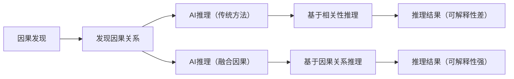

# 基于因果发现的AI推理能力提升方法

> 关键词：因果发现、AI推理能力、因果模型、机器学习、数据挖掘、因果关系、推理算法

> 摘要：本文聚焦于基于因果发现的AI推理能力提升方法。首先介绍了因果发现与AI推理的相关背景知识，包括目的、预期读者等内容。接着详细阐述了核心概念及联系，通过文本示意图和Mermaid流程图进行展示。深入分析了核心算法原理，并用Python代码进行详细说明。同时给出了相关的数学模型和公式，并举例解释。通过项目实战，展示了代码实现和解读过程。探讨了实际应用场景，推荐了学习资源、开发工具框架以及相关论文著作。最后总结了未来发展趋势与挑战，并提供常见问题解答和扩展阅读参考资料，旨在为提升AI推理能力提供全面且深入的技术指导。

## 1. 背景介绍 
### 1.1 目的和范围
在当今人工智能领域，AI的推理能力是衡量其智能水平的关键指标之一。传统的AI方法往往侧重于数据的相关性分析，然而相关性并不等同于因果性。因果发现旨在从数据中识别出变量之间的因果关系，将因果发现融入AI推理过程，可以使AI系统更深入地理解数据背后的逻辑，从而做出更准确、更具解释性的决策。

本文的范围涵盖了因果发现的基本概念、核心算法原理、数学模型，以及如何将因果发现应用于提升AI推理能力。通过理论分析和实际案例，详细介绍了基于因果发现的AI推理能力提升的方法和技术。

### 1.2 预期读者
本文主要面向人工智能领域的研究人员、工程师、开发者以及对因果发现和AI推理感兴趣的技术爱好者。对于正在从事AI相关项目开发，希望提升模型推理能力和解释性的专业人士，本文将提供有价值的技术参考。同时，对于对新兴技术有探索欲望的初学者，也可以作为了解因果发现和AI推理结合的入门资料。

### 1.3 文档结构概述
本文将按照以下结构展开：首先介绍因果发现和AI推理的核心概念及它们之间的联系，通过文本示意图和流程图直观展示。接着深入讲解核心算法原理，并使用Python代码进行详细实现。然后给出相关的数学模型和公式，并举例说明。通过项目实战部分，展示如何在实际项目中应用这些方法。探讨因果发现提升AI推理能力的实际应用场景。推荐学习资源、开发工具框架和相关论文著作。最后总结未来发展趋势与挑战，提供常见问题解答和扩展阅读参考资料。

### 1.4 术语表
#### 1.4.1 核心术语定义
- **因果发现（Causal Discovery）**：从观测数据或实验数据中识别变量之间因果关系的过程。因果关系表示一个变量的变化会直接导致另一个变量的变化。
- **AI推理（AI Reasoning）**：人工智能系统根据已有的知识和数据，通过一定的算法和规则进行逻辑推导，得出新的结论或做出决策的过程。
- **因果模型（Causal Model）**：用于描述变量之间因果关系的数学模型，常见的有因果图模型（如贝叶斯网络）。
- **相关性（Correlation）**：衡量两个变量之间线性关联程度的统计指标，但相关性并不意味着因果关系。

#### 1.4.2 相关概念解释
- **因果关系与相关性的区别**：相关性只是描述两个变量之间的共变关系，例如，冰淇淋销量和游泳溺亡人数可能呈现正相关，但这并不意味着冰淇淋销量的增加会导致游泳溺亡人数的增加，它们可能都受到天气炎热这一共同因素的影响。而因果关系则强调变量之间的因果效应，即一个变量的变化是另一个变量变化的原因。
- **因果发现的重要性**：在许多领域，如医疗、金融、交通等，仅仅知道变量之间的相关性是不够的，需要了解因果关系才能做出更准确的决策。例如，在医疗领域，了解药物与疾病治疗效果之间的因果关系对于开发有效的治疗方案至关重要。

#### 1.4.3 缩略词列表
- **DAG**：Directed Acyclic Graph，有向无环图，常用于表示因果关系。
- **ML**：Machine Learning，机器学习。
- **BN**：Bayesian Network，贝叶斯网络，一种常用的因果模型。

## 2. 核心概念与联系 
### 核心概念原理
#### 因果发现
因果发现的核心目标是从数据中推断出变量之间的因果结构。常见的因果发现方法可以分为基于约束的方法和基于得分的方法。

基于约束的方法通过检验变量之间的条件独立性来推断因果关系。例如，假设我们有三个变量 $X$、$Y$ 和 $Z$，如果在给定 $Z$ 的条件下，$X$ 和 $Y$ 是条件独立的，那么可以推断出 $Z$ 可能是 $X$ 和 $Y$ 之间的中介变量或者共同原因。

基于得分的方法则是通过定义一个得分函数来评估不同的因果结构，选择得分最高的结构作为最优的因果结构。得分函数通常考虑了数据的似然性和模型的复杂度。

#### AI推理
AI推理是指人工智能系统根据已有的知识和数据进行逻辑推导的过程。传统的AI推理方法主要基于规则和逻辑，例如专家系统。随着机器学习的发展，基于数据驱动的推理方法逐渐成为主流，如神经网络、决策树等。然而，这些方法往往缺乏对因果关系的理解，导致推理结果的可解释性较差。

#### 因果发现与AI推理的联系
将因果发现融入AI推理过程可以提升AI系统的推理能力和解释性。通过发现变量之间的因果关系，AI系统可以更好地理解数据背后的逻辑，从而做出更准确的推理。例如，在一个医疗诊断系统中，通过因果发现可以确定疾病的病因和症状之间的因果关系，从而更准确地诊断疾病。

### 架构的文本示意图
```plaintext
                因果发现
                    |
                    |  发现因果关系
                    |
           ------------------
          |                  |
    AI推理（传统方法）    AI推理（融合因果）
          |                  |
          |  基于相关性推理  |  基于因果关系推理
          |                  |
    推理结果（可解释性差）  推理结果（可解释性强）
```

### Mermaid流程图


## 3. 核心算法原理 & 具体操作步骤 
### 核心算法原理
#### 基于约束的因果发现算法（PC算法）
PC算法是一种经典的基于约束的因果发现算法，其核心思想是通过检验变量之间的条件独立性来逐步构建因果图。具体步骤如下：
1. **初始化**：构建一个完全无向图，图中的节点表示变量，边表示变量之间可能存在的因果关系。
2. **条件独立性检验**：对于图中的每一条边，检验两个节点之间在给定不同子集的条件下是否独立。如果独立，则删除这条边。
3. **方向确定**：根据删除边后的图结构，通过一些规则（如V结构规则）确定边的方向，最终得到一个有向无环图（DAG）。

#### Python代码实现
```python
import numpy as np
import pandas as pd
from causalgraphicalmodels import CausalGraphicalModel
from causalgraphicalmodels.test import conditional_independence_test

def pc_algorithm(data, alpha=0.05):
    # 初始化完全无向图
    nodes = data.columns
    graph = {node: set(nodes) - {node} for node in nodes}
    
    # 条件独立性检验
    max_k = len(nodes) - 2
    for k in range(max_k + 1):
        for node1 in nodes:
            for node2 in graph[node1]:
                subsets = [subset for subset in powerset(graph[node1] - {node2}) if len(subset) == k]
                for subset in subsets:
                    p_value = conditional_independence_test(data, node1, node2, subset)
                    if p_value > alpha:
                        graph[node1].remove(node2)
                        graph[node2].remove(node1)
                        break
    
    # 方向确定（简单示例，实际中更复杂）
    dag = {}
    for node in nodes:
        dag[node] = []
        for neighbor in graph[node]:
            dag[node].append(neighbor)
    
    return CausalGraphicalModel(nodes=nodes, edges=[(node, neighbor) for node in dag for neighbor in dag[node]])

def powerset(iterable):
    from itertools import chain, combinations
    s = list(iterable)
    return chain.from_iterable(combinations(s, r) for r in range(len(s)+1))

# 示例数据
data = pd.DataFrame({
    'X': np.random.randn(100),
    'Y': np.random.randn(100),
    'Z': np.random.randn(100)
})

# 运行PC算法
result = pc_algorithm(data)
print(result)
```

### 具体操作步骤
1. **数据准备**：收集和整理相关的数据，确保数据的质量和完整性。
2. **算法选择**：根据数据的特点和问题的需求，选择合适的因果发现算法，如PC算法、GES算法等。
3. **参数设置**：设置算法的相关参数，如显著性水平、最大条件集大小等。
4. **运行算法**：将数据输入到选择的算法中，运行算法得到因果图。
5. **结果分析**：对得到的因果图进行分析，理解变量之间的因果关系，并将其应用到AI推理过程中。

## 4. 数学模型和公式 & 详细讲解 & 举例说明 
### 条件独立性检验
在因果发现中，条件独立性检验是一个重要的步骤。常用的条件独立性检验方法有卡方检验、Fisher's Z检验等。

#### Fisher's Z检验
Fisher's Z检验用于检验两个变量 $X$ 和 $Y$ 在给定变量集 $Z$ 的条件下是否独立。假设 $X$、$Y$ 和 $Z$ 是连续变量，检验统计量 $Z_{xy|z}$ 定义为：

$$Z_{xy|z}=\frac{1}{2}\ln\left(\frac{1 + r_{xy|z}}{1 - r_{xy|z}}\right)\sqrt{n - |Z| - 3}$$

其中，$r_{xy|z}$ 是 $X$ 和 $Y$ 在给定 $Z$ 的条件下的偏相关系数，$n$ 是样本数量，$|Z|$ 是变量集 $Z$ 的大小。

在原假设 $H_0$：$X$ 和 $Y$ 在给定 $Z$ 的条件下独立的情况下，$Z_{xy|z}$ 近似服从标准正态分布 $N(0, 1)$。我们可以根据 $Z_{xy|z}$ 的值计算 $p$ 值，如果 $p$ 值大于预先设定的显著性水平 $\alpha$，则接受原假设，即认为 $X$ 和 $Y$ 在给定 $Z$ 的条件下独立。

### 举例说明
假设我们有三个变量 $X$、$Y$ 和 $Z$，样本数量 $n = 100$。通过计算得到 $r_{xy|z} = 0.1$，则 $Z_{xy|z}$ 的值为：

$$Z_{xy|z}=\frac{1}{2}\ln\left(\frac{1 + 0.1}{1 - 0.1}\right)\sqrt{100 - 1 - 3}\approx 1.05$$

假设显著性水平 $\alpha = 0.05$，查标准正态分布表可知，双侧检验的临界值为 $\pm 1.96$。由于 $|Z_{xy|z}| = 1.05 < 1.96$，$p$ 值大于 $0.05$，所以我们接受原假设，认为 $X$ 和 $Y$ 在给定 $Z$ 的条件下独立。

### 得分函数
基于得分的因果发现算法通常使用得分函数来评估不同的因果结构。常见的得分函数有贝叶斯信息准则（BIC）、最小描述长度（MDL）等。

#### 贝叶斯信息准则（BIC）
BIC得分函数定义为：

$$BIC(G|D)=L(G|D)-\frac{\ln(n)}{2}d(G)$$

其中，$G$ 表示因果图，$D$ 表示数据，$L(G|D)$ 是数据 $D$ 在因果图 $G$ 下的对数似然函数，$n$ 是样本数量，$d(G)$ 是因果图 $G$ 的参数数量。

BIC得分函数在考虑数据拟合程度的同时，也考虑了模型的复杂度。得分越高，说明因果图 $G$ 越能较好地解释数据，同时复杂度也较低。

### 举例说明
假设我们有两个不同的因果图 $G_1$ 和 $G_2$，对于给定的数据 $D$，计算得到 $L(G_1|D)=-100$，$d(G_1)=10$，$L(G_2|D)=-95$，$d(G_2)=15$，样本数量 $n = 100$。

则 $BIC(G_1|D)=-100-\frac{\ln(100)}{2}\times 10\approx -100 - 11.51\times 5=-157.55$

$BIC(G_2|D)=-95-\frac{\ln(100)}{2}\times 15\approx -95 - 11.51\times 7.5=-181.325$

由于 $BIC(G_1|D) > BIC(G_2|D)$，所以因果图 $G_1$ 更优。

## 5. 项目实战：代码实际案例和详细解释说明 
### 5.1  开发环境搭建
#### 安装Python
首先，确保你已经安装了Python，建议使用Python 3.6及以上版本。可以从Python官方网站（https://www.python.org/downloads/）下载并安装。

#### 安装必要的库
使用以下命令安装必要的Python库：
```sh
pip install numpy pandas causalgraphicalmodels
```

### 5.2  源代码详细实现和代码解读
```python
import numpy as np
import pandas as pd
from causalgraphicalmodels import CausalGraphicalModel
from causalgraphicalmodels.test import conditional_independence_test

def pc_algorithm(data, alpha=0.05):
    # 初始化完全无向图
    nodes = data.columns
    graph = {node: set(nodes) - {node} for node in nodes}
    
    # 条件独立性检验
    max_k = len(nodes) - 2
    for k in range(max_k + 1):
        for node1 in nodes:
            for node2 in graph[node1]:
                subsets = [subset for subset in powerset(graph[node1] - {node2}) if len(subset) == k]
                for subset in subsets:
                    p_value = conditional_independence_test(data, node1, node2, subset)
                    if p_value > alpha:
                        graph[node1].remove(node2)
                        graph[node2].remove(node1)
                        break
    
    # 方向确定（简单示例，实际中更复杂）
    dag = {}
    for node in nodes:
        dag[node] = []
        for neighbor in graph[node]:
            dag[node].append(neighbor)
    
    return CausalGraphicalModel(nodes=nodes, edges=[(node, neighbor) for node in dag for neighbor in dag[node]])

def powerset(iterable):
    from itertools import chain, combinations
    s = list(iterable)
    return chain.from_iterable(combinations(s, r) for r in range(len(s)+1))

# 示例数据
data = pd.DataFrame({
    'X': np.random.randn(100),
    'Y': np.random.randn(100),
    'Z': np.random.randn(100)
})

# 运行PC算法
result = pc_algorithm(data)
print(result)
```

### 代码解读与分析
#### 初始化部分
```python
nodes = data.columns
graph = {node: set(nodes) - {node} for node in nodes}
```
这部分代码获取数据的列名作为节点，构建一个完全无向图，每个节点与其他所有节点都有边相连。

#### 条件独立性检验部分
```python
max_k = len(nodes) - 2
for k in range(max_k + 1):
    for node1 in nodes:
        for node2 in graph[node1]:
            subsets = [subset for subset in powerset(graph[node1] - {node2}) if len(subset) == k]
            for subset in subsets:
                p_value = conditional_independence_test(data, node1, node2, subset)
                if p_value > alpha:
                    graph[node1].remove(node2)
                    graph[node2].remove(node1)
                    break
```
这部分代码通过循环遍历不同大小的条件集，对每一对节点进行条件独立性检验。如果在某个条件集下两个节点独立，则删除它们之间的边。

#### 方向确定部分
```python
dag = {}
for node in nodes:
    dag[node] = []
    for neighbor in graph[node]:
        dag[node].append(neighbor)
```
这部分代码将无向图转换为有向图，这里只是简单示例，实际中方向确定需要更复杂的规则。

#### 主程序部分
```python
data = pd.DataFrame({
    'X': np.random.randn(100),
    'Y': np.random.randn(100),
    'Z': np.random.randn(100)
})

result = pc_algorithm(data)
print(result)
```
这部分代码生成示例数据，调用PC算法进行因果发现，并打印结果。

## 6. 实际应用场景 
### 医疗领域
在医疗领域，因果发现可以帮助医生更好地理解疾病的病因和治疗效果之间的因果关系。例如，通过分析大量的临床数据，发现某种药物与疾病治愈率之间的因果关系，从而为制定更有效的治疗方案提供依据。同时，将因果发现融入AI诊断系统，可以提高诊断的准确性和可解释性，医生可以根据系统给出的因果推理过程更好地理解诊断结果。

### 金融领域
在金融领域，因果发现可以用于风险评估和投资决策。例如，分析宏观经济指标、公司财务数据和股票价格之间的因果关系，帮助投资者更好地预测股票价格的走势，降低投资风险。同时，银行可以利用因果发现技术分析客户的信用数据，找出影响客户信用风险的因果因素，从而更准确地评估客户的信用等级。

### 交通领域
在交通领域，因果发现可以用于交通流量预测和交通管理。例如，分析天气、时间、事件等因素与交通流量之间的因果关系，提前预测交通拥堵情况，为交通管理部门制定合理的交通疏导策略提供支持。同时，自动驾驶汽车可以利用因果发现技术理解周围环境和其他车辆的行为，做出更安全、更合理的驾驶决策。

## 7. 工具和资源推荐
### 7.1 学习资源推荐
#### 7.1.1 书籍推荐
- 《Causality: Models, Reasoning, and Inference》（Judea Pearl著）：这是因果推理领域的经典著作，详细介绍了因果模型的理论和方法。
- 《Elements of Causal Inference: Foundations and Learning Algorithms》（Jonas Peters、Dominik Janzing和Bernhard Schölkopf著）：全面介绍了因果推理的基础知识和学习算法。

#### 7.1.2 在线课程
- Coursera上的“Causal Diagrams: Draw Your Assumptions Before Your Conclusions”：由Judea Pearl教授授课，深入讲解了因果图模型的应用。
- edX上的“Probabilistic Graphical Models”：介绍了概率图模型，包括贝叶斯网络等因果模型。

#### 7.1.3 技术博客和网站
- Towards Data Science：上面有很多关于因果发现和AI推理的技术文章和案例分析。
- Causal AI Research：专注于因果人工智能的研究和应用，提供最新的研究成果和技术动态。

### 7.2 开发工具框架推荐
#### 7.2.1 IDE和编辑器
- PyCharm：功能强大的Python集成开发环境，提供代码编辑、调试、版本控制等功能。
- Jupyter Notebook：交互式的开发环境，适合进行数据分析和模型实验。

#### 7.2.2 调试和性能分析工具
- Py-Spy：用于分析Python代码的性能瓶颈。
- PDB：Python自带的调试工具，可用于调试Python代码。

#### 7.2.3 相关框架和库
- DoWhy：一个用于因果推理的Python库，提供了多种因果发现和因果效应估计的方法。
- Causalnex：用于构建和分析因果图模型的Python库。

### 7.3 相关论文著作推荐
#### 7.3.1 经典论文
- “Causal Inference in Statistics: A Primer”（Judea Pearl、Madelyn Glymour和Nicholas P. Jewell著）：介绍了统计因果推理的基本概念和方法。
- “Learning Bayesian Networks: The Combination of Knowledge and Statistical Data”（David Heckerman、Dan Geiger和David M. Chickering著）：探讨了如何结合先验知识和统计数据学习贝叶斯网络。

#### 7.3.2 最新研究成果
- 关注顶级学术会议，如NeurIPS、ICML、KDD等，这些会议上会发表很多关于因果发现和AI推理的最新研究成果。
- 查阅相关的学术期刊，如Journal of Machine Learning Research、Artificial Intelligence等。

#### 7.3.3 应用案例分析
- 可以在ACM Digital Library、IEEE Xplore等数据库中搜索关于因果发现和AI推理在不同领域应用的案例分析论文，了解实际应用中的技术挑战和解决方案。

## 8. 总结：未来发展趋势与挑战
### 未来发展趋势
#### 与深度学习的融合
将因果发现与深度学习相结合是未来的一个重要发展趋势。深度学习模型在处理复杂数据方面具有强大的能力，但缺乏可解释性。通过引入因果发现技术，可以为深度学习模型提供因果解释，提高模型的可靠性和可解释性。

#### 多源数据融合
随着数据的多样化和丰富化，未来的因果发现方法将更加注重多源数据的融合。例如，结合文本数据、图像数据和传感器数据等，更全面地发现变量之间的因果关系。

#### 实时因果发现
在一些实时性要求较高的应用场景中，如自动驾驶、智能医疗等，需要实时进行因果发现和推理。未来的研究将致力于开发高效的实时因果发现算法。

### 挑战
#### 数据质量和数量
因果发现需要大量高质量的数据，但在实际应用中，数据往往存在噪声、缺失值等问题，影响因果发现的准确性。同时，获取足够数量的数据也面临一定的困难。

#### 计算复杂度
一些因果发现算法的计算复杂度较高，尤其是在处理大规模数据和复杂因果结构时，计算效率较低。需要开发更高效的算法来解决这个问题。

#### 因果关系的可识别性
在某些情况下，由于数据的局限性和模型的假设，因果关系可能无法被准确识别。如何提高因果关系的可识别性是一个亟待解决的问题。

## 9. 附录：常见问题与解答
### 因果发现和相关性分析有什么区别？
因果发现旨在找出变量之间的因果关系，即一个变量的变化会直接导致另一个变量的变化。而相关性分析只是衡量两个变量之间的共变关系，相关性并不意味着因果关系。例如，冰淇淋销量和游泳溺亡人数可能呈现正相关，但它们之间并没有因果关系，可能都受到天气炎热这一共同因素的影响。

### 因果发现算法的选择依据是什么？
选择因果发现算法需要考虑多个因素，如数据的类型（连续数据、离散数据）、数据的规模、是否有先验知识等。基于约束的算法（如PC算法）适用于数据量较小、需要快速得到结果的情况；基于得分的算法（如GES算法）适用于数据量较大、需要更精确结果的情况。

### 如何评估因果发现的结果？
可以使用多种方法评估因果发现的结果，如与先验知识进行比较、使用交叉验证等。还可以通过因果效应估计来评估因果关系的强度和可靠性。例如，使用随机对照试验或倾向得分匹配等方法来估计因果效应。

### 因果发现对数据有什么要求？
因果发现需要数据具有一定的代表性和独立性。数据应该能够反映变量之间的真实关系，并且尽量减少噪声和缺失值的影响。同时，数据的样本数量应该足够大，以保证因果发现的准确性。

## 10. 扩展阅读 & 参考资料
### 扩展阅读
- 《Why: The New Science of Cause and Effect》（Judea Pearl和Dana Mackenzie著）：以通俗易懂的方式介绍了因果推理的基本概念和应用。
- 《Machine Learning: A Probabilistic Perspective》（Kevin P. Murphy著）：涵盖了机器学习的多个方面，包括概率图模型和因果推理。

### 参考资料
- Pearl, J. (2009). Causality: Models, Reasoning, and Inference. Cambridge University Press.
- Peters, J., Janzing, D., & Schölkopf, B. (2017). Elements of Causal Inference: Foundations and Learning Algorithms. MIT Press.

作者：AI天才研究院/AI Genius Institute & 禅与计算机程序设计艺术 /Zen And The Art of Computer Programming