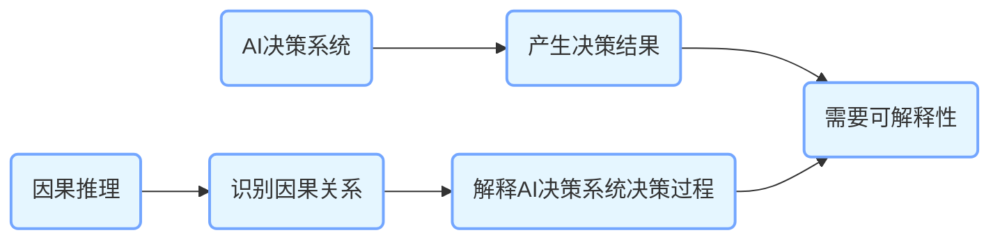
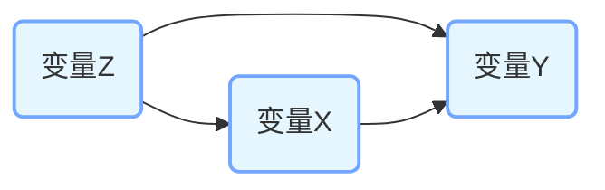

# 基于因果推理的AI决策系统可解释性研究

> 关键词：因果推理、AI决策系统、可解释性、因果模型、机器学习

> 摘要：本文聚焦于基于因果推理的AI决策系统可解释性研究。随着AI技术在众多领域的广泛应用，其决策的可解释性变得愈发重要。因果推理为解决AI决策的可解释性问题提供了一种有效的途径。文章首先介绍了研究的背景，包括目的、预期读者等内容；接着阐述了因果推理与AI决策系统可解释性的核心概念及联系；详细讲解了相关核心算法原理和具体操作步骤，并给出Python代码示例；深入分析了数学模型和公式；通过项目实战展示了代码实现和解读；探讨了实际应用场景；推荐了学习资源、开发工具框架和相关论文著作；最后总结了未来发展趋势与挑战，并给出常见问题解答和扩展阅读参考资料，旨在为相关研究和实践提供全面而深入的指导。

## 1. 背景介绍 
### 1.1 目的和范围
随着人工智能技术的飞速发展，AI决策系统在医疗、金融、交通等众多关键领域得到了广泛应用。然而，这些系统往往表现得像“黑匣子”，其决策过程难以被人类理解。这不仅限制了人们对系统的信任，也可能导致严重的后果，如医疗误诊、金融风险等。本研究的目的在于探索如何利用因果推理来提高AI决策系统的可解释性，使人们能够理解系统做出决策的原因和依据。

研究范围涵盖了因果推理的基本理论、与AI决策系统的结合方式、相关算法的实现、数学模型的构建以及实际应用场景的分析。通过对这些方面的研究，旨在为开发具有高可解释性的AI决策系统提供理论支持和实践指导。

### 1.2 预期读者
本文的预期读者包括人工智能领域的研究人员、开发者、数据科学家、对AI可解释性感兴趣的学者以及相关行业的从业者。对于研究人员，本文可以为他们的学术研究提供新的思路和方向；对于开发者和数据科学家，有助于他们在实际项目中实现更具可解释性的AI决策系统；对于学者和从业者，能够帮助他们了解该领域的最新发展动态和应用前景。

### 1.3 文档结构概述
本文将按照以下结构进行组织：
- 核心概念与联系：介绍因果推理和AI决策系统可解释性的核心概念，以及它们之间的联系，并通过文本示意图和Mermaid流程图进行直观展示。
- 核心算法原理 & 具体操作步骤：详细讲解基于因果推理的AI决策系统可解释性相关的核心算法原理，并给出Python代码示例，说明具体的操作步骤。
- 数学模型和公式 & 详细讲解 & 举例说明：阐述相关的数学模型和公式，进行详细的讲解，并通过具体的例子进行说明。
- 项目实战：代码实际案例和详细解释说明：通过一个实际的项目案例，展示如何在开发环境中搭建基于因果推理的AI决策系统，并对源代码进行详细的实现和解读。
- 实际应用场景：探讨基于因果推理的AI决策系统可解释性在不同领域的实际应用场景。
- 工具和资源推荐：推荐学习资源、开发工具框架和相关论文著作，帮助读者进一步深入学习和研究。
- 总结：未来发展趋势与挑战：总结基于因果推理的AI决策系统可解释性的未来发展趋势，并分析面临的挑战。
- 附录：常见问题与解答：解答读者在学习和实践过程中可能遇到的常见问题。
- 扩展阅读 & 参考资料：提供相关的扩展阅读材料和参考资料，方便读者进一步探索该领域。

### 1.4 术语表
#### 1.4.1 核心术语定义
- **因果推理**：是一种从数据中发现因果关系的方法，旨在确定变量之间的因果效应，即一个变量的变化如何导致另一个变量的变化。
- **AI决策系统**：是利用人工智能技术构建的系统，能够根据输入的数据和预设的规则或模型做出决策。
- **可解释性**：指的是系统的决策过程和结果能够被人类理解和解释的程度。在AI决策系统中，可解释性意味着能够清晰地说明系统为什么做出某个决策。
- **因果模型**：是对变量之间因果关系的一种数学表示，通常用图模型（如因果图）或结构方程模型来描述。

#### 1.4.2 相关概念解释
- **相关性与因果性**：相关性是指两个变量之间的统计关联，而因果性则表示一个变量的变化直接导致另一个变量的变化。具有相关性的变量不一定具有因果关系，因果推理的目的就是区分这两种关系。
- **反事实推理**：是因果推理中的一种重要方法，它考虑在不同的条件下（即与事实相反的情况）会发生什么，从而评估因果效应。

#### 1.4.3 缩略词列表
- **AI**：Artificial Intelligence，人工智能
- **ML**：Machine Learning，机器学习
- **SEM**：Structural Equation Model，结构方程模型
- **DAG**：Directed Acyclic Graph，有向无环图

## 2. 核心概念与联系 

### 因果推理的核心原理
因果推理的核心目标是从数据中识别出变量之间的因果关系。在实际应用中，我们通常无法直接观察到因果效应，因为我们只能观察到在特定条件下发生的事实。因果推理通过一些假设和方法来克服这个困难，例如随机对照试验、工具变量法、倾向得分匹配等。

一种常见的因果推理方法是基于因果图模型。因果图是一种有向无环图（DAG），其中节点表示变量，边表示变量之间的因果关系。通过分析因果图的结构，可以确定变量之间的因果效应。

### AI决策系统可解释性的重要性
AI决策系统在许多领域的应用越来越广泛，但由于其决策过程往往难以理解，导致人们对其信任度较低。例如，在医疗领域，医生可能不愿意使用一个无法解释其诊断结果的AI系统；在金融领域，监管机构也要求金融机构能够解释其使用的AI模型的决策过程。因此，提高AI决策系统的可解释性对于其广泛应用和社会接受度至关重要。

### 因果推理与AI决策系统可解释性的联系
因果推理为提高AI决策系统的可解释性提供了一种有效的方法。通过因果推理，我们可以识别出影响决策的关键因素和因果关系，从而解释系统为什么做出某个决策。例如，在一个基于机器学习的信用评分系统中，因果推理可以帮助我们确定哪些因素（如收入、信用历史等）对信用评分有因果影响，以及这种影响的程度。

### 文本示意图
```plaintext
因果推理  ---->  识别因果关系  ---->  解释AI决策系统决策过程
AI决策系统  ---->  产生决策结果  ---->  需要可解释性
```

### Mermaid流程图


## 3. 核心算法原理 & 具体操作步骤 

### 因果推理中的因果发现算法 - PC算法
PC算法是一种经典的因果发现算法，用于从观测数据中学习因果图的结构。其基本思想是通过检验变量之间的条件独立性来逐步确定因果图的边。

#### 算法原理
PC算法的核心步骤如下：
1. 初始化一个完全无向图，其中每个节点代表一个变量。
2. 对于不同的阶数 $k$（从0开始），检验所有变量对在给定 $k$ 个其他变量的条件下是否独立。如果独立，则删除这两个变量之间的边。
3. 根据边的删除情况，确定边的方向。

#### Python代码实现
```python
import numpy as np
from causalgraphicalmodels import CausalGraphicalModel
from causalgraphicalmodels.testing import independence_test

def pc_algorithm(data, alpha=0.05):
    num_vars = data.shape[1]
    # 初始化完全无向图
    graph = np.ones((num_vars, num_vars)) - np.eye(num_vars)

    k = 0
    while True:
        removed_edges = []
        for i in range(num_vars):
            for j in range(i + 1, num_vars):
                if graph[i, j] == 1:
                    # 生成所有可能的条件集
                    other_vars = [v for v in range(num_vars) if v!= i and v!= j]
                    all_cond_sets = [comb for comb in itertools.combinations(other_vars, k)]
                    for cond_set in all_cond_sets:
                        # 进行条件独立性检验
                        p_value = independence_test(data[:, [i, j]], data[:, list(cond_set)])
                        if p_value > alpha:
                            graph[i, j] = 0
                            graph[j, i] = 0
                            removed_edges.append((i, j))
                            break
        if len(removed_edges) == 0:
            break
        k += 1

    # 确定边的方向（简化处理，这里不详细展开）
    #...

    return graph

# 示例数据
data = np.random.randn(100, 5)
graph = pc_algorithm(data)
print(graph)
```

#### 具体操作步骤
1. 准备观测数据，数据应包含多个变量的样本值。
2. 调用 `pc_algorithm` 函数，传入数据和显著性水平 `alpha`。
3. 函数返回一个邻接矩阵，表示学习到的因果图的结构。

### 基于因果图的因果效应估计 - 后门调整法
后门调整法是一种用于估计因果效应的方法，它通过控制一组满足后门准则的变量来消除混杂因素的影响。

#### 算法原理
后门准则是指一组变量 $Z$ 满足以下两个条件：
1. $Z$ 阻断了所有从原因变量 $X$ 到结果变量 $Y$ 的后门路径（即包含指向 $X$ 的边的路径）。
2. $Z$ 不包含 $X$ 的后代节点。

在满足后门准则的情况下，可以通过以下公式估计因果效应：
$$E[Y|do(X = x)] = \sum_{z} E[Y|X = x, Z = z]P(Z = z)$$

#### Python代码实现
```python
import numpy as np

def backdoor_adjustment(data, x, y, z):
    unique_z = np.unique(data[:, z])
    causal_effect = 0
    for z_val in unique_z:
        z_subset = data[data[:, z] == z_val]
        p_z = len(z_subset) / len(data)
        e_y_given_x_z = np.mean(z_subset[z_subset[:, x] == 1, y]) - np.mean(z_subset[z_subset[:, x] == 0, y])
        causal_effect += e_y_given_x_z * p_z
    return causal_effect

# 示例数据
data = np.random.randint(0, 2, size=(100, 3))
x = 0
y = 1
z = 2
causal_effect = backdoor_adjustment(data, x, y, z)
print(causal_effect)
```

#### 具体操作步骤
1. 准备包含原因变量 $X$、结果变量 $Y$ 和满足后门准则的变量 $Z$ 的数据。
2. 调用 `backdoor_adjustment` 函数，传入数据、变量的索引。
3. 函数返回估计的因果效应。

## 4. 数学模型和公式 & 详细讲解 & 举例说明 

### 因果图模型
因果图模型是一种用图来表示变量之间因果关系的数学模型。在因果图中，节点表示变量，有向边表示因果关系。例如，假设有三个变量 $X$、$Y$ 和 $Z$，其中 $X$ 是 $Y$ 的原因，$Z$ 是 $X$ 和 $Y$ 的共同原因，那么因果图可以表示为：



### 结构方程模型（SEM）
结构方程模型是一种更一般的因果模型，它用一组方程来描述变量之间的因果关系。例如，对于上述因果图，可以用以下结构方程模型表示：
$$X = f_X(Z, \epsilon_X)$$
$$Y = f_Y(X, Z, \epsilon_Y)$$
其中，$f_X$ 和 $f_Y$ 是函数，$\epsilon_X$ 和 $\epsilon_Y$ 是误差项。

### 因果效应的数学定义
因果效应通常用潜在结果框架来定义。假设有一个原因变量 $X$ 和一个结果变量 $Y$，对于每个个体 $i$，存在两个潜在结果 $Y_i(1)$ 和 $Y_i(0)$，分别表示当 $X = 1$ 和 $X = 0$ 时的结果。因果效应可以定义为：
$$\tau_i = Y_i(1) - Y_i(0)$$
在实际应用中，我们通常关注平均因果效应（ACE）：
$$ACE = E[Y(1) - Y(0)]$$

### 后门调整公式的详细讲解
后门调整公式 $E[Y|do(X = x)] = \sum_{z} E[Y|X = x, Z = z]P(Z = z)$ 用于估计干预 $X = x$ 对 $Y$ 的因果效应。其中，$E[Y|X = x, Z = z]$ 表示在给定 $X = x$ 和 $Z = z$ 的条件下 $Y$ 的期望，$P(Z = z)$ 表示 $Z$ 取值为 $z$ 的概率。

#### 举例说明
假设有一个关于吸烟（$X$）、肺癌（$Y$）和空气污染（$Z$）的研究。我们想估计吸烟对肺癌的因果效应。通过收集数据，我们发现：
- 当空气污染程度 $Z = 0$ 时，吸烟人群患肺癌的概率为 $0.2$，不吸烟人群患肺癌的概率为 $0.1$，且 $P(Z = 0) = 0.6$。
- 当空气污染程度 $Z = 1$ 时，吸烟人群患肺癌的概率为 $0.3$，不吸烟人群患肺癌的概率为 $0.2$，且 $P(Z = 1) = 0.4$。

根据后门调整公式，吸烟对肺癌的因果效应为：
$$
\begin{align*}
E[Y|do(X = 1)] - E[Y|do(X = 0)] &= \sum_{z} (E[Y|X = 1, Z = z] - E[Y|X = 0, Z = z])P(Z = z)\\
&= (0.2 - 0.1) \times 0.6 + (0.3 - 0.2) \times 0.4\\
&= 0.1 \times 0.6 + 0.1 \times 0.4\\
&= 0.1
\end{align*}
$$

这意味着吸烟会使患肺癌的概率增加 $0.1$。

## 5. 项目实战：代码实际案例和详细解释说明 

### 5.1  开发环境搭建
#### 安装Python
首先，确保你已经安装了Python。建议使用Python 3.7及以上版本。你可以从Python官方网站（https://www.python.org/downloads/）下载并安装Python。

#### 安装必要的库
我们需要安装一些用于数据处理、因果推理和机器学习的库，如 `numpy`、`pandas`、`causalgraphicalmodels`、`scikit-learn` 等。可以使用以下命令进行安装：
```sh
pip install numpy pandas causalgraphicalmodels scikit-learn
```

### 5.2  源代码详细实现和代码解读
#### 项目背景
假设我们有一个电商平台的用户数据，包含用户的年龄（`age`）、性别（`gender`）、是否购买过商品（`purchase`）和广告曝光次数（`ad_exposure`）。我们想了解广告曝光对用户购买行为的因果效应，并构建一个可解释的AI决策系统来优化广告投放。

#### 代码实现
```python
import numpy as np
import pandas as pd
from causalgraphicalmodels import CausalGraphicalModel
from causalgraphicalmodels.testing import independence_test
from sklearn.linear_model import LogisticRegression

# 生成示例数据
np.random.seed(42)
n_samples = 1000
age = np.random.randint(18, 60, size=n_samples)
gender = np.random.randint(0, 2, size=n_samples)
ad_exposure = np.random.poisson(lam=2, size=n_samples)
purchase_prob = 0.1 + 0.01 * age + 0.05 * ad_exposure
purchase = np.random.binomial(1, purchase_prob)

data = pd.DataFrame({
    'age': age,
    'gender': gender,
    'ad_exposure': ad_exposure,
    'purchase': purchase
})

# 使用PC算法学习因果图
def pc_algorithm(data, alpha=0.05):
    num_vars = data.shape[1]
    graph = np.ones((num_vars, num_vars)) - np.eye(num_vars)

    k = 0
    while True:
        removed_edges = []
        for i in range(num_vars):
            for j in range(i + 1, num_vars):
                if graph[i, j] == 1:
                    other_vars = [v for v in range(num_vars) if v!= i and v!= j]
                    all_cond_sets = [comb for comb in itertools.combinations(other_vars, k)]
                    for cond_set in all_cond_sets:
                        p_value = independence_test(data.iloc[:, [i, j]], data.iloc[:, list(cond_set)])
                        if p_value > alpha:
                            graph[i, j] = 0
                            graph[j, i] = 0
                            removed_edges.append((i, j))
                            break
        if len(removed_edges) == 0:
            break
        k += 1

    return graph

import itertools
graph = pc_algorithm(data)

# 确定因果效应（使用后门调整法）
x = data.columns.get_loc('ad_exposure')
y = data.columns.get_loc('purchase')
z = [data.columns.get_loc('age'), data.columns.get_loc('gender')]

def backdoor_adjustment(data, x, y, z):
    unique_z = data.iloc[:, z].drop_duplicates().values
    causal_effect = 0
    for z_val in unique_z:
        z_subset = data[(data.iloc[:, z] == z_val).all(axis=1)]
        p_z = len(z_subset) / len(data)
        e_y_given_x_z_1 = np.mean(z_subset[z_subset.iloc[:, x] == 1, y])
        e_y_given_x_z_0 = np.mean(z_subset[z_subset.iloc[:, x] == 0, y])
        causal_effect += (e_y_given_x_z_1 - e_y_given_x_z_0) * p_z
    return causal_effect

causal_effect = backdoor_adjustment(data, x, y, z)
print(f"广告曝光对购买行为的因果效应: {causal_effect}")

# 构建可解释的AI决策系统（逻辑回归模型）
X = data[['age', 'gender', 'ad_exposure']]
y = data['purchase']
model = LogisticRegression()
model.fit(X, y)

# 解释模型决策
feature_names = X.columns
coef = model.coef_[0]
for i in range(len(feature_names)):
    print(f"{feature_names[i]} 的系数: {coef[i]}")
```

#### 代码解读
1. **数据生成**：使用 `numpy` 生成示例数据，包括用户的年龄、性别、广告曝光次数和购买行为。
2. **因果图学习**：使用 `pc_algorithm` 函数学习变量之间的因果图结构。
3. **因果效应估计**：使用 `backdoor_adjustment` 函数估计广告曝光对购买行为的因果效应。
4. **AI决策系统构建**：使用 `LogisticRegression` 构建一个逻辑回归模型，用于预测用户的购买行为。
5. **模型解释**：输出模型中每个特征的系数，以解释模型的决策过程。

### 5.3  代码解读与分析
#### 因果图学习
PC算法通过检验变量之间的条件独立性来逐步确定因果图的边。在代码中，我们通过不断增加条件集的大小，检验变量对在不同条件下的独立性，并删除独立的变量对之间的边。

#### 因果效应估计
后门调整法通过控制一组满足后门准则的变量（年龄和性别）来消除混杂因素的影响，从而估计广告曝光对购买行为的因果效应。

#### AI决策系统构建与解释
逻辑回归模型是一种简单而可解释的机器学习模型。通过输出模型的系数，我们可以了解每个特征对购买行为的影响方向和程度。例如，广告曝光次数的系数为正，表示广告曝光次数越多，用户购买的可能性越大。

## 6. 实际应用场景 
### 医疗领域
在医疗领域，基于因果推理的AI决策系统可解释性具有重要的应用价值。例如，在疾病诊断方面，医生可以使用因果推理来确定哪些因素（如症状、病史、基因等）对疾病的发生有因果影响，从而提高诊断的准确性和可解释性。在治疗方案选择方面，因果推理可以帮助医生评估不同治疗方法对患者预后的因果效应，为患者提供更个性化的治疗方案。

### 金融领域
在金融领域，可解释的AI决策系统可以帮助银行和金融机构更好地管理风险。例如，在信用评分方面，通过因果推理可以确定哪些因素（如收入、信用历史、负债等）对信用风险有因果影响，从而提高信用评分模型的可解释性和可靠性。在投资决策方面，因果推理可以帮助投资者分析不同因素（如市场趋势、公司财务状况等）对投资回报的因果效应，做出更明智的投资决策。

### 交通领域
在交通领域，基于因果推理的AI决策系统可以用于交通流量预测和交通管理。例如，通过分析交通流量、天气、时间等因素之间的因果关系，可以建立更准确的交通流量预测模型，为交通管理部门提供决策支持。在自动驾驶领域，因果推理可以帮助自动驾驶系统理解不同因素（如路况、其他车辆行为等）对行驶决策的因果影响，提高自动驾驶的安全性和可靠性。

### 教育领域
在教育领域，可解释的AI决策系统可以用于学生学习情况评估和教学方案优化。例如，通过分析学生的学习行为、成绩、家庭背景等因素之间的因果关系，可以了解哪些因素对学生的学习成绩有因果影响，从而为学生提供个性化的学习建议。在教学方案设计方面，因果推理可以帮助教师评估不同教学方法对学生学习效果的因果效应，选择更有效的教学方案。

## 7. 工具和资源推荐
### 7.1 学习资源推荐
#### 7.1.1 书籍推荐
- 《因果推断：基础与学习算法》：这本书系统地介绍了因果推断的基本理论和算法，包括潜在结果框架、因果图模型、结构方程模型等，是学习因果推理的经典教材。
- 《为什么：关于因果关系的新科学》：作者朱迪亚·珀尔是因果推理领域的重要人物，这本书以通俗易懂的语言介绍了因果关系的基本概念和方法，以及因果推理在各个领域的应用。

#### 7.1.2 在线课程
- Coursera上的“因果推理”课程：该课程由知名学者授课，涵盖了因果推理的基本理论、算法和应用，通过视频讲解、案例分析和作业练习等方式，帮助学习者深入理解因果推理。
- edX上的“数据科学中的因果推断”课程：该课程结合了数据科学和因果推断的知识，介绍了如何使用Python进行因果分析，适合有一定数据科学基础的学习者。

#### 7.1.3 技术博客和网站
- Causal Inference for the Brave and True：这是一个专门介绍因果推理的博客，提供了丰富的教程、案例和最新研究成果，对初学者和专业人士都有很大的帮助。
- Towards Data Science：该网站上有许多关于因果推理和AI可解释性的文章，涵盖了不同的技术和应用场景。

### 7.2 开发工具框架推荐
#### 7.2.1 IDE和编辑器
- PyCharm：是一款功能强大的Python集成开发环境，提供了代码编辑、调试、版本控制等功能，适合开发基于Python的因果推理和AI决策系统。
- Jupyter Notebook：是一个交互式的开发环境，支持代码、文本、图表等多种形式的展示，非常适合进行数据分析和模型开发。

#### 7.2.2 调试和性能分析工具
- Py-Spy：是一个用于Python程序的性能分析工具，可以帮助开发者找出程序中的性能瓶颈。
- PDB：是Python自带的调试器，可以帮助开发者调试代码，定位问题。

#### 7.2.3 相关框架和库
- DoWhy：是一个用于因果分析的Python库，提供了多种因果推断方法和工具，包括因果图学习、因果效应估计等。
- CausalML：是一个用于因果机器学习的Python库，结合了机器学习和因果推断的方法，可用于构建可解释的AI决策系统。

### 7.3 相关论文著作推荐
#### 7.3.1 经典论文
- “Causal Diagrams for Empirical Research”：朱迪亚·珀尔的这篇论文介绍了因果图模型的基本概念和方法，是因果推理领域的经典之作。
- “The Central Role of the Propensity Score in Observational Studies for Causal Effects”：这篇论文提出了倾向得分匹配的方法，用于处理观测数据中的混杂因素，在因果推断领域具有重要的影响力。

#### 7.3.2 最新研究成果
- 关注顶级学术会议（如NeurIPS、ICML、KDD等）上关于因果推理和AI可解释性的研究论文，了解该领域的最新发展动态。
- 一些知名学术期刊（如Journal of Machine Learning Research、Artificial Intelligence等）也会发表相关的研究成果。

#### 7.3.3 应用案例分析
- 许多公司和研究机构会发布基于因果推理的AI决策系统的应用案例，如谷歌、微软等公司的技术博客，以及一些研究机构的报告。这些案例可以帮助我们了解因果推理在实际应用中的具体方法和效果。

## 8. 总结：未来发展趋势与挑战
### 未来发展趋势
#### 与深度学习的融合
未来，因果推理有望与深度学习技术更紧密地融合。深度学习模型在处理复杂数据和模式识别方面具有强大的能力，但缺乏可解释性。因果推理可以为深度学习模型提供可解释性的框架，使模型的决策过程更加透明和可信。例如，在图像识别和自然语言处理领域，结合因果推理可以帮助我们理解模型做出决策的原因。

#### 多源数据的因果分析
随着数据的爆炸式增长，越来越多的数据来自不同的数据源。未来的研究将关注如何整合多源数据进行因果分析，以提高因果推断的准确性和可靠性。例如，在医疗领域，可以整合电子病历、基因数据、环境数据等多源数据，深入分析疾病的因果机制。

#### 因果推理在强化学习中的应用
强化学习是一种用于解决决策问题的机器学习方法，但目前的强化学习算法往往缺乏可解释性。因果推理可以为强化学习提供更深入的决策依据，帮助智能体理解不同行为的因果效应，从而做出更明智的决策。例如，在自动驾驶和机器人控制领域，因果推理可以提高强化学习算法的安全性和可靠性。

### 挑战
#### 数据质量和可用性
因果推理需要大量高质量的数据来进行准确的因果推断。然而，在实际应用中，数据往往存在噪声、缺失值和偏差等问题，这会影响因果推理的准确性。此外，一些关键数据可能由于隐私和安全等原因难以获取，限制了因果推理的应用范围。

#### 因果模型的复杂性
构建准确的因果模型是因果推理的关键，但因果模型往往非常复杂，需要考虑众多的变量和因果关系。在实际应用中，如何选择合适的因果模型和变量，以及如何处理模型的不确定性，是需要解决的挑战。

#### 可解释性与性能的平衡
在提高AI决策系统可解释性的同时，需要保证系统的性能不受影响。可解释性方法往往会增加模型的复杂度和计算成本，降低系统的效率。因此，如何在可解释性和性能之间找到平衡，是未来研究的一个重要方向。

## 9. 附录：常见问题与解答
### 因果推理和相关性分析有什么区别？
相关性分析主要关注变量之间的统计关联，即一个变量的变化与另一个变量的变化是否存在某种趋势。而因果推理则旨在确定变量之间的因果关系，即一个变量的变化是否直接导致另一个变量的变化。具有相关性的变量不一定具有因果关系，因果推理可以帮助我们区分这两种关系。

### 如何选择合适的因果发现算法？
选择合适的因果发现算法需要考虑多个因素，如数据的类型（观测数据还是实验数据）、变量的数量、数据的质量等。对于观测数据，常见的因果发现算法包括PC算法、FCI算法等；对于实验数据，可以使用随机对照试验等方法。此外，还可以根据具体的应用场景和研究目的选择合适的算法。

### 因果效应估计的结果一定准确吗？
因果效应估计的结果受到多种因素的影响，如数据的质量、因果模型的选择、假设的合理性等。因此，因果效应估计的结果不一定完全准确。在实际应用中，需要对估计结果进行评估和验证，如进行敏感性分析、使用不同的方法进行估计等，以提高结果的可靠性。

### 如何提高AI决策系统的可解释性？
可以通过多种方法提高AI决策系统的可解释性，如使用因果推理来识别决策的关键因素和因果关系、选择可解释的模型（如决策树、线性回归等）、提供决策的解释和理由等。此外，还可以使用可视化技术将决策过程和结果直观地展示给用户。

## 10. 扩展阅读 & 参考资料
### 扩展阅读
- 《因果推理与机器学习》：深入探讨了因果推理和机器学习的结合，介绍了一些最新的研究成果和应用案例。
- 《人工智能中的可解释性》：全面介绍了AI可解释性的概念、方法和应用，对提高AI系统的可解释性有很大的帮助。

### 参考资料
- Pearl, J. (2009). Causality: models, reasoning, and inference. Cambridge University Press.
- Imbens, G. W., & Rubin, D. B. (2015). Causal inference in statistics, social, and biomedical sciences. Cambridge University Press.
- Peters, J., Janzing, D., & Schölkopf, B. (2017). Elements of causal inference: foundations and learning algorithms. MIT Press.

作者：AI天才研究院/AI Genius Institute & 禅与计算机程序设计艺术 /Zen And The Art of Computer Programming