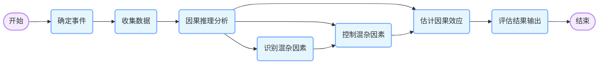

# 基于因果推理的事件影响评估模型设计

> 关键词：因果推理、事件影响评估、模型设计、因果效应估计、机器学习

> 摘要：本文聚焦于基于因果推理的事件影响评估模型设计。首先介绍了研究背景、目的、预期读者和文档结构等内容。接着阐述了因果推理和事件影响评估的核心概念及其联系，并给出相应的文本示意图和 Mermaid 流程图。详细讲解了核心算法原理，结合 Python 代码进行说明，同时介绍了相关的数学模型和公式，并举例分析。通过项目实战展示了开发环境搭建、源代码实现与解读。探讨了该模型在不同领域的实际应用场景，推荐了学习资源、开发工具框架和相关论文著作。最后总结了未来发展趋势与挑战，提供常见问题解答和扩展阅读参考资料，旨在为研究和应用基于因果推理的事件影响评估模型提供全面的技术指导。

## 1. 背景介绍 
### 1.1 目的和范围
在当今复杂多变的世界中，各类事件频繁发生，如自然灾害、政策出台、市场波动等。准确评估这些事件所产生的影响对于决策制定、资源分配、风险预警等方面具有至关重要的意义。传统的影响评估方法往往侧重于相关性分析，难以真正揭示事件之间的因果关系，从而可能导致评估结果的偏差。因此，本研究的目的在于设计一种基于因果推理的事件影响评估模型，以更准确地量化事件所带来的影响。

本研究的范围涵盖了多种类型的事件，包括但不限于社会事件、经济事件、环境事件等。通过建立通用的模型框架，能够适用于不同领域的事件影响评估问题。同时，本研究将重点关注如何利用因果推理技术解决事件影响评估中的混杂因素、选择偏差等难题，提高评估结果的可靠性和有效性。

### 1.2 预期读者
本文的预期读者主要包括以下几类人群：
1. **研究人员**：对因果推理、机器学习、统计学等领域感兴趣，致力于事件影响评估相关研究的学者和科研人员。
2. **数据分析师**：负责处理和分析各类事件数据，需要准确评估事件影响以支持决策的专业人士。
3. **政策制定者**：制定政策、规划资源分配的政府官员和决策者，希望借助科学的方法评估政策实施的效果和影响。
4. **软件开发人员**：从事软件开发工作，需要将事件影响评估模型集成到实际应用系统中的程序员和软件工程师。

### 1.3 文档结构概述
本文将按照以下结构进行组织：
1. **背景介绍**：阐述研究的目的和范围、预期读者以及文档的整体结构。
2. **核心概念与联系**：介绍因果推理和事件影响评估的核心概念，分析它们之间的联系，并给出相应的文本示意图和 Mermaid 流程图。
3. **核心算法原理 & 具体操作步骤**：详细讲解基于因果推理的事件影响评估模型的核心算法原理，结合 Python 代码进行具体操作步骤的说明。
4. **数学模型和公式 & 详细讲解 & 举例说明**：介绍相关的数学模型和公式，对其进行详细讲解，并通过具体例子进行分析。
5. **项目实战：代码实际案例和详细解释说明**：通过一个实际的项目案例，展示开发环境的搭建、源代码的实现和解读。
6. **实际应用场景**：探讨基于因果推理的事件影响评估模型在不同领域的实际应用场景。
7. **工具和资源推荐**：推荐学习资源、开发工具框架和相关论文著作。
8. **总结：未来发展趋势与挑战**：总结研究成果，分析未来的发展趋势和面临的挑战。
9. **附录：常见问题与解答**：提供常见问题的解答，帮助读者更好地理解和应用本文的内容。
10. **扩展阅读 & 参考资料**：列出扩展阅读的建议和参考资料，方便读者进一步深入研究。

### 1.4 术语表
#### 1.4.1 核心术语定义
- **因果推理**：是一种从数据中识别因果关系的方法，旨在确定某个事件或因素是否是另一个事件或结果的原因。
- **事件影响评估**：对特定事件所产生的各种影响进行量化和分析的过程，包括经济影响、社会影响、环境影响等。
- **因果效应**：指某个原因变量对结果变量所产生的影响程度。
- **混杂因素**：与原因变量和结果变量都相关的变量，可能会干扰因果关系的识别和评估。
- **倾向得分**：是个体接受某种处理的概率，常用于控制混杂因素的影响。

#### 1.4.2 相关概念解释
- **潜在结果框架**：是因果推理中的一种重要理论框架，通过定义潜在结果来描述个体在不同处理下的可能结果。
- **反事实分析**：基于潜在结果框架，通过比较个体在实际处理和反事实处理下的结果，来估计因果效应。
- **匹配方法**：一种控制混杂因素的方法，通过找到与处理组个体特征相似的对照组个体，来减少混杂因素的影响。

#### 1.4.3 缩略词列表
- **ATE**：Average Treatment Effect，平均处理效应
- **ATT**：Average Treatment Effect on the Treated，处理组平均处理效应
- **IPW**：Inverse Probability Weighting，逆概率加权
- **PSM**：Propensity Score Matching，倾向得分匹配

## 2. 核心概念与联系 

### 2.1 因果推理
因果推理是一种旨在从数据中识别因果关系的方法。在现实世界中，我们常常观察到变量之间存在关联，但关联并不等同于因果关系。例如，冰淇淋销量和溺水事故数量之间可能存在正相关关系，但这并不意味着冰淇淋销量的增加会导致溺水事故的增加，实际上它们可能都受到气温这一共同因素的影响。

因果推理的核心目标是确定某个事件或因素是否是另一个事件或结果的原因，以及这种因果关系的强度和方向。为了实现这一目标，因果推理采用了多种方法和技术，如潜在结果框架、反事实分析、匹配方法等。

### 2.2 事件影响评估
事件影响评估是对特定事件所产生的各种影响进行量化和分析的过程。这些影响可以是经济方面的，如事件对企业销售额、市场价格的影响；也可以是社会方面的，如事件对人们生活质量、社会稳定性的影响；还可以是环境方面的，如事件对生态系统、气候变化的影响。

事件影响评估的目的是为了帮助决策者了解事件的后果，从而做出更明智的决策。例如，政府在出台一项新政策之前，需要评估该政策可能带来的影响，以确定是否值得实施；企业在推出一款新产品之前，需要评估该产品对市场的影响，以制定合理的营销策略。

### 2.3 因果推理与事件影响评估的联系
因果推理为事件影响评估提供了理论基础和方法支持。在事件影响评估中，我们需要确定事件与影响之间的因果关系，而因果推理正是解决这一问题的有效工具。通过因果推理，我们可以识别出可能影响事件结果的混杂因素，并采用适当的方法控制这些因素的影响，从而更准确地估计事件的因果效应。

另一方面，事件影响评估也为因果推理提供了实际应用场景。因果推理的理论和方法需要在实际问题中得到验证和应用，而事件影响评估正是一个重要的应用领域。通过对各种事件的影响进行评估，我们可以不断改进和完善因果推理的方法和技术，提高其在实际应用中的有效性和可靠性。

### 2.4 文本示意图
```plaintext
因果推理
|
|-- 潜在结果框架
|   |-- 定义潜在结果
|   |-- 反事实分析
|
|-- 匹配方法
|   |-- 倾向得分匹配
|   |-- 精确匹配
|
|-- 逆概率加权

事件影响评估
|
|-- 确定事件
|
|-- 收集数据
|
|-- 因果推理分析
|   |-- 识别混杂因素
|   |-- 控制混杂因素
|   |-- 估计因果效应
|
|-- 评估结果输出
```

### 2.5 Mermaid 流程图


## 3. 核心算法原理 & 具体操作步骤 

### 3.1 倾向得分匹配（PSM）算法原理
倾向得分匹配是一种常用的因果推理方法，用于控制混杂因素的影响。其基本思想是通过计算每个个体接受处理的概率（即倾向得分），然后根据倾向得分将处理组和对照组的个体进行匹配，使得匹配后的处理组和对照组在混杂因素上具有相似的分布，从而减少混杂因素对因果效应估计的影响。

具体步骤如下：
1. **估计倾向得分**：使用逻辑回归等方法，根据混杂因素预测个体接受处理的概率。
2. **匹配个体**：根据倾向得分，为处理组的每个个体找到一个或多个与之倾向得分相近的对照组个体进行匹配。
3. **估计因果效应**：在匹配后的样本中，计算处理组和对照组的结果变量的均值差异，作为因果效应的估计值。

### 3.2 Python 代码实现
```python
import pandas as pd
import numpy as np
from sklearn.linear_model import LogisticRegression
from sklearn.neighbors import NearestNeighbors

# 生成示例数据
np.random.seed(0)
n = 1000
X = np.random.randn(n, 3)  # 混杂因素
T = np.random.binomial(1, 0.5, n)  # 处理变量
Y = 2 * T + 0.5 * X[:, 0] + 0.3 * X[:, 1] + 0.2 * X[:, 2] + np.random.randn(n)  # 结果变量

data = pd.DataFrame({'X1': X[:, 0], 'X2': X[:, 1], 'X3': X[:, 2], 'T': T, 'Y': Y})

# 步骤 1：估计倾向得分
model = LogisticRegression()
model.fit(data[['X1', 'X2', 'X3']], data['T'])
data['PS'] = model.predict_proba(data[['X1', 'X2', 'X3']])[:, 1]

# 步骤 2：匹配个体
def match(data):
    treated = data[data['T'] == 1]
    control = data[data['T'] == 0]
    nbrs = NearestNeighbors(n_neighbors=1, algorithm='ball_tree').fit(control[['PS']])
    distances, indices = nbrs.kneighbors(treated[['PS']])
    matched_control = control.iloc[indices.flatten()]
    return pd.concat([treated.reset_index(drop=True), matched_control.reset_index(drop=True)])

matched_data = match(data)

# 步骤 3：估计因果效应
att = matched_data[matched_data['T'] == 1]['Y'].mean() - matched_data[matched_data['T'] == 0]['Y'].mean()
print(f"处理组平均处理效应 (ATT): {att}")
```

### 3.3 代码解释
1. **数据生成**：使用 `numpy` 生成示例数据，包括混杂因素 `X`、处理变量 `T` 和结果变量 `Y`。
2. **倾向得分估计**：使用 `LogisticRegression` 模型根据混杂因素预测个体接受处理的概率，并将结果存储在 `PS` 列中。
3. **个体匹配**：定义 `match` 函数，使用 `NearestNeighbors` 算法为处理组的每个个体找到一个与之倾向得分相近的对照组个体进行匹配。
4. **因果效应估计**：计算匹配后处理组和对照组的结果变量的均值差异，作为处理组平均处理效应（ATT）的估计值。

## 4. 数学模型和公式 & 详细讲解 & 举例说明 

### 4.1 潜在结果框架
潜在结果框架是因果推理中的一种重要理论框架，用于描述个体在不同处理下的可能结果。设 $T$ 为处理变量，取值为 $0$ 或 $1$，分别表示未接受处理和接受处理；$Y$ 为结果变量；$Y(0)$ 和 $Y(1)$ 分别表示个体在未接受处理和接受处理时的潜在结果。

对于个体 $i$，其实际结果 $Y_i$ 可以表示为：
$$Y_i = T_i Y_i(1) + (1 - T_i) Y_i(0)$$

其中，$T_i$ 为个体 $i$ 的处理状态。如果 $T_i = 1$，则 $Y_i = Y_i(1)$；如果 $T_i = 0$，则 $Y_i = Y_i(0)$。

### 4.2 平均处理效应（ATE）
平均处理效应是指在总体中，接受处理和未接受处理的个体的潜在结果的平均差异，定义为：
$$ATE = E[Y(1) - Y(0)]$$

其中，$E[\cdot]$ 表示期望。由于我们无法同时观察到个体在接受处理和未接受处理时的潜在结果，因此需要通过因果推理方法来估计 $ATE$。

### 4.3 处理组平均处理效应（ATT）
处理组平均处理效应是指在处理组中，接受处理和未接受处理的个体的潜在结果的平均差异，定义为：
$$ATT = E[Y(1) - Y(0) | T = 1]$$

### 4.4 举例说明
假设我们要评估一项教育政策对学生成绩的影响。我们随机选择了一部分学生接受该政策（处理组），另一部分学生不接受该政策（对照组）。设 $Y(1)$ 为学生接受政策后的成绩，$Y(0)$ 为学生未接受政策时的成绩。

我们收集了以下数据：
| 学生编号 | 处理状态 $T$ | 成绩 $Y$ |
| ---- | ---- | ---- |
| 1 | 1 | 80 |
| 2 | 1 | 85 |
| 3 | 0 | 70 |
| 4 | 0 | 75 |

假设我们可以通过某种方法估计出处理组学生在未接受政策时的潜在成绩分别为 $72$ 和 $77$。则处理组平均处理效应（ATT）为：
$$ATT = \frac{(80 - 72) + (85 - 77)}{2} = 8$$

这意味着该教育政策对处理组学生的平均成绩提高了 8 分。

## 5. 项目实战：代码实际案例和详细解释说明 

### 5.1  开发环境搭建
#### 5.1.1 安装 Python
首先，确保你已经安装了 Python 环境。建议使用 Python 3.7 及以上版本。你可以从 [Python 官方网站](https://www.python.org/downloads/) 下载并安装 Python。

#### 5.1.2 安装必要的库
在命令行中使用 `pip` 安装以下必要的库：
```sh
pip install pandas numpy scikit-learn
```

### 5.2  源代码详细实现和代码解读
以下是一个完整的基于倾向得分匹配的事件影响评估的 Python 代码示例：
```python
import pandas as pd
import numpy as np
from sklearn.linear_model import LogisticRegression
from sklearn.neighbors import NearestNeighbors

# 步骤 1：数据准备
def generate_data(n):
    np.random.seed(0)
    X = np.random.randn(n, 3)  # 混杂因素
    T = np.random.binomial(1, 0.5, n)  # 处理变量
    Y = 2 * T + 0.5 * X[:, 0] + 0.3 * X[:, 1] + 0.2 * X[:, 2] + np.random.randn(n)  # 结果变量
    data = pd.DataFrame({'X1': X[:, 0], 'X2': X[:, 1], 'X3': X[:, 2], 'T': T, 'Y': Y})
    return data

# 步骤 2：估计倾向得分
def estimate_ps(data):
    model = LogisticRegression()
    model.fit(data[['X1', 'X2', 'X3']], data['T'])
    data['PS'] = model.predict_proba(data[['X1', 'X2', 'X3']])[:, 1]
    return data

# 步骤 3：匹配个体
def match(data):
    treated = data[data['T'] == 1]
    control = data[data['T'] == 0]
    nbrs = NearestNeighbors(n_neighbors=1, algorithm='ball_tree').fit(control[['PS']])
    distances, indices = nbrs.kneighbors(treated[['PS']])
    matched_control = control.iloc[indices.flatten()]
    return pd.concat([treated.reset_index(drop=True), matched_control.reset_index(drop=True)])

# 步骤 4：估计因果效应
def estimate_att(matched_data):
    att = matched_data[matched_data['T'] == 1]['Y'].mean() - matched_data[matched_data['T'] == 0]['Y'].mean()
    return att

# 主函数
def main():
    n = 1000
    data = generate_data(n)
    data = estimate_ps(data)
    matched_data = match(data)
    att = estimate_att(matched_data)
    print(f"处理组平均处理效应 (ATT): {att}")

if __name__ == "__main__":
    main()
```

### 5.3  代码解读与分析
1. **数据准备**：`generate_data` 函数用于生成示例数据，包括混杂因素 `X`、处理变量 `T` 和结果变量 `Y`。
2. **倾向得分估计**：`estimate_ps` 函数使用 `LogisticRegression` 模型根据混杂因素预测个体接受处理的概率，并将结果存储在 `PS` 列中。
3. **个体匹配**：`match` 函数使用 `NearestNeighbors` 算法为处理组的每个个体找到一个与之倾向得分相近的对照组个体进行匹配。
4. **因果效应估计**：`estimate_att` 函数计算匹配后处理组和对照组的结果变量的均值差异，作为处理组平均处理效应（ATT）的估计值。
5. **主函数**：`main` 函数调用上述函数，完成数据生成、倾向得分估计、个体匹配和因果效应估计的整个流程，并输出处理组平均处理效应（ATT）的估计值。

## 6. 实际应用场景 
### 6.1 政策评估
政府在制定和实施各种政策时，需要评估政策的效果和影响。例如，一项税收政策的出台可能会对企业的投资决策、市场的供求关系产生影响。通过基于因果推理的事件影响评估模型，可以准确地估计税收政策对企业投资和市场供求的因果效应，为政策的调整和优化提供科学依据。

### 6.2 市场营销
企业在开展市场营销活动时，需要评估活动的效果和投资回报率。例如，一次广告投放活动可能会对产品的销量、品牌知名度产生影响。通过因果推理模型，可以识别出广告投放与产品销量之间的因果关系，排除其他混杂因素的干扰，从而更准确地评估广告投放的效果，优化营销策略。

### 6.3 医疗研究
在医疗领域，需要评估新的治疗方法、药物对患者健康状况的影响。例如，一种新的药物治疗方案可能会对患者的病情改善、生存率产生影响。通过因果推理模型，可以控制患者的个体特征、病情严重程度等混杂因素，准确地估计新药物治疗方案的因果效应，为临床决策提供参考。

### 6.4 环境评估
在环境科学领域，需要评估各种环境事件（如自然灾害、污染事件）对生态系统、人类健康的影响。例如，一场洪水可能会对农作物产量、居民生活质量产生影响。通过因果推理模型，可以分析洪水与农作物产量、居民生活质量之间的因果关系，为环境保护和灾害应对提供决策支持。

## 7. 工具和资源推荐
### 7.1 学习资源推荐
#### 7.1.1 书籍推荐
- 《Causal Inference in Statistics: A Primer》：由 Judea Pearl、Madelyn Glymour 和 Nicholas P. Jewell 所著，是一本介绍因果推理基本概念和方法的入门书籍，适合初学者阅读。
- 《Mostly Harmless Econometrics: An Empiricist's Companion》：由 Joshua D. Angrist 和 Jörn-Steffen Pischke 所著，主要介绍了因果推理在经济学中的应用，包含了大量的实证案例和方法。
- 《Causal Inference for Statistics, Social, and Biomedical Sciences: An Introduction》：由 Guido W. Imbens 和 Donald B. Rubin 所著，是一本系统介绍因果推理理论和方法的高级教材，适合有一定统计学基础的读者阅读。

#### 7.1.2 在线课程
- Coursera 上的 “A Crash Course in Causality: Inferring Causal Effects from Observational Data”：由 Miguel Hernán 和 Jamie Robins 教授授课，介绍了因果推理的基本概念和方法，通过实际案例进行讲解，适合初学者。
- edX 上的 “Causal Analysis in Social Science”：由 Columbia University 提供，深入介绍了因果推理在社会科学中的应用，包括实验设计、因果效应估计等内容。

#### 7.1.3 技术博客和网站
- [The Effect](https://theeffectbook.net/)：是一个关于因果推理的在线书籍和博客，提供了丰富的因果推理知识和案例分析。
- [因果推断社区](https://causalinference.gitbook.io/causalbook/)：是一个专注于因果推断领域的知识分享社区，包含了大量的学术论文、技术博客和实践案例。

### 7.2 开发工具框架推荐
#### 7.2.1 IDE和编辑器
- **PyCharm**：是一款专门为 Python 开发设计的集成开发环境（IDE），提供了丰富的代码编辑、调试、测试等功能，适合专业的 Python 开发者使用。
- **Jupyter Notebook**：是一个交互式的开发环境，支持多种编程语言，尤其适合数据科学和机器学习领域的开发。通过 Jupyter Notebook，可以方便地进行代码编写、数据可视化和结果展示。

#### 7.2.2 调试和性能分析工具
- **pdb**：是 Python 内置的调试工具，可以在代码中设置断点，逐行执行代码，查看变量的值和程序的执行流程，帮助开发者定位和解决代码中的问题。
- **cProfile**：是 Python 内置的性能分析工具，可以统计代码中各个函数的执行时间和调用次数，帮助开发者找出代码中的性能瓶颈。

#### 7.2.3 相关框架和库
- **EconML**：是 Microsoft 开发的一个用于因果推理和机器学习的 Python 库，提供了多种因果效应估计方法，如倾向得分匹配、双重机器学习等。
- **CausalML**：是 Uber 开发的一个用于因果推理和机器学习的 Python 库，提供了多种因果效应估计方法和工具，支持大规模数据处理和分布式计算。

### 7.3 相关论文著作推荐
#### 7.3.1 经典论文
- Pearl, J. (2009). Causality: models, reasoning, and inference. Cambridge university press. 该论文是因果推理领域的经典著作，介绍了因果图模型和结构方程模型等重要理论和方法。
- Rubin, D. B. (1974). Estimating causal effects of treatments in randomized and nonrandomized studies. Journal of educational Psychology, 66(5), 688. 该论文提出了潜在结果框架，为因果推理提供了重要的理论基础。

#### 7.3.2 最新研究成果
- Athey, S., & Imbens, G. W. (2016). Recursive partitioning for heterogeneous causal effects. Proceedings of the National Academy of Sciences, 113(27), 7353-7360. 该论文提出了一种基于递归划分的方法，用于估计异质因果效应。
- Chernozhukov, V., Chetverikov, D., Demirer, M., Duflo, E., Hansen, C., & Newey, W. (2018). Double/debiased machine learning for treatment and structural parameters. The Econometrics Journal, 21(1), C1-C68. 该论文提出了双重机器学习方法，用于在高维数据中估计因果效应。

#### 7.3.3 应用案例分析
- Angrist, J. D., & Krueger, A. B. (1991). Does compulsory school attendance affect schooling and earnings?. The Quarterly Journal of Economics, 106(4), 979-1014. 该论文通过因果推理方法，分析了义务教育法对个人教育程度和收入的影响。
- Card, D., & Krueger, A. B. (1994). Minimum wages and employment: A case study of the fast-food industry in New Jersey and Pennsylvania. The American Economic Review, 84(4), 772-793. 该论文通过因果推理方法，分析了最低工资政策对就业的影响。

## 8. 总结：未来发展趋势与挑战
### 8.1 未来发展趋势
#### 8.1.1 与深度学习的结合
随着深度学习技术的不断发展，将因果推理与深度学习相结合是未来的一个重要发展趋势。深度学习可以用于处理高维、复杂的数据，而因果推理可以为深度学习模型提供因果解释，提高模型的可解释性和可靠性。例如，通过将因果图模型与深度学习模型相结合，可以构建出具有因果推理能力的智能系统。

#### 8.1.2 多源数据融合
在实际应用中，往往需要综合利用多种来源的数据进行事件影响评估。未来的研究将更加注重多源数据的融合，包括结构化数据、非结构化数据、时序数据等。通过融合多源数据，可以更全面地了解事件的背景和影响因素，提高事件影响评估的准确性和可靠性。

#### 8.1.3 个性化因果效应估计
不同个体对同一事件的反应可能存在差异，因此个性化因果效应估计是未来的一个重要研究方向。通过考虑个体的特征和行为，为每个个体估计个性化的因果效应，可以为决策者提供更精准的决策支持。例如，在医疗领域，可以根据患者的基因信息、病情严重程度等因素，为每个患者制定个性化的治疗方案。

### 8.2 挑战
#### 8.2.1 数据质量和可获取性
因果推理和事件影响评估需要大量高质量的数据作为支持。然而，在实际应用中，数据往往存在缺失、噪声、偏差等问题，影响了因果效应估计的准确性。此外，某些数据可能由于隐私、安全等原因难以获取，限制了模型的应用范围。

#### 8.2.2 因果假设的验证
因果推理基于一系列的因果假设，如可忽略性假设、一致性假设等。然而，这些假设在实际应用中往往难以验证，可能会导致因果效应估计的偏差。因此，如何有效地验证因果假设，是未来需要解决的一个重要问题。

#### 8.2.3 计算复杂度
随着数据规模的不断增大和模型复杂度的提高，因果推理和事件影响评估的计算复杂度也会相应增加。如何设计高效的算法和计算框架，降低计算复杂度，提高模型的运行效率，是未来需要面对的一个挑战。

## 9. 附录：常见问题与解答
### 9.1 因果推理和相关性分析有什么区别？
相关性分析只能发现变量之间的关联关系，而无法确定这种关联是否是因果关系。例如，两个变量之间可能存在正相关关系，但这并不意味着一个变量的变化会导致另一个变量的变化，它们可能都受到其他因素的影响。而因果推理则旨在确定变量之间的因果关系，通过控制混杂因素等方法，排除其他因素的干扰，准确地估计因果效应。

### 9.2 倾向得分匹配方法有哪些局限性？
倾向得分匹配方法的局限性主要包括以下几点：
1. **匹配质量问题**：倾向得分匹配的效果取决于匹配的质量，如果匹配后的处理组和对照组在混杂因素上仍然存在较大差异，可能会导致因果效应估计的偏差。
2. **样本损失问题**：在匹配过程中，可能会有一些个体无法找到合适的匹配对象，从而被排除在分析之外，导致样本损失，影响估计的有效性。
3. **高维数据问题**：当混杂因素较多时，倾向得分的估计可能会变得困难，而且匹配的效果也会受到影响。

### 9.3 如何选择合适的因果推理方法？
选择合适的因果推理方法需要考虑以下几个因素：
1. **数据类型和特征**：不同的因果推理方法适用于不同类型和特征的数据，如实验数据、观察数据、高维数据等。
2. **研究问题和假设**：根据研究问题和假设，选择能够满足研究需求的因果推理方法。例如，如果研究问题是估计平均处理效应，可以选择倾向得分匹配、逆概率加权等方法；如果研究问题是估计异质因果效应，可以选择双重机器学习、因果森林等方法。
3. **计算复杂度和可行性**：考虑所选方法的计算复杂度和可行性，确保在实际应用中能够有效地实现。

## 10. 扩展阅读 & 参考资料
### 10.1 扩展阅读
- Pearl, J., & Mackenzie, D. (2018). The book of why: The new science of cause and effect. Basic Books. 该书以通俗易懂的语言介绍了因果推理的基本概念和方法，以及因果推理在各个领域的应用。
- Angrist, J. D., & Pischke, J. -S. (2015). Mastering'metrics: The path from cause to effect. Princeton University Press. 该书介绍了因果推理在计量经济学中的应用，通过大量的实证案例和方法，帮助读者掌握因果推理的技巧。

### 10.2 参考资料
- Hernán, M. A., & Robins, J. M. (2020). Causal Inference: What If. Boca Raton: Chapman & Hall/CRC. 该书是一本系统介绍因果推理理论和方法的教材，包含了大量的案例和代码实现。
- Imbens, G. W., & Rubin, D. B. (2015). Causal Inference for Statistics, Social, and Biomedical Sciences: An Introduction. Cambridge University Press. 该书是一本高级的因果推理教材，适合有一定统计学基础的读者阅读。

作者：AI天才研究院/AI Genius Institute & 禅与计算机程序设计艺术 /Zen And The Art of Computer Programming