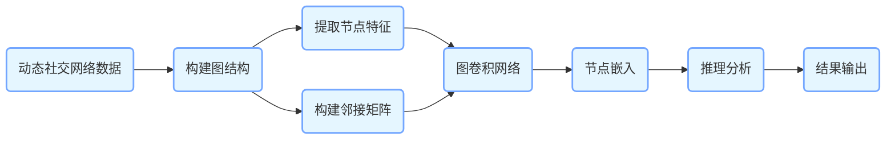

# 基于图卷积的动态社交网络推理分析

> 关键词：图卷积、动态社交网络、推理分析、深度学习、图神经网络

> 摘要：本文围绕基于图卷积的动态社交网络推理分析展开深入探讨。首先介绍了研究背景、目的范围、预期读者等信息，明确了文章的整体架构。接着阐述了图卷积、动态社交网络等核心概念及其联系，并给出了相应的文本示意图和Mermaid流程图。详细讲解了核心算法原理，通过Python源代码进行说明，同时介绍了相关的数学模型和公式，并举例分析。在项目实战部分，展示了开发环境搭建、源代码实现及解读。之后探讨了实际应用场景，推荐了学习资源、开发工具框架以及相关论文著作。最后总结了未来发展趋势与挑战，解答了常见问题并提供了扩展阅读和参考资料，旨在为该领域的研究和实践提供全面且深入的指导。

## 1. 背景介绍 
### 1.1 目的和范围
随着互联网的飞速发展，社交网络已经成为人们生活中不可或缺的一部分。动态社交网络中包含着大量的用户行为和关系信息，对这些信息进行推理分析具有重要的现实意义，如社交推荐、舆情监测、异常行为检测等。本文的目的是深入研究如何利用图卷积技术对动态社交网络进行推理分析，探讨其原理、算法实现以及实际应用。范围涵盖了图卷积的基本原理、动态社交网络的特点、相关算法的Python实现、项目实战案例、实际应用场景以及相关资源推荐等方面。

### 1.2 预期读者
本文预期读者主要包括对图神经网络、深度学习、社交网络分析等领域感兴趣的研究人员、开发者以及学生。对于想要了解如何将图卷积技术应用于动态社交网络推理分析的专业人士，本文提供了系统的知识和实践指导；对于初学者，本文也会从基础概念入手，逐步引导读者深入理解相关技术。

### 1.3 文档结构概述
本文将按照以下结构展开：首先介绍核心概念与联系，包括图卷积和动态社交网络的原理和架构；接着详细阐述核心算法原理及具体操作步骤，并用Python代码实现；然后介绍相关的数学模型和公式，并举例说明；在项目实战部分，展示如何搭建开发环境、实现源代码并进行解读；之后探讨实际应用场景；再推荐相关的学习资源、开发工具框架和论文著作；最后总结未来发展趋势与挑战，解答常见问题并提供扩展阅读和参考资料。

### 1.4 术语表
#### 1.4.1 核心术语定义
- **图卷积（Graph Convolution）**：是一种在图结构数据上进行卷积操作的技术，用于提取图节点的特征信息。
- **动态社交网络（Dynamic Social Network）**：指社交网络的结构和节点属性随时间变化的网络，如用户之间的关系不断更新、用户行为随时间改变等。
- **推理分析（Inference Analysis）**：根据已知信息和模型，对未知信息进行推断和分析的过程，在本文中主要指对动态社交网络中隐藏信息的挖掘。
- **图神经网络（Graph Neural Network，GNN）**：一类专门处理图结构数据的神经网络，图卷积是其重要组成部分。
- **节点嵌入（Node Embedding）**：将图中的节点映射到低维向量空间的过程，以便于后续的分析和处理。

#### 1.4.2 相关概念解释
- **图（Graph）**：由节点（Vertex）和边（Edge）组成的数学结构，用于表示对象之间的关系。在社交网络中，节点可以表示用户，边可以表示用户之间的关系，如好友关系、关注关系等。
- **卷积（Convolution）**：是一种数学运算，常用于信号处理和图像处理中，通过滑动窗口对输入数据进行加权求和。在图卷积中，卷积操作是在图结构上进行的，用于聚合节点的邻居信息。
- **深度学习（Deep Learning）**：是一类基于人工神经网络的机器学习方法，通过构建多层神经网络来学习数据的复杂特征和模式。图卷积网络是深度学习在图结构数据上的应用。

#### 1.4.3 缩略词列表
- **GCN**：Graph Convolutional Network，图卷积网络
- **GNN**：Graph Neural Network，图神经网络
- **DNN**：Deep Neural Network，深度神经网络
- **SVM**：Support Vector Machine，支持向量机

## 2. 核心概念与联系 

### 2.1 图卷积的原理
图卷积的核心思想是通过聚合节点的邻居信息来更新节点的特征表示。传统的卷积操作是在规则的网格结构（如图像的像素网格）上进行的，而图卷积需要处理不规则的图结构。常见的图卷积方法有谱域图卷积和空间域图卷积。

谱域图卷积是基于图的拉普拉斯矩阵的特征分解来定义卷积操作的。给定一个无向图 $G=(V, E)$，其中 $V$ 是节点集合，$E$ 是边集合，图的邻接矩阵为 $A$，度矩阵为 $D$，拉普拉斯矩阵 $L = D - A$。对拉普拉斯矩阵进行特征分解 $L = U\Lambda U^T$，其中 $U$ 是特征向量矩阵，$\Lambda$ 是特征值对角矩阵。谱域图卷积通过在频域进行卷积操作，然后再通过逆变换回到空域。

空间域图卷积则直接在节点的邻居上进行操作。以简单的图卷积网络（GCN）为例，节点 $i$ 的特征更新公式为：

$$H^{(l + 1)} = \sigma(\tilde{D}^{-\frac{1}{2}}\tilde{A}\tilde{D}^{-\frac{1}{2}}H^{(l)}W^{(l)})$$

其中，$\tilde{A} = A + I$ 是添加自环后的邻接矩阵，$\tilde{D}$ 是 $\tilde{A}$ 的度矩阵，$H^{(l)}$ 是第 $l$ 层的节点特征矩阵，$W^{(l)}$ 是第 $l$ 层的可学习权重矩阵，$\sigma$ 是激活函数。

### 2.2 动态社交网络的特点
动态社交网络具有以下特点：
- **时间变化性**：网络的结构和节点属性随时间不断变化。例如，用户可能会添加或删除好友，发布新的内容，这些都会导致社交网络的结构和节点信息发生改变。
- **复杂性**：社交网络中的关系复杂多样，包括好友关系、关注关系、评论关系等。不同类型的关系对节点的影响也不同。
- **不确定性**：用户的行为具有一定的不确定性，难以准确预测。例如，用户可能会突然改变自己的兴趣爱好，从而影响其在社交网络中的行为。

### 2.3 图卷积与动态社交网络的联系
图卷积技术可以很好地应用于动态社交网络的推理分析。通过图卷积，可以有效地聚合节点的邻居信息，捕捉社交网络中的结构特征。对于动态社交网络，我们可以将不同时间步的图结构视为不同的快照，在每个快照上应用图卷积进行特征提取。同时，可以通过引入时间维度的信息，如时间序列模型，来处理社交网络的动态变化。

### 2.4 核心概念架构的文本示意图
```plaintext
动态社交网络
├── 节点（用户）
│   ├── 属性（如年龄、性别、兴趣）
│   └── 行为（如发布、评论、点赞）
├── 边（关系）
│   ├── 好友关系
│   ├── 关注关系
│   └── 其他关系
└── 时间维度
    ├── 不同时间步的快照
    └── 时间序列变化

图卷积网络
├── 输入层
│   ├── 节点特征矩阵
│   └── 邻接矩阵
├── 隐藏层
│   ├── 图卷积操作
│   └── 激活函数
└── 输出层
    ├── 节点嵌入
    └── 推理结果
```

### 2.5 Mermaid流程图


## 3. 核心算法原理 & 具体操作步骤 

### 3.1 图卷积网络（GCN）的核心算法原理
图卷积网络（GCN）是一种常用的图卷积方法，其核心思想是通过聚合节点的邻居信息来更新节点的特征表示。下面是GCN的详细算法原理：

#### 输入
- 节点特征矩阵 $X \in \mathbb{R}^{N \times F}$，其中 $N$ 是节点数量，$F$ 是节点特征维度。
- 邻接矩阵 $A \in \mathbb{R}^{N \times N}$，表示节点之间的连接关系。

#### 步骤
1. **添加自环**：为了让节点能够聚合自身的信息，我们在邻接矩阵 $A$ 上添加自环，得到 $\tilde{A} = A + I$，其中 $I$ 是单位矩阵。
2. **计算度矩阵**：计算 $\tilde{A}$ 的度矩阵 $\tilde{D}$，其中 $\tilde{D}_{ii} = \sum_{j=1}^{N} \tilde{A}_{ij}$。
3. **归一化**：对 $\tilde{A}$ 进行归一化处理，得到 $\tilde{D}^{-\frac{1}{2}}\tilde{A}\tilde{D}^{-\frac{1}{2}}$，这一步的目的是为了缓解节点度差异带来的影响。
4. **图卷积操作**：在第 $l$ 层，节点特征更新公式为 $H^{(l + 1)} = \sigma(\tilde{D}^{-\frac{1}{2}}\tilde{A}\tilde{D}^{-\frac{1}{2}}H^{(l)}W^{(l)})$，其中 $H^{(0)} = X$，$W^{(l)}$ 是第 $l$ 层的可学习权重矩阵，$\sigma$ 是激活函数，如ReLU函数。

#### 输出
经过 $L$ 层图卷积操作后，得到最终的节点特征矩阵 $H^{(L)}$。

### 3.2 基于GCN的动态社交网络推理分析算法
对于动态社交网络，我们可以将不同时间步的图结构视为不同的快照，在每个快照上应用GCN进行特征提取，然后结合时间序列模型来处理动态变化。具体算法步骤如下：

#### 输入
- 动态社交网络的多个时间步的节点特征矩阵 $X^{(t)} \in \mathbb{R}^{N \times F}$，$t = 1, 2, \cdots, T$。
- 动态社交网络的多个时间步的邻接矩阵 $A^{(t)} \in \mathbb{R}^{N \times N}$，$t = 1, 2, \cdots, T$。

#### 步骤
1. **图卷积操作**：对于每个时间步 $t$，在对应的图结构 $(X^{(t)}, A^{(t)})$ 上应用GCN，得到节点特征矩阵 $H^{(t, L)}$。
2. **时间序列建模**：将不同时间步的节点特征矩阵 $H^{(t, L)}$ 输入到时间序列模型（如LSTM、GRU）中，学习节点特征的时间变化规律。
3. **推理分析**：根据时间序列模型的输出，进行推理分析，如预测节点的未来行为、检测异常节点等。

#### 输出
推理分析的结果。

### 3.3 Python源代码实现
```python
import torch
import torch.nn as nn
import torch.nn.functional as F

# 定义图卷积层
class GraphConvolution(nn.Module):
    def __init__(self, in_features, out_features):
        super(GraphConvolution, self).__init__()
        self.weight = nn.Parameter(torch.FloatTensor(in_features, out_features))
        self.reset_parameters()

    def reset_parameters(self):
        nn.init.xavier_uniform_(self.weight)

    def forward(self, input, adj):
        support = torch.mm(input, self.weight)
        output = torch.spmm(adj, support)
        return output

# 定义图卷积网络
class GCN(nn.Module):
    def __init__(self, nfeat, nhid, nclass, dropout):
        super(GCN, self).__init__()
        self.gc1 = GraphConvolution(nfeat, nhid)
        self.gc2 = GraphConvolution(nhid, nclass)
        self.dropout = dropout

    def forward(self, x, adj):
        x = F.relu(self.gc1(x, adj))
        x = F.dropout(x, self.dropout, training=self.training)
        x = self.gc2(x, adj)
        return F.log_softmax(x, dim=1)

# 示例代码，假设我们有一些节点特征和邻接矩阵
nfeat = 10  # 输入特征维度
nhid = 20   # 隐藏层维度
nclass = 5  # 输出类别数
dropout = 0.5

# 随机生成节点特征和邻接矩阵
x = torch.randn(100, nfeat)  # 100个节点，每个节点有10维特征
adj = torch.randn(100, 100)  # 邻接矩阵
adj = (adj > 0).float()      # 二值化邻接矩阵

# 创建GCN模型
model = GCN(nfeat, nhid, nclass, dropout)

# 前向传播
output = model(x, adj)
print(output.shape)
```

### 3.4 具体操作步骤说明
1. **定义图卷积层**：`GraphConvolution` 类实现了图卷积操作，包括权重初始化和前向传播。
2. **定义图卷积网络**：`GCN` 类定义了一个两层的图卷积网络，包括两个图卷积层和一个Dropout层。
3. **生成示例数据**：随机生成节点特征矩阵和邻接矩阵。
4. **创建模型**：实例化 `GCN` 模型。
5. **前向传播**：将节点特征矩阵和邻接矩阵输入到模型中，得到输出结果。

## 4. 数学模型和公式 & 详细讲解 & 举例说明 

### 4.1 图卷积的数学模型和公式
#### 拉普拉斯矩阵
给定一个无向图 $G=(V, E)$，其邻接矩阵为 $A$，度矩阵为 $D$，拉普拉斯矩阵定义为 $L = D - A$。拉普拉斯矩阵具有以下性质：
- 对称性：$L^T = L$。
- 半正定性：对于任意向量 $x$，有 $x^T L x \geq 0$。

#### 谱域图卷积
谱域图卷积基于图的拉普拉斯矩阵的特征分解。设 $L = U\Lambda U^T$，其中 $U$ 是特征向量矩阵，$\Lambda$ 是特征值对角矩阵。图信号 $x$ 的图傅里叶变换定义为 $\hat{x} = U^T x$，逆变换为 $x = U\hat{x}$。谱域图卷积定义为：

$$y = g_{\theta}(\Lambda) * x = U g_{\theta}(\Lambda) U^T x$$

其中，$g_{\theta}(\Lambda)$ 是一个对角矩阵，其对角元素是关于特征值的函数，$\theta$ 是可学习的参数。

#### 空间域图卷积
以简单的图卷积网络（GCN）为例，节点 $i$ 的特征更新公式为：

$$H^{(l + 1)} = \sigma(\tilde{D}^{-\frac{1}{2}}\tilde{A}\tilde{D}^{-\frac{1}{2}}H^{(l)}W^{(l)})$$

其中，$\tilde{A} = A + I$ 是添加自环后的邻接矩阵，$\tilde{D}$ 是 $\tilde{A}$ 的度矩阵，$H^{(l)}$ 是第 $l$ 层的节点特征矩阵，$W^{(l)}$ 是第 $l$ 层的可学习权重矩阵，$\sigma$ 是激活函数。

### 4.2 详细讲解
#### 拉普拉斯矩阵的作用
拉普拉斯矩阵描述了图的结构信息，通过对拉普拉斯矩阵进行特征分解，我们可以将图信号从空域转换到频域，从而在频域进行卷积操作。在谱域图卷积中，拉普拉斯矩阵的特征值表示图的频率信息，特征向量表示图的基函数。

#### 空间域图卷积的原理
空间域图卷积直接在节点的邻居上进行操作。通过添加自环和归一化处理，我们可以让节点聚合自身和邻居的信息。可学习权重矩阵 $W^{(l)}$ 用于学习不同特征之间的关系，激活函数 $\sigma$ 用于引入非线性。

### 4.3 举例说明
假设我们有一个简单的图，包含3个节点，其邻接矩阵为：

$$A = \begin{bmatrix}
0 & 1 & 1 \\
1 & 0 & 1 \\
1 & 1 & 0
\end{bmatrix}$$

度矩阵为：

$$D = \begin{bmatrix}
2 & 0 & 0 \\
0 & 2 & 0 \\
0 & 0 & 2
\end{bmatrix}$$

拉普拉斯矩阵为：

$$L = D - A = \begin{bmatrix}
2 & -1 & -1 \\
-1 & 2 & -1 \\
-1 & -1 & 2
\end{bmatrix}$$

添加自环后的邻接矩阵为：

$$\tilde{A} = A + I = \begin{bmatrix}
1 & 1 & 1 \\
1 & 1 & 1 \\
1 & 1 & 1
\end{bmatrix}$$

$\tilde{A}$ 的度矩阵为：

$$\tilde{D} = \begin{bmatrix}
3 & 0 & 0 \\
0 & 3 & 0 \\
0 & 0 & 3
\end{bmatrix}$$

归一化后的 $\tilde{D}^{-\frac{1}{2}}\tilde{A}\tilde{D}^{-\frac{1}{2}}$ 为：

$$\tilde{D}^{-\frac{1}{2}}\tilde{A}\tilde{D}^{-\frac{1}{2}} = \frac{1}{3} \begin{bmatrix}
1 & 1 & 1 \\
1 & 1 & 1 \\
1 & 1 & 1
\end{bmatrix}$$

假设初始节点特征矩阵为：

$$H^{(0)} = \begin{bmatrix}
1 & 2 \\
3 & 4 \\
5 & 6
\end{bmatrix}$$

可学习权重矩阵为：

$$W^{(0)} = \begin{bmatrix}
0.1 & 0.2 \\
0.3 & 0.4
\end{bmatrix}$$

则第一层图卷积的输出为：

$$H^{(1)} = \sigma(\tilde{D}^{-\frac{1}{2}}\tilde{A}\tilde{D}^{-\frac{1}{2}}H^{(0)}W^{(0)})$$

首先计算 $\tilde{D}^{-\frac{1}{2}}\tilde{A}\tilde{D}^{-\frac{1}{2}}H^{(0)}$：

$$\tilde{D}^{-\frac{1}{2}}\tilde{A}\tilde{D}^{-\frac{1}{2}}H^{(0)} = \frac{1}{3} \begin{bmatrix}
1 & 1 & 1 \\
1 & 1 & 1 \\
1 & 1 & 1
\end{bmatrix} \begin{bmatrix}
1 & 2 \\
3 & 4 \\
5 & 6
\end{bmatrix} = \begin{bmatrix}
3 & 4 \\
3 & 4 \\
3 & 4
\end{bmatrix}$$

然后计算 $\tilde{D}^{-\frac{1}{2}}\tilde{A}\tilde{D}^{-\frac{1}{2}}H^{(0)}W^{(0)}$：

$$\tilde{D}^{-\frac{1}{2}}\tilde{A}\tilde{D}^{-\frac{1}{2}}H^{(0)}W^{(0)} = \begin{bmatrix}
3 & 4 \\
3 & 4 \\
3 & 4
\end{bmatrix} \begin{bmatrix}
0.1 & 0.2 \\
0.3 & 0.4
\end{bmatrix} = \begin{bmatrix}
1.5 & 2.2 \\
1.5 & 2.2 \\
1.5 & 2.2
\end{bmatrix}$$

假设激活函数为ReLU函数，则：

$$H^{(1)} = \sigma(\begin{bmatrix}
1.5 & 2.2 \\
1.5 & 2.2 \\
1.5 & 2.2
\end{bmatrix}) = \begin{bmatrix}
1.5 & 2.2 \\
1.5 & 2.2 \\
1.5 & 2.2
\end{bmatrix}$$

## 5. 项目实战：代码实际案例和详细解释说明 

### 5.1  开发环境搭建
#### 操作系统
推荐使用Linux系统，如Ubuntu 18.04或更高版本。也可以使用Windows 10系统，但可能需要进行一些额外的配置。

#### Python环境
建议使用Python 3.7或更高版本。可以通过Anaconda或Miniconda来管理Python环境。以下是创建和激活虚拟环境的命令：

```bash
# 创建虚拟环境
conda create -n gcn_env python=3.8

# 激活虚拟环境
conda activate gcn_env
```

#### 安装依赖库
在激活的虚拟环境中，安装以下依赖库：
```bash
pip install torch torchvision torchaudio
pip install numpy scipy networkx matplotlib
```

### 5.2  源代码详细实现和代码解读
#### 数据加载和预处理
```python
import torch
import numpy as np
import scipy.sparse as sp
import networkx as nx

# 加载数据集
def load_data():
    # 这里假设我们有一个简单的图数据集
    adj = np.array([[0, 1, 1], [1, 0, 1], [1, 1, 0]])
    features = np.array([[1, 2], [3, 4], [5, 6]])
    labels = np.array([0, 1, 0])

    # 将邻接矩阵转换为稀疏矩阵
    adj = sp.coo_matrix(adj)
    adj = adj + sp.eye(adj.shape[0])  # 添加自环
    adj = normalize_adj(adj)
    adj = sparse_mx_to_torch_sparse_tensor(adj)

    # 将特征矩阵转换为张量
    features = torch.FloatTensor(features)

    # 将标签转换为张量
    labels = torch.LongTensor(labels)

    return adj, features, labels

# 归一化邻接矩阵
def normalize_adj(mx):
    rowsum = np.array(mx.sum(1))
    r_inv_sqrt = np.power(rowsum, -0.5).flatten()
    r_inv_sqrt[np.isinf(r_inv_sqrt)] = 0.
    r_mat_inv_sqrt = sp.diags(r_inv_sqrt)
    return mx.dot(r_mat_inv_sqrt).transpose().dot(r_mat_inv_sqrt)

# 将稀疏矩阵转换为PyTorch稀疏张量
def sparse_mx_to_torch_sparse_tensor(sparse_mx):
    sparse_mx = sparse_mx.tocoo().astype(np.float32)
    indices = torch.from_numpy(
        np.vstack((sparse_mx.row, sparse_mx.col)).astype(np.int64))
    values = torch.from_numpy(sparse_mx.data)
    shape = torch.Size(sparse_mx.shape)
    return torch.sparse.FloatTensor(indices, values, shape)
```

#### 模型定义
```python
import torch
import torch.nn as nn
import torch.nn.functional as F

# 定义图卷积层
class GraphConvolution(nn.Module):
    def __init__(self, in_features, out_features):
        super(GraphConvolution, self).__init__()
        self.weight = nn.Parameter(torch.FloatTensor(in_features, out_features))
        self.reset_parameters()

    def reset_parameters(self):
        nn.init.xavier_uniform_(self.weight)

    def forward(self, input, adj):
        support = torch.mm(input, self.weight)
        output = torch.spmm(adj, support)
        return output

# 定义图卷积网络
class GCN(nn.Module):
    def __init__(self, nfeat, nhid, nclass, dropout):
        super(GCN, self).__init__()
        self.gc1 = GraphConvolution(nfeat, nhid)
        self.gc2 = GraphConvolution(nhid, nclass)
        self.dropout = dropout

    def forward(self, x, adj):
        x = F.relu(self.gc1(x, adj))
        x = F.dropout(x, self.dropout, training=self.training)
        x = self.gc2(x, adj)
        return F.log_softmax(x, dim=1)
```

#### 训练和评估
```python
import torch.optim as optim

# 加载数据
adj, features, labels = load_data()

# 定义模型参数
nfeat = features.shape[1]
nhid = 16
nclass = labels.max().item() + 1
dropout = 0.5

# 创建模型
model = GCN(nfeat, nhid, nclass, dropout)

# 定义优化器和损失函数
optimizer = optim.Adam(model.parameters(), lr=0.01, weight_decay=5e-4)
criterion = nn.NLLLoss()

# 训练模型
def train(epoch):
    model.train()
    optimizer.zero_grad()
    output = model(features, adj)
    loss_train = criterion(output, labels)
    loss_train.backward()
    optimizer.step()
    print(f'Epoch: {epoch+1}, Loss: {loss_train.item()}')

# 训练模型100个epoch
for epoch in range(100):
    train(epoch)
```

### 5.3  代码解读与分析
#### 数据加载和预处理
- `load_data` 函数负责加载数据集，并对邻接矩阵进行归一化处理，将其转换为稀疏张量，同时将特征矩阵和标签转换为PyTorch张量。
- `normalize_adj` 函数用于对邻接矩阵进行归一化处理，缓解节点度差异带来的影响。
- `sparse_mx_to_torch_sparse_tensor` 函数将稀疏矩阵转换为PyTorch稀疏张量，以便在模型中使用。

#### 模型定义
- `GraphConvolution` 类定义了图卷积层，包括权重初始化和前向传播。
- `GCN` 类定义了一个两层的图卷积网络，包括两个图卷积层和一个Dropout层。

#### 训练和评估
- `train` 函数用于训练模型，包括前向传播、计算损失、反向传播和参数更新。
- 在主程序中，我们加载数据，定义模型参数，创建模型，定义优化器和损失函数，然后训练模型100个epoch。

## 6. 实际应用场景 
### 6.1 社交推荐
在社交网络中，图卷积技术可以用于社交推荐系统。通过分析用户之间的关系和用户的行为数据，构建用户-物品图，然后使用图卷积网络提取节点的特征表示。根据节点的特征表示，可以为用户推荐感兴趣的物品，如好友推荐、商品推荐、内容推荐等。

### 6.2 舆情监测
动态社交网络中包含着大量的舆情信息，如用户的言论、情绪等。利用图卷积技术，可以对社交网络中的节点和边进行建模，提取舆情特征。通过对不同时间步的舆情特征进行分析，可以实时监测舆情的发展趋势，及时发现热点事件和异常舆情。

### 6.3 异常行为检测
在社交网络中，可能存在一些异常行为，如恶意攻击、虚假信息传播等。图卷积网络可以学习社交网络的正常结构和行为模式，通过比较当前节点的特征表示与正常模式的差异，检测出异常节点和异常行为。

### 6.4 社区发现
社交网络中存在着不同的社区结构，如兴趣小组、朋友圈等。图卷积技术可以用于社区发现，通过对节点的特征进行聚类分析，将具有相似特征的节点划分到同一个社区中。同时，考虑到社交网络的动态变化，图卷积网络可以在不同时间步更新社区结构。

## 7. 工具和资源推荐
### 7.1 学习资源推荐
#### 7.1.1 书籍推荐
- 《图神经网络：基础、前沿与应用》：全面介绍了图神经网络的基本概念、算法和应用，适合初学者和研究人员阅读。
- 《深度学习》：深度学习领域的经典著作，对神经网络的原理和应用进行了详细介绍，为学习图卷积网络提供了理论基础。
- 《社交网络分析》：介绍了社交网络的基本概念、分析方法和应用，有助于理解动态社交网络的特点和分析需求。

#### 7.1.2 在线课程
- Coursera上的“Graph Neural Networks”课程：由知名教授授课，系统介绍了图神经网络的原理和应用。
- edX上的“Deep Learning for Graphs”课程：专注于图深度学习的理论和实践，提供了丰富的案例和代码实现。
- 哔哩哔哩上的一些图神经网络相关视频教程：适合初学者快速入门，有很多博主分享了图卷积网络的原理和代码实现。

#### 7.1.3 技术博客和网站
- Medium上的“Graph Neural Networks”专栏：汇集了图神经网络领域的最新研究成果和实践经验。
- ArXiv.org：是一个预印本平台，提供了大量的图神经网络相关的研究论文。
- 知乎上的图神经网络相关话题：有很多专业人士分享了图卷积网络的研究和应用经验。

### 7.2 开发工具框架推荐
#### 7.2.1 IDE和编辑器
- PyCharm：是一款专业的Python集成开发环境，提供了丰富的代码编辑、调试和项目管理功能。
- Jupyter Notebook：是一个交互式的开发环境，适合进行数据分析和模型实验，方便代码的展示和分享。
- Visual Studio Code：是一款轻量级的代码编辑器，支持多种编程语言，有丰富的插件可以扩展功能。

#### 7.2.2 调试和性能分析工具
- PyTorch自带的调试工具：可以用于调试PyTorch模型，查看模型的参数和中间结果。
- TensorBoard：是一个可视化工具，可以用于监控模型的训练过程，如损失函数、准确率等指标的变化。
- Py-spy：是一个性能分析工具，可以用于分析Python代码的性能瓶颈，找出耗时较长的代码段。

#### 7.2.3 相关框架和库
- PyTorch Geometric：是一个基于PyTorch的图神经网络框架，提供了丰富的图卷积层和数据集，方便进行图神经网络的开发和实验。
- DGL（Deep Graph Library）：是一个开源的图深度学习框架，支持多种图神经网络模型，具有高效的图计算能力。
- NetworkX：是一个用于创建、操作和研究复杂网络的Python库，提供了丰富的图算法和数据结构。

### 7.3 相关论文著作推荐
#### 7.3.1 经典论文
- “Semi-Supervised Classification with Graph Convolutional Networks”：提出了图卷积网络（GCN）的经典模型，为图神经网络的发展奠定了基础。
- “Graph Attention Networks”：提出了图注意力网络（GAT），通过引入注意力机制，提高了图神经网络的表达能力。
- “Inductive Representation Learning on Large Graphs”：提出了GraphSAGE模型，解决了图神经网络在大规模图上的归纳学习问题。

#### 7.3.2 最新研究成果
- 关注NeurIPS、ICML、CVPR等顶级学术会议上的图神经网络相关论文，了解最新的研究进展和技术趋势。
- 定期浏览ArXiv.org上的图神经网络预印本，获取最新的研究成果。

#### 7.3.3 应用案例分析
- 阅读一些关于图卷积网络在社交网络、生物信息学、推荐系统等领域的应用案例分析论文，学习如何将图卷积技术应用到实际问题中。

## 8. 总结：未来发展趋势与挑战
### 8.1 未来发展趋势
#### 多模态融合
未来的动态社交网络推理分析将不仅仅局限于图结构数据，还会融合文本、图像、视频等多模态数据。通过多模态融合，可以更全面地理解社交网络中的信息，提高推理分析的准确性和可靠性。

#### 强化学习与图卷积的结合
强化学习可以用于解决动态社交网络中的决策问题，如图节点的行为策略选择。将强化学习与图卷积技术相结合，可以使模型更好地适应社交网络的动态变化，实现更智能的推理分析。

#### 可解释性图卷积网络
随着图卷积网络在实际应用中的广泛使用，其可解释性问题越来越受到关注。未来的研究将致力于开发可解释性图卷积网络，使模型的决策过程更加透明，便于用户理解和信任。

### 8.2 挑战
#### 数据隐私和安全
动态社交网络中包含着大量的用户隐私信息，如何在保证数据隐私和安全的前提下进行推理分析是一个重要的挑战。需要研究新的加密技术和隐私保护机制，确保用户数据不被泄露。

#### 大规模图数据处理
动态社交网络通常是大规模的图数据，处理这些数据需要高效的算法和计算资源。如何在有限的计算资源下，实现对大规模图数据的实时推理分析是一个亟待解决的问题。

#### 动态变化建模
动态社交网络的结构和节点属性随时间不断变化，如何准确地建模这种动态变化是一个挑战。需要研究更有效的时间序列模型和动态图卷积网络，以适应社交网络的动态特性。

## 9. 附录：常见问题与解答
### 9.1 图卷积网络和传统卷积神经网络有什么区别？
传统卷积神经网络（CNN）主要用于处理规则的网格结构数据，如图像、音频等。而图卷积网络（GCN）用于处理不规则的图结构数据，图中的节点和边可以表示不同的对象和关系。图卷积网络需要考虑图的拓扑结构，通过聚合节点的邻居信息来更新节点的特征表示。

### 9.2 如何选择合适的图卷积模型？
选择合适的图卷积模型需要考虑多个因素，如数据的特点、任务的需求、计算资源等。如果数据规模较小，可以选择简单的图卷积网络，如GCN；如果需要考虑节点之间的注意力机制，可以选择图注意力网络（GAT）；如果需要处理大规模图数据，可以选择GraphSAGE等归纳式图卷积模型。

### 9.3 图卷积网络的训练时间过长怎么办？
可以尝试以下方法来缩短图卷积网络的训练时间：
- 减少模型的复杂度，如减少隐藏层的数量或节点数。
- 使用更高效的优化算法，如Adam优化器。
- 对数据进行采样，减少训练数据的规模。
- 使用GPU加速训练过程。

### 9.4 如何评估图卷积网络的性能？
评估图卷积网络的性能可以使用多种指标，如准确率、召回率、F1值、均方误差等。具体选择哪种指标取决于任务的类型，如分类任务可以使用准确率、召回率和F1值，回归任务可以使用均方误差。同时，可以使用交叉验证等方法来评估模型的泛化能力。

## 10. 扩展阅读 & 参考资料
### 10.1 扩展阅读
- 阅读一些关于图论、机器学习、深度学习等方面的书籍和论文，加深对图卷积网络的理论理解。
- 关注一些图神经网络领域的开源项目，学习他人的代码实现和经验。

### 10.2 参考资料
- [Kipf, T. N., & Welling, M. (2016). Semi-Supervised Classification with Graph Convolutional Networks. arXiv preprint arXiv:1609.02907.](https://arxiv.org/abs/1609.02907)
- [Veličković, P., Cucurull, G., Casanova, A., Romero, A., Lio, P., & Bengio, Y. (2017). Graph Attention Networks. arXiv preprint arXiv:1710.10903.](https://arxiv.org/abs/1710.10903)
- [Hamilton, W. L., Ying, Z., & Leskovec, J. (2017). Inductive Representation Learning on Large Graphs. Advances in Neural Information Processing Systems, 1024-1034.](https://papers.nips.cc/paper/2017/hash/5dd9db5e033da9c6fb5ba83c7a7ebea9-Abstract.html)

作者：AI天才研究院/AI Genius Institute & 禅与计算机程序设计艺术 /Zen And The Art of Computer Programming