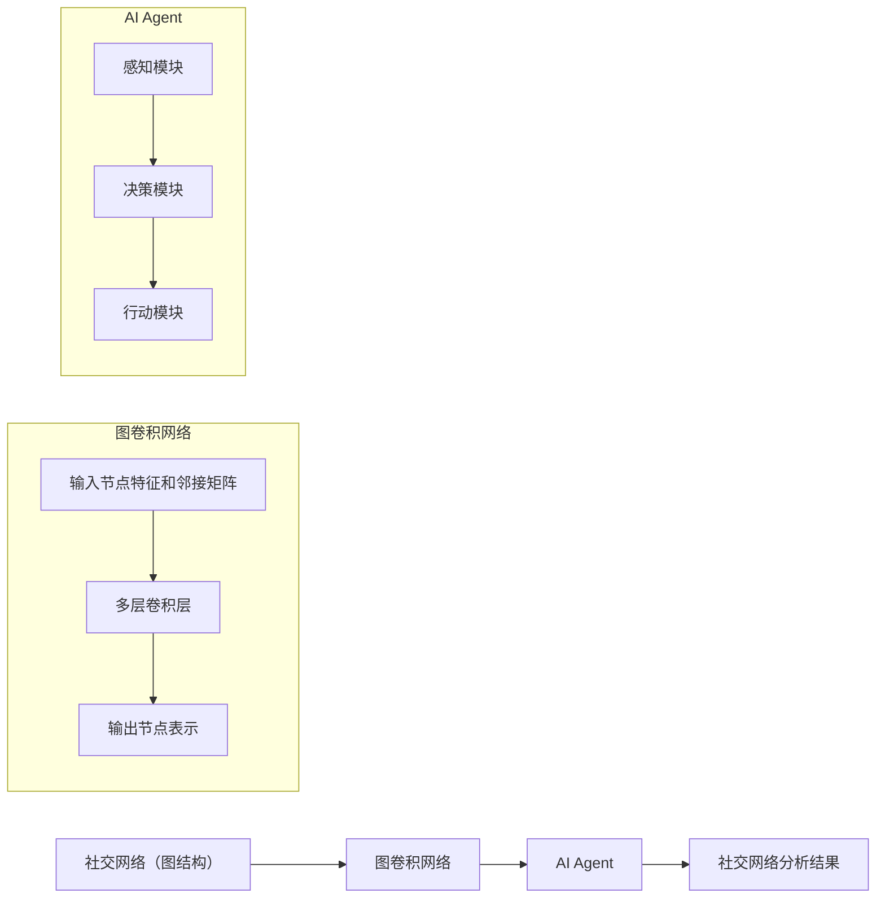

# 基于图卷积网络的AI Agent社交网络分析

> 关键词：图卷积网络、AI Agent、社交网络分析、图数据、节点表示学习

> 摘要：本文围绕基于图卷积网络的AI Agent社交网络分析展开深入探讨。首先介绍了相关背景知识，包括研究目的、预期读者、文档结构和术语表等。接着阐述了核心概念，如社交网络、图卷积网络以及AI Agent的原理和架构，并给出了相应的文本示意图和Mermaid流程图。详细讲解了核心算法原理，通过Python代码进行说明，同时给出了相关数学模型和公式。通过项目实战展示了代码实现和解读。分析了该技术在社交网络影响力分析、用户社区发现等实际应用场景。推荐了学习资源、开发工具框架和相关论文著作。最后总结了未来发展趋势与挑战，并提供了常见问题解答和扩展阅读参考资料。

## 1. 背景介绍 
### 1.1 目的和范围
社交网络已经成为人们日常生活中不可或缺的一部分，蕴含着丰富的信息。分析社交网络对于理解用户行为、信息传播、社区结构等具有重要意义。基于图卷积网络（Graph Convolutional Networks, GCN）的AI Agent社交网络分析旨在利用图卷积网络强大的图数据处理能力，结合AI Agent的智能决策和交互特性，对社交网络进行更深入、高效的分析。

本文的范围涵盖了从图卷积网络和AI Agent的基本概念，到核心算法原理、数学模型，再到项目实战和实际应用场景等多个方面，全面系统地介绍基于图卷积网络的AI Agent社交网络分析技术。

### 1.2 预期读者
本文预期读者包括计算机科学、人工智能、数据科学等相关专业的学生和研究人员，对社交网络分析和图神经网络感兴趣的技术爱好者，以及从事社交网络分析相关项目开发的工程师。

### 1.3 文档结构概述
本文将按照以下结构进行组织：首先介绍相关背景知识，包括目的、预期读者、文档结构和术语表；接着阐述核心概念和它们之间的联系；详细讲解核心算法原理和具体操作步骤；给出相关数学模型和公式；通过项目实战展示代码实现和解读；分析实际应用场景；推荐学习资源、开发工具框架和相关论文著作；最后总结未来发展趋势与挑战，提供常见问题解答和扩展阅读参考资料。

### 1.4 术语表
#### 1.4.1 核心术语定义
- **图卷积网络（Graph Convolutional Networks, GCN）**：一种专门用于处理图结构数据的神经网络，通过聚合节点及其邻居节点的特征信息来更新节点的表示。
- **AI Agent**：具有自主决策和交互能力的智能体，能够在社交网络环境中感知信息、做出决策并采取行动。
- **社交网络**：由节点（如用户）和边（如用户之间的关系）组成的图结构，用于表示个体之间的社交关系。
- **节点表示学习**：将图中的节点映射到低维向量空间，使得节点的向量表示能够捕捉到节点的结构和特征信息。

#### 1.4.2 相关概念解释
- **图数据**：以图的形式表示的数据，包含节点和边的信息。社交网络就是一种典型的图数据。
- **卷积操作**：在传统卷积神经网络中，卷积操作是对图像等规则数据进行特征提取。在图卷积网络中，卷积操作是对图结构数据进行节点特征更新。
- **邻接矩阵**：用于表示图中节点之间连接关系的矩阵，矩阵元素表示节点之间是否存在边以及边的权重。

#### 1.4.3 缩略词列表
- **GCN**：Graph Convolutional Networks（图卷积网络）
- **AI**：Artificial Intelligence（人工智能）

## 2. 核心概念与联系 
### 核心概念原理
#### 社交网络
社交网络可以用图 $G=(V, E)$ 来表示，其中 $V$ 是节点集合，每个节点代表一个用户；$E$ 是边集合，每条边表示两个用户之间的社交关系。例如，在一个社交媒体平台上，用户可以关注其他用户，关注关系就可以用边来表示。社交网络中的节点和边可以携带各种属性信息，如用户的年龄、性别、兴趣爱好等。

#### 图卷积网络
图卷积网络是一种基于图结构的神经网络，其核心思想是通过聚合节点及其邻居节点的特征信息来更新节点的表示。假设图 $G$ 中有 $N$ 个节点，每个节点的特征向量为 $X\in\mathbb{R}^{N\times D}$，其中 $D$ 是特征维度。图卷积层的输入是节点特征矩阵 $X$ 和邻接矩阵 $A$，输出是更新后的节点特征矩阵 $H$。图卷积操作可以表示为：

$$H^{(l + 1)}=\sigma(\tilde{D}^{-\frac{1}{2}}\tilde{A}\tilde{D}^{-\frac{1}{2}}H^{(l)}W^{(l)})$$

其中，$\tilde{A}=A + I$ 是添加自环后的邻接矩阵，$I$ 是单位矩阵；$\tilde{D}$ 是 $\tilde{A}$ 的度矩阵；$W^{(l)}$ 是第 $l$ 层的可学习权重矩阵；$\sigma$ 是激活函数，如ReLU函数。

#### AI Agent
AI Agent 是具有自主决策和交互能力的智能体。在社交网络分析中，AI Agent 可以根据图卷积网络提取的节点特征和图结构信息，进行各种决策和行动，如预测用户的行为、发现社交网络中的社区结构等。AI Agent 通常包括感知模块、决策模块和行动模块。感知模块用于获取社交网络中的信息，决策模块根据感知到的信息做出决策，行动模块执行决策并与社交网络进行交互。

### 架构的文本示意图
```plaintext
社交网络（图结构）
    |
    | 输入节点特征和邻接矩阵
    V
图卷积网络（多层卷积层）
    |
    | 输出节点表示
    V
AI Agent
    |
    | 感知节点表示和图结构信息
    | 决策模块做出决策
    | 行动模块执行决策
    V
社交网络分析结果（如用户行为预测、社区发现等）
```

### Mermaid 流程图


## 3. 核心算法原理 & 具体操作步骤 
### 核心算法原理
图卷积网络的核心算法是图卷积操作，其主要目的是聚合节点及其邻居节点的特征信息，以更新节点的表示。具体来说，图卷积操作可以分为以下几个步骤：

1. **添加自环**：为了让节点能够聚合自身的特征信息，需要在邻接矩阵 $A$ 中添加自环，得到 $\tilde{A}=A + I$。
2. **计算度矩阵**：计算 $\tilde{A}$ 的度矩阵 $\tilde{D}$，其中 $\tilde{D}_{ii}=\sum_{j=0}^{N - 1}\tilde{A}_{ij}$。
3. **归一化处理**：对 $\tilde{A}$ 进行归一化处理，得到 $\tilde{D}^{-\frac{1}{2}}\tilde{A}\tilde{D}^{-\frac{1}{2}}$，以解决不同节点度差异带来的影响。
4. **特征聚合和线性变换**：将归一化后的邻接矩阵与节点特征矩阵 $H^{(l)}$ 相乘，然后与可学习权重矩阵 $W^{(l)}$ 相乘，得到聚合后的特征矩阵。
5. **激活函数**：对聚合后的特征矩阵应用激活函数 $\sigma$，得到更新后的节点特征矩阵 $H^{(l + 1)}$。

### 具体操作步骤
以下是使用Python和PyTorch实现一个简单的图卷积层的代码：

```python
import torch
import torch.nn as nn
import torch.nn.functional as F

class GraphConvolution(nn.Module):
    def __init__(self, in_features, out_features):
        super(GraphConvolution, self).__init__()
        self.weight = nn.Parameter(torch.FloatTensor(in_features, out_features))
        self.reset_parameters()

    def reset_parameters(self):
        nn.init.xavier_uniform_(self.weight)

    def forward(self, input, adj):
        support = torch.mm(input, self.weight)
        output = torch.spmm(adj, support)
        return output

# 示例使用
in_features = 16
out_features = 32
gc = GraphConvolution(in_features, out_features)

# 随机生成节点特征矩阵和邻接矩阵
N = 10  # 节点数量
X = torch.randn(N, in_features)
A = torch.randint(0, 2, (N, N)).float()

# 添加自环
I = torch.eye(N)
A_tilde = A + I

# 计算度矩阵
D_tilde = torch.diag(torch.pow(A_tilde.sum(dim=1), -0.5))

# 归一化处理
adj_norm = torch.mm(torch.mm(D_tilde, A_tilde), D_tilde)

# 前向传播
output = gc(X, adj_norm)
print(output.shape)  # 输出形状应为 (N, out_features)
```

在上述代码中，我们定义了一个 `GraphConvolution` 类，继承自 `nn.Module`，用于实现图卷积层。在 `__init__` 方法中，我们初始化了可学习的权重矩阵 `self.weight`，并使用 `reset_parameters` 方法对其进行初始化。在 `forward` 方法中，我们实现了图卷积操作的核心步骤，包括特征聚合和线性变换。最后，我们通过一个示例展示了如何使用该图卷积层进行前向传播。

## 4. 数学模型和公式 & 详细讲解 & 举例说明 
### 图卷积操作的数学模型
图卷积操作的数学模型可以表示为：

$$H^{(l + 1)}=\sigma(\tilde{D}^{-\frac{1}{2}}\tilde{A}\tilde{D}^{-\frac{1}{2}}H^{(l)}W^{(l)})$$

其中：
- $H^{(l)}\in\mathbb{R}^{N\times D^{(l)}}$ 是第 $l$ 层的节点特征矩阵，$N$ 是节点数量，$D^{(l)}$ 是第 $l$ 层的特征维度。
- $\tilde{A}=A + I$ 是添加自环后的邻接矩阵，$A\in\mathbb{R}^{N\times N}$ 是原始邻接矩阵，$I$ 是 $N\times N$ 的单位矩阵。
- $\tilde{D}$ 是 $\tilde{A}$ 的度矩阵，$\tilde{D}_{ii}=\sum_{j=0}^{N - 1}\tilde{A}_{ij}$。
- $W^{(l)}\in\mathbb{R}^{D^{(l)}\times D^{(l + 1)}}$ 是第 $l$ 层的可学习权重矩阵，$D^{(l + 1)}$ 是第 $l + 1$ 层的特征维度。
- $\sigma$ 是激活函数，如ReLU函数，$\sigma(x)=\max(0, x)$。

### 详细讲解
- **添加自环**：在邻接矩阵 $A$ 中添加自环可以让节点在聚合特征时考虑自身的信息。例如，在社交网络中，用户自身的属性信息对于理解其行为和关系是很重要的。
- **度矩阵归一化**：使用 $\tilde{D}^{-\frac{1}{2}}\tilde{A}\tilde{D}^{-\frac{1}{2}}$ 对邻接矩阵进行归一化处理，是为了平衡不同节点的度差异。度较大的节点在聚合特征时会对其邻居节点产生更大的影响，通过归一化可以缓解这种影响。
- **特征聚合和线性变换**：$\tilde{D}^{-\frac{1}{2}}\tilde{A}\tilde{D}^{-\frac{1}{2}}H^{(l)}$ 实现了节点特征的聚合，将节点及其邻居节点的特征信息进行融合。然后与可学习权重矩阵 $W^{(l)}$ 相乘，实现了线性变换，使得模型能够学习到不同特征之间的关系。
- **激活函数**：激活函数 $\sigma$ 引入了非线性因素，使得模型能够学习到更复杂的特征表示。

### 举例说明
假设我们有一个简单的社交网络，包含 3 个节点，邻接矩阵 $A$ 如下：

$$A=\begin{bmatrix}
0 & 1 & 1 \\
1 & 0 & 1 \\
1 & 1 & 0
\end{bmatrix}$$

添加自环后得到：

$$\tilde{A}=A + I=\begin{bmatrix}
1 & 1 & 1 \\
1 & 1 & 1 \\
1 & 1 & 1
\end{bmatrix}$$

计算度矩阵：

$$\tilde{D}=\begin{bmatrix}
3 & 0 & 0 \\
0 & 3 & 0 \\
0 & 0 & 3
\end{bmatrix}$$

归一化后的邻接矩阵：

$$\tilde{D}^{-\frac{1}{2}}\tilde{A}\tilde{D}^{-\frac{1}{2}}=\begin{bmatrix}
\frac{1}{3} & \frac{1}{3} & \frac{1}{3} \\
\frac{1}{3} & \frac{1}{3} & \frac{1}{3} \\
\frac{1}{3} & \frac{1}{3} & \frac{1}{3}
\end{bmatrix}$$

假设第 $l$ 层的节点特征矩阵 $H^{(l)}$ 为：

$$H^{(l)}=\begin{bmatrix}
1 & 2 \\
3 & 4 \\
5 & 6
\end{bmatrix}$$

可学习权重矩阵 $W^{(l)}$ 为：

$$W^{(l)}=\begin{bmatrix}
0.1 & 0.2 \\
0.3 & 0.4
\end{bmatrix}$$

首先计算 $\tilde{D}^{-\frac{1}{2}}\tilde{A}\tilde{D}^{-\frac{1}{2}}H^{(l)}$：

$$\tilde{D}^{-\frac{1}{2}}\tilde{A}\tilde{D}^{-\frac{1}{2}}H^{(l)}=\begin{bmatrix}
\frac{1}{3} & \frac{1}{3} & \frac{1}{3} \\
\frac{1}{3} & \frac{1}{3} & \frac{1}{3} \\
\frac{1}{3} & \frac{1}{3} & \frac{1}{3}
\end{bmatrix}\begin{bmatrix}
1 & 2 \\
3 & 4 \\
5 & 6
\end{bmatrix}=\begin{bmatrix}
3 & 4 \\
3 & 4 \\
3 & 4
\end{bmatrix}$$

然后计算 $\tilde{D}^{-\frac{1}{2}}\tilde{A}\tilde{D}^{-\frac{1}{2}}H^{(l)}W^{(l)}$：

$$\tilde{D}^{-\frac{1}{2}}\tilde{A}\tilde{D}^{-\frac{1}{2}}H^{(l)}W^{(l)}=\begin{bmatrix}
3 & 4 \\
3 & 4 \\
3 & 4
\end{bmatrix}\begin{bmatrix}
0.1 & 0.2 \\
0.3 & 0.4
\end{bmatrix}=\begin{bmatrix}
1.5 & 2.2 \\
1.5 & 2.2 \\
1.5 & 2.2
\end{bmatrix}$$

最后应用激活函数（假设为ReLU函数）：

$$H^{(l + 1)}=\sigma(\tilde{D}^{-\frac{1}{2}}\tilde{A}\tilde{D}^{-\frac{1}{2}}H^{(l)}W^{(l)})=\begin{bmatrix}
1.5 & 2.2 \\
1.5 & 2.2 \\
1.5 & 2.2
\end{bmatrix}$$

通过这个例子，我们可以看到图卷积操作是如何聚合节点及其邻居节点的特征信息，并更新节点的表示的。

## 5. 项目实战：代码实际案例和详细解释说明 
### 5.1  开发环境搭建
#### 安装Python
首先需要安装Python，建议使用Python 3.7及以上版本。可以从Python官方网站（https://www.python.org/downloads/）下载并安装。

#### 安装依赖库
我们需要安装一些必要的Python库，包括PyTorch、NumPy、SciPy等。可以使用以下命令进行安装：

```bash
pip install torch numpy scipy
```

### 5.2  源代码详细实现和代码解读
以下是一个基于PyTorch实现的简单的图卷积网络用于社交网络节点分类的项目实战代码：

```python
import torch
import torch.nn as nn
import torch.nn.functional as F
import numpy as np
import scipy.sparse as sp

# 定义图卷积层
class GraphConvolution(nn.Module):
    def __init__(self, in_features, out_features):
        super(GraphConvolution, self).__init__()
        self.weight = nn.Parameter(torch.FloatTensor(in_features, out_features))
        self.reset_parameters()

    def reset_parameters(self):
        nn.init.xavier_uniform_(self.weight)

    def forward(self, input, adj):
        support = torch.mm(input, self.weight)
        output = torch.spmm(adj, support)
        return output

# 定义图卷积网络模型
class GCN(nn.Module):
    def __init__(self, nfeat, nhid, nclass, dropout):
        super(GCN, self).__init__()
        self.gc1 = GraphConvolution(nfeat, nhid)
        self.gc2 = GraphConvolution(nhid, nclass)
        self.dropout = dropout

    def forward(self, x, adj):
        x = F.relu(self.gc1(x, adj))
        x = F.dropout(x, self.dropout, training=self.training)
        x = self.gc2(x, adj)
        return F.log_softmax(x, dim=1)

# 加载数据
def load_data():
    # 这里简单模拟一个社交网络数据集
    N = 100  # 节点数量
    D = 16  # 特征维度
    C = 3   # 类别数量

    # 随机生成节点特征矩阵
    features = torch.randn(N, D)

    # 随机生成邻接矩阵
    adj = torch.randint(0, 2, (N, N)).float()

    # 添加自环
    I = torch.eye(N)
    adj_tilde = adj + I

    # 计算度矩阵
    D_tilde = torch.diag(torch.pow(adj_tilde.sum(dim=1), -0.5))

    # 归一化处理
    adj_norm = torch.mm(torch.mm(D_tilde, adj_tilde), D_tilde)

    # 随机生成节点标签
    labels = torch.randint(0, C, (N,))

    # 划分训练集、验证集和测试集
    idx_train = range(60)
    idx_val = range(60, 80)
    idx_test = range(80, 100)

    idx_train = torch.LongTensor(idx_train)
    idx_val = torch.LongTensor(idx_val)
    idx_test = torch.LongTensor(idx_test)

    return features, adj_norm, labels, idx_train, idx_val, idx_test

# 训练模型
def train(model, optimizer, features, adj, labels, idx_train, idx_val, epochs):
    for epoch in range(epochs):
        model.train()
        optimizer.zero_grad()
        output = model(features, adj)
        loss_train = F.nll_loss(output[idx_train], labels[idx_train])
        loss_train.backward()
        optimizer.step()

        model.eval()
        output = model(features, adj)
        loss_val = F.nll_loss(output[idx_val], labels[idx_val])
        acc_val = accuracy(output[idx_val], labels[idx_val])

        print(f'Epoch: {epoch+1}, Loss_train: {loss_train.item():.4f}, Loss_val: {loss_val.item():.4f}, Acc_val: {acc_val:.4f}')

# 计算准确率
def accuracy(output, labels):
    preds = output.max(1)[1].type_as(labels)
    correct = preds.eq(labels).double()
    correct = correct.sum()
    return correct / len(labels)

# 测试模型
def test(model, features, adj, labels, idx_test):
    model.eval()
    output = model(features, adj)
    loss_test = F.nll_loss(output[idx_test], labels[idx_test])
    acc_test = accuracy(output[idx_test], labels[idx_test])
    print(f'Test set results: loss = {loss_test.item():.4f}, accuracy = {acc_test:.4f}')

# 主函数
if __name__ == "__main__":
    # 加载数据
    features, adj, labels, idx_train, idx_val, idx_test = load_data()

    # 定义模型
    model = GCN(nfeat=features.shape[1], nhid=16, nclass=len(torch.unique(labels)), dropout=0.5)
    optimizer = torch.optim.Adam(model.parameters(), lr=0.01, weight_decay=5e-4)

    # 训练模型
    train(model, optimizer, features, adj, labels, idx_train, idx_val, epochs=200)

    # 测试模型
    test(model, features, adj, labels, idx_test)
```

### 5.3  代码解读与分析
#### 图卷积层 `GraphConvolution`
- `__init__` 方法：初始化可学习的权重矩阵 `self.weight`，并调用 `reset_parameters` 方法对其进行初始化。
- `reset_parameters` 方法：使用Xavier初始化方法对权重矩阵进行初始化。
- `forward` 方法：实现图卷积操作的核心步骤，包括特征聚合和线性变换。

#### 图卷积网络模型 `GCN`
- `__init__` 方法：定义两个图卷积层 `gc1` 和 `gc2`，并设置 dropout 率。
- `forward` 方法：定义模型的前向传播过程，包括ReLU激活函数和 dropout 操作。

#### 数据加载函数 `load_data`
- 随机生成节点特征矩阵、邻接矩阵和节点标签。
- 添加自环并对邻接矩阵进行归一化处理。
- 划分训练集、验证集和测试集。

#### 训练函数 `train`
- 在每个 epoch 中，将模型设置为训练模式，计算训练损失并进行反向传播和参数更新。
- 在验证集上评估模型的性能。

#### 测试函数 `test`
- 将模型设置为评估模式，在测试集上评估模型的性能。

#### 主函数
- 加载数据，定义模型和优化器。
- 调用 `train` 函数进行模型训练。
- 调用 `test` 函数进行模型测试。

通过这个项目实战，我们可以看到如何使用图卷积网络对社交网络节点进行分类。

## 6. 实际应用场景 
### 社交网络影响力分析
基于图卷积网络的AI Agent可以分析社交网络中用户的影响力。通过学习节点的特征和图结构信息，AI Agent可以预测用户在信息传播中的作用，识别出具有高影响力的用户。例如，在社交媒体平台上，识别出那些能够快速传播信息、影响大量用户的意见领袖，对于品牌推广、信息传播等具有重要意义。

### 用户社区发现
社交网络中存在着不同的用户社区，每个社区内的用户具有相似的兴趣和行为。图卷积网络可以学习到节点之间的相似性，AI Agent可以根据节点的表示进行社区划分。通过发现用户社区，企业可以进行精准营销，为不同社区的用户提供个性化的服务。

### 用户行为预测
利用图卷积网络提取的节点特征和图结构信息，AI Agent可以预测用户的行为，如用户的购买行为、社交互动行为等。例如，在电商平台的社交网络中，预测用户是否会购买某件商品，从而为用户提供个性化的推荐。

### 社交网络异常检测
图卷积网络可以学习到社交网络的正常模式，AI Agent可以根据节点的表示和图结构信息检测出异常行为。例如，在社交网络中检测出虚假账号、恶意攻击等异常行为，保障社交网络的安全和稳定。

## 7. 工具和资源推荐
### 7.1 学习资源推荐
#### 7.1.1 书籍推荐
- 《图神经网络：基础、前沿与应用》：全面介绍了图神经网络的基本概念、算法和应用，适合初学者和研究人员阅读。
- 《深度学习》：经典的深度学习教材，涵盖了神经网络的基本原理和算法，对于理解图卷积网络的基础有很大帮助。
- 《社交网络分析：方法与应用》：详细介绍了社交网络分析的方法和技术，结合图卷积网络可以更好地进行社交网络分析。

#### 7.1.2 在线课程
- Coursera上的“Graph Neural Networks”课程：由知名学者授课，系统地介绍了图神经网络的理论和实践。
- edX上的“Deep Learning for Graphs”课程：专注于图深度学习的前沿技术和应用。
- B站等平台上有很多关于图卷积网络和社交网络分析的视频教程，适合快速入门和学习。

#### 7.1.3 技术博客和网站
- Medium上有很多关于图神经网络和社交网络分析的优质博客文章，如“Graph Neural Networks for Dummies”等。
- 图神经网络的官方GitHub仓库，如PyTorch Geometric、DGL等，里面有丰富的文档和示例代码。
- 学术网站如arXiv上可以找到最新的图神经网络和社交网络分析的研究论文。

### 7.2 开发工具框架推荐
#### 7.2.1 IDE和编辑器
- PyCharm：功能强大的Python集成开发环境，支持代码编辑、调试、版本控制等功能，非常适合开发图卷积网络相关项目。
- Jupyter Notebook：交互式的开发环境，适合进行数据分析、模型实验和代码演示，对于学习和研究图卷积网络很有帮助。

#### 7.2.2 调试和性能分析工具
- PyTorch自带的调试工具，如 `torch.utils.bottleneck` 可以帮助分析代码的性能瓶颈。
- TensorBoard：可以可视化模型的训练过程、损失曲线等，方便调试和优化模型。

#### 7.2.3 相关框架和库
- PyTorch Geometric：基于PyTorch的图神经网络库，提供了丰富的图卷积层和数据集，方便快速开发图卷积网络模型。
- DGL（Deep Graph Library）：开源的图深度学习框架，支持多种深度学习后端，具有高效的图计算能力。
- NetworkX：用于创建、操作和研究复杂网络的Python库，可以方便地处理社交网络数据。

### 7.3 相关论文著作推荐
#### 7.3.1 经典论文
- “Semi-Supervised Classification with Graph Convolutional Networks”：提出了图卷积网络的经典模型，为后续的研究奠定了基础。
- “Graph Attention Networks”：引入了注意力机制，提高了图卷积网络的性能。
- “DeepWalk: Online Learning of Social Representations”：提出了DeepWalk算法，用于学习图中节点的嵌入表示。

#### 7.3.2 最新研究成果
- 关注arXiv上最新的图神经网络和社交网络分析的研究论文，了解该领域的前沿技术和发展趋势。
- 参加相关的学术会议，如NeurIPS、ICML等，获取最新的研究成果和交流机会。

#### 7.3.3 应用案例分析
- 一些知名企业和研究机构发布的关于图卷积网络在社交网络分析中的应用案例，如Facebook、Google等公司的相关研究报告。
- 学术期刊和会议上发表的应用案例论文，如ACM SIGKDD、IEEE ICDE等。

## 8. 总结：未来发展趋势与挑战
### 未来发展趋势
#### 多模态融合
未来的基于图卷积网络的AI Agent社交网络分析将不仅仅局限于图结构数据，还会融合文本、图像、视频等多模态数据。例如，在社交网络中，用户的动态可能包含文本描述、图片和视频，通过多模态融合可以更全面地理解用户的行为和意图。

#### 强化学习与图卷积网络结合
将强化学习与图卷积网络相结合，可以让AI Agent在社交网络中进行更智能的决策和交互。例如，AI Agent可以通过强化学习算法不断优化自身的策略，在信息传播、用户推荐等任务中取得更好的效果。

#### 大规模社交网络分析
随着社交网络的不断发展，数据规模越来越大。未来需要研究更高效的图卷积网络算法和分布式计算技术，以处理大规模的社交网络数据。

#### 可解释性图卷积网络
图卷积网络作为一种深度学习模型，其决策过程往往难以解释。未来需要研究可解释性的图卷积网络，让用户能够理解模型的决策依据，提高模型的可信度和应用范围。

### 挑战
#### 数据质量和隐私问题
社交网络数据往往存在噪声、缺失值等问题，影响模型的性能。同时，社交网络数据涉及用户的隐私信息，如何在保护用户隐私的前提下进行有效的数据分析是一个重要的挑战。

#### 计算资源和效率问题
图卷积网络的计算复杂度较高，尤其是在处理大规模社交网络数据时，需要大量的计算资源和时间。如何提高图卷积网络的计算效率，降低计算成本是一个亟待解决的问题。

#### 模型泛化能力
不同的社交网络具有不同的结构和特征，模型在一个社交网络上训练的效果可能在另一个社交网络上不佳。如何提高模型的泛化能力，使其能够适应不同的社交网络环境是一个挑战。

## 9. 附录：常见问题与解答
### 图卷积网络与传统卷积神经网络有什么区别？
传统卷积神经网络主要用于处理规则的数据，如图像、音频等，其卷积操作是基于网格结构的。而图卷积网络用于处理图结构数据，图的节点和边的连接关系是不规则的，因此图卷积网络需要设计特殊的卷积操作来聚合节点及其邻居节点的特征信息。

### 如何选择合适的图卷积网络模型？
选择合适的图卷积网络模型需要考虑多个因素，如数据规模、图的结构、任务类型等。如果数据规模较小，可以选择简单的图卷积网络模型；如果图的结构比较复杂，可以考虑引入注意力机制等改进模型。同时，还可以通过实验比较不同模型在验证集上的性能，选择最优的模型。

### 图卷积网络在社交网络分析中的局限性是什么？
图卷积网络在社交网络分析中存在一些局限性，如对数据质量要求较高、计算复杂度较高、模型可解释性较差等。此外，图卷积网络主要关注节点之间的结构信息，对于节点的语义信息挖掘不够深入。

### 如何提高图卷积网络的性能？
可以通过以下方法提高图卷积网络的性能：
- 选择合适的模型架构和超参数，如层数、隐藏层维度、学习率等。
- 进行数据预处理，如去除噪声、填充缺失值等，提高数据质量。
- 引入注意力机制、残差连接等技术，增强模型的表达能力。
- 采用集成学习方法，结合多个图卷积网络模型的预测结果。

## 10. 扩展阅读 & 参考资料
### 扩展阅读
- 研究其他类型的图神经网络，如图注意力网络（Graph Attention Networks, GAT）、图循环网络（Graph Recurrent Networks, GRN）等。
- 了解社交网络分析的其他方法和技术，如社区检测算法、中心性分析等。
- 关注图卷积网络在其他领域的应用，如生物信息学、推荐系统等。

### 参考资料
- Kipf, T. N., & Welling, M. (2016). Semi-Supervised Classification with Graph Convolutional Networks. arXiv preprint arXiv:1609.02907.
- Veličković, P., Cucurull, G., Casanova, A., Romero, A., Lio, P., & Bengio, Y. (2017). Graph Attention Networks. arXiv preprint arXiv:1710.10903.
- Perozzi, B., Al-Rfou, R., & Skiena, S. (2014). DeepWalk: Online Learning of Social Representations. In Proceedings of the 20th ACM SIGKDD international conference on Knowledge discovery and data mining (pp. 701-710).

作者：AI天才研究院/AI Genius Institute & 禅与计算机程序设计艺术 /Zen And The Art of Computer Programming