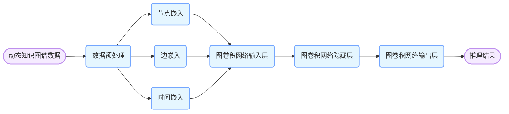

# 基于图卷积网络的动态知识图谱推理优化

> 关键词：图卷积网络、动态知识图谱、推理优化、深度学习、知识表示

> 摘要：本文聚焦于基于图卷积网络的动态知识图谱推理优化问题。首先介绍了相关背景，包括目的、预期读者、文档结构和术语表。接着阐述了核心概念与联系，通过文本示意图和 Mermaid 流程图展示。详细讲解了核心算法原理，并给出 Python 代码示例。探讨了数学模型和公式，结合实际例子说明。进行了项目实战，包括开发环境搭建、源代码实现与解读。分析了实际应用场景，推荐了相关工具和资源。最后总结了未来发展趋势与挑战，提供了常见问题解答和扩展阅读参考资料。旨在为研究者和开发者在动态知识图谱推理优化领域提供全面的技术指导。

## 1. 背景介绍 
### 1.1 目的和范围
知识图谱作为一种语义网络，能够以结构化的方式表示现实世界中的实体及其关系。动态知识图谱则进一步考虑了知识随时间的变化，更贴合实际应用场景。图卷积网络（Graph Convolutional Network, GCN）是一种强大的图神经网络，能够有效处理图结构数据。本研究的目的在于利用图卷积网络对动态知识图谱的推理进行优化，提高推理的准确性和效率。范围涵盖了从核心概念的阐述、算法原理的推导、数学模型的构建，到实际项目的开发和应用场景的分析。

### 1.2 预期读者
本文预期读者包括计算机科学领域的研究者、人工智能和机器学习方向的学生、从事知识图谱相关开发的工程师等。对于对图神经网络和知识图谱推理感兴趣，希望深入了解动态知识图谱推理优化技术的人员具有较高的参考价值。

### 1.3 文档结构概述
本文首先介绍背景信息，让读者了解研究的目的和相关概念。接着阐述核心概念与联系，帮助读者建立起理论基础。详细讲解核心算法原理和具体操作步骤，并给出 Python 代码示例。通过数学模型和公式进一步深入分析，结合实际例子加深理解。进行项目实战，包括开发环境搭建、源代码实现和解读。分析实际应用场景，为读者提供应用思路。推荐相关的工具和资源，方便读者进一步学习和研究。最后总结未来发展趋势与挑战，解答常见问题，并提供扩展阅读参考资料。

### 1.4 术语表
#### 1.4.1 核心术语定义
- **知识图谱（Knowledge Graph）**：一种语义网络，用图的形式表示实体及其之间的关系，节点表示实体，边表示关系。
- **动态知识图谱（Dynamic Knowledge Graph）**：在知识图谱的基础上，考虑了知识随时间的变化，每个事实可能有对应的时间戳。
- **图卷积网络（Graph Convolutional Network, GCN）**：一种用于处理图结构数据的神经网络，通过聚合节点及其邻居的特征来更新节点的表示。
- **知识图谱推理（Knowledge Graph Reasoning）**：根据知识图谱中已有的知识，推断出新的事实或关系的过程。

#### 1.4.2 相关概念解释
- **节点嵌入（Node Embedding）**：将图中的节点映射到低维向量空间，使得节点的向量表示能够反映其在图中的结构和语义信息。
- **边嵌入（Edge Embedding）**：类似节点嵌入，将图中的边映射到低维向量空间，用于表示边的关系类型。
- **时间嵌入（Time Embedding）**：在动态知识图谱中，将时间信息映射到低维向量空间，用于表示时间的特征。

#### 1.4.3 缩略词列表
- **GCN**：Graph Convolutional Network（图卷积网络）
- **KG**：Knowledge Graph（知识图谱）
- **DKG**：Dynamic Knowledge Graph（动态知识图谱）

## 2. 核心概念与联系 

### 核心概念原理
#### 知识图谱
知识图谱是一种以图的形式表示知识的结构，由节点和边组成。节点代表实体，如人物、地点、事件等；边代表实体之间的关系，如“出生于”、“任职于”等。例如，在一个简单的知识图谱中，有节点“李白”和“唐朝”，边“出生于”连接这两个节点，表示李白出生于唐朝。

#### 动态知识图谱
动态知识图谱在知识图谱的基础上引入了时间维度。每个事实（三元组：头实体、关系、尾实体）都有一个对应的时间戳，表示该事实在何时成立。例如，“奥巴马”和“美国总统”之间有“任职于”的关系，时间戳为 2009 - 2017 年，表示奥巴马在这个时间段内担任美国总统。

#### 图卷积网络
图卷积网络是一种用于处理图结构数据的神经网络。其核心思想是通过聚合节点及其邻居的特征来更新节点的表示。具体来说，对于图中的每个节点，GCN 会根据其邻居节点的特征和边的权重，计算出一个新的特征向量，作为该节点的更新表示。

### 架构的文本示意图
```plaintext
动态知识图谱
├── 节点（实体）
│   ├── 节点特征
│   └── 时间信息
├── 边（关系）
│   ├── 边特征
│   └── 时间信息
└── 图卷积网络
    ├── 输入层
    │   ├── 节点嵌入
    │   ├── 边嵌入
    │   └── 时间嵌入
    ├── 隐藏层
    │   ├── 图卷积操作
    │   └── 非线性激活函数
    └── 输出层
        └── 推理结果
```

### Mermaid 流程图


## 3. 核心算法原理 & 具体操作步骤 

### 核心算法原理
图卷积网络的核心操作是图卷积，其基本公式如下：
$$
H^{(l+1)} = \sigma\left(\tilde{D}^{-\frac{1}{2}}\tilde{A}\tilde{D}^{-\frac{1}{2}}H^{(l)}W^{(l)}\right)
$$
其中，$H^{(l)}$ 是第 $l$ 层的节点特征矩阵，$W^{(l)}$ 是第 $l$ 层的可学习权重矩阵，$\tilde{A} = A + I$ 是邻接矩阵 $A$ 加上自环后的矩阵，$\tilde{D}$ 是 $\tilde{A}$ 的度矩阵，$\sigma$ 是非线性激活函数，如 ReLU 函数。

在动态知识图谱推理中，我们需要考虑时间信息。可以将时间嵌入与节点嵌入和边嵌入结合起来，作为图卷积网络的输入。具体来说，对于每个三元组 $(h, r, t)$ 和时间戳 $\tau$，我们可以将其表示为 $(h_{emb}, r_{emb}, t_{emb}, \tau_{emb})$，其中 $h_{emb}$、$r_{emb}$、$t_{emb}$ 分别是头实体、关系、尾实体的嵌入，$\tau_{emb}$ 是时间嵌入。

### 具体操作步骤
1. **数据预处理**：对动态知识图谱数据进行清洗、去重等操作，提取节点、边和时间信息。
2. **嵌入生成**：使用嵌入算法（如 TransE、DistMult 等）生成节点嵌入、边嵌入和时间嵌入。
3. **构建图卷积网络**：定义图卷积网络的结构，包括输入层、隐藏层和输出层。
4. **训练模型**：使用训练数据对图卷积网络进行训练，优化模型参数。
5. **推理**：使用训练好的模型对新的三元组进行推理，判断其是否成立。

### Python 源代码示例
```python
import torch
import torch.nn as nn
import torch.nn.functional as F

# 定义图卷积层
class GraphConvolution(nn.Module):
    def __init__(self, in_features, out_features):
        super(GraphConvolution, self).__init__()
        self.weight = nn.Parameter(torch.FloatTensor(in_features, out_features))
        self.reset_parameters()

    def reset_parameters(self):
        nn.init.xavier_uniform_(self.weight)

    def forward(self, input, adj):
        support = torch.mm(input, self.weight)
        output = torch.spmm(adj, support)
        return output

# 定义图卷积网络
class GCN(nn.Module):
    def __init__(self, nfeat, nhid, nclass):
        super(GCN, self).__init__()
        self.gc1 = GraphConvolution(nfeat, nhid)
        self.gc2 = GraphConvolution(nhid, nclass)

    def forward(self, x, adj):
        x = F.relu(self.gc1(x, adj))
        x = self.gc2(x, adj)
        return F.log_softmax(x, dim=1)

# 示例数据
n_nodes = 10
n_features = 5
n_hidden = 16
n_classes = 2

# 随机生成节点特征和邻接矩阵
x = torch.randn(n_nodes, n_features)
adj = torch.randint(0, 2, (n_nodes, n_nodes)).float()

# 创建模型
model = GCN(nfeat=n_features, nhid=n_hidden, nclass=n_classes)

# 前向传播
output = model(x, adj)
print(output)
```

## 4. 数学模型和公式 & 详细讲解 & 举例说明 

### 图卷积网络的数学模型
图卷积网络的核心操作是图卷积，其数学模型可以表示为：
$$
H^{(l+1)} = \sigma\left(\tilde{D}^{-\frac{1}{2}}\tilde{A}\tilde{D}^{-\frac{1}{2}}H^{(l)}W^{(l)}\right)
$$
其中：
- $H^{(l)}$ 是第 $l$ 层的节点特征矩阵，形状为 $N \times F^{(l)}$，其中 $N$ 是节点数量，$F^{(l)}$ 是第 $l$ 层的特征维度。
- $W^{(l)}$ 是第 $l$ 层的可学习权重矩阵，形状为 $F^{(l)} \times F^{(l+1)}$。
- $\tilde{A} = A + I$ 是邻接矩阵 $A$ 加上自环后的矩阵，$A$ 的元素 $A_{ij}$ 表示节点 $i$ 和节点 $j$ 之间是否有边相连。
- $\tilde{D}$ 是 $\tilde{A}$ 的度矩阵，其对角元素 $\tilde{D}_{ii} = \sum_{j=0}^{N - 1}\tilde{A}_{ij}$。
- $\sigma$ 是非线性激活函数，如 ReLU 函数：$\text{ReLU}(x) = \max(0, x)$。

### 详细讲解
- **邻接矩阵加上自环**：在邻接矩阵 $A$ 中加上自环（即 $\tilde{A} = A + I$），是为了让每个节点在更新自身特征时能够考虑到自身的信息。
- **度矩阵归一化**：使用 $\tilde{D}^{-\frac{1}{2}}\tilde{A}\tilde{D}^{-\frac{1}{2}}$ 进行归一化，是为了平衡不同节点的邻居数量对特征更新的影响。这样可以避免邻居数量多的节点对特征更新的贡献过大。
- **线性变换**：$H^{(l)}W^{(l)}$ 是对第 $l$ 层的节点特征进行线性变换，通过学习权重矩阵 $W^{(l)}$ 来提取特征。
- **非线性激活**：使用非线性激活函数 $\sigma$ 可以增加模型的表达能力，使模型能够学习到更复杂的特征。

### 举例说明
假设有一个简单的图，包含 3 个节点，邻接矩阵 $A$ 为：
$$
A = \begin{bmatrix}
0 & 1 & 1 \\
1 & 0 & 1 \\
1 & 1 & 0
\end{bmatrix}
$$
加上自环后得到 $\tilde{A}$：
$$
\tilde{A} = \begin{bmatrix}
1 & 1 & 1 \\
1 & 1 & 1 \\
1 & 1 & 1
\end{bmatrix}
$$
$\tilde{A}$ 的度矩阵 $\tilde{D}$ 为：
$$
\tilde{D} = \begin{bmatrix}
3 & 0 & 0 \\
0 & 3 & 0 \\
0 & 0 & 3
\end{bmatrix}
$$
$\tilde{D}^{-\frac{1}{2}}$ 为：
$$
\tilde{D}^{-\frac{1}{2}} = \begin{bmatrix}
\frac{1}{\sqrt{3}} & 0 & 0 \\
0 & \frac{1}{\sqrt{3}} & 0 \\
0 & 0 & \frac{1}{\sqrt{3}}
\end{bmatrix}
$$
则 $\tilde{D}^{-\frac{1}{2}}\tilde{A}\tilde{D}^{-\frac{1}{2}}$ 为：
$$
\tilde{D}^{-\frac{1}{2}}\tilde{A}\tilde{D}^{-\frac{1}{2}} = \begin{bmatrix}
\frac{1}{3} & \frac{1}{3} & \frac{1}{3} \\
\frac{1}{3} & \frac{1}{3} & \frac{1}{3} \\
\frac{1}{3} & \frac{1}{3} & \frac{1}{3}
\end{bmatrix}
$$
假设第 $l$ 层的节点特征矩阵 $H^{(l)}$ 为：
$$
H^{(l)} = \begin{bmatrix}
1 & 2 \\
3 & 4 \\
5 & 6
\end{bmatrix}
$$
可学习权重矩阵 $W^{(l)}$ 为：
$$
W^{(l)} = \begin{bmatrix}
0.1 & 0.2 \\
0.3 & 0.4
\end{bmatrix}
$$
则 $H^{(l)}W^{(l)}$ 为：
$$
H^{(l)}W^{(l)} = \begin{bmatrix}
1\times0.1 + 2\times0.3 & 1\times0.2 + 2\times0.4 \\
3\times0.1 + 4\times0.3 & 3\times0.2 + 4\times0.4 \\
5\times0.1 + 6\times0.3 & 5\times0.2 + 6\times0.4
\end{bmatrix} = \begin{bmatrix}
0.7 & 1 \\
1.5 & 2.2 \\
2.3 & 3.4
\end{bmatrix}
$$
$\tilde{D}^{-\frac{1}{2}}\tilde{A}\tilde{D}^{-\frac{1}{2}}H^{(l)}W^{(l)}$ 为：
$$
\begin{bmatrix}
\frac{1}{3} & \frac{1}{3} & \frac{1}{3} \\
\frac{1}{3} & \frac{1}{3} & \frac{1}{3} \\
\frac{1}{3} & \frac{1}{3} & \frac{1}{3}
\end{bmatrix} \begin{bmatrix}
0.7 & 1 \\
1.5 & 2.2 \\
2.3 & 3.4
\end{bmatrix} = \begin{bmatrix}
\frac{0.7 + 1.5 + 2.3}{3} & \frac{1 + 2.2 + 3.4}{3} \\
\frac{0.7 + 1.5 + 2.3}{3} & \frac{1 + 2.2 + 3.4}{3} \\
\frac{0.7 + 1.5 + 2.3}{3} & \frac{1 + 2.2 + 3.4}{3}
\end{bmatrix} = \begin{bmatrix}
1.5 & 2.2 \\
1.5 & 2.2 \\
1.5 & 2.2
\end{bmatrix}
$$
假设使用 ReLU 作为激活函数，则 $H^{(l+1)} = \text{ReLU}\left(\tilde{D}^{-\frac{1}{2}}\tilde{A}\tilde{D}^{-\frac{1}{2}}H^{(l)}W^{(l)}\right)$ 为：
$$
H^{(l+1)} = \begin{bmatrix}
1.5 & 2.2 \\
1.5 & 2.2 \\
1.5 & 2.2
\end{bmatrix}
$$

## 5. 项目实战：代码实际案例和详细解释说明 

### 5.1  开发环境搭建
#### 安装 Python
首先需要安装 Python 环境，建议使用 Python 3.7 及以上版本。可以从 Python 官方网站（https://www.python.org/downloads/）下载并安装。

#### 安装依赖库
使用 `pip` 安装所需的依赖库，包括 `torch`、`torch-geometric` 等。
```bash
pip install torch torch-geometric
```

### 5.2  源代码详细实现和代码解读
```python
import torch
import torch.nn.functional as F
from torch_geometric.nn import GCNConv

# 定义图卷积网络模型
class GCNModel(torch.nn.Module):
    def __init__(self, in_channels, hidden_channels, out_channels):
        super(GCNModel, self).__init__()
        # 第一层图卷积层
        self.conv1 = GCNConv(in_channels, hidden_channels)
        # 第二层图卷积层
        self.conv2 = GCNConv(hidden_channels, out_channels)

    def forward(self, x, edge_index):
        # 第一层图卷积操作
        x = self.conv1(x, edge_index)
        # 使用 ReLU 激活函数
        x = F.relu(x)
        # 随机失活，防止过拟合
        x = F.dropout(x, training=self.training)
        # 第二层图卷积操作
        x = self.conv2(x, edge_index)
        return F.log_softmax(x, dim=1)

# 示例数据
# 节点特征矩阵
x = torch.tensor([[1.0, 2.0], [3.0, 4.0], [5.0, 6.0]], dtype=torch.float)
# 边索引矩阵
edge_index = torch.tensor([[0, 1, 1, 2], [1, 0, 2, 1]], dtype=torch.long)
# 节点标签
y = torch.tensor([0, 1, 0], dtype=torch.long)

# 创建模型实例
model = GCNModel(in_channels=2, hidden_channels=16, out_channels=2)

# 定义优化器
optimizer = torch.optim.Adam(model.parameters(), lr=0.01, weight_decay=5e-4)

# 训练模型
def train():
    model.train()
    optimizer.zero_grad()
    out = model(x, edge_index)
    loss = F.nll_loss(out, y)
    loss.backward()
    optimizer.step()
    return loss.item()

# 训练 200 个 epoch
for epoch in range(200):
    loss = train()
    print(f'Epoch: {epoch+1}, Loss: {loss:.4f}')

# 测试模型
model.eval()
_, pred = model(x, edge_index).max(dim=1)
correct = int(pred.eq(y).sum().item())
acc = correct / len(y)
print(f'Accuracy: {acc:.4f}')
```

### 5.3  代码解读与分析
- **模型定义**：`GCNModel` 类继承自 `torch.nn.Module`，定义了一个两层的图卷积网络。第一层图卷积层 `conv1` 将输入特征维度从 `in_channels` 转换为 `hidden_channels`，第二层图卷积层 `conv2` 将特征维度从 `hidden_channels` 转换为 `out_channels`。
- **前向传播**：在 `forward` 方法中，首先通过第一层图卷积层 `conv1` 进行特征转换，然后使用 ReLU 激活函数增加模型的非线性表达能力，接着使用 `F.dropout` 进行随机失活，防止过拟合，最后通过第二层图卷积层 `conv2` 得到输出，并使用 `F.log_softmax` 进行归一化。
- **训练过程**：在 `train` 函数中，首先将模型设置为训练模式，然后清空优化器的梯度，通过模型进行前向传播得到输出，计算损失函数（使用负对数似然损失 `F.nll_loss`），然后进行反向传播更新模型参数。
- **测试过程**：将模型设置为评估模式，通过模型进行前向传播得到预测结果，计算预测准确率。

## 6. 实际应用场景 
### 智能问答系统
在智能问答系统中，动态知识图谱可以存储大量的知识信息，包括实体及其关系、事件的时间信息等。基于图卷积网络的推理优化可以帮助系统更准确地理解用户的问题，并根据知识图谱中的信息进行推理和回答。例如，当用户询问“奥巴马在什么时候担任美国总统？”，系统可以通过推理优化算法在动态知识图谱中查找相关信息，并给出准确的回答。

### 推荐系统
在推荐系统中，动态知识图谱可以表示用户、物品和它们之间的关系，以及这些关系随时间的变化。通过图卷积网络的推理优化，可以更好地捕捉用户的兴趣和行为模式，提高推荐的准确性和个性化程度。例如，根据用户过去的购买记录和时间信息，结合知识图谱中物品的属性和关系，为用户推荐更符合其当前需求的物品。

### 金融风险预测
在金融领域，动态知识图谱可以整合各种金融实体（如企业、银行、投资者等）之间的关系和交易信息，以及宏观经济数据的时间变化。基于图卷积网络的推理优化可以帮助分析金融风险，预测企业的违约可能性、市场趋势等。例如，通过分析企业之间的股权关系、资金流动和时间序列数据，预测企业的财务状况和潜在风险。

### 医疗诊断
在医疗领域，动态知识图谱可以存储患者的病历信息、疾病的症状和治疗方案、医学研究成果等，并且考虑这些信息随时间的变化。图卷积网络的推理优化可以辅助医生进行疾病诊断和治疗决策。例如，根据患者的症状历史、检查结果和时间信息，结合知识图谱中的医学知识，推理出可能的疾病和最佳治疗方案。

## 7. 工具和资源推荐
### 7.1 学习资源推荐
#### 7.1.1 书籍推荐
- 《深度学习》（Deep Learning）：由 Ian Goodfellow、Yoshua Bengio 和 Aaron Courville 撰写，是深度学习领域的经典教材，涵盖了神经网络、卷积神经网络、循环神经网络等内容。
- 《图神经网络：基础、前沿与应用》：介绍了图神经网络的基本概念、算法和应用，包括图卷积网络、图注意力网络等。
- 《知识图谱：方法、实践与应用》：详细介绍了知识图谱的构建、表示、推理和应用等方面的知识。

#### 7.1.2 在线课程
- Coursera 上的“Deep Learning Specialization”：由 Andrew Ng 教授授课，全面介绍了深度学习的基础知识和应用。
- edX 上的“Graph Neural Networks”：专门讲解图神经网络的课程，包括理论和实践。
- B 站等平台上有很多关于知识图谱和图卷积网络的视频教程，适合初学者入门。

#### 7.1.3 技术博客和网站
- Medium：有很多关于人工智能、深度学习和知识图谱的高质量博客文章。
- arXiv：可以获取最新的学术研究论文，包括图卷积网络和动态知识图谱推理的相关研究。
- 机器之心、新智元等科技媒体网站，会发布一些关于前沿技术的解读和分析。

### 7.2 开发工具框架推荐
#### 7.2.1 IDE和编辑器
- PyCharm：功能强大的 Python 集成开发环境，支持代码编辑、调试、版本控制等功能。
- Jupyter Notebook：交互式的编程环境，适合进行数据探索、模型训练和实验。
- Visual Studio Code：轻量级的代码编辑器，支持多种编程语言和插件扩展。

#### 7.2.2 调试和性能分析工具
- PyTorch Profiler：可以对 PyTorch 模型进行性能分析，找出性能瓶颈。
- TensorBoard：可以可视化训练过程中的损失函数、准确率等指标，方便调试模型。
- cProfile：Python 自带的性能分析工具，可以分析代码的运行时间和函数调用次数。

#### 7.2.3 相关框架和库
- PyTorch：开源的深度学习框架，提供了丰富的神经网络层和优化算法，支持图卷积网络的实现。
- torch-geometric：基于 PyTorch 的图神经网络库，提供了图卷积层、图数据加载器等功能，方便开发图神经网络模型。
- DGL（Deep Graph Library）：另一个流行的图神经网络库，支持多种图神经网络架构和高效的图计算。

### 7.3 相关论文著作推荐
#### 7.3.1 经典论文
- “Semi-Supervised Classification with Graph Convolutional Networks”：提出了图卷积网络的经典模型，为后续的研究奠定了基础。
- “TransE: Translating Embeddings for Modeling Multi-relational Data”：介绍了 TransE 算法，用于知识图谱的实体和关系嵌入。
- “Temporal Knowledge Graph Completion via Time-Aware Embedding”：研究了动态知识图谱的补全问题，提出了时间感知的嵌入方法。

#### 7.3.2 最新研究成果
- 可以在 arXiv、ACM Digital Library、IEEE Xplore 等学术数据库中搜索关于基于图卷积网络的动态知识图谱推理优化的最新研究论文。
- 关注顶级学术会议，如 NeurIPS、ICML、KDD 等，这些会议会发表该领域的最新研究成果。

#### 7.3.3 应用案例分析
- 一些企业和研究机构会发布关于动态知识图谱在实际应用中的案例分析，如 Google、Microsoft 等公司的技术博客。
- 可以在相关的学术会议和期刊上查找应用案例的论文，了解动态知识图谱在不同领域的应用实践。

## 8. 总结：未来发展趋势与挑战
### 未来发展趋势
- **多模态融合**：将文本、图像、视频等多模态信息融入动态知识图谱，结合图卷积网络进行推理优化，能够更全面地表示和理解现实世界的知识。
- **强化学习与推理结合**：利用强化学习的方法来优化动态知识图谱的推理过程，通过智能体与环境的交互，不断调整推理策略，提高推理的效率和准确性。
- **联邦学习下的动态知识图谱推理**：在数据隐私保护的前提下，通过联邦学习的方式，让多个参与方在不共享原始数据的情况下，共同训练动态知识图谱推理模型，实现数据的共享和利用。
- **实时推理与在线学习**：随着动态知识图谱数据的实时更新，需要开发能够进行实时推理和在线学习的模型，及时捕捉知识的变化并更新推理结果。

### 挑战
- **数据质量和规模**：动态知识图谱的数据来源广泛，数据质量参差不齐，需要有效的数据清洗和预处理方法。同时，大规模的动态知识图谱对存储和计算资源提出了很高的要求。
- **时间信息处理**：如何有效地表示和处理动态知识图谱中的时间信息，是一个具有挑战性的问题。目前的方法还存在一定的局限性，需要进一步研究和改进。
- **模型可解释性**：图卷积网络等深度学习模型通常是黑盒模型，缺乏可解释性。在一些对解释性要求较高的应用场景中，如医疗诊断和金融风险预测，需要提高模型的可解释性。
- **计算效率**：随着动态知识图谱的规模不断增大，图卷积网络的计算复杂度也会增加。如何提高模型的计算效率，减少推理时间，是一个亟待解决的问题。

## 9. 附录：常见问题与解答
### 1. 图卷积网络和传统神经网络有什么区别？
传统神经网络通常处理的是欧几里得空间的数据，如图像、文本等，其输入数据具有规则的结构。而图卷积网络处理的是图结构数据，节点之间的连接关系是不规则的。图卷积网络通过聚合节点及其邻居的特征来更新节点的表示，能够更好地捕捉图中的结构信息。

### 2. 如何选择合适的嵌入算法生成节点、边和时间嵌入？
选择嵌入算法需要考虑数据的特点和任务的需求。对于知识图谱嵌入，TransE 算法简单高效，适用于处理大规模知识图谱；DistMult 算法可以处理多对多的关系；ComplEx 算法在处理对称和反对称关系方面表现较好。对于时间嵌入，可以根据时间的离散性或连续性选择合适的嵌入方法，如将时间戳转换为向量表示。

### 3. 如何评估动态知识图谱推理模型的性能？
可以使用准确率、召回率、F1 值等指标来评估推理模型的性能。对于动态知识图谱，还可以考虑时间维度的准确性，如预测的事实在时间上的正确性。此外，还可以使用 AUC（Area Under the Curve）、MRR（Mean Reciprocal Rank）等指标来评估模型的排序性能。

### 4. 图卷积网络容易过拟合吗？如何解决过拟合问题？
图卷积网络在训练数据较少或模型复杂度较高时容易过拟合。可以采用以下方法解决过拟合问题：
- **增加训练数据**：收集更多的动态知识图谱数据进行训练。
- **正则化**：在损失函数中添加正则化项，如 L1 或 L2 正则化。
- **随机失活（Dropout）**：在模型的隐藏层中使用 Dropout 层，随机丢弃一些神经元，防止模型对特定特征的过度依赖。
- **早停策略**：在训练过程中，监测验证集的性能，当验证集的性能不再提升时，停止训练。

## 10. 扩展阅读 & 参考资料
### 扩展阅读
- 《神经网络与深度学习》：进一步深入学习神经网络的原理和应用。
- 《人工智能：一种现代的方法》：全面介绍人工智能的各个领域，包括知识表示、推理和机器学习等。
- 《图算法》：学习图算法的基本概念和实现方法，有助于更好地理解图卷积网络。

### 参考资料
- Kipf, T. N., & Welling, M. (2016). Semi-Supervised Classification with Graph Convolutional Networks. arXiv preprint arXiv:1609.02907.
- Bordes, A., Usunier, N., Garcia-Duran, A., Weston, J., & Yakhnenko, O. (2013). Translating embeddings for modeling multi-relational data. Advances in neural information processing systems.
- Dasgupta, S., Zaheer, M., & Ahmed, A. (2018). Temporal Knowledge Graph Completion via Time-Aware Embedding. arXiv preprint arXiv:1809.03202.

作者：AI天才研究院/AI Genius Institute & 禅与计算机程序设计艺术 /Zen And The Art of Computer Programming